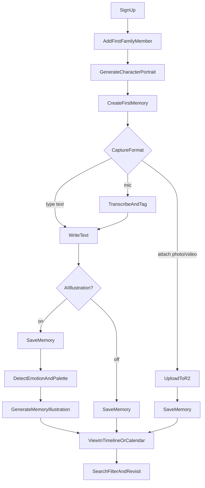
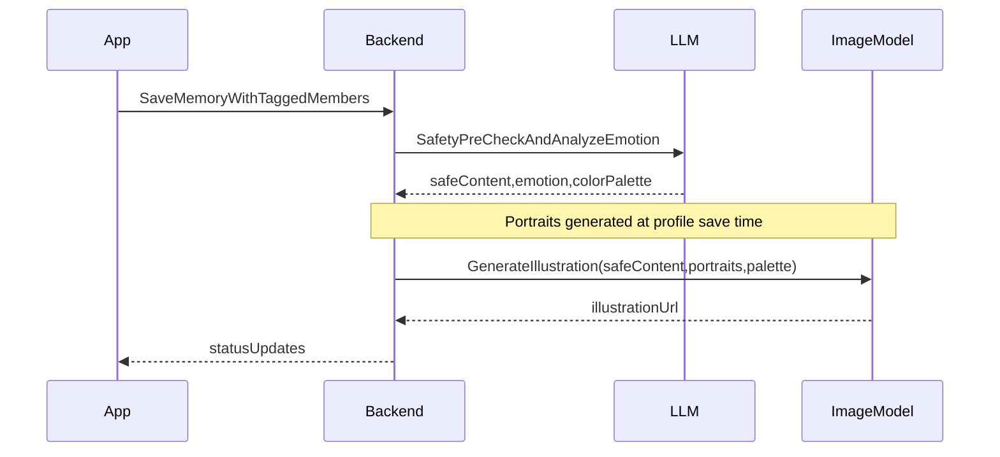
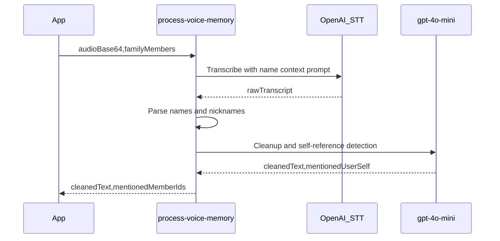
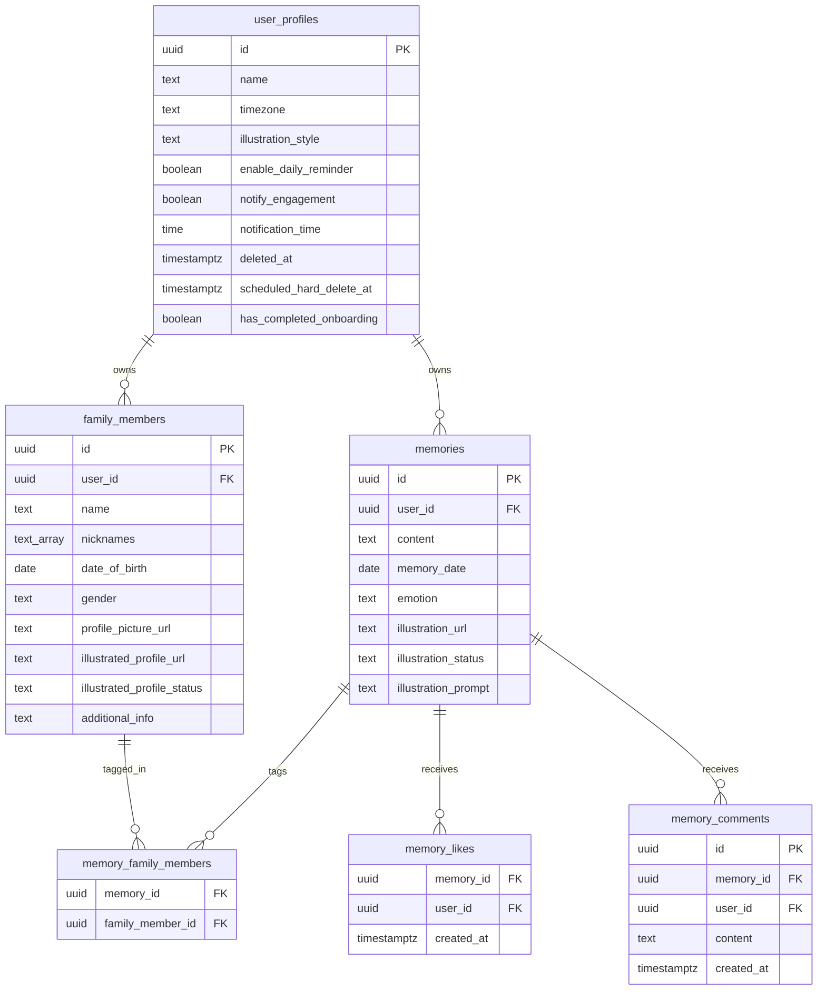
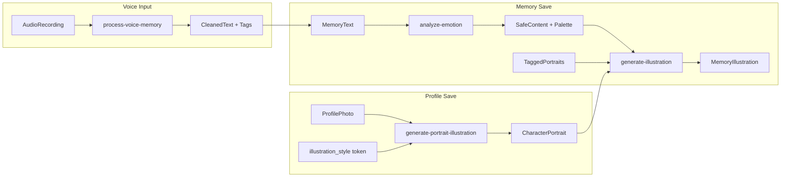
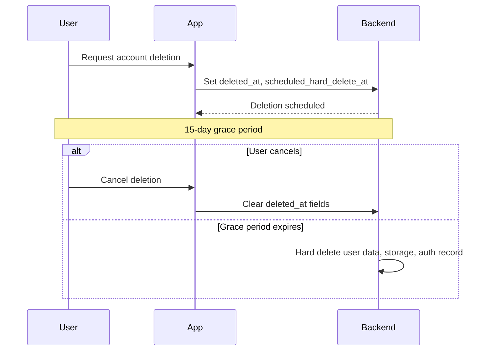

# Momora — Product Requirements Document

**Version:** 1.0
**Status:** Draft
**Last updated:** May 24, 2026
**Platform:** iOS & Android (Expo)

---

## 1. Executive Summary

Momora is a memory journal for parents of young children. It helps them capture and preserve family moments in whatever form makes sense — a quick text note, a voice dictation, or an attached photo or video — and enriches written memories with AI-generated illustrations featuring consistent, age-aware family characters.

The core insight: not every precious moment can be photographed. Some happen too fast, or parents are too busy to reach for a camera. Momora **fills the gaps** — providing a fast, frictionless way to capture moments that the camera would have missed, while also welcoming the ones it caught. When a moment is written down, AI illustrations act as **memory anchors**, helping parents relive how a moment *felt* rather than just what it looked like.

---

## 2. Problem & Opportunity

### Problem Statement

Parents often miss capturing precious moments with their children because:

- These moments happen spontaneously and are difficult to photograph or video
- Parents are often busy or distracted when these moments occur
- Traditional photo/video methods don't capture the emotional essence of these interactions

### Why Now

- Parents are time-constrained; frictionless capture (voice + text) fits real life
- Phone cameras fail for in-the-moment capture — by the time you unlock and frame, the moment is gone
- Generative AI can produce consistent, age-appropriate family characters that grow with your children

### Competitive Gap

| Category | Examples | Gap |
|----------|----------|-----|
| Photo journals | Day One, Tinybeans | Require photos; can't capture moments that happen too fast to photograph |
| Generic AI art | Midjourney, DALL-E apps | No family character continuity; no journaling or memory context |
| **Momora** | — | Text/voice/media capture + persistent family characters + emotional illustrations — one place for every kind of memory |

---

## 3. Product Principles

These principles guide MVP tradeoffs:

1. **Capture first** — Creating a memory must be faster than opening the camera roll.
2. **Fill the gaps** — Parents can't always capture moments with a camera. Momora's value is being there for those moments — and welcoming the ones the camera did catch.
3. **Characters are identity** — Family portraits are generated once and reused; consistency matters more than one-off prettiness.
4. **Gentle structure** — Timeline, calendar, and search help rediscovery without turning journaling into admin work.
5. **Privacy by default** — Child data is sensitive; no public sharing in MVP.
6. **Honest AI** — Show generation status, handle failures gracefully, never block saving text.

---

## 4. Target Users & Personas

### Personas

| Persona | Description | Primary need |
|---------|-------------|--------------|
| **Primary — Busy Parent** | Parent of child(ren) 0–10, often multitasking | Quick capture + emotional replay |
| **Secondary — Co-parent** | Partner who journals occasionally | Simple tagging + shared family cast (future) |
| **Out of MVP — Extended family** | Grandparents, aunts/uncles | Read-only shared access (post-MVP) |

### Jobs-to-be-Done

**Busy Parent**

- When my kid says something funny at bedtime, I want to log it in under a minute so I can laugh about it later.
- When I'm driving or cooking, I want to dictate a memory hands-free so I don't lose the moment.
- When I caught a great moment on video, I want to save it in my journal with a note so it lives alongside my other memories instead of getting lost in my camera roll.
- When I'm feeling nostalgic, I want to scroll through illustrated memories so I can reconnect with how parenting felt at that stage.

**Co-parent (future-focused)**

- When my partner captures a memory, I want to see our child represented consistently so the journal feels like *our* family's story.
- When I occasionally journal, I want tagging to be simple so I don't have to remember how the app works.

---

## 5. Core User Journeys

### Journey Overview



### Journey A — Onboarding (Critical Path)

1. Sign up with email/password
2. Prompt to add **first family member** — nudge: *"Add your child first — Momora is about capturing their moments"*
3. First family member requires a profile photo → AI character portrait generates asynchronously
4. Optional: parent/co-parent profile can be added later (not required at signup)
5. Guided first memory creation → first illustration generates
6. Land on timeline with "aha" moment

**Activation definition:** User completes onboarding when they have ≥1 family member and ≥1 saved memory. Portrait/illustration readiness is tracked separately and never blocks saving a memory.

### Journey B — Daily Capture (Text, Voice, or Media)

1. Open app → tap New Memory
2. Choose capture format:
   - **Type/paste** text directly, or
   - Tap **mic** → speak → review transcribed text, or
   - Tap **attach icon** → pick photo or video from camera roll
3. Tag family members (auto-suggested from voice when applicable)
4. For text entries: AI illustration toggle is on by default; turn off for text-only note. Tagging more than 6 family members automatically turns it off until the count returns to 6 or fewer.
5. For media entries: AI toggle is hidden; save directly
6. Save → async illustration generation fires only for `text_illustration` type
7. Optional: daily push reminder at user-configured local time

### Journey C — Revisit

1. Browse timeline or calendar tile → open memory detail
2. Search or filter by date range, family member, or emotion
3. Like a memory or open its comments to respond with the household

---

## 6. MVP Feature Requirements

Each feature includes user stories, acceptance criteria, and deferred scope.

### 6.1 User Authentication

**User stories**

- As a parent, I can sign up with email and password so I can start journaling privately.
- As a parent, I can log in, reset my password, and manage my account profile.
- As a parent, I can delete my account with a grace period to change my mind.

**Acceptance criteria**

- Email/password authentication via Supabase Auth
- Password reset email flow
- Account profile fields: display name, timezone (required for notification scheduling)
- Session persistence across app restarts
- Logout available in settings
- **Account deletion:** 15-day grace period
  - Sets `deleted_at` and `scheduled_hard_delete_at = now() + 15 days`
  - User can cancel deletion within the grace window
  - Scheduled job hard-deletes account and all associated data after grace period expires

**Deferred:** Apple/Google SSO, magic links

---

### 6.2 Family Profiles

**User stories**

- As a parent, I can create profiles for my children and family members so memories tag the right people and illustrations use consistent characters.
- As a parent, I am nudged to add my child first during onboarding because Momora is about their moments.

**Profile fields (MVP)**

| Field | Required | Notes |
|-------|----------|-------|
| Name | Yes | |
| Nicknames | No | Array; used for voice tagging and future smart tagging |
| Date of birth | Yes for children; optional for adults | Drives age display and age-appropriate illustrations |
| Gender | No | Used in portrait/illustration prompts |
| Profile photo | Yes | Required for character generation |
| Notes | No | Freeform additional context |

**Computed / derived**

- Age display from DOB (e.g., "3 years, 2 months")
- Character portrait status: `pending | generating | ready | failed`

**Acceptance criteria**

- Full CRUD for family members
- At least **one family member profile** required before journaling (any member — child or adult)
- Onboarding **nudges user to add a child first**
- Parent/co-parent profile is optional at signup; can be added later
- Profile photo required for character generation on any illustrated member
- Every new or updated profile photo creates a dated, immutable source-photo/portrait pair; existing pairs remain available
- Library EXIF capture dates prefill the portrait date when trustworthy; users can correct it or backdate older photos
- A portrait timeline shows the paired source/illustrated images and the member's age at each date
- Portrait generation is asynchronous; adding a new version or regenerating one never hides the last ready portrait on failure
- Memories use the latest ready portrait on or before `memory_date`; when none exists, they use the earliest ready portrait after the date, then an undated migrated legacy portrait
- Timeline and memory-detail family chips use the same date-aware portrait selection as generation
- Portrait dates cannot precede DOB or exceed the acting user's local current date
- Edit profile fields without forcing portrait generation when no photo is added
- User can manually retry failed portrait generation

**Deferred:** Pets, shared co-parent accounts, LORA/custom character training

---

### 6.3 Journal Entries (Memories)

**User stories**

- As a parent, I can write, backdate, edit, delete, and tag family members in memories.
- As a parent, my memory text is always saved even if illustration generation fails.
- As a parent, I can attach a photo or video from my camera roll to a memory so I can store moments I captured alongside moments I had to write down.
- As a parent, I can save a plain text note without triggering AI illustration.

**Memory types**

Memories support three formats, derived from what the user provides — no upfront type selector:

| Type | Text | Media | AI illustration |
|------|------|-------|-----------------|
| `text_illustration` | Required | None | Yes — async after save |
| `text_only` | Required | None | No |
| `media` | Optional caption | 1-10 photos/videos | No |

**Emergent type UX:** The new-memory form always shows the text field and a media attach icon in the toolbar.

- Attaching one or more photos/videos → `media` type; AI illustration toggle is hidden.
- No media attached, AI toggle **off** → `text_only`.
- No media attached, AI toggle **on** (default) → `text_illustration`.

**Acceptance criteria**

- Memory date defaults to today; backdating allowed. When creating a `media` memory from library photos, the date pre-fills to the earliest valid EXIF capture date across the attached photos, shown as a visible, user-overridable suggestion (labeled "From photo"); it falls back to today when no attached photo has usable capture-date metadata. Manually changing the date always wins for the rest of that composer session. Camera captures, videos, web picks, and incoming shared media never change the date on their own. See [docs/features/media-memories.md](./features/media-memories.md).
- Text content required for `text_illustration` and `text_only`; optional caption for `media` type
- Optional: tagged family members (multi-select, no global maximum). AI-illustrated memories support at most **6 tagged members**; text-only and media memories may tag the full family roster.
- **Plain text only** — line breaks for paragraphs; no bold, italic, or rich text
- Photo attachment: JPEG, HEIC, PNG, or WEBP; ≤ 20 MB
- Video attachment: MP4 or MOV; ≤ 60 seconds duration; client validates duration before upload
- Up to **10 media assets per memory**; photos and videos can be mixed and reordered
- Explicit Save required (autosave draft optional enhancement)
- Edit and delete with confirmation dialog
- Edit allows switching between AI-illustrated and text-only. Turning AI off hides but retains any existing illustration; turning it back on restores the retained image, or generates one after save when none exists. AI remains unavailable above 6 tags.
- For `text_illustration` type: memory text persists even if illustration generation fails
- Voice input available as alternate input method (see §6.7); transcribed text remains editable before save

**Deferred:** Milestone auto-detection

---

### 6.4 Memory Visualization

The core product differentiator. Each memory receives an AI-generated illustration featuring tagged family members as consistent characters.

#### Illustration Pipeline



#### Portrait Generation (per family member)

Triggered for each dated portrait version created from a new profile photo.

| Input | Description |
|-------|-------------|
| Profile photo | User-uploaded reference |
| Age / gender | From profile fields |
| Style token | From `families.illustration_style` |

**Style system**

- MVP ships with a **single global style** (`illustration_style: 'default'`)
- Style is stored as a **token** on `families` — architecture supports adding more styles post-MVP without schema changes
- Style reference image mapped from token server-side

**Model:** OpenAI `gpt-image-2` (fallback: `gpt-image-1`) via image edit endpoint with style reference

**Output:** unique R2 portrait key and generation status on `family_member_portrait_versions`

#### Memory Illustration Generation

Triggered after memory save.

| Step | Description |
|------|-------------|
| 1. Safety pre-check | LLM rewrites content that may violate image safety policies into a child-appropriate scene description |
| 2. Emotion detection | LLM returns emotion label + color palette string |
| 3. Image generation | Uses tagged members' character portraits as reference anchors + emotion palette in prompt |

**Model:** OpenAI `gpt-image-2` (fallback: `gpt-image-1`)

**Output:** `illustration_url`, `emotion`, `illustration_status` on `memories`

**Status values:** `pending | generating | ready | failed`

**Acceptance criteria**

- Illustration reflects tagged characters when portraits are ready
- Age-appropriate character depiction based on DOB at memory date
- Emotion influences palette/mood in the generation prompt
- User sees loading/progress state; can navigate away while generating
- Failed generation shows friendly error with manual retry option
- Max **6 tagged members** for an AI-illustrated memory, enforced in UI and backend. Text-only and media memories have no tag-count cap.

**Implementation note:** Exact `gpt-image-2` API surface (edit vs. generate, reference image limits) to be confirmed during build.

---

### 6.5 Memory Organization

**User stories**

- As a parent, I can browse, search, and filter memories to relive moments with my family.

**Views**

| View | Behavior |
|------|----------|
| **Timeline** | Reverse-chronological list. Card shows: date, text excerpt, illustration thumbnail, tagged member avatars, emotion chip |
| **Calendar** | Month grid with daily tiles for days that have entries. Tile shows primary illustration for that day |
| **Search** | Full-text search on memory content |
| **Filters** | Date range, family member, emotion — composable |

**Acceptance criteria**

- Empty states with clear CTAs (e.g., "Add your first memory")
- Memory detail screen: full text, illustration, date, tagged members, emotion, edit/delete actions
- Filters composable (e.g., member + date range together)
- Calendar navigates to day's memories or memory detail

**Deferred:** Monthly/yearly AI summaries, printable books, streaks/gamification

---

### 6.6 Notifications

**User stories**

- As a parent, I receive a daily reminder at my chosen local time to capture a memory.

**Acceptance criteria**

- Opt-in push notification permission flow on first enable
- User sets preferred reminder time; timezone stored on profile (auto-detected, user-editable)
- Server cron job matches user's local time and sends via Expo Push API
- Tapping notification opens new-memory flow
- Reminder can be disabled in settings

**Deferred:** Credit-gated reminders, custom frequency, smart prompts based on past entries

---

### 6.7 Voice-to-Text Journaling

**User stories**

- As a busy parent, I can dictate a memory hands-free and have it transcribed into editable text so I can capture moments without typing.

#### UX Flow

1. User taps mic button to **start** recording; taps again to **stop**
2. App requests microphone permission on first use
3. Recording auto-stops at **2-minute max** with user notification
4. Processing state shown while audio is sent to backend
5. Transcribed + cleaned text populates memory field; suggested family tags pre-selected
6. User reviews/edits text and tags before saving

#### Backend Pipeline



| Step | Detail |
|------|--------|
| Input | Base64 audio + family member list (`id`, `name`, `nicknames`, `is_user_profile`) |
| Transcription | OpenAI Speech-to-Text (`gpt-4o-mini-transcribe`) with contextual prompt built from family names/nicknames |
| Name tagging | Server-side parse of transcript for names/nicknames → `mentionedMemberIds` |
| Cleanup | `gpt-4o-mini` returns `{ cleanedText, mentionedUserSelf }`; adds user profile ID if self-reference detected |
| Output | `{ cleanedText, mentionedMemberIds }` to client |

**Acceptance criteria**

- Mic button visible on new and edit memory screens
- **Tap-to-start / tap-to-stop** recording interaction
- **Max recording length: 2 minutes** (auto-stop + user message)
- Recording via `expo-audio` (Expo SDK 56)
- Transcription completes in < 15s p95 for typical 30–60s clips
- Transcribed text is editable; user confirms before save
- Auto-tag suggestions are overridable
- Graceful errors: permission denied, network failure, empty/unclear audio
- **Audio is not persisted** after processing; only final text is stored

**Deferred:** Real-time streaming transcription, multi-language support, offline transcription

---

### 6.8 Likes & Comments

**User stories**

- As any household member, including a viewer, I can like and comment on a memory so I can respond without changing the journal entry.
- As a memory creator, I can receive an optional engagement notification and open the relevant memory directly.

**Acceptance criteria**

- Timeline and memory detail show outline heart and comment actions; tapping the heart fills it with a lightweight animation and haptic feedback.
- Non-zero like/comment counts appear beside their icons; zero counts stay hidden and counts are not tappable liker lists.
- Comment from Timeline opens memory detail and its bottom drawer. Comment from detail opens the same drawer in place.
- The drawer lists comments oldest-to-newest with household account name and compact relative timestamp, and keeps its plain-text composer visible above the keyboard.
- Comments are 1–1000 trimmed characters. There are no replies, mentions, attachments, or edits.
- Comment authors can delete their own comments; household owners/managers can delete any comment. Viewers may like, comment, and delete only their own comments.
- Like/comment mutations update optimistically for the actor. Other devices refresh on screen focus, drawer open, or pull-to-refresh; no Realtime subscription is required.
- A single Settings toggle, **Likes & comments**, controls engagement pushes and defaults on. Only the memory creator is notified, never for their own action.
- Notification copy contains no memory, comment, or child content. Tapping it opens the memory detail screen.
- Removing a member preserves their existing engagement attribution; hard account deletion removes that account's likes and comments.

**Deferred:** Liker lists, comment editing, threads/replies, mentions, attachments, reaction types, Realtime engagement updates

---

## 7. Explicit MVP Out-of-Scope

The following are **post-MVP**. They must not block or expand MVP scope:

- Monetization / subscriptions / credits
- Family sharing & collaboration
- Data export / backup (JSON, ZIP)
- Photo-based illustration generation (using user-uploaded photos as AI image-generation input for portraits and illustrations — distinct from storing photos/videos as memory attachments, which is now in-scope; see §6.3)
- Monthly story summaries
- Social sharing / watermarked exports
- Pets as family members
- SSO providers (Apple, Google)
- Web app
- Printable books
- Multiple illustration styles (UI selection — token architecture is in place)

---

## 8. Non-Functional Requirements

| Category | Requirement |
|----------|-------------|
| **Platforms** | iOS + Android via Expo SDK 56 (React Native 0.85, React 19.2) |
| **Build tooling** | EAS Build with development client (Expo Go not on app stores for SDK 56 as of May 2026) |
| **Min OS** | iOS 16.4+, Android 7+ (API 24+) |
| **Performance** | Memory save < 2s; voice transcription < 15s p95 (30–60s clips); illustration async < 60s p95 |
| **Privacy** | COPPA-aware UX copy; minimal child PII; private image storage; clear privacy policy |
| **Security** | RLS on all user data; signed URLs for private images; no client-side API keys |
| **Reliability** | Text always saved even if AI fails; idempotent generation jobs |
| **Accessibility** | Dynamic type support, sufficient contrast, screen reader labels on core flows |
| **Localization** | English-only MVP; i18n-ready string architecture |

---

## 9. Success Metrics

### Activation

| Metric | Target (beta) |
|--------|---------------|
| Onboarding completion rate | ≥ 60% (portrait + first memory + illustration) |
| Time to first memory | < 5 minutes from signup |

### Engagement

| Metric | Target (beta) |
|--------|---------------|
| Memories per active user per week | ≥ 2 |
| D7 retention | ≥ 40% |
| D30 retention | ≥ 20% |

### Quality

| Metric | Target (beta) |
|--------|---------------|
| Illustration success rate | ≥ 90% |
| Portrait regeneration rate | < 15% (proxy for dissatisfaction) |
| Voice transcription usable-without-edit rate | ≥ 70% |

### Qualitative

- App store rating ≥ 4.5 after beta
- User interview theme: "Did the illustration feel like *your* family?"

---

## 10. Risks & Mitigations

| Risk | Impact | Mitigation |
|------|--------|------------|
| AI moderation blocks innocent parenting content | Failed illustrations, user frustration | Pre-check + rewrite pipeline; retry with softened prompt |
| Character inconsistency across memories | Breaks core value prop | Fixed style reference + portrait-as-anchor workflow |
| Slow/unreliable image generation | Poor UX, abandonment | Async jobs, status polling, retry UX; text always saves first |
| Low daily habit formation | Low retention | Onboarding aha moment + single daily reminder |
| Sensitive child data exposure | Trust/legal risk | Private buckets, RLS, no public links in MVP |
| Voice transcription inaccuracy | Wrong tags, editing burden | Family-name context prompt + editable transcript + manual tag override |
| Expo Go unavailable for SDK 56 | Dev friction | EAS development builds from day one |

---

## 11. Technical Stack

Pin to current stable versions at project init (May 2026). Use `npx expo install --fix` to resolve compatible package versions.

| Layer | Technology | Version |
|-------|------------|---------|
| Framework | Expo SDK | **56** (`expo@^56.0.0`) |
| UI runtime | React Native | **0.85** |
| UI library | React | **19.2** |
| Architecture | React Native New Architecture | Required (SDK 55+ default) |
| Routing | Expo Router | SDK 56-compatible |
| Language | TypeScript | **5.x** (strict mode) |
| Backend | Supabase | Auth, Postgres, Storage, Edge Functions |
| Supabase client | `@supabase/supabase-js` | **^2.106.1** |
| Server state | `@tanstack/react-query` | **^5.100.x** |
| Audio recording | `expo-audio` | SDK 56-compatible |
| Push notifications | `expo-notifications` | SDK 56-compatible |
| Image picking | `expo-image-picker` | SDK 56-compatible |
| File system | `expo-file-system` | SDK 56-compatible |
| Builds | EAS Build + dev client | Required |
| AI — transcription | OpenAI Speech-to-Text | `gpt-4o-mini-transcribe` |
| AI — text/emotion | OpenAI Chat | `gpt-4o-mini` |
| AI — images | OpenAI Images | `gpt-image-2` (fallback: `gpt-image-1`) |

**Scaffold reference:**

```bash
npx create-expo-app@latest . --template tabs
npx expo install expo@^56.0.0 --fix
```

See [TECH_SPEC.md](./TECH_SPEC.md) for database schema, Edge Function contracts, and storage layout.

---

## 12. Resolved Product Decisions

| Decision | Resolution |
|----------|------------|
| Memory text format | **Plain text only** — line breaks for paragraphs; no rich text in MVP |
| Tagged members per memory | **Unlimited** for text-only/media; **max 6** when AI illustration is enabled |
| Onboarding first profile | **One family member required** (any member); **nudge to add a child first**; parent profile optional at signup |
| Illustration style | **Single global style** for MVP; stored as **style token** (`illustration_style: 'default'`) to support multiple styles post-MVP |
| Account deletion | **15-day grace period** before hard delete |
| Voice recording UX | **Tap to start / tap to stop**; **2-minute max** recording length |

**Remaining implementation detail (not blocking PRD):** Exact `gpt-image-2` API surface (edit vs. generate, reference image limits).

---

## Appendix A — Screen Inventory

| Screen | Purpose |
|--------|---------|
| Login | Email/password sign in |
| Sign up | Account creation |
| Forgot password | Password reset request |
| Onboarding — Add family member | First profile creation (child-first nudge) |
| Onboarding — Portrait wait | Progress while first portrait generates |
| Onboarding — First memory | Guided first journal entry |
| Timeline | Primary memory feed |
| Calendar | Monthly memory grid |
| Memory detail | Full memory view with like action and comments drawer |
| New memory (modal) | Create memory (text + voice) |
| Edit memory (modal) | Edit existing memory |
| Family list | Manage family profiles |
| Add / edit family member (modal) | Profile CRUD + photo |
| Settings | Account, notifications, deletion |
| Search & filter | Find memories |

---

## Appendix B — Entity Relationship Diagram



---

## Appendix C — AI Pipeline Summary



---

## Appendix D — Style Token Architecture

MVP ships one style. The token system allows adding styles without schema migration.

```
illustration_style: 'default'  →  style-reference-default.png
illustration_style: 'watercolor'  →  style-reference-watercolor.png  (post-MVP)
```

- Token stored on `user_profiles.illustration_style` (default: `'default'`)
- Style reference images stored in `public-assets` bucket, keyed by token
- Edge Functions resolve token → reference image URL at generation time
- Post-MVP: onboarding style picker writes token to profile

---

## Appendix E — Account Deletion Flow



---

*End of PRD*
