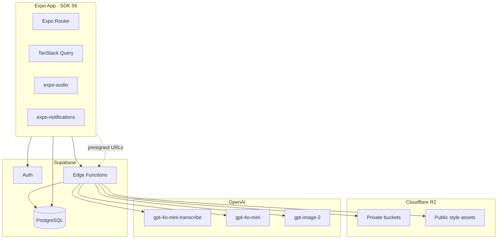
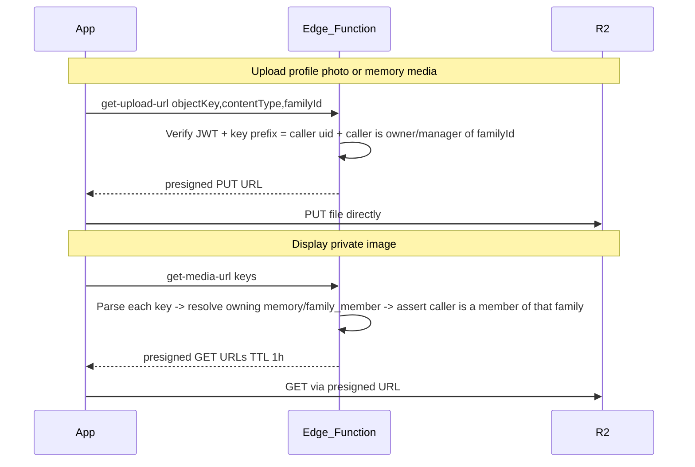

# Momora — Technical Specification

**Version:** 1.0
**Status:** Draft
**Last updated:** May 24, 2026
**Companion doc:** [PRD.md](./PRD.md)

This document defines the technical architecture, database schema, storage layout, and Edge Function contracts for the Momora MVP.

---

## 1. Architecture Overview



### Client

| Concern | Choice |
|---------|--------|
| Framework | Expo SDK 56, React Native 0.85, React 19.2 |
| Routing | Expo Router (file-based) |
| Language | TypeScript 5.x, strict mode |
| Server state | TanStack Query v5 |
| Local persistence | AsyncStorage (session, query cache optional) |
| Audio | `expo-audio` |
| Image display | `expo-image` + presigned R2 URLs (via Edge Function) |
| Builds | EAS Build + development client |

### Backend

| Concern | Choice |
|---------|--------|
| Auth & database | Supabase (Auth, PostgreSQL, RLS) |
| **Object storage** | **Cloudflare R2** (S3-compatible) — all images |
| Serverless | Supabase Edge Functions (Deno) — orchestration, presigned URLs, AI |
| Scheduled jobs | Supabase cron or scheduled Edge Functions |

**Why R2 instead of Supabase Storage:** Momora is image-heavy (profile photos, portraits, every memory illustration). Timeline/calendar views re-fetch images often. Supabase charges for **egress** beyond plan quotas (~$0.09/GB uncached); R2 has **$0 egress** and ~$0.015/GB-month storage. See [COST_OPTIMIZATION.md](./COST_OPTIMIZATION.md).

**Supabase Storage is not used** in Momora2.

---

## 2. Database Schema

### 2.1 Tables

```sql
-- Extends Supabase auth.users
create table public.user_profiles (
  id uuid references auth.users primary key,
  name text not null,
  timezone text not null default 'UTC',
  illustration_style text not null default 'default',
  enable_daily_reminder boolean not null default false,
  notification_time time,
  expo_push_token text,
  has_completed_onboarding boolean not null default false,
  deleted_at timestamptz,
  scheduled_hard_delete_at timestamptz,
  created_at timestamptz not null default now(),
  updated_at timestamptz not null default now()
);

create table public.family_members (
  id uuid primary key default gen_random_uuid(),
  user_id uuid references auth.users not null,
  name text not null,
  nicknames text[] default '{}',
  date_of_birth date,
  gender text,
  profile_picture_key text,          -- R2 object key (not a public URL)
  illustrated_profile_key text,
  illustrated_profile_status text not null default 'pending'
    check (illustrated_profile_status in ('pending', 'generating', 'ready', 'failed')),
  additional_info text,
  is_user_profile boolean not null default false,
  created_at timestamptz not null default now(),
  updated_at timestamptz not null default now()
);

create table public.memories (
  id uuid primary key default gen_random_uuid(),
  user_id uuid references auth.users not null,
  content text,                              -- required for text_illustration and text_only; optional caption for media
  memory_date date not null default current_date,
  memory_type text not null default 'text_illustration'
    check (memory_type in ('text_illustration', 'text_only', 'media')),
  emotion text,
  illustration_key text,                     -- R2 object key; populated for text_illustration only
  illustration_status text not null default 'none'
    check (illustration_status in ('none', 'pending', 'generating', 'ready', 'failed')),
  illustration_prompt text,
  media_key text,                            -- R2 object key for user-uploaded photo or video
  media_content_type text,                   -- MIME type e.g. image/jpeg, video/mp4
  created_at timestamptz not null default now(),
  updated_at timestamptz not null default now()
);

create table public.memory_family_members (
  memory_id uuid references public.memories on delete cascade,
  family_member_id uuid references public.family_members on delete cascade,
  primary key (memory_id, family_member_id)
);

create table public.memory_media (
  id uuid primary key default gen_random_uuid(),
  memory_id uuid references public.memories on delete cascade not null,
  object_key text not null,
  content_type text not null,
  duration_ms integer,
  position integer not null check (position >= 0 and position < 10),
  created_at timestamptz not null default now(),
  updated_at timestamptz not null default now(),
  unique (memory_id, position),
  unique (memory_id, object_key)
);
```

### 2.2 Indexes

```sql
create index idx_family_members_user_id on public.family_members (user_id);
create index idx_memories_user_id on public.memories (user_id);
create index idx_memories_memory_date on public.memories (user_id, memory_date desc);
create index idx_memories_content_search on public.memories using gin (to_tsvector('english', content));
create index idx_user_profiles_scheduled_delete on public.user_profiles (scheduled_hard_delete_at)
  where scheduled_hard_delete_at is not null;
```

### 2.3 Row Level Security

All tables enable RLS. Users may only access their own data.

```sql
alter table public.user_profiles enable row level security;
alter table public.family_members enable row level security;
alter table public.memories enable row level security;
alter table public.memory_family_members enable row level security;

-- user_profiles
create policy "Users can view own profile"
  on public.user_profiles for select using (auth.uid() = id);
create policy "Users can update own profile"
  on public.user_profiles for update using (auth.uid() = id);
create policy "Users can insert own profile"
  on public.user_profiles for insert with check (auth.uid() = id);

-- family_members
create policy "Users can CRUD own family members"
  on public.family_members for all using (auth.uid() = user_id);

-- memories
create policy "Users can CRUD own memories"
  on public.memories for all using (auth.uid() = user_id);

-- memory_family_members (via memory ownership)
create policy "Users can CRUD own memory tags"
  on public.memory_family_members for all
  using (
    exists (
      select 1 from public.memories m
      where m.id = memory_id and m.user_id = auth.uid()
    )
  );
```

### 2.4 Triggers

```sql
-- Auto-update updated_at
create or replace function public.set_updated_at()
returns trigger as $$
begin
  new.updated_at = now();
  return new;
end;
$$ language plpgsql;

create trigger set_user_profiles_updated_at
  before update on public.user_profiles
  for each row execute function public.set_updated_at();

create trigger set_family_members_updated_at
  before update on public.family_members
  for each row execute function public.set_updated_at();

create trigger set_memories_updated_at
  before update on public.memories
  for each row execute function public.set_updated_at();

-- Create user_profiles row on signup
create or replace function public.handle_new_user()
returns trigger as $$
begin
  insert into public.user_profiles (id, name, timezone)
  values (
    new.id,
    coalesce(new.raw_user_meta_data->>'name', 'Parent'),
    coalesce(new.raw_user_meta_data->>'timezone', 'UTC')
  );
  return new;
end;
$$ language plpgsql security definer;

create trigger on_auth_user_created
  after insert on auth.users
  for each row execute function public.handle_new_user();
```

### 2.5 Constraints

- `memory_family_members`: enforce max 4 tags per memory via trigger or Edge Function validation
- `memories.content`: non-empty after trim for `text_illustration` and `text_only` types; nullable for `media` type — enforced in Edge Function / client layer
- `memories.memory_type`: drives whether AI pipeline fires and whether `media_key` is expected
- `memories.media_key`: required (non-null) when `memory_type = 'media'`; must be null for other types — enforced in Edge Function / client layer
- `memories.illustration_status`: set to `'pending'` only for `text_illustration` memories on insert; `'none'` for all other types
- `family_members.profile_picture_key`: required before portrait generation

---

## 3. Object Storage (Cloudflare R2)

All binary assets live in **R2**. Postgres stores **object keys** only — never public URLs for private content.

### Buckets

Momora uses a **single private R2 bucket** (`R2_BUCKET`, e.g. `momora-prod`) with key prefixes:

| Key prefix / pattern | Access | Purpose |
|---------------------|--------|---------|
| `{userId}/family/{memberId}/photo.webp` | Private (presigned) | User-uploaded family photos |
| `{userId}/family/{memberId}/portrait.webp` | Private (presigned) | AI character portraits |
| `{userId}/memories/{memoryId}/illustration.webp` | Private (presigned) | AI memory illustrations (`text_illustration` type) |
| `{userId}/memories/{memoryId}/media/{mediaAssetId}.{ext}` | Private (presigned) | Ordered user-uploaded memory photo/video assets (`media` type) |
| `{userId}/memories/{memoryId}/media.{ext}` | Private (presigned) | Legacy single media object |
| `_assets/styles/{illustration_style}.png` | Private (Edge Function read) | Style reference images |

Legacy multi-bucket names in older notes map to these prefixes inside one bucket.

Use **WebP** for user-generated and AI output where quality allows (smaller storage + faster loads). PNG acceptable for style references.

### Access model

The mobile app **never** holds R2 API credentials.



| Edge Function | Purpose |
|---------------|---------|
| `get-upload-url` | Presigned PUT for client → R2 upload (profile photos, memory media) |
| `upload-media` | Authenticated binary upload proxy (same authorization as `get-upload-url`) |
| `get-media-url` | Presigned GET batch for timeline/detail display |
| `delete-storage-object` | Delete a single object (rollback, memory delete cleanup) |

AI generation functions (`generate-portrait-illustration`, `generate-illustration`) read/write R2 via S3-compatible API using server credentials.

### Family-sharing storage authorization (Phase 3)

R2 keys keep the `{creatorUserId}/...` shape (see patterns below), but authorization no longer means "prefix = caller." It means "caller has the required role in the family that owns the entity the key belongs to," resolved through the DB with the service-role client:

- **Uploads** (`get-upload-url`, `upload-media`): the key itself still must be written under the *caller's own* uid prefix (`assertUserOwnedKey`) — a memory row doesn't exist yet at upload time (client uploads assets before inserting the `memories` row), so per-entity authorization isn't possible yet. Instead the request carries an explicit `familyId`, and the caller must be **owner/manager** in that (non-deleted) family. Cross-family binding integrity is enforced later, at insert/RPC time, by `memories` RLS and `replace_memory_media_assets` key validation.
- **Reads/deletes** (`get-media-url`, `delete-storage-object`): `_shared/storage-keys.ts#parseStorageKey` extracts `{ kind, ownerUserId, entityId }` from the key shape alone (no DB lookup). The `entityId` (a `memories.id` or `family_members.id`) is then used to look up that row's `family_id` — **never** by checking whether some `memory_media` row happens to reference the key, since direct `memory_media` inserts don't constrain `object_key` and a reference-based check would be spoofable. `get-media-url` requires the caller be a member (any role) of the resolved family; `delete-storage-object` requires owner/manager. Keys that don't parse, or whose entity has no owning row, are denied.
- Shared helpers: `_shared/family-access.ts` (`getCallerFamilyRoles`, `resolveStorageKeyFamilyIds`) and `_shared/storage-keys.ts#parseStorageKey`.

### R2 credentials (Edge Functions only)

| Variable | Description |
|----------|-------------|
| `R2_ACCOUNT_ID` | Cloudflare account ID |
| `R2_ACCESS_KEY_ID` | R2 API token access key |
| `R2_SECRET_ACCESS_KEY` | R2 API token secret |
| `R2_ENDPOINT` | `https://<account_id>.r2.cloudflarestorage.com` |
| `R2_BUCKET` | Single private bucket name (e.g. `momora-prod`) |

Shared helper: `supabase/functions/_shared/r2.ts` (S3 client, put/get/delete, presign).

### Authorization

- Object keys **must** start with `{auth.uid()}/` for private buckets (the uploader's own uid — not necessarily the family owner's or the entity's original creator's, since a manager may replace another member's child photo under their own prefix; see `delete-storage-object`/`get-media-url` below).
- Edge Functions validate JWT and key prefix before presigning uploads; **read/delete authorization is family-membership-based**, not prefix-based (see "Family-sharing storage authorization" above).
- DB RLS remains the source of truth for *which* rows (not keys) a user may read/write (family membership via `is_family_member`/`has_family_role`).

### Public style assets

`momora-public-assets` served via R2 public bucket or custom domain + Cloudflare CDN. Small fixed set of files; negligible cost.

### Account deletion

`hard-delete-expired-accounts` (family-sharing Phase 3): **owner** case — before deleting any rows, collects every R2 key belonging to each owned family across ALL creators (`memory_media.object_key`, `memories.media_key`/`illustration_key`, `family_members.profile_picture_key`/`illustrated_profile_key` — these can live under other members' `{uid}/` prefixes), deletes those R2 objects, then deletes the `families` row (FK cascades remove the rest). **Non-owner** case — their created content survives (`user_id` → null via `on delete set null`), so the old blanket `{userId}/`-prefix delete is gone; instead it enumerates objects under the prefix and deletes only the ones no surviving row references.

---

## 4. Edge Functions

All Edge Functions:
- Validate JWT (except cron-triggered functions using service role + secret)
- Return JSON with consistent error shape: `{ error: string, code?: string }`
- Log failures for monitoring

### 4.0 `get-upload-url`

Presigned PUT for direct client → R2 upload.

**Request:** `{ objectKey, contentType, familyId }` — `objectKey` must start with `{auth.uid()}/` and match one of the allowed upload patterns below. `familyId` (added in family-sharing Phase 3) is the family this upload belongs to; the caller must be **owner/manager** in that non-deleted family (checked with the service-role client against `family_memberships` + `families`). Bucket comes from `R2_BUCKET` env.

**Allowed upload patterns**

| Pattern | Allowed `contentType` values | Notes |
|---------|------------------------------|-------|
| `{uid}/family/{memberId}/photo.webp` | `image/jpeg`, `image/png`, `image/webp` | Family profile photo |
| `{uid}/memories/{memoryId}/media/{mediaAssetId}.{ext}` | `image/jpeg`, `image/png`, `image/heic`, `image/heif`, `image/webp`, `video/mp4`, `video/quicktime` | Ordered memory photo/video asset |
| `{uid}/memories/{memoryId}/media.{ext}` | Same as above | Legacy single media object |

**Validation**

- Reject `objectKey` not matching any allowed pattern (still caller-prefix-scoped)
- Reject `contentType` not in the allowed set for the matched pattern
- Reject if `familyId` missing or caller isn't owner/manager of that family (`403 forbidden`)
- Client is responsible for enforcing video duration ≤ 60 seconds, video size ≤ 100 MB, and image size ≤ 20 MB before upload

**Response:** `{ uploadUrl, objectKey, expiresIn }`

### 4.0a `upload-media`

Authenticated binary upload proxy for mobile clients that cannot reliably reach the R2 S3 endpoint directly.

**Request:** `POST` raw file bytes with headers:

| Header | Purpose |
|--------|---------|
| `Authorization: Bearer <jwt>` | User auth |
| `Content-Type` | Actual media MIME type |
| `x-object-key` | R2 object key matching the same allowed upload patterns as `get-upload-url` |
| `x-family-id` | Family this upload belongs to — same owner/manager check as `get-upload-url` (family-sharing Phase 3) |

The function validates the user, object key, content type, family role, and basic file size before uploading to R2 server-side.

**Response:** `{ success: true, objectKey }`

### 4.0b `get-media-url`

Presigned GET for private image display (timeline, detail, family).

**Request:** `{ keys: string[] }` — each key is parsed (`_shared/storage-keys.ts#parseStorageKey`) to recover its entity id (a `memories.id` or `family_members.id`); that row's `family_id` is resolved and the caller must be a **member (any role)** of it. Unparsable keys, or keys whose entity has no owning row, are rejected outright — this is *not* the same as "belongs to the authenticated user."

**Response:** `{ urls: Record<string, string>, expiresIn }` (TTL ~1 hour)

**Errors:** `401 unauthorized`, `400 validation_error` (unresolvable key), `403 forbidden` (resolved but caller isn't a member)

### 4.0c `delete-storage-object`

Deletes a single R2 object (memory media rollback, memory delete cleanup).

**Request:** `{ objectKey: string }` — same parse-and-resolve as `get-media-url`, but requires the caller be **owner/manager** of the resolved family (not just a member).

**Allowed patterns:** family photo, family portrait, memory illustration, memory media

**Response:** `{ success: true }`

**Errors:** `401 unauthorized`, `400 validation_error`, `403 forbidden`, `500 internal_error`

---

### 4.1 `generate-portrait-illustration`

Generates a character portrait when a family member is saved with a photo.

**Trigger:** Client after family member save (when photo is new/changed)

**Request**

```json
{
  "familyMemberId": "uuid"
}
```

**Authorization (family-sharing Phase 3):** family member is looked up by id alone (no `user_id` filter); caller must be **owner/manager** of `member.family_id`. No caller-prefix check on `profile_picture_key` — the DB row is the trust anchor (a manager may have replaced another member's child photo under their own uid prefix). The output portrait key's `{uid}` prefix is derived from the member's *current* `profile_picture_key` prefix, not from the caller, so photo and portrait stay under the same uid segment.

**Logic**

1. Fetch family member by id; assert caller owner/manager of its family
2. Fetch `families.illustration_style` for that family (moved off `user_profiles` in the family-sharing migration)
3. Set `illustrated_profile_status = 'generating'`
4. Fetch profile photo from R2 (`momora-profile-pictures`)
5. Resolve style reference from R2 public assets (`momora-public-assets/_assets/styles/{token}.png`); fetch via `R2_PUBLIC_ASSETS_BASE_URL`
6. Build prompt: age, gender, style description, identity/style reference instructions
7. Call OpenAI image edit API with person photo + style reference (`gpt-image-2`, fallback `gpt-image-1`)
8. Upload result to R2 `momora-character-portraits`
9. Update `illustrated_profile_key`, set status `ready` (or `failed`)

**Response**

```json
{ "success": true, "illustratedProfileKey": "userId/memberId/portrait.webp" }
```

**Errors:** `MEMBER_NOT_FOUND`, `PHOTO_MISSING`, `GENERATION_FAILED`

---

### 4.2 `analyze-emotion`

Classifies dominant emotion and color palette for memories.

**Supported memory types**

| `memory_type` | Input | Model |
|---------------|-------|-------|
| `text_illustration` | Non-empty `content` (text) | `gpt-4o-mini` chat |
| `text_only` | Non-empty `content` (text) | `gpt-4o-mini` chat |
| `media` (has photo) | First ordered image asset + optional caption | `gpt-4o-mini` vision |
| `media` (all video) | — | Rejected/skipped (`400` `video_not_supported`) |

**Triggers**

- `text_illustration`: client after memory save, before `generate-illustration`
- `text_only`: client after memory save (`runTextOnlyEmotionAnalysis`); no illustration follows
- `media` photo: `useMemories` hook after successful create or caption edit (not from `createMediaMemory` directly)
- Backfill: `useMemories` retries analysis once per session for any analyzable memory still missing an emotion

All client-side triggers retry once in the background after the per-memory cooldown; if both attempts fail the emotion is left empty.

Does **not** invoke `generate-illustration` for `media`.

**Authorization (family-sharing Phase 3):** memory looked up by id alone; caller must be a **member (any role, including viewer)** of its family — analysis can be triggered by anyone who can see the memory. No caller-prefix assertions on media keys (they come from the trusted DB row). **The emotion write runs on the service-role client**, not the caller's user client: a viewer's user-client UPDATE would silently match zero rows under the manager+ `memories` RLS policy (200 with a no-op), leaving `isEmotionAnalyzable` true and causing a permanent client-side retry loop. Membership authorizes triggering analysis; the write itself is a system write.

**Request**

```json
{
  "memoryId": "uuid"
}
```

**Logic (text_illustration / text_only)**

1. Fetch memory (JWT + RLS); assert caller is a family member
2. Call `gpt-4o-mini` with text emotion prompt
3. Update `memories.emotion` via the **service-role client**

**Logic (media photo)**

1. Fetch memory including ordered `memory_media` assets and `updated_at`; assert caller is a family member
2. Select the first ordered image asset
3. Reject/skip all-video media memories
4. Snapshot `updated_at` and `content` for stale-write guard
5. `getObjectBytes` from R2; reject if `> 20 MB`
6. Downscale via `capImageMaxEdge` (max edge 768px); reject undecodable HEIC (`unsupported_image_format`)
7. Vision call: caption + image when caption present; image-only otherwise
8. `UPDATE emotion` via the **service-role client**, only if `updated_at` still matches snapshot
9. Per-memory cooldown: 5s between calls (`429` `rate_limited`)

**Response**

```json
{
  "emotion": "joyful",
  "colorPalette": "warm golden yellows, soft peach, light sky blue accents",
  "skipped": false
}
```

`skipped: true` when analysis succeeded but the stale-write guard discarded the DB update.

**Errors:** `MEMORY_NOT_FOUND`, `invalid_memory_type`, `video_not_supported`, `file_too_large`, `unsupported_image_format`, `forbidden`, `rate_limited`, `ANALYSIS_FAILED`

**Privacy:** Photo bytes and optional captions are sent to OpenAI (same boundary as portrait generation). Production logs: memory id and status only.

---

### 4.3 `generate-illustration`

Generates memory illustration using tagged character portraits.

**Trigger:** Client after `analyze-emotion` succeeds

**Request**

```json
{
  "memoryId": "uuid",
  "colorPalette": "warm golden yellows, soft peach, light sky blue accents",
  "forceRegenerate": false
}
```

Set `forceRegenerate: true` when the client manually regenerates an illustration that is already `ready` (same R2 key is overwritten).

**Authorization (family-sharing Phase 3):** memory looked up by id alone; caller must be **owner/manager** of `memory.family_id` (not `memory.user_id = caller`). Internal lookups are re-scoped from `family_members.user_id = caller` to `family_members.family_id = memory.family_id` — otherwise a manager tagging children the family *owner* created would find zero portraits and fail with `NO_PORTRAITS`. `illustration_style` is read from `families` (moved off `user_profiles` in the family-sharing migration).

**Logic**

1. Fetch memory by id; assert caller owner/manager of its family
2. Set `illustration_status = 'generating'`
3. Fetch memory content + tagged family members (max 4) scoped to the memory's `family_id`
4. **Safety pre-check:** `gpt-4o-mini` rewrites unsafe content → child-safe scene description
5. Fetch ready character portraits from R2 (`momora-character-portraits`)
6. Build prompt: safe content, labeled character reference map, style description from `families.illustration_style`, color palette, age at memory date
7. Call OpenAI image edit API with all ready portrait references (up to 4; `input_fidelity=high` only on `gpt-image-1` fallback when multiple)
8. On moderation failure: rewrite + retry once
9. Upload to R2 `momora-memory-illustrations`
10. Update `illustration_key`, `illustration_prompt`, status `ready` (or `failed`)
11. Delete previous illustration object from R2 if regenerating

**Response**

```json
{ "success": true, "illustrationKey": "userId/memoryId/illustration.webp" }
```

**Errors:** `MEMORY_NOT_FOUND`, `NO_PORTRAITS`, `GENERATION_FAILED`, `MODERATION_BLOCKED`

---

### 4.4 `process-voice-memory`

Transcribes audio and returns cleaned text with suggested family tags.

**Trigger:** Client after voice recording stops

**Request**

```json
{
  "audioBase64": "base64-encoded-audio",
  "familyMembers": [
    {
      "id": "uuid",
      "name": "Emma",
      "nicknames": ["Em", "Emmy"],
      "is_user_profile": false
    }
  ]
}
```

**Logic**

1. Build transcription prompt from all names + nicknames
2. Call OpenAI `/v1/audio/transcriptions` (`gpt-4o-mini-transcribe`)
3. Parse raw transcript for name/nickname matches → `mentionedMemberIds`
4. Call `gpt-4o-mini` for cleanup + self-reference detection
5. If `mentionedUserSelf`: append user profile family member ID
6. Return result (audio discarded, not stored)

**Response**

```json
{
  "cleanedText": "Emma said her first full sentence today: 'I love you, Mama.'",
  "mentionedMemberIds": ["uuid-emma"]
}
```

**Errors:** `TRANSCRIPTION_FAILED`, `EMPTY_AUDIO`, `AUDIO_TOO_LONG`

**Validation:** Reject audio representing > 2 minutes of recording

---

### 4.5 `send-daily-reminder`

Sends a push notification to a single user.

**Trigger:** Called by scheduler for each eligible user

**Request**

```json
{
  "userId": "uuid"
}
```

**Logic**

1. Fetch user profile: `expo_push_token`, `enable_daily_reminder`
2. Skip if disabled or no token
3. Select random reminder message from pool
4. Send via Expo Push API

**Response**

```json
{ "success": true }
```

---

### 4.6 `schedule-daily-reminders`

Cron function run hourly.

**Logic**

1. Fetch users where `enable_daily_reminder = true` and `expo_push_token` is not null and `deleted_at` is null
2. For each user, compute current local time from `timezone` + `notification_time`
3. If within matching hour window, invoke `send-daily-reminder`

**Auth:** Service role + cron secret header

---

### 4.7 `delete-user-account`

Initiates account deletion (soft delete).

**Trigger:** Client from settings

**Request**

```json
{}
```

**Logic**

1. Set `deleted_at = now()`, `scheduled_hard_delete_at = now() + interval '15 days'`
2. **(family-sharing Phase 3)** For each family the caller **owns**: set `families.deleted_at = now()` via the service-role client (the `enforce_families_restricted_columns` trigger allows this when `auth.uid()` is null, i.e. no user JWT), then push a heads-up notification ("This family journal's owner deleted their account...") to every other member with an `expo_push_token`. Best-effort — failures are logged, not thrown; the account-deletion response only depends on step 1 succeeding. Push helper shared with `send-daily-reminder` via `_shared/expo-push.ts`.

**Response**

```json
{ "success": true, "scheduledHardDeleteAt": "2026-06-08T..." }
```

---

### 4.8 `cancel-account-deletion`

**Trigger:** Client from settings during grace period

**Logic**

1. Clear `deleted_at` and `scheduled_hard_delete_at` on the caller's `user_profiles` row
2. **(family-sharing Phase 3)** Clear `families.deleted_at` for every family the caller owns, via the service-role client (same trigger exemption as above — this could also run on the caller's own JWT since they're the owner, but service-role is simplest)

---

### 4.9 `hard-delete-expired-accounts`

Cron function run daily.

**Logic**

1. Find users where `scheduled_hard_delete_at <= now()`
2. For each user, **(family-sharing Phase 3, reworked)**:
   - **Owner case:** for every family they own, collect R2 keys across *all creators* in that family (`memory_media.object_key`, `memories.media_key`/`illustration_key`, `family_members.profile_picture_key`/`illustrated_profile_key`) *before* deleting any rows, delete those R2 objects, then delete the `families` row (FK cascades remove `memories`/`family_members`/`family_memberships`/`family_invites` for free)
   - **Non-owner case:** their created content in families they don't own must survive — no blanket delete of `memories`/`family_members` by `user_id` anymore. Enumerate objects under their own `{userId}/` prefix and delete only the ones no surviving row references (checked against `memory_media.object_key`, `memories.media_key`/`illustration_key`, `family_members.profile_picture_key`/`illustrated_profile_key`)
   - Delete the `user_profiles` row, then `auth.admin.deleteUser` — the FK `on delete set null` on `memories.user_id`/`family_members.user_id` fires here, nulling attribution on any surviving (non-owned-family) content

**Auth:** Service role + cron secret header

---

## 5. Client API Flow

### 5.1 Create Memory (text)

```
1. Client validates: content non-empty, ≤4 tagged members
2. INSERT memories + memory_family_members
3. Invoke analyze-emotion(memoryId)
4. Invoke generate-illustration(memoryId, colorPalette)
5. Poll or subscribe to illustration_status until ready | failed
6. Display illustration via get-media-url presigned GET
```

### 5.2 Create Memory (voice)

```
1. Record audio via expo-audio (tap start/stop, max 2 min)
2. Invoke process-voice-memory(audioBase64, familyMembers)
3. Populate form with cleanedText + suggested tags
4. User edits → Save → same flow as 5.1
```

### 5.3 Add Family Member

```
1. Request presigned PUT via get-upload-url
2. Upload photo directly to R2
3. INSERT family_members with profile_picture_key
4. Invoke generate-portrait-illustration(familyMemberId)
5. Poll illustrated_profile_status until ready | failed
6. Display portrait via get-media-url
```

### 5.4 Display images (timeline, detail, family)

```
1. Collect object keys from query results
2. Batch invoke get-media-url(keys)
3. Pass presigned URLs to expo-image (TanStack Query cache ~50 min TTL)
4. Refresh presigned URLs before expiry on refetch
```

### 5.5 Create Memory (media — 1-10 photos/videos)

```
1. User picks up to 10 photos/videos from camera roll, or repeatedly captures photos with the camera
2. Client validates each asset: image ≤ 20 MB; video duration ≤ 60 seconds (read metadata before upload)
3. Client generates memoryId (UUID)
4. Client generates one mediaAssetId per asset
5. Request presigned PUT URLs via get-upload-url (objectKey: {uid}/memories/{memoryId}/media/{mediaAssetId}.{ext}, contentType)
6. Upload files directly to R2; delete uploaded keys on later failure
7. INSERT memories (id: memoryId) with memory_type='media', cover media_key/media_content_type from position 0, illustration_status='none', optional content (caption)
8. Call `replace_memory_media_assets` RPC with the final ordered asset list
9. No illustration pipeline invoked; photo emotion analysis uses the first ordered image asset
10. Display media via get-media-url presigned GET; timeline/detail use carousel UI
```

Note: the client generates `memoryId` upfront so the R2 object key is known before the DB insert, mirroring the family-member photo flow (§5.3).

---

## 6. Style Token Resolution

```typescript
// Server-side constant map (Edge Functions)
const STYLE_REFERENCE_PATHS: Record<string, string> = {
  default: 'styles/default.png',
  // post-MVP: watercolor: 'styles/watercolor.png',
};

function getStyleReferenceUrl(token: string): string {
  const path = STYLE_REFERENCE_PATHS[token] ?? STYLE_REFERENCE_PATHS.default;
  // Public R2 bucket or CDN custom domain, e.g.:
  return `${R2_PUBLIC_ASSETS_BASE_URL}/${path}`;
}
```

MVP: all users have `illustration_style = 'default'`. No style picker UI.

---

## 7. Environment Variables

### Client (Expo)

| Variable | Description |
|----------|-------------|
| `EXPO_PUBLIC_SUPABASE_URL` | Supabase project URL |
| `EXPO_PUBLIC_SUPABASE_ANON_KEY` | Supabase anon key |

### Edge Functions (Supabase secrets)

| Variable | Description |
|----------|-------------|
| `OPENAI_API_KEY` | OpenAI API key |
| `SUPABASE_SERVICE_ROLE_KEY` | Service role for cron/admin functions |
| `CRON_SECRET` | Shared secret for cron-triggered functions |
| `R2_ACCOUNT_ID` | Cloudflare account ID |
| `R2_ACCESS_KEY_ID` | R2 S3 API access key |
| `R2_SECRET_ACCESS_KEY` | R2 S3 API secret |
| `R2_ENDPOINT` | R2 S3 endpoint URL |
| `R2_PUBLIC_ASSETS_BASE_URL` | Public URL for style reference images |

---

## 8. Project Structure (Recommended)

```
Momora2/
├── app/                          # Expo Router screens
│   ├── (auth)/                   # login, signup, verify-otp
│   ├── (app)/                    # timeline, calendar, family, settings
│   └── (modals)/                 # new-memory, edit-memory, add-family-member
├── src/
│   ├── components/
│   ├── hooks/                    # useMemories, useFamilyMembers, useVoiceInput
│   ├── lib/                      # supabase client, query client
│   ├── services/                 # API wrappers for Edge Functions
│   └── types/                    # generated Supabase types
├── supabase/
│   ├── migrations/
│   └── functions/
│       ├── get-upload-url/
│       ├── get-media-url/
│       ├── generate-portrait-illustration/
│       ├── analyze-emotion/
│       ├── generate-illustration/
│       ├── process-voice-memory/
│       ├── send-daily-reminder/
│       ├── schedule-daily-reminders/
│       ├── delete-user-account/
│       ├── cancel-account-deletion/
│       └── hard-delete-expired-accounts/
├── docs/
│   ├── PRD.md
│   └── TECH_SPEC.md
├── app.json
└── package.json
```

---

## 9. Performance Targets

| Operation | Target (p95) |
|-----------|--------------|
| Memory save (DB only) | < 2s |
| Voice transcription | < 15s (30–60s clip) |
| Emotion analysis | < 5s |
| Portrait generation | < 45s |
| Memory illustration | < 60s |

All AI operations are **async** — client shows status and allows navigation away.

---

## 10. Security Checklist

- [ ] RLS enabled on all public tables
- [ ] R2 private buckets; key prefix enforced in Edge Functions
- [ ] Presigned URLs for all private image display (short TTL)
- [ ] R2 credentials only in Edge Function secrets
- [ ] OpenAI key only in Edge Function secrets
- [ ] Cron functions require `CRON_SECRET` header
- [ ] Account deletion grace period enforced
- [ ] Voice audio not persisted after transcription
- [ ] Input validation on all Edge Function payloads
- [ ] Max 4 family member tags enforced server-side

---

## 11. Open Implementation Items

| Item | Notes |
|------|-------|
| `gpt-image-2` API | Confirm edit endpoint, reference image count limits, fallback to `gpt-image-1` |
| Full-text search | GIN index provided; may add `ilike` fallback for simpler MVP |
| Realtime status updates | Supabase Realtime on `memories.illustration_status` vs. polling |
| EXIF stripping | Strip metadata from uploaded profile photos before storage |

---

*End of Technical Specification*
