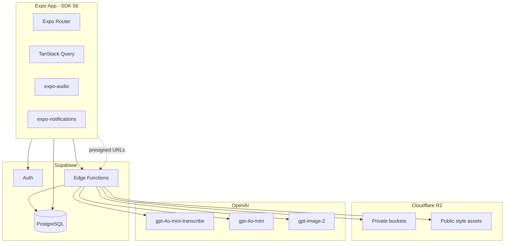
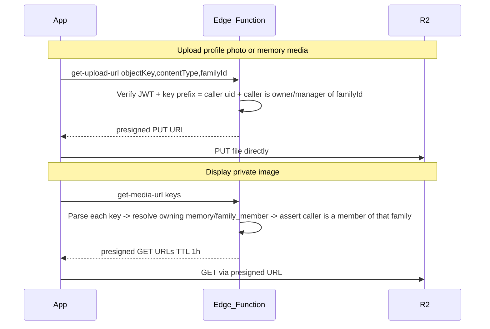

# Momora — Technical Specification

**Version:** 1.0
**Status:** Draft
**Last updated:** May 24, 2026
**Companion doc:** [PRD.md](./PRD.md)

This document defines the technical architecture, database schema, storage layout, and Edge Function contracts for the Momora MVP.

---

## 1. Architecture Overview



### Auth

Email OTP (one-time code) for every user via Supabase Auth — see
[docs/features/auth.md](./features/auth.md) for the full client flow
(`signInWithOtp`/`verifyOtp`, sign-up metadata trigger, resend cooldown).
Passwords are not part of the production UX; a `__DEV__`-only password
sign-in path stays enabled so Maestro E2E can authenticate deterministically
without reading a real inbox (`src/utils/e2e-fixtures.ts#isE2eFixturesEnabled`
gates the UI; the Supabase Email password provider itself stays enabled
server-side). Supabase dashboard prerequisites (custom SMTP, OTP email
template, OTP expiry) are documented in `docs/features/auth.md` — none of
them are verifiable from a coding environment; a human must confirm them
against the live project.

### Client

| Concern | Choice |
|---------|--------|
| Framework | Expo SDK 56, React Native 0.85, React 19.2 |
| Routing | Expo Router (file-based) |
| Language | TypeScript 5.x, strict mode |
| Server state | TanStack Query v5 |
| Local persistence | AsyncStorage (session, query cache optional) |
| Audio | `expo-audio` |
| Image display | `expo-image` + presigned R2 URLs (via Edge Function) |
| Builds | EAS Build + development client |

### Backend

| Concern | Choice |
|---------|--------|
| Auth & database | Supabase (Auth, PostgreSQL, RLS) |
| **Object storage** | **Cloudflare R2** (S3-compatible) — all images |
| Serverless | Supabase Edge Functions (Deno) — orchestration, presigned URLs, AI |
| Scheduled jobs | Supabase cron or scheduled Edge Functions |

**Why R2 instead of Supabase Storage:** Momora is image-heavy (profile photos, portraits, every memory illustration). Timeline/calendar views re-fetch images often. Supabase charges for **egress** beyond plan quotas (~$0.09/GB uncached); R2 has **$0 egress** and ~$0.015/GB-month storage. See [COST_OPTIMIZATION.md](./COST_OPTIMIZATION.md).

**Supabase Storage is not used** in Momora2.

---

## 2. Database Schema

**Family sharing (2026-07-11):** every table below reflects the
post-family-sharing state. `user_id` on `memories`/`family_members` is now
**creator attribution**, not ownership — nullable, `on delete set null`,
and immutable once set. Tenancy lives in the new `family_id` column on both
tables (`not null`, also immutable once set). `user_profiles.illustration_style`
moved to `families.illustration_style`. See
[§2.6 Family sharing](#26-family-sharing-tenancy-roles-rls) below and
[docs/features/family-sharing.md](./features/family-sharing.md) for the full
tenancy model, roles, and RLS rewrite — this section only lists schema.

### 2.1 Tables

```sql
-- Extends Supabase auth.users
create table public.user_profiles (
  id uuid references auth.users primary key,
  name text not null,
  timezone text not null default 'UTC',
  enable_daily_reminder boolean not null default false,
  notification_time time,
  expo_push_token text,
  has_completed_onboarding boolean not null default false,
  deleted_at timestamptz,
  scheduled_hard_delete_at timestamptz,
  active_family_id uuid references public.families on delete set null,  -- which family the client shows
  notify_new_memories boolean not null default true,                    -- new-memory push opt-out
  notify_engagement boolean not null default true,                      -- like/comment push opt-out
  created_at timestamptz not null default now(),
  updated_at timestamptz not null default now()
);
-- illustration_style column dropped (2026-07-11) -- moved to families.illustration_style.

create table public.family_members (
  id uuid primary key default gen_random_uuid(),
  user_id uuid references auth.users on delete set null,  -- creator attribution (nullable, was NOT NULL)
  family_id uuid not null references public.families on delete cascade,  -- tenancy
  name text not null,
  nicknames text[] default '{}',
  date_of_birth date,
  gender text,
  profile_picture_key text,          -- deprecated cutover columns; portrait versions are canonical
  illustrated_profile_key text,
  illustrated_profile_status text not null default 'pending'
    check (illustrated_profile_status in ('pending', 'generating', 'ready', 'failed')),
  additional_info text,
  is_user_profile boolean not null default false,
  created_at timestamptz not null default now(),
  updated_at timestamptz not null default now()
);

create table public.family_member_portrait_versions (
  id uuid primary key,
  family_id uuid not null,
  family_member_id uuid not null,
  user_id uuid references auth.users on delete set null,
  reference_date date,               -- null only for migrated legacy_unknown rows
  date_source text not null check (date_source in ('exif', 'manual', 'default_today', 'legacy_unknown')),
  profile_picture_key text not null unique,
  illustrated_profile_key text,
  illustrated_profile_status text not null default 'pending'
    check (illustrated_profile_status in ('pending', 'generating', 'ready', 'failed')),
  generation_token uuid,
  generation_started_at timestamptz,
  generation_output_key text,
  deletion_token uuid,
  deletion_started_at timestamptz,
  created_at timestamptz not null default now(),
  updated_at timestamptz not null default now(),
  foreign key (family_member_id, family_id)
    references public.family_members (id, family_id) on delete cascade
);

create table public.memories (
  id uuid primary key default gen_random_uuid(),
  user_id uuid references auth.users on delete set null,  -- creator attribution (nullable, was NOT NULL)
  family_id uuid not null references public.families on delete cascade,  -- tenancy
  content text,                              -- required for text_illustration and text_only; optional caption for media
  memory_date date not null default current_date,
  memory_type text not null default 'text_illustration'
    check (memory_type in ('text_illustration', 'text_only', 'media')),
  emotion text,
  illustration_key text,                     -- R2 object key; populated for text_illustration only
  illustration_status text not null default 'none'
    check (illustration_status in ('none', 'pending', 'generating', 'ready', 'failed')),
  illustration_prompt text,
  media_key text,                            -- R2 object key for user-uploaded photo or video
  media_content_type text,                   -- MIME type e.g. image/jpeg, video/mp4
  link_previews jsonb not null default '{}'::jsonb,  -- { [url]: { title: string|null, fetchedAt } } -- see fetch-link-previews (§4.13)
  created_at timestamptz not null default now(),
  updated_at timestamptz not null default now()
);

-- Family sharing (2026-07-11): tenancy + invite tables. Full lifecycle,
-- roles, and RLS in docs/features/family-sharing.md; schema only here.
create table public.families (
  id uuid primary key default gen_random_uuid(),
  owner_id uuid not null references auth.users on delete cascade,  -- family dies with owner
  name text not null,
  illustration_style text not null default 'default',
  deleted_at timestamptz,                    -- owner soft-delete; owner-exempt from RLS invisibility
  created_at timestamptz not null default now(),
  updated_at timestamptz not null default now()
);

create table public.family_memberships (
  id uuid primary key default gen_random_uuid(),
  family_id uuid not null references public.families on delete cascade,
  user_id uuid not null references auth.users on delete cascade,
  role text not null check (role in ('owner', 'manager', 'viewer')),
  created_at timestamptz not null default now(),
  updated_at timestamptz not null default now(),
  unique (family_id, user_id)
);
-- Exactly one 'owner' row per family:
create unique index one_owner_per_family on public.family_memberships (family_id) where role = 'owner';

create table public.family_invites (
  id uuid primary key default gen_random_uuid(),
  family_id uuid not null references public.families on delete cascade,
  code text not null unique,                 -- normalized "word-word-word"
  role text not null check (role in ('manager', 'viewer')),
  status text not null default 'pending'
    check (status in ('pending', 'redeemed', 'approved', 'rejected', 'revoked')),
  invited_by uuid not null references auth.users on delete cascade,
  redeemed_by uuid references auth.users on delete set null,
  redeemed_at timestamptz,
  resolved_by uuid,
  resolved_at timestamptz,
  expires_at timestamptz not null default now() + interval '7 days',
  created_at timestamptz not null default now(),
  updated_at timestamptz not null default now()
);

-- ~1,000-word curated seed list create_family_invite samples 3 words from.
-- Service-role/definer-only -- RLS enabled with NO policies (see §2.6).
create table public.invite_code_words (
  word text primary key
);

-- Rate-limit log for redeem-family-invite. Service-role/definer-only.
create table public.invite_redemption_attempts (
  user_id uuid not null,
  ip text,
  attempted_at timestamptz not null default now()
);

-- Family activity / engagement push debounce log. Service-role/definer-only.
create table public.family_activity_log (
  family_id uuid not null references public.families on delete cascade,
  actor_id uuid not null,
  kind text not null,                        -- 'new_memory' or engagement_<kind>:<entity-id>
  created_at timestamptz not null default now()
);

create table public.memory_family_members (
  memory_id uuid references public.memories on delete cascade,
  family_member_id uuid references public.family_members on delete cascade,
  primary key (memory_id, family_member_id)
);

create table public.memory_media (
  id uuid primary key default gen_random_uuid(),
  memory_id uuid references public.memories on delete cascade not null,
  object_key text not null,
  content_type text not null,
  duration_ms integer,
  aspect_ratio double precision check (aspect_ratio is null or aspect_ratio between 0.1 and 10),
  position integer not null check (position >= 0 and position < 10),
  -- Derived bandwidth-friendly JPEG preview (longest edge <= 1280px),
  -- generated client-side for images only; null for videos, legacy rows,
  -- assets already at or under the cap (no-upscale guard), and failed
  -- preview uploads (fail-open). See §5.5 and features/media-memories.md.
  preview_object_key text,
  created_at timestamptz not null default now(),
  updated_at timestamptz not null default now(),
  unique (memory_id, position),
  unique (memory_id, object_key)
);

-- Engagement. Viewer participation is intentional; see §2.3 RLS.
create table public.memory_likes (
  memory_id uuid not null references public.memories on delete cascade,
  user_id uuid not null references auth.users on delete cascade,
  created_at timestamptz not null default now(),
  primary key (memory_id, user_id)
);

create table public.memory_comments (
  id uuid primary key default gen_random_uuid(),
  memory_id uuid not null references public.memories on delete cascade,
  user_id uuid not null references auth.users on delete cascade,
  content text not null check (char_length(trim(content)) between 1 and 1000),
  created_at timestamptz not null default now()
);
```

### 2.2 Indexes

```sql
create index idx_family_members_user_id on public.family_members (user_id);
-- Extended 2026-07-15 (timeline keyset pagination, see memories.md) to cover
-- the created_at tie-break within a same-date group.
create index idx_memories_family_id_memory_date on public.memories (family_id, memory_date desc, created_at desc);
create index idx_memories_content_search on public.memories using gin (to_tsvector('english', content));
create index idx_user_profiles_scheduled_delete on public.user_profiles (scheduled_hard_delete_at)
  where scheduled_hard_delete_at is not null;

-- Family sharing (2026-07-11):
create index idx_family_memberships_user_id_family_id on public.family_memberships (user_id, family_id);
create index idx_family_invites_family_id on public.family_invites (family_id);
create index idx_family_invites_redeemed_by on public.family_invites (redeemed_by) where redeemed_by is not null;
create index idx_invite_redemption_attempts_user_id on public.invite_redemption_attempts (user_id, attempted_at);
create index idx_invite_redemption_attempts_ip on public.invite_redemption_attempts (ip, attempted_at);
create index idx_family_activity_log_family_actor_kind
  on public.family_activity_log (family_id, actor_id, kind, created_at desc);
create index idx_memory_likes_user_id on public.memory_likes (user_id);
create index idx_memory_comments_memory_created_at on public.memory_comments (memory_id, created_at desc);
create index idx_memory_comments_user_id on public.memory_comments (user_id);
```

`idx_memories_user_id` and the old `idx_memories_memory_date (user_id,
memory_date desc)` were **dropped** — timeline/calendar now filter by
`family_id`, not `user_id`.

### 2.2a Realtime publication

`public.memories` is added to the `supabase_realtime` publication
(`supabase/migrations/20260715150000_memories_realtime_publication.sql`):

```sql
alter publication supabase_realtime add table public.memories;
```

Default `REPLICA IDENTITY` (primary key only on the `old` row of an UPDATE
payload) is sufficient — `useMemoriesRealtime`
(`src/hooks/useMemoriesRealtime.ts`) only reads `payload.new` (always the
full row) plus whatever it already has cached for the previous state, never
`payload.old`'s non-key columns. `postgres_changes` authorizes rows against
RLS using the client's JWT; `supabase-js`'s default client wiring (no
`accessToken` override in `src/lib/supabase.ts`/`supabase.web.ts`) already
calls `realtime.setAuth()` on `TOKEN_REFRESHED`/`SIGNED_IN`, so no extra
wiring was needed for token refresh to keep the realtime socket authorized.

No RLS policy changes were required — the existing family-membership
policies on `memories` already gate `postgres_changes` the same way they
gate a normal `select`.

Prod verification (run against the database itself, not `config.toml`,
which has no publication section):

```sql
select * from pg_publication_tables where pubname = 'supabase_realtime';
```

Confirm a `public.memories` row is present in both local and prod. See
[docs/features/memories.md](./features/memories.md) for the client-side
push/poll split this powers, and the A5 poll (`useGenerationStatusPolling`)
that stays as the fallback whenever realtime is disconnected or the
publication is missing in an environment.

### 2.3 Row Level Security

All tables enable RLS. Access is scoped by **family membership**, not
`auth.uid() = user_id` directly — that pivot is the core of the
family-sharing migration. Full policy list, the `is_family_member`/
`has_family_role` helper functions, and the definer RPCs
(`create_family`, `create_family_invite`, `get_family_member_profiles`,
`get_invite_redeemer`, `get_my_redeemed_invite_status`,
`replace_memory_media_assets`) are in
`supabase/migrations/20260711120000_family_sharing.sql` and documented in
[docs/features/family-sharing.md](./features/family-sharing.md) (roles
table, RLS matrix, RPC list, and the specific bugs the design guards
against — cross-tenant tag leakage, `family_id` reparenting, "manager
anywhere" instead of "manager of this specific family").

Shape, for reference (`user_profiles` is unchanged — still "own row only"):

```sql
alter table public.user_profiles enable row level security;
alter table public.family_members enable row level security;
alter table public.memories enable row level security;
alter table public.memory_family_members enable row level security;
alter table public.memory_media enable row level security;
alter table public.memory_likes enable row level security;
alter table public.memory_comments enable row level security;
alter table public.families enable row level security;
alter table public.family_memberships enable row level security;
alter table public.family_invites enable row level security;
-- invite_code_words / invite_redemption_attempts / family_activity_log:
-- RLS enabled with NO policies -- service-role/definer-function access only.

-- user_profiles (unchanged)
create policy "Users can view own profile"
  on public.user_profiles for select using (auth.uid() = id);
create policy "Users can update own profile"
  on public.user_profiles for update using (auth.uid() = id);
create policy "Users can insert own profile"
  on public.user_profiles for insert with check (auth.uid() = id);

-- family_members, memories, memory_family_members, memory_media:
-- select = is_family_member(family_id); insert/update/delete = manager+
-- (has_family_role(family_id, ['owner','manager'])), with additional
-- with-check guards on tag/media inserts -- see the migration + feature doc.

-- families / family_memberships / family_invites: see feature doc roles
-- table for the exact select/insert/update/delete matrix per role.

-- Engagement (all checks resolve memory.family_id):
-- memory_likes select/insert/delete = own row + active family membership;
-- aggregate counts/liked_by_me come from get_memory_engagement(uuid[]).
-- memory_comments select/insert = active family member (insert must be own);
-- delete = own while active, or owner/manager of that specific family.
-- There is no comment UPDATE policy: comments are immutable.
```

Engagement RPCs (migration `20260713200000_memory_engagement.sql`):

```sql
get_memory_engagement(memory_ids uuid[])
  returns table (memory_id uuid, like_count bigint,
                 comment_count bigint, liked_by_me boolean)

set_memory_like(target_memory_id uuid, should_like boolean)
  returns table (liked boolean, changed boolean, like_count bigint)
```

Both are `security definer`, execute only for `authenticated`, and perform
their own family-membership check. The batch aggregate returns only authorized
memories and never exposes liker identities. `set_memory_like` is an atomic,
idempotent set operation; `changed` is true only when a row was inserted or
deleted, allowing notification delivery to ignore stale/repeated writes.

### 2.4 Triggers

```sql
-- Auto-update updated_at
create or replace function public.set_updated_at()
returns trigger as $$
begin
  new.updated_at = now();
  return new;
end;
$$ language plpgsql;

create trigger set_user_profiles_updated_at
  before update on public.user_profiles
  for each row execute function public.set_updated_at();

create trigger set_family_members_updated_at
  before update on public.family_members
  for each row execute function public.set_updated_at();

create trigger set_memories_updated_at
  before update on public.memories
  for each row execute function public.set_updated_at();

-- Create user_profiles row on signup
create or replace function public.handle_new_user()
returns trigger as $$
begin
  insert into public.user_profiles (id, name, timezone)
  values (
    new.id,
    coalesce(new.raw_user_meta_data->>'name', 'Parent'),
    coalesce(new.raw_user_meta_data->>'timezone', 'UTC')
  );
  return new;
end;
$$ language plpgsql security definer;

create trigger on_auth_user_created
  after insert on auth.users
  for each row execute function public.handle_new_user();
```

### 2.5 Constraints

- `memory_family_members`: no global tag cap. The DB trigger permits unlimited tags for `text_only`/`media`, caps `text_illustration` at 6, and rejects switching a text-only row with more than 6 existing tags back to illustrated.
- `memories.content`: non-empty after trim for `text_illustration` and `text_only` types; nullable for `media` type — enforced in Edge Function / client layer
- `memories.memory_type`: drives whether AI pipeline fires and whether `media_key` is expected
- `memories.media_key`: required (non-null) when `memory_type = 'media'`; must be null for other types — enforced in Edge Function / client layer
- `memories.illustration_status`: on insert, set to `'pending'` for `text_illustration` and `'none'` for other types. Editing an illustrated memory to `text_only` deliberately retains its illustration key/prompt/status so toggling AI back on can reveal the existing asset without regeneration; rendering and generation eligibility branch on `memory_type`.
- `memories.link_previews`: `jsonb`, defaults to `{}`; written only by `fetch-link-previews` (service-role client); malformed/absent entries are treated as no preview client-side (see [inline-links.md](./features/inline-links.md))
- `family_member_portrait_versions`: new writes have a non-null date in `[family_members.date_of_birth, acting user's local today]`; only migration may write `legacy_unknown` with a null date. Identity/source fields are immutable and creator attribution may change only to null during auth-user deletion.
- `family_members.date_of_birth`: cannot move after an existing dated portrait version
- `family_memberships`: exactly one `role = 'owner'` row per `family_id` (partial unique index); max 50 rows per `family_id` (trigger); `user_id`/`family_id` immutable once inserted (a manager can only ever change `role`, and never to/from `'owner'`)
- `family_invites.role`: `'manager'` or `'viewer'` only — invites can never carry the owner role
- `memories.family_id` / `family_members.family_id`: immutable once set (`before update` trigger — see §2.6)
- `memories.user_id` / `family_members.user_id`: immutable once set, except the FK's own `on delete set null` (same trigger)
- `families.owner_id`: immutable; `families.deleted_at` can only be changed by the owner (or a service-role/no-JWT context) — enforced by a `before update` trigger, not RLS alone
- A user may own at most 5 `families` rows (`create_family` RPC)

### 2.6 Family sharing (tenancy, roles, RLS)

Full model — roles table, tenancy diagram, invite lifecycle, RPC/Edge
Function contracts, storage authorization, notifications, and the
`children roster` vs. `household roster` naming hazard — lives in
[docs/features/family-sharing.md](./features/family-sharing.md). This
section is the schema-only summary; treat the feature doc as canonical for
**behavior**, this doc as canonical for **shapes**.

Quick reference:

- **Helper functions:** `is_family_member(fam uuid)`, `has_family_role(fam
  uuid, roles text[])` — both `security definer stable`, gate every RLS
  policy on shared tables, include an owner exemption on `deleted_at`.
- **Definer RPCs:** `create_family`, `create_family_invite`,
  `get_family_member_profiles`, `get_invite_redeemer`,
  `get_my_redeemed_invite_status`, `replace_memory_media_assets`.
- **New Edge Functions:** `redeem-family-invite`, `resolve-family-invite`,
  `notify-family-activity` — see §4.10–§4.12.
- **Migration:** `supabase/migrations/20260711120000_family_sharing.sql`
  (schema + RLS + backfill) and `20260711120001_invite_code_words_seed.sql`
  (word list).

---

## 3. Object Storage (Cloudflare R2)

All binary assets live in **R2**. Postgres stores **object keys** only — never public URLs for private content.

### Buckets

Momora uses a **single private R2 bucket** (`R2_BUCKET`, e.g. `momora-prod`) with key prefixes:

| Key prefix / pattern | Access | Purpose |
|---------------------|--------|---------|
| `{userId}/family/{memberId}/photo.webp` | Private (presigned) | User-uploaded family photos |
| `{userId}/family/{memberId}/portrait.webp` | Private (presigned) | AI character portraits |
| `{userId}/memories/{memoryId}/illustration.webp` | Private (presigned) | AI memory illustrations (`text_illustration` type) |
| `{userId}/memories/{memoryId}/media/{mediaAssetId}.{ext}` | Private (presigned) | Ordered user-uploaded memory photo/video assets (`media` type) |
| `{userId}/memories/{memoryId}/media.{ext}` | Private (presigned) | Legacy single media object |
| `_assets/styles/{illustration_style}.png` | Private (Edge Function read) | Style reference images |

Legacy multi-bucket names in older notes map to these prefixes inside one bucket.

Use **WebP** for user-generated and AI output where quality allows (smaller storage + faster loads). PNG acceptable for style references.

### Access model

The mobile app **never** holds R2 API credentials.



| Edge Function | Purpose |
|---------------|---------|
| `get-upload-url` | Presigned PUT for client → R2 upload (profile photos, memory media) |
| `upload-media` | Authenticated binary upload proxy (same authorization as `get-upload-url`) |
| `get-media-url` | Presigned GET batch for timeline/detail display |
| `delete-storage-object` | Delete a single object (rollback, memory delete cleanup) |

AI generation functions (`generate-portrait-illustration`, `generate-illustration`) read/write R2 via S3-compatible API using server credentials.

### Family-sharing storage authorization (Phase 3)

R2 keys keep the `{creatorUserId}/...` shape (see patterns below), but authorization no longer means "prefix = caller." It means "caller has the required role in the family that owns the entity the key belongs to," resolved through the DB with the service-role client:

- **Uploads** (`get-upload-url`, `upload-media`): the key itself still must be written under the *caller's own* uid prefix (`assertUserOwnedKey`) — a memory row doesn't exist yet at upload time (client uploads assets before inserting the `memories` row), so per-entity authorization isn't possible yet. Instead the request carries an explicit `familyId`, and the caller must be **owner/manager** in that (non-deleted) family. Cross-family binding integrity is enforced later, at insert/RPC time, by `memories` RLS and `replace_memory_media_assets` key validation.
- **Reads/deletes** (`get-media-url`, `delete-storage-object`): `_shared/storage-keys.ts#parseStorageKey` extracts `{ kind, ownerUserId, entityId, portraitVersionId? }` from the key shape. Legacy/member keys resolve through `family_members`; portrait-version keys must also match the exact referenced version row. `get-media-url` requires any family role. Rollback deletion of an unreferenced version source additionally requires its `{uid}` prefix to equal the caller; referenced version deletion uses `delete-portrait-version`. `_shared/family-access.ts#resolveReferencedStorageKeys` admits a memory's `memory_media.preview_object_key` alongside `object_key` — without this, `get-media-url` 400s on every preview key (the feature is dead) and `delete-storage-object` refuses to delete them (a leak).
- Shared helpers: `_shared/family-access.ts` (`getCallerFamilyRoles`, `resolveStorageKeyFamilyIds`) and `_shared/storage-keys.ts#parseStorageKey`.

### R2 credentials (Edge Functions only)

| Variable | Description |
|----------|-------------|
| `R2_ACCOUNT_ID` | Cloudflare account ID |
| `R2_ACCESS_KEY_ID` | R2 API token access key |
| `R2_SECRET_ACCESS_KEY` | R2 API token secret |
| `R2_ENDPOINT` | `https://<account_id>.r2.cloudflarestorage.com` |
| `R2_BUCKET` | Single private bucket name (e.g. `momora-prod`) |

Shared helper: `supabase/functions/_shared/r2.ts` (S3 client, put/get/delete, presign).

### Authorization

- Object keys **must** start with `{auth.uid()}/` for private buckets (the uploader's own uid — not necessarily the family owner's or the entity's original creator's, since a manager may replace another member's child photo under their own prefix; see `delete-storage-object`/`get-media-url` below).
- Edge Functions validate JWT and key prefix before presigning uploads; **read/delete authorization is family-membership-based**, not prefix-based (see "Family-sharing storage authorization" above).
- DB RLS remains the source of truth for *which* rows (not keys) a user may read/write (family membership via `is_family_member`/`has_family_role`).

### Public style assets

`momora-public-assets` served via R2 public bucket or custom domain + Cloudflare CDN. Small fixed set of files; negligible cost.

### Account deletion

`hard-delete-expired-accounts` (family-sharing Phase 3): **owner** case — before deleting any rows, collects every R2 key belonging to each owned family across ALL creators, including all portrait-version source/output/attempt objects, then deletes the `families` row. **Non-owner** case — their created content survives (`user_id` → null); prefix cleanup retains every key referenced by surviving memory, member, or portrait-version rows. Both the deletion enumeration and surviving-reference set must be updated for any new storage column.

---

## 4. Edge Functions

All Edge Functions:
- Validate JWT (except cron-triggered functions using service role + secret)
- Return JSON with consistent error shape: `{ error: string, code?: string }`
- Log failures for monitoring

### 4.0 `get-upload-url`

Presigned PUT for direct client → R2 upload.

**Request:** `{ objectKey, contentType, familyId }` — `objectKey` must start with `{auth.uid()}/` and match one of the allowed upload patterns below. `familyId` (added in family-sharing Phase 3) is the family this upload belongs to; the caller must be **owner/manager** in that non-deleted family (checked with the service-role client against `family_memberships` + `families`). Bucket comes from `R2_BUCKET` env.

**Allowed upload patterns**

| Pattern | Allowed `contentType` values | Notes |
|---------|------------------------------|-------|
| `{uid}/family/{memberId}/portraits/{versionId}/photo.jpg` | `image/jpeg` | Immutable normalized portrait-version source |
| `{uid}/memories/{memoryId}/media/{mediaAssetId}.{ext}` | `image/jpeg`, `image/png`, `image/heic`, `image/heif`, `image/webp`, `video/mp4`, `video/quicktime` | Ordered memory photo/video asset |
| `{uid}/memories/{memoryId}/media.{ext}` | Same as above | Legacy single media object |

**Validation**

- Reject `objectKey` not matching any allowed pattern (still caller-prefix-scoped)
- Reject `contentType` not in the allowed set for the matched pattern
- Reject if `familyId` missing or caller isn't owner/manager of that family (`403 forbidden`)
- Client is responsible for enforcing video duration ≤ 3 minutes and raw source size ≤ 2 GB (pick-time sanity cap) before compression, video size ≤ 100 MB after compression (the same cap this function/`upload-media` enforce server-side), and image size ≤ 20 MB before upload — see [docs/features/media-memories.md](./features/media-memories.md#constraints--gotchas) for the full pipeline

**Response:** `{ uploadUrl, objectKey, expiresIn }`

### 4.0a `upload-media`

Authenticated binary upload proxy for mobile clients that cannot reliably reach the R2 S3 endpoint directly.

**Request:** `POST` raw file bytes with headers:

| Header | Purpose |
|--------|---------|
| `Authorization: Bearer <jwt>` | User auth |
| `Content-Type` | Actual media MIME type |
| `x-object-key` | R2 object key matching the same allowed upload patterns as `get-upload-url` |
| `x-family-id` | Family this upload belongs to — same owner/manager check as `get-upload-url` (family-sharing Phase 3) |

The function validates the user, object key, content type, family role, and basic file size before uploading to R2 server-side.

**Response:** `{ success: true, objectKey }`

### 4.0b `get-media-url`

Presigned GET for private image display (timeline, detail, family).

**Request:** `{ keys: string[] }` — each key is parsed (`_shared/storage-keys.ts#parseStorageKey`) to recover its entity id (a `memories.id` or `family_members.id`); that row's `family_id` is resolved and the caller must be a **member (any role)** of it. Unparsable keys, or keys whose entity has no owning row, are rejected outright — this is *not* the same as "belongs to the authenticated user."

**Response:** `{ urls: Record<string, string>, expiresIn }` (TTL ~1 hour)

**Errors:** `401 unauthorized`, `400 validation_error` (unresolvable key), `403 forbidden` (resolved but caller isn't a member)

### 4.0c `delete-storage-object`

Deletes a single R2 object (memory media rollback, memory delete cleanup).

**Request:** `{ objectKey: string }` — same parse-and-resolve as `get-media-url`, but requires the caller be **owner/manager** of the resolved family (not just a member).

**Allowed patterns:** unreferenced caller-owned portrait-version source rollback, legacy family photo/portrait, memory illustration, memory media. Referenced portrait-version objects are deleted only by `delete-portrait-version`.

**Response:** `{ success: true }`

**Errors:** `401 unauthorized`, `400 validation_error`, `403 forbidden`, `500 internal_error`

---

### 4.1 `generate-portrait-illustration`

Generates or regenerates the character portrait for one immutable portrait version.

**Trigger:** Client after creating a portrait-version row, or manual retry/regenerate

**Request**

```json
{
  "portraitVersionId": "uuid"
}
```

**Authorization:** the version and parent member are the trust anchors; caller must be owner/manager of that exact family. The old `{ familyMemberId }` request is rejected at the coordinated cutover.

**Logic**

1. Fetch version + parent member; assert caller owner/manager of its family
2. Atomically claim a unique generation token/output key (service-role-only RPC)
3. Fetch `families.illustration_style`
4. Fetch the immutable source photo from R2
5. Resolve style reference from R2 public assets (`momora-public-assets/_assets/styles/{token}.png`); fetch via `R2_PUBLIC_ASSETS_BASE_URL`
6. Build prompt: age, gender, style description, identity/style reference instructions
7. Call OpenAI image edit API with person photo + style reference (`gpt-image-2`, fallback `gpt-image-1`)
8. Upload result under `/portrait/{attemptId}.webp`
9. Publish only if the token still owns the claim. On regeneration failure, retain the previous ready output and status.

**Response**

```json
{ "success": true, "illustratedProfileKey": ".../portraits/versionId/portrait/attemptId.webp" }
```

**Errors:** `PORTRAIT_VERSION_NOT_FOUND`, `DATE_REQUIRED`, `GENERATION_IN_PROGRESS`, `GENERATION_CLAIM_LOST`, `GENERATION_FAILED`

### 4.1a `delete-portrait-version`

**Request:** `{ "portraitVersionId": "uuid" }`. Owner/manager only. Atomically claims the row, rejects deletion of the member's only version or last usable portrait, lists/deletes every object under the version prefix, then removes the claimed row.

### 4.1b `delete-family-member`

**Request:** `{ "familyMemberId": "uuid" }`. Owner/manager only. Collects legacy and portrait-version object keys/prefixes before deleting storage, then deletes the member row and cascaded version rows.

---

### 4.2 `analyze-emotion`

Classifies dominant emotion and color palette for memories.

**Supported memory types**

| `memory_type` | Input | Model |
|---------------|-------|-------|
| `text_illustration` | Non-empty `content` (text) | `gpt-4o-mini` chat |
| `text_only` | Non-empty `content` (text) | `gpt-4o-mini` chat |
| `media` (has photo) | First ordered image asset + optional caption | `gpt-4o-mini` vision |
| `media` (all video) | — | Rejected/skipped (`400` `video_not_supported`) |

**Triggers**

- `text_illustration`: client after memory save, before `generate-illustration`
- `text_only`: client after memory save (`runTextOnlyEmotionAnalysis`); no illustration follows
- `media` photo: `useMemories` hook after successful create or caption edit (not from `createMediaMemory` directly)
- Backfill: `useMemories` retries analysis once per session for any analyzable memory still missing an emotion

All client-side triggers retry once in the background after the per-memory cooldown; if both attempts fail the emotion is left empty.

Does **not** invoke `generate-illustration` for `media`.

**Authorization (family-sharing Phase 3):** memory looked up by id alone; caller must be a **member (any role, including viewer)** of its family — analysis can be triggered by anyone who can see the memory. No caller-prefix assertions on media keys (they come from the trusted DB row). **The emotion write runs on the service-role client**, not the caller's user client: a viewer's user-client UPDATE would silently match zero rows under the manager+ `memories` RLS policy (200 with a no-op), leaving `isEmotionAnalyzable` true and causing a permanent client-side retry loop. Membership authorizes triggering analysis; the write itself is a system write.

**Request**

```json
{
  "memoryId": "uuid"
}
```

**Logic (text_illustration / text_only)**

1. Fetch memory (JWT + RLS); assert caller is a family member
2. Call `gpt-4o-mini` with text emotion prompt
3. Update `memories.emotion` via the **service-role client**

**Logic (media photo)**

1. Fetch memory including ordered `memory_media` assets and `updated_at`; assert caller is a family member
2. Select the first ordered image asset
3. Reject/skip all-video media memories
4. Snapshot `updated_at` and `content` for stale-write guard
5. `getObjectBytes` from R2; reject if `> 20 MB`
6. Downscale via `capImageMaxEdge` (max edge 768px); reject undecodable HEIC (`unsupported_image_format`)
7. Vision call: caption + image when caption present; image-only otherwise
8. `UPDATE emotion` via the **service-role client**, only if `updated_at` still matches snapshot
9. Per-memory cooldown: 5s between calls (`429` `rate_limited`)

**Response**

```json
{
  "emotion": "joyful",
  "colorPalette": "warm golden yellows, soft peach, light sky blue accents",
  "skipped": false
}
```

`skipped: true` when analysis succeeded but the stale-write guard discarded the DB update.

**Errors:** `MEMORY_NOT_FOUND`, `invalid_memory_type`, `video_not_supported`, `file_too_large`, `unsupported_image_format`, `forbidden`, `rate_limited`, `ANALYSIS_FAILED`

**Privacy:** Photo bytes and optional captions are sent to OpenAI (same boundary as portrait generation). Production logs: memory id and status only.

---

### 4.3 `generate-illustration`

Generates memory illustration using tagged character portraits.

**Trigger:** Client after `analyze-emotion` succeeds

**Request**

```json
{
  "memoryId": "uuid",
  "colorPalette": "warm golden yellows, soft peach, light sky blue accents",
  "forceRegenerate": false
}
```

Set `forceRegenerate: true` when the client manually regenerates an illustration that is already `ready` (same R2 key is overwritten).

**Authorization (family-sharing Phase 3):** memory looked up by id alone; caller must be **owner/manager** of `memory.family_id` (not `memory.user_id = caller`). Internal lookups are re-scoped from `family_members.user_id = caller` to `family_members.family_id = memory.family_id` — otherwise a manager tagging children the family *owner* created would find zero portraits and fail with `NO_PORTRAITS`. `illustration_style` is read from `families` (moved off `user_profiles` in the family-sharing migration).

**Logic**

1. Fetch memory by id; assert caller owner/manager of its family
2. Set `illustration_status = 'generating'`
3. Fetch memory content + tagged family members (max 6 for this memory type), and **all** family member id/name/nickname rows (not just tagged), scoped to the memory's `family_id`; reject more than 6 explicit tags with `ILLUSTRATION_MEMBER_LIMIT`, and cap the zero-tag name-inference fallback to its first 6 matches
4. **Safety pre-check:** `gpt-4o-mini` rewrites unsafe content → child-safe scene description, given a nickname→canonical-name mapping built from every family member so nicknames never leak into the image prompt (see `buildSafetySystemPrompt`). Returns `{"safeDescription":"...","expressionStyle":"comedic"|"tender"|"neutral"}`; `expressionStyle` is validated server-side and defaults to `neutral`
5. For each selected member, resolve the usable portrait against `memory.memory_date`: latest dated ready version on/before the date, otherwise earliest dated ready version after it, otherwise a ready undated legacy version. Same-day ties use `created_at DESC, id DESC`. Fetch the resolved keys from R2.
6. Build prompt (`buildIllustrationPrompt`): scene-first, newline-separated sections — Scene, Characters (reference map + preserve/adapt split), Emotional tone (`memory.emotion` mapped to `EMOTION_EXPRESSIONS`, plus comedic exaggeration when `expressionStyle === 'comedic'` and the emotion is in `COMEDIC_ELIGIBLE_EMOTIONS`), Style/palette/date, Constraints
7. Call OpenAI image edit API with all ready portrait references (up to 6; `input_fidelity=high` only on `gpt-image-1` fallback when multiple)
8. On moderation failure: rewrite + retry once
9. Upload to R2 `momora-memory-illustrations`
10. Update `illustration_key`, `illustration_prompt`, status `ready` (or `failed`)
11. Delete previous illustration object from R2 if regenerating

**Response**

```json
{ "success": true, "illustrationKey": "userId/memoryId/illustration.webp" }
```

**Errors:** `MEMORY_NOT_FOUND`, `NO_PORTRAITS`, `GENERATION_FAILED`, `MODERATION_BLOCKED`

---

### 4.4 `process-voice-memory`

Transcribes audio and returns cleaned text with suggested family tags.

**Trigger:** Client after voice recording stops

**Request**

```json
{
  "audioBase64": "base64-encoded-audio",
  "familyMembers": [
    {
      "id": "uuid",
      "name": "Emma",
      "nicknames": ["Em", "Emmy"],
      "is_user_profile": false
    }
  ]
}
```

**Logic**

1. Build transcription prompt from all names + nicknames
2. Call OpenAI `/v1/audio/transcriptions` (`gpt-4o-mini-transcribe`)
3. Parse raw transcript for name/nickname matches → `mentionedMemberIds`
4. Call `gpt-4o-mini` for cleanup + self-reference detection
5. If `mentionedUserSelf`: append user profile family member ID
6. Return result (audio discarded, not stored)

**Response**

```json
{
  "cleanedText": "Emma said her first full sentence today: 'I love you, Mama.'",
  "mentionedMemberIds": ["uuid-emma"]
}
```

**Errors:** `TRANSCRIPTION_FAILED`, `EMPTY_AUDIO`, `AUDIO_TOO_LONG`

**Validation:** Reject audio representing > 2 minutes of recording

---

### 4.5 `send-daily-reminder`

Sends a push notification to a single user.

**Trigger:** Called by scheduler for each eligible user

**Request**

```json
{
  "userId": "uuid"
}
```

**Logic**

1. Fetch user profile: `expo_push_token`, `enable_daily_reminder`
2. Skip if disabled or no token
3. Select random reminder message from pool
4. Send via Expo Push API with `data: { route: 'new-memory' }` so tapping it
   deep-links straight to the create-memory screen (see
   [docs/features/family-sharing.md](./features/family-sharing.md#notifications-matrix)
   for the full push `route` contract)

**Response**

```json
{ "success": true }
```

---

### 4.6 `schedule-daily-reminders`

Cron function run hourly.

**Trigger:** pg_cron job `invoke-schedule-daily-reminders` (migration
`20260713170000_schedule_daily_reminders_cron.sql`) POSTs to the function via
pg_net at minute 0 of every hour. The function only sends within the first 5
minutes of a user's target hour, so the schedule must stay at `0 * * * *`. The
job reads two Vault secrets at run time — `project_url` (the project's
`https://<ref>.supabase.co` base) and `cron_secret` (same value as the
`CRON_SECRET` function secret) — which must be created once per environment;
failed runs are visible in `cron.job_run_details`. Note `send-daily-reminder`
is invoked **in-process** (imported handler), so successful reminder sends
appear only under this function's invocations, never under
`send-daily-reminder`'s.

**Logic**

1. Fetch users where `enable_daily_reminder = true` and `expo_push_token` is not null and `deleted_at` is null
2. For each user, compute current local time from `timezone` + `notification_time`
3. If within matching hour window, invoke `send-daily-reminder`

**Auth:** Service role + cron secret header

---

### 4.7 `delete-user-account`

Initiates account deletion (soft delete).

**Trigger:** Client from settings

**Request**

```json
{}
```

**Logic**

1. Set `deleted_at = now()`, `scheduled_hard_delete_at = now() + interval '15 days'`
2. **(family-sharing Phase 3)** For each family the caller **owns**: set `families.deleted_at = now()` via the service-role client (the `enforce_families_restricted_columns` trigger allows this when `auth.uid()` is null, i.e. no user JWT), then push a heads-up notification ("This family journal's owner deleted their account...") to every other member with an `expo_push_token`. Best-effort — failures are logged, not thrown; the account-deletion response only depends on step 1 succeeding. Push helper shared with `send-daily-reminder` via `_shared/expo-push.ts`.

**Response**

```json
{ "success": true, "scheduledHardDeleteAt": "2026-06-08T..." }
```

---

### 4.8 `cancel-account-deletion`

**Trigger:** Client from settings during grace period

**Logic**

1. Clear `deleted_at` and `scheduled_hard_delete_at` on the caller's `user_profiles` row
2. **(family-sharing Phase 3)** Clear `families.deleted_at` for every family the caller owns, via the service-role client (same trigger exemption as above — this could also run on the caller's own JWT since they're the owner, but service-role is simplest)

---

### 4.9 `hard-delete-expired-accounts`

Cron function run daily.

**Trigger:** pg_cron job `invoke-hard-delete-expired-accounts` (migration
`20260713180000_schedule_hard_delete_cron.sql`) POSTs to the function via
pg_net daily at 03:00 UTC. The function sweeps every user with
`scheduled_hard_delete_at <= now()`, so the exact run time doesn't matter. The
job reads the same two Vault secrets as §4.6's at run time — `project_url`
(the project's `https://<ref>.supabase.co` base) and `cron_secret` (same value
as the `CRON_SECRET` function secret) — which must be created once per
environment; failed runs are visible in `cron.job_run_details`.

**Logic**

1. Find users where `scheduled_hard_delete_at <= now()`
2. For each user, **(family-sharing Phase 3, reworked)**:
   - **Owner case:** for every family they own, collect R2 keys across *all creators* in that family (`memory_media.object_key`/`preview_object_key`, `memories.media_key`/`illustration_key`, `family_members.profile_picture_key`/`illustrated_profile_key`) *before* deleting any rows, delete those R2 objects, then delete the `families` row (FK cascades remove `memories`/`family_members`/`family_memberships`/`family_invites` for free)
   - **Non-owner case:** their created content in families they don't own must survive — no blanket delete of `memories`/`family_members` by `user_id` anymore. Enumerate objects under their own `{userId}/` prefix and delete only the ones no surviving row references (checked against `memory_media.object_key`/`preview_object_key`, `memories.media_key`/`illustration_key`, `family_members.profile_picture_key`/`illustrated_profile_key`) — **preview keys must be checked as their own reference column**, not just `object_key`: a live preview under a surviving `memory_media` row would otherwise look unreferenced and be deleted as orphan garbage on the first non-owner account hard-delete
   - Delete the `user_profiles` row, then `auth.admin.deleteUser` — the FK `on delete set null` on `memories.user_id`/`family_members.user_id` fires here, nulling attribution on any surviving (non-owned-family) content

**Auth:** Service role + cron secret header

---

### 4.10 `redeem-family-invite`

Redeems a 3-word invite code. Behavior/call-order narrative in
[docs/features/family-sharing.md](./features/family-sharing.md#redeem-family-invite--call-order);
this is the contract.

**Request**

```json
{ "code": "sunny-tiger-lake" }
```

**Response**

```json
{ "familyName": "Rivera family", "role": "viewer" }
```

**Auth:** JWT. Rate-limited: ≤10 attempts/hour/user and ≤30/hour/IP (best-effort, from the last `x-forwarded-for` hop).

**Errors:** `validation_error` (missing code), `invalid_code` (400 — covers invalid, expired, revoked, already-redeemed, family soft-deleted, and lost-race claims — deliberately indistinguishable so the endpoint isn't an oracle), `already_member` (409), `rate_limited` (429), `internal_error` (500)

---

### 4.11 `resolve-family-invite`

Approves or rejects a redeemed invite. Caller must be owner/manager of **that invite's** family.

**Request**

```json
{ "inviteId": "uuid", "action": "approve" }
```

**Response**

```json
{ "success": true, "status": "approved" }
```

**Auth:** JWT, owner/manager of the invite's family.

**Errors:** `validation_error`, `not_found` (404), `forbidden` (403 — wrong family or insufficient role), `invalid_status` (409 — not `redeemed`, or redeemer account hard-deleted), `family_full` (409 — 50-member cap), `internal_error` (500)

---

### 4.12 `notify-family-activity`

Fire-and-forget push after a successful memory create. Only ever announces the caller's own new memory. Push `data` payload is `{ route: 'memory', familyId, memoryId }` so tapping it deep-links to that memory's detail screen (see [docs/features/family-sharing.md](./features/family-sharing.md#notifications-matrix) for the full push `route` contract and the cross-family reconciliation the client does before navigating).

**Request**

```json
{ "memoryId": "uuid" }
```

**Response**

```json
{ "sent": true, "recipientCount": 2 }
```

or, when debounced (another push for this `(family, actor)` fired within the last 15 minutes):

```json
{ "sent": false, "reason": "debounced" }
```

**Auth:** JWT; caller must be both the memory's creator (`memory.user_id`) **and** owner/manager of its family.

**Errors:** `validation_error`, `not_found` (404), `forbidden` (403), `internal_error` (500)

---

### 4.13 `fetch-link-previews`

Fetches page titles for URLs pasted into a memory's `content` and writes
`memories.link_previews`. See [docs/features/inline-links.md](./features/inline-links.md)
for the full data flow, SSRF rules, and client rendering.

**Triggers:** `useMemories` create/update mutations (fire-and-forget, only
when content contains a URL on create / whenever content was part of the
update); the media upload queue (`use-pending-memory-uploads.tsx`) when the
caption contains a URL.

**Authorization:** mirrors `analyze-emotion` — memory looked up by id alone,
caller must be a **member (any role, including viewer)** of its family; the
write runs on the **service-role client** so a viewer-triggered fetch still
persists.

**Request**

```json
{ "memoryId": "uuid" }
```

**Logic**

1. Fetch memory (`id, family_id, content, link_previews`); assert caller is a family member
2. Extract URLs from `content` (shared regex, both client and Edge Function), deduplicate in first-seen order, then cap at the first 5 unique URLs
3. Diff against stored `link_previews`: fetch URLs that are new or previously `title: null`; keep existing non-null entries; prune entries whose URL no longer appears in `content` (handles edits, including edits that remove every URL)
4. Fetch each title in parallel (`Promise.allSettled`) through the two-layer SSRF guard (hostname rules + DNS resolution, re-checked on every redirect hop, max 3 hops)
5. Conditionally update `link_previews` only where both the memory id and `content` still match the snapshot from step 1; this single atomic update prevents a concurrent content edit from receiving stale previews (content-based write guard, not `updated_at` — see the feature doc for why)

**Response**

```json
{
  "linkPreviews": {
    "https://www.youtube.com/watch?v=44Cgkd3WtU8": {
      "title": "Alexisonfire - We Are The End - YouTube",
      "fetchedAt": "2026-07-12T00:00:00Z"
    }
  }
}
```

`title: null` = fetch attempted and failed; the client renders the domain as a fallback label and the function re-attempts on the next invocation.

**Errors:** `unauthorized` (401), `forbidden` (403), `MEMORY_NOT_FOUND` (404), `method_not_allowed` (405), `rate_limited` (429, 5s per-memory cooldown)

**Privacy:** Fetched titles are third-party page content and are **never** fed to OpenAI prompts (see §8 of the plan / feature doc). Production logs: memory id and status only, never URLs or titles.

---

### 4.14 `notify-memory-engagement`

Fire-and-forget push after a successful like or comment. The endpoint accepts
viewer callers, but verifies they are an active member of the memory's family
and that the referenced engagement row belongs to the caller. The sole possible
recipient is the memory creator, if still an active family member with
`notify_engagement=true` and a push token. Self-actions never notify.

**Request**

```json
{ "memoryId": "uuid", "kind": "like" }
```

or:

```json
{ "memoryId": "uuid", "kind": "comment", "engagementId": "comment-uuid" }
```

**Response**

```json
{ "sent": true }
```

or a non-error skip:

```json
{ "sent": false, "reason": "self|disabled|debounced|no_recipient" }
```

**Delivery:** Generic body (`{actor name} liked/commented on a memory`) with no
memory, comment, or child content. Push data is
`{ route: 'memory', familyId, memoryId }`, so a tap uses the existing
cross-family reconciliation and opens memory detail.

**Debounce:** Like attempts are logged before send and suppressed for 24 hours
per `(family, actor, memory)`; unlike never calls the endpoint. Comments use the
comment id in the log key, preventing retry duplicates without suppressing a
different comment. Push failure is best-effort and never undoes engagement.

**Auth:** JWT; any active family role, with a verified caller-owned like/comment.

**Errors:** `validation_error` (400), `unauthorized` (401), `forbidden` (403),
`not_found` (404), `method_not_allowed` (405), `internal_error` (500)

See [docs/features/likes-and-comments.md](./features/likes-and-comments.md).

---

## 5. Client API Flow

### 5.1 Create Memory (text)

```
1. Client validates: content non-empty and unique tags; AI illustration remains available only with ≤6 tagged members
2. INSERT memories + memory_family_members
3. Invoke analyze-emotion(memoryId)
4. Invoke generate-illustration(memoryId, colorPalette)
5. Poll or subscribe to illustration_status until ready | failed
6. Display illustration via get-media-url presigned GET
```

Create/edit composers allow unlimited unique tags while AI is off. Crossing 6
tags automatically turns AI off; returning to 6 or fewer only re-enables the
switch and does not turn it back on. On edit, switching an illustrated memory
to `text_only` hides but retains its illustration columns/R2 object. Switching
back to `text_illustration` reveals a retained key without regeneration; when
no key exists and no job is already pending/generating, save sets `pending`
and starts the normal pipeline. The service replaces tags before enabling AI,
while the DB validates both tag insertion and the `memory_type` transition.

### 5.2 Create Memory (voice)

```
1. Record audio via expo-audio (tap start/stop, max 2 min)
2. Invoke process-voice-memory(audioBase64, familyMembers)
3. Populate form with cleanedText + suggested tags
4. User edits → Save → same flow as 5.1
```

### 5.3 Add Family Member

```
1. INSERT `family_members` profile row
2. Extract/confirm photo date and request a presigned PUT for the immutable version source key
3. Upload normalized JPEG directly to R2
4. Call `create_family_member_portrait_version` with the exact key/date/source
5. Invoke `generate-portrait-illustration(portraitVersionId)`
6. Poll portrait-version status until ready or failed; onboarding itself is not portrait-ready gated
7. Resolve today's portrait and display it through `get-media-url`
```

### 5.4 Display images (timeline, detail, family)

```
1. Collect object keys from query results
2. Batch invoke get-media-url(keys)
3. Pass presigned URLs to expo-image (TanStack Query cache ~50 min TTL, gcTime 55 min)
4. Refresh presigned URLs before expiry on refetch
```

**5.4a Preview-key preference (list surfaces only):** `MemoryCard` media,
calendar `MemoryStamp`, and the family member profile's `MemoryThumb`
resolve `memory_media.preview_object_key ?? object_key` for image assets —
falling back to the original when no preview exists (legacy rows, videos,
the no-upscale guard, or a failed preview upload). The memory detail
carousel and the full-screen viewer always use the original `object_key` —
previews are a list-density optimization, not the source of truth for
close-up viewing. See
[docs/features/media-memories.md](./features/media-memories.md).

### 5.5 Create Memory (media — 1-10 photos/videos)

```
1. User picks up to 10 photos/videos from camera roll, or repeatedly captures photos with the camera
2. Client validates each asset: image ≤ 20 MB; video duration ≤ 3 minutes and raw source size ≤ 2 GB (read metadata before upload; the 2 GB check is a pick-time sanity cap on the original, not the post-compression upload cap — see media-memories.md)
3. Client generates memoryId (UUID)
4. Client generates one mediaAssetId per asset
5. For videos, compress first and extract a transformed frame to derive the display `aspectRatio` (rotation metadata applied); images use their re-encoded output dimensions
6. Request presigned PUT URLs via get-upload-url (objectKey: {uid}/memories/{memoryId}/media/{mediaAssetId}.{ext}, contentType)
7. Upload files directly to R2; delete uploaded keys on later failure
8. INSERT memories (id: memoryId) with memory_type='media', cover media_key/media_content_type from position 0, illustration_status='none', optional content (caption)
9. Call `replace_memory_media_assets` RPC with the final ordered asset list, including `aspectRatio`
10. No illustration pipeline invoked; photo emotion analysis uses the first ordered image asset
11. Display media via get-media-url presigned GET; timeline rows use the persisted first asset's `aspect_ratio` before media loads, and later carousel assets use `contain` inside that fixed frame
```

`replace_memory_media_assets` receives each ordered asset as
`{ objectKey, contentType, durationMs, aspectRatio, previewObjectKey }`.
`aspectRatio` is nullable for legacy clients/rows and must be between `0.1`
and `10` when present. `previewObjectKey` is nullable and, when present, must
match the identical `{caller_prefix}/media/[A-Za-z0-9_-]{1,128}.{ext}`
ownership/pattern check applied to `objectKey` — a preview lives at the same
asset path, only the filename differs (`{mediaAssetId}-preview.jpg`), so
garbage or foreign preview keys are rejected the same way garbage or foreign
object keys are. When an older client edits an existing asset without one or
both of `aspectRatio`/`previewObjectKey`, the RPC preserves the row's current
value (keyed by matching `objectKey`) instead of clearing it.

Note: the client generates `memoryId` upfront so the R2 object key is known before the DB insert, mirroring the family-member photo flow (§5.3).

**Preview image variants (bandwidth):** for each new image asset (not
video), after EXIF stripping, the client generates a derived JPEG preview
capped at 1280px on its longest edge (quality 0.8) via
`createImagePreviewForUpload` (`src/utils/create-image-preview.ts`), reusing
the width/height `stripImageMetadataForUpload` already computed — no extra
dimension probe. If the source is already at or under 1280px (no-upscale
guard), no preview is generated. The preview uploads to
`{uid}/memories/{memoryId}/media/{mediaAssetId}-preview.jpg` (same directory
as the original; matches `MEMORY_MEDIA_ASSET_EXTENSION_PATTERN`, which
permits hyphens in the asset-id segment) and its key is recorded on
`memory_media.preview_object_key`. Preview upload/generation failure is
fail-open: the memory post still succeeds with `preview_object_key = null`,
and list surfaces fall back to the original (§5.4a). Originals are never
resized. See [docs/features/media-memories.md](./features/media-memories.md).

**Client-only capture-date prefill (create screen only):** when the picker
requests EXIF (`includeCaptureDate`, new-memory composer only — the edit
composer never sets it), `src/utils/media-capture-date.ts` reads only
`DateTimeOriginal` → `DateTimeDigitized` → `DateTime` from each library
photo's EXIF object, strictly validates the Gregorian calendar date, and
derives a `YYYY-MM-DD` scalar. `src/hooks/use-suggested-memory-date.ts`
applies the earliest such date across currently attached photos as the
memory date, with a visible "From photo" hint; manually changing the date
overrides the suggestion for the rest of that session. No API/schema change:
the EXIF object surfaced to JS is never retained on the attachment, logged,
or added to any request payload or persisted record — only the derived
`YYYY-MM-DD` scalar enters React state, and it is never distinguishable from
a manually-typed date once saved (`memories.memory_date` stores the same
column either way).

**Upload-time EXIF/GPS stripping (image binaries):** every image asset
uploaded through `uploadMemoryMediaAssets`
(`src/services/memory-posting.ts`) — new-memory create, edit-memory
replace/append, and incoming-share attachments alike, since they all funnel
through this one function — is re-encoded via `expo-image-manipulator`
(`src/utils/strip-image-metadata.ts`) immediately before the PUT, discarding
all EXIF (GPS, timestamps, Make/Model, MakerNote) regardless of platform.
JPEG/PNG/WEBP inputs keep their format; HEIC/HEIF inputs come out as JPEG
(the manipulator cannot write HEIC), so the uploaded `contentType` and R2
key extension are always derived from the *stripped* output, never the
picked asset. This step is fail-closed: a re-encode failure rejects the
upload rather than falling back to the unstripped original — the
pending-uploads queue already surfaces per-asset failures as a manual
Retry/Discard, so this cannot strand the queue. **Videos are out of scope**
— container-level metadata in uploaded MP4/MOV files is not stripped. See
[docs/features/media-memories.md](./features/media-memories.md) for the
full behavior, fail-open EXIF-prefill rules, and Phase 2 (location)
extension path.

### 5.6 Family sharing: invite → redeem → approve

```
1. Manager+: Settings → Invite → pick role → create_family_invite RPC → share sheet (universal link + raw code)
2. Redeemer: enter code (or arrive prefilled via app/invite.tsx universal link) → redeem-family-invite EF
3. Redeemer: waiting screen polls get_my_redeemed_invite_status RPC every 5s
4. Manager+: Settings → Approvals (redeemed invites, via get_invite_redeemer RPC for name+email) → resolve-family-invite EF
5. On approve: membership row created, redeemer's active_family_id set, push + Bento email
6. Redeemer's client invalidates user_profiles + family-memberships queries → FamilyProvider resolves the new family → timeline
```

After any successful memory create, the client also fire-and-forgets
`notify-family-activity(memoryId)` (step 3 of §5.1/§5.5) to push the rest of
the family — never awaited, never blocks the save. See
[docs/features/family-sharing.md](./features/family-sharing.md) for the
full lifecycle, RPC list, and Edge Function call order.

### 5.7 Like and comment on a memory

```
1. Timeline/detail query batches get_memory_engagement(memoryIds) for counts + liked_by_me
2. Like: optimistically patch family-scoped list/detail caches → set_memory_like RPC
3. Reconcile to exact returned state; if liked && changed, fire-and-forget notify-memory-engagement
4. Comment: open detail drawer → fetch memory_comments oldest-first
5. Add/delete: optimistically patch drawer + comment count → PostgREST write under RLS
6. After a successful add, fire-and-forget notify-memory-engagement with the comment id
7. Other devices refresh on timeline focus/pull or comments-drawer open; no Realtime subscription
```

See [docs/features/likes-and-comments.md](./features/likes-and-comments.md)
for UI, moderation, notification, and removed-member semantics.

---

## 6. Style Token Resolution

```typescript
// Server-side constant map (Edge Functions)
const STYLE_REFERENCE_PATHS: Record<string, string> = {
  default: 'styles/default.png',
  // post-MVP: watercolor: 'styles/watercolor.png',
};

function getStyleReferenceUrl(token: string): string {
  const path = STYLE_REFERENCE_PATHS[token] ?? STYLE_REFERENCE_PATHS.default;
  // Public R2 bucket or CDN custom domain, e.g.:
  return `${R2_PUBLIC_ASSETS_BASE_URL}/${path}`;
}
```

MVP: every family has `illustration_style = 'default'` (moved from
`user_profiles` to `families` in the family-sharing migration — one style
per family, not per user). No style picker UI.

---

## 7. Environment Variables

### Client (Expo)

| Variable | Description |
|----------|-------------|
| `EXPO_PUBLIC_SUPABASE_URL` | Supabase project URL |
| `EXPO_PUBLIC_SUPABASE_ANON_KEY` | Supabase anon key |

### Edge Functions (Supabase secrets)

| Variable | Description |
|----------|-------------|
| `OPENAI_API_KEY` | OpenAI API key |
| `SUPABASE_SERVICE_ROLE_KEY` | Service role for cron/admin functions |
| `CRON_SECRET` | Shared secret for cron-triggered functions |
| `R2_ACCOUNT_ID` | Cloudflare account ID |
| `R2_ACCESS_KEY_ID` | R2 S3 API access key |
| `R2_SECRET_ACCESS_KEY` | R2 S3 API secret |
| `R2_ENDPOINT` | R2 S3 endpoint URL |
| `R2_PUBLIC_ASSETS_BASE_URL` | Public URL for style reference images |
| `BENTO_SITE_UUID` | Bento site UUID — sent in the JSON body (not a query param) of transactional email sends |
| `BENTO_PUBLISHABLE_KEY` | Bento publishable key — HTTP Basic auth username |
| `BENTO_SECRET_KEY` | Bento secret key — HTTP Basic auth password |
| `BENTO_FROM_EMAIL` | Sender address; must be pre-registered as an author on the Bento site |

### Database Vault secrets (read by pg_cron jobs)

| Secret | Description |
|--------|-------------|
| `project_url` | Project base URL (`https://<ref>.supabase.co`) — used to build Edge Function URLs |
| `cron_secret` | Same value as the `CRON_SECRET` function secret — sent as `x-cron-secret` |

---

## 8. Project Structure (Recommended)

```
Momora2/
├── app/                          # Expo Router screens
│   ├── (auth)/                   # login, signup, verify-otp
│   ├── (app)/                    # timeline, calendar, family (children), settings
│   │   └── sharing/               # household: invite, pending-invites, approvals, redeem, waiting
│   ├── invite.tsx                 # universal-link entry point (outside auth/app groups)
│   └── (modals)/                 # new-memory, edit-memory, add-family-member
├── src/
│   ├── components/
│   ├── hooks/                    # useMemories, useFamilyMembers, useVoiceInput, use-family, useFamilyInvites
│   ├── lib/                      # supabase client, query client
│   ├── services/                 # API wrappers for Edge Functions (incl. family.ts, invites.ts)
│   └── types/                    # generated Supabase types
├── supabase/
│   ├── migrations/
│   └── functions/
│       ├── get-upload-url/
│       ├── get-media-url/
│       ├── generate-portrait-illustration/
│       ├── delete-portrait-version/
│       ├── delete-family-member/
│       ├── analyze-emotion/
│       ├── generate-illustration/
│       ├── process-voice-memory/
│       ├── send-daily-reminder/
│       ├── schedule-daily-reminders/
│       ├── delete-user-account/
│       ├── cancel-account-deletion/
│       ├── hard-delete-expired-accounts/
│       ├── redeem-family-invite/
│       ├── resolve-family-invite/
│       ├── notify-family-activity/
│       ├── notify-memory-engagement/
│       └── _shared/               # family-access.ts, storage-keys.ts, bento.ts, expo-push.ts, ...
├── docs/
│   ├── PRD.md
│   ├── TECH_SPEC.md
│   └── features/family-sharing.md
├── app.json
└── package.json
```

---

## 9. Performance Targets

| Operation | Target (p95) |
|-----------|--------------|
| Memory save (DB only) | < 2s |
| Voice transcription | < 15s (30–60s clip) |
| Emotion analysis | < 5s |
| Portrait generation | < 45s |
| Memory illustration | < 60s |

All AI operations are **async** — client shows status and allows navigation away.

---

## 10. Security Checklist

- [ ] RLS enabled on all public tables
- [ ] R2 private buckets; key prefix enforced in Edge Functions
- [ ] Presigned URLs for all private image display (short TTL)
- [ ] R2 credentials only in Edge Function secrets
- [ ] OpenAI key only in Edge Function secrets
- [ ] Cron functions require `CRON_SECRET` header
- [ ] Account deletion grace period enforced
- [ ] Voice audio not persisted after transcription
- [ ] Input validation on all Edge Function payloads
- [ ] Illustrated-memory max of 6 family member tags enforced server-side; text-only/media tags remain unlimited
- [ ] Family-scoped RLS goes through `is_family_member`/`has_family_role`, never a hand-rolled join
- [ ] Role/family checks are bound to one specific `family_id`, never "has this role somewhere"
- [ ] Invite codes are rate-limited (user + IP) and never logged in plaintext
- [ ] Engagement RLS permits active viewers only for their own likes/comments; moderation is family-scoped
- [ ] Push/log payloads never contain memory or comment content

---

## 11. Open Implementation Items

| Item | Notes |
|------|-------|
| `gpt-image-2` API | Confirm edit endpoint, reference image count limits, fallback to `gpt-image-1` |
| Full-text search | GIN index provided; may add `ilike` fallback for simpler MVP |
| Realtime status updates | Supabase Realtime on `memories.illustration_status` vs. polling |
| EXIF stripping | Strip metadata from uploaded profile photos before storage |

---

*End of Technical Specification*
