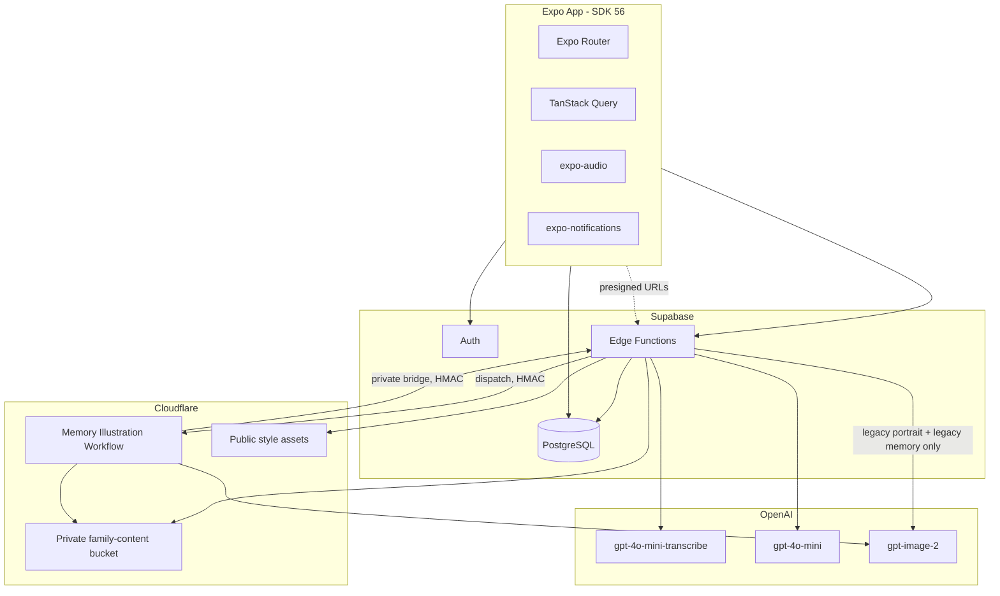
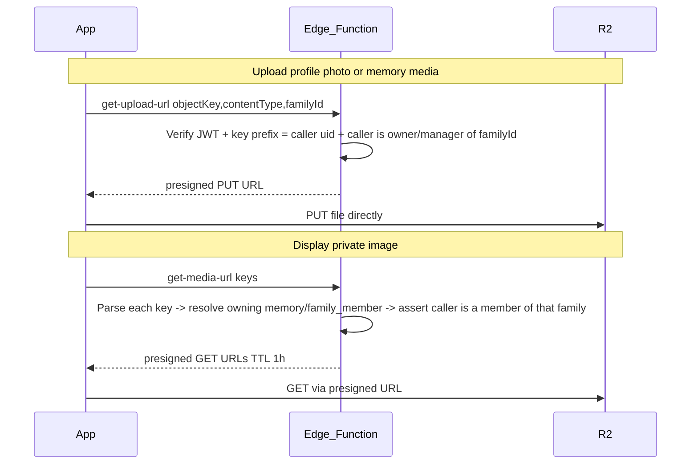

# Momora — Technical Specification

**Version:** 1.0
**Status:** Draft
**Last updated:** May 24, 2026
**Companion doc:** [PRD.md](./PRD.md)

This document defines the technical architecture, database schema, storage layout, and Edge Function contracts for the Momora MVP.

---

## 1. Architecture Overview


```mermaid
flowchart TB
    subgraph client [Expo App - SDK 56]
        Router[Expo Router]
        RQ[TanStack Query]
        Audio[expo-audio]
        Push[expo-notifications]
    end

    subgraph supabase [Supabase]
        Auth[Auth]
        DB[(PostgreSQL)]
        Edge[Edge Functions]
    end

    subgraph cloudflare [Cloudflare]
        Workflow[Memory Illustration Workflow]
        R2Private[Private family-content bucket]
        R2Public[Public style assets]
    end

    subgraph openai [OpenAI]
        STT[gpt-4o-mini-transcribe]
        LLM[gpt-4o-mini]
        Image[gpt-image-2]
    end

    client --> Auth
    client --> DB
    client --> Edge
    Edge --> DB
    Edge --> R2Private
    Edge --> R2Public
    Edge --> STT
    Edge --> LLM
    Edge -->|legacy portrait + legacy memory only| Image
    Edge -->|dispatch, HMAC| Workflow
    Workflow -->|private bridge, HMAC| Edge
    Workflow --> Image
    Workflow --> R2Private
    client -. presigned URLs .-> Edge
```

### Auth

Email OTP (one-time code) is the default for users via Supabase Auth — see
[docs/features/auth.md](./features/auth.md) for the full client flow
(`signInWithOtp`/`verifyOtp`, sign-up metadata trigger, resend cooldown).
Two allowlisted production fixture emails, entered through the normal login
email field, branch to a guarded generic password screen that calls
`signInWithPassword`: the manually provisioned App Store/Google Play reviewer
account and the screenshot demo account. The app contains no passwords. A
`__DEV__`-only shortcut to the same method remains available for Maestro E2E
(`src/utils/e2e-fixtures.ts#isE2eFixturesEnabled`). Supabase dashboard
prerequisites (reviewer account, custom SMTP, OTP email template, OTP expiry)
are documented in `docs/features/auth.md` and `docs/reviewer-access.md`; a
human must confirm them against the live project.

### Client

| Concern | Choice |
|---------|--------|
| Framework | Expo SDK 56, React Native 0.85, React 19.2 |
| Routing | Expo Router (file-based) |
| Language | TypeScript 5.x, strict mode |
| Server state | TanStack Query v5 |
| Local persistence | AsyncStorage (session, query cache optional) |
| Audio | `expo-audio` |
| Image display | `expo-image` + presigned R2 URLs (via Edge Function) |
| Builds | EAS Build + development client |

### Backend

| Concern | Choice |
|---------|--------|
| Auth & database | Supabase (Auth, PostgreSQL, RLS) |
| **Object storage** | **Cloudflare R2** (S3-compatible) — all images |
| Request/auth, DB and publication | Supabase Edge Functions (Deno) — JWT/RLS, prompt safety, job claims, presigned URLs, and compare-and-set publication |
| Durable image execution | Cloudflare Workers + Workflows — bounded memory-illustration and portrait generation/retry with direct R2 upload |
| Scheduled jobs | Supabase cron or scheduled Edge Functions |

**Why R2 instead of Supabase Storage:** Momora is image-heavy (profile photos, portraits, every memory illustration). Timeline/calendar views re-fetch images often. Supabase charges for **egress** beyond plan quotas (~$0.09/GB uncached); R2 has **$0 egress** and ~$0.015/GB-month storage. See [COST_OPTIMIZATION.md](./COST_OPTIMIZATION.md).

**Supabase Storage is not used** in Momora2.

`MEMORY_ILLUSTRATION_BACKEND` and `PORTRAIT_GENERATION_BACKEND` independently
control the two durable rollouts. `legacy` (or an unset value) retains each
existing in-function image path; `cloudflare` uses the durable Workflow path.
The Workflow never receives a
Supabase service-role key: it receives only a job ID and fetches short-lived,
signed job input from the Supabase bridge. Supabase remains the authority for
claiming and publishing a memory illustration.

See [durable-ai-generation-workflows.md](./durable-ai-generation-workflows.md)
for the reusable trust-boundary, idempotency, retry, rollout, and
portrait-migration lessons from this production cutover.

---

## 2. Database Schema

**Family sharing (2026-07-11):** every table below reflects the
post-family-sharing state. `user_id` on `memories`/`family_members` is now
**creator attribution**, not ownership — nullable, `on delete set null`,
and immutable once set. Tenancy lives in the new `family_id` column on both
tables (`not null`, also immutable once set). `user_profiles.illustration_style`
moved to `families.illustration_style`. See
[§2.6 Family sharing](#26-family-sharing-tenancy-roles-rls) below and
[docs/features/family-sharing.md](./features/family-sharing.md) for the full
tenancy model, roles, and RLS rewrite — this section only lists schema.

### 2.1 Tables

```sql
-- Extends Supabase auth.users
create table public.user_profiles (
  id uuid references auth.users on delete cascade primary key,
  name text not null,
  timezone text not null default 'UTC',
  enable_daily_reminder boolean not null default false,
  notification_time time,
  expo_push_token text,
  has_completed_onboarding boolean not null default false,
  deleted_at timestamptz,
  scheduled_hard_delete_at timestamptz,
  account_deletion_token uuid,               -- exact soft-delete operation provenance
  hard_delete_token uuid,                    -- exact cron finalization claim
  hard_delete_started_at timestamptz,
  active_family_id uuid references public.families on delete set null,  -- which family the client shows
  notify_new_memories boolean not null default true,                    -- new-memory push opt-out
  notify_engagement boolean not null default true,                      -- like/comment push opt-out
  created_at timestamptz not null default now(),
  updated_at timestamptz not null default now()
);
-- illustration_style column dropped (2026-07-11) -- moved to families.illustration_style.

create table public.family_members (
  id uuid primary key default gen_random_uuid(),
  user_id uuid references auth.users on delete set null,  -- creator attribution (nullable, was NOT NULL)
  family_id uuid not null references public.families on delete cascade,  -- tenancy
  name text not null,
  nicknames text[] default '{}',
  date_of_birth date,
  gender text,
  profile_picture_key text,          -- deprecated cutover columns; portrait versions are canonical
  illustrated_profile_key text,
  illustrated_profile_status text not null default 'pending'
    check (illustrated_profile_status in ('pending', 'generating', 'ready', 'failed')),
  additional_info text,
  is_user_profile boolean not null default false,
  created_at timestamptz not null default now(),
  updated_at timestamptz not null default now()
);

create table public.family_member_portrait_versions (
  id uuid primary key,
  family_id uuid not null,
  family_member_id uuid not null,
  user_id uuid references auth.users on delete set null,
  reference_date date,               -- null only for migrated legacy_unknown rows
  date_source text not null check (date_source in ('exif', 'manual', 'default_today', 'legacy_unknown')),
  profile_picture_key text not null unique,
  illustrated_profile_key text,
  illustrated_profile_status text not null default 'pending'
    check (illustrated_profile_status in ('pending', 'generating', 'ready', 'failed')),
  generation_token uuid,
  generation_started_at timestamptz,
  generation_output_key text,
  deletion_token uuid,
  deletion_started_at timestamptz,
  created_at timestamptz not null default now(),
  updated_at timestamptz not null default now(),
  foreign key (family_member_id, family_id)
    references public.family_members (id, family_id) on delete cascade
);

-- Private durable portrait execution state. RLS is enabled with no client
-- policies; only authorized server code and the signed bridge access it.
create table public.portrait_generation_jobs (
  id uuid primary key,
  workflow_instance_id text not null unique,
  portrait_version_id uuid not null references public.family_member_portrait_versions (id) on delete cascade,
  family_id uuid not null references public.families (id) on delete cascade,
  actor_user_id uuid references auth.users (id) on delete set null,
  attempt_id uuid not null unique,
  request_intent text not null check (request_intent in ('initial', 'recovery', 'manual_regenerate')),
  status text not null check (status in ('queued', 'running', 'succeeded', 'failed', 'superseded')),
  started_at timestamptz not null,
  provider_deadline_at timestamptz not null,
  source_photo_key text,
  style_reference_key text,
  portrait_prompt text,
  output_key text not null,
  old_portrait_key text,
  primary_attempts smallint not null default 0,
  fallback_attempts smallint not null default 0,
  model text,
  error_code text,
  upload_token uuid,                         -- exact pre-PUT R2 lease
  upload_started_at timestamptz,
  last_upload_completed_token uuid,
  completed_at timestamptz,
  created_at timestamptz not null default now(),
  updated_at timestamptz not null default now()
);
create unique index portrait_generation_jobs_one_active_per_version
  on public.portrait_generation_jobs (portrait_version_id)
  where status in ('queued', 'running');
alter table public.portrait_generation_jobs enable row level security;

create table public.portrait_generation_workflow_bridge_nonces (
  nonce uuid primary key,
  received_at timestamptz not null default now()
);
alter table public.portrait_generation_workflow_bridge_nonces enable row level security;

create table public.memories (
  id uuid primary key default gen_random_uuid(),
  user_id uuid references auth.users on delete set null,  -- creator attribution (nullable, was NOT NULL)
  family_id uuid not null references public.families on delete cascade,  -- tenancy
  content text,                              -- required for text_illustration and text_only; optional caption for media/audio
  memory_date date not null default current_date,
  memory_type text not null default 'text_illustration'
    check (memory_type in ('text_illustration', 'text_only', 'media', 'audio')),
  emotion text,
  illustration_key text,                     -- R2 object key; populated for text_illustration only
  illustration_status text not null default 'none'
    check (illustration_status in ('none', 'pending', 'generating', 'ready', 'failed')),
  illustration_prompt text,
  media_key text,                            -- R2 object key for user-uploaded photo/video, or the kept clip for `audio`
  media_content_type text,                   -- MIME type e.g. image/jpeg, video/mp4, audio/mp4
  -- Audio memories (2026-08-19, 20260819120000_audio_memories.sql,
  -- docs/features/audio-memories.md): invisible raw transcript for `audio`
  -- rows, search-only -- never rendered client-side. GIN index below.
  -- Nullable, normalized empty-string -> NULL on write (never '').
  audio_transcript text,
  link_previews jsonb not null default '{}'::jsonb,  -- { [url]: { title: string|null, fetchedAt } } -- see fetch-link-previews (§4.13)
  -- Share card store-through cache (2026-08-05,
  -- docs/plans/share-card-store-through.md, W1): cached compose-share-card
  -- PNG key for a text-only/illustrated memory's card (per-ASSET card for
  -- `media` memories lives on memory_media.share_card_key instead). Written
  -- only by compose-share-card's service-role client -- no client grant is
  -- added (see the migration's comment for why that's convention, not a
  -- DB-enforced boundary, on this table). Cleared by the
  -- clear_memory_share_card_on_content_change trigger (§2.4) whenever
  -- content/memory_date/emotion change; untouched by illustration-status-only
  -- writes.
  share_card_key text,
  created_at timestamptz not null default now(),
  updated_at timestamptz not null default now()
);

-- Family sharing (2026-07-11): tenancy + invite tables. Full lifecycle,
-- roles, and RLS in docs/features/family-sharing.md; schema only here.
create table public.families (
  id uuid primary key default gen_random_uuid(),
  owner_id uuid not null references auth.users on delete cascade,  -- family dies with owner
  name text not null,
  illustration_style text not null default 'default',
  deleted_at timestamptz,                    -- owner soft-delete; owner-exempt from RLS invisibility
  account_deletion_token uuid,               -- exact owner soft-delete operation
  deletion_fence_token uuid,                 -- exact account-cleanup R2 fence
  deletion_fence_started_at timestamptz,
  -- Memory share cards (2026-08-05, docs/plans/offline-awareness-and-share-cards.md
  -- S1): owner/manager can turn off sharing for viewers family-wide; viewers
  -- share by default. Enforced server-side by compose-share-card, not just
  -- hidden client-side. Row-level RLS on this table covers the column, but a
  -- column-level `grant update (viewer_sharing_enabled)` is required too --
  -- see 20260801170000_paid_subscription_sol_hardening.sql's table-level
  -- UPDATE revoke.
  viewer_sharing_enabled boolean not null default true,
  created_at timestamptz not null default now(),
  updated_at timestamptz not null default now()
);

create table public.family_memberships (
  id uuid primary key default gen_random_uuid(),
  family_id uuid not null references public.families on delete cascade,
  user_id uuid not null references auth.users on delete cascade,
  role text not null check (role in ('owner', 'manager', 'viewer')),
  created_at timestamptz not null default now(),
  updated_at timestamptz not null default now(),
  unique (family_id, user_id)
);
-- Exactly one 'owner' row per family:
create unique index one_owner_per_family on public.family_memberships (family_id) where role = 'owner';

create table public.family_invites (
  id uuid primary key default gen_random_uuid(),
  family_id uuid not null references public.families on delete cascade,
  code text not null unique,                 -- normalized "word-word-word"
  role text not null check (role in ('manager', 'viewer')),
  status text not null default 'pending'
    check (status in ('pending', 'redeemed', 'approved', 'rejected', 'revoked')),
  invited_by uuid not null references auth.users on delete cascade,
  redeemed_by uuid references auth.users on delete set null,
  redeemed_at timestamptz,
  resolved_by uuid,
  resolved_at timestamptz,
  expires_at timestamptz not null default now() + interval '7 days',
  created_at timestamptz not null default now(),
  updated_at timestamptz not null default now()
);

-- ~1,000-word curated seed list create_family_invite samples 3 words from.
-- Service-role/definer-only -- RLS enabled with NO policies (see §2.6).
create table public.invite_code_words (
  word text primary key
);

-- Rate-limit log for redeem-family-invite. Service-role/definer-only.
create table public.invite_redemption_attempts (
  user_id uuid not null,
  ip text,
  attempted_at timestamptz not null default now()
);

-- Family activity / engagement push debounce log. Service-role/definer-only.
create table public.family_activity_log (
  family_id uuid not null references public.families on delete cascade,
  actor_id uuid not null,
  kind text not null,                        -- 'new_memory' or engagement_<kind>:<entity-id>
  created_at timestamptz not null default now()
);

create table public.memory_family_members (
  memory_id uuid references public.memories on delete cascade,
  family_member_id uuid references public.family_members on delete cascade,
  primary key (memory_id, family_member_id)
);

create table public.memory_media (
  id uuid primary key default gen_random_uuid(),
  memory_id uuid references public.memories on delete cascade not null,
  object_key text not null,
  content_type text not null,
  duration_ms integer,
  aspect_ratio double precision check (aspect_ratio is null or aspect_ratio between 0.1 and 10),
  position integer not null check (position >= 0 and position < 10),
  -- Derived bandwidth-friendly JPEG preview (longest edge <= 1280px),
  -- generated client-side for images only; null for videos, legacy rows,
  -- assets already at or under the cap (no-upscale guard), and failed
  -- preview uploads (fail-open). See §5.5 and features/media-memories.md.
  preview_object_key text,
  -- Share card store-through cache (2026-08-05,
  -- docs/plans/share-card-store-through.md, W1): cached compose-share-card
  -- PNG key for THIS asset's card (media memories share per-ASSET, unlike
  -- text-only/illustrated memories which cache on memories.share_card_key).
  -- Written only by compose-share-card's service-role client. Every row
  -- this table holds is freshly inserted by replace_memory_media_assets
  -- (which deletes and re-inserts on any media edit), so a new/replaced
  -- asset always starts with share_card_key null -- no trigger needed here,
  -- unlike the memories-table column above.
  share_card_key text,
  created_at timestamptz not null default now(),
  updated_at timestamptz not null default now(),
  unique (memory_id, position),
  unique (memory_id, object_key)
);

-- Engagement. Viewer participation is intentional; see §2.3 RLS.
create table public.memory_likes (
  memory_id uuid not null references public.memories on delete cascade,
  user_id uuid not null references auth.users on delete cascade,
  created_at timestamptz not null default now(),
  primary key (memory_id, user_id)
);

create table public.memory_comments (
  id uuid primary key default gen_random_uuid(),
  memory_id uuid not null references public.memories on delete cascade,
  user_id uuid not null references auth.users on delete cascade,
  content text not null check (char_length(trim(content)) between 1 and 1000),
  created_at timestamptz not null default now()
);
```

### 2.1a Looking Back packages

Looking Back (`docs/features/looking-back.md`) materializes one immutable,
family-owned archive package set per owner-local day. It is an archive-read
surface: membership, including `viewer`, is enough to retrieve it; subscription
write entitlement is never consulted.

```sql
create table public.looking_back_daily_sets (
  id uuid primary key default gen_random_uuid(),
  family_id uuid not null references public.families on delete cascade,
  package_date date not null,
  timezone_name text not null,               -- validated IANA owner snapshot
  refresh_after timestamptz not null,        -- next midnight in that timezone
  created_at timestamptz not null default now(),
  unique (family_id, package_date, refresh_after),
  unique (id, family_id, package_date)
);

create table public.looking_back_packages (
  id uuid primary key default gen_random_uuid(),
  daily_set_id uuid not null,
  family_id uuid not null references public.families on delete cascade,
  package_date date not null,
  package_type text not null,                -- closed V1 recipe vocabulary
  subject_family_member_id uuid,             -- primary subject for age/birthday/pair recipes
  secondary_subject_family_member_id uuid,   -- required only for members_together
  display_kind text not null,
  display_title text not null,
  display_subtitle text,
  display_era text not null,
  tint text check (tint is null or tint in (
    'joy', 'funny', 'calm', 'wonder', 'tender', 'mischief', 'pride',
    'bittersweet', 'worry', 'weary', 'sad'
  )),
  recipe_identity text not null,             -- type/window only; never content
  signature text not null,                   -- SHA-256 of final memory ids
  position smallint not null check (position between 0 and 3),
  created_at timestamptz not null default now(),
  foreign key (daily_set_id, family_id, package_date)
    references public.looking_back_daily_sets (id, family_id, package_date)
    on delete cascade,
  foreign key (subject_family_member_id, family_id)
    references public.family_members (id, family_id) on delete cascade,
  foreign key (secondary_subject_family_member_id, family_id)
    references public.family_members (id, family_id) on delete cascade,
  unique (daily_set_id, position),
  unique (daily_set_id, signature),          -- immutable interval-local
  unique (id, family_id)
);

create table public.looking_back_package_memories (
  package_id uuid not null,
  family_id uuid not null,
  memory_id uuid not null,
  position smallint not null check (position between 0 and 9),
  created_at timestamptz not null default now(),
  primary key (package_id, memory_id),
  foreign key (package_id, family_id)
    references public.looking_back_packages (id, family_id) on delete cascade,
  foreign key (memory_id, family_id)
    references public.memories (id, family_id) on delete cascade,
  unique (package_id, position)
);

create table public.looking_back_package_views (
  package_id uuid not null references public.looking_back_packages on delete cascade,
  user_id uuid not null references auth.users on delete cascade,
  first_viewed_at timestamptz not null default now(),
  last_viewed_at timestamptz not null default now(),
  completed_at timestamptz,
  primary key (package_id, user_id)
);
```

The `looking_back_daily_sets` parent is also the empty-day sentinel, so a
second fetch cannot produce a new rail later in the same active owner-local
interval. `timezone_name` and `refresh_after` are immutable snapshots; a later
owner timezone change participates only after the old set's `refresh_after`
passes. A backward timezone move can then collide with an already expired
displayed `package_date`; the RPC creates a second immutable interval for that
date instead of returning or mutating stale metadata. Cooldowns are measured
from package exposure timestamps, rather than local-date strings, so this
edge case cannot repeat recently exposed memories.
Composite FKs bind package items and optional recipe subjects to the same family,
including when a definer function has a defect. Deleting a subject child
cascades its derived age, birthday, or togetherness package instead of delaying profile
deletion until retention passes. Retention is 45 days and is
opportunistically cleaned by materialization; daily-set cascades remove
packages, items, and personal view rows.

Daily materialization keeps at most one candidate per `package_type`, then
selects up to four recipe types by the documented deterministic priority. When
at least four eligible memories remain, `archive_mix` is considered before the
lower-priority month/written fallbacks and reserves one of the four slots. Its
candidate order is deterministic but age-stratified: up to four memories from
90 days–18 months, three from 18–36 months, and three at least 36 months old.
Missing bands are filled from the remaining eligible IDs, preserving the
4–10 package bound. Birthday candidates run during a member's ±3-day birthday
appearance window, require a tagged member, a ±7-day anniversary memory
window, four memories across at least two historical years, and one memory per
year before deterministic fill. Togetherness candidates require both canonical
member tags on every selected memory and retain a second same-family subject.
Emotion candidates use only the exact stored `funny` or `mischief` labels and
share one `emotion_archive` slot. The final de-overlap step re-ranks remaining
IDs within each archive age band so same-day overlap refills that band before
global backfill; thematic recipes retain their date order. A recent
`recipe_identity` receives a soft three-day ranking penalty. Age, birthday, and
pair subjects receive an additional soft penalty when recently featured before
the deterministic day hash. Exact final-package (14-day) and included-memory
(7-day) cooldowns remain hard. Existing daily sets are immutable, so selector
changes affect only later materialization intervals. Display-title templates
are `[Name]’s birthday, through the years`, `Moments with [X] & [Y]`, `The funny
ones`, `Tiny troublemakers`, `From [Name]'s first year` for age-zero packages,
`From [Month YYYY]` for month archives, and `A little look back` for mixed
archive fallback packages; the title-copy migration backfills already-materialized
package rows.

### 2.1b Gallery import

`20260809130000_gallery_import_foundation.sql` adds a device-bound, RPC-only
staging domain for gallery import. It is deliberately not a second memory
writer: `finalize_gallery_import_candidate` is the one atomic route that moves
an approved staged item into `memories`/`memory_media`/tags.

`20260823100000_gallery_import_continuous.sql` moves the model from a capped
"run a batch, review, start another" flow to one continuous per-family
library sweep (see [docs/plans/gallery-import-continuous.md](plans/gallery-import-continuous.md)):
admission is no longer limited by a first-30-days/normal-monthly run count —
a family may only have one *active* run at a time (unchanged), but nothing
caps how many runs it starts over its lifetime. Fair use is instead a
**rolling 24h per-family cluster cap** (`daily_cluster_limit`, default 300),
enforced at chunk registration. **The review window is 30 days from last
activity, not from run creation**: `gallery_import_touch_run` extends
`gallery_import_runs.expires_at` (and propagates the same new expiry to every
live `gallery_import_assets`/`gallery_import_candidates` row) on every
chunk registration, candidate skip/undo, approval begin/finalize, and
candidate read. Throttled to at most once per day of activity (a no-op
single-statement `UPDATE ... WHERE expires_at < now() + review_ttl - 1 day`
when not due) — `get_gallery_import_candidates` alone is polled by the
review deck every ~9s, and without the throttle every poll would `UPDATE`
every live asset/candidate row for the run.

| Table / column | Canonical contract |
|---|---|
| `memories.creation_source` | Server-owned `manual \| onboarding \| gallery_import`; gallery provenance is operational only and is not rendered. |
| `families.gallery_caption_language`, `gallery_caption_instructions` | Owner-managed BCP 47 locale and optional sanitized instruction (≤500 chars). |
| `gallery_import_admission_settings` | Singleton server kill/admission configuration: `enabled`, review TTL (1–90 days; default 30), exactly-30-minute digest quiet period, policy epoch, rolling **`daily_cluster_limit`** (smallint, 20–5000, default 300) fair-use cap, and a widened validated limit template (`maxChunksPerRun` 1–5000, `maxAssetsPerRun` 1–100000, `maxAssetsPerChunk` 1–500, `maxCandidatesPerRun` 1–10000; default snapshot `{"maxChunksPerRun":2000,"maxAssetsPerRun":50000,"maxAssetsPerChunk":100,"maxCandidatesPerRun":5000,"maxProviderAttemptsPerCluster":3,"maxImagesPerCluster":10,"maxPreviewBytes":1500000}`). The `normal_monthly_run_limit`/`initial_run_limit`/`initial_window` columns remain in the schema but are no longer read by `create_gallery_import_run_internal`. |
| `gallery_import_runs` | `(family_id, actor_id)`, capability hash, algorithm/consent/permission snapshots, status `scanning\|processing\|reviewing\|completed\|cancelled\|expired\|failed`, immutable limit snapshot, and expiry/cleanup fence. A due completed run transitions to `expired` only when fenced cleanup claims its transient objects; approved memory/media and receipts are retained. One active run per family — but admission no longer caps how many runs a family can start over time (see above). |
| `gallery_import_chunks` | Bounded immutable manifest, opaque UUID tokens (never OS IDs), Workflow ID/status, and now `dispatch_attempts` (smallint, default 0, incremented by `mark_gallery_chunk_dispatched` on every (re)dispatch) for reconciliation. The `processing → dispatched` transition is now valid (a stuck chunk can be re-marked dispatched under a new Workflow instance id). |
| `gallery_import_assets` | Per-asset manifest row; now also `unavailable_at` (nullable timestamptz) — set by `mark_gallery_import_assets_unavailable` for an asset the device can no longer produce a preview for (deleted, iCloud-only original, permission revoked mid-sweep). Only an asset with `preview_uploaded_at is null` can be marked unavailable; a verified preview manifest stays immutable. |
| `gallery_import_cluster_results` | Per-cluster terminal ledger, `state \| skip_reason \| candidate_count`. **Has no `id` column** — its primary key is the composite `(chunk_id, cluster_signature)`. |
| `gallery_import_candidates`, `gallery_import_cluster_receipts` | Staged candidate (caption ≤1,000, 1–10 selected opaque tokens, at most three split groups), status and best-effort same-device/reinstall suppression receipt. No prompt/model response/semantic description is stored. |
| `gallery_import_provider_attempts` | Private service-only reservation and scalar usage/error state: `reserved\|inflight\|completed\|failed\|ambiguous\|cancelled`; a possible paid ambiguous outcome is never auto-replayed. `reserve_gallery_attempt` treats an existing terminal (not `reserved`/`inflight`) attempt row at the requested ordinal as consumed and returns `denied` — this also fixed a real bug where retrying an `ambiguous` ordinal raised a duplicate-key error instead (plpgsql `RETURN QUERY` does not exit the function; the prior code fell through into an unconditional `INSERT`). |
| `gallery_import_approval_leases` | Candidate-bound stable memory ID, hash of lease token, exact expected/original-uploaded keys, state and cleanup fence for idempotent finalization. |
| `gallery_import_digest_windows` | Per-family/actor approval aggregation and idempotent cron claim/send state. |
| `gallery_import_workflow_bridge_nonces` | Service-only HMAC replay nonce with a bounded (default 10-minute) expiry. |

Gallery staging tables have RLS enabled, no direct client grants, and no
client-readable policies. All client access is through capability-bound,
security-definer RPCs; all service operations are granted only to the service
role. Composite run/candidate foreign keys, immutable-manifest/identity
triggers, and transition validation prevent cross-run/family reassignment.
The canonical migration also creates indexes for active runs, cleanup,
candidate reads, clusters, and bridge-nonce expiry; it schedules digest sends
every five minutes and cleanup hourly through Vault-backed `pg_cron` calls.

**RPCs added/changed by the continuous migration:**

| RPC | Contract |
|---|---|
| `register_gallery_import_chunk` | Unchanged signature. Now also enforces the rolling 24h `daily_cluster_limit`: raises `'Gallery import daily limit reached'` with `errcode='P0002'` and a `hint` carrying the ISO-8601 UTC timestamp the window frees — distinct from every other (hint-less) `P0002` in this domain. The Edge maps this specific shape to HTTP 429 `{ code: 'fair_use', retryAfterSeconds }`; a plain "not found" `P0002` still maps to 404. The hint is the instant `used' + p_cluster_count` first fits under the cap — the `k`-th oldest counted row's `created_at + 24h` where `k = used + p_cluster_count - limit` — not `min(created_at) + 24h` of the whole window; a multi-cluster chunk needing more than one row to free would otherwise be refused again immediately on retry and thrash. |
| `mark_gallery_import_assets_unavailable(p_run_id, p_capability, p_chunk_id, p_asset_tokens)` | Client-callable (capability-bound). Marks not-yet-uploaded assets unavailable, recomputes the chunk's `asset_count`/`cluster_count`, resolves any cluster left with zero available assets as `invalid_preview` (via `publish_gallery_cluster_result`, writing no suppression receipt), and closes the chunk `completed` without dispatch if nothing is left. |
| `claim_stale_gallery_chunks(p_limit)` | Service-only. Claims chunks `dispatched`/`processing` with `dispatched_at` older than 20 minutes (run non-terminal, not expired) for redispatch, returning `(chunk_id, run_id, dispatch_attempts)`; a chunk already at `dispatch_attempts >= 3` is instead failed directly with `fail_gallery_chunk(id, 'GALLERY_RECONCILE_EXHAUSTED')`. |
| `fail_gallery_cluster(p_chunk_id, p_cluster_signature, p_closed_error_code)` | Service-only. Resolves a single cluster `failed` without failing the rest of the chunk; chunk/run completion bookkeeping mirrors `fail_gallery_chunk`. |
| `get_gallery_import_fair_use(p_family_id)` | Service-only. Returns `{ used, limit, resets_at }` for the family's rolling 24h cluster window; backs the Edge's `fairUse.pausedUntil` field. `resets_at` uses the same `k`-th-row precision as `register_gallery_import_chunk`'s hint (`k = used - limit + 1`). |
| `gallery_import_touch_run(p_run_id)` | Internal (no client/service grant — called only from other `SECURITY DEFINER` functions). Extends `expires_at` to `now() + review_ttl`, throttled to at most once per day of activity (`WHERE expires_at < now() + review_ttl - interval '1 day'`) so the common case is a single no-op statement; only an actual extension propagates to live assets/candidates. |
| `complete_gallery_import_run` | Additionally refuses (`P0001`, `'Gallery import still has work in flight'`) while any chunk is `registered\|uploading\|dispatched\|processing`, not only while candidates are `staged\|posting`. |
| `publish_gallery_candidates` (and, transitively, `publish_gallery_cluster_result`) | Now also refuses (`P0001`, `'Run is closed'`) into a `completed` run, matching `cancelled\|expired\|failed`. |
| `register_gallery_import_assets` | The `scanning/processing → reviewing` auto-flip (when a chunk registers with zero effective clusters) now also requires every other chunk in the run to already be terminal, mirroring `publish_gallery_cluster_result`/`fail_gallery_chunk`. |
| `mark_gallery_chunk_dispatched` | Also accepts chunks in `processing` (re-dispatch) and increments the new `dispatch_attempts` column. Asset-completeness checks exclude `unavailable_at is not null` assets. |
| `get_gallery_chunk_input` | Excludes `unavailable_at is not null` assets from both its completeness check and the clusters/assets payload sent to the Worker. |

Edge (`_shared/gallery-import.ts`) fixes a production bug where
`countPendingGalleryClusters` selected a non-existent `id` column on
`gallery_import_cluster_results` (PostgREST 400 → `pendingClusters` always
`null`); it now selects `chunk_id`. `clientRun` additionally returns `chunks`
(an array of `{ ordinal, status }`, distinct from the pre-existing aggregate
`chunkCount`), `liveCandidateAssetTokens` (deduplicated tokens of
`staged`/`skipped` candidates), and `fairUse: { pausedUntil }`.
`dispatchGalleryImportChunk` accepts an optional `unavailableAssetTokens`
body field and sends `attempt` alongside `chunkId` to the Worker's
`/dispatch/gallery` endpoint (`markAndDispatchGalleryChunk`'s Workflow
instance id is `gallery:${chunkId}` for `attempt <= 1`, else
`gallery:${chunkId}:${attempt}`). `redispatchStaleGalleryChunks` (used by
`cleanup-gallery-imports`) claims and re-dispatches stale chunks each hour.
`workflow-gallery-import-bridge` adds a `fail_gallery_cluster` operation and
reclassifies RPC errors: only `P0001\|22023\|42501\|28000` map to the
existing 409 `bridge_rejected`; every other Postgres error (deadlock
`40P01`, statement timeout `57014`, connection-class `08xxx`,
resource-class `53xxx`, or anything unexpected) maps to a retryable 503
`bridge_unavailable`.

### 2.1c Family activity feed

`docs/plans/family-activity.md` — a persistent, family-scoped feed ("Ana
added a memory", "Grandma liked your memory") surfaced via a bell + bottom
sheet on the timeline. Ids only; content is joined at read time.

```sql
create table public.family_activity_events (
  id            uuid primary key default gen_random_uuid(),
  family_id     uuid not null references public.families on delete cascade,
  actor_id      uuid not null references auth.users on delete cascade,
  kind          text not null check (kind in (
                  'memory_added','memory_commented','memory_liked',
                  'member_joined','member_pending')),
  memory_id     uuid references public.memories on delete cascade,
  comment_id    uuid references public.memory_comments on delete cascade,
  like_user_id  uuid,  -- set for memory_liked; with memory_id identifies the like row
  invite_id     uuid references public.family_invites on delete cascade,
  created_at    timestamptz not null default now()
);

alter table public.family_memberships
  add column activity_seen_at timestamptz;  -- nullable; null = never opened
```

Every FK cascades, so deleting a memory/comment/invite deletes its events
too — nothing to separately scrub. Migration
`supabase/migrations/20260822100000_family_activity.sql` backfills recent
history (memories: last 90 days; comments/likes: all; memberships: every
row but the founder's; invites: those currently `redeemed`) and applies the
retention prune (§5.4-equivalent, see below) once immediately after.

### 2.1d Memory Book generation (V5a)

`docs/plans/memory-book.md` §"V5 scope" 5a + §8 data-model sketch. One row
per book project (see [docs/features/memory-book-generation.md](./features/memory-book-generation.md)
for the full contract and how the worker extends it). The app inserts a
`queued` row from the in-app scope picker; a service-role worker (a
separate change, not yet built) owns every status transition from there —
mirrors the illustration workflow's client-writes-nothing invariant
(`docs/durable-ai-generation-workflows.md` "Core invariants" #2). Unlike
the illustration pipeline there is no separate private job table for V5a:
`book_document` stays null until `ready`, so the single row never exposes
in-progress content beyond the family boundary it already has.

```sql
create table public.memory_books (
  id                        uuid primary key default gen_random_uuid(),
  family_id                 uuid not null references public.families on delete cascade,
  child_id                  uuid references public.family_members on delete cascade, -- required only for scope_kind = 'age_year'
  requested_by              uuid references auth.users on delete set null,

  scope_kind                text not null check (scope_kind in (
                               'age_year', 'calendar_year', 'everything', 'custom_range')),
  scope_start_date          date, -- frozen by the app at insert time; null only for 'everything'
  scope_end_date             date,
  scope_label                text not null,

  status                    text not null default 'queued'
                               check (status in ('queued', 'generating', 'ready', 'failed')),
  failure_reason             text,
  workflow_instance_id       text unique,  -- Cloudflare Workflow instance id; set by the dispatcher only
  generation_attempt_id      uuid,          -- compare-and-set token for the current attempt
  generation_started_at      timestamptz,   -- dedicated recovery clock, not created_at/updated_at
  generation_completed_at    timestamptz,

  page_budget                smallint not null check (page_budget between 18 and 122),
  book_document               jsonb,  -- null until status = 'ready'; single-renderer book JSON (plan §3/§9)
  cover_asset_key             text,   -- R2 object key for the shelf/list cover facsimile; null until status = 'ready'

  created_at timestamptz not null default now(),
  updated_at timestamptz not null default now()
);
```

**`cover_asset_key`** (migration `20260917120000_memory_book_cover_asset.sql`, memory-book shelf redesign; precedence corrected by `20260917150000_memory_book_cover_asset_refine.sql` after a device-testing finding that the shelf cover didn't match the book's real cover; made cover-edit-aware by `20260917170000_memory_book_cover_asset_edits.sql`, 2026-09-17 owner decision): one representative R2 object key for a ready book's shelf/list-tile cover facsimile, so the picker's poll loop can render a tile without shipping the whole `book_document` jsonb.

**Writers (two):**
1. `workflow-memory-book-bridge`'s `handlePublish`, in the SAME CAS `UPDATE` that flips `status` to `'ready'` (§4.22) — `cover_asset_key: pickCoverAssetKey(bookDocument)`, no `coverEdit` argument (a book can't have a saved edit before it's ever been `ready`, since the edit surface itself requires `status = 'ready'`).
2. `memory-book-edits`' `save_edit` (§4.23), but ONLY when the saved edit's `images.cover` record itself changed (added, changed, or removed) — compared structurally against the previous saved value; every other edit kind (text, focal point, a non-cover `imageReplace`) is a guaranteed no-op here and never touches `memory_books` at all. When it changed, `save_edit` recomputes `cover_asset_key: pickCoverAssetKey(book.book_document, nextEdits.images.cover)` SYNCHRONOUSLY, before responding — never fire-and-forget — so a client that re-reads the book right after the save can't race a stale value. A recompute failure (rare: only the `memory_books` `UPDATE` itself) is logged with the book id only and never fails the edit save, which already durably persisted in `memory_book_edits` first.

**Precedence** (via `_shared/memory-book-cover.ts`'s `pickCoverAssetKey(bookDocument, coverEdit?)`) mirrors `book-renderer/src/model/fitter.ts`'s `buildCoverPages` (and its `effectiveCoverWidth`/`pickMiddleOfRangeCoverPhoto` helpers) BYTE-FOR-BYTE — this is the actual rendered-cover selection, not the web list's own looser `pickListThumbnailKey` (`book-renderer/src/web/books/thumbnail.ts`), which this column no longer mirrors:
0. If a `coverEdit` (`ImageEditRecord`) is given, it is checked FIRST — mirroring `book-renderer/src/model/edits.ts`'s `applyCoverImageEdit`, which prepends a synthetic `'__cover-edit__'` memory id to `outline.coverCandidates`. This is **not an unconditional override**: the synthetic candidate (built via the same `applyWidthHeight` derivation — `originalWidth` if present, else `round(100 * aspectRatio)` as a fail-closed sentinel) must clear the identical width gate as any AI candidate. A too-small (or malformed/absent) edit is silently skipped, falling through unchanged to steps 1–4 below.
1. Walk `outline.coverCandidates` in order; for each id, the first asset (in that memory's own `assets` array order) with `kind === 'photo'` AND `effectiveCoverWidth(asset) >= 2000` — `effectiveCoverWidth` prefers `asset.originalWidth` (the real source-pixel width) over `asset.width` (the ~1280px preview-export width). First id that yields one wins.
2. Legacy fallback: the first asset — iterating every manifest memory in `Object.entries(manifest.memories)` order, then that memory's own `assets` order — whose memory id is in `outline.heroCandidates` AND `kind === 'photo'`. NO width floor (kept byte-identical to the pre-existing behavior for already-issued books).
3. `pickMiddleOfRangeCoverPhoto`: among ALL `kind === 'photo'` assets (across every memory) with `effectiveCoverWidth(asset) >= 2000`, the one whose memory date is closest to the midpoint of `manifest.scope.start`/`.end`; ties broken by widest `effectiveCoverWidth`, then lowest memory id (string compare).
4. Nothing qualifies → `null` (the real cover renders `'minimal'`/no photo; the shelf shows a placeholder wash — correct, not a bug).

Fully defensive against a malformed `book_document`/`coverEdit` — this runs on the publish and edit-save paths, neither of which may ever fail over malformed data. **Backfill:** `20260917120000`'s original backfill used the OLD (wrong, `assets[0]`-based) precedence and is not edited — it already ran against the live DB. `20260917150000` re-backfills every pre-existing `status = 'ready'` row with the corrected 3-pass AI-only precedence in SQL (jsonb), OVERWRITING `cover_asset_key` (including to `null` when nothing qualifies, since the old value may be wrong) rather than coalescing; its pass 2 (hero-candidate fallback) iterates manifest memories in SQL's own (arbitrary) row order rather than JSON key-insertion order — an accepted approximation for a one-time backfill, since new books always go through the exact JS precedence regardless. `20260917170000` layers a cover-edit-aware pass on top: it joins `memory_book_edits`, and for every `ready` book with a qualifying saved cover edit (same width gate, evaluated in SQL with regex-guarded numeric casts), overwrites `cover_asset_key` to that edit's `file`. A book with no cover edit, or a non-qualifying one, is left completely untouched — `150000`'s AI-only value is already the exact correct answer for that case (that's precisely what `pickCoverAssetKey` itself falls through to), so re-deriving it here would be redundant, not a simplification worth making; the migration is deliberately conservative — any ambiguous/malformed edit record is skipped (left as-is) rather than guessed at.

Key constraints: `book_document` required once `ready`, `failure_reason`
required once `failed`, `age_year` requires `child_id`, every scope but
`everything` requires both dates resolved and ordered, and a partial
unique index (`memory_books_one_active_per_scope`) blocks two
simultaneously `queued`/`generating` rows for the identical
`(family_id, child_id, scope_kind, scope_start_date, scope_end_date)` —
completed books for the same or overlapping scope are unrestricted (plan
§4: "scopes may overlap").

RLS: `select` = `is_family_member(family_id)`; `insert` = owner/manager
(`has_family_role(family_id, ['owner','manager'])`) plus `requested_by =
auth.uid()`, a same-family check on `child_id` (the "Memory tags: insert"
cross-family-tag lesson applied here), and a with-check pinning the row to
the exact just-queued shape (`status = 'queued'`, every generation-identity
column and `book_document` null). **No update or delete policy exists for
`authenticated` at all**, and the table grants `authenticated` only
`select, insert` — mirrors `memory_illustration_jobs`' "job is
service-only" contract: every status transition and the eventual
`book_document` write happens through a service-role RPC the worker change
owns, not through RLS-permitted client writes.

### 2.1e Memory Book v1 edit surface (V5b)

`plans/memory-book-5b-web-preview.md` Design Decision 4. One row per book
holding every parent-made edit (text overrides, image replace/reposition —
see [docs/features/memory-book-generation.md](./features/memory-book-generation.md#edit-surface-v1)
for the full edit-shape/keying contract) as a single `jsonb` blob.

```sql
create table public.memory_book_edits (
  book_id     uuid primary key references public.memory_books on delete cascade,
  family_id   uuid not null references public.families on delete cascade, -- denormalized for RLS select
  edits       jsonb not null default '{}'::jsonb,
  updated_by  uuid references auth.users on delete set null,

  created_at timestamptz not null default now(),
  updated_at timestamptz not null default now()
);
```

**Trust boundary (the reason this table exists as its own migration rather
than a column on `memory_books`):** clients never write `edits` directly.
The `memory-book-edits` Edge Function (§4.23, service-role) is the only
writer — it resolves `mediaId` family-ownership and measures original-photo
dimensions server-side before merging an edit in, so 5c's service-role
print path can trust every key/dimension already stored here without
re-validating it (round-3 plan hardening resolved this exact
client-fabricated-data risk by removing client write access entirely).

RLS mirrors `memory_books`' service-only shape (§2.1d): `select` =
`is_family_member(family_id)`; **no insert/update/delete policy at all**,
and the table grants `authenticated` only `select` (matching
`media_share_tokens`' precedent for a service-role-only-write table,
`20260829120000_media_share_tokens.sql`). Concurrency is single-row
last-write-wins for v1
(`save_edit` always reads-merges-writes the whole `edits` object) — stated,
not solved; per-field merge is a v2 follow-up.

### 2.1f Memory Book orders & fulfillment (V5c)

`plans/memory-book-5c-checkout-fulfillment.md` Design Decision 4 (binding
table spec). One row per purchase attempt of a Memory Book — the schema and
RLS contract only; the `memory-book-orders`/`stripe-webhook` Edge Functions
and the Cloudflare order workflow that own every field/transition below are
a separate, not-yet-shipped change (see
[docs/features/memory-book-orders.md](./features/memory-book-orders.md)).

```sql
create table public.memory_book_orders (
  id                        uuid primary key default gen_random_uuid(),
  book_id                   uuid not null references public.memory_books on delete restrict,
  family_id                 uuid not null references public.families on delete cascade,
  requested_by              uuid references auth.users on delete set null,   -- the buyer

  book_document_snapshot     jsonb,  -- frozen copies of the live book at CAS
  edits_snapshot              jsonb,  -- quoted -> paid; null until paid

  price_cents                integer,
  currency                   text not null default 'usd',                   -- locked to 'usd' (owner decision 2026-09-08)
  quoted_page_count          smallint,                                      -- render worker /fit SUBMITTED-INTERIOR count, persisted at quote time

  shipping_address            jsonb,  -- persisted by the quote op, never a
  shipping_method              text,   -- direct client write (PII — see RLS
  shipping_cost_cents          integer, -- below)

  stripe_session_id           text unique,
  stripe_payment_intent_id     text,
  prodigi_order_id            text,

  status                    text not null default 'draft'
                               check (status in (
                                 'draft', 'quoted', 'paid', 'rendering', 'submitted',
                                 'in_production', 'shipped', 'delivered', 'failed', 'cancelled')),
  failure_reason             text,   -- required once status = 'failed'
  refunded_at                 timestamptz,  -- set by the charge.refunded webhook; independent of status

  -- Carrier tracking (order-status UX round, item 3, migration
  -- 20260909130000_memory_book_order_tracking.sql). All three null until
  -- the sweep extracts them from Prodigi's shipments array on the
  -- submitted/in_production -> shipped transition -- defensively parsed,
  -- never fabricated (tracking_url/carrier can stay null even once
  -- tracking_number is set). Service-role written only, same null-locked
  -- insert with-check as every other post-draft field below.
  tracking_number             text,
  tracking_url                 text,
  carrier                     text,

  -- CAS identity + recovery clocks for the (short-lived, ends at submission) order workflow
  workflow_instance_id       text unique,
  workflow_attempt_id         uuid,
  workflow_started_at         timestamptz,
  workflow_completed_at        timestamptz,

  created_at timestamptz not null default now(),
  updated_at timestamptz not null default now()
);
```

**State machine (Decision 4, binding):** `draft → quoted → paid → rendering
→ submitted → in_production → shipped → delivered`, with `failed` reachable
from any post-payment step and `cancelled` reachable pre-payment from
`quoted` (the `checkout.session.expired` sweep ages an abandoned quote).
Key constraints: `memory_book_orders_quoted_has_price` (anything past
`draft` must already carry `price_cents` + `quoted_page_count`);
`memory_book_orders_paid_has_snapshot` (every state from `paid` through
`failed` must carry both frozen snapshots — `cancelled` is exempt since it
can precede payment); `memory_book_orders_failed_has_reason`;
`memory_book_orders_currency_usd` (hard-locked to `'usd'` until a future
multi-currency change); non-negative price/shipping-cost, positive
page-count sanity checks; `book_id` is `on delete restrict` (a purchase
record must never silently disappear if a book is ever deleted).

**RLS — deliberately NOT family-wide (round-3 hardening finding):** an order
row carries the buyer's home address and Stripe payment identifiers, which
must not be visible to every family member the way `memory_books` itself
is.

- `select`: `requested_by = auth.uid()` — the buyer only. (A family-visible
  status-only projection is a possible future addition, not built here.)
- `insert`: `has_family_role(family_id, ['owner','manager'])` +
  `requested_by = auth.uid()` + a same-family check that `book_id` actually
  belongs to `family_id` (the recurring cross-family-FK lesson, applied the
  same way `memory_books`' own `child_id` check is) + a with-check pinning
  the row to the exact bare-draft shape — `status = 'draft'` and **every**
  server-computed field null: both snapshots, price/quote/page-count,
  shipping (address included — it reaches the row only via the service-role
  `quote` op), Stripe ids, Prodigi id, failure/refund bookkeeping,
  tracking (`tracking_number`/`tracking_url`/`carrier`, added by migration
  `20260909130000_memory_book_order_tracking.sql` — the with-check was
  extended, not replaced, to null-lock these too), and every CAS/clock
  field. Mirrors `memory_books`' insert with-check (§2.1d) line for line.
- **No update or delete policy exists for `authenticated` at all**, and the
  table grants `authenticated` only `select, insert` — same "job is
  service-only" contract as `memory_books`/`memory_book_edits`. Every state
  transition and identifier write happens through a service-role Edge
  Function or the order-workflow bridge (5c, not yet built).

### 2.2 Indexes

```sql
create index idx_family_members_user_id on public.family_members (user_id);
-- Extended 2026-07-15 (timeline keyset pagination, see memories.md) to cover
-- the created_at tie-break within a same-date group.
create index idx_memories_family_id_memory_date on public.memories (family_id, memory_date desc, created_at desc);
-- Timeline search (2026-09-27, replaced the per-column English FTS indexes):
create index idx_memories_search_document on public.memories using gin (
  public.memory_search_document(content, audio_transcript, description, labels, topics)
);
create index idx_user_profiles_scheduled_delete on public.user_profiles (scheduled_hard_delete_at)
  where scheduled_hard_delete_at is not null;

-- Family sharing (2026-07-11):
create index idx_family_memberships_user_id_family_id on public.family_memberships (user_id, family_id);
create index idx_family_invites_family_id on public.family_invites (family_id);
create index idx_family_invites_redeemed_by on public.family_invites (redeemed_by) where redeemed_by is not null;
create index idx_invite_redemption_attempts_user_id on public.invite_redemption_attempts (user_id, attempted_at);
create index idx_invite_redemption_attempts_ip on public.invite_redemption_attempts (ip, attempted_at);
create index idx_family_activity_log_family_actor_kind
  on public.family_activity_log (family_id, actor_id, kind, created_at desc);
create index idx_memory_likes_user_id on public.memory_likes (user_id);
create index idx_memory_comments_memory_created_at on public.memory_comments (memory_id, created_at desc);
create index idx_memory_comments_user_id on public.memory_comments (user_id);

-- Family activity feed (2026-08-22):
create index idx_family_activity_events_family_created
  on public.family_activity_events (family_id, created_at desc, id desc);
create index idx_family_activity_events_actor
  on public.family_activity_events (actor_id);
```

`idx_memories_user_id` and the old `idx_memories_memory_date (user_id,
memory_date desc)` were **dropped** — timeline/calendar now filter by
`family_id`, not `user_id`.

### 2.2a Realtime publication

`public.memories` is added to the `supabase_realtime` publication
(`supabase/migrations/20260715150000_memories_realtime_publication.sql`):

```sql
alter publication supabase_realtime add table public.memories;
```

Default `REPLICA IDENTITY` (primary key only on the `old` row of an UPDATE
payload) is sufficient — `useMemoriesRealtime`
(`src/hooks/useMemoriesRealtime.ts`) only reads `payload.new` (always the
full row) plus whatever it already has cached for the previous state, never
`payload.old`'s non-key columns. `postgres_changes` authorizes rows against
RLS using the client's JWT; `supabase-js`'s default client wiring (no
`accessToken` override in `src/lib/supabase.ts`/`supabase.web.ts`) already
calls `realtime.setAuth()` on `TOKEN_REFRESHED`/`SIGNED_IN`, so no extra
wiring was needed for token refresh to keep the realtime socket authorized.

No RLS policy changes were required — the existing family-membership
policies on `memories` already gate `postgres_changes` the same way they
gate a normal `select`.

Prod verification (run against the database itself, not `config.toml`,
which has no publication section):

```sql
select * from pg_publication_tables where pubname = 'supabase_realtime';
```

Confirm a `public.memories` row is present in both local and prod. See
[docs/features/memories.md](./features/memories.md) for the client-side
push/poll split this powers, and the A5 poll (`useGenerationStatusPolling`)
that stays as the fallback whenever realtime is disconnected or the
publication is missing in an environment.

### 2.3 Row Level Security

All tables enable RLS. Access is scoped by **family membership**, not
`auth.uid() = user_id` directly — that pivot is the core of the
family-sharing migration. Full policy list, the `is_family_member`/
`has_family_role` helper functions, and the definer RPCs
(`create_family`, `create_family_invite`, `get_family_member_profiles`,
`get_invite_redeemer`, `get_my_redeemed_invite_status`,
`replace_memory_media_assets`) are in
`supabase/migrations/20260711120000_family_sharing.sql` and documented in
[docs/features/family-sharing.md](./features/family-sharing.md) (roles
table, RLS matrix, RPC list, and the specific bugs the design guards
against — cross-tenant tag leakage, `family_id` reparenting, "manager
anywhere" instead of "manager of this specific family").

Shape, for reference (`user_profiles` is unchanged — still "own row only"):

```sql
alter table public.user_profiles enable row level security;
alter table public.family_members enable row level security;
alter table public.memories enable row level security;
alter table public.memory_family_members enable row level security;
alter table public.memory_media enable row level security;
alter table public.memory_likes enable row level security;
alter table public.memory_comments enable row level security;
alter table public.families enable row level security;
alter table public.family_memberships enable row level security;
alter table public.family_invites enable row level security;
-- invite_code_words / invite_redemption_attempts / family_activity_log:
-- RLS enabled with NO policies -- service-role/definer-function access only.

-- user_profiles (unchanged)
create policy "Users can view own profile"
  on public.user_profiles for select using (auth.uid() = id);
create policy "Users can update own profile"
  on public.user_profiles for update using (auth.uid() = id);
create policy "Users can insert own profile"
  on public.user_profiles for insert with check (auth.uid() = id);

-- family_members, memories, memory_family_members, memory_media:
-- select = is_family_member(family_id); insert/update/delete = manager+
-- (has_family_role(family_id, ['owner','manager'])), with additional
-- with-check guards on tag/media inserts -- see the migration + feature doc.

-- families / family_memberships / family_invites: see feature doc roles
-- table for the exact select/insert/update/delete matrix per role.

-- Engagement (all checks resolve memory.family_id):
-- memory_likes select/insert/delete = own row + active family membership;
-- aggregate counts/liked_by_me come from get_memory_engagement(uuid[]).
-- memory_comments select/insert = active family member (insert must be own);
-- delete = own while active, or owner/manager of that specific family.
-- There is no comment UPDATE policy: comments are immutable.
```

Engagement RPCs (migration `20260713200000_memory_engagement.sql`):

```sql
get_memory_engagement(memory_ids uuid[])
  returns table (memory_id uuid, like_count bigint,
                 comment_count bigint, liked_by_me boolean)

set_memory_like(target_memory_id uuid, should_like boolean)
  returns table (liked boolean, changed boolean, like_count bigint)
```

Both are `security definer`, execute only for `authenticated`, and perform
their own family-membership check. The batch aggregate returns only authorized
memories and never exposes liker identities. `set_memory_like` is an atomic,
idempotent set operation; `changed` is true only when a row was inserted or
deleted, allowing notification delivery to ignore stale/repeated writes.

**Looking Back package access (2026-08-08):**

- `looking_back_daily_sets`, `looking_back_packages`, and
  `looking_back_package_memories` have `SELECT` policies only, each using
  `is_family_member(family_id)`. `looking_back_package_views` permits the
  caller to select only their own view row after the package's exact-family
  membership check. None of these tables grants direct client DML, and `anon`
  has no table or RPC privileges.
- `get_or_create_looking_back_packages(p_family_id uuid)` is a
  `security definer` authenticated RPC. It rejects anonymous Auth sessions and
  non-members inside its body, locks materialization, snapshots the owner IANA
  timezone, returns the existing active daily set or creates it once, and
  returns package metadata plus ordered `memory_ids` only. An empty result is
  one sentinel row with a null `package_id` and `{}` ids.
- `mark_looking_back_package_viewed(p_package_id uuid, p_completed boolean
  default false)` is a `security definer` authenticated RPC. It validates the
  exact package family, upserts only `(package_id, auth.uid())`, preserves the
  earliest first/completed timestamps, and advances `last_viewed_at`. It is
  safe to repeat from multiple devices or an offline outbox.
- Both functions set `search_path = public`, are revoked from `PUBLIC`, and
  granted only to `authenticated`. No entitlement helper is involved, so
  owners with lapsed write access and household viewers retain archive read
  access.

**Home-screen widget candidate access (updated 2026-09-16):**

- Eligibility is photo-containing media or ready, unreported illustrations only;
  text-only, audio-only and video-only entries are excluded before the 40-ID cap.
  Mixed carousels qualify via an image asset; the client chooses that photo.

- `get_widget_memory_candidates(p_family_id uuid)` is an authenticated,
  `security invoker`, read-only RPC. It rejects anonymous sessions and checks
  exact-family membership; underlying memory/media RLS remains in force.
- Returns at most 40 rows with `memory_id uuid`, `memory_date date`,
  `age_band text` (`recent`, `medium`, `old`, `deep`), `family_date date`,
  `timezone_name text`, and `next_day_boundary timestamptz`. Empty archives
  return one clock-only sentinel with null memory fields. A daily deterministic
  sample reserves up to 10 places per age band and backfills unused places.
  Pending onboarding media, personally reported memories, and blocked authors
  are excluded before sampling. Reports for the current illustration generation
  also exclude that memory; older-generation reports do not hide regenerated artwork.
- `get_widget_family_timezone(p_family_id uuid)` is a narrow authenticated
  `security definer` helper: it verifies exact-family membership before reading
  the owner's timezone, validates that timezone, and returns only its name
  (UTC fallback). It does not change `user_profiles` RLS. Both RPCs revoke
  PUBLIC/anon execution and set `search_path = pg_catalog, public`.
- Selected and retained IDs are hydrated through existing RLS-scoped memory
  reads. Widget selection has no minimum memory age and never changes Looking
  Back packages or viewed state. No new server table, Edge Function, or R2
  bucket is introduced. See [home-screen-widget.md](features/home-screen-widget.md)
  for the device snapshot and offline lease contract.

**Family activity feed (2026-08-22, `docs/plans/family-activity.md`):**

- `family_activity_events` has RLS enabled with **no client policies** —
  same posture as `family_activity_log` (§2.6). `anon` and `authenticated`
  are explicitly revoked all table privileges (defense in depth; the table
  was never granted anything to begin with). Every read goes through the
  RPCs below; every write goes through the triggers in §2.4.
- `family_memberships.activity_seen_at` is writable only by
  `mark_family_activity_seen` (below). The table's blanket client `UPDATE`
  grant (from `20260731110000_grant_authenticated_client_table_access.sql`)
  was narrowed to a column-level `grant update (role) on
  public.family_memberships to authenticated` — the only column the client
  actually writes directly (`updateMemberRole`,
  `src/services/family.ts`) — so a manager can no longer set
  `activity_seen_at` (their own or another member's) outside the RPC.
- `memory_likes` select flips from "own row only" to household-wide: policy
  `"Memory likes: select own"` is replaced by `"Memory likes: select
  household"`, using the same `is_family_member(m.family_id)` shape as
  `"Memory comments: select"`. Insert/delete stay unchanged (self-only) —
  see [likes-and-comments.md](./features/likes-and-comments.md) for the
  privacy-flip rationale (locked product decision, feed scope only — no
  liker-list UI).
- `get_family_activity(target_family_id uuid)` — `security definer stable`
  authenticated RPC, up to 100 rows newest-first
  (`order by created_at desc, id desc`). Rejects anonymous sessions
  (`is_anonymous_user()`) and non-members (`is_family_member`) inside the
  body, exactly like `get_family_member_profiles`. Excludes the caller's own
  events (`actor_id <> auth.uid()`) and excludes `kind = 'member_pending'`
  unless the caller `has_family_role(target_family_id, array['owner',
  'manager'])`. Also excludes any event whose actor the caller has blocked
  (`blocked_family_accounts`, §2.7) — same rule push delivery already
  applies (docs/features/content-reporting.md, "Activity pushes exclude
  recipients who blocked the actor"). Joins `user_profiles` (actor name),
  `memories`, and `memory_comments` at read time; `memory_excerpt` is
  `left(coalesce(nullif(btrim(content), ''), nullif(btrim(audio_transcript),
  '')), 80)` and `comment_snippet` is `left(content, 120)`.
  `memory_media_preview_key` is the cover (`position = 0`) `memory_media`
  row's `preview_object_key` (photo preview or video poster; null for legacy
  rows) so the sheet's thumbnails load the list-sized variant
  (20260926120000_family_activity_media_preview_key.sql). `memory_type` and
  `memory_emotion` (`m.emotion`) let the sheet draw the quote/sound fallback
  tile for memories without an image
  (20260926140000_family_activity_memory_type.sql).
- `get_family_activity_unread(target_family_id uuid) returns boolean` —
  same guards, `member_pending` role filter, and blocked-actor exclusion;
  true when any qualifying event's `created_at` is after the caller's
  `coalesce(activity_seen_at, '-infinity')`.
- `mark_family_activity_seen(target_family_id uuid) returns void` — same
  guards; sets the caller's own `family_memberships.activity_seen_at =
  now()`.
- All three are `revoke all ... from public, anon, authenticated` then
  `grant execute ... to authenticated`, matching every other definer RPC in
  this file.

### 2.4 Triggers

```sql
-- Auto-update updated_at
create or replace function public.set_updated_at()
returns trigger as $$
begin
  new.updated_at = now();
  return new;
end;
$$ language plpgsql;

create trigger set_user_profiles_updated_at
  before update on public.user_profiles
  for each row execute function public.set_updated_at();

create trigger set_family_members_updated_at
  before update on public.family_members
  for each row execute function public.set_updated_at();

create trigger set_memories_updated_at
  before update on public.memories
  for each row execute function public.set_updated_at();

-- Create user_profiles row on signup
create or replace function public.handle_new_user()
returns trigger as $$
begin
  insert into public.user_profiles (id, name, timezone)
  values (
    new.id,
    coalesce(new.raw_user_meta_data->>'name', 'Parent'),
    coalesce(new.raw_user_meta_data->>'timezone', 'UTC')
  );
  return new;
end;
$$ language plpgsql security definer;

create trigger on_auth_user_created
  after insert on auth.users
  for each row execute function public.handle_new_user();
```

**Share card staleness (2026-08-05,
`supabase/migrations/20260805130000_share_card_storage_columns.sql`,
docs/plans/share-card-store-through.md W1):**

```sql
create or replace function public.clear_memory_share_card_on_content_change()
returns trigger language plpgsql set search_path = public as $$
begin
  if old.content is distinct from new.content
    or old.memory_date is distinct from new.memory_date
    or old.emotion is distinct from new.emotion then
    new.share_card_key := null;
  end if;
  return new;
end;
$$;

create trigger clear_memory_share_card_on_content_change
  before update of content, memory_date, emotion
  on public.memories
  for each row execute function public.clear_memory_share_card_on_content_change();
```

**Audio memories (2026-08-19, `20260819120000_audio_memories.sql`,
docs/features/audio-memories.md):**

```sql
-- At most one memory_media row per `audio` parent (the transient zero-row
-- state between the memories insert and the clip row landing stays legal --
-- this only constrains the child table, never a lower bound on memories),
-- audio content types only under audio parents, non-audio content types
-- forbidden under an audio parent.
create or replace function public.enforce_audio_memory_media_invariants()
returns trigger as $$
declare
  parent_memory_type text;
  sibling_count integer;
begin
  select memory_type into parent_memory_type
  from public.memories where id = new.memory_id for update;

  if parent_memory_type = 'audio' then
    if new.content_type not like 'audio/%' then
      raise exception 'Audio memories can only hold an audio clip' using errcode = '23514';
    end if;
    select count(*) into sibling_count
    from public.memory_media
    where memory_id = new.memory_id and id is distinct from new.id;
    if sibling_count >= 1 then
      raise exception 'Audio memories hold exactly one clip' using errcode = '23514';
    end if;
  elsif new.content_type like 'audio/%' then
    raise exception 'Audio content types are only allowed on audio memories' using errcode = '23514';
  end if;
  return new;
end;
$$ language plpgsql set search_path = public;

create trigger memory_media_audio_invariants
  before insert or update of content_type, memory_id on public.memory_media
  for each row execute function public.enforce_audio_memory_media_invariants();

-- Type immutability: no generic type-transition trigger exists for the
-- other three types (the only guard there is app-level, updateMemory's
-- media-specific check) -- audio gets a DB-enforced one because a kept
-- clip cannot follow a type change anywhere.
create or replace function public.enforce_audio_memory_type_immutable()
returns trigger as $$
begin
  if old.memory_type is distinct from new.memory_type
    and (old.memory_type = 'audio' or new.memory_type = 'audio') then
    raise exception 'Audio memories cannot change type' using errcode = '23514';
  end if;
  return new;
end;
$$ language plpgsql set search_path = public;

create trigger memories_audio_type_immutable
  before update of memory_type on public.memories
  for each row execute function public.enforce_audio_memory_type_immutable();
```

Mirrored at the app level by `updateMemory`'s explicit type-immutability guard
(`src/services/memories.ts`) for a friendlier error than a raw `23514`. The
same migration also widens `memory_media.content_type`'s check constraint to
admit `audio/mp4`, `audio/m4a`, `audio/x-m4a` (see §4.0/§4.0a for the
matching Edge Function allow-lists) and `CREATE OR REPLACE`s
`get_or_create_looking_back_packages` (§2.1a) to exclude `memory_type =
'audio'` from package eligibility in both of its candidate-selection
predicates.

Scoped to `update of content, memory_date, emotion` specifically so the
far more frequent illustration-status-only writes (the async pipeline's
`pending -> generating -> ready/failed` progression) never fire it — Postgres
only fires an `update of (col, ...)` trigger when one of those columns is in
the UPDATE statement's target list, independent of whether the value
actually changed, hence the `is distinct from` guards inside the function
body too. `memory_media.share_card_key` needs no equivalent trigger:
`replace_memory_media_assets` (§2.3) deletes and re-inserts every row for a
memory on any media edit, so a replaced asset's row always starts with
`share_card_key` null already.

**Family activity feed (2026-08-22, `20260822100000_family_activity.sql`,
docs/plans/family-activity.md):** six `security definer, set search_path =
public` trigger functions write/delete `family_activity_events` rows —
content never flows through them, only ids:

- `trg_activity_memory_added` (`after insert on memories`) — inserts
  `memory_added`; skipped when `new.user_id is null` (gallery-import /
  service-role inserts with no attributed creator).
- `trg_activity_memory_commented` (`after insert on memory_comments`) —
  inserts `memory_commented`, family resolved via the parent memory.
- `trg_activity_memory_liked` (`after insert on memory_likes`) — inserts
  `memory_liked`, `like_user_id = new.user_id`.
- `trg_activity_memory_unliked` (`after delete on memory_likes`) — deletes
  the matching `memory_liked` row (`memory_id` + `like_user_id`) instead of
  logging an "unliked" event — `memory_likes` has no id of its own to key
  off of.
- `trg_activity_member_joined` (`after insert on family_memberships`) —
  inserts `member_joined` only when the family already has `>= 1` other
  membership row, suppressing the founder's own solo-family insert
  (`create_family`, `commit_onboarding`) and every other single-row
  bootstrap insert.
- `trg_activity_member_pending` (`after update of status on
  family_invites`) — `status` transitioning to `'redeemed'` inserts
  `member_pending` (actor = `new.redeemed_by`); transitioning away from
  `'redeemed'` (approved/rejected/revoked) deletes that invite's
  `member_pending` row. Invite rows are always `UPDATE`d, never deleted, on
  decision, so FK cascade alone does not clean these up.

**Retention (`prune_family_activity_events()`):** `security definer` SQL
function, per family keeps the newest 200 rows and drops anything older
than 90 days (window function over `(family_id, created_at desc, id
desc)`), `returns integer` (rows deleted). Granted to `service_role` only.
Applied once in the migration right after the backfill, then scheduled
daily via `pg_cron` job `invoke-prune-family-activity` at 04:30 UTC — pure
SQL (`select public.prune_family_activity_events()`), no Vault/`pg_net`
round trip needed, unlike the HTTP-calling cron jobs elsewhere in this
file. 04:30 UTC sits between `invoke-hard-delete-expired-accounts` (03:00,
§4.7) and `invoke-cleanup-abandoned-anonymous-users` (04:00, §4.17).

### 2.5 Constraints

- `memory_family_members`: no global tag cap. The DB trigger permits unlimited tags for `text_only`/`media`/`audio`, caps `text_illustration` at 6, and rejects switching a text-only row with more than 6 existing tags back to illustrated.
- `memories.content`: non-empty after trim for `text_illustration` and `text_only` types; nullable for `media` and `audio` types — enforced in Edge Function / client layer. For `audio`, deliberately left unconstrained rather than forbidden even at the DB layer (the `memories_type_invariants` check constraint, `20260819120000_audio_memories.sql`) — an old-build edit screen can still staple a caption onto an audio row.
- `memories.memory_type`: drives whether AI pipeline fires and whether `media_key` is expected. `audio` is DB-immutable once set (`memories_audio_type_immutable` trigger, above) — no other type transitions into or out of it.
- `memories.media_key`: required (non-null) when `memory_type = 'media'` or `'audio'`; must be null for other types — enforced in Edge Function / client layer, and by the `memories_type_invariants` check constraint (`20260819120000_audio_memories.sql`) for `media`/`audio`
- `memories.illustration_status`: on insert, set to `'pending'` for `text_illustration` and `'none'` for other types. Editing an illustrated memory to `text_only` deliberately retains its illustration key/prompt/status so toggling AI back on can reveal the existing asset without regeneration; rendering and generation eligibility branch on `memory_type`.
- `memories.illustration_generation_id`: identifies the exact immutable R2 illustration object currently referenced by the row. `illustration_generation_attempt_id` is a transient CAS token owned by one generator attempt.
- `memories.illustration_generation_started_at`: server-owned recovery clock. It is set when an illustrated memory is parked/claimed, cleared at terminal publication/failure, and is never written by the client. Older/null rows fall back to `updated_at`, then `created_at`, so a memory saved before a dispatch attempt remains recoverable.
- `memories.link_previews`: `jsonb`, defaults to `{}`; written only by `fetch-link-previews` (service-role client); malformed/absent entries are treated as no preview client-side (see [inline-links.md](./features/inline-links.md))
- `memories.share_card_key` / `memory_media.share_card_key`: written only by `compose-share-card`'s service-role client (docs/plans/share-card-store-through.md, W1/W2); no client grant exists for either column, but — unlike `families.viewer_sharing_enabled` — this is convention, not a DB-enforced boundary: both tables already carry a blanket table-level `update` grant to `authenticated` from `20260731110000_grant_authenticated_client_table_access.sql`, same as several other server-owned columns already on `memories` (`illustration_key`, `illustration_generation_id`, `usage_limit_epoch`, etc.)
- `family_member_portrait_versions`: new writes have a non-null date in `[family_members.date_of_birth, acting user's local today]`; only migration may write `legacy_unknown` with a null date. Identity/source fields are immutable and creator attribution may change only to null during auth-user deletion.
- `family_members.date_of_birth`: cannot move after an existing dated portrait version
- `family_memberships`: exactly one `role = 'owner'` row per `family_id` (partial unique index); max 50 rows per `family_id` (trigger); `user_id`/`family_id` immutable once inserted (a manager can only ever change `role`, and never to/from `'owner'`)
- `family_invites.role`: `'manager'` or `'viewer'` only — invites can never carry the owner role
- `memories.family_id` / `family_members.family_id`: immutable once set (`before update` trigger — see §2.6)
- `memories.user_id` / `family_members.user_id`: immutable once set, except the FK's own `on delete set null` (same trigger)
- `families.owner_id`: immutable; `families.deleted_at` can only be changed by the owner (or a service-role/no-JWT context) — enforced by a `before update` trigger, not RLS alone
- A user may own at most 5 `families` rows (`create_family` RPC)

### 2.6 Family sharing (tenancy, roles, RLS)

Full model — roles table, tenancy diagram, invite lifecycle, RPC/Edge
Function contracts, storage authorization, notifications, and the
`children roster` vs. `household roster` naming hazard — lives in
[docs/features/family-sharing.md](./features/family-sharing.md). This
section is the schema-only summary; treat the feature doc as canonical for
**behavior**, this doc as canonical for **shapes**.

Quick reference:

- **Helper functions:** `is_family_member(fam uuid)`, `has_family_role(fam
  uuid, roles text[])` — both `security definer stable`, gate every RLS
  policy on shared tables, include an owner exemption on `deleted_at`.
- **Definer RPCs:** `create_family`, `create_family_invite`, `delete_family`,
  `get_family_member_profiles`, `get_invite_redeemer`,
  `get_my_redeemed_invite_status`, `replace_memory_media_assets`.
- **New Edge Functions:** `redeem-family-invite`, `resolve-family-invite`,
  `notify-family-activity` — see §4.10–§4.12.
- **Migration:** `supabase/migrations/20260711120000_family_sharing.sql`
  (schema + RLS + backfill) and `20260711120001_invite_code_words_seed.sql`
  (word list).
- **`delete_family(fam uuid) returns families`** —
  `supabase/migrations/20260720110000_delete_family.sql`. Owner-only soft
  delete (`families.deleted_at = now()`), callable from the client's "Manage
  families" screen (`app/(app)/sharing/manage.tsx`,
  `src/services/family.ts#deleteFamily`) so an owner can retire one of
  several families without going through full account deletion. Mirrors
  `delete-user-account`'s per-family soft-delete side effect (§4.7) — no
  separate invite-revocation step, since `is_family_member`/`has_family_role`
  already exempt only the owner from a soft-deleted family, and
  `redeem-family-invite` already rejects `family.deleted_at` truthy.

### 2.7 Content reporting and account blocking

Migration `20260716150000_content_reporting.sql` adds the operator-only
`content_reports` queue, reporter-local `blocked_family_accounts`, and the
illustration generation/attempt ids described in §2.5. Authenticated clients
have no direct access to the reports table.

Migration `20260717120000_content_report_email_alerts.sql` adds a private,
metadata-only delivery outbox. An `after insert` trigger records a `pending`
alert for every new report, then best-effort POSTs only its UUID to
`send-content-report-alert` through pg_net. Missing Vault/Bento configuration
or request failure never rolls back report creation. The Edge Function claims
the outbox row atomically, re-reads the report with the service role, and sends
only the report UUID, target type, reason category, and timestamp to the
configured operator address (default `hello@usemomora.com`).

Client-callable security-definer RPCs:

```sql
create_content_report(
  p_target_type text,
  p_target_id uuid,
  p_reason text,
  p_note text default null,
  p_target_version_id uuid default null
) returns uuid

get_my_open_content_reports(p_family_id uuid)
  returns table (
    id uuid, family_id uuid, target_type text, target_id uuid,
    target_version_id uuid, status text, created_at timestamptz
  )

set_family_account_block(
  p_should_block boolean,
  p_membership_id uuid default null,
  p_block_id uuid default null
) returns blocked_family_accounts
```

`create_content_report` resolves tenancy and protected `target_user_id`
server-side. For memory illustrations, the client must send the generation it
selected and the RPC rejects a stale generation; it never substitutes the
current value. The narrow reporter RPC deliberately omits notes, account
attribution, resolution, and operator fields. See
[content-reporting.md](./features/content-reporting.md) and the private
[operator runbook](./content-reporting-operations.md).

---

## 3. Object Storage (Cloudflare R2)

All binary assets live in **R2**. Postgres stores **object keys** only — never public URLs for private content.

### Buckets

Momora uses a **single private R2 bucket** (`R2_BUCKET`, e.g. `momora-prod`) with key prefixes:

| Key prefix / pattern | Access | Purpose |
|---------------------|--------|---------|
| `{userId}/family/{memberId}/photo.webp` | Private (presigned) | User-uploaded family photos |
| `{userId}/family/{memberId}/portrait.webp` | Private (presigned) | AI character portraits |
| `{userId}/family/{memberId}/portraits/{versionId}/photo.jpg` | Private (presigned) | Immutable portrait-version source photo |
| `{userId}/family/{memberId}/portraits/{versionId}/portrait/{attemptId}.webp` | Private (presigned) | Immutable durable portrait attempt/output. `.webp` is a REQUEST, not a guarantee — see footnote below. |
| `{userId}/memories/{memoryId}/illustrations/{generationId}.{webp\|jpg}` | Private (presigned) | Immutable AI memory-illustration generation (`text_illustration` type). See footnote below. |
| `{userId}/memories/{memoryId}/media/{mediaAssetId}.{ext}` | Private (presigned) | Ordered user-uploaded memory photo/video assets (`media` type), or the single kept clip (`audio` type, `ext` = `m4a`) — see [audio-memories.md](./features/audio-memories.md) |
| `{userId}/gallery-import/{runId}/previews/{assetToken}.jpg` | Private, run-bound presigned PUT/5-minute signed GET | Transient 512px JPEG curation preview; never a normal media-upload key and deleted on cancel/expiry cleanup. |
| `{userId}/memories/{memoryId}/media.{ext}` | Private (presigned) | Legacy single media object |
| `_assets/styles/{illustration_style}.png` | Private (Edge Function read) | Style reference images |

Legacy multi-bucket names in older notes map to these prefixes inside one bucket.

Use **WebP** for user-generated and AI output where quality allows (smaller storage + faster loads). PNG acceptable for style references.

**Byte/extension mismatch (both AI-image rows above):** OpenAI's `images/edits`
endpoint has been observed to ignore a requested `output_format: 'webp'` and
return PNG (occasionally JPEG) bytes anyway. `generate-illustration` and
`generate-portrait-illustration` sniff the REAL returned bytes at the point of
storage (`_shared/image-bytes.ts`'s `sniffImageFormat`/
`resolveRealImageBytesForStorage`) and, when they don't match, re-encode to
JPEG (no vendored webp ENCODER exists — `@jsquash/webp` is decode-only, used
by `compose-share-card`) instead of storing the mismatch as-is. For memory
illustrations this also corrects the key's extension (`buildMemoryIllustrationKey`
takes an optional `'webp' | 'jpg'` extension; `illustration_key` may
legitimately be either). For portraits, `illustrated_profile_key` STAYS
`.webp`-suffixed even when the real bytes are re-encoded JPEG: the legacy
`claim_family_member_portrait_generation` RPC
(`20260722130000_portrait_generation_workflow_jobs.sql`) validates that exact
extension server-side before generation runs, so the key can't vary by real
format without a dedicated migration (not part of this fix). Any code reading
either key must sniff the real bytes rather than trust the extension —
`compose-share-card`'s `resolveImageMimeType` is the reference implementation.
`supabase/scripts/backfill-portrait-reencode.ts` cleans up existing mismatched
rows across `family_member_portrait_versions.illustrated_profile_key`,
`memories.illustration_key`, and the legacy `family_members.illustrated_profile_key`.
See docs/features/memory-sharing.md's changelog for the incident history.

### Access model

The mobile app **never** holds R2 API credentials.


```mermaid
sequenceDiagram
    participant App
    participant Edge as Edge_Function
    participant R2

    Note over App,R2: Upload profile photo or memory media
    App->>Edge: get-upload-url objectKey,contentType,familyId
    Edge->>Edge: Verify JWT + key prefix = caller uid + caller is owner/manager of familyId
    Edge-->>App: presigned PUT URL
    App->>R2: PUT file directly

    Note over App,R2: Display private image
    App->>Edge: get-media-url keys
    Edge->>Edge: Parse each key -> resolve owning memory/family_member -> assert caller is a member of that family
    Edge-->>App: presigned GET URLs TTL 1h
    App->>R2: GET via presigned URL
```

| Edge Function | Purpose |
|---------------|---------|
| `get-upload-url` | Presigned PUT for client → R2 upload (profile photos, memory media) |
| `upload-media` | Authenticated binary upload proxy (same authorization as `get-upload-url`) |
| `get-media-url` | Presigned GET batch for timeline/detail display |
| `delete-storage-object` | Delete a single object (rollback, memory delete cleanup) |

AI generation functions (`generate-portrait-illustration`, `generate-illustration`) read/write R2 via S3-compatible API using server credentials.

Gallery preview presigning is intentionally separate from `get-upload-url` and
`upload-media`: the Edge Function selects the exact `{uid}/gallery-import/...`
key after JWT, exact-family role, paid-access, run capability, token, type,
byte/dimension/hash validation. It signs immutable metadata and dispatch HEADs
the object before accepting a chunk. Approval originals also use server-chosen
lease keys and a final HEAD check; after atomic finalization they are ordinary
`memory_media` originals and follow normal retention. Unapproved previews and
lease originals are fenced for deletion at cancellation/expiry/account/family
cleanup. The device camera roll is never an R2 deletion target.

### Family-sharing storage authorization (Phase 3)

R2 keys keep the `{creatorUserId}/...` shape (see patterns below), but authorization no longer means "prefix = caller." It means "caller has the required role in the family that owns the entity the key belongs to," resolved through the DB with the service-role client:

- **Uploads** (`get-upload-url`, `upload-media`): the key itself still must be written under the *caller's own* uid prefix (`assertUserOwnedKey`) — a memory row doesn't exist yet at upload time (client uploads assets before inserting the `memories` row), so per-entity authorization isn't possible yet. Instead the request carries an explicit `familyId`, and the caller must be **owner/manager** in that (non-deleted) family. Cross-family binding integrity is enforced later, at insert/RPC time, by `memories` RLS and `replace_memory_media_assets` key validation.
- **Reads/deletes** (`get-media-url`, `delete-storage-object`): `_shared/storage-keys.ts#parseStorageKey` extracts `{ kind, ownerUserId, entityId, portraitVersionId? }` from the key shape. Legacy/member keys resolve through `family_members`; portrait-version keys must also match the exact referenced version row. `get-media-url` requires any family role. Rollback deletion of an unreferenced version source additionally requires its `{uid}` prefix to equal the caller; referenced version deletion uses `delete-portrait-version`. `_shared/family-access.ts#resolveReferencedStorageKeys` admits a memory's `memory_media.preview_object_key` alongside `object_key` — without this, `get-media-url` 400s on every preview key (the feature is dead) and `delete-storage-object` refuses to delete them (a leak).
- Shared helpers: `_shared/family-access.ts` (`getCallerFamilyRoles`, `resolveStorageKeyFamilyIds`) and `_shared/storage-keys.ts#parseStorageKey`.

### R2 credentials (Edge Functions only)

| Variable | Description |
|----------|-------------|
| `R2_ACCOUNT_ID` | Cloudflare account ID |
| `R2_ACCESS_KEY_ID` | R2 API token access key |
| `R2_SECRET_ACCESS_KEY` | R2 API token secret |
| `R2_ENDPOINT` | `https://<account_id>.r2.cloudflarestorage.com` |
| `R2_BUCKET` | Single private bucket name (e.g. `momora-prod`) |

Shared helper: `supabase/functions/_shared/r2.ts` (S3 client, put/get/delete, presign).

### Authorization

- Object keys **must** start with `{auth.uid()}/` for private buckets (the uploader's own uid — not necessarily the family owner's or the entity's original creator's, since a manager may replace another member's child photo under their own prefix; see `delete-storage-object`/`get-media-url` below).
- Edge Functions validate JWT and key prefix before presigning uploads; **read/delete authorization is family-membership-based**, not prefix-based (see "Family-sharing storage authorization" above).
- DB RLS remains the source of truth for *which* rows (not keys) a user may read/write (family membership via `is_family_member`/`has_family_role`).

### Public style assets

`momora-public-assets` served via R2 public bucket or custom domain + Cloudflare CDN. Small fixed set of files; negligible cost.

### Account deletion

`hard-delete-expired-accounts` (family-sharing Phase 3): **owner** case — before deleting any rows, collects every R2 key belonging to each owned family across ALL creators, including all portrait-version source/output/attempt objects, then deletes the `families` row. **Non-owner** case — their created content survives (`user_id` → null); prefix cleanup retains every key referenced by surviving memory, member, or portrait-version rows. Both the deletion enumeration and surviving-reference set must be updated for any new storage column.

---

## 4. Edge Functions

All Edge Functions:
- Validate JWT (except cron-triggered functions using service role + secret)
- Return JSON with consistent error shape: `{ error: string, code?: string }`
- Log failures for monitoring

### 4.0 `get-upload-url`

Presigned PUT for direct client → R2 upload.

**Request:** `{ objectKey, contentType, familyId }` — `objectKey` must start with `{auth.uid()}/` and match one of the allowed upload patterns below. `familyId` (added in family-sharing Phase 3) is the family this upload belongs to; the caller must be **owner/manager** in that non-deleted family (checked with the service-role client against `family_memberships` + `families`). Bucket comes from `R2_BUCKET` env.

**Allowed upload patterns**

| Pattern | Allowed `contentType` values | Notes |
|---------|------------------------------|-------|
| `{uid}/family/{memberId}/portraits/{versionId}/photo.jpg` | `image/jpeg` | Immutable normalized portrait-version source |
| `{uid}/memories/{memoryId}/media/{mediaAssetId}.{ext}` | `image/jpeg`, `image/png`, `image/heic`, `image/heif`, `image/webp`, `video/mp4`, `video/quicktime`, `audio/mp4`, `audio/m4a`, `audio/x-m4a` | Ordered memory photo/video asset, or the single kept clip for `audio` memories (2026-08-19, [audio-memories.md](./features/audio-memories.md)) — the client uploads audio only via `upload-media` (§4.0a) in practice, but the allow-list is shared (`_shared/storage-keys.ts#getAllowedContentTypes`) so this pattern accepts it too |
| `{uid}/memories/{memoryId}/media.{ext}` | Same as above | Legacy single media object |

**Validation**

- Reject `objectKey` not matching any allowed pattern (still caller-prefix-scoped)
- Reject `contentType` not in the allowed set for the matched pattern
- Reject if `familyId` missing or caller isn't owner/manager of that family (`403 forbidden`)
- Client is responsible for enforcing video duration ≤ 3 minutes and raw source size ≤ 2 GB (pick-time sanity cap) before compression, video size ≤ 100 MB after compression (the same cap this function/`upload-media` enforce server-side), and image size ≤ 20 MB before upload — see [docs/features/media-memories.md](./features/media-memories.md#constraints--gotchas) for the full pipeline. Audio clips are client-capped at 2 minutes / 5 MB (`MAX_AUDIO_DURATION_MS`/`MAX_AUDIO_BYTES`, `src/utils/media-validation.ts`), mirroring `upload-media`'s server-side audio cap below.

**Response:** `{ uploadUrl, objectKey, expiresIn }`

### 4.0a `upload-media`

Authenticated binary upload proxy for mobile clients that cannot reliably reach the R2 S3 endpoint directly. The kept-clip upload for `audio` memories goes through this function (`postAudioMemory` → `uploadMediaObject`), not a base64 round trip through an Edge Function.

**Request:** `POST` raw file bytes with headers:

| Header | Purpose |
|--------|---------|
| `Authorization: Bearer <jwt>` | User auth |
| `Content-Type` | Actual media MIME type |
| `x-object-key` | R2 object key matching the same allowed upload patterns as `get-upload-url` |
| `x-family-id` | Family this upload belongs to — same owner/manager check as `get-upload-url` (family-sharing Phase 3) |

The function validates the user, object key, content type, family role, and basic file size before uploading to R2 server-side. Size cap depends on content type (`maxBytesForContentType`): **20 MB** for `image/*`, **5 MB** for the three audio content types (`audio/mp4`, `audio/m4a`, `audio/x-m4a` — generous headroom over the ~1.9 MB a 2-minute AAC clip actually produces), **100 MB** otherwise (compressed video).

**Response:** `{ success: true, objectKey }`

### 4.0b `get-media-url`

Presigned GET for private image display (timeline, detail, family).

**Request:** `{ keys: string[] }` — each key is parsed (`_shared/storage-keys.ts#parseStorageKey`) to recover its entity id (a `memories.id` or `family_members.id`); that row's `family_id` is resolved and the caller must be a **member (any role)** of it. Unparsable keys, or keys whose entity has no owning row, are rejected outright — this is *not* the same as "belongs to the authenticated user."

**Response:** `{ urls: Record<string, string>, expiresIn }` (TTL ~1 hour)

**Errors:** `401 unauthorized`, `400 validation_error` (unresolvable key), `403 forbidden` (resolved but caller isn't a member)

### 4.0c `delete-storage-object`

Deletes a single R2 object (memory media rollback, memory delete cleanup).

**Request:** `{ objectKey: string }` — same parse-and-resolve as `get-media-url`, but requires the caller be **owner/manager** of the resolved family (not just a member).

**Allowed patterns:** unreferenced caller-owned portrait-version source rollback, legacy family photo/portrait, memory illustration, memory media. Referenced portrait-version objects are deleted only by `delete-portrait-version`.

**Response:** `{ success: true }`

**Errors:** `401 unauthorized`, `400 validation_error`, `403 forbidden`, `500 internal_error`

---

### 4.1 `generate-portrait-illustration`

Generates or regenerates the character portrait for one immutable portrait version.

**Trigger:** Client after creating a portrait-version row, or manual retry/regenerate

**Request**

```json
{
  "portraitVersionId": "uuid"
}
```

**Authorization:** the version and parent member are the trust anchors; caller must be owner/manager of that exact family. The old `{ familyMemberId }` request is rejected at the coordinated cutover.

**Logic**

1. Validate the JWT and caller owner/manager role for the exact version family.
2. Claim a UUID attempt token/output key through the service-only RPC. A ready regeneration retains its old public key/status while the new claim is active.
3. Freeze the date-aware prompt, immutable source-photo key, and style-reference key into `portrait_generation_jobs`. The attempt UUID is also the job ID, Workflow instance ID, public claim token, and R2 output suffix.
4. With `PORTRAIT_GENERATION_BACKEND=cloudflare`, HMAC-dispatch only `{ jobId }` to `/dispatch/portrait`; duplicate Workflow instance acceptance is a successful idempotent queue response. `legacy` keeps the bounded in-function `waitUntil` path for rollback.
5. The Cloudflare Workflow fetches private input from `workflow-portrait-bridge` inside its sensitive generate-and-upload step, heads the deterministic output key before any paid call, loads both required R2 references, caps them at 1024px, and edits style first/source photo second.
6. The Workflow makes at most one `gpt-image-2.5-flare` attempt (up to 180s). Retryable provider failures may make one `gpt-image-1.5` attempt (up to 60s with `input_fidelity: high`). It requests 1024px WebP with compression 85 and never uses a text-only fallback. Moderation and deterministic validation failures do not fall back.
7. OpenAI plus R2 upload stay in the same Workflow step; only `{ outputKey, model }` is returned. The deterministic output head plus atomic provider-attempt reservation make step replay fail closed rather than purchase a second image. R2 upload retries reuse the in-memory image bytes.
8. The signed bridge publishes with the portrait generation-token/deletion CAS, reconciles ambiguous publication, deletes a superseded output, and deletes a replaced old portrait only after successful publication. Terminal private prompt/reference fields are scrubbed.
9. On terminal success, failure, or supersession, the bridge rechecks up to three pending illustrated memories older than 30 seconds and asks the normal memory dispatcher to recover them via a separate timestamped HMAC request. The stored actor's current manager role is revalidated; no expiring user JWT crosses Cloudflare. Client memory recovery remains the backstop.

The durable application lease is five minutes. The client treats an unclaimed pending version as recoverable at three minutes (from immutable `created_at`) and claimed work at five minutes thirty seconds (from `generation_started_at`). Automatic recovery is owner/manager-only, once per version/attempt clock, and only re-invokes this endpoint; it never writes status or claim fields. Failed versions require manual retry. The active-version query polls every three seconds and always refetches on app foreground so an app killed before initial dispatch can recover.

**Response**

```json
{ "success": true, "queued": true }
```

**Synchronous errors:** `PORTRAIT_VERSION_NOT_FOUND`, `DATE_REQUIRED`, `GENERATION_IN_PROGRESS`, `GENERATION_DISPATCH_FAILED`. Failures after a successful queue response are persisted on the portrait version and surfaced by status polling.

### 4.1a `workflow-portrait-bridge`

This `verify_jwt = false` internal function is not a browser API. It verifies raw-body timestamped HMAC and nonce before parsing a request, then exposes only `get_input`, `reserve_attempt`, `authorize_upload`, `record_upload_complete`, `publish`, `reconcile`, `fail`, and `retrigger_memories` for a private job. It does not grant Cloudflare a Supabase service-role key or generic database access.

### 4.1b `delete-portrait-version`

**Request:** `{ "portraitVersionId": "uuid" }`. Owner/manager only. Atomically claims the row, rejects deletion of the member's only version or last usable portrait, lists/deletes every object under the version prefix, then removes the claimed row.

### 4.1c `delete-family-member`

**Request:** `{ "familyMemberId": "uuid" }`. Owner/manager only. Collects legacy and portrait-version object keys/prefixes before deleting storage, then deletes the member row and cascaded version rows.

---

### 4.2 `analyze-emotion` / `analyze-memory`

**Updated 2026-08-24** (docs/plans/memory-book.md §5 Stage A, V1 exit): `analyze-emotion` now runs the full `analyze-memory` enrichment pass — one multimodal OpenAI call per memory producing **emotion, topics, labels, description, and a milestone claim** — not emotion alone. The endpoint name, request shape, and response contract are all preserved for old app versions (see **Response** below); `analyze-memory` is a second, identically-behaving endpoint (same handler, `supabase/functions/analyze-memory/index.ts` re-exports `supabase/functions/analyze-emotion/index.ts`'s handler) for future clients that want the forward-looking name. Shared analysis logic lives in `supabase/functions/_shared/analyze-memory-core.ts`; see [memory-analysis.md](./features/memory-analysis.md) for the full behavior, data model, and extension guide (topic vocabulary, milestone catalog, date gating, deterministic birthday resolution). This entry keeps the request/response contract and the pieces that changed; memory-analysis.md is canonical for the pipeline itself.

**Supported memory types (input building)**

| `memory_type` | Text sent | Images sent | Model |
|---------------|-----------|-------------|-------|
| `text_illustration` | Non-empty `content` (`stripUrls`'d) | none | `gpt-4o-mini` chat |
| `text_only` | Non-empty `content` (`stripUrls`'d) | none | `gpt-4o-mini` chat |
| `media` | Optional caption (`content`) | Up to 4 `memory_media` rows by position — each prefers `preview_object_key` (photo preview **or video poster frame**, both JPEG); falls back to the original only for jpeg/png/webp; HEIC-with-no-preview and video-with-no-poster assets are skipped | `gpt-4o-mini` vision (multi-image) |
| `media` (no usable image and no caption) | — | — | `{ emotion: '', colorPalette: '', skipped: true }` |
| `audio` | `content` (description) + `audio_transcript`, concatenated — either alone is enough | none | `gpt-4o-mini` chat (2026-08-19, [audio-memories.md](./features/audio-memories.md)) |
| `audio` (both empty) | — | — | `{ emotion: '', colorPalette: '', skipped: true }` — success-shaped, never an error (babble/silence with no typed caption) |

**Video memories with a backfilled poster now get emotion (and the rest of the analysis) — the "video has no emotion in MVP" gap is closed.** A video with no poster at all still has no usable image; if it also has no caption, the request validates as `400 video_not_supported` before any OpenAI call (same as before). A `media` request that clears validation but ends up with neither text nor a fetchable image (e.g. every candidate image fails to fetch/decode) degrades to the success-shaped `skipped: true` response above rather than a `file_too_large`/`unsupported_image_format` error — a deliberate behavior change from the single-image legacy path: with up to 4 images, one bad image no longer fails the whole call, so `file_too_large`/`unsupported_image_format` are effectively unreachable outside this all-images-failed edge case.

**Triggers**

- `text_illustration`: client after memory save, before `generate-illustration`
- `text_only`: client after memory save (`runTextOnlyEmotionAnalysis`); no illustration follows
- `media` photo: `useMemories` hook after successful create or caption edit (not from `createMediaMemory` directly)
- `audio`: `use-pending-memory-uploads.tsx` after `postAudioMemory` resolves (`runAudioEmotionAnalysis`), only when `content` or `audio_transcript` is non-empty
- Backfill: `useMemories` retries analysis once per session for any analyzable memory still missing an emotion (audio's analyzability check also considers `audio_transcript`, not just `content`)

Client trigger sites are unchanged in this phase (phase 2: wiring `media`/video-poster and archive backfill into the client). All client-side triggers retry once in the background after the per-memory cooldown; if both attempts fail the emotion is left empty.

Does **not** invoke `generate-illustration` for `media`.

**Authorization (family-sharing Phase 3):** memory looked up by id alone; caller must be a **member (any role, including viewer)** of its family — analysis can be triggered by anyone who can see the memory. No caller-prefix assertions on media keys (they come from the trusted DB row). **The analysis write runs on the service-role client**, not the caller's user client: a viewer's user-client UPDATE would silently match zero rows under the manager+ `memories` RLS policy (200 with a no-op), leaving `isEmotionAnalyzable` true and causing a permanent client-side retry loop. Membership authorizes triggering analysis; the write itself is a system write.

**Request** (unchanged)

```json
{
  "memoryId": "uuid"
}
```

**Logic**

1. Fetch memory (JWT + RLS: `content`, `memory_type`, `memory_date`, `media_key`, `media_content_type`, `audio_transcript`, `updated_at`); assert caller is a family member; check billing write access
2. Per-type request validation (unchanged error contract): empty-text 400 for `text_illustration`/`text_only`; for `media`, load ordered `memory_media` (now including `preview_object_key`) and validate — a usable candidate is any asset with a `preview_object_key` OR any non-video image asset; an all-video list with no poster on any asset is still `400 video_not_supported`
3. Fetch tagged members (`memory_family_members` → `family_members` id/name/date_of_birth) for structured context and milestone resolution
4. `runMemoryAnalysis` (`_shared/analyze-memory-core.ts`): builds the per-type text/image input, fetches and prepares up to 4 images (best-effort per image), builds the structured context block (date, tagged members' ages/child-adult/days-to-birthday, nearby holidays — `_shared/date-context.ts`) and the milestone catalog subset for the tagged members' age bands, makes the one multimodal OpenAI call, then post-processes every axis in code: topic vocabulary validation + date gating (`_shared/memory-topics.ts` + `gateTopicsByDate`), the milestone explicit-text-only rule + age-band plausibility + deterministic birthday resolution (`_shared/memory-milestones.ts`)
5. No text and no usable image → `{ skipped: true }`, no DB write, no OpenAI call
6. Otherwise: **guarded compare-and-set UPDATE** on `memories` (`emotion`, `topics`, `topic_details`, `labels`, `description`, `analysis_version` = `TOPICS_VERSION`, `analyzed_at`), matching on `updated_at` — extended from the media-photo-only guard that existed before this change; every memory type now shares it
7. If the guarded update landed: upsert `memory_milestones` rows (unique on `memory_id, milestone_id`) via the service client. Milestone writes are skipped entirely when the guarded update was discarded (the analysis ran against superseded content) and are non-fatal on failure (logged, does not fail the request)
8. Per-memory cooldown: 5s between calls (`429` `rate_limited`)

**Response** — a strict superset of the pre-2026-08-24 contract; new fields are additive only

```json
{
  "emotion": "joy",
  "colorPalette": "warm golden yellows, soft peach, light sky blue accents",
  "topics": ["beach", "grandparents"],
  "labels": ["sand", "sun", "towel"],
  "description": "Enzo and his grandmother building a sandcastle at the beach.",
  "skipped": false
}
```

`topics`/`labels`/`description` are omitted (not just empty) when the request returned early via `skipped: true`. `skipped: true` when analysis succeeded but the stale-write guard discarded the DB update — `emotion`/`topics`/`labels`/`description` in the response still reflect the freshly analyzed values even though the persisted row wasn't updated.

**Errors:** `MEMORY_NOT_FOUND`, `invalid_memory_type`, `video_not_supported`, `file_too_large`, `unsupported_image_format`, `forbidden`, `rate_limited`, `ANALYSIS_FAILED`

**Privacy:** Photo bytes and optional captions are sent to OpenAI (same boundary as portrait generation). Production logs: memory id and status/error codes only — never memory content, captions, transcripts, the model's `description`, or `labels` (memory-analysis.md's PII rule).

**Schema (2026-08-24, `20260824100000_analyze_memory.sql`):**

| Column (`memories`) | Type | Notes |
|---|---|---|
| `topics` | `text[]` | Controlled vocabulary ids (`_shared/memory-topics.ts`), 0-3, precision-first. GIN-indexed. |
| `topic_details` | `jsonb` | Map of topic id → detail string; populated only for `other-holiday`, `national-holiday`, `ceremony`, `mothers-fathers-day`. |
| `labels` | `text[]` | Open-vocabulary search labels, up to 10. |
| `description` | `text` | One neutral sentence, search-only; never rendered client-side. |
| `analysis_version` | `integer` | The `TOPICS_VERSION` this row was analyzed against. |
| `analyzed_at` | `timestamptz` | When the full pass last wrote this row. |

**New table `memory_milestones`:** `id`, `family_id`, `memory_id`, `family_member_id` (nullable, set null on member delete), `milestone_id` (text, catalog id), `detail`, `out_of_band` (boolean), `status` (`candidate`/`confirmed`/`dismissed`, default `candidate`), `created_at`, `updated_at`. Unique on `(memory_id, milestone_id)`. RLS: family members can `select`; no client insert/update/delete policies — only the service-role client writes. See memory-analysis.md for the resolution rules.

**Table `media_share_tokens`** (migration `20260829120000`, Memory Book V3 phase 2): `token` (text PK — opaque 22-char base62, application-generated), `memory_id` (FK → memories, cascade), `created_at`, `revoked_at` (null = active; partial unique index enforces one active token per memory). The book-export pipeline (`eval-memory-book-assets.ts`) mints/reuses active tokens via the service-role client. RLS: family members `select` (join through memories); writes service-role only.

The public `workers/memory-viewer` Worker uses the configured production custom domain `m.usemomora.com`. Its public bearer-token contract is:

- `GET /m/:token` — resolve the selected memory asset and return the mobile QR viewer. The browser title and Open Graph title use the memory date when available; the visible caption is also the bounded Open Graph description when present.
- `GET /media/:token` — resolve the token again, then stream the selected private R2 object with Range support.
- `GET /poster/:token` — resolve the token again, then serve the Open Graph image social crawlers fetch separately from the page. A selected video uses its stored JPEG `preview_object_key`; a selected browser-compatible photo uses its JPEG preview when available, otherwise its JPEG/PNG/WebP original; audio, legacy HEIC/HEIF without a preview, and a video without a stored poster use a bundled neutral Momora JPEG with no family data.

The selected asset is the first video, otherwise the first audio, otherwise the first photo by `memory_media.position`. `/m` and all byte routes must re-check the token; revoked tokens return 410 before an R2 read. HTML uses `Cache-Control: no-store`; media and poster bytes use `Cache-Control: private, no-store`. This stops fresh origin access after revocation, but does not retract Open Graph title, caption, or poster data that WhatsApp or another provider previously cached.

The current model is **one active token per memory**, not per book. Exports reuse that active token, so revoking it disables every printed copy using it. A later export can mint a fresh token after revocation, but independently revocable book copies require a future schema/export change.

---

### 4.3 `generate-illustration`

Authenticates and dispatches durable memory-illustration generation. Supabase
remains the trust boundary for authorization, family data, prompt/safety work,
and atomic publication. Cloudflare Workflows performs only the paid image
generation and R2 transfer.

**Trigger:** Client after saving a `text_illustration`, a bounded client
recovery loop, portrait completion, or an explicit regenerate action.

**Request**

```json
{
  "memoryId": "uuid",
  "colorPalette": "optional legacy palette",
  "forceRegenerate": false,
  "requestIntent": "initial"
}
```

`requestIntent` is optional for installed-client compatibility and is one of
`initial`, `recovery`, or `manual_regenerate`. New clients send
`manual_regenerate` plus the legacy `forceRegenerate: true` field for an
explicit regenerate. New initial/recovery callers omit `colorPalette`; the
dispatcher is authoritative for emotion/palette resolution. Existing callers
that supply it remain valid.

**Authorization (family-sharing Phase 3):** memory looked up by id alone; caller must be **owner/manager** of `memory.family_id` (not `memory.user_id = caller`). Internal lookups are re-scoped from `family_members.user_id = caller` to `family_members.family_id = memory.family_id` — otherwise a manager tagging children the family *owner* created would find zero portraits and fail with `NO_PORTRAITS`. `illustration_style` is read from `families` (moved off `user_profiles` in the family-sharing migration).

**Logic**

1. Validate the caller and reuse a fresh active job for automatic recovery and legacy requests. New `manual_regenerate` supersedes immediately; legacy clients that only send `forceRegenerate` may reuse the job until the 5:30 recovery window.
2. For `initial` or `recovery` with no emotion, run the same emotion analysis with one retry before claiming. If both attempts fail, use Tender; this is intentionally server-owned so a client killed after save does not lose the palette-recovery path.
3. Claim a new attempt with a UUID, set `illustration_generation_started_at`, preserve the key-aware portrait deferral/retrigger behavior, and create no job when deferring.
4. Persist private job input after the safety rewrite and reference resolution. The jobs table has RLS but no client policies; only authorized service-side code accesses it.
5. Dispatch the deterministic Workflow instance ID. An existing instance ID is an idempotent successful 202, not an error.
6. The Workflow fetches job input inside its generate-and-upload step; it returns no prompt, family data, or image bytes as Workflow step state. It checks the deterministic R2 key before an OpenAI call, then uploads the generated bytes directly to R2 in the same step.
7. Primary model is `gpt-image-2.5-flare`. Retryable primary failures may use sequential `gpt-image-1.5` fallback; `input_fidelity: high` is used for multi-reference fallback edits. One/two references omit `quality`; three or more explicitly use `medium`. The prior 55-second parallel hedge is removed to avoid duplicate paid work. Output is WebP compression 85. A moderation refusal maps to `MODERATION_BLOCKED` and never falls back.
8. Provider work has a 4:30 pre-finalization budget, preserving 30 seconds for publication inside the 5-minute Workflow lease. The client automatic generating recovery threshold is 5:30, so it cannot supersede normal finalization.
9. Publication/failure returns through a signed Supabase bridge. Publication matches the attempt ID rather than status, so a legacy direct status reset cannot discard a finished image; input edits still clear the attempt ID and prevent stale publication. It atomically writes the prompt/key/generation/status and deletes the prior object only after a confirmed swap.

**Illustration deferral (`PORTRAITS_NOT_READY`).** Portrait readiness remains entirely in the dispatcher. A keyless memory is parked at `pending` with a fresh server clock, while a retained image is restored to `ready`; neither path creates a job. The key-aware reset and post-reset self-retrigger remain required to close the portrait-completes-during-claim race.

**Response**

```json
{
  "success": true,
  "queued": true,
  "jobId": "uuid"
}
```

The legacy synchronous success response remains accepted during rollout.

**Errors:** `MEMORY_NOT_FOUND`, `NO_PORTRAITS`, `NO_USABLE_REFERENCES`, `GENERATION_IN_PROGRESS`, `GENERATION_SUPERSEDED`, `GENERATION_FAILED`, `MODERATION_BLOCKED`, `409 PORTRAITS_NOT_READY` (deferral — not a failure).

**Client handling:** the client never writes `illustration_status` for retry/recovery/regenerate. It sends intent to the dispatcher and accepts both legacy synchronous and queued responses. `PORTRAITS_NOT_READY` remains success-shaped for automatic paths and a distinct non-error notice for explicit regenerate.

---

### 4.4 `process-voice-memory`

Transcribes audio and returns cleaned text with suggested family tags. Family
mode also returns a short AI caption (`description`) so the same call serves
both branches of the composer's post-recording fork ("Turn into text" /
"Keep the sound," 2026-08-19 — see [audio-memories.md](./features/audio-memories.md)).
This function never persists audio itself in either mode — dictation
discards it after transcription, and a kept clip is uploaded separately via
`upload-media` (§4.0a), never round-tripped as base64 through an Edge
Function.

**Trigger:** Client after voice recording stops

**Request**

```json
{
  "audioBase64": "base64-encoded-audio",
  "familyId": "uuid"
}
```

`familyId` is required for current clients. The former `familyMembers` field
may be accepted only for wire compatibility and is ignored for authorization
and prompt construction. A legacy caller without `familyId` is resolved
server-side only when its authorized active family is valid, or when it has
exactly one authorized family membership; otherwise the function returns
`FAMILY_CONTEXT_REQUIRED`. The client can never select the roster by sending
member data.

Pre-auth onboarding uses a separate, discriminated request. It is accepted
only for a verified Supabase user whose server-returned `is_anonymous` field
is exactly `true`; the client cannot opt into it by setting `mode` alone.

```json
{
  "mode": "onboarding",
  "audioBase64": "base64-encoded-audio",
  "nameHints": ["Emma", "Theo"]
}
```

`nameHints` is an optional spelling-hint list (0–6 trimmed, non-empty strings,
maximum 50 characters each). Hints are prompt-only: they are not family-member
IDs, do not authorize access to a family, and the onboarding response always
has `mentionedMemberIds: []`. Before any OpenAI request, the function consumes
one of two server-side onboarding voice attempts for that anonymous user via
`reserve_onboarding_voice_attempt`; false returns HTTP 429
`ONBOARDING_VOICE_LIMIT_REACHED`, while RPC errors or malformed results fail
closed with `ONBOARDING_VOICE_RESERVATION_FAILED`. A successful reservation
returns a private server-issued onboarding request ID; it is the only
identifier sent to the usage ledger, which validates and derives the anonymous
actor server-side. No onboarding session identifier is retained. The consumed
attempt is not released when transcription or cleanup fails. After
transcription returns, the function
marks cleanup as expected with that request ID and verified actor before the
cleanup call; a failed/malformed mark fails closed before that second provider
call and drives observability-gap reporting without blocking transcription.

**Logic**

Family mode:

1. Verify the caller has a role in the requested family, then load its
   canonical family-member roster server-side.
2. Build transcription prompt from the canonical names + nicknames.
3. Call OpenAI `/v1/audio/transcriptions` (`gpt-4o-mini-transcribe`).
4. Parse raw transcript for name/nickname matches → `mentionedMemberIds`.
5. Call `gpt-4o-mini` for cleanup + self-reference detection + `description`
   generation — one call, `buildVoiceCleanupSystemPrompt({ includeDescription:
   true })`. `description` is server-sanitized (`sanitizeVoiceDescription`):
   trimmed, clamped to 120 chars, `''` when speech is unusable (silence,
   babble, indistinct noise) — the model is instructed to never invent or
   guess one.
6. If `mentionedUserSelf`, append the canonical user-profile member ID.
7. Return result; audio is discarded and never stored by this function.

Onboarding mode follows the same two-minute/audio validation and OpenAI
transcription + cleanup sequence, but uses only the supplied spelling hints,
does not query a family roster, and records both provider calls as Momora
system onboarding cost rather than family cost.

**Response (family mode)**

```json
{
  "cleanedText": "Emma said her first full sentence today: 'I love you, Mama.'",
  "mentionedMemberIds": ["uuid-emma"],
  "description": "Emma saying her first full sentence"
}
```

**Response (onboarding mode)** — unchanged, no `description` field:

```json
{
  "cleanedText": "Emma said her first full sentence today: 'I love you, Mama.'",
  "mentionedMemberIds": []
}
```

**Errors:** `TRANSCRIPTION_FAILED`, `EMPTY_AUDIO`, `AUDIO_TOO_LONG`,
`FAMILY_CONTEXT_REQUIRED`, `forbidden`, `ONBOARDING_ANONYMOUS_REQUIRED`,
`ONBOARDING_VOICE_LIMIT_REACHED`, `ONBOARDING_VOICE_RESERVATION_FAILED`,
`ONBOARDING_VOICE_CLEANUP_RESERVATION_FAILED`

**Validation:** Reject audio representing > 2 minutes of recording

---

### 4.5 `run-ai-usage-alerts`

Service-only daily AI-usage alert and retention endpoint.

**Trigger:** Scheduler POST at 06:00 UTC. `verify_jwt = false` is required
because the scheduler has no user JWT; the endpoint instead requires the
server-only `x-cron-secret` header containing `CRON_SECRET`.

**Request:** `POST` with the cron-secret header and no body.

**Logic**

1. Enqueue threshold/anomaly alerts through the idempotent SQL outbox.
2. Claim each row before delivery and email aggregate-only metrics to
   `AI_USAGE_ALERT_EMAIL` (default `hello@usemomora.com`).
3. Mark a confirmed send complete; a definite provider rejection is released
   for bounded SQL retry; an unknown outcome is terminal to prevent duplicates.
4. Purge expired AI-usage records. A retention-purge error is logged but does
   not turn an otherwise completed alert run into a failed response.

**Response**

```json
{ "success": true, "queued": 2, "sent": 2, "environment": "prod" }
```

The outbox payload and email contain only family IDs and aggregate metrics:
never names, prompts, transcripts, audio, or memory content.

---

### 4.6 `send-daily-reminder`

Sends a push notification to a single user.

**Trigger:** Called by scheduler for each eligible user

**Request**

```json
{
  "userId": "uuid"
}
```

**Logic**

1. Fetch user profile: `expo_push_token`, `enable_daily_reminder`
2. Skip if disabled or no token
3. Select random reminder message from pool
4. Send via Expo Push API with `data: { route: 'new-memory' }` so tapping it
   deep-links straight to the create-memory screen (see
   [docs/features/family-sharing.md](./features/family-sharing.md#notifications-matrix)
   for the full push `route` contract)

**Response**

```json
{ "success": true }
```

---

### 4.7 `schedule-daily-reminders`

Cron function run hourly.

**Trigger:** pg_cron job `invoke-schedule-daily-reminders` (migration
`20260713170000_schedule_daily_reminders_cron.sql`) POSTs to the function via
pg_net at minute 0 of every hour. The function only sends within the first 5
minutes of a user's target hour, so the schedule must stay at `0 * * * *`. The
job reads two Vault secrets at run time — `project_url` (the project's
`https://<ref>.supabase.co` base) and `cron_secret` (same value as the
`CRON_SECRET` function secret) — which must be created once per environment;
failed runs are visible in `cron.job_run_details`. Note `send-daily-reminder`
is invoked **in-process** (imported handler), so successful reminder sends
appear only under this function's invocations, never under
`send-daily-reminder`'s.

**Logic**

1. Fetch users where `enable_daily_reminder = true` and `expo_push_token` is not null and `deleted_at` is null
2. For each user, compute current local time from `timezone` + `notification_time`
3. If within matching hour window, invoke `send-daily-reminder`

**Auth:** Service role + cron secret header

---

### 4.7 `delete-user-account`

Initiates account deletion (soft delete).

**Trigger:** Client from settings

**Request**

```json
{}
```

**Logic**

1. After JWT validation, call the service-only `schedule_account_deletion` RPC with a new UUID operation token and a 15-day deadline. It locks the profile, rejects a fresh hard-delete claim, and atomically marks the profile plus only currently active owned families with that exact token.
2. Read the stored deadline back so an idempotent retry returns the existing grace deadline rather than extending it.
3. Best-effort notify only family rows carrying that exact token. A push failure never undoes the atomic schedule.

**Response**

```json
{ "success": true, "scheduledHardDeleteAt": "2026-06-08T..." }
```

---

### 4.8 `cancel-account-deletion`

**Trigger:** Client from settings during grace period

**Logic**

Call the service-only `cancel_account_deletion` RPC after JWT validation. It
locks the profile and restores only owned families whose
`account_deletion_token` matches the profile's exact scheduling operation.
It returns a conflict once the grace deadline has passed or a fresh hard-delete
claim exists; it never broadly restores every historical deleted family.

---

### 4.9 `hard-delete-expired-accounts`

Cron function run daily.

**Trigger:** pg_cron job `invoke-hard-delete-expired-accounts` (migration
`20260713180000_schedule_hard_delete_cron.sql`) POSTs to the function via
pg_net daily at 03:00 UTC. The function sweeps every user with
`scheduled_hard_delete_at <= now()`, so the exact run time doesn't matter. The
job reads the same two Vault secrets as §4.6's at run time — `project_url`
(the project's `https://<ref>.supabase.co` base) and `cron_secret` (same value
as the `CRON_SECRET` function secret) — which must be created once per
environment; failed runs are visible in `cron.job_run_details`.

**Logic**

1. Find users where `scheduled_hard_delete_at <= now()`
2. Claim the exact profile `hard_delete_token`; another cron cannot steal a
   fresh claim.
3. Before deleting any database family row, preflight every owned family fence
   and all R2 listings/reference checks. This includes durable job output
   keys, portrait-version attempt keys, media previews, and all creators'
   prefixes. A fresh generation or upload lease defers the account intact.
4. Delete the preflighted R2 keys, then transactionally finalize the exact
   owned-family fences. For non-owned surviving families, delete only objects
   under the departing user's prefix which no surviving row or active durable
   job references.
5. Refresh and re-verify the exact hard-delete token immediately before
   `auth.admin.deleteUser`. `user_profiles.id → auth.users.id` cascades only
   after Auth succeeds, so an Auth failure leaves the profile retryable; the
   cron releases only its own claim in that case. Surviving shared content
   retains its row with creator attribution nulled by its existing FK.

**Auth:** Service role + cron secret header

---

### 4.10 `redeem-family-invite`

Redeems a 3-word invite code. Behavior/call-order narrative in
[docs/features/family-sharing.md](./features/family-sharing.md#redeem-family-invite--call-order);
this is the contract.

**Request**

```json
{ "code": "sunny-tiger-lake" }
```

**Response**

```json
{ "familyName": "Rivera family", "role": "viewer", "familyId": "uuid" }
```

`familyId` is the redeemed invite's family — the join analytics events
(`invite_redeemed`, `invite_resolved`) key off it, since it's the only value
that correlates the inviter and redeemer as different persons (see
[docs/features/analytics.md](./features/analytics.md)).

**Auth:** JWT. Rate-limited: ≤10 attempts/hour/user and ≤30/hour/IP (best-effort, from the last `x-forwarded-for` hop).

**Errors:** `validation_error` (missing code), `invalid_code` (400 — covers invalid, expired, revoked, already-redeemed, family soft-deleted, and lost-race claims — deliberately indistinguishable so the endpoint isn't an oracle), `already_member` (409), `rate_limited` (429), `internal_error` (500)

---

### 4.11 `resolve-family-invite`

Approves or rejects a redeemed invite. Caller must be owner/manager of **that invite's** family.

**Request**

```json
{ "inviteId": "uuid", "action": "approve" }
```

**Response**

```json
{ "success": true, "status": "approved" }
```

**Auth:** JWT, owner/manager of the invite's family.

**Errors:** `validation_error`, `not_found` (404), `forbidden` (403 — wrong family or insufficient role), `invalid_status` (409 — not `redeemed`, or redeemer account hard-deleted), `family_full` (409 — 50-member cap), `internal_error` (500)

---

### 4.12 `notify-family-activity`

Fire-and-forget push after a successful memory create. Only ever announces the caller's own new memory. Push `data` payload is `{ route: 'memory', familyId, memoryId }` so tapping it deep-links to that memory's detail screen (see [docs/features/family-sharing.md](./features/family-sharing.md#notifications-matrix) for the full push `route` contract and the cross-family reconciliation the client does before navigating).

**Request**

```json
{ "memoryId": "uuid" }
```

**Response**

```json
{ "sent": true }
```

or, when debounced (another push for this `(family, actor)` fired within the last 15 minutes):

```json
{ "sent": false, "reason": "debounced" }
```

**Auth:** JWT; caller must be both the memory's creator (`memory.user_id`) **and** owner/manager of its family.

No recipient/delivery count is returned because it could reveal whether another household account blocked the actor.

**Errors:** `validation_error`, `not_found` (404), `forbidden` (403), `internal_error` (500)

---

### 4.13 `fetch-link-previews`

Fetches page titles for URLs pasted into a memory's `content` and writes
`memories.link_previews`. See [docs/features/inline-links.md](./features/inline-links.md)
for the full data flow, SSRF rules, and client rendering.

**Triggers:** `useMemories` create/update mutations (fire-and-forget, only
when content contains a URL on create / whenever content was part of the
update); the media upload queue (`use-pending-memory-uploads.tsx`) when the
caption contains a URL.

**Authorization:** mirrors `analyze-emotion` — memory looked up by id alone,
caller must be a **member (any role, including viewer)** of its family; the
write runs on the **service-role client** so a viewer-triggered fetch still
persists.

**Request**

```json
{ "memoryId": "uuid" }
```

**Logic**

1. Fetch memory (`id, family_id, content, link_previews`); assert caller is a family member
2. Extract URLs from `content` (shared regex, both client and Edge Function), deduplicate in first-seen order, then cap at the first 5 unique URLs
3. Diff against stored `link_previews`: fetch URLs that are new or previously `title: null`; keep existing non-null entries; prune entries whose URL no longer appears in `content` (handles edits, including edits that remove every URL)
4. Fetch each title in parallel (`Promise.allSettled`) through the two-layer SSRF guard (hostname rules + DNS resolution, re-checked on every redirect hop, max 3 hops)
5. Conditionally update `link_previews` only where both the memory id and `content` still match the snapshot from step 1; this single atomic update prevents a concurrent content edit from receiving stale previews (content-based write guard, not `updated_at` — see the feature doc for why)

**Response**

```json
{
  "linkPreviews": {
    "https://www.youtube.com/watch?v=44Cgkd3WtU8": {
      "title": "Alexisonfire - We Are The End - YouTube",
      "fetchedAt": "2026-07-12T00:00:00Z"
    }
  }
}
```

`title: null` = fetch attempted and failed; the client renders the domain as a fallback label and the function re-attempts on the next invocation.

**Errors:** `unauthorized` (401), `forbidden` (403), `MEMORY_NOT_FOUND` (404), `method_not_allowed` (405), `rate_limited` (429, 5s per-memory cooldown)

**Privacy:** Fetched titles are third-party page content and are **never** fed to OpenAI prompts (see §8 of the plan / feature doc). Production logs: memory id and status only, never URLs or titles.

---

### 4.14 `notify-memory-engagement`

Fire-and-forget push after a successful like or comment. The endpoint accepts
viewer callers, but verifies they are an active member of the memory's family
and that the referenced engagement row belongs to the caller. The sole possible
recipient is the memory creator, if still an active family member with
`notify_engagement=true` and a push token. Self-actions never notify.

**Request**

```json
{ "memoryId": "uuid", "kind": "like" }
```

or:

```json
{ "memoryId": "uuid", "kind": "comment", "engagementId": "comment-uuid" }
```

**Response**

```json
{ "sent": true }
```

or a non-error skip:

```json
{ "sent": false, "reason": "self|disabled|debounced|no_recipient" }
```

**Delivery:** Generic body (`{actor name} liked/commented on a memory`) with no
memory, comment, or child content. Push data is
`{ route: 'memory', familyId, memoryId }`, so a tap uses the existing
cross-family reconciliation and opens memory detail.

**Debounce:** Like attempts are logged before send and suppressed for 24 hours
per `(family, actor, memory)`; unlike never calls the endpoint. Comments use the
comment id in the log key, preventing retry duplicates without suppressing a
different comment. Push failure is best-effort and never undoes engagement.

**Auth:** JWT; any active family role, with a verified caller-owned like/comment.

**Errors:** `validation_error` (400), `unauthorized` (401), `forbidden` (403),
`not_found` (404), `method_not_allowed` (405), `internal_error` (500)

See [docs/features/likes-and-comments.md](./features/likes-and-comments.md).

---

### 4.15 `send-content-report-alert`

Private, metadata-only operator email alert for a newly created report.

**Trigger:** `content_reports` `after insert` trigger in
`20260717120000_content_report_email_alerts.sql`. It first creates a durable
`content_report_email_alerts` outbox row, then asks pg_net to POST only the
report UUID. This is best-effort: a missing Vault secret, pg_net failure, Bento
failure, or Edge Function outage must not affect the report RPC. A pg_cron job
redrives at most 20 definitely-unsent rows every five minutes with bounded
backoff and no more than five automatic attempts; it never reclaims an
ambiguous `sending` row.

**Request**

```json
{ "reportId": "uuid" }
```

**Logic**

1. Validate `x-cron-secret` and a UUID-only payload.
2. Atomically claim a `pending` outbox row. A retry sees `already_sent` or
   `in_progress` and does not send a second email.
3. Fetch the report itself with the service role, selecting only its UUID,
   target type, reason, and timestamp.
4. Send a Bento transactional email to `CONTENT_REPORT_ALERT_EMAIL`, defaulting
   to `hello@usemomora.com`; the email contains only those four metadata
   values.
5. Mark the row `sent`, or release it back to `pending` only after a definite
   Bento rejection (4xx or `results: 0`) so bounded automatic redrive can try
   again. A timeout, network error, 5xx, malformed response, or uncertain
   post-send finalization stays `sending` to avoid a duplicate; reconcile Bento
   before manual redrive.

**Auth:** `verify_jwt = false`; requires the `CRON_SECRET` header. The client
never calls it and cannot access the outbox or claim/complete RPCs.

**Response:** `{ "success": true, "sent": true }`, or a non-error skip/failure
state with `sent: false`. No report note, account/family/target identifiers,
names, journal text, media keys, or URLs appear in a response or email.

---

### 4.16 `preview-family-invite`

Previews a 3-word invite code before the caller has an account -- J2's
dependency in the onboarding join path. One of exactly two Edge Function
carve-outs (with `process-voice-memory`'s `mode: 'onboarding'` branch) that
accept an anonymous Auth session; see §10 and
[docs/plans/onboarding-implementation.md](../plans/onboarding-implementation.md)
WP-SEC.

**Request**

```json
{ "code": "sunny-tiger-lake" }
```

**Response**

```json
{ "familyName": "Rivera family", "inviterName": "Rosa" }
```

Never returns a membership list, email, the invite's role, or a family id.

**Auth:** JWT -- accepts both an anonymous Auth session and a permanent one
(the one normal-facing endpoint that deliberately accepts both). Rate-limited
by CODE (not by caller): 20 previews/hour per normalized code, logged
before the code is checked, same fail-closed convention as
`redeem-family-invite`.

**Errors:** `validation_error` (missing code), `invalid_code` (400 --
not-found, expired, revoked, already-redeemed, and family-soft-deleted all
collapse to this, same oracle-avoidance convention as
`redeem-family-invite`), `rate_limited` (429), `internal_error` (500)

---

### 4.17 `cleanup-abandoned-anonymous-users`

Scheduled maintenance endpoint -- WP-SEC item 5
([docs/plans/onboarding-implementation.md](../plans/onboarding-implementation.md)).
Deletes an anonymous Auth user (`ensureAnonymousSession()`, S9/J2) once it is
older than `ABANDONED_ANONYMOUS_USER_TTL_DAYS` (7) and never holds a real
`family_memberships` row or owns a `families` row -- both structurally
impossible after the anonymous lockdown
(`20260729130000_onboarding_anonymous_lockdown.sql`), and re-verified fresh
immediately before every delete rather than trusted. No storage or family
cascade to run: an anonymous user never has a `user_profiles` row, so there
is nothing else to clean up. Deleting the `auth.users` row runs exactly the
cascade [usage-limits.md](./features/usage-limits.md) documents (nulls
`ai_onboarding_voice_requests`/`ai_usage_events` actor attribution via their
own `on delete set null` FKs; the deidentified company COGS rollup is
unaffected).

**Trigger:** Scheduler POST. `verify_jwt = false` is required, same reason
as `run-ai-usage-alerts` -- the scheduler has no user JWT. **Scheduled by
`20260730120000_schedule_abandoned_anonymous_cleanup_cron.sql`**, which
wires a daily 04:00 UTC pg_cron job (sufficient given the 7-day TTL) via
`net.http_post`. That job reads its `project_url` and `cron_secret` Vault
secrets at run time -- the same per-environment prerequisite the other
pg_cron jobs in this spec already document -- and fails visibly in
`cron.job_run_details` without side effects until both exist.

**Request:** `POST` with the cron-secret header and no body.

**Response**

```json
{ "success": true, "deletedCount": 2 }
```

**Auth:** `x-cron-secret` header containing `CRON_SECRET`.

---

### 4.18 Paid subscriptions and billing

Momora Plus uses RevenueCat for Apple App Store and Google Play store
transactions and Supabase for server-side authorization. The product catalog
is allowlisted in `billing_products`:

| Store | Product | Period |
|-------|---------|--------|
| App Store | `momora_annual_v1` | annual, 7-day intro offer |
| App Store | `momora_monthly_v1` | monthly |
| Play Store | `momora:annual` / base plan `annual` | annual, 7-day offer |
| Play Store | `momora:monthly` / base plan `monthly` | monthly |

RevenueCat entitlement `momora_plus` is exposed through the `default`
offering. The mobile SDK is configured with the authenticated Supabase user
ID as `appUserID`; purchases and restores call `billing-reconcile` before the
client treats them as complete. RevenueCat's webhook is the durable recovery
path. Webhook event IDs are unique, event timestamps prevent older events from
overwriting newer entitlements, and unsupported products/environments/accounts
are dead-lettered.

Billing schema is established by `20260801120000_paid_subscriptions.sql` and
extended by `20260802100000_owner_complimentary_access.sql`:

- `billing_settings`: singleton enforcement mode, cutover, fair-use limits,
  store grace settings, and `allow_sandbox_access` (false in production).
- `billing_products`: store/product allowlist.
- `owner_entitlements`: owner/store/environment/status ledger.
- `owner_complimentary_access`: private owner-wide permanent or expiring
  free-access grants; not a RevenueCat entitlement.
- `billing_webhook_events` and `billing_dead_letters`: queue and operator
  diagnostics.
- `billing_trial_reminder_outbox`: idempotent email/push reminder queue.
- `onboarding_commits`: idempotent post-auth family/capture commit.
- `families.billing_grace_until`, server-owned
  `memories.onboarding_attributed`, and temporary
  `memories.onboarding_media_pending*` fields: rollout grace and paid
  onboarding hand-off state. Client table privileges cannot write these
  fields.

`get_family_billing_status(family_id)` is the only client-readable billing
RPC. It verifies family membership and returns `has_write_access`,
`has_ever_had_access`, `trial_eligible`, plan/expiry/grace information, the
management URL, and the active enforcement mode. An active
`owner_complimentary_access` row makes `has_write_access` true and returns
`access_reason: complimentary`; it applies to every family owned by that
user. Normal memory/media, engagement, and AI-generation mutations enforce
owner access with RLS or the server admission RPC; archive reads and the owner
export path remain available after lapse.

#### Billing Edge Functions

| Function | Contract |
|----------|----------|
| `revenuecat-webhook` | `POST` with `x-revenuecat-webhook-authorization`; normalizes RevenueCat store/environment/product fields and queues a webhook event. |
| `billing-reconcile` | Authenticated user; calls RevenueCat REST with the server secret, separates production/sandbox subscriber data, and upserts both snapshots. |
| `billing-reconcile-owners` | Cron-secret endpoint; claims owners with stale active/trial/grace snapshots and reconciles them with the RevenueCat API in bounded batches. |
| `process-billing-webhooks` | Cron-secret endpoint; claims, applies, retries, and dead-letters queued events. |
| `send-billing-trial-reminders` | Cron-secret endpoint; claims outbox rows and sends Bento email/push reminders 48 hours before trial expiry. |

`20260801123000_schedule_paid_billing_cron.sql` schedules webhook processing,
trial reminders, entitlement expiry, export-job expiry, and stale-owner
reconciliation. RevenueCat's secret API key and webhook secret are Supabase
secrets only; public SDK keys are Expo variables.

### 4.19 Owner data export

Exports are built in the background and emailed as a download link; nothing
is downloaded to the phone. Full design: [data-export.md](./features/data-export.md).

The Cloudflare Worker at `cloudflare/momora-export-worker` exposes:

- `POST /exports` -- authenticates a Supabase JWT (non-anonymous, with an
  email), verifies the subject owns at least one non-deleted family, calls
  `start_export_job`, and starts the `ExportArchiveWorkflow` Workflow
  (instance id = job id). Returns `202 { jobId, status, alreadyRunning, email }`.
  An in-flight job is returned instead of starting a second one; more than 3
  non-failed jobs per owner per rolling 24h returns `429 export_rate_limited`.
- `GET /download/:jobId?t=<token>` -- HTML page listing the job's archives.
- `GET|HEAD /download/:jobId/:n?t=<token>` -- streams archive `n` from R2 with
  `Content-Length` and `Range`/`206` support (resumable).
- Cron `23 4 * * *` -- deletes `exports/<job>/` from R2 for expired `ready`
  jobs and for `failed` jobs, then sets `files_deleted_at` (and
  `status = 'expired'`, `download_token_hash = null` for ready jobs).

`ExportArchiveWorkflow` steps: `plan` (service-role PostgREST reads; the plan
is written to R2 `exports/<job>/work/plan.json`) → one `archive i of n` step per
group (each memory year, then each family's "Family & portraits" group, which
also carries `README.txt` and `manifest.json`) → `publish` (writes
`status = 'ready'`, `archives`, `total_bytes`, the SHA-256 of a fresh 256-bit
download token, `expires_at = now + 7 days`, then emails the link via
`send-export-email`). Any unrecoverable error marks the job `failed` and sends
the failure email. Archives are stored ZIPs (no compression) written to R2 via
multipart upload (16 MiB parts); a group splits into "(part n of m)" archives
before 1.8 GiB or 60,000 entries (ZIP32 limits). Worker `limits`: `cpu_ms`
300000, `subrequests` 200000.

`export_jobs` (owner-only select RLS; written only by the Worker's service
role): `status` `queued | building | ready | expired | failed`, `archives`
jsonb (`[{ index, key, fileName, bytes }]`), `total_bytes`,
`download_token_hash`, `started_at`, `completed_at`, `failure_code`,
`email_sent_at`, `files_deleted_at`. RPCs (service role only):
`start_export_job(p_owner_user_id, p_family_count, p_max_per_day = 3)` returns
`(job_id, status, already_running)`; `expire_export_jobs(p_now)` (still called
by `process-billing-webhooks`) now only fails `queued`/`building` jobs past their
1-day build deadline with `failure_code = 'build_timeout'`
(20260926170000_export_jobs_email_delivery.sql).

`send-export-email` (Edge Function, `verify_jwt = false`) -- HMAC-SHA256 of
`${timestamp}.${nonce}.${body}` with `EXPORT_EMAIL_BRIDGE_SECRET` in
`x-export-timestamp` / `x-export-nonce` / `x-export-signature` (5-minute
window). Body `{ kind: 'ready', jobId, downloadUrl, expiresAt, archiveCount,
totalBytes }` or `{ kind: 'failed', jobId }`. Requires the job's status to
match the kind, looks the owner's email up with `auth.admin.getUserById`, sends
via Bento. 502 on a definite Bento rejection (Workflow retries); 200/202
otherwise.

### 4.20 `compose-share-card`

Composes a shareable memory-card PNG server-side (satori JSX→SVG +
`@resvg/resvg-wasm` SVG→PNG). **Store-through cache**
(docs/plans/share-card-store-through.md, W2 — see §2.1's
`memories.share_card_key` / `memory_media.share_card_key` and §2.4's
clearing trigger for the schema half): a fresh stored card is streamed
directly from R2 with near-zero CPU; a miss composes as before, then
`putObjectBytes`s the PNG under a new key and updates the owning row via a
SERVICE-ROLE client before streaming. This is the one exception to
"Edge Functions don't write R2/Postgres unprompted" — the write is
narrowly scoped to these two columns and is always non-fatal (a store
failure still streams the composed PNG; see below).

- `POST { memoryId: string, mediaAssetId?: string, warm?: boolean }` — JWT
  required; caller must be an active member of the memory's family.
  `mediaAssetId` is required for `media`-type memories (must belong to the
  memory) and ignored otherwise (`text_illustration` uses
  `illustration_key`, `text_only` embeds no image). `warm: true` (docs/
  plans/share-card-store-through.md, W3) runs the identical
  compose-or-cache-hit + store flow but responds **204 with no body** —
  never streams the PNG — for the client's post-save fire-and-forget cache
  warm (see docs/features/memory-sharing.md's Architecture section and
  `src/services/share-card.ts`'s `warmShareCardFireAndForget`/
  `warmShareCardForMemoryFireAndForget`). Warm uses the SAME auth/role/
  `viewer_sharing_enabled` checks as a normal share — it is not a relaxed
  permissions mode, only a different response shape and rate bucket.
- **Cache HIT** (a stored key exists on the resolved target row/asset AND
  its encoded `{designVersion}` matches the function's current
  `DESIGN_VERSION` constant — see below): `getObjectBytes` the stored PNG
  and stream it, OR (warm) respond 204 immediately — neither path touches
  R2 assets (fonts/wasm) or satori/resvg at all. **Cache MISS** (no stored
  key, a stale-version key, or a stored key whose object read failed — e.g.
  swept out-of-band): compose via the existing pipeline, `putObjectBytes`
  the PNG under a fresh `{ownerUserId}/memories/{memoryId}/share-card/
  {DESIGN_VERSION}-{uuid}.png` key (`buildShareCardKey`,
  `_shared/storage-keys.ts`; `ownerUserId` is always the memory's
  **creator**, `row.user_id`, never the caller — same prefix convention
  every other object under that memory already uses), update the target
  column via a service-role client, best-effort-delete the previous stored
  object if the column held a different (stale) key, then stream (or,
  warm, respond 204).
- `DESIGN_VERSION` (`index.ts`) is a hand-bumped constant — the ONLY thing
  that invalidates a stored card. Bump it on any layout/rendering-content
  change (`layout.ts`, what gets embedded as image content — e.g. emoji.ts's
  `graphemeImages` — or this file's own card-shape assembly); a stored key
  whose parsed version no longer matches is always treated as a miss, so
  old cards regenerate lazily on the next share/warm instead of ever being
  served stale. Currently `4` (bumped for the wordmark-opacity tweak, the
  quote-glyph margin follow-up, folded-in self-hosted-Twemoji emoji
  support, and — a REAL bump, version 4 — the `objectFit: 'cover'` fix:
  every clamped-aspect image block on an older-version card was squished,
  not cropped, and must regenerate; see docs/features/memory-sharing.md's
  changelog). The pixel BUDGET/SCALE the card renders at, and portrait/hero
  RE-ENCODING (JPEG vs PNG, downscaling), are explicitly NOT part of this
  contract — `buildShareCardKey` only ever embeds `DESIGN_VERSION` + a
  fresh uuid, never a scale value or an encoding choice, so neither the
  tail fix's continuous-scaling rewrite nor its portrait/hero re-encode
  pass needed a version bump or invalidated any already-stored card.
  `supabase/scripts/backfill-share-cards.ts` selects BOTH `share_card_key
  IS NULL` and version-stale rows now (previously null-only, which meant a
  `DESIGN_VERSION` bump never proactively re-warmed anything) — it imports
  `isFreshShareCardKey` directly from this module rather than
  re-implementing the staleness check, so the two can't drift.
- Store/column-update/stale-delete failures are **non-fatal** on every
  path: logged id-only (`memoryId` + table name, never `error.message` —
  same logging discipline as the render path below) and swallowed —
  `storeShareCardAndUpdateCache` never throws, so a caching failure can
  never turn a successful compose into a failed response (cold path still
  streams the PNG; warm still responds 204).
- **200** `image/png`, `Content-Disposition: attachment;
  filename="momora-<mon>-<d>-<yyyy>.png"`. **204** no body (warm mode
  only, both on a cache hit and after a successful miss-then-store).
- `Server-Timing` header:
  - **Cache hit (cold, non-warm)**: `cache;desc=hit, boot;dur=…, db;dur=…,
    get;dur=…, total;dur=…` — `get` is the single `getObjectBytes` call;
    `total` is `db + get`. No `fetch`/`init`/`satori`/`resvg` fields at all
    on this path (nothing downstream of the cache check ran).
  - **Cache miss (compose)**: `boot;dur=…, db;dur=…, fetch;dur=…,
    imgfetch;dur=…;desc="N fetches", heroprocess;dur=…, assets;dur=…,
    init;dur=…, satori;dur=…, resvg;dur=…;desc="scale X.XXX", total;dur=…`
    — otherwise unchanged from the pre-cache contract (no `cache;desc=`
    marker on this path; a future dashboard can treat "no `cache` field" as
    "was a miss"). `heroprocess` (tail fix, pass 2) is hero-image
    PROCESSING wall time (webp decode, or the legacy-oversized-PNG force
    re-encode) — separate from `imgfetch` (network only); near-zero except
    on the legacy-PNG branch, which pays a real decode+encode cost by
    design (see §4.20's compose-share-card entry).
    `resvg`'s `desc` carries the CONTINUOUS output scale (tail fix, scale.ts's
    `resolveShareCardOutputScale` — replaced the old fixed `'full'`/
    `'reduced'` two-tier label; see §4.20's compose-share-card entry for the
    formula). A matching structured `console.log` line ships per request
    either way: `memoryId`, `cache: 'hit'` (hit path only) or the full
    phase-timing set (miss path), `Deno.memoryUsage().rss`/`heapUsed` (miss
    only), `scale` (a NUMBER, miss only — same continuous value as the
    header), `pngBytes`, ids/numbers only, never memory content. `db` is the
    ONE nested-select query
    (`SHARE_CARD_MEMORY_SELECT`, now also carrying both `share_card_key`
    columns) that replaces what was ~5-6 sequential DB round trips (memory
    row, role, `viewer_sharing_enabled`, media asset, tagged members +
    portraits); on a miss, `fetch` = `db` + `imgfetch`. The hero image and
    every tagged member's portrait are fetched from R2 in a single batched
    call (`getObjectBytesBatch`, `_shared/r2.ts`) rather than sequentially
    — `imageFetchMs` should track the slowest single fetch, not their sum.
    `init` is the one-time per-isolate resvg-wasm-compile + font-decode
    cost. `assets` (fonts/wasm) is only fetched on a confirmed miss — never
    on a hit, by design (the whole point of the cache).
- **400** `unsupported_memory_type` (rejects `audio` and any unrecognized
  type explicitly) / `validation_error` (missing `mediaAssetId` for a media
  memory, or a non-boolean `warm`) / `video_not_supported` (the resolved
  asset is a video).
- **403** `forbidden` (non-member) or `sharing_disabled` (viewer, and the
  family's `viewer_sharing_enabled = false`) — same on warm and cold.
- **404** `MEMORY_NOT_FOUND` / `asset_not_found`.
- **415** `unsupported_image_format` (legacy HEIC/HEIF row — `resvg-wasm`
  can't decode it).
- **429** `rate_limited` — TWO separate in-isolate `Map`-backed windows, so
  a burst of one kind can never eat into the other's budget: cold
  (streaming) shares get 20/minute/user (`SHARE_CARD_RATE_LIMIT_MAX_PER_WINDOW`,
  bumped from 10 in the four-part production fix — a production probe found
  the client burns 2 attempts per cold-path 546 retry, so 10/min could
  exhaust after a handful of taps; same cooldown pattern as
  `analyze-emotion`); `warm: true` requests get a separate, looser
  30/minute/user (`SHARE_CARD_WARM_RATE_LIMIT_MAX_PER_WINDOW`) — warms are
  system-initiated (client fires them after memory create/edit/media-post,
  not a human repeatedly tapping share) but still real limits, not exempt.
- **546** platform `WORKER_RESOURCE_LIMIT` (Supabase's own resource-cap
  response, not something this function returns on purpose) — the COLD path
  (`composeShareCard`) retries exactly once. The WARM path
  (`warmShareCardFireAndForget`) is self-healing (four-part production fix,
  Part 3): `performWarmShareCardWithRetries` retries internally on 546 up to
  `SHARE_CARD_WARM_MAX_ATTEMPTS` (3) total attempts with 4s/8s backoff, but
  stops immediately on 429 or any other outcome (retrying a 429 would only
  burn the warm bucket further). Both paths ultimately fall back to the
  store-through cache's cold-path compose (or a later warm/share attempt) as
  the final safety net if every attempt fails.
  **Continuous pixel-budget scaling (tail fix):** backfill telemetry across
  823 real targets found 47 DETERMINISTIC 546s (6/6 attempts each) — long
  captions exceeding budget even at the original two-tier system's fixed
  720px fallback. `scale.ts`'s `resolveShareCardOutputScale` replaced that
  two-tier system: `outputScale = min(BASE_SCALE, max(MIN_OUTPUT_SCALE,
  sqrt(SHARE_CARD_PIXEL_BUDGET / (LOGICAL_CARD_WIDTH * logicalHeight))))`,
  where `logicalHeight` is derived from a first satori pass at the primary
  1080px width. `SHARE_CARD_PIXEL_BUDGET` is now `1,900,000` (was
  `2,500,000`, which came from the original S0 spike, not live telemetry).
  `MIN_OUTPUT_SCALE` (a 480px `MIN_RASTER_WIDTH` legibility floor) means the
  budget is KNOWINGLY not guaranteed for the very longest captions — a real
  `validateMemoryContent`-capped (5000-char) caption measures to ~2.60M px
  at the floor, ~37% over budget, though still ~2.25x smaller than the OLD
  fixed-720 fallback would have produced for the same content. See
  `scale.ts`'s and `render.test.ts`'s doc comments for the full derivation
  and exact measured numbers, and docs/features/memory-sharing.md's
  Constraints section for the product-level writeup.
  **CORRECTION -- real root cause (tail fix, pass 2, production data
  profiling):** the scaling rewrite above measured ZERO improvement on the
  47-failure class. Real cause: 3-4 tagged members' portraits (vs. 2 for
  successes) commonly store as ~2-2.2MB PNGs already under
  `SHARE_CARD_MAX_IMAGE_EDGE`, so the dimension-only fast path embedded
  them untouched -- 7-10MB of SVG text per compose, independent of raster
  scale. Fixed by making portraits ALWAYS force a small (256px)
  JPEG re-encode (`portraitBytesToDataUri`, `capImageMaxEdgeAsJpeg` in
  `_shared/image-bytes.ts`) and legacy oversized (>500KB) PNG hero images
  force a JPEG re-encode too (`bytesToDataUri`'s new
  `LEGACY_PNG_REENCODE_THRESHOLD_BYTES` branch, still capped at 1600px).
  Also: a `text_illustration` memory with a NULL `illustration_key`
  (any status) now resolves to the quote-variant card instead of 400ing
  (`resolveShareCardSourceFromQueryRow`) -- key presence, not
  `illustration_status`, is authoritative. Neither change bumps
  `DESIGN_VERSION` -- re-encoding changes compression, not displayed
  content, and the null-illustration fallback only affects memories that
  previously errored, not any card that already composed successfully.
  Server-Timing/the structured log line gained a `heroProcessMs` field
  (hero-image PROCESSING wall time, separate from `imageFetchMs`'s
  network-only measurement) -- expected near-zero except on the legacy-PNG
  re-encode branch, which pays a real decode+encode cost by design.

Auth reuses `_shared/family-access.ts`'s role helpers. Vendored assets
(resvg `.wasm`, webp-dec `.wasm`, font TTFs incl. a monochrome NotoEmoji
subset — 8 fixed assets total) are fetched from R2 at REQUEST time, ONE
batched call, memoized per isolate (`assets-loader.ts`'s `loadShareCardAssets`,
verified against a manifest of expected byte counts + sha256 hashes,
`_shared/share-card-assets-manifest.ts`) — NOT base64-encoded into a
statically-imported `.ts` module, which is what this function used to do
before perf-audit round 4: ~4.8MB of base64 string-literal text V8 had to
PARSE as part of the function's own module-graph evaluation on every cold
boot, isolated (via a same-project trivial-function control experiment) as
the actual cause of ~48% bodyless 546 (`WORKER_RESOURCE_LIMIT`) failures.
Uploaded by `supabase/scripts/upload-share-card-assets.ts`. Self-hosted
Twemoji SVGs (emoji fix, four-part production fix Part 4) are a SEPARATE,
NOT-manifest-based R2-hosted asset set (`_assets/twemoji/v1/`, uploaded by
`upload-twemoji-assets.ts`) — dynamic per-caption keys (which emoji a given
compose needs varies), fetched via plain `getObjectBytesBatch` calls in the
SAME window as hero/portrait images rather than the fixed 8-asset manifest
batch, since a manifest's whole-set byte/hash verification doesn't fit a
~3,720-file, request-varying set. See `compose-share-card/emoji.ts`'s
header comment for the full design (grapheme extraction, twemoji-parser-
verified filename mapping, `graphemeImages` satori option, per-isolate
memo) and docs/features/memory-sharing.md's Privacy section for why this
is self-hosted rather than a third-party CDN fetch. Card layout
(`layout.ts`) is a simplified server-side reproduction of
`src/components/memory-card.tsx`'s `SpreadCard`/`QuoteCard` — both files
carry a "KEEP IN SYNC" cross-reference comment. Logging never includes
`error.message` on a layout/render path (satori errors can embed caption
text) — only `memoryId` + a fixed status/code; the same discipline extends
to every store-through cache log line (id + table name only).

Client (cold path, `composeShareCard`): raw `fetch()` with a manual
`Authorization: Bearer <token>` + `apikey` header — **not**
`supabase.functions.invoke`, whose `FunctionsClient` has no binary branch
for `image/png` and corrupts the bytes via `response.text()`. Client (warm
path, `warmShareCardFireAndForget`/`warmShareCardForMemoryFireAndForget`,
`src/services/share-card.ts`): the same raw-`fetch` + header shape with
`warm: true` and no response-body handling (204 has none) — fired
synchronously, never awaited, every failure swallowed to a `console.warn`
(mirrors `notifyFamilyActivityFireAndForget`,
`src/services/memory-posting.ts`). See
[docs/features/memory-sharing.md](./features/memory-sharing.md) for the
full contract, permission matrix, warm-hook call sites, and privacy notes.

### 4.21 Gallery import

The gallery import Edge surface is a capability-bound orchestration layer over
the `gallery_import_*` RPCs. User endpoints validate a non-anonymous JWT,
exact-family owner/manager role and paid write access; run/candidate endpoints
also require the origin device’s high-entropy capability. The capability stays
in the authenticated local checkpoint and is stored only as a hash in
`gallery_import_runs`.

| Function | Request / response contract |
|---|---|
| `create-gallery-import-run` | `{ familyId, algorithmVersion, consentVersion, permissionMode }` → `{ run, runCapability }`; server snapshots admission limits and expiry. |
| `register-gallery-import-chunk` | `{ familyId, runId, runCapability, ordinal, clusters }` → `{ chunkId, acceptedAssetTokens, suppressedClusterSignatures }`; manifests carry opaque tokens, date/dimension/favorite metadata only. Once the family's rolling 24h `daily_cluster_limit` would be exceeded, responds `429 { code: 'fair_use', retryAfterSeconds }` instead of registering — the device treats this as a pause, never an error. |
| `get-gallery-import-upload-url` | Run/token-bound JPEG preview metadata → server-selected PUT URL/key/required hash metadata. Max preview is 512px edge and 1,500,000 bytes. |
| `dispatch-gallery-import-chunk` | `{ familyId, runId, runCapability, chunkId, previewUploads, unavailableAssetTokens? }` → `{ accepted }`; HEAD-checks every registered (still-available) object then dispatches `{ chunkId, attempt }` to the Worker, signed. `unavailableAssetTokens` reports assets the device can no longer produce a preview for; the server drops them from the manifest and, if that empties the chunk entirely, closes it `completed` and returns `{ accepted: true }` without ever dispatching. |
| `get-gallery-import-run`, `get-gallery-import-candidates` | Capability-bound status or staged cards; candidate previews are individually signed for five minutes. The run response additionally carries `chunks: { ordinal, status }[]`, `pendingClusters`, `liveCandidateAssetTokens`, and `fairUse: { pausedUntil }` (see §2.1b). |
| `set-gallery-import-candidate-skip`, `update-gallery-import-candidate` | Capability-bound skip/undo and draft update. Cards expose caption/date/tokens/tags only—not model reasoning/emotion. |
| `begin-gallery-import-approval` | `{ candidateId, capability, assets }` → stable `{ leaseId, memoryId, expiresAt, expectedAssets }`. |
| `get-gallery-import-approval-upload-url`, `record-gallery-import-approval-upload`, `finalize-gallery-import-candidate` | Server-selected original PUT, HEAD/receipt validation, then atomic memory/media/tag/provenance/receipt/digest finalization. |
| `cancel-gallery-import-run`, `complete-gallery-import-run` | Capability-bound terminal changes; terminal cleanup is fenced and idempotent. |
| `get-gallery-caption-settings`, `update-gallery-caption-settings` | Owner-only family caption locale/instruction operations. |
| `cleanup-gallery-imports`, `send-gallery-import-digests` | `POST` with `x-cron-secret`; hourly cleanup/nonces and five-minute digest claim/send respectively. The hourly cleanup also calls `redispatchStaleGalleryChunks` after expiry work: it claims chunks stuck past their dispatch timeout (`claim_stale_gallery_chunks`) and re-dispatches each under a fresh attempt-suffixed Workflow instance id; response gains a `redispatched` count. |
| `workflow-gallery-import-bridge` | Worker-only timestamped HMAC + nonce bridge for private chunk input, attempt reservation/usage, candidate publication, per-cluster failure (`fail_gallery_cluster`), whole-chunk failure, and scrub. Error mapping: only `P0001\|22023\|42501\|28000` map to 409 `bridge_rejected` (non-retryable); every other error (deadlock, timeout, connection/resource exhaustion, or anything unexpected) maps to 503 `bridge_unavailable` (retryable). |

The shared function handler (`_shared/gallery-import.ts`) owns request
validation and is wrapped by each user endpoint. `GalleryImportWorkflow` is
the third durable class in `cloudflare/memory-illustration-worker`: it fetches
only private preview input through the bridge, validates real bytes, makes one
schema-constrained `gpt-4o-mini` multi-image vision request per cluster, and
publishes a complete result idempotently. It may split a cluster into at most
three groups and never merges clusters. Definite retryable responses can use
the bounded attempt cap; network/timeout/disconnect outcomes are `ambiguous`
and are quarantined rather than automatically replayed. A single cluster's
definite failure calls `fail_gallery_cluster` for that cluster and continues
with the rest of the chunk; only a whole-chunk-level input failure calls
`fail_gallery_chunk`.

### 4.22 Memory Book generation (V5a "part C")

Durable generation pipeline for `memory_books` (§2.1d), following the same
Supabase-authorizes/Cloudflare-executes/publication-is-a-CAS shape as
`generate-illustration`/`workflow-illustration-bridge` (see
[docs/durable-ai-generation-workflows.md](./durable-ai-generation-workflows.md)).
See [docs/features/memory-book-generation.md](./features/memory-book-generation.md)
for the full contract and rationale.

**`generate-memory-book`** — dispatcher, `verify_jwt = true`.

*Request:* `{ memoryBookId: uuid }`. *Authorization:* caller must be
owner/manager of the row's family (same role bar as the table's own insert
policy). *Logic:* loads the row via the service-role client (RLS is
irrelevant here — authorization is re-checked in code, mirroring
`generate-portrait-illustration`'s pattern); `ready` short-circuits to `200`;
a `generating` row with a fresh lease (`generation_started_at` within
`MEMORY_BOOK_LEASE_MS` + `MEMORY_BOOK_RECOVERY_GRACE_MS`, currently a
provisional 8:00 + 0:30 — not yet measured against a real production run,
see that constant's own doc comment) re-dispatches the SAME
`workflow_instance_id` idempotently; `queued`/`failed`/a stale `generating`
row claims a freshly minted UUID as both `workflow_instance_id` and
`generation_attempt_id` via a single service-role
`UPDATE memory_books SET status = 'generating', ... WHERE id = $1 AND status
= $2` (a stale-`generating` reclaim additionally pins
`generation_started_at` in the `WHERE` to prevent two concurrent
stale-recovery claims), then HMAC-dispatches `{ bookId, attemptId }` to the
Worker's `/dispatch`. *Response:* `{ success: true, status: 'ready' }` or
`{ success: true, status: 'generating', queued: true, attemptId }`.
*Deviation from the illustration/portrait precedent:* no
`claim_memory_illustration_workflow_generation`-style RPC — this task's
scope excluded schema changes, so the CAS is a plain service-role `UPDATE
... WHERE`, which Postgres already evaluates atomically against the
row's live state at write time (not the value the dispatcher read earlier),
making it a complete compare-and-set with no stored procedure required.

**`workflow-memory-book-bridge`** — signed bridge, `verify_jwt = false`,
Worker-only. Verifies a timestamped raw-body HMAC (`x-workflow-timestamp` /
`-nonce` / `-signature`, 5-minute window) before parsing, then dispatches
`load_generation_context`, `ensure_share_tokens`, `publish`, `fail`, and
`reconcile`. *Deviation:* no nonce-replay ledger table (again, no schema
changes in scope) — every mutating operation is already a compare-and-set
(`publish`/`fail` key on `generation_attempt_id` + `status = 'generating'`)
or naturally idempotent (`ensure_share_tokens`' select-then-insert-if-absent
against `media_share_tokens`), so a replay inside the timestamp window can
only repeat a no-op. `load_generation_context` re-verifies the book is still
`generating` with a matching `generation_attempt_id` before returning
anything (cheap bail-out for a superseded attempt, before any OpenAI call),
resolves the scope window (frozen `scope_start_date`/`scope_end_date` for
every kind but `everything`, which resolves to the family's actual
min/max `memory_date` instead), and returns every raw row the Workflow
needs (memories, media, tags, milestones, engagement counts, family
members, portrait versions, plus a sparse-window language-evidence caption
sample).

*Ready push (memory-book shelf redesign):* `handlePublish`'s CAS `UPDATE`
also selects back `id, family_id, child_id, scope_label, requested_by`;
when the CAS wins (`data` non-null — the row genuinely transitioned
`generating` → `ready` on THIS call), it looks up `requested_by` in
`user_profiles` (`id, expo_push_token, deleted_at`, same guard style as
`send-daily-reminder`) and, unless `requested_by` is null or the profile
is missing/soft-deleted/tokenless, sends one push via
`sendExpoPushNotification` (`_shared/expo-push.ts`):
title `Your memory book is ready`, body `"${scope_label}" is ready to look
through.`, data `{ route: 'memory-book', familyId, ...(child_id ?
{ memberId: child_id } : {}), bookId: id }` — see `PushRouteData` in
`_shared/expo-push.ts` (kept in lockstep with the client's own copy in
`src/hooks/useNotifications.ts`). The whole push is wrapped in try/catch;
a failure is logged with the book id only (no PII/memory content) and
never fails the publish response. **Not gated** on `notify_new_memories`
or any other preference — unlike `notify-family-activity`'s fan-out push
to other family members, this is a transactional notification reporting
the outcome of the requester's OWN action (they tapped "create book"), the
same class as an order-confirmation email. **Replay safety:** this bridge
still has no nonce-replay ledger (see the file's own header comment), but
the push only fires when the CAS itself wins, which — being a plain
`UPDATE ... WHERE status = 'generating' AND generation_attempt_id = $attempt`
— can succeed at most once per attempt; a replayed publish request within
the signature window re-runs the identical CAS against a row that is no
longer `generating`, so `data` comes back null and no second push is
sent. `handleReconcile`'s `'succeeded'` outcome deliberately sends no push
of its own (a one-line comment at that call site notes why) — reconcile
only runs after a LOST publish response, and the flip to `ready` already
either sent the push itself (mid-window replay hitting the same CAS) or
came from the original lost call; adding a second send there would risk a
duplicate on every reconcile of an already-notified book.

**`cloudflare/memory-book-worker`** — same repo pattern as
`memory-illustration-worker` (own `wrangler.jsonc`/`package.json`, Node 22,
`@cloudflare/vitest-pool-workers`), a single `MemoryBookWorkflow`. Event
payload is `{ bookId, attemptId }` only (no memory/child content). Steps:
(1) load generation context via the bridge; (2) curate the outline —
eligibility, per-memory `MemoryFeature`s, topic/people-pair/emotion
candidate generation, chronological backbone segmentation with birth/
birthday special-title flagging, the shared outline LLM call
(`gpt-5.6-sol`) and parser, single-placement + undersized-spread dissolve,
and the final reading order — all ported from
`supabase/scripts/eval-memory-book-outline.ts`'s pure functions (same
thresholds/tie-breaks; the CLI itself is untouched); (3) cover-candidate
vision verification via the shared judge, reading thumbnails directly off
the `MEMORY_BOOK_PREVIEWS` R2 binding (same physical `momora-prod` bucket);
(4) mint share tokens for QR-needing memories, assemble
`book_document = { outline, manifest }` (an outline.json-shaped document
per the eval CLI's own contract, plus a `BookManifest` built via the shared
`_shared/memory-book-manifest.ts` builders whose asset entries reference
EXISTING `memory_media.preview_object_key`/`object_key` values — no
downloads, no resizing, and therefore no measured pixel `width`/`height`/
`originalWidth`/`originalHeight`; see `manifest.ts`'s header comment), and
publish via the bridge's CAS. A lost/ambiguous publish reconciles rather
than re-running the outline. Failure records a closed `failure_reason` code
(`CONTEXT_LOAD_FAILED`, `NO_ELIGIBLE_MEMORIES`, `OUTLINE_GENERATION_FAILED`,
`MANIFEST_BUILD_FAILED`, `UNKNOWN_ERROR`) — never the raw error message.
*Documented V5a simplification:* the eval CLI's own page-budget-aware
themed-spread admission pass (`admitThemedSpreads`, driven by a
`book-renderer` `fitBook` page-count oracle) and seasonal re-pacing pass are
NOT ported — that file's own round-14 decision record states "fitting
[selections] to a physical page count is the renderer's job alone, at
render time," which is exactly what `book-renderer`'s fitter already does
downstream (out of scope here: no web preview/print rendering). Every
themed spread surviving the minimum-size (3) dissolve is admitted, anchored
at the AI's own `insert_after_segment_index`, with only the (cheap,
already-ported) adjacency-spacing pass applied.

### 4.23 `memory-book-edits` (V5b v1 edit surface)

`plans/memory-book-5b-web-preview.md` Design Decision 5. `verify_jwt = true`.
The only writer of `memory_book_edits` (§2.1e) — see
[docs/features/memory-book-generation.md](./features/memory-book-generation.md#edit-surface-v1)
for the full contract and rationale.

**Authorization (both ops):** `getAuthenticatedNonAnonymousUser`, then the
caller must be owner/manager (`getCallerFamilyRole` + `isManagerRole`) of the
`memory_books` row's family, and that row must be `status = 'ready'` — there
is no `book_document` to edit against otherwise. `404 BOOK_NOT_FOUND` /
`403 forbidden` / `409 BOOK_NOT_READY` cover those three checks, all before
either op runs its own logic.

**`save_edit`** — `{ op: 'save_edit', bookId, edit }`, where `edit` is one of:

| `kind` | Fields | Stored under |
|---|---|---|
| `text` | `target`, `value` | `edits.text[target]` |
| `imageReplace` | `slot`, `mediaId` | `edits.images[slot]` |
| `coverPhoto` | `mediaId` | `edits.images.cover` |
| `focalPoint` | `slot`, `x`, `y` (0–1) | `edits.focalPoints[slot]` |

`target` must match one of Decision 6's five text-target shapes (`dedication`
/ `closing` / `backCover` / `sectionTitle:<id>` / `eyebrow:<id>` /
`caption:<memoryId>`); `value` is capped at 1000 chars, no raw control
characters. For `imageReplace`/`coverPhoto`, `mediaId` is the ONLY input the
function trusts from the client's own claims — it re-resolves the
`memory_media` row's owning memory's `family_id` server-side (never the
caller's claimed family) and rejects a cross-family or unknown id with
`404 MEDIA_NOT_FOUND`, and a non-photo `content_type` with
`400 MEDIA_NOT_PHOTO`. The stored `ImageEditRecord` — `{ slot, mediaId, file,
originalFile, aspectRatio, originalWidth?, originalHeight? }` — is entirely
server-resolved: `file` = `preview_object_key ?? object_key`, `originalFile`
= `object_key`, `aspectRatio` = the DB column when present else a
dimension-derived ratio else `1`, and `originalWidth`/`originalHeight` come
from `measureOriginalDimensions` (below) — **absent, never fabricated**, when
measurement fails for any reason. Every write is a read-merge-write upsert
against the single `book_id`-keyed row (single-row last-write-wins, Decision
4) and returns `{ success: true, edits }` (the full merged object).

**Original-dimension measurement** (`measureOriginalDimensions`): the Edge
Function equivalent of `cloudflare/memory-book-worker/src/dimensions.ts`'s
same-named export — Edge Functions have no R2 binding, so this presigns a
short-lived (300s) GET URL via `_shared/r2.ts#createPresignedGetUrls` and
reads it with an HTTP `Range` header instead of the worker's R2-binding
ranged `.get()`. Same two-pass bounded probe (256KB, then a 4MB fallback
only when the first read came back full-length-but-unparseable), same
`npm:image-size` parse, same absent-never-fabricated contract on any
failure (missing object, network error, unparseable header even after the
fallback).

**`picker_pool`** — `{ op: 'picker_pool', bookId, cursor?, limit? }` (limit
capped at 50). Returns `{ items, nextCursor }`, one item per in-scope photo
(`memory_media.content_type like 'image/%'`) — `memoryId`, `mediaId`,
`previewKey`, `date`, `aspectRatio`, `alreadyInBook`. Scope window resolution
mirrors `workflow-memory-book-bridge`'s `load_generation_context` exactly
(frozen `scope_start_date`/`scope_end_date`, or the family's live min/max
`memory_date` for `everything`). `alreadyInBook` is true when the media's
key already appears among the book's published `manifest.memories[*]
.assets[*].file` values OR its `mediaId` already has a saved
`imageReplace`/`coverPhoto` edit. *Deviation from a true keyset cursor:*
pagination is implemented as an **opaque offset cursor** (base64 of an
integer), not a compound `(memory_date, id)` keyset comparison — supabase-js's
embedded-resource filter builder can't express a keyset predicate across a
joined table's column and this table's own `id` without a raw SQL view/RPC,
which was out of this change's scope. This trades the well-known offset-page
consistency caveat (a page boundary can shift if memories are added/removed
between calls) for simplicity; it does not weaken the actual risk Decision 5
calls out (`everything`-scope boundedness), which the `limit`/`range` cap
still fully enforces regardless of cursor style. Keys only — the client
presigns any thumbnails it renders through the existing `get-media-url`
coalescer (§4.0b); this function never returns a URL.

### 4.24 Memory Book orders & fulfillment (V5c orchestration)

`plans/memory-book-5c-checkout-fulfillment.md` Design Decision 4. Four Edge
Functions plus a Cloudflare order workflow against the `memory_book_orders`
schema (§2.1f). See
[docs/features/memory-book-orders.md](./features/memory-book-orders.md#implementation-wave-2-this-change)
for the full op/state contract, secrets list, and documented deviations —
this entry is a pointer, not a duplicate.

**`memory-book-orders`** — `verify_jwt = true`. Ops `create_draft`,
`quote` (backfills `originalFile`, calls the render worker's `/fit` and
Prodigi's `/quotes`, CAS `draft -> quoted`), `create_checkout` (Stripe
Checkout Session; does NOT change `status`), `status`.

**`stripe-webhook`** — `verify_jwt = false`, Stripe signature verified via
`_shared/stripe.ts` (WebCrypto, no SDK). `checkout.session.completed`
(amount/address defense-in-depth, freeze-refusal precondition, CAS
`quoted -> paid -> rendering`, dispatch), `charge.refunded`,
`checkout.session.expired`. Event-id idempotency is CAS-based (no ledger
table — documented deviation, same posture as `workflow-memory-book-bridge`).

**`workflow-memory-book-order-bridge`** — `verify_jwt = false`, signed
bridge for the Cloudflare order workflow (mirrors
`workflow-memory-book-bridge`). Ops `load_order`,
`verify_and_presign_output` (the only R2-credentialed piece of this
pipeline), `mark_submitted`, `mark_failed`, `send_order_email`.

**`sweep-memory-book-orders`** — `verify_jwt = false`, cron-secret.
Zero-dispatch reconciliation, Prodigi status polling
(`submitted -> in_production -> shipped`, no `delivered` auto-transition),
stuck/not-in-production alarms, abandoned-quote aging backstop. On the
`shipped` transition, `extractOrderTracking()` defensively pulls the first
shipment carrying a tracking number out of Prodigi's already-parsed
shipments array (order-status UX round, item 3) and persists
`tracking_number`/`tracking_url`/`carrier` alongside the status update —
absent fields stay null, never fabricated. Also backfills tracking onto an
order already sitting in `shipped` with no tracking yet, the first later
sweep pass where Prodigi actually supplies one (without re-sending the
shipped email). The shipped-transition email includes the tracking link
(or a plain number) plus carrier name when present.

**`cloudflare/memory-book-order-worker`** — same repo pattern as
`cloudflare/memory-book-worker` (own `wrangler.jsonc`/`package.json`, Node
22, `@cloudflare/vitest-pool-workers`), a single `MemoryBookOrderWorkflow`.
Event payload `{ orderId, attemptId }` only. Holds the Prodigi API key but
NO R2 credentials and NO Supabase service-role credentials (blast-radius
control) — every DB/R2 operation goes through the signed bridge.

### 4.25 Timeline search

`search_memories(p_family_id uuid, p_query text = null, p_member_id uuid =
null, p_emotion text = null, p_limit int = 30, p_offset int = 0) returns table
(memory_id uuid, matched_in text, score real)` — `security invoker`, granted to
`authenticated`; raises `42501` unless `auth.uid()` is a member of
`p_family_id`. Returns nothing when there is no text and no chip. Text goes
through `memory_search_query()` (words split on non-alphanumerics after
`search_normalize()` = `lower(unaccent())`, max 8, AND-ed, each a `:*`
prefix). Matches `memory_search_document(content, audio_transcript,
description, labels, topics)` (weights A/B/C, `simple` config, backed by
`idx_memories_search_document`). Person filter: `exists` on
`memory_family_members`; feeling filter: `emotion =`. Excludes memories whose
`user_id` the caller blocked in that family (`blocked_family_accounts`).
`matched_in`: `text` (content, or content+transcript together), `voice`
(transcript only — the client never shows the transcript), `details` (AI
description/labels/topics), `null` for chip-only. Order: `ts_rank_cd ×
(1 + 0.5·exp(−age_days/365))` desc, then `memory_date desc, created_at desc,
id`; chip-only scores are 0 (newest first). Limit clamped to 1–50.
Migration `20260927100000_memory_search.sql`. The client
(`searchMemories`) then reads the rows with `select * … in (ids)` plus tags and
media and preserves the RPC order. See
[memory-search.md](./features/memory-search.md).

## 5. Client API Flow

### 5.1 Create Memory (text)

```
1. Client validates: content non-empty and unique tags; AI illustration remains available only with ≤6 tagged members
2. INSERT memories + memory_family_members
3. Invoke generate-illustration(memoryId, requestIntent: 'initial')
4. Dispatcher analyzes missing emotion/palette before the generation claim, then queues durable work
5. Poll or subscribe to illustration_status until ready | failed
6. Display illustration via get-media-url presigned GET
```

Create/edit composers allow unlimited unique tags while AI is off. Crossing 6
tags automatically turns AI off; returning to 6 or fewer only re-enables the
switch and does not turn it back on. On edit, switching an illustrated memory
to `text_only` hides but retains its illustration columns/R2 object. Switching
back to `text_illustration` reveals a retained key without regeneration; when
no key exists and no job is already pending/generating, save sets `pending`
and starts the normal pipeline. The service replaces tags before enabling AI,
while the DB validates both tag insertion and the `memory_type` transition.

### 5.2 Create Memory (voice)

```
1. Record audio via expo-audio (tap start/stop, max 2 min)
2. Invoke process-voice-memory(audioBase64, familyId); the server loads the
   authorized canonical roster
3. Populate form with cleanedText + suggested tags
4. User edits → Save → same flow as 5.1
```

**Composer's post-recording fork (2026-08-19,
[audio-memories.md](./features/audio-memories.md)):** step 2 above fires
immediately on stop, before the user picks a branch. "Turn into text" is
exactly the flow above. "Keep the sound" instead claims the clip
(`claimAudioClip`), enqueues it into the deferred-posting queue, and follows
§5.5's upload pattern with `memory_type: 'audio'` — see that doc for the full
flow. The edit screen's dictation-into-existing-memory usage never offers
the fork.

### 5.3 Add Family Member

```
1. INSERT `family_members` profile row
2. Extract/confirm photo date and request a presigned PUT for the immutable version source key
3. Upload normalized JPEG directly to R2
4. Call `create_family_member_portrait_version` with the exact key/date/source
5. Invoke `generate-portrait-illustration(portraitVersionId)`
6. Poll portrait-version status every 3s while live. On foreground, refetch; an owner/manager recovers an unclaimed pending version at 3:00 or claimed work at 5:30 by reinvoking the server endpoint once per attempt. Failed versions expose manual retry only.
7. Resolve today's portrait and display it through `get-media-url`
```

### 5.4 Display images (timeline, detail, family)

```
1. Collect object keys from query results
2. Batch invoke get-media-url(keys)
3. Pass presigned URLs to expo-image (TanStack Query cache ~50 min TTL, gcTime 55 min)
4. Refresh presigned URLs before expiry on refetch
```

**5.4a Preview-key preference (list surfaces only):** `MemoryCard` media,
calendar `MemoryStamp`, and the family member profile's `MemoryThumb`
resolve `memory_media.preview_object_key ?? object_key` for image assets —
falling back to the original when no preview exists (legacy rows, videos,
the no-upscale guard, or a failed preview upload). The memory detail
carousel and the full-screen viewer always use the original `object_key` —
previews are a list-density optimization, not the source of truth for
close-up viewing. See
[docs/features/media-memories.md](./features/media-memories.md).

### 5.5 Create Memory (media — 1-10 photos/videos)

```
1. User picks up to 10 photos/videos from camera roll, or repeatedly captures photos with the camera
2. Client validates each asset: image ≤ 20 MB; video duration ≤ 3 minutes and raw source size ≤ 2 GB (read metadata before upload; the 2 GB check is a pick-time sanity cap on the original, not the post-compression upload cap — see media-memories.md)
3. Client generates memoryId (UUID)
4. Client generates one mediaAssetId per asset
5. For videos, compress first and extract a transformed frame to derive the display `aspectRatio` (rotation metadata applied); images use their re-encoded output dimensions
6. Request presigned PUT URLs via get-upload-url (objectKey: {uid}/memories/{memoryId}/media/{mediaAssetId}.{ext}, contentType)
7. Upload files directly to R2; delete uploaded keys on later failure
8. INSERT memories (id: memoryId) with memory_type='media', cover media_key/media_content_type from position 0, illustration_status='none', optional content (caption)
9. Call `replace_memory_media_assets` RPC with the final ordered asset list, including `aspectRatio`
10. No illustration pipeline invoked; photo emotion analysis uses the first ordered image asset
11. Display media via get-media-url presigned GET; timeline rows use the persisted first asset's `aspect_ratio` before media loads, and later carousel assets use `contain` inside that fixed frame
```

`replace_memory_media_assets` receives each ordered asset as
`{ objectKey, contentType, durationMs, aspectRatio, previewObjectKey }`.
`aspectRatio` is nullable for legacy clients/rows and must be between `0.1`
and `10` when present. `previewObjectKey` is nullable. A newly supplied or
replacement preview must match the identical
`{caller_prefix}/media/[A-Za-z0-9_-]{1,128}.{ext}` ownership/pattern check
applied to `objectKey` — a preview lives at the same asset path, only the
filename differs (`{mediaAssetId}-preview.jpg`). A retained original can keep
the exact `preview_object_key` previously paired with that same
`objectKey`, even when an owner/manager is editing media created under another
member's prefix; no other foreign preview is admitted, including one paired
with a different retained asset. When an older client edits an existing asset
without one or both of `aspectRatio`/`previewObjectKey`, the RPC preserves the
row's current value (keyed by matching `objectKey`) instead of clearing it.

`durationMs` is cast via `round(nullif(asset->>'durationMs', '')::numeric)::integer`
(migration `20260716120000_round_media_duration_ms_cast.sql`), not a bare
`::integer` cast — iOS `expo-image-picker` reports video duration as a
fractional Double in ms, and a plain `::integer` cast throws on fractional
text (e.g. `'21894.667'`). The client rounds at the source too
(`memory-media-picker.tsx`, `mediaAssetsToRpcPayload` in
`src/services/memories.ts`), but the RPC accepts fractional input from any
client, past or future, as defense in depth.

Note: the client generates `memoryId` upfront so the R2 object key is known before the DB insert, mirroring the family-member photo flow (§5.3).

**Preview image variants (bandwidth):** for each new image asset (not
video), after EXIF stripping, the client generates a derived JPEG preview
capped at 1280px on its longest edge (quality 0.8) via
`createImagePreviewForUpload` (`src/utils/create-image-preview.ts`), reusing
the width/height `stripImageMetadataForUpload` already computed — no extra
dimension probe. If the source is already at or under 1280px (no-upscale
guard), no preview is generated. The preview uploads to
`{uid}/memories/{memoryId}/media/{mediaAssetId}-preview.jpg` (same directory
as the original; matches `MEMORY_MEDIA_ASSET_EXTENSION_PATTERN`, which
permits hyphens in the asset-id segment) and its key is recorded on
`memory_media.preview_object_key`. Preview upload/generation failure is
fail-open: the memory post still succeeds with `preview_object_key = null`,
and list surfaces fall back to the original (§5.4a). Originals are never
resized. See [docs/features/media-memories.md](./features/media-memories.md).

**Client-only capture-date prefill (create screen only):** library-picked and
incoming-shared photos/videos may derive a `YYYY-MM-DD` scalar before save.
The picker reads only `DateTimeOriginal` → `DateTimeDigitized` → `DateTime`
from its opted-in library-photo EXIF object, while incoming shares use the
bounded local-file image/video extractors; both paths feed the same earliest
valid date rule in `src/hooks/use-suggested-memory-date.ts`. The date pill
shows a visible "From media" suggestion that a manual date change overrides
for the rest of the session. No API/schema change: raw EXIF, TIFF, and
container metadata is never retained on an attachment, logged, or added to a
request payload or persisted record — only the derived scalar enters React
state, and it is never distinguishable from a manually typed date once saved
(`memories.memory_date` stores the same column either way).

**Upload-time EXIF/GPS stripping (image binaries):** every image asset
uploaded through `uploadMemoryMediaAssets`
(`src/services/memory-posting.ts`) — new-memory create, edit-memory
replace/append, and incoming-share attachments alike, since they all funnel
through this one function — is re-encoded via `expo-image-manipulator`
(`src/utils/strip-image-metadata.ts`) immediately before the PUT, discarding
all EXIF (GPS, timestamps, Make/Model, MakerNote) regardless of platform.
JPEG/PNG/WEBP inputs keep their format; HEIC/HEIF inputs come out as JPEG
(the manipulator cannot write HEIC), so the uploaded `contentType` and R2
key extension are always derived from the *stripped* output, never the
picked asset. This step is fail-closed: a re-encode failure rejects the
upload rather than falling back to the unstripped original — the
pending-uploads queue already surfaces per-asset failures as a manual
Retry/Discard, so this cannot strand the queue. **Videos are out of scope**
— container-level metadata in uploaded MP4/MOV files is not stripped. See
[docs/features/media-memories.md](./features/media-memories.md) for the
full behavior, fail-open EXIF-prefill rules, and Phase 2 (location)
extension path.

### 5.6 Family sharing: invite → redeem → approve

```
1. Manager+: Settings → Invite → pick role → create_family_invite RPC → share sheet (universal link + raw code)
2. Redeemer: enter code (or arrive prefilled via app/invite.tsx universal link) → redeem-family-invite EF
3. Redeemer: waiting screen polls get_my_redeemed_invite_status RPC every 5s
4. Manager+: Settings → Approvals (redeemed invites, via get_invite_redeemer RPC for name+email) → resolve-family-invite EF
5. On approve: membership row created, redeemer's active_family_id set, push + Bento email
6. Redeemer's client invalidates user_profiles + family-memberships queries → FamilyProvider resolves the new family → timeline
```

After any successful memory create, the client also fire-and-forgets
`notify-family-activity(memoryId)` (step 3 of §5.1/§5.5) to push the rest of
the family — never awaited, never blocks the save. See
[docs/features/family-sharing.md](./features/family-sharing.md) for the
full lifecycle, RPC list, and Edge Function call order.

### 5.7 Like and comment on a memory

```
1. Timeline/detail query batches get_memory_engagement(memoryIds) for counts + liked_by_me
2. Like: optimistically patch family-scoped list/detail caches → set_memory_like RPC
3. Reconcile to exact returned state; if liked && changed, fire-and-forget notify-memory-engagement
4. Comment: open detail drawer → fetch memory_comments oldest-first
5. Add/delete: optimistically patch drawer + comment count → PostgREST write under RLS
6. After a successful add, fire-and-forget notify-memory-engagement with the comment id
7. Other devices refresh on timeline focus/pull or comments-drawer open; no Realtime subscription
```

See [docs/features/likes-and-comments.md](./features/likes-and-comments.md)
for UI, moderation, notification, and removed-member semantics.

### 5.8 Share a memory card

```
1. Timeline card / detail screen: share icon visible per the permission matrix (owner/manager always; viewer only if family.viewerSharingEnabled)
2. Carousel's onActiveIndexChange lifts the current page -> mediaAssetId (media memories only)
3. Tap: raw fetch POST compose-share-card { memoryId, mediaAssetId? } with Bearer + apikey headers
4. 546 (platform resource cap) -> retry once, transparently
5. 200 image/png -> arrayBuffer -> base64 -> write to cacheDirectory -> Sharing.shareAsync
6. 403 -> inline message + invalidate the family-memberships query (viewerSharingEnabled can be stale)
7. 429 -> friendly rate-limit message; any other failure -> generic message; best-effort temp-file cleanup always runs
```

**5.8a Store-through cache warm** (docs/plans/share-card-store-through.md,
W3): after a text/illustrated memory create (`useMemories.ts`'s
`createMutation.onSuccess`), a media memory post (`use-pending-memory-
uploads.tsx`'s post-create step), or any memory edit (`useMemories.ts`'s
`updateMutation.onSuccess`), the client fires `warmShareCardForMemoryFireAndForget`
— same fire-and-forget slot as `notifyFamilyActivityFireAndForget`, never
awaited, every failure swallowed. It resolves the per-MEMORY card
(`memoryId` only) for `text_only`/`text_illustration`, or the per-ASSET
**cover** card (`memoryId` + `mediaAssets[0].id`, position 0 only — not
every carousel page) for `media`. This POSTs `compose-share-card` with
`warm: true`, so by the time the user taps share, step 3 above is very
likely a cache hit (near-instant `getObjectBytes`, immune to the 546
policing step 4 exists for).

See [docs/features/memory-sharing.md](./features/memory-sharing.md) for the
full permission matrix, card-layout contract, store-through cache
architecture, and privacy rationale.

### 5.9 Gallery import

```
1. Owner/manager reads photo permission, snapshots the allowed on-device corpus, then foreground-scans date metadata and clusters it locally.
2. Client creates a run and saves `{ runCapability, opaque token -> OS asset ID }` only in a user/family/run-scoped AsyncStorage checkpoint.
3. For each bounded chunk: create serial 512px JPEG previews first and omit corrupt/iCloud-unavailable assets -> register the remaining manifest -> use its required accepted-token/suppressed-cluster response -> obtain server-chosen PUT URLs only for accepted previews -> PUT direct to R2 -> dispatch after Edge HEAD verification.
4. Worker obtains HMAC-bridged private input, performs bounded curation, publishes staged rows, and scrubs content-bearing input.
5. The origin device polls/reconciles capability-bound candidates; Keep opens the composer, Set aside is reversible only inside that run.
6. Approval reserves a lease/stable memory id. The origin device resolves selected originals, PUTs exact lease keys, records HEAD-verified receipts, then atomically finalizes the media memory.
7. Cron cleans unapproved expiry/cancellation objects; a separate cron sends one generic family digest after 30 quiet minutes.
```

---

## 6. Style Token Resolution

```typescript
// Server-side constant map (Edge Functions)
const STYLE_REFERENCE_PATHS: Record<string, string> = {
  default: 'styles/default.png',
  // post-MVP: watercolor: 'styles/watercolor.png',
};

function getStyleReferenceUrl(token: string): string {
  const path = STYLE_REFERENCE_PATHS[token] ?? STYLE_REFERENCE_PATHS.default;
  // Public R2 bucket or CDN custom domain, e.g.:
  return `${R2_PUBLIC_ASSETS_BASE_URL}/${path}`;
}
```

MVP: every family has `illustration_style = 'default'` (moved from
`user_profiles` to `families` in the family-sharing migration — one style
per family, not per user). No style picker UI.

---

## 7. Environment Variables

### Client (Expo)

| Variable | Description |
|----------|-------------|
| `EXPO_PUBLIC_SUPABASE_URL` | Supabase project URL |
| `EXPO_PUBLIC_SUPABASE_ANON_KEY` | Supabase anon key |
| `EXPO_PUBLIC_REVENUECAT_IOS_API_KEY` | RevenueCat public iOS SDK key |
| `EXPO_PUBLIC_REVENUECAT_ANDROID_API_KEY` | RevenueCat public Android SDK key |
| `EXPO_PUBLIC_EXPORT_WORKER_URL` | HTTPS base URL of the Cloudflare export Worker |
| `EXPO_PUBLIC_GALLERY_IMPORT_ENABLED` | Explicit client entry/new-run flag; only literal `true` exposes entry UI and permits new-run creation. It does not revoke a locally checkpointed admitted run’s capability-bound resume/review/approval calls. |
| `EXPO_PUBLIC_E2E_GALLERY_IMPORT_ADAPTER` | Development-only deterministic media-library adapter; guarded by `__DEV__` and forbidden in production builds. |

### Edge Functions (Supabase secrets)

| Variable | Description |
|----------|-------------|
| `OPENAI_API_KEY` | OpenAI API key |
| `SUPABASE_SERVICE_ROLE_KEY` | Service role for cron/admin functions |
| `CRON_SECRET` | Shared secret for cron-triggered functions |
| `R2_ACCOUNT_ID` | Cloudflare account ID |
| `R2_ACCESS_KEY_ID` | R2 S3 API access key |
| `R2_SECRET_ACCESS_KEY` | R2 S3 API secret |
| `R2_ENDPOINT` | R2 S3 endpoint URL |
| `R2_PUBLIC_ASSETS_BASE_URL` | Public URL for style reference images |
| `MEMORY_ILLUSTRATION_BACKEND` | `legacy`/unset for the existing Edge Function path; `cloudflare` to dispatch durable Workflow jobs |
| `CLOUDFLARE_ILLUSTRATION_WORKFLOW_URL` | Authenticated Worker dispatch endpoint, used only when backend is `cloudflare` |
| `CLOUDFLARE_ILLUSTRATION_DISPATCH_SECRET` | Shared secret for Supabase → Worker dispatch authentication |
| `CLOUDFLARE_ILLUSTRATION_BRIDGE_SECRET` | HMAC secret for Worker ↔ `workflow-illustration-bridge` job input/publication calls |
| `PORTRAIT_GENERATION_BACKEND` | `legacy`/unset for the existing portrait Edge path; `cloudflare` to dispatch durable portrait jobs |
| `CLOUDFLARE_PORTRAIT_WORKFLOW_URL` | Authenticated existing-Worker `/dispatch/portrait` endpoint, used only when portrait backend is `cloudflare` |
| `CLOUDFLARE_PORTRAIT_DISPATCH_SECRET` | Shared secret for Supabase → Worker portrait dispatch authentication |
| `CLOUDFLARE_PORTRAIT_BRIDGE_SECRET` | HMAC secret for Worker ↔ `workflow-portrait-bridge` job operations |
| `PORTRAIT_MEMORY_RETRIGGER_SECRET` | Separate timestamp-HMAC secret for internal portrait-completion → memory recovery requests |
| `BENTO_SITE_UUID` | Bento site UUID — sent as the `site_uuid` query parameter of transactional email sends |
| `BENTO_PUBLISHABLE_KEY` | Bento publishable key — HTTP Basic auth username |
| `BENTO_SECRET_KEY` | Bento secret key — HTTP Basic auth password |
| `BENTO_FROM_EMAIL` | Sender address; must be pre-registered as an author on the Bento site |
| `CONTENT_REPORT_ALERT_EMAIL` | Optional safe operator recipient; defaults to `hello@usemomora.com` |
| `REVENUECAT_SECRET_API_KEY` | RevenueCat project secret used only by `billing-reconcile` |
| `REVENUECAT_PROJECT_ID` | RevenueCat project identifier used by reconciliation |
| `REVENUECAT_WEBHOOK_SECRET` | Shared secret expected by `revenuecat-webhook` |
| `GALLERY_WORKER_URL` | HTTPS base URL of the authenticated Worker `/dispatch/gallery` endpoint. |
| `GALLERY_DISPATCH_SIGNING_SECRET` | Supabase → gallery Worker timestamped HMAC secret. |
| `CLOUDFLARE_GALLERY_BRIDGE_SECRET` | Gallery Worker ↔ `workflow-gallery-import-bridge` timestamped HMAC secret. |

### Cloudflare Worker configuration

The `cloudflare/memory-illustration-worker` project owns durable memory
illustration, portrait, and gallery-import execution. Its non-secret
configuration includes `ENVIRONMENT`, `SUPABASE_BRIDGE_URL`,
`PORTRAIT_SUPABASE_BRIDGE_URL`, and `GALLERY_SUPABASE_BRIDGE_URL`. Its
Worker secret store contains `OPENAI_API_KEY`,
`DISPATCH_SIGNING_SECRET` (same value as
`CLOUDFLARE_ILLUSTRATION_DISPATCH_SECRET`), and `SUPABASE_BRIDGE_HMAC_SECRET`
(same value as `CLOUDFLARE_ILLUSTRATION_BRIDGE_SECRET`), plus
`PORTRAIT_DISPATCH_SIGNING_SECRET` (same value as
`CLOUDFLARE_PORTRAIT_DISPATCH_SECRET`) and
`PORTRAIT_SUPABASE_BRIDGE_HMAC_SECRET` (same value as
`CLOUDFLARE_PORTRAIT_BRIDGE_SECRET`), plus
`GALLERY_DISPATCH_SIGNING_SECRET` (same value as
`GALLERY_DISPATCH_SIGNING_SECRET` in Supabase) and
`GALLERY_SUPABASE_BRIDGE_HMAC_SECRET` (same value as
`CLOUDFLARE_GALLERY_BRIDGE_SECRET`). Bind the same private R2 bucket as
`MEMORY_ILLUSTRATIONS`, `CHARACTER_PORTRAITS`, `PROFILE_PICTURES`,
`STYLE_REFERENCES`, and `GALLERY_IMPORT_PREVIEWS`; bind Cloudflare Images as
`IMAGES`; and bind Workflows as `MEMORY_ILLUSTRATION_WORKFLOW`,
`PORTRAIT_GENERATION_WORKFLOW`, and `GALLERY_IMPORT_WORKFLOW`. The gallery
Worker receives only a chunk ID and the narrow HMAC bridge—never a Supabase
service-role key. Do not put any of these values in Expo variables or commit
`.dev.vars`.

The `cloudflare/momora-export-worker` deployment binds the private `momora-prod`
R2 bucket as `MEDIA` and keeps `SUPABASE_ANON_KEY`,
`SUPABASE_SERVICE_ROLE_KEY` and `EXPORT_EMAIL_BRIDGE_SECRET` in the Worker
secret store. `EXPORT_EMAIL_BRIDGE_SECRET` must match the Supabase Edge
Function secret of the same name used by `send-export-email`. Its public
`workers.dev` URL is the value of `EXPO_PUBLIC_EXPORT_WORKER_URL`; the mobile
bundle never receives the service-role key.

### Database Vault secrets (read by pg_cron jobs)

| Secret | Description |
|--------|-------------|
| `project_url` | Project base URL (`https://<ref>.supabase.co`) — used to build Edge Function URLs |
| `cron_secret` | Same value as the `CRON_SECRET` function secret — sent as `x-cron-secret` |

---

## 8. Project Structure (Recommended)

```
Momora2/
├── app/                          # Expo Router screens
│   ├── (auth)/                   # login, signup, verify-otp
│   ├── (app)/                    # timeline, calendar, family (children), settings
│   │   └── sharing/               # household: invite, pending-invites, approvals, redeem, waiting
│   ├── invite.tsx                 # universal-link entry point (outside auth/app groups)
│   └── (modals)/                 # new-memory, edit-memory, add-family-member
├── src/
│   ├── components/
│   ├── hooks/                    # useMemories, useFamilyMembers, useVoiceInput, use-family, useFamilyInvites
│   ├── lib/                      # supabase client, query client
│   ├── services/                 # API wrappers for Edge Functions (incl. family.ts, invites.ts)
│   └── types/                    # generated Supabase types
├── supabase/
│   ├── migrations/
│   └── functions/
│       ├── get-upload-url/
│       ├── get-media-url/
│       ├── generate-portrait-illustration/
│       ├── workflow-portrait-bridge/
│       ├── delete-portrait-version/
│       ├── delete-family-member/
│       ├── analyze-emotion/
│       ├── analyze-memory/
│       ├── generate-illustration/
│       ├── workflow-illustration-bridge/
│       ├── process-voice-memory/
│       ├── run-ai-usage-alerts/
│       ├── send-daily-reminder/
│       ├── schedule-daily-reminders/
│       ├── delete-user-account/
│       ├── cancel-account-deletion/
│       ├── hard-delete-expired-accounts/
│       ├── redeem-family-invite/
│       ├── resolve-family-invite/
│       ├── preview-family-invite/ # anonymous-or-permanent carve-out (WP-SEC)
│       ├── cleanup-abandoned-anonymous-users/ # scheduled (WP-SEC item 5)
│       ├── notify-family-activity/
│       ├── notify-memory-engagement/
│       ├── send-content-report-alert/
│       └── _shared/               # family-access.ts, storage-keys.ts, bento.ts, expo-push.ts, auth.ts (getAuthenticatedNonAnonymousUser chokepoint), ...
├── cloudflare/
│   └── memory-illustration-worker/ # Worker + Workflow, bridge client, OpenAI/R2 execution
├── docs/
│   ├── PRD.md
│   ├── TECH_SPEC.md
│   └── features/family-sharing.md
├── app.json
└── package.json
```

---

## 9. Performance Targets

| Operation | Target (p95) |
|-----------|--------------|
| Memory save (DB only) | < 2s |
| Voice transcription | < 15s (30–60s clip) |
| Emotion analysis | < 5s |
| Portrait generation | < 45s |
| Memory illustration | < 60s |

All AI operations are **async** — client shows status and allows navigation away.

---

## 10. Security Checklist

- [ ] RLS enabled on all public tables
- [ ] R2 private buckets; key prefix enforced in Edge Functions
- [ ] Presigned URLs for all private image display (short TTL)
- [ ] R2 credentials only in Edge Function secrets
- [ ] OpenAI key only in Edge Function secrets
- [ ] Cron functions require `CRON_SECRET` header
- [ ] Account deletion grace period enforced
- [ ] Voice audio not persisted after transcription
- [ ] Input validation on all Edge Function payloads
- [ ] RevenueCat webhook secret, secret API key, and project ID are configured only in Supabase secrets; public SDK keys are configured only as Expo public variables
- [ ] RevenueCat restore behavior verifies the current App User ID and every purchase/restore is reconciled before UI success
- [ ] Production billing ignores sandbox entitlements unless an explicit non-production setting enables them
- [ ] Complimentary access is stored in a private owner-keyed table, never represented as a store entitlement, and managed only through the operator runbook
- [ ] Export Worker authenticates the owner JWT for job creation; downloads require the emailed 256-bit token (only its SHA-256 is stored); R2 remains private, `exports/` is never signed by `get-media-url`, and archive contents never enter logs
- [ ] Illustrated-memory max of 6 family member tags enforced server-side; text-only/media tags remain unlimited
- [ ] Family-scoped RLS goes through `is_family_member`/`has_family_role`, never a hand-rolled join
- [ ] Role/family checks are bound to one specific `family_id`, never "has this role somewhere"
- [ ] Invite codes are rate-limited (user + IP for redemption; by code for preview) and never logged in plaintext
- [ ] Engagement RLS permits active viewers only for their own likes/comments; moderation is family-scoped
- [ ] Push/log payloads never contain memory or comment content
- [ ] An anonymous Auth session (`ensureAnonymousSession()`) is rejected by every normal Edge Function via `getAuthenticatedNonAnonymousUser` (`_shared/auth.ts`), with exactly two carve-outs: `process-voice-memory`'s `mode: 'onboarding'` branch and `preview-family-invite`; it is also rejected by a RESTRICTIVE RLS policy on every normal application table and an explicit guard inside every mutating normal SECURITY DEFINER RPC (`20260729130000_onboarding_anonymous_lockdown.sql`)
- [ ] `cleanup-abandoned-anonymous-users` runs daily via pg_cron (`20260730120000_schedule_abandoned_anonymous_cleanup_cron.sql`) so abandoned anonymous Auth users don't accumulate forever

---

## 11. Usage-limit rollout contract

- Image generation is admitted server-side through a family-scoped logical request, admission, and provider-attempt protocol. The client must never calculate eligibility.
- New jobs use bridge protocol v2 (`usageRequestId`, `providerProtocolVersion: 2`) and only `reserved_now` may call the provider. Existing queued v1 jobs retain their `{ reserved: boolean }` response during staged rollout. Bridge writers omit both usage-protocol fields for v1; Workers accept historical `null`/`null` JSON and the exact v2 reservation outcome during rolling deploys, but reject protocol 2 without a request ID.
- Limit rejections use HTTP 429 with `code: USAGE_LIMIT_REACHED`, `scope`, and `retryAfterIso`. The app renders retry time locally and obtains cold-start notices only through `get_my_ai_usage_limit_notices` for the current actor.
- Family `process-voice-memory` receives `familyId`; compatibility inference is server-owned and never client-selected. The separate `mode: 'onboarding'` contract is anonymous-only and attributes its two provider calls to Momora onboarding cost, never to a family.

## 12. Open Implementation Items

| Item | Notes |
|------|-------|
| `gpt-image-2.5-flare` API | Confirm edit endpoint, reference image count limits, fallback to `gpt-image-1.5` |
| Full-text search | GIN index provided; may add `ilike` fallback for simpler MVP |
| Realtime status updates | Supabase Realtime on `memories.illustration_status` vs. polling |
| EXIF stripping | Strip metadata from uploaded profile photos before storage |

---

*End of Technical Specification*

## Personal Kindle frame (isolated Worker)

`workers/kindle-frame` implements a fixed-owner private frame service without DB schema or mobile API changes. Scheduled generation reads the complete eligible image population, renders five 758×1024 grayscale PNGs with Cloudflare Browser Run and stores them under the owner's private R2 prefix. Separate hashed admin/device bearer credentials gate preparation and read-only batch access. `/manifest` supplies five checksummed image paths and Europe/Lisbon display times as UTC epochs; `/image/{generation}/{slot}` only serves the current authorized batch. See [kindle-frame.md](./features/kindle-frame.md) for contracts, deletion/revocation behavior and physical acceptance status.
