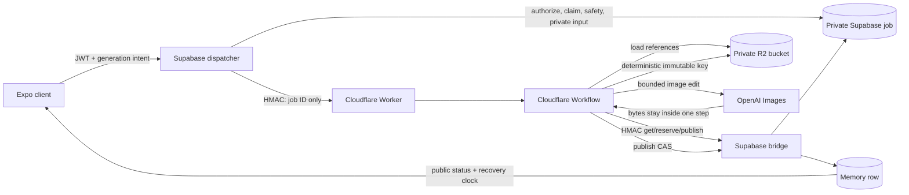

# Durable AI generation workflow playbook

**Status:** production-proven for memory illustrations

**Last updated:** 2026-07-22

**Reference implementation:** `cloudflare/memory-illustration-worker/`

This document records how Momora moved memory illustration generation from a
long-running Supabase Edge Function to Cloudflare Workflows, including the
design corrections found during review, production-cutover lessons, and a
blueprint for moving other generators such as character portraits.

It is deliberately broader than the memory feature contract:

- [TECH_SPEC.md](./TECH_SPEC.md) remains the canonical schema and API contract.
- [features/memories.md](./features/memories.md) describes current memory
  behavior.
- [cloudflare-illustration-workflows.md](./cloudflare-illustration-workflows.md)
  is the production deployment and rollback runbook.
- This playbook explains the decisions and invariants that should survive the
  next migration.

## Why the architecture changed

Memory illustration requests regularly approached or exceeded Supabase Edge
Function's practical 150-second request/runtime window. A user could save a
memory successfully but need two or three illustration attempts. Raising the
OpenAI timeout above 120 seconds did not solve the real constraint: it left too
little time for R2 upload, database publication, and failure persistence before
the host ended the function.

Three alternatives were considered:

| Option | Why it was not the final design |
|--------|---------------------------------|
| Raise the Edge Function timeout | The host window remains; a longer provider call consumes publication and cleanup headroom. |
| Put generation in `EdgeRuntime.waitUntil` | It detaches work from the HTTP response but does not move it to a runtime with a longer lifetime. It improves response latency, not durability. |
| Add a durable queue only as a fallback | The first attempt would still inherit the unreliable path, while two execution systems would have to remain correct. |

Cloudflare Workflows became the main execution path because it provides
checkpointed steps and retryable, long-running work outside the originating
request. Supabase remains the authentication, tenancy, private-input, and
publication authority. The former Edge path is retained only as a temporary
feature-flag rollback path.

At the expected initial volume, the Workers Paid plan was also materially less
expensive than changing Supabase plans solely to obtain more runtime. See the
dated cost record below; the reliability boundary is the primary reason for
this architecture.

### Cost decision record (2026-07-22)

At cutover, the [Workers Paid minimum](https://developers.cloudflare.com/workers/platform/pricing/)
was $5/month, including 10 million requests, 30 million CPU milliseconds,
1 GB-month of Workflow state, and 500,000 Workflow steps. Waiting on OpenAI
does not consume CPU time. Cloudflare had announced that Workflow step and
storage billing would begin no earlier than 2026-08-10; Momora's initial volume
was expected to remain inside the included amounts. OpenAI image calls remain
the dominant variable cost.

The comparison was avoiding a [Supabase Pro plan starting at $25/month](https://supabase.com/pricing)
solely for longer-running generation—not replacing Supabase, which still owns
the database/auth/trust boundary. Cloudflare currently documents Workflows on
both Free and Paid Workers plans. Momora's production account uses Paid for
higher capacity and predictable headroom, but future projects must recheck
current plan limits and prices rather than assume Paid is an intrinsic
Workflow requirement.

## Reference architecture



The important boundary is not "Supabase versus Cloudflare." It is authority
versus execution:

| Component | Owns | Must not own |
|-----------|------|--------------|
| Client | User intent, observing public status, bounded recovery requests | Status resets, attempt tokens, job rows, failure decisions |
| Supabase dispatcher | JWT, family-role authorization, input validation, emotion/palette resolution, safety rewrite, portrait deferral, attempt claim | Long OpenAI request |
| Private job row | Durable input, deadline, provider-attempt counts, output and previous keys, terminal audit status | Client-readable state |
| Cloudflare Workflow | Bounded execution, provider selection, reference loading, direct R2 upload, publication calls | Supabase service-role credentials or durable family PII in Workflow event/state |
| HMAC bridge | Narrow service-role access to job operations and publication RPCs | Browser/client access or general database access |
| Postgres publication RPC | Atomic compare-and-set, public row state, terminal input scrubbing | Image generation |

## Core invariants

These invariants made the migration safe. A future generator should name its
equivalents before implementation starts.

1. **The domain row is saved before generation.** AI failure must never lose a
   memory or profile change.
2. **Only server code changes generation state.** Clients request `initial`,
   `recovery`, or `manual_regenerate`; they never write status, clocks, or
   attempt IDs directly.
3. **One immutable attempt identity spans the system.** For memories, the job
   ID, Workflow instance ID, generation ID, and deterministic R2 suffix use the
   same UUID; the publication attempt ID independently proves that the current
   row still accepts that result.
4. **Publication is a database compare-and-set.** Finishing generation does not
   imply the result is still current. Content, date, emotion, and tag changes
   invalidate the attempt so a stale image cannot replace a newer request.
5. **A replay cannot create another paid call after output exists.** The
   generate step checks its deterministic R2 key before calling OpenAI.
6. **Paid attempts are reserved atomically before the call.** Replaying a step
   cannot silently exceed the two-primary/one-fallback caps.
7. **Image bytes never cross a Workflow step boundary.** OpenAI and the R2 PUT
   happen inside one step, which returns only `{ outputKey, model }`.
8. **The previous object is deleted only after a confirmed CAS.** A failed or
   superseded attempt never removes the currently published image.
9. **Private job input is scrubbed at every terminal state.** Safe scene text,
   reference candidates, and the recorded prompt are cleared after success,
   failure, or supersession.
10. **Recovery uses a generation clock, not an entity update clock.** Unrelated
    writes must not extend or shorten a generation lease.
11. **Cheap deterministic errors fail before dispatch.** Authorization, tag
    limits, memory type, stripped URL-only content, safety preparation, and
    portrait readiness remain in Supabase; they do not consume a Workflow or
    paid image attempt.

## State, identity, and clocks

### Private job versus public status

`memory_illustration_jobs` is deliberately service-only: RLS is enabled with
no client policies. The client observes the narrow fields on `memories`:

- `illustration_status`
- `illustration_generation_started_at`
- the published illustration key/generation ID

The jobs table can therefore contain provider counters and temporary prompt
inputs without turning them into a mobile API. Service-role writes happen only
after the dispatcher or bridge has performed its own authorization.

### Use a dedicated recovery clock

`memories.updated_at` is changed by edits, emotion hydration, link previews,
and other unrelated operations. It cannot answer "when did this generation
start?" The migration added `illustration_generation_started_at`, set and
cleared by server-owned transitions.

For rollout and abandoned pre-dispatch rows, the recovery clock is:

```text
illustration_generation_started_at ?? updated_at ?? created_at
```

The fallback matters. A memory may be saved as `pending`, then the app may be
killed before the dispatcher returns 202. With no job row and no dedicated
clock, a recovery loop that only ages jobs can never recover it.

Current memory thresholds are product policy, not Cloudflare limits:

| Public state | Recovery threshold | Reason |
|--------------|--------------------|--------|
| `pending` | 3 minutes | Covers a row saved before successful dispatch or parked without a job. |
| `generating` | 5 minutes 30 seconds | Allows the five-minute Workflow lease plus publication margin. |

Do not copy these values into portrait generation without measuring that
pipeline and accounting for its own references, provider calls, upload, and
dependent work.

### Attempt ID is stronger than status

An early plan made publication conditional on both `status = generating` and
the attempt ID. That was incompatible with already-installed clients, which
could reset a three-minute-old row to `pending`. The reset would make a valid
Workflow result lose its CAS and trigger duplicate paid work.

The final publication CAS is keyed by the server attempt ID, not by the public
status. This provides mixed-version safety: a legacy status-only write cannot
discard a completed image, while a real input edit clears the attempt ID and
correctly rejects stale output.

## Durable execution and retry policy

### Application lease versus platform durability

Cloudflare Workflows lets work survive the original HTTP request and retry at
step boundaries. Momora still imposes a finite application lease so users are
not stuck indefinitely and paid retries are bounded:

- Job/provider deadline: 5 minutes from dispatch.
- Reserved finalization headroom: 30 seconds.
- First primary window: up to 180 seconds.
- Second primary: only if the first failed quickly enough.
- Fallback window: 60 seconds.
- Provider caps: two `gpt-image-2` attempts and one `gpt-image-1.5` attempt.
- Client generating recovery: 5 minutes 30 seconds.

The Workflow runtime is what removes the Supabase 150-second restriction; the
five-minute value is Momora's bounded-wait policy. It can be changed without
returning to request-bound execution, provided the server lease, provider
budget, Workflow step timeout, and client recovery threshold remain ordered.

### Failure classification

Automatic retry is useful only when failures are classified. "Any error means
retry" wastes money and can turn deterministic failures into long waits.

| Failure | Current behavior |
|---------|------------------|
| Moderation/content policy | Non-retryable; no fallback; publish `failed` if the attempt is still current. |
| Other deterministic provider rejection | Non-retryable; no fallback. |
| HTTP 408, 409, 429, or 5xx | Retryable; another primary may run if budget remains, then sequential fallback. |
| Network error, malformed JSON/image, or empty result | Retryable within the same bounded policy. |
| No usable references after per-reference fallbacks | Non-retryable; do not pay for a call that cannot satisfy the request. |
| R2 upload failure after three attempts | Terminal generation failure. |
| Publication response is ambiguous | Reconcile the same object/job; never generate another image merely to resolve publication. |
| CAS lost because input changed or a newer attempt exists | Mark superseded and delete this attempt's object. |
| Duplicate Workflow instance ID | Idempotent accepted 202, not dispatch failure. |

`memory_illustration_jobs.error_code` is service-side diagnosis/telemetry. The
current client intentionally renders a generic failed/retry state rather than
exposing provider or moderation details.

The provider hedge was deliberately removed. The old path could start another
model after 55 seconds while the first call still ran, causing two paid images
for one user action. The durable path uses sequential fallback.

### Current model and quality policy

- Primary: `gpt-image-2`.
- Fallback: `gpt-image-1.5` (not `gpt-image-1`).
- One or two references: omit `quality`, allowing the provider's current
  default/automatic behavior.
- Three or more references: request `medium` explicitly.
- Multi-reference fallback: `input_fidelity: high`.
- Output: 1024x1024 WebP at compression 85.
- Each reference is capped to a 1024px edge before submission.

Quality is part of the provider request contract, not a synonym for
reliability. If this policy changes, evaluate latency, visual consistency, and
cost with representative multi-character memories; do not infer the selected
quality from elapsed time alone. The local auto/medium/low evaluation led to
the policy above: a faster automatic result did not prove that the provider
selected `low`, because the API does not report the internal tier chosen by
automatic quality. Explicit `low` was not adopted for illustrated memories.

## Workflow replay and the image-byte boundary

Cloudflare Workflow step results are serialized and, at implementation time,
capped at 1 MiB. A 1024px image can exceed that limit, and base64-in-JSON adds
roughly one third more bytes. Splitting the pipeline into
`OpenAI step -> upload step` would therefore fail intermittently on larger
outputs and persist child/family imagery in Workflow state.

The production pattern is a single sensitive **generate and upload** step:

1. Receive only `jobId` in the Workflow event.
2. Fetch private structured input from the signed bridge inside the step.
3. Load and resize references directly from private R2.
4. Build the final prompt with the shared pure prompt builder.
5. Record the prompt through the bridge so a successful publication can write
   it to the memory row.
6. Check the deterministic output key.
7. Reserve the provider attempt in Postgres.
8. Call OpenAI and decode the response in memory.
9. PUT the bytes directly to R2.
10. Return only the output key and model.

The prompt builder is shared with the legacy path to prevent visual drift, but
the safety rewrite and authoritative palette/reference resolution remain in
Supabase. The Workflow event and returned step state contain no names, prompt,
reference keys, or image bytes.

The deterministic object check and provider reservation protect different
failure windows:

- If OpenAI and R2 succeeded but the step result was lost, the object check
  avoids another paid call.
- If the reservation committed but its response was lost before OpenAI, the
  reservation replay returns the same reservation rather than incrementing the
  counter twice.

## Publication, reconciliation, and object cleanup

The Worker does not write Supabase with a service-role key. It calls a narrow
bridge operation which invokes a security-definer publication RPC. That RPC
locks the job and memory, checks the attempt ID, updates the memory and job
atomically, and scrubs private inputs.

After an R2 upload, publication has three outcomes:

| Outcome | Action |
|---------|--------|
| CAS succeeds | Publish new key/prompt/status, then delete the old object. |
| Job was already published | Treat as success and return the retained old key so cleanup can be replayed. |
| Attempt is no longer current | Mark superseded and delete the newly generated object. |

If the publish call fails ambiguously, the Workflow runs `reconcile`:

- `succeeded` means publication committed and the lost response can be treated
  as success.
- An active job with the expected output reruns the same publication CAS.
- A missing, failed, superseded, or mismatched job tells the Workflow to delete
  its output.

This is why publication must stay on the Supabase side. Direct Worker writes
would either require a broadly powerful credential or duplicate tenancy and
CAS rules outside the database authority.

### Storage decisions

Production uses one private R2 bucket, `momora-prod`. The Worker's three
bindings (`MEMORY_ILLUSTRATIONS`, `CHARACTER_PORTRAITS`, and
`PROFILE_PICTURES`) are semantic aliases for that same bucket, not three
physical buckets.

For the current single-user phase, memory Workflow outputs go directly to a
deterministic immutable final key. There is no staging bucket, one-day
lifecycle rule, or scheduled orphan sweep. The CAS and cleanup steps are
adequate for the present scale without adding operations that have not yet
earned their complexity.

Reconsider lifecycle/orphan tooling when concurrency or user count grows,
when object-cleanup telemetry shows leaks, or before a pipeline can create an
object whose job/entity may be deleted during a long run. Deterministic keys do
not make deletion races impossible; they make them detectable and safely
reconcilable.

## Authentication and privacy

There are two signed server-to-server hops:

1. Supabase dispatcher to Cloudflare `/dispatch`.
2. Cloudflare Workflow to the Supabase bridge.

Both sign the raw request body with a shared secret, timestamp, and UUID
nonce. The bridge records nonces in a private replay ledger and rejects reuse;
each request also performs a bounded cleanup of old nonce rows. Verify the raw
body before JSON parsing so the signed bytes and parsed request cannot differ.

The bridge has JWT verification disabled because Cloudflare has no Supabase
user JWT. That does **not** make it public: HMAC validation, timestamp bounds,
nonce replay protection, strict operation validation, and private service-role
RPCs are mandatory. Cloudflare never receives the Supabase service-role key.
Successful and failed Workflow instance state is retained for one day rather
than the platform's longer default, and the event/step outputs remain
ID/metadata-only.

Production logs may contain IDs, phase names, error codes, models, attempt
counts, status codes, and durations. They must not contain memory text,
prompts, member names/descriptions, R2 keys, signed URLs, image bytes, or
credentials.

## Client recovery and user intent

The migration removed direct client status resets, not automatic recovery.
The timeline and detail recovery effects still run, but they call the server
with `requestIntent: recovery`. This handles both an expired job and a
`pending` memory for which no job was ever created.

Intent is explicit:

| Intent | Behavior |
|--------|----------|
| `initial` | Reuse a fresh matching active job; otherwise create the first attempt. |
| `recovery` | Reuse fresh work; reclaim only after the server lease expires. Missing emotion analysis is rerun before palette fallback. |
| `manual_regenerate` | Supersede immediately because the user explicitly requested replacement; the old Workflow may still incur a charge but cannot publish. |
| Legacy `forceRegenerate` without intent | Reuse fresh active work until the 5:30 compatibility boundary to prevent installed clients from causing duplicate paid jobs. |

Every new or superseding dispatch resolves the palette from the current memory
state. It must not reuse a prior job's palette: emotion analysis may have
landed between a deferred/failed attempt and recovery.

### Accepted tradeoffs at current scale

- A deliberate manual regenerate can supersede a paid call that is still in
  flight. Correctness is protected, but the old provider charge cannot be
  cancelled reliably.
- Memory detail continues polling its open row every three seconds while work
  is active; list polling is Realtime-aware. This is acceptable for the
  current wait window and user count but should be revisited before broad
  scale.
- The backend flag is binary rather than percentage-based. The single-user
  cutover used legacy smoke, one Cloudflare synthetic smoke, automatic
  rollback on failure, then the Cloudflare main path.
- There is no scheduled orphan sweep. Reconciliation handles ordinary
  supersession/deletion, but a prolonged bridge outage after upload could
  still leave an object for later operational cleanup.

### Portrait readiness is a separate state machine

Memory generation cannot simply fail when a tagged member's portrait is still
being generated. The Supabase dispatcher preserves the existing deferral
machinery:

- A keyless memory is parked at `pending` with a refreshed clock.
- A memory retaining an older illustration returns to `ready`.
- No job row or Workflow instance is created while deferring.
- Portrait completion retriggers eligible pending memories.
- A post-reset self-retrigger closes the race in which the portrait becomes
  ready while the memory claim is being released.

This domain-specific precondition belongs before Workflow dispatch. Deleting
it during an orchestration refactor would turn a temporary dependency into a
user-visible failure or a paid generation with incomplete references.

## Rollout pattern

The safe order for replacing an installed-client backend is:

1. Add schema, recovery clocks, private jobs/RPCs, bridge, and the backend flag.
   The flag must default to the old path; do not assume a flag already exists.
2. Stamp the dedicated recovery clock on the legacy claim path so both
   backends support the new client behavior during rollout.
3. Deploy all affected Supabase functions, including shared storage-key
   consumers—not only the new dispatcher and bridge.
4. Deploy/configure the Worker and its secrets. Momora production uses the
   Workers Paid plan for higher capacity; Workflows are currently also offered
   on Free. Local tests and deployment dry-runs need no plan change.
5. Release the client that sends explicit intents and no longer writes status.
6. Smoke-test the legacy path plus Worker health while the flag remains legacy.
7. Flip one environment to Cloudflare and run one real synthetic generation.
8. Verify Workflow instance, job terminal state, entity publication, signed
   media read, private-input scrubbing, and R2 cleanup using IDs/status only.
9. Keep a one-variable rollback: set the backend flag to legacy. In-flight
   Workflows remain harmless because publication is attempt-ID guarded.

Installed-client adoption is never 100%. The server-side attempt CAS and
legacy intent handling are what make the rollout compatible; waiting an
arbitrary number of days is not a substitute for compatibility.

An ambiguous dispatch that fails after the server claim but before the client
receives 202 can now wait until the 5:30 generating boundary rather than the
old three-minute recovery point. That is an accepted UX trade: retrying sooner
could duplicate a Workflow that Cloudflare already accepted.

## Minimum test matrix for another generator

A durable migration is not proven by one successful image. Cover each seam
that can independently commit, time out, replay, or be superseded.

| Layer | Required cases |
|-------|----------------|
| Dispatcher/Edge | JWT and family-role rejection; type/tag/content validation including URL-only text; backend flag default; palette or generator-specific input propagation; missing-analysis recovery; dependency deferral; initial/recovery/manual/legacy intent semantics; queued 202 and legacy response compatibility. |
| Database | Client cannot read/write private jobs; dedicated/null recovery clock; legacy status reset cannot defeat valid CAS; content/date/tag change defeats stale CAS; provider reservation replay; publish replay; retained old output on failure; terminal sensitive-field scrubbing. |
| Workflow | Invalid signature; duplicate instance accepted; deterministic object already exists; reservation response lost; retryable primary -> fallback; deterministic rejection with no fallback; all references unusable; R2 retry exhaustion; publish response lost -> reconcile; superseded/missing job -> delete output. |
| Client | Never-dispatched `pending` recovery; exact lease/grace boundaries; no direct database status write; automatic recovery and explicit regenerate; old and queued success response parsing. |
| Lifecycle | Entity/account deletion while generation is in flight; regeneration while old output is visible; old/new object cleanup ownership; dependency completion retrigger. |
| Runtime | A deliberately slow call that exceeds 150 seconds but remains within the new application lease, proving the migration rather than only the happy fast path. |
| Production smoke | One synthetic generation plus one real user path, verifying job/Workflow/entity/R2 state and private-input scrubbing without inspecting PII. |

## Production cutover findings

These implementation discoveries are worth retaining because dry-runs did not
surface them:

1. **The first real Workflow proved the core long-running path but exposed
   stale cleanup code.** Primary generation completed in roughly 112 seconds.
   The subsequent synthetic-smoke cleanup failed because the deployed
   `delete-storage-object` function predated the versioned
   memory-illustration key parser. The backend rollback guard worked. The
   current function was deployed, the synthetic object/rows were cleaned, and
   the deployment runbook now includes that function.
2. **Fallback was proven in production.** In the final full smoke test,
   `gpt-image-2` did not finish within its provider budget and
   `gpt-image-1.5` completed automatically. End-to-end observation was about
   247 seconds, beyond the old Supabase window, and publication, signed media
   access, and cleanup succeeded.
3. **A real user generation independently proved the primary path.** The
   Workflow completed on `gpt-image-2` without fallback in about 91 seconds;
   the memory published and private input fields were scrubbed.
4. **Configuration names can lie.** Production had one `momora-prod` bucket;
   planned names for separate illustration/portrait/profile buckets did not
   exist. The Worker uses multiple bindings to the actual single bucket.
5. **Secret automation needs ordinary secure files.** Passing a secrets file
   through shell process substitution caused Wrangler to treat `/dev/fd/...`
   as a directory (`EISDIR`). Use interactive prompts or a `mktemp -d`
   directory with mode 0700 and a file with mode 0600, then delete it. Never
   print secret values.
6. **Control-plane reads can be transiently rate-limited.** A read-only R2
   bucket-info request returned 429 during cutover while authentication and
   deployment remained healthy. Treat a single control-plane read failure as a
   signal to retry/verify, not proof that the data path is broken.
7. **Changing Supabase secrets creates new function versions.** A version
   increment after secret wiring is not by itself evidence of source drift.

At the 2026-07-22 cutover, the release was verified with client typecheck,
Worker typecheck and Wrangler startup/dry-run, 933 Jest tests, 359 Deno tests,
22 Worker Vitest tests, 17 pgTAP tests, lint with zero errors (35 pre-existing
warnings), and real production smoke tests.

## Review findings that changed the design

This checklist condenses the adversarial plan reviews. These were not cosmetic
suggestions; each closes a concrete failure mode.

| Finding | Failure mode | Resolution |
|---------|--------------|------------|
| `colorPalette` was omitted from an early design | Mood/color behavior silently regresses. | Persist the freshly resolved palette per job and use it in the shared prompt. |
| Lease was specified without phase arithmetic | Provider work consumes publication time; clients retry before completion. | Budget provider, upload/publication reserve, and client recovery together. |
| Legacy clients wrote `pending` at three minutes | Valid output loses a status-based CAS; duplicate paid job. | Attempt-ID CAS, server-owned client path, and legacy compatibility handling. |
| Private jobs were the only clock | Client cannot read them; never-dispatched rows never recover. | Dedicated public generation-start field plus legacy clock fallback. |
| Recovery loop was going to be removed | App termination between save and 202 leaves `pending` forever. | Keep automatic recovery, rerouted through the dispatcher. |
| OpenAI and upload were separate steps | Base64/image bytes exceed Workflow step-state limits and persist sensitive data. | Generate and upload in one sensitive step; return metadata only. |
| Manual regeneration semantics were unspecified | Either the button no-ops or duplicates happen accidentally. | Explicit new-client intent supersedes; legacy force-only request reuses fresh work. |
| Palette was frozen from a previous attempt | Deferred/recovery job ignores emotion that arrived later. | Resolve current palette for every new dispatch. |
| Portrait deferral was summarized as one check | Race-closing retrigger/reset behavior gets deleted. | Preserve the full pre-dispatch state machine and create no deferred job. |
| Fallback named `gpt-image-1` | Wrong model and missing high-fidelity behavior. | Use verified `gpt-image-1.5`; test multi-reference input fidelity. |
| Job omitted `illustration_prompt` | Publication cannot preserve prompt provenance. | Record prompt before provider call; publish it atomically; scrub terminal job copy. |
| Old-object deletion had no owner | Regeneration leaks immutable objects. | Publication returns old key; Workflow deletes it only after CAS. |
| Duplicate Workflow creation was an error | Dispatcher retry reports failure for already-accepted work. | Map instance-already-exists to idempotent 202. |
| Private table write used user-scoped client | RLS correctly rejects job creation. | Authorized dispatcher uses service role after JWT/family-role checks. |
| Commit CAS checked no input identity | Wider durable window lets stale image publish after edit. | Content/date/emotion/tag changes invalidate attempt ID. |
| Missing emotion always became Tender | Killed client permanently loses intended palette. | Recovery reruns emotion analysis server-side before final Tender fallback. |
| Prompt/reference data crossed Workflow state | Child/family data persists in another control plane. | Event contains only job ID; fetch inputs inside sensitive step; scrub terminal inputs. |
| Retry could replay a paid call | Workflow replay charges multiple images. | Deterministic R2 check plus atomic provider-attempt reservations. |
| All references could fail open | Provider call cannot honor tagged people. | Per-reference portrait-to-photo fallback; zero usable references is a hard error. |
| URL-only validation moved async | A known bad request spends dispatch time and becomes a delayed generic failure. | Strip URLs and return `EMPTY_CONTENT` synchronously in the dispatcher. |
| Workflow retention used the paid-plan default | Sensitive execution metadata lives longer than needed. | Retain success/error instances for one day and keep PII out of event/step outputs. |
| Client and lease expired at the same instant | A completed paid image can be superseded during publication. | Keep the 30-second client recovery grace outside the five-minute lease. |
| Portrait fallback changed without latency proof | Memory reliability work can regress portrait readiness. | Change to `gpt-image-1.5`, align the current Edge deadline to 120 seconds, and require a portrait-specific latency smoke before durable cutover. |
| Moderation was documented but not classified | Policy errors collapse into a generic retry/failure path. | Detect provider moderation codes, emit `MODERATION_BLOCKED`, and never fall back. |
| Cleanup function was absent from rollout | New versioned keys cannot be removed in production. | Deploy and test every shared key parser/cleanup consumer in the rollout set. |

## Blueprint: moving portrait generation next

Portrait generation is a strong candidate for the same durable executor, but
it is not a text substitution of "memory" with "portrait." Its existing state
machine protects different product behavior. Read
[features/portrait-timeline.md](./features/portrait-timeline.md) and
[features/family-profiles.md](./features/family-profiles.md) before planning it.

### Reuse these proven components

- HMAC dispatch and bridge signing, timestamp validation, nonce replay ledger,
  and no Cloudflare service-role key.
- Deterministic job/Workflow/output identity.
- Atomic provider-attempt reservation.
- One sensitive generate-and-upload step with an R2 existence check.
- Sequential `gpt-image-2` -> `gpt-image-1.5` fallback and explicit failure
  classification, after a portrait-specific latency/quality evaluation.
- Supabase-side attempt-token CAS, reconcile path, and post-CAS old-object
  deletion.
- Server-owned public recovery clock and intent-based retry endpoint.
- Backend feature flag that defaults to legacy during a mixed-client rollout.
- PII-safe telemetry and terminal input scrubbing.

### Preserve portrait-specific semantics

1. The entity is `family_member_portrait_versions`, not `family_members` and
   not `memories`.
2. Source photos and generated attempt objects are immutable and date-aware.
3. A failed/in-flight regeneration retains the last successful portrait and
   must not displace it.
4. Generation and deletion claim tokens can race. A deleted or deleting
   portrait version must prevent publication and must arrange cleanup of an
   object produced after deletion began.
5. Successful portrait publication retriggers eligible deferred memory
   illustrations. Keep that dependency on the Supabase publication side; do
   not hide it in a Cloudflare-only completion handler.
6. Current stalled UX uses `generation_started_at` and a 15-minute reclaim
   window. It must be deliberately replaced/aligned, not silently combined
   with the memory five-minute lease.
7. The current Edge path has a 120-second provider deadline inside the
   150-second runtime. The durable path needs fresh portrait-specific latency
   measurements before selecting its provider budget and client threshold.
8. Portrait prompts use source/style references but have no memory emotion or
   color-palette phase. The job input and validation should reflect that rather
   than inheriting unused memory columns.

### Prefer a separate first portrait job table

Use a `portrait_generation_jobs` table for the first migration unless the
implemented portrait shape proves a truly shared schema. A premature generic
`generation_jobs` table tends to accumulate nullable memory-only and
portrait-only columns while hiding domain-specific CAS and cleanup rules.

Code can share signing, bridge-client, provider, reference-transform, retry,
and Workflow helpers without sharing one database state machine. Consider a
generic table only after the second production pipeline demonstrates stable
common fields and operations.

### Portrait migration checklist

#### Discovery and measurements

- Map current claim, retained-output, failure, deletion, and dependent-memory
  retrigger transitions from `generate-portrait-illustration` and its tests.
- Run representative one-person portrait calls on both models, including
  corrupt/missing source and style-reference cases.
- Measure provider, transform, upload, publish, and retrigger phases
  independently.
- Decide retryable errors, attempt caps, provider deadline, finalization
  reserve, and client recovery threshold as one budget.

#### Schema and contracts

- Add a private jobs table, no client policies, attempt counters, deterministic
  output/old keys, error code, deadline, and terminal scrubbing.
- Reuse the existing `generation_token`/`generation_started_at` public claim if
  it represents the right semantics; do not introduce a second client clock
  without a reason.
- Define how a pending version whose app died before dispatch recovers.
- Define how regeneration of a ready version retains its old key/status.
- Define how version deletion invalidates a job and how a late R2 object is
  removed.
- Add the migration, regenerated database types, TECH_SPEC updates, feature-doc
  updates, and tests in one change.

#### Executor and bridge

- Add a portrait Workflow binding/class and a `PORTRAIT_GENERATION_BACKEND`
  server flag defaulting to legacy.
- Send only job ID in the event.
- Fetch source/style inputs inside the sensitive generate-and-upload step.
- Cap/normalize reference images before the provider call.
- Check the deterministic attempt key before reserving/calling OpenAI.
- Publish through a portrait-specific Supabase CAS/reconcile operation.
- Trigger deferred memories only after confirmed portrait publication.
- Delete the replaced portrait only after CAS; delete a superseded output.

#### Compatibility, rollout, and proof

- Ship the schema/server path first with the flag on legacy.
- Release any client retry-clock/intent change before cutover.
- Prove old clients cannot reset or overwrite a durable attempt.
- Test edit/delete/regenerate while the Workflow is in flight.
- Test publication response loss and Workflow replay after upload.
- Test retained prior portrait on every failure path.
- Run a production synthetic version, verify the dependent-memory retrigger,
  then clean all synthetic DB/R2 data.
- Keep a one-variable legacy rollback until a real portrait generation is
  independently verified.

## What not to generalize yet

- Do not move JWT/family-role checks or publication authority to Cloudflare.
- Do not put memory/profile text, names, prompt, reference keys, or bytes in the
  Workflow event or returned step state.
- Do not use entity `updated_at` as a generation lease.
- Do not copy the memory five-minute lease into every generator.
- Do not add a staging bucket, lifecycle rule, scheduled sweep, or generic job
  framework solely for architectural symmetry. Add them when an observed scale
  or failure mode justifies them.
- Do not share a single job table before the second migrated pipeline proves
  the common state machine.
- Do not remove domain-specific preconditions/retriggers while extracting
  orchestration helpers.

## Code and test map

| Concern | Reference |
|---------|-----------|
| Dispatcher, compatibility, palette/safety, portrait deferral | `supabase/functions/generate-illustration/index.ts` |
| Private jobs, clocks, attempt reservation, CAS/failure RPCs | `supabase/migrations/20260721120000_memory_illustration_workflow_jobs.sql` |
| Signed bridge and reconciliation | `supabase/functions/workflow-illustration-bridge/index.ts` |
| Dispatch idempotency and Worker routing | `cloudflare/memory-illustration-worker/src/index.ts` |
| Workflow budgets, retries, publication, cleanup | `cloudflare/memory-illustration-worker/src/workflow.ts` |
| Provider request and error classification | `cloudflare/memory-illustration-worker/src/openai.ts` |
| R2 reference fallback and transforms | `cloudflare/memory-illustration-worker/src/references.ts` |
| Client recovery clocks | `src/utils/memories.ts`, `src/services/memories.ts` |
| Database behavior | `supabase/tests/memory_illustration_workflow.sql` |
| Edge contracts | `supabase/functions/generate-illustration/index.test.ts`, `supabase/functions/workflow-illustration-bridge/index.test.ts` |
| Workflow replay/fallback policy | `cloudflare/memory-illustration-worker/test/workflow.integration.test.ts`, `workflow-policy.test.ts` |
| Client compatibility/recovery | `src/utils/memories.test.ts`, `src/services/memories.integration.test.ts`, `src/hooks/useMemories.integration.test.tsx` |
