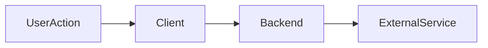

# Feature: [Feature Name]

**Status:** `planned` | `in-progress` | `done`
**Last updated:** YYYY-MM-DD
**PRD reference:** [link to PRD section if applicable]

## Overview

One paragraph: what this feature does and why it exists.

## User-facing behavior

- Primary user actions and outcomes
- Empty/error/loading states worth knowing
- Onboarding or gating rules (if any)

## Architecture



Describe the flow in plain language below the diagram.

## Data model

| Table / bucket | Role in this feature |
|----------------|----------------------|
| | |

Key columns, status enums, and RLS notes specific to this feature.

## API & Edge Functions

| Function / endpoint | Input | Output | Auth |
|---------------------|-------|--------|------|
| | | | JWT / cron |

Link to TECH_SPEC §4 for canonical contracts. Document **behavior** and **call order** here.

## Client integration

| Layer | Files | Responsibility |
|-------|-------|----------------|
| Routes | `app/...` | |
| Hooks | `src/hooks/...` | |
| Services | `src/services/...` | |
| Components | `src/components/...` | |

### How to invoke from another feature

Step-by-step for agents extending this feature:

1. …
2. …

## Extension guide

**Safe to extend**

- …

**Do not change without updating this doc**

- …

**Common extension patterns**

- Adding a field → migration + types + hook + UI
- …

## Constraints & gotchas

- Business rules (limits, validation)
- Async behavior (what blocks vs background)
- Security (RLS, secrets, PII)
- Known edge cases

## Dependencies

- Depends on: [other features]
- Used by: [other features]

## Testing

Document all test artifacts for this feature. See [TESTING.md](../TESTING.md).

### Unit tests

| File | Covers |
|------|--------|
| `src/.../foo.test.ts` | |

### Integration tests

| File | Scenarios |
|------|-----------|
| `src/.../foo.integration.test.ts(x)` | e.g. service + hook save flow, error mapping |

### E2E (Maestro)

| Flow | Scenario |
|------|----------|
| `.maestro/flows/<feature>/....yaml` | Happy path description |

### Edge Function tests (Deno)

| File | Covers |
|------|--------|
| `supabase/functions/.../index.test.ts` | Auth, validation, errors |

### Run this feature's tests

```bash
npm test -- --testPathPattern=<pattern>
maestro test .maestro/flows/<feature>/
deno test supabase/functions/<function>/
```

## Changelog

| Date | Change |
|------|--------|
| YYYY-MM-DD | Initial implementation |
