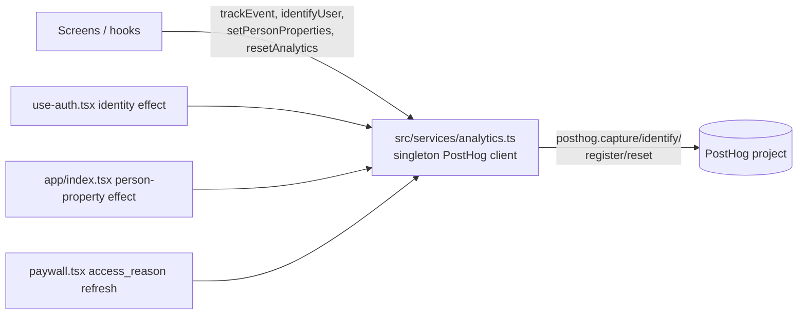

# Feature: Analytics (PostHog)

**Status:** `done`
**Last updated:** 2026-08-02
**PRD reference:** none (operational/growth instrumentation, not a product feature)
**Implementation plan:** [docs/plans/analytics-implementation.md](../plans/analytics-implementation.md) — work packages, decisions, execution log
**Event spec:** [docs/plans/analytics-tracking.md](../plans/analytics-tracking.md) — original Tier 1/Tier 2 proposal (superseded by this doc for exact shapes; see "Where the spec docs lag" below)

## Overview

PostHog behavioral analytics across onboarding, the paywall, and the core journaling loop, built to answer four dashboards' worth of funnel/retention questions without collecting any child or family PII. Explicit events only — **no autocapture, no session replay, no screen auto-tracking, no `PostHogProvider`**. One typed module (`src/services/analytics.ts`) is the entire integration surface; every other file that wants to track something imports `trackEvent` from it and nothing else.

## Architecture



- **No provider.** With autocapture/replay/screen-tracking all off and screens forbidden from calling `posthog` directly, a `PostHogProvider` would have no job. A lazily-created singleton (`getClient()` in `src/services/analytics.ts`) keeps the whole integration in one file, out of `src/components/app-providers.tsx`.
- **No key → silent no-op.** `createClient()` returns `null` when `EXPO_PUBLIC_POSTHOG_API_KEY` is unset (dev without env, all Jest runs); every exported function (`trackEvent`, `identifyUser`, `setPersonProperties`, `resetAnalytics`) checks for a client and returns early, and none of them ever throw — a missing key or a PostHog outage must never block or break a user flow.
- **Env vars:** `EXPO_PUBLIC_POSTHOG_API_KEY` (PostHog project key), `EXPO_PUBLIC_POSTHOG_HOST` (defaults to `https://us.i.posthog.com` if unset). Both are `EXPO_PUBLIC_` because PostHog project keys are public/write-only by design — this does not violate the repo's secrets checklist (see AGENTS.md).
- **`env` super property.** `registerEnvSuperProperty()` registers `{ env: __DEV__ ? 'dev' : 'prod' }` at client construction **and again after every `resetAnalytics()`** — `posthog.reset()` wipes registered super properties along with the distinct id (verified against a live project: post-sign-out events arrived without `env`), and without re-registration every post-sign-out user would silently drop out of the env-filtered dashboards. Every dashboard should filter `env = prod` — launch funnels are small-N and a few developer/simulator runs would otherwise skew them.
- **Lifecycle events come free.** The client is constructed with `captureAppLifecycleEvents: true` (the installed SDK's actual option name — an earlier implementation-plan draft assumed `captureNativeAppLifecycleEvents`, which doesn't exist on this SDK version; verify against `posthog-react-native`'s `.d.ts` before touching this option again). `Application Installed` / `Application Opened` arrive without any explicit call.
- **Jest:** `posthog-react-native` is mapped to `__mocks__/posthog-react-native.ts` via `moduleNameMapper` (`jest.config.js`), and `EXPO_PUBLIC_POSTHOG_API_KEY` is deleted in `jest.setup.ts` so the no-op path is deterministic by default. `src/services/analytics.test.ts` exercises both paths, using `jest.resetModules()` + `require()` to get a fresh module instance per test (the singleton reads env lazily once per module load).

## Identity rules

- **Real (non-anonymous) session → `identifyUser(session.user.id)`.** This is the Supabase user id — the same id RevenueCat uses as `appUserID` (`src/services/billing.ts`), so PostHog `distinct_id` and RevenueCat's `appUserID` match with zero aliasing, and the RevenueCat → PostHog integration (enabled by Eduardo in the RevenueCat dashboard, not by this code) needs no extra work.
- **Anonymous-session guard (critical).** The app creates real Supabase sessions via `signInAnonymously()` (`src/lib/anonymous-session.ts`) for S9 onboarding voice transcription and J2 invite preview, and that throwaway session lives from S9 until the email screen discards it. An anonymous session **appearing or disappearing must be a strict no-op** — no identify, no reset. If it weren't, `onboarding_capture_completed`/`notification_choice` fired pre-auth would get attributed to (and permanently orphaned on) a throwaway person instead of stitching to the real user once they authenticate for real.
- **Implementation:** `src/hooks/use-auth.tsx` holds `identifiedUserIdRef` (the last non-anonymous id actually identified) and reacts only to changes in that value, never to the raw session object:
  - `session.user` non-null **and** `!session.user.is_anonymous` and its id differs from the tracked ref → `resetAnalytics()` first if a *different* real user was previously identified (so events don't merge across two real people), then `identifyUser(id)`.
  - Session becomes null (sign-out) or anonymous, **and** a real user was previously identified → `resetAnalytics()`, clear the ref.
  - Session becomes null/anonymous and nothing was ever identified → no-op.
- This covers owner S12B sign-in, joiner J4 sign-in, direct login, and the paywall's "Leave" sign-out (which calls the same auth sign-out path). Pre-auth events ride PostHog's own anonymous distinct id and stitch to the real person automatically at `identify()` time (PostHog default behavior) — this file does not implement stitching itself.
- Unit test: `src/hooks/use-auth.test.tsx`-adjacent coverage (see the implementation plan's WP1.5 test note) exercises the anonymous-appear → capture-events → anonymous-discard → real-sign-in sequence to confirm pre-auth events aren't reset out from under the eventual real identify.

## Person properties

Set via `setPersonProperties({ role?, access_reason?, membership_count? })` (`AnalyticsPersonProperties` in `analytics.ts`) — closed to exactly these three keys for the same PII reasons as the event map.

- **`app/index.tsx`** resolve effect sets `{ membership_count, role? , access_reason? }` once billing status and memberships are in hand (dedup key: `JSON.stringify` of the computed properties, so it only calls again when a value actually changes).
- **`app/(onboarding)/paywall.tsx`** refreshes `access_reason` again once billing settles there — it isn't known at the `app/index.tsx` resolve point for a pre-purchase owner still mid-onboarding.

## Event catalog

Every event name and its exact property shape lives in `AnalyticsEventMap` in [`src/services/analytics.ts`](../../src/services/analytics.ts) — that file is the source of truth; this table is a human-readable mirror of it plus where each event fires. If this table and the code ever disagree, trust the code.

### Onboarding & paywall funnel

| Event | Properties | Fires from |
|---|---|---|
| `onboarding_step_viewed` | `step` (every `OnboardingStepId`, plus `reveal` for S17, plus `join-code\|join-found\|join-name\|join-email\|join-waiting` for the join arc), `flow: 'owner'\|'joiner'` | `app/(onboarding)/_layout.tsx` — one hook for the whole S0–S17 + J1–J5 arc, mapping `usePathname()` (bare, group-stripped) via `onboardingAnalyticsStepFromPathname` |
| `onboarding_capture_completed` | `method: 'voice'\|'typed'`, `has_media: boolean`, `transcription_failed: boolean` | `app/(onboarding)/capture.tsx` — S9, on "Keep it" |
| `onboarding_committed` | `kid_count: number`, `is_new_family: boolean` | `app/(onboarding)/code.tsx` (primary commit path) **and** `app/(onboarding)/paywall.tsx` (the pending-capture commit after purchase, for owners whose `code.tsx` commit deferred) — both call sites fire on `commitOnboarding` success |
| `paywall_viewed` | `mode: OnboardingPaywallMode`, `trial_eligible: boolean`, `has_monthly: boolean`, `source: 'onboarding'\|'new_memory_bounce'\|'resume'` | `app/(onboarding)/paywall.tsx` — gated on `serverPaywallMode !== null` **and** `offerings` loaded (excludes entitled pass-throughs/access handoffs, for whom `mode` would be null, and never fires while offerings are still loading or failed — a failed load reports `paywall_error_shown` instead); once per mount |
| `paywall_purchase_started` | `plan: 'annual'\|'monthly'` | `paywall.tsx` — CTA tap |
| `paywall_purchase_completed` | `plan: 'annual'\|'monthly'` | `paywall.tsx` — fires right after `purchase()` returns with the entitlement active, **before** `finishPaidOnboarding()` runs (see semantics note below) |
| `paywall_purchase_failed` | `code: 'store_cancel'\|'wrong_account_restore'\|'billing_confirmation_pending'\|'other'` | `paywall.tsx` — only for throws originating from the purchase call itself |
| `paywall_error_shown` | `code: 'unavailable'\|'offerings_unavailable'\|'generic'` | `paywall.tsx` — load-time error UIs; each code fires at most once per mount |
| `paywall_abandoned` | `mode: OnboardingPaywallMode` | `paywall.tsx` — the "Leave" confirm (signs out; the bounce metric) |
| `post_auth_destination_resolved` | `kind: PostAuthDestination['kind']`, `access_reason: BillingAccessReason \| null` | `app/index.tsx` — effect keyed on the resolved `kind`, deduped per mount |
| `notification_choice` | `choice: OnboardingNotificationChoice`, `os_granted: boolean \| null` | `app/(onboarding)/notifications.tsx` — S11 |

### Core loop, family, notifications

| Event | Properties | Fires from |
|---|---|---|
| `memory_saved` | `memory_type: MemoryType`, `used_voice: boolean`, `has_media: boolean`, `tagged_count: number`, `illustration_enabled: boolean`, `source: 'fab_timeline'\|'fab_calendar'\|'share_sheet'\|'notification'\|'other'` | `app/(app)/new-memory.tsx` — both save paths: the text `createMemory` success branch, and the media enqueue-accepted branch (see semantics note below) |
| `memory_save_failed` | `code: 'validation_error'\|'media_upload_failed'\|'network_error'\|'other'` | `app/(app)/new-memory.tsx` (`validation_error` on content/date/media-missing checks, `network_error` on the save-path catch) and `src/hooks/use-pending-memory-uploads.tsx` (`media_upload_failed`, the queue's terminal-failure transition) |
| `illustration_completed` | `outcome: 'ready'\|'failed'` | `src/hooks/useGenerationStatusPolling.ts` **and** `src/hooks/useMemoriesRealtime.ts` — both gated through the shared dedupe singleton (see below); no `intent` property (the polled row doesn't carry `request_intent`) |
| `illustration_retry_requested` | `intent: 'recovery'\|'manual_regenerate'` | `app/(app)/memory/[id]/index.tsx` — the two client-initiated retry/regenerate buttons, where intent *is* known |
| `invite_created` | `role: 'manager'\|'viewer'`, `family_id: string` | `app/(app)/sharing/invite.tsx` |
| `invite_redeemed` | `family_id: string` | `app/(app)/sharing/redeem.tsx` (in-app redeem) **and** `app/(onboarding)/join/email.tsx` (J4 join-path redeem) |
| `invite_resolved` | `outcome: 'approved'\|'rejected'`, `family_id: string` | `app/(app)/sharing/approvals.tsx` |
| `notification_opened` | `target: NonNullable<PushRouteData['route']>` (literal `memory\|new-memory\|approvals\|timeline` — `new-memory` is hyphenated verbatim, no renaming layer) | `src/hooks/useNotifications.ts` — `routeFromPushData`/`handleNotificationResponse`, plain functions, not the hook body |

`family_id` is a UUID, explicitly allowed by the privacy rules — it's the only way to join inviter and joiner (different persons) for the "% of families with ≥2 approved members" dashboard, and can't be backfilled later if omitted.

`Application Installed` / `Application Opened` / other session-lifecycle events arrive automatically via `captureAppLifecycleEvents: true` — no explicit `trackEvent` call needed or present for them.

## PII rules — never in any event property

Copied from [analytics-tracking.md](../plans/analytics-tracking.md) "Privacy" section (still normative):

Memory content/captions, voice transcripts, **child names / member names / family name** (or anything derived from kid names), comment bodies, emails, OTP codes, **invite word-codes** (live credentials), DOB/gender/notes, media URIs/URLs, illustration prompts, emotion results tied to a child.

Safe substitutes: counts (`kid_count`, `tagged_count`, `attachment_count`), booleans (`used_voice`, `has_media`, `illustration_enabled`), UUIDs (`family_id`), and existing closed enums (`memory_type`, `illustration_status`, `access_reason`, `paywall_mode`, `role`, `IllustrationRequestIntent`, notification choice).

This is enforced structurally, not just by convention: `AnalyticsPropertyValue` in `analytics.ts` is `string | number | boolean | null`, and a compile-time check (`AssertEventsAreScalarOnly`) fails the build if any event in `AnalyticsEventMap` ever gains a non-scalar (object/array) property — a free-form string field is still possible to add by hand, but a spread of an arbitrary object is not.

## Dedupe semantics

- **`illustration_completed` — singleton, cross-launch duplicates acceptable.** `useGenerationStatusPolling.ts` and `useMemoriesRealtime.ts` can each independently observe the same ready/failed transition (a realtime event forces a poll tick on `SUBSCRIBED`), so the seen-set lives in one module-level singleton, `src/lib/illustration-outcome-dedupe.ts` (`shouldReportIllustrationOutcome(memoryId, outcome)`), imported by both hooks rather than duplicated as per-hook state. It's in its own tiny module rather than inside `analytics.ts` so that file stays pure transport. The set is **in-memory only** — a fresh app launch gets a fresh set, so the same memory's terminal transition can in principle report again across two separate sessions. This is an accepted trade-off (per the implementation plan's risk notes), not a bug to fix.
- **`onboarding_step_viewed` — consecutive-repeat dedupe only.** `app/(onboarding)/_layout.tsx` tracks the last `${flow}:${step}` key fired and skips firing again for the same key on immediate re-render. A portrait ↔ reveal sibling-chain re-entry (S16 → S17 → S16 for the next kid) changes the pathname on every hop, so it naturally clears the dedupe key and fires again — that's a genuinely new view, not a duplicate.
- **`paywall_viewed` — once per mount.** Gated by a `useRef` boolean (`hasTrackedPaywallViewedRef`) that flips true the first time `serverPaywallMode !== null`; never fires again for the remaining lifetime of that mount, even if `serverPaywallMode` itself changes value afterward. `paywall_error_shown` uses the same once-per-code-per-mount pattern via a `Set` of already-fired codes.

## `memory_saved` semantics

`memory_saved` means **"the user completed the save gesture,"** not "the memory is durably stored." The two save paths in `app/(app)/new-memory.tsx` both fire it synchronously once the save action is accepted:

- **Text path:** fires after `createMemory` resolves (a real DB insert already happened).
- **Media path:** fires immediately after the attachment is handed to `enqueuePendingMemoryUpload` — the upload itself is enqueue-then-background-upload via `src/hooks/use-pending-memory-uploads.tsx`, so `memory_saved` here reports gesture completion, not upload success.

A background media upload's eventual **failure** is a separate moment and gets its own event: `memory_save_failed { code: 'media_upload_failed' }`, fired from the pending-uploads queue's terminal-failure transition (`use-pending-memory-uploads.tsx`), not from the composer screen. Without this, the media path — the most failure-prone of the two — would never report failures at all, and the retention dashboard would silently overcount successful saves. A user-initiated retry that also fails fires the same event again; that's a new terminal failure, not treated as a duplicate.

## Where the spec docs lag the implemented code

Differences found between `analytics-tracking.md` / `analytics-implementation.md` and the shipped `AnalyticsEventMap` (code wins in all cases):

- **`captureAppLifecycleEvents` vs `captureNativeAppLifecycleEvents`** — the implementation plan's WP1.3 names the option `captureNativeAppLifecycleEvents`; the installed `posthog-react-native` SDK's actual option is `captureAppLifecycleEvents`. The code uses the real name and documents the discrepancy inline.
- **`AnalyticsPropertyValue` allows `null`** — the tracking spec's prose doesn't call this out explicitly, but several properties are nullable in practice (`os_granted`, `access_reason`) and the type union in code is `string | number | boolean | null`.
- **Tier 1/Tier 2 split is organizational only** — the code has no runtime notion of "Tier 1" vs "Tier 2"; both live in the same flat `AnalyticsEventMap`. The tiering in the spec doc was a shipping-priority device for the implementation plan, not a schema distinction.
- No event was dropped, renamed, or reshaped relative to the spec beyond the above — every Tier 1 + Tier 2 event in `analytics-tracking.md` has a matching entry in `AnalyticsEventMap` with the same name and an equivalent (in some cases more precisely typed) property shape.

## How future agents extend this

1. **Add the event to `AnalyticsEventMap`** in `src/services/analytics.ts` — closed scalar unions only (`string | number | boolean | null`, string-literal unions for enums, UUIDs as bare `string`). Never add a free-form string property (e.g. no raw user-entered text, no error `message` strings beyond a closed `code` enum). The compile-time `AssertEventsAreScalarOnly` check will fail the build if a property is accidentally object/array-shaped, but it cannot catch a free-form string — that's a review-time rule, not a type-system one.
2. **Call `trackEvent('your_event_name', { ... })`** from the screen/hook where it happens. Never `await` it in a UI path — it's fire-and-forget by design.
3. **Never import `posthog-react-native` anywhere else.** `src/services/analytics.ts` is the only module allowed to import it; every other call site goes through `trackEvent`/`identifyUser`/`setPersonProperties`/`resetAnalytics`.
4. **Never log names, memory content, transcripts, or invite codes** in an event payload — see the PII rules above. When in doubt, prefer a count, a boolean, an existing closed enum, or a UUID.
5. **Think about dedupe before adding a new event that can fire from more than one observer** (multiple hooks watching the same underlying state change, or a screen that can re-render/re-mount). Follow one of the existing patterns above (module-level seen-set, consecutive-repeat ref, once-per-mount ref) rather than inventing a fourth.
6. **Don't add an event "just in case."** Per the tracking spec: event sprawl is the failure mode. Add one only when a specific dashboard/question demands it, and update this doc's event catalog table in the same change.
7. If a new event ever needs to distinguish person cohorts beyond `{role, access_reason, membership_count}`, extend `AnalyticsPersonProperties` the same way — closed, scalar-only.

## Testing

| File | Covers |
|------|--------|
| `src/services/analytics.test.ts` | No-op behavior without an API key; `capture`/`identify`/`register`/`setPersonProperties`/`reset` called with exact name/props when a key is present; uses `jest.resetModules()` to exercise both code paths in one file |
| `src/lib/illustration-outcome-dedupe.test.ts` | `shouldReportIllustrationOutcome` returns `true` once per `(memoryId, outcome)` pair, `false` on repeats, independent of which caller asks |
| `src/lib/onboarding-routes.test.ts` (or equivalent) | `onboardingAnalyticsStepFromPathname` mapping for at least one grouped and one nested route |
| `src/screen-tests/onboarding.paywall.integration.test.tsx` | `paywall_viewed`/`paywall_purchase_*`/`paywall_error_shown`/`paywall_abandoned` firing conditions, mocking `@/services/analytics` — entitled pass-through fires no `paywall_viewed`; loading→settled fires exactly one with the settled mode; user-cancel → `store_cancel`; post-purchase `finishPaidOnboarding` failure still fires `purchase_completed` and no `purchase_failed` |
| `__mocks__/posthog-react-native.ts` | Shared PostHog client mock (mirrors the `react-native-purchases` mock pattern) used by the above |

### Run this feature's tests

```bash
npm test -- --testPathPattern=analytics
npx tsc --noEmit
```

## Dependencies

- Depends on: [onboarding.md](./onboarding.md) (most Tier 1 events fire from the onboarding/paywall arc), [subscriptions.md](./subscriptions.md) (RevenueCat `appUserID` = PostHog `distinct_id`), [family-sharing.md](./family-sharing.md) (invite/redeem/resolve events), `src/hooks/use-auth.tsx` (identity effect).
- Used by: nothing in-app reads analytics data back — this is one-way instrumentation into PostHog. Dashboards are built by hand in the PostHog UI (out of scope for this repo).

## Out of scope

Session replay, autocapture, A/B testing infra, scroll/engagement-time tracking, per-button events beyond the catalog above, server-side/Edge Function event forwarding (revisit only if a client-side gap appears), and the RevenueCat → PostHog dashboard integration toggle itself (enabled by Eduardo in the RevenueCat UI, not code in this repo).
