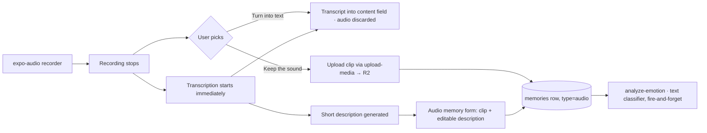

# Feature: Audio memories

**Status:** `planned`
**Last updated:** 2026-07-17
**PRD reference:** New scope — update PRD (extends §6.3 Memories, relates to §6.5 Voice input) in the implementation PR.
**Research basis:** [docs/voice-of-customer.md](../voice-of-customer.md) — §2 theme #6 (legacy/voice), §8 "Voice capture is the emotional wedge" (explicitly recommends revisiting the no-audio-persistence decision), YouGov 47% stat.

## Overview

A fourth first-class memory type: `audio`. Parents record a sound — the child's babble, a mispronounced word, a laugh, a song — and keep the recording itself as the keepsake, with a short AI-generated (user-editable) description shown alongside it. This is distinct from voice **dictation** (see [voice-journaling.md](./voice-journaling.md)), where the parent narrates and the transcript becomes a text memory. Audio memories get their own timeline card and a playback-centered detail experience, preserving the scrapbook feel of the timeline (each memory type looks like a different kind of keepsake) rather than bolting audio onto the `media` carousel.

### Design decisions already made (2026-07-17 discussion)

These were deliberated; don't re-litigate without the maintainer:

1. **One mic, decide after recording.** There is a single recording entry point (the existing composer mic). After the recording stops, the user picks one of two equally-weighted, intent-labeled actions — e.g. **"Turn into text"** vs. **"Keep the sound"**. No upfront taxonomy choice, no "keep the recording?" toggle on the dictation path.
2. **Dictation always transcribes and always discards audio** — unchanged from today. If someone wants to preserve a recording, the answer is always "keep the sound." Exactly one kind of kept audio exists in the product.
3. **Description, not transcript, is the visible text.** Audio memories display a short pre-generated description ("Mia singing Twinkle Twinkle in the bath"), editable by the user like a media caption — on the timeline card and the detail screen. The raw transcription is stored **invisibly** for search discoverability only, and is never rendered.
4. **2-minute cap for v1** (same as dictation). Longer clips risk never being listened to; revisit post-v1 if lullabies/bedtime stories demand it.
5. **Exclusive type, single clip.** An audio memory holds exactly one clip — no photo/video attachments, no AI illustration toggle. A keepsake sound is singular; an audio carousel is not a thing.
6. **Storage/lifecycle parity with existing media** — same R2 pattern, RLS, account deletion coverage. Export is not supported for any media type yet, so audio has no export obligation beyond the product-wide backlog item.
7. **Backlog, explicitly not v1:** illustration generated from an audio memory's transcript (the "illustrated memory with voice" combo); "remember my choice" / long-press shortcut at the post-recording fork for heavy dictators.

## User-facing behavior

- The composer mic works as today: tap → record (auto-stop at 2 min) → stop.
- **Post-recording fork:** two buttons, equal visual weight, outcome-verb labels:
  - **Turn into text** → exactly today's dictation flow: cleaned transcript populates the content field, suggested tags apply, audio is discarded. The audio chip visibly disappears when the transcript populates — no scary confirmation, but the UI quietly reflects that the recording is gone.
  - **Keep the sound** → the memory becomes an `audio` memory: playable clip chip (waveform + duration) in the composer, description field pre-filled by AI (editable, optional), tag picker, date picker. Media attach and the AI illustration toggle are hidden/disabled.
- **Zero-wait fork:** transcription starts the moment recording stops (before the user chooses), because both branches need it — text content on one side, invisible transcript + description generation on the other. Neither branch should ever show a transcription spinner after the choice.
- **Description fallback:** when the clip is babble/singing and transcription yields nothing usable, the description field is left empty with placeholder copy like "Add a note about this sound" — never a garbled machine guess.
- **Auto-tagging:** family members mentioned in the transcript pre-select in the tag picker (reuses the existing `mentionedMemberIds` mechanism from dictation). Unlimited tags, like `text_only`/`media`.
- **Emotion:** fire-and-forget text-classifier pass over description + transcript after save (same non-blocking pattern as other types). No transcript and no description → emotion stays unset, like video.
- **Timeline card (new variant):** playable inline (play/pause affordance + waveform + duration), description excerpt, emotion chip when set, tagged-member avatars. Design should read as its own kind of keepsake — think ticket-stub/cassette register, distinct from both the text note and the media carousel.
- **Detail screen:** playback is the hero (large play control, waveform/scrubber), then description, tagged members, engagement, and the standard date/emotion footer with the emotion-tinted gradient.
- **Copy rules** ([VoC §6](../voice-of-customer.md)): "keep the sound," "record her laugh," "their little voice." Never "audio note," "voice artifact," "audio memo."
- Likes/comments, editing (description, tags, date — not the clip itself), and deletion work like other memory types. Draft autosave never persists the recording (same rationale as media attachments — see [memories.md](./memories.md)); an interrupted composer session keeps text/tags/date only.

## Architecture

Save order follows the house rule: the row (with clip reference) saves first; description generation, emotion, and any other AI work never block save. If the user saves before the description arrives, save with an empty description and patch it in when ready (mirror the emotion-backfill pattern).

## Data model (proposed — confirm at implementation)

| Table / field | Role |
|---------------|------|
| `memories.memory_type` | Add `audio` to the check constraint (migration + regenerated types) |
| `memories.content` | The visible, editable description (nullable, like the media caption) — searchable via the existing FTS index on `content` for free |
| `memories.audio_transcript` (new) | Invisible raw transcript, nullable; search-only. Extend `searchMemories` to match it (second index or combined tsvector — decide at implementation) |
| `memory_media` (1 row) | The clip: reuse the existing table with `content_type: audio/mp4` (or `audio/m4a`), position 0, exactly one row enforced for `audio` type. Store duration (new nullable `duration_ms` column, or reuse `aspect_ratio`-style metadata precedent) |
| `memories.media_key` / `media_content_type` | Mirror the clip like `media` type's cover cache, or keep null — decide with the card renderer |
| `memories.illustration_key` / `illustration_status` | Null / `none` (until the backlog illustration combo) |

**Why `memory_media` and not a new `audio_key` column:** a single `memory_media` row rides everything already built for media keys — the `get-upload-url`/`upload-media` allow-lists (add audio MIME types), `resolveReferencedStorageKeys`, RLS, and `hard-delete-expired-accounts`'s key collection — instead of teaching every storage-key surface a new column. See [media-memories.md](./media-memories.md) Constraints for the list of surfaces that break when a key column is added without full coverage.

**R2 key pattern:** same as media — `{userId}/memories/{memoryId}/media/{mediaAssetId}.{ext}` with `ext` = `m4a`/`mp4`.

**RLS / deletion / export parity:** family-scoped `memories`/`memory_media` policies cover audio with no new policy. Account deletion picks the clip up via `memory_media.object_key` collection (verify the MIME-agnostic paths, don't assume). Export: not supported for any media today; audio joins the product-wide export backlog ("never hold the archive hostage" — [VoC §7.4](../voice-of-customer.md)).

## API & Edge Functions (proposed)

| Function | Change | Auth |
|----------|--------|------|
| `process-voice-memory` | Extend (or add a sibling function) to also return a short `description` alongside `cleanedText`/`mentionedMemberIds`, so one call serves both fork branches. Unusable speech → empty description, never an error | JWT |
| `get-upload-url` / `upload-media` | Add `audio/mp4`, `audio/m4a`, `audio/x-m4a` to allowed content types; existing key pattern already matches | JWT |
| `get-media-url` | No change — presigns the clip for playback like any media key | JWT |
| `analyze-emotion` | Text-classifier path over description + transcript for `audio` type | JWT |

Contract details go in TECH_SPEC §4 in the implementation PR (schema/API changes ship with migration + regenerated types + TECH_SPEC together, per CLAUDE.md).

**Transport note:** dictation's base64-through-edge-function path stays fine for transcription at the 2-min cap (~1–2 MB AAC). The **kept clip** uploads through the `upload-media`/presign path like other media — do not persist audio by round-tripping base64 through an Edge Function.

## Client integration (planned surface)

| Layer | Files | Responsibility |
|-------|-------|----------------|
| Routes | `app/(app)/new-memory.tsx` | Post-recording fork UI, audio-memory composer state (emergent type: kept clip → `audio`) |
| Routes | `app/(app)/memory/[id]/index.tsx`, `edit.tsx` | Playback-hero detail variant; edit description/tags/date only |
| Hooks | `src/hooks/useVoiceInput.ts` | Split/extend: recording + immediate transcription kickoff, fork result handling |
| Hooks | `src/hooks/useMemories.ts` + `memory-cache.ts` | New type flows through existing list/detail caches, realtime, and mutation patches — no new query shape |
| Services | `src/services/memories.ts`, `memory-posting.ts` | `createAudioMemory` (or extend the media posting queue — deferred posting applies to the clip upload too) |
| Components | `src/components/memory-card.tsx` | New `audio` card variant |
| Components | new: audio player/waveform component | Shared by card (compact) and detail (hero); `expo-audio` playback — **never `expo-av`** |

Update this table with real file paths when implementation starts.

## Extension guide

**Safe to extend**

- Illustration-from-transcript for audio memories (the backlog combo): `memory_type` drives rendering/eligibility, not schema possibility — same lesson as retained `illustration_key` on `text_only` rows. Nothing in this design forecloses it.
- Post-fork preference memory ("always turn into text") once real usage shows heavy dictators resenting the extra tap.
- Longer clip cap post-v1 (re-check transcription payload transport and "will anyone listen to this" before raising).

**Do not change without updating this doc**

- The one-mic / post-recording-fork model, and the rule that dictation never persists audio. Any second "keep audio" path recreates the two-kinds-of-recordings confusion this design exists to prevent.
- Visible description vs. invisible transcript separation — never render the raw transcript.
- The single-clip / no-mixed-media constraint on `audio` type.

## Constraints & gotchas

- **This deliberately reverses the "no audio persistence" decision for kept clips only.** Dictation audio is still discarded after transcription. Update the CLAUDE.md high-risk note wording when this ships so agents don't "fix" the new pipeline back.
- **PII sensitivity goes up:** a child's voice is more identifying than text. Same trust boundary as existing flows (audio already goes to OpenAI for transcription today; clips at rest live in private R2 like photos), but no logging of transcripts/descriptions, ever.
- **Turn-into-text is the one irreversible fork branch** — the recording is gone. Keep-the-sound before save is still cancelable like any composer session.
- **Recording format:** `expo-audio` records AAC (`.m4a`). Confirm the exact container/MIME per platform before pinning the upload allow-list.
- **Keyboard UX (house high-risk rule):** the description field + audio chip + save button must stay visible with the keyboard open in the composer and edit screens.
- Emotion, description generation, and transcription are all fire-and-forget after row save — no AI call ever blocks or fails a save.
- `hard-delete-expired-accounts`: verify audio keys are collected (should be free via `memory_media`, but per [memories.md](./memories.md) extension rule #4, a new memory type must be checked against deletion explicitly).

## Dependencies

- Depends on: [Memories & illustrations](./memories.md) (type system, save-first pattern, caches/realtime), [Voice journaling](./voice-journaling.md) (recorder, transcription pipeline — the fork is built into its flow), [Media memories](./media-memories.md) (upload/storage/deletion patterns), [Family sharing](./family-sharing.md) (RLS/tenancy).
- Used by: Timeline, Calendar, Memory detail, search.

## Testing (planned)

Follow [TESTING.md](../TESTING.md); fill in real files at implementation. Expected surface:

- **Unit:** fork state machine (transcription-in-flight → branch selection), description fallback on unusable transcript, audio MIME/duration validation.
- **Integration:** `createAudioMemory` save-first + fire-and-forget description/emotion, cache patches for the new type, search matching invisible transcript, edit (description/tags only), delete cleans up the R2 clip.
- **E2E (Maestro):** record → keep the sound → save → timeline card plays → detail playback; record → turn into text → existing dictation assertions still hold.
- **Deno:** extended `process-voice-memory` contract (description generation, empty-speech fallback), upload allow-list for audio types.

## Changelog

| Date | Change |
|------|--------|
| 2026-07-17 | Initial design write-up from product discussion (status: planned) |
