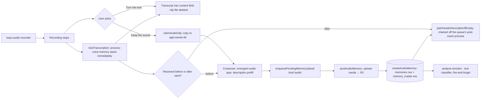

# Feature: Audio memories

**Status:** `done` — shipped 2026-08-20 (schema + functions deployed, client released via EAS Update to the 1.2.0 runtime, device pass complete incl. caption language/context fixes). Remaining scope lives in the backlog list below and docs/plans/audio-memories-v1.md.
**Last updated:** 2026-08-20 (implementation pass — real file paths, shipped contracts, and capture-flow specifics that emerged during build)
**PRD reference:** §6.3 Memories (new subsection), relates to §6.7 Voice-to-Text Journaling.
**Research basis:** [docs/voice-of-customer.md](../voice-of-customer.md) — §2 theme #6 (legacy/voice), §8 "Voice capture is the emotional wedge" (explicitly recommends revisiting the no-audio-persistence decision), YouGov 47% stat.

## Overview

A fourth first-class memory type: `audio`. Parents record a sound — the child's babble, a mispronounced word, a laugh, a song — and keep the recording itself as the keepsake, with a short AI-generated (user-editable) description shown alongside it. This is distinct from voice **dictation** (see [voice-journaling.md](./voice-journaling.md)), where the parent narrates and the transcript becomes a text memory. Audio memories get their own timeline card and a playback-centered detail experience, preserving the scrapbook feel of the timeline (each memory type looks like a different kind of keepsake) rather than bolting audio onto the `media` carousel.

### Design decisions already made (2026-07-17 discussion)

These were deliberated; don't re-litigate without the maintainer:

1. **One mic, decide after recording.** There is a single recording entry point (the existing composer mic). After the recording stops, the user picks one of two equally-weighted, intent-labeled actions — e.g. **"Turn into text"** vs. **"Keep the sound"**. No upfront taxonomy choice, no "keep the recording?" toggle on the dictation path.
2. **Dictation always transcribes and always discards audio** — unchanged from today. If someone wants to preserve a recording, the answer is always "keep the sound." Exactly one kind of kept audio exists in the product.
3. **Description, not transcript, is the visible text.** Audio memories display a short pre-generated description ("Mia singing Twinkle Twinkle in the bath"), editable by the user like a media caption — on the timeline card and the detail screen. The raw transcription is stored **invisibly** for search discoverability only, and is never rendered.
4. **2-minute cap for v1** (same as dictation). Longer clips risk never being listened to; revisit post-v1 if lullabies/bedtime stories demand it.
5. **Exclusive type, single clip.** An audio memory holds exactly one clip — no photo/video attachments, no AI illustration toggle. A keepsake sound is singular; an audio carousel is not a thing.
6. **Storage/lifecycle parity with existing media** — same R2 pattern, RLS, account deletion coverage, **and inclusion in the owner archive export**, which has since shipped ([data-export.md](./data-export.md)). The export Worker (`cloudflare/momora-export-worker`) streams `memory_media`-referenced R2 objects into the ZIP; audio clips stored as `memory_media` rows ride that path, but the manifest's asset-kind types must be extended per that doc's extension guide — verify at implementation, don't assume.
7. **Backlog, explicitly not v1:** illustration generated from an audio memory's transcript (the "illustrated memory with voice" combo); "remember my choice" / long-press shortcut at the post-recording fork for heavy dictators; **audio in Looking Back packages** (decided 2026-08-17 — v1 excludes audio memories from package eligibility entirely; v2 designs an audio story frame deliberately, see Constraints & gotchas).

## User-facing behavior

- The composer mic works as today: tap → record (auto-stop at 2 min, with a quiet "Ns left — it stops on its own" heads-up pill in the last 15s) → stop.
- **Post-recording fork** (`VoiceSpeakItModal`, `captureMode: 'fork'` — only in `new-memory.tsx`'s first recording): two equal-weight buttons, outcome-verb labels:
  - **Turn into text** → exactly today's dictation flow: cleaned transcript populates the content field, suggested tags apply, the clip file is deleted. Disabled/dimmed with "couldn't catch the words" if transcription failed — the fork's terminal-failure state — and a note nudges toward keeping the sound instead: "No connection, so the words will have to wait. The sound itself is right here — you can still keep it."
  - **Keep the sound** → the memory becomes an `audio` memory: playable clip chip (inked trace + duration) in the composer, description field pre-filled by AI once it resolves (editable, optional; a shimmer placeholder with "Writing a note from what you said…" and a "write my own note" pencil escape shows while it's still generating), tag picker, date picker. Media attach is inert (disabled camera icon) and the AI illustration toggle is replaced by the hint "Recording again replaces this sound."
  - A quiet tertiary **"Record again"** discards the current clip/transcript and restarts recording, from the fork sheet.
- **Zero-wait fork:** transcription starts the moment recording stops (`useVoiceInput`'s `kickTranscription`, before the user chooses), because both branches need it. Neither branch shows a transcription spinner after a choice whose result is already in hand.
- **Keep-the-sound never depends on transcription succeeding.** If transcription is still in flight (or failed) when the user taps "Keep the sound," the memory saves immediately with an empty description/transcript; if the in-flight call resolves after save, the description/transcript are patched in fire-and-forget (never overwriting text the user already typed — see Constraints).
- **Description fallback:** when the clip is babble/singing and transcription yields nothing usable, the description field is left empty with placeholder copy "Add a note about this sound" — never a garbled machine guess.
- **Clip removal is Undo, not a type flip.** Removing the attached clip pre-save shows "The sound is gone from this memory." with an Undo link and disables Save until it's restored; there is no silent conversion to a text memory.
- **In-composer re-record** (`captureMode: 'keepOnly'`, once the composer already has a kept clip): the toolbar mic re-records with no fork and no "turn into text" option — stopping claims and replaces the attached clip directly, matching the "Recording again replaces this sound" hint.
- **Auto-tagging:** family members mentioned in the transcript pre-select in the tag picker (reuses the existing `mentionedMemberIds` mechanism from dictation, plus the same single-member auto-tag fallback text memories get). Unlimited tags, like `text_only`/`media`.
- **Emotion:** fire-and-forget text-classifier pass over description + transcript after save (same non-blocking pattern as other types), only fired when there's actually something to analyze. No transcript and no description → emotion stays unset (a neutral graphite tint renders everywhere, never a broken/blank state), like video.
- **Timeline card** (`SoundCard` in `memory-card.tsx`): the ticket-stub/inked-trace/wax-seal system — `StubBand` (tinted card-stock panel: seal, trace, mono elapsed/total time, tap-to-seek) + `StubTear` (perforation line) + description excerpt + engagement bar (share hidden) + the shared `CardFooter` (date, tagged avatars, emotion chip). One inline player at a time app-wide (`audio-playback-coordinator.ts`).
- **Detail screen** (`MemoryDetailSound`): playback is the hero (`SoundStage` — large seal, seekable trace, elapsed/total time, status label), then the rest of the standard detail stack (engagement with share disabled, the description when one exists — a note-less memory renders no note block at all (owner decision 2026-08-20; no placeholder copy) — tagged members, date/emotion footer with the emotion-tinted gradient). While playing, the text/engagement block below the player fades to ~32% opacity (words step back). A resolved-but-unreachable clip (bad/expired signed URL) renders "Not on this phone yet" instead of a play control.
- Edit screen: description/tags/date only. The clip renders recessed with a "Kept as recorded" caption, no remove control; the toolbar mic is disabled with "This sound cannot be re-recorded."
- Calendar day stamps and member-profile thumbnails render a compact `SoundTile` (duration + inked trace) instead of a photo.
- **Copy rules** ([VoC §6](../voice-of-customer.md)): "keep the sound," "record her laugh," "their little voice." Never "audio note," "voice artifact," "audio memo."
- Likes/comments, editing (description, tags, date — not the clip itself), and deletion work like other memory types. Draft autosave never persists the recording (same rationale as media attachments — see [memories.md](./memories.md)); an interrupted composer session keeps text/tags/date only.

## Architecture

```mermaid
flowchart LR
  Mic[expo-audio recorder] --> Stop[Recording stops]
  Stop --> Transcribe[kickTranscription: process-voice-memory starts immediately]
  Stop --> Fork{User picks}
  Fork -->|Turn into text| Text[Transcript into content field · clip file deleted]
  Fork -->|Keep the sound| Claim[claimAudioClip: copy to app-owned dir]
  Claim --> Compose[Composer: emergent audio type, description prefill]
  Compose --> Enqueue[enqueuePendingMemoryUpload kind:'audio']
  Enqueue --> Upload[postAudioMemory: upload-media → R2]
  Upload --> DB[(createAudioMemory: memories row + memory_media row)]
  Transcribe --> Text
  Transcribe --> Backfill{Resolved before or after save?}
  Backfill -->|before| Compose
  Backfill -->|after| Patch[patchAudioDescriptionIfEmpty, chained off the queue's post-insert promise]
  DB --> Patch
  DB --> Emotion[analyze-emotion · text classifier, fire-and-forget]
```

Save order follows the house rule: `enqueuePendingMemoryUpload` admits the memory into the deferred-posting queue synchronously (composer closes immediately); the clip upload + `memories`/`memory_media` row insert happen in the background via `postAudioMemory`/`createAudioMemory`. Description/transcript backfill and emotion analysis never block save and never block each other. If transcription is still in flight at save time, its promise is handed through the queue (`PostAudioMemoryInput.pendingTranscription`) so the backfill fires only after the row actually exists — see Constraints for why a caller-side chain off the raw promise would silently lose the race.

## Data model (shipped — `supabase/migrations/20260819120000_audio_memories.sql`)

| Table / field | Role |
|---------------|------|
| `memories.memory_type` | `text_illustration` \| `text_only` \| `media` \| `audio` (widened check constraint) |
| `memories.content` | The visible, editable description — nullable, normalized empty/whitespace → `NULL` (never `''`) on write. Searchable via the existing FTS index on `content` for free |
| `memories.audio_transcript` | Invisible raw transcript, nullable; same empty→`NULL` normalization. Own GIN index (`idx_memories_audio_transcript_search`, `to_tsvector('english', audio_transcript)`) — `searchMemories` runs it as a second query merged + deduped client-side alongside the `content` and emotion-label queries (same established pattern), not a combined tsvector |
| `memories.media_key` / `media_content_type` | Mirror the single clip (non-null, like `media`'s cover cache) |
| `memories.illustration_key` / `illustration_status` | Null / `'none'` (until the backlog illustration combo) |
| `memory_media` (exactly one row) | The clip: `content_type` one of `audio/mp4`, `audio/m4a`, `audio/x-m4a`; `duration_ms` populated (reused existing column, no new column); `preview_object_key` stays null (no preview concept) |

**`memories_type_invariants`** gained a fourth arm (superseding the version in `20260801170000_paid_subscription_sol_hardening.sql`): `memory_type = 'audio' AND media_key IS NOT NULL AND media_content_type IS NOT NULL AND illustration_status = 'none'` — `content` is deliberately left unconstrained (nullable *and* permitted non-null) rather than forbidden, because an old-build edit screen can still staple a caption onto an audio row post-migration; a content-forbidding arm would turn that save into a raw Postgres error instead of a normal write.

**Two new triggers, both on `memory_media`/`memories` (not the `memories` insert path):**
- `memory_media_audio_invariants` (before insert/update of `content_type, memory_id` on `memory_media`) enforces **at most one** `memory_media` row per `audio` parent, audio content types only under `audio` parents, and non-audio content types forbidden under an `audio` parent. "At most one," not "exactly one," because the memory row → tags → `replace_memory_media_assets` insert order means every audio memory transiently has zero media rows between its own insert and the clip row landing — the same legal transient state `media` already tolerates (and the reason the realtime retry gate exists, see below).
- `memories_audio_type_immutable` (before update of `memory_type` on `memories`) rejects any transition where either side of the update is `'audio'`. Mirrored at the app level by `updateMemory`'s explicit guard (`src/services/memories.ts`) for a friendlier error than a raw `23514`.

**Why `memory_media` and not a new `audio_key` column:** a single `memory_media` row rides everything already built for media keys — the `upload-media` allow-list, `parseStorageKey`/family-access resolution, RLS, and `hard-delete-expired-accounts`'s key collection — instead of teaching every storage-key surface a new column. See [media-memories.md](./media-memories.md) Constraints for the list of surfaces that break when a key column is added without full coverage.

**R2 key pattern:** the client always uploads a new clip through the per-asset pattern — `{userId}/memories/{memoryId}/media/{mediaAssetId}.m4a` — via `buildMemoryMediaAssetKey`. `_shared/storage-keys.ts` widens all four allow-list surfaces for audio: `MEMORY_MEDIA_CONTENT_TYPES` (the content-type set), `MEMORY_MEDIA_EXTENSION_PATTERN`/`MEMORY_MEDIA_ASSET_EXTENSION_PATTERN` (key-shape validation), and `MEMORY_MEDIA_FULL_PATTERN`/`MEMORY_MEDIA_ASSET_FULL_PATTERN` (feed `parseStorageKey`, which `_shared/family-access.ts` uses to resolve a key's owning family for read authorization — missing these would make an uploaded clip unplayable, not just unuploadable). The legacy single-object `{userId}/memories/{memoryId}/media.{ext}` pattern also accepts `m4a` but the client never writes audio through it.

**RLS / deletion / export parity:** family-scoped `memories`/`memory_media` policies cover audio with no new policy. Account deletion picks the clip up via `memory_media.object_key` collection (MIME-agnostic). Export ([data-export.md](./data-export.md)): the export Worker iterates `memory_media` rows type-agnostically and derives extensions from the object key, so an audio clip rides the existing path with no Worker code change (covering test only, per the plan's P1.5). Looking Back eligibility (`get_or_create_looking_back_packages`) excludes `memory_type <> 'audio'` in both of its candidate-selection predicates — v1 audio memories never enter package eligibility.

## API & Edge Functions (shipped)

| Function | Change | Auth |
|----------|--------|------|
| `process-voice-memory` | Family mode's cleanup call (`gpt-4o-mini`) now returns `description` alongside `cleanedText`/`mentionedMemberIds` on every response — one round trip serves both fork branches. `description` is server-sanitized (trimmed, clamped to 120 chars, `''` when speech is unusable — never an error, never garbled babble). Onboarding mode's response is unchanged (no `description` field; the fork does not exist pre-auth) | JWT |
| `upload-media` | Adds `audio/mp4`, `audio/m4a`, `audio/x-m4a` to its content-type allow-list (via `_shared/storage-keys.ts#MEMORY_MEDIA_CONTENT_TYPES`) and a dedicated **5 MB** cap for those types (`maxBytesForContentType`) — generous headroom over the ~1.9 MB a 2-minute AAC clip actually produces at `expo-audio`'s `HIGH_QUALITY` preset | JWT |
| `get-media-url` | No change — presigns the clip for playback like any media key | JWT |
| `analyze-emotion` | New `memory_type === 'audio'` branch: classifies over `content` (description) + `audio_transcript` via the same text-classifier path as `text_only`, dispatched by `buildAudioEmotionClassifierInput`. Either field alone is enough to proceed; both empty (babble/silence with no typed caption) returns `{ emotion: '', colorPalette: '', skipped: true }` — success-shaped, never an error, same spirit as a video memory with nothing to analyze | JWT |
| `compose-share-card` | Unchanged: still **rejects `audio` explicitly** with `400 unsupported_memory_type` (`isRejectedMemoryType`). The client never reaches it for audio — `enableShare={false}` on the audio card/detail engagement bar hides the affordance, and `warmShareCardForMemoryFireAndForget` returns early for `memory_type === 'audio'` before ever warming | JWT |

Full request/response shapes and the widened schema live in [TECH_SPEC.md](../TECH_SPEC.md) §2/§4.

**AI usage ledger:** `description` generation rides the SAME `voice_cleanup` operation/ledger write as the existing cleanup call — one `chatJson` call now returns both `cleanedText` and `description`, so no new `ai_usage_events` `operation` value was needed (the plan's "extend the enum" option was not taken; the "record as `voice_cleanup`" option was). Ledger writes stay fire-and-forget, family-attributed, never blocking. The **image** fair-use caps don't apply (audio has no image generation); no new visible or invisible limit exists for v1 — transcription/cleanup cost is bounded by the 2-minute cap and capture friction, same as dictation always was.

**Transport note:** dictation's base64-through-edge-function path stays the transport for transcription at the 2-min cap (~1–2 MB AAC) — unchanged. The **kept clip** uploads through the `upload-media` proxy path (`postAudioMemory` → `uploadMediaObject`), same as other media; it is never round-tripped as base64 through an Edge Function.

## Client integration (shipped)

| Layer | Files | Responsibility |
|-------|-------|----------------|
| Routes | `app/(app)/new-memory.tsx` | Post-recording fork state (`audioClip`/`audioClipRemoved`/`audioTranscript`), emergent `audio` composer, `handleSaveAudio` |
| Routes | `app/(app)/memory/[id]/index.tsx` | `MemoryDetailSound`/`SoundStage` — playback-hero detail variant, "Not on this phone yet" unavailable state |
| Routes | `app/(app)/memory/[id]/edit.tsx` | Recessed read-only clip well, description/tags/date-only edit, disabled re-record mic |
| Routes | `app/(app)/(tabs)/calendar.tsx`, `app/(app)/family/[id]/index.tsx` | `SoundTile` day-stamp / member-thumb variants |
| Hooks | `src/hooks/useVoiceInput.ts` | Recording + immediate `kickTranscription`, stale-response guarding via `activeClipUriRef`, exposes `transcriptionPromise` for post-close awaiting |
| Hooks | `src/hooks/useAudioClipPlayback.ts` | Per-clip `expo-audio` playback state (create-once + `replace()`, never `expo-av`) |
| Hooks | `src/hooks/audio-playback-coordinator.ts` | Module-level "one sound plays app-wide" singleton (`useSyncExternalStore`); exports `pauseAllAudioPlayback`/`prepareAudioPlaybackMode` for future callers — recorder start and video autoplay are **not yet wired** to it (see Extension guide) |
| Hooks | `src/hooks/useMemories.ts`, `useMemoriesRealtime.ts` | `runAudioEmotionAnalysis` wrapper; realtime INSERT retry gate extended to `audio` alongside `media` |
| Utils | `src/utils/audio-clip-custody.ts` | `claimAudioClip` (temp → app-owned `audio-recordings/` dir), `discardAudioClip`, `sweepAudioRecordingsDirectory` (48h startup sweep, wired in `app-providers.tsx`) |
| Services | `src/services/memories.ts` | `createAudioMemory`, `resolveAudioMemoryInsertConflict`, `patchAudioDescriptionIfEmpty`, `runAudioEmotionAnalysis`, audio-aware `updateMemory` type-immutability guard, `audio_transcript` merged into `searchMemories` |
| Services | `src/services/memory-posting.ts` | `postAudioMemory` (dedicated minimal upload pipeline — no compression/EXIF-strip/preview), `PostAudioMemoryInput`, `isAudioUploadInput` |
| Services | `src/services/share-card.ts` | `warmShareCardForMemoryFireAndForget` skips `audio` entirely |
| Components | `src/components/voice-speak-it-modal.tsx` | `VoiceCaptureMode` (`'dictate' \| 'fork' \| 'keepOnly'`), the fork UI, "Record again" |
| Components | `src/components/memory-card.tsx` | `SoundCard` variant + the forward-compat `UnknownTypeCard` (P0.1 defensive patch, see Constraints) |
| Components | `src/components/pending-memory-upload-card.tsx` | Audio-specific pending/failed copy, `SoundTile` preview |
| Components | `src/components/audio/` (new kit) | `clip-chip.tsx` (composer/edit clip row), `sound-tile.tsx` (`SoundTile` + `SoundMark`), `sound-trace.tsx` (deterministic seeded "inked waveform"), `listen-seal.tsx` (play/pause wax-seal control), `stub-band.tsx` + `stub-tear.tsx` (timeline card visual + ticket-tear), `audio-emotion.ts` (`resolveAudioEmotionColors`, the neutral pre-emotion tint, `formatClipTime`), `audio-seed.ts` (`seedFromKey`, deterministic per-clip trace seed) |
| Hooks (client wrapper) | `src/services/ai.ts` | `processVoiceMemory` return type includes `description` |

## Extension guide

**Safe to extend**

- Illustration-from-transcript for audio memories (the backlog combo): `memory_type` drives rendering/eligibility, not schema possibility — same lesson as retained `illustration_key` on `text_only` rows. Nothing in this design forecloses it. If picked up, it now goes through the `generate-illustration` dispatcher + Cloudflare Workflow pipeline (with `requestIntent`, usage-limit reservation, and portrait deferral — see [memories.md](./memories.md) "Durable illustration execution"), not a direct edge-function call.
- Post-fork preference memory ("always turn into text") once real usage shows heavy dictators resenting the extra tap.
- Longer clip cap post-v1 (re-check transcription payload transport and "will anyone listen to this" before raising).
- Wiring the recorder (`useVoiceInput`'s `startRecording`) and video autoplay (`timeline.tsx`'s `activeVideoId`) into `audio-playback-coordinator.ts`'s `pauseAllAudioPlayback()`/`prepareAudioPlaybackMode()` — both are exported and ready, but v1 scoped the coordinator itself to audio-clip-vs-audio-clip only (see Constraints).

**Do not change without updating this doc**

- The one-mic / post-recording-fork model, and the rule that dictation never persists audio. Any second "keep audio" path recreates the two-kinds-of-recordings confusion this design exists to prevent.
- Visible description vs. invisible transcript separation — never render the raw transcript.
- The single-clip / no-mixed-media constraint on `audio` type (enforced by `memory_media_audio_invariants` and `memories_audio_type_immutable`, both in the 2026-08-19 migration).
- `captureMode`'s three-way split in `voice-speak-it-modal.tsx` (`'dictate'` / `'fork'` / `'keepOnly'`). The edit screen's dictation-into-existing-memory usage must stay `'dictate'` (default) — an audio memory's type can never change post-save, so offering "Keep the sound" there would be a lie the DB trigger would then reject anyway.
- `patchAudioDescriptionIfEmpty`'s asymmetric guard: `content` is a conditional (`.is('content', null)`) empty-only write; `audio_transcript` is unconditional. Collapsing them to the same guard would let a late transcription-arrival clobber a user-typed description.

## Constraints & gotchas

- **This deliberately reverses the "no audio persistence" decision for kept clips only.** Dictation audio is still discarded after transcription. CLAUDE.md's high-risk note and AGENTS.md's voice rules (Product snapshot, Security, and the `process-voice-memory` contract section) were updated when this shipped — don't "fix" the new pipeline back into full no-persistence.
- **Onboarding voice is out of scope — no fork there.** The onboarding capture screen uses `process-voice-memory`'s pre-auth `mode: 'onboarding'`, whose response shape has no `description` field and never gains a fork — "Keep the sound" cannot exist pre-auth (no family rows, and the anonymous session may never write application rows or storage).
- **`captureMode` is the fork's real gate, not screen identity.** `new-memory.tsx` passes `'fork'` for the first recording and `'keepOnly'` for a re-record once the composer already has a clip (no dictate option there — offering "Turn into text" mid-re-record would silently keep the old clip while the toolbar hint promises a replace). `memory/[id]/edit.tsx` always passes the default, `'dictate'`.
- **The queue, not the composer, owns the description/transcript backfill's ordering.** `useVoiceInput`'s transcription kicks off at stop time, well before the memory row exists — the row isn't created until `postAudioMemory`'s deferred insert completes, which typically finishes AFTER transcription resolves. A caller that chained `patchAudioDescriptionIfEmpty` directly off the transcription promise would race that insert: a Supabase `UPDATE` matching zero rows succeeds silently, permanently losing the description/transcript in the common fast-save case. The fix is `PostAudioMemoryInput.pendingTranscription` — the raw promise is handed through the pending-uploads queue, and `use-pending-memory-uploads.tsx` only chains the backfill onto it AFTER `postAudioMemory` has resolved (the row now provably exists). This field can only exist because the queue is in-memory-only and never serializes its inputs — queue persistence across force-quit is explicitly out of v1 (see below); if it ever lands, a `Promise` cannot survive serialization and this field's shape must be revisited.
- **Clip custody is a three-stage handoff, not "the recorder's file."** (1) `expo-audio` writes into an OS-managed temp/cache location. (2) The instant the user taps "Keep the sound," `claimAudioClip` copies it into an app-owned `documentDirectory/audio-recordings/` directory — a later `prepareToRecordAsync` in the same session ("Record again" tried before) or an OS cache purge before a deferred retry can invalidate the original temp URI out from under the pending-uploads queue. (3) `sweepAudioRecordingsDirectory` (wired fire-and-forget at app start, `app-providers.tsx`) deletes claimed clips older than 48h — the mitigation for a force-quit between claim and a successful (in-memory-only) upload, since the queue itself has no persisted record to clean up after. This is a PII surface (a child's voice on disk with no queue entry), not just hygiene.
- **`content`/`audioTranscript` are normalized empty-string-or-whitespace → `NULL`, never `''`.** `patchAudioDescriptionIfEmpty`'s conditional backfill guard (`.is('content', null)`) depends on this invariant to detect "still empty, safe to patch" — if a future change ever wrote `''` instead of `NULL` for "no description yet," that guard would silently stop firing.
- **User text always beats the AI caption, in both windows.** In-composer: `hasTypedAudioNoteRef` ratchets true the instant the user types anything (or already had text before keeping the sound); once true, a later-arriving AI description is discarded silently, never merged/prompted. Post-save: `patchAudioDescriptionIfEmpty`'s `content` write is the DB-enforced empty-only guard described above — never a client-side read-then-write race.
- **Type-aware surfaces that handle (or explicitly exclude) `audio`:** share cards (`compose-share-card` rejects it; `enableShare={false}` hides the client affordance; `warmShareCardForMemoryFireAndForget` skips it before ever warming), Looking Back (excluded from eligibility at the SQL layer, both occurrences of the predicate), calendar day stamps (`SoundTile`), member-profile thumbnails (`SoundTile`), and the realtime INSERT prepend's media-fetch retry gate (extended to `audio` alongside `media` — a cross-device audio insert racing its own `memory_media` row needed the same retry `media` already had).
- **Looking Back: v1 excludes audio memories; v2 includes them (decided 2026-08-17).** `get_or_create_looking_back_packages` requires `memory_type <> 'audio'` in both of its candidate-selection predicates. The **v2 backlog item** is a deliberately designed audio story frame — dwell time vs. clip length, autoplay-with-sound etiquette, pause/hold semantics, Reduce Motion/screen-reader behavior, preloading — not a fall-through rendering.
- **P0.1 forward-compat patch (shipped ahead of this feature, still load-bearing):** `isKnownMemoryType`/`KNOWN_MEMORY_TYPES` (`src/utils/memories.ts`) gate `MemoryCard`'s `UnknownTypeCard`, `memory/[id]/index.tsx`'s unavailable notice, and `edit.tsx`'s read-only fallback — this is what let `audio` ship without a crash risk on old installed clients mid-rollout, and the same mechanism now protects against any future fifth type the same way.
- **Analytics:** `voice_fork_shown` (`auto_stopped`), `voice_fork_choice` (`'turn_into_text' | 'keep_the_sound'`), and `audio_memory_saved` (`duration_bucket`, `has_description`) are typed PostHog events (`src/services/analytics.ts`) — no content/transcript in properties.
- **Offline / deferred posting:** the kept clip behaves exactly like other media posts under the deferred-posting queue (local file until upload succeeds, same retry/discard semantics) — `postAudioMemory` is a dedicated pipeline, not a call into the media path (see below), but plugs into the same queue lifecycle.
- **PII sensitivity goes up:** a child's voice is more identifying than text. No logging of transcripts/descriptions, ever — errors log stable categories only (`process-voice-memory`'s catch block never logs `message` verbatim from provider errors).
- **Turn-into-text is the one irreversible fork branch** — the recording is gone (file deleted after the transcript is applied). Keep-the-sound before save is still cancelable/removable (Undo) like any composer session.
- **Recording format is pinned, not assumed:** `expo-audio@56.0.13`'s `RecordingPresets.HIGH_QUALITY` records AAC-in-MPEG4 (`.m4a`) on both native platforms; the client uploads `audio/mp4`, and the allow-list accepts `audio/m4a`/`audio/x-m4a` defensively. Web is out of v1 (its preset branch records `audio/webm`, never added to the allow-list).
- **A raw `.m4a` never flows through the image/media upload branch.** `postAudioMemory` is a deliberately minimal, separate pipeline from `postMediaMemory`/`uploadMemoryMediaAssets` — no video compression, no EXIF strip (would throw on native image-decode against an audio file), no preview/poster generation. It shares only presign/PUT/rollback semantics with the media path.
- **Keyboard UX (house high-risk rule):** the description field + clip chip + save button stay visible with the keyboard open in the composer and edit screens.
- Emotion, description generation, and transcription are all fire-and-forget after row save — no AI call ever blocks or fails a save.
- `hard-delete-expired-accounts` needed no code change: it collects keys via `memory_media.object_key`, which is MIME-agnostic (covering test only, per the plan's P1.5).

## Dependencies

- Depends on: [Memories & illustrations](./memories.md) (type system, save-first pattern, caches/realtime), [Voice journaling](./voice-journaling.md) (recorder, transcription pipeline — the fork is built into its flow), [Media memories](./media-memories.md) (upload/storage/deletion patterns), [Family sharing](./family-sharing.md) (RLS/tenancy), [Usage limits](./usage-limits.md) (AI ledger attribution for every OpenAI call), [Data export](./data-export.md) (clips join the owner archive).
- Must be handled by (type-aware surfaces): Timeline, Calendar, Memory detail, search, [Memory sharing](./memory-sharing.md) (rejects `audio` — already shipped), [Looking Back](./looking-back.md) (v1: excluded from eligibility; v2: dedicated audio frame — see Constraints & gotchas), [Analytics](./analytics.md) (fork + save events).
- Explicitly not involved: [Onboarding](./onboarding.md) voice (transcribe-only, pre-auth — no fork), [Subscriptions](./subscriptions.md) (audio creation follows the same access gating as every other memory type; nothing audio-specific).

## Testing

Full jest suite: 199 suites / 1927 tests green at last run. Real files, per [TESTING.md](../TESTING.md):

- **Unit / component:**
  - `src/hooks/useVoiceInput.test.ts` — recording lifecycle, `kickTranscription`, stale-response guarding
  - `src/hooks/useAudioClipPlayback.test.ts`, `src/hooks/audio-playback-coordinator.test.ts` — playback state, create-once/`replace()`, single-active-clip coordination
  - `src/utils/audio-clip-custody.test.ts` — claim/discard/sweep
  - `src/components/voice-speak-it-modal.test.tsx` — fork rendering, `captureMode` branching, terminal-failure state, "Record again"
  - `src/components/memory-card.test.tsx` — `SoundCard` variant, `UnknownTypeCard` forward-compat fallback
  - `src/components/pending-memory-upload-card.test.tsx` — audio-specific pending/failed copy
  - `src/components/audio/clip-chip.test.tsx`, `listen-seal.test.tsx`, `sound-tile.test.tsx`, `sound-trace.test.tsx`, `stub-band.test.tsx`, `stub-tear.test.tsx` — kit component unit tests
- **Integration:**
  - `src/services/memories.integration.test.ts` — `createAudioMemory`, conflict-repair, `patchAudioDescriptionIfEmpty` guard semantics, `updateMemory` type-immutability, `searchMemories` transcript merge/dedupe
  - `src/services/memory-posting.test.ts` — `postAudioMemory` upload/rollback
  - `src/services/share-card.test.ts` — audio skip in `warmShareCardForMemoryFireAndForget`
  - `src/hooks/use-pending-memory-uploads.test.tsx` — queue-owned backfill ordering, emotion kick gating
  - `src/hooks/useMemoriesRealtime.test.tsx` — INSERT retry gate extended to `audio`
  - `src/hooks/useShareMemoryCard.test.tsx` — `unsupported_memory_type` error mapping
  - `src/screen-tests/new-memory.integration.test.tsx`, `new-memory.auto-tag.test.tsx` — composer fork/emergent-type flows
  - `src/screen-tests/edit-memory.integration.test.tsx` — recessed clip, read-only fallback for unknown types
  - `src/screen-tests/memory-detail.integration.test.tsx` — `MemoryDetailSound`, unavailable state
  - `src/screen-tests/calendar.audio-stamp.test.tsx`, `family-member.audio-thumb.test.tsx` — `SoundTile` rendering
- **Deno:**
  - `supabase/functions/process-voice-memory/index.test.ts` — family-mode `description` contract, sanitization, onboarding-mode unchanged
  - `supabase/functions/analyze-emotion/index.test.ts` — audio dispatch branch, skip-when-empty
  - `supabase/functions/upload-media/index.test.ts` — audio content-type allow-list, 5 MB cap
  - `supabase/functions/_shared/storage-keys.test.ts` — audio extension regression coverage across all four pattern surfaces
- **DB:** `supabase/tests/audio_memories.sql` — constraint/invariant/trigger coverage (runs under `npm run test:db`, which needs local Docker/Supabase up — not run in this pass; see the plan's execution-status block)
- **E2E (Maestro):** authored, not executed this pass (no bootable simulator/emulator in this environment) — `.maestro/flows/memories/create-audio-memory.yaml`, `voice-turn-into-text.yaml`, `edit-audio-description.yaml`, `delete-audio-memory.yaml`. Run in the release device pass (P4.3).

## Changelog

| Date | Change |
|------|--------|
| 2026-07-17 | Initial design write-up from product discussion (status: planned) |
| 2026-08-17 | Looking Back scoping decided: v1 excludes audio memories from package eligibility; a designed audio story frame is v2 backlog. |
| 2026-08-17 | Revalidated against the current repo. Updated for: owner archive export shipped (clips must be included — the "no export yet" claim was stale); AI usage ledger shipped (`ai_usage_events` attribution required for transcription/cleanup/description calls); `process-voice-memory`'s new two-mode contract (family/onboarding) with the fork scoped to family mode only; illustration pipeline's move to the Workflows dispatcher (affects the emotion path note and the backlog illustration combo); share cards already rejecting `audio` (forward-compat shipped in memory-sharing); new type-aware surfaces to handle (Looking Back, share-card warming, analytics events, offline queue); AGENTS.md added alongside CLAUDE.md for the no-persistence wording update. Core design (one mic, post-recording fork, description-not-transcript, single clip, 2-min cap) unchanged. |
| 2026-08-20 | Implementation pass (status: `planned` → `in-progress`). Schema, capture-fork, and display/search phases shipped; documented against the real code rather than the plan's intentions. Notable specifics that emerged in build: `captureMode: 'dictate' \| 'fork' \| 'keepOnly'` (a third mode for in-composer re-record, not just fork-vs-not); the queue-owned `pendingTranscription` backfill promise (fixes a save-vs-transcription-resolution ordering race the design doc hadn't anticipated); three-stage clip custody (temp → `claimAudioClip`'s app-owned dir → 48h `sweepAudioRecordingsDirectory` startup sweep) as the accepted mitigation for the force-quit orphan window; `content`/`audio_transcript` normalized empty-string→`NULL` (never `''`) as a load-bearing invariant for the conditional backfill guard; description generation folded into the existing `voice_cleanup` ledger operation rather than a new enum value; `postAudioMemory` as a deliberately separate minimal upload pipeline (not a parameterized media-path call) to avoid the EXIF-strip/compression crash the plan flagged; the `memory_media_audio_invariants`/`memories_audio_type_immutable` triggers exactly as planned. Not yet done: iOS/Android device pass, defensive-patch EAS Update publish + saturation gate, production migration deploy, release ordering. Maestro flows authored, not executed (no bootable simulator in this environment). |
