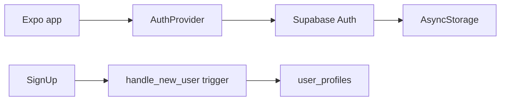

# Auth

Email/password authentication via Supabase Auth. Session persistence uses AsyncStorage; protected routes live under `(app)`.

## Overview

Users create an account or sign in, then land in the main tab shell. Sign-up metadata (`name`, `timezone`) seeds `user_profiles` through the database trigger on `auth.users`.

## User-facing behavior

- **Sign up:** name, email, password (min 8 chars)
- **Sign in:** email + password
- **Forgot password:** sends Supabase reset email
- **Sign out:** from Settings tab
- Unauthenticated users cannot access `(app)` routes

## Architecture / data flow



1. `AuthProvider` loads session on mount and listens to `onAuthStateChange`.
2. Root `app/index.tsx` redirects to auth or app tabs based on session.
3. Sign-up passes `raw_user_meta_data.name` and `timezone` for profile bootstrap.

## Data model

| Table | Role |
|-------|------|
| `auth.users` | Supabase Auth users |
| `user_profiles` | App profile row created on signup |

## API & Edge Functions

No Edge Functions for auth in MVP — client uses Supabase Auth directly with anon key + RLS.

## Client integration

| Piece | Path |
|-------|------|
| Supabase client | `src/lib/supabase.ts` |
| Query client | `src/lib/query-client.ts` |
| Auth service helpers | `src/services/auth.ts` |
| Auth hook + provider | `src/hooks/use-auth.tsx` |
| Providers wrapper | `src/components/app-providers.tsx` |
| Auth screens | `app/(auth)/login.tsx`, `signup.tsx`, `forgot-password.tsx` |
| Route guards | `app/index.tsx`, `app/(auth)/_layout.tsx`, `app/(app)/_layout.tsx` |

Env vars (client):

- `EXPO_PUBLIC_SUPABASE_URL`
- `EXPO_PUBLIC_SUPABASE_ANON_KEY`

## Extension guide

- Add OAuth: use `expo-auth-session` + Supabase provider methods; keep session in `AuthProvider`.
- Add email confirmation UX: check `session` after sign-up and show a dedicated screen instead of redirecting immediately.
- Profile edits: update `user_profiles` via Supabase client (RLS allows own row).

## Constraints & gotchas

- Never put service role or OpenAI keys in the client.
- Sign-up requires email confirmation if enabled in Supabase dashboard — adjust UX if toggled.
- Password reset deep link uses `momora://auth/callback` via `getAuthRedirectUri()`.

### Supabase dashboard (required for email links)

In [Auth → URL Configuration](https://supabase.com/dashboard/project/uglhonlaqkqvxcqudwlk/auth/url-configuration):

| Setting | Value |
|---------|-------|
| **Site URL** | `momora://auth/callback` |
| **Redirect URLs** | `momora://**`, `momora://auth/callback`, `exp://**` |

Without this, confirmation emails redirect to `localhost:3000` and fail on mobile.

**Dev shortcut:** Authentication → Providers → Email → disable **Confirm email**, or manually confirm the user under Authentication → Users.

## Testing

| Layer | File |
|-------|------|
| Unit | `src/services/auth.test.ts` |
| Integration | `src/hooks/use-auth.integration.test.tsx` |
| E2E | `.maestro/flows/auth/login.yaml` |

```bash
npm test -- src/services/auth.test.ts src/hooks/use-auth.integration.test.tsx
maestro test .maestro/flows/auth/login.yaml
```

## Changelog

| Date | Change |
|------|--------|
| 2026-05-24 | Initial auth shell + protected tab layout |
