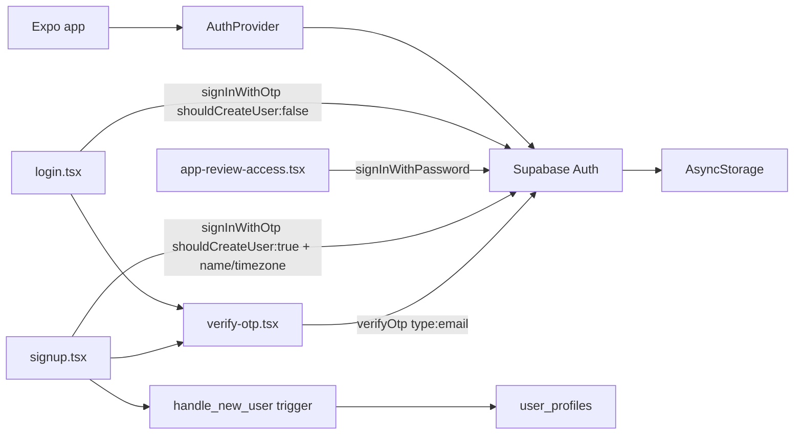

# Auth

Email OTP (one-time code) authentication via Supabase Auth is the default. A separate production route accepts reusable email/password credentials for one dedicated store-review account. Session persistence uses AsyncStorage; protected routes live under `(app)`.

## Overview

Users request a 6-digit code sent to their email, enter it to sign in, then land in the main tab shell. Sign-up metadata (`name`, `timezone`) seeds `user_profiles` through the database trigger on `auth.users`. Store reviewers instead choose the low-profile **App review access** action and use credentials supplied privately in the store console; no credential is bundled with the app. A `__DEV__`-only shortcut remains for Maestro E2E.

## User-facing behavior

- **Sign in:** email only → `Continue` → 6-digit code screen. If no account exists for that email, the app routes to sign-up instead of showing a generic error.
- **Sign up:** name + email → `Create account` → same 6-digit code screen.
- **Verify code:** 6-digit input, auto-submits once all digits are entered; "Resend code" button with a 60s cooldown; clear error states for expired/invalid codes.
- **App review access:** a separate link on the login screen opens email/password fields labeled for reviewers. It calls Supabase password sign-in and lands on the same timeline. The production account must already belong to a seeded family with synthetic review data, so it does not enter onboarding.
- **Sign out:** from Settings tab.
- **Dev/E2E only** (`__DEV__` builds): login screen has a "Dev: password sign-in" toggle that reveals email+password fields calling `signInWithPassword` directly, so Maestro doesn't have to read a real email inbox. The toggle and the fields it reveals never render in production builds — the branch is dead-code-eliminated by the bundler the same way the family-member E2E photo fixture is (see `src/utils/e2e-fixtures.ts` / `add-family-member-photo-fixture`). The password provider itself stays enabled server-side in Supabase; only the client UI to reach it is gated.
- Unauthenticated users cannot access `(app)` routes.

## Architecture / data flow



1. `AuthProvider` loads session on mount and listens to `onAuthStateChange`.
2. Root `app/index.tsx` redirects to auth or app tabs based on session.
3. **Sign in:** `login.tsx` calls `signInWithOtp({ email, options: { shouldCreateUser: false } })`. If Supabase rejects because no account exists, the app routes to `signup.tsx` (prefilling the email) instead of surfacing a raw error. Otherwise it pushes to `verify-otp.tsx`.
4. **Sign up:** `signup.tsx` calls `signInWithOtp({ email, options: { shouldCreateUser: true, data: { name, timezone } } })`, then pushes to `verify-otp.tsx`. `raw_user_meta_data.name`/`timezone` feed the `handle_new_user` trigger that bootstraps `user_profiles` — unchanged by this migration.
5. `verify-otp.tsx` calls `verifyOtp({ email, token, type: 'email' })`. On success the session is set and the screen replaces itself with the timeline. Resend re-issues the same `signInWithOtp` call (with a 60s client-side cooldown).
6. **Store review:** `app-review-access.tsx` calls `signInWithPassword`. The normal family provider resolves the seeded account's `active_family_id` and membership, so the account opens its review-ready timeline without a special client bypass.
7. `src/hooks/use-auth-url-handler.ts` + `src/lib/create-session-from-url.ts` stay wired for `momora://auth/callback` deep links. They're no longer used for password-reset (that flow is gone), but remain as a fallback in case Supabase ever emails a magic link instead of a code, and are otherwise dormant. They play no role in family-invite links (`https://usemomora.com/invite?...`), which are handled by Expo Router file-based linking.

## Data model

| Table | Role |
|-------|------|
| `auth.users` | Supabase Auth users |
| `user_profiles` | App profile row created on signup |

## API & Edge Functions

No Edge Functions for auth in MVP — client uses Supabase Auth directly with anon key + RLS.

## Client integration

| Piece | Path |
|-------|------|
| Supabase client | `src/lib/supabase.ts` |
| Query client | `src/lib/query-client.ts` |
| Auth service helpers | `src/services/auth.ts` — `mapAuthError`, `isUserNotFoundOtpError`, `getDeviceTimezone` |
| Auth hook + provider | `src/hooks/use-auth.tsx` — `requestSignInOtp`, `requestSignUpOtp`, `verifyOtp`, `signInWithPassword` (review + dev/E2E), `signOut` |
| Auth deep-link fallback | `src/hooks/use-auth-url-handler.ts`, `src/lib/create-session-from-url.ts` |
| Providers wrapper | `src/components/app-providers.tsx` |
| Auth screens | `app/(auth)/login.tsx`, `app-review-access.tsx`, `signup.tsx`, `verify-otp.tsx` |
| Route guards | `app/index.tsx`, `app/(auth)/_layout.tsx`, `app/(app)/_layout.tsx` |
| Dev/E2E gate reused for the password toggle | `src/utils/e2e-fixtures.ts` (`isE2eFixturesEnabled`) |

Env vars (client):

- `EXPO_PUBLIC_SUPABASE_URL`
- `EXPO_PUBLIC_SUPABASE_ANON_KEY`

## Extension guide

- Add OAuth: use `expo-auth-session` + Supabase provider methods; keep session in `AuthProvider`.
- The invite-code field on `signup.tsx` is a planned extension point (family-sharing plan §9) — a later phase carries a pending invite code from `app/invite.tsx` through signup and into `requestSignUpOtp`'s metadata/redemption flow. Nothing in this phase builds that logic; keep the seam clean (don't hardcode assumptions about signup always being invite-less).
- Profile edits: update `user_profiles` via Supabase client (RLS allows own row).

## Constraints & gotchas

- Never put service role or OpenAI keys in the client.
- `signInWithPassword` is reachable in production only through the explicitly labeled reviewer route. Do not disguise it as a normal-user password flow or prefill either field.
- The `__DEV__` password shortcut must stay compile-time gated. Follow the same pattern used for the family-member E2E photo fixture: a helper that returns `__DEV__`, used to conditionally render the shortcut and everything behind it.
- Provisioning and seeding are manual release operations; follow [the reviewer-access runbook](../reviewer-access.md). Never place reusable credentials in source, EAS public variables, docs, tests, screenshots, or logs.
- `isUserNotFoundOtpError` currently keys off Supabase's `otp_disabled` error code (message "Signups not allowed for otp"), which is what GoTrue returns today when `shouldCreateUser: false` is rejected because the account doesn't exist. `user_not_found` is also treated as a match defensively, and there's a message-text fallback. **This is an assumption, not a documented contract** — verify against a real Supabase project before relying on it, and re-check if Supabase changes this behavior.
- OTP codes expire after the window configured in the Supabase dashboard (see below) — expired/invalid codes surface as a `verifyOtp` error on `verify-otp.tsx`.

### Supabase dashboard (required)

In [Auth → URL Configuration](https://supabase.com/dashboard/project/uglhonlaqkqvxcqudwlk/auth/url-configuration):

| Setting | Value |
|---------|-------|
| **Site URL** | `momora://auth/callback` |
| **Redirect URLs** | `momora://**`, `momora://auth/callback`, `exp://**` |

In Auth → Emails → **Magic Link** template: it must include `{{ .Token }}` — by default Supabase's template only sends a clickable link, not a numeric code, and `verifyOtp({ type: 'email' })` needs the code. Verify this before relying on the OTP UI end-to-end.

In Auth → Providers → Email: set **OTP expiry** to 10 minutes (family-sharing plan §4 Phase 0).

Custom SMTP (Bento relay, `yubin.sentbybento.com:587` STARTTLS) delivers the OTP emails — configure under Auth → SMTP Settings. Until Phase 0 lands, OTP emails fall back to Supabase's default sender (rate-limited, fine for local dev).

**Password provider:** stays enabled in Auth → Providers → Email for the dedicated store-review account and dev/E2E accounts. Normal users still receive the OTP-first UI.

## Testing

| Layer | File |
|-------|------|
| Unit | `src/services/auth.test.ts` |
| Integration | `src/hooks/use-auth.integration.test.tsx` |
| Screen integration | `src/screen-tests/app-review-access.integration.test.tsx` |
| E2E | `.maestro/flows/auth/app-review-access.yaml`; `.maestro/flows/auth/login.yaml` (+ `.maestro/flows/auth/sign-in.yaml` for the `__DEV__` shortcut) |

```bash
npm test -- src/services/auth.test.ts src/hooks/use-auth.integration.test.tsx src/screen-tests/app-review-access.integration.test.tsx
maestro test .maestro/flows/auth/login.yaml
maestro test .maestro/flows/auth/app-review-access.yaml
```

## Changelog

| Date | Change |
|------|--------|
| 2026-07-16 | Added a separate production app-review password route and provisioning runbook; OTP remains the default |
| 2026-07-11 | Migrated to email OTP everywhere; removed password sign-in/sign-up/reset from the production UX; added `__DEV__`-only password path for Maestro |
| 2026-05-24 | Initial auth shell + protected tab layout |
