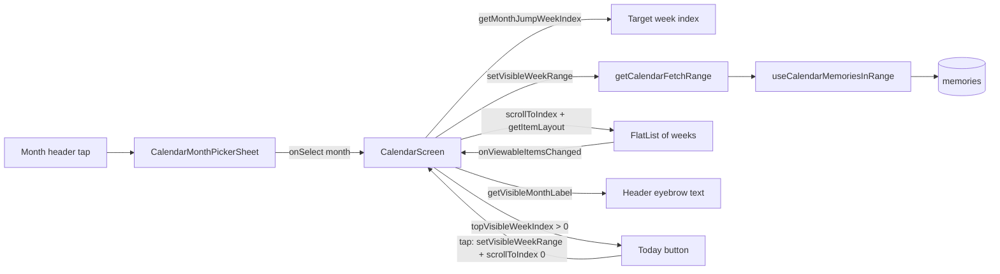

# Calendar ribbon

Windowed, day-per-row vertical timeline of memories, scrolling backward from today, with a month/year picker to jump directly to any covered month.

**Status:** `done`
**Last updated:** 2026-07-16 (month-jump landing: pixel-anchored settle-and-correct)
**PRD reference:** [PRD §6 Journal & Calendar](../PRD.md)

## Overview

The Calendar tab renders one row per calendar day, newest (today) at the top, grouped into Monday-start week blocks that scroll backward in time indefinitely (bounded by the family's oldest memory). Days with a memory show a stamp (illustration, photo/video thumbnail, or a text-quote placeholder); days without one show an empty slot. Memory data is fetched in a sliding window around the currently visible rows rather than all at once.

A fixed header bar pinned above the list shows the currently visible month (which doubles as the trigger for a bottom-sheet month/year picker) and, when scrolled into history, a Today shortcut. Picking a month scrolls the ribbon directly to that month's rows instead of requiring the user to keep scrolling day-by-day — useful once a family has months of history.

## User-facing behavior

- Each day is a row: weekday + day number, a memory stamp or empty slot, a one-line caption/media label, and an emotion chip when the memory was analyzed.
- Today's row is highlighted; an empty today row invites "+ capture today" (hidden for viewers, who can't create memories).
- Weeks are labeled "this week", "last week", "N weeks ago", with an absolute date range. A month divider appears where a week's most recent day crosses into an older month than the row above it. **Divider year rule:** dividers for months in the current year are bare month names ("May"); once a divider crosses into a different year it includes the year ("July 2024") so deep history is never ambiguous (`formatMonthBreakLabel` in `src/utils/calendar.ts`).
- Pull-to-refresh refetches both the oldest-memory-date bound and the currently visible window.
- **Month-jump trigger:** the header eyebrow text is a button (`accessibilityLabel="Jump to month"`) with a chevron affordance and a generous hit slop. Tapping it opens a bottom sheet listing every month from the current month back to the month of the family's oldest memory, grouped by year, newest first. The current month is visually marked.
  - **No memories yet:** the picker has nothing to offer beyond the current month, so the trigger is disabled (`accessibilityState.disabled`) rather than opening an empty-feeling sheet.
- Picking a month closes the sheet and scrolls the ribbon so the chosen month's **newest** week lands at the top of the viewport — the row where that month's divider renders — putting the entire selected month below it. (In this reverse-chronological ribbon the week containing the 1st is the month's *oldest* week; landing there would strand the user at the month's tail with the previous month's rows beneath.) Selecting the current month scrolls back to the top (index 0). Scrolling continues to work normally in both directions after the jump; the fetch window keeps extending as the user scrolls.
- After the jump's scroll settles, a bounded settle-and-correct pass measures the target row's true on-screen position and snaps to it with up to two non-animated corrective scrolls (see Architecture) — the jump lands with the month divider at the very top of the list viewport, pixel-exact, on near and far jumps alike. A manual drag cancels any pending correction.
- **Fixed header bar:** the eyebrow month label and the Today button live in a compact bar that is rendered *outside* the FlatList (a sibling above it, SafeArea-respecting, `testID="calendar-fixed-header"`), so they stay pinned at the top of the screen no matter how deep the user scrolls. The large "Backwards." title and subtitle remain inside the list's `ListHeaderComponent` and scroll away normally — the fixed bar is the persistent "where am I / take me elsewhere / take me home" strip.
- **Header eyebrow tracks the visible month:** rather than always showing today's month, the eyebrow text reflects whichever week is currently topmost in the viewport, so the header keeps answering "where am I" while scrolling back through history. It *always* includes the year ("June 2026") — unlike inline dividers, it never drops it. It remains the month-jump trigger exactly as above — tapping it still opens the picker regardless of which month it's currently displaying.
- **Contextual "Today" button:** a small text button (`accessibilityLabel="Back to today"`) appears at the right end of the fixed header bar once the topmost visible week has scrolled away from "this week" (week index > 0). Tapping it scrolls the ribbon back to the exact top via `scrollToOffset(0)` — the content top by definition, no height model involved, so it cannot drift and needs no correction pass — and resets the visible-week window the same way a month jump does, so the fetch range for the current week loads immediately rather than waiting on the scroll to settle. The button disappears again once back at the top. Uses a lightweight `react-native-reanimated` `FadeIn` on appearance (the same pattern already used by `FloatingTabBar`) — no new animation dependency.

## Architecture



`buildCalendarWeeks` (in `src/utils/calendar.ts`) is a pure function of `{ referenceDate, oldestMemoryDate, minimumWeeks }` that eagerly builds the **entire** array of week rows from today back to the oldest memory's week (or a 4-week minimum with no memories). This means the FlatList's `data` already contains every week a month-jump could target — jumping never needs to extend `weeks` itself, only to (a) move the FlatList's scroll position and (b) update which date range is being *fetched* for.

Memory content is fetched separately and only for a window around the currently visible weeks (`getCalendarFetchRange`, buffered `CALENDAR_FETCH_BUFFER_WEEKS = 4` weeks either side). `useCalendarMemoriesInRange` re-queries whenever that range changes. Jumping to a month calls `setVisibleWeekRange` directly (not just relying on `onViewableItemsChanged`, which only fires after the scroll settles) so the range fetch for the target month starts immediately, in parallel with the scroll animation.

**Jump target rule.** `getMonthJumpWeekIndex(referenceDate, year, month)` returns the index of the target month's **newest** week — the first week in list order whose newest day falls inside that month (the same "a week belongs to the month of its newest day" rule that places the month-break dividers, so the jump lands exactly on the divider row). The current month resolves to index `0` (special-cased: week 0's newest day is *today*, not its Sunday). Internally it's computed as one week older than the week containing the 1st of the *following* month. Because a month's newest week is never older than the week of any date in that month, every month offered by `getCalendarMonthOptions` resolves inside the built `weeks` array — the screen keeps a `Math.min(…, lastWeekIndex)` clamp purely as defense.

**Height model: estimates + measured feedback.** `getItemLayout` offsets live in content coordinates, which **include the `ListHeaderComponent`** — the screen measures the in-list header via `onLayout` and passes its height to `buildCalendarWeekOffsets` (initial estimate `ESTIMATED_LIST_HEADER_HEIGHT = 105`). Per-week heights start as static estimates (`getCalendarWeekItemHeight`); the estimates cannot be exact because day rows **with** a memory (~72px: 56px stamp + padding) are taller than empty pill rows (~58px), and memory presence for unfetched weeks is unknowable. React Native **skips its own cell measurement whenever `getItemLayout` is provided** (`shouldListenForLayout` in VirtualizedList), so the screen measures each rendered week row itself via `onLayout` (`handleWeekLayout`, throttled to one offsets rebuild per frame) and feeds the real heights back through the `measuredHeights` map into `getCalendarWeekHeight`/`buildCalendarWeekOffsets`/`getCalendarItemLayout`. This makes offsets — and therefore viewability indices — precise for every week that has rendered at least once. (`styles.week` uses `paddingBottom` rather than `marginBottom` so `onLayout` measures the full row.)

**Post-jump settle-and-correct (pixel-anchored).** A jump can land off target — including by a *constant sub-row* amount — because `scrollToIndex` trusts the model's offsets, and RN replays that model for every subsequent `scrollToIndex` too (it never self-measures cells while `getItemLayout` is provided). Index-level checks can't even see a sub-row error: landing 130px into the target week still reports the target as the top visible index. The correction therefore works in **pixels**: after each month jump the screen arms a pending correction (`startCalendarJumpCorrection(targetIndex, estimatedOffset)`); when the scroll settles — `onMomentumScrollEnd`, or a bounded `JUMP_SETTLE_TIMEOUT_MS = 700` timeout for scrolls that emit no momentum events — the target row has rendered, so its TRUE position in content coordinates is measured (`measureCalendarWeekOffset`: `measureLayout` against the ScrollView's inner content view **ref** from `getScrollResponder().getInnerViewRef()` — Fabric rejects numeric node handles like `getInnerViewNode()`'s with "ref.measureLayout must be called with a ref to a native component", and `isMeasurableHostRef` guards that shape from ever reaching `measureLayout`) and `resolveCalendarJumpCorrection` (pure, unit-tested) decides: measured within `JUMP_OFFSET_TOLERANCE_PX = 2` of the last commanded offset → landed, done; measured differs → one non-animated `scrollToOffset` to the *measured* position (pixel-exact by construction); row not rendered/measurable (landing far off) → non-animated estimated `scrollToIndex` retry so the row renders, then re-measure. Hard bound: `MAX_JUMP_CORRECTION_PASSES = 2` corrective scrolls per jump. `onScrollBeginDrag` cancels the whole thing — a user drag always wins. The Today button doesn't participate: `scrollToOffset(0)` is exact by definition.

Note: `getItemLayout` is deliberately **kept** (rather than letting RN measure cells itself) — without it, VirtualizedList clamps the tail spacer to the highest *measured* cell, so a single far scroll physically cannot reach 100+ weeks deep in one hop. The estimates get the jump close in one hop; measured geometry does the final positioning.

**The month label + Today button render in a fixed bar, not in the list.** `CalendarScreen`'s JSX is a column: a `SafeAreaView` (`edges={['top']}`, `testID="calendar-fixed-header"`) holding the eyebrow trigger and Today button, then the `FlatList` filling the rest. The list's `ListHeaderComponent` only contains the scrolling large title, subtitle, and `PendingMemoryUploadsBanner`. This is a deliberate design decision — putting the bar in `ListHeaderComponent` would let it scroll away, stranding the user deep in history with no label and no way home.

**Visible-month tracking and the Today button both reuse `onViewableItemsChanged`** — the same viewability signal that already drives `setVisibleWeekRange` for the fetch-range window (`viewabilityConfig = { itemVisiblePercentThreshold: 15 }`); no second `viewabilityConfig` was added. The screen derives a single `topVisibleWeekIndex` from `visibleWeekRange.startIndex`/`endIndex` (`Math.max(0, Math.min(startIndex, endIndex))`) and both header behaviors key off that one number:

- `visibleMonthLabel = useMemo(() => getVisibleMonthLabel(weeks, { startIndex: topVisibleWeekIndex, endIndex: topVisibleWeekIndex }), [weeks, topVisibleWeekIndex])` — `getVisibleMonthLabel` (in `src/utils/calendar.ts`) reads the topmost visible week's *newest* day, the same "a week belongs to the month of its newest day" rule `buildCalendarWeeks` already uses to place month-break dividers, so the header eyebrow and a visible month-break divider never disagree. Memoizing on `topVisibleWeekIndex` alone (not the whole range) is the flicker guard: scrolling that extends the *bottom* of the visible range without moving the *top* row doesn't recompute or re-render the label.
- `showTodayButton = topVisibleWeekIndex > TODAY_BUTTON_VISIBLE_THRESHOLD` (threshold `0`) — visible once the top of the viewport has moved past "this week" (index 0). Tapping it (`handleScrollToToday`) mirrors `handleSelectMonth`'s jump exactly: `setVisibleWeekRange({ startIndex: 0, endIndex: Math.min(3, lastWeekIndex) })` first (so the fetch range for the current week starts immediately) and then `flatListRef.current?.scrollToIndex({ animated: true, index: 0, viewPosition: 0 })` inside a `requestAnimationFrame`.

## Data model

| Table | Role in this feature |
|-------|-----------------------|
| `memories` | Source of the day stamps; queried by `memory_date` range via `fetchMemoriesInDateRange` / `fetchOldestMemoryDate` (`src/services/memories.ts`) |

No new tables, columns, or storage. The calendar is a read-oriented view over the same `memories` rows the Timeline tab uses.

## Client integration

| Layer | Files | Responsibility |
|-------|-------|-----------------|
| Route | `app/(app)/(tabs)/calendar.tsx` | Screen: week `FlatList`, header trigger + visible-month label, Today button, scroll-jump wiring |
| Hooks | `src/hooks/useCalendarMemories.ts` (`useCalendarMemoriesInRange`, `useOldestMemoryDate`) | Windowed range fetch + oldest-memory-date bound |
| Components | `src/components/calendar-month-picker-sheet.tsx` (`CalendarMonthPickerSheet`) | Month/year picker bottom sheet |
| Utils | `src/utils/calendar.ts` | Pure week-building, fetch-range, month-options, and jump-index math (all unit-tested, no React) |
| Services | `src/services/memories.ts` (`fetchMemoriesInDateRange`, `fetchOldestMemoryDate`) | Supabase queries |

### How to invoke from another feature

1. To link into a specific date from elsewhere in the app, navigate to the Calendar tab; there is no deep-link-to-date route today (out of scope — see Constraints).
2. To reuse the month-jump math elsewhere (e.g. a future "jump to date" feature), import `getCalendarMonthOptions` / `getMonthJumpWeekIndex` / `getCalendarWeekItemHeight` / `getCalendarWeekHeight` / `buildCalendarWeekOffsets` / `getCalendarItemLayout` / `getVisibleMonthLabel` / `formatMonthBreakLabel` / `startCalendarJumpCorrection` / `resolveCalendarJumpCorrection` from `src/utils/calendar.ts` — they take plain dates/arrays/maps, no hook or component dependency.

## Extension guide

**Safe to extend**

- Add new stamp types to `MemoryStamp` in `calendar.tsx` (mirrors `memory_type`/media-kind branching already there).
- Add new picker entry points by reusing `getMonthJumpWeekIndex(referenceDate, year, month)` for the target week index and the `handleSelectMonth` shape: `setVisibleWeekRange` (reset the fetch window) → `armJumpCorrection(targetIndex, estimatedOffset)` (pixel-anchored settle-and-correct) → `scrollToIndex`. Jumps to the exact top should instead follow `handleScrollToToday`: `scrollToOffset(0)` with no correction pass.
- Adjust the Today button's visibility threshold (`TODAY_BUTTON_VISIBLE_THRESHOLD` in `calendar.tsx`, currently `0`) if product wants it to appear later, e.g. only once fully off "last week" too (`> 1`).

**Do not change without updating this doc**

- The row-height constants in `src/utils/calendar.ts` (`DAY_ROW_HEIGHT`, `DAY_ROW_GAP`, `WEEK_LABEL_ROW_HEIGHT`, `MONTH_BREAK_HEIGHT`, `WEEK_BOTTOM_PADDING`) back the *initial* `getItemLayout` estimates; measured `onLayout` heights override them per rendered week. If `calendar.tsx`'s week/day row styles change materially, update these constants together. Keep `styles.week`'s bottom spacing as **padding**, not margin — `onLayout` heights must include it.
- `getMonthJumpWeekIndex`'s "newest week of the month" rule — it must keep matching `buildCalendarWeeks`'s month-break placement (jump lands on the divider row) and must keep the current-month → index 0 special case.
- `buildCalendarWeeks`'s "eagerly build every week up front" behavior. Month-jump's index math (`getMonthJumpWeekIndex`) assumes any month offered by `getCalendarMonthOptions` already has a corresponding row in `weeks` (clamped defensively regardless — see below).
- `getVisibleMonthLabel`'s "newest day of the topmost visible week" rule — it must keep matching `buildCalendarWeeks`'s month-break placement rule, or the header eyebrow and a visible month divider could disagree about which month a week belongs to.
- `formatMonthBreakLabel`'s year rule (bare month within the reference year, month + year otherwise) and the header's always-with-year format — the header is the persistent anchor, dividers are contextual.
- The fixed-header-outside-the-FlatList structure. Moving the eyebrow/Today bar back into `ListHeaderComponent` would reintroduce the "scrolled deep into history with no header" bug (`calendar.month-jump.test.tsx` guards this structurally).
- Do not add a second `viewabilityConfig`/`onViewableItemsChanged` for the header label or Today button; both derive from the single `visibleWeekRange` state that the existing windowed-fetch tracking already maintains.

**Common extension patterns**

- New calendar-level filter (e.g. by family member) → thread a filter param through `fetchMemoriesInDateRange` and the range-fetch hook; the week-building/jump math is unaffected since it only depends on dates.

## Constraints & gotchas

- **Row heights for unrendered weeks are estimates.** Day rows with a memory (~72px) are taller than empty rows (~58px), and memory presence outside the fetched window is unknown — so the initial hop of a long jump can land off. Three mechanisms compensate: measured week heights feed back into `getItemLayout` (RN won't measure cells itself when `getItemLayout` is provided), the pixel-anchored settle-and-correct pass fixes the final landing (max 2 passes, drag cancels), and `onScrollToIndexFailed` remains as a last-resort fallback.
- **Jump target is always in-bounds.** `getMonthJumpWeekIndex` targets the month's *newest* week, which is never older than the week of any date in that month — so every picker option lands inside the built weeks even when the oldest memory falls mid-month. The screen's `Math.min(…, lastWeekIndex)` clamp is purely defensive.
- **Only measured geometry can finalize a landing.** Index-based corrective scrolls are a no-op by construction (RN re-reads the same `getItemLayout` model), and index-level comparisons can't see sub-row errors. The final positioning must come from `measureCalendarWeekOffset` + `scrollToOffset` — don't "simplify" it back to a `scrollToIndex`.
- **`measureCalendarWeekOffset` requires a host ref, and degrades gracefully.** Under Fabric, `measureLayout`'s relativeTo must be a host-component **ref** (`getInnerViewRef()`), never a numeric node handle (`getInnerViewNode()`/`findNodeHandle()`) — `isMeasurableHostRef` blocks handle shapes so the console warning can't recur. If the ref or `measureLayout` is unavailable it reports `null` and the pass falls back to an estimated `scrollToIndex` retry, bounded as usual. (Don't switch to reading the week row's own `onLayout` y instead: the row is a child of VirtualizedList's cell wrapper, so its y is cell-relative ~0, not content-relative.)
- **No deep link to an arbitrary date.** The picker is month-granularity only (matches the PRD's calendar scope); jumping to a specific day within a month still requires scrolling from the landed week.
- **`referenceDateRef`** captures "today" once, at mount — the header's month label, the Today button's target row (index 0), and the picker's "current month" option do not update if the app is left open across a real midnight rollover (existing behavior, unrelated to month-jump).
- **Header label granularity matches the picker.** `getVisibleMonthLabel` reports month/year only (no day), so scrolling within a single month doesn't change the header text — only crossing into a week whose newest day is in a different month does.
- **Today button threshold is index-based, not pixel/time-based.** `topVisibleWeekIndex > 0` fires as soon as the topmost *visible* row (per the existing 15%-visibility viewability config) is no longer week 0, even if "this week" is still partially on-screen below the fold.
- Viewers see the same calendar and picker as managers; only the memory-capture FAB is role-gated (`canEditFamilyContent`). The Today button and header label are visible to all roles.

## Dependencies

- Depends on: [memories.md](./memories.md) (memory rows, `memory_date`, illustration/media status)
- Used by: nothing yet — first feature doc for the calendar surface.

## Testing

### Unit tests

| File | Covers |
|------|--------|
| `src/utils/calendar.test.ts` | `buildCalendarWeeks` (incl. bare-month current-year dividers and year-qualified dividers across a year boundary), `getCalendarFetchRange`, `getCalendarMonthOptions` (bounds, year-boundary spanning, no-memories case), `getMonthJumpWeekIndex` (current month → 0 incl. month-end edge, past month → its newest/divider week, straddling weeks skipped, every picker option lands in-bounds with the landed week semantically in the chosen month), `getCalendarWeekItemHeight` / `getCalendarWeekHeight` / `buildCalendarWeekOffsets` / `getCalendarItemLayout` (`getItemLayout` shape, header-inclusive offsets, measured-height overrides), `startCalendarJumpCorrection` / `resolveCalendarJumpCorrection` (pixel semantics: corrects to the measured offset, tolerance-confirmed landing, retry-by-index when unmeasurable, bounded passes, null pending) / `measureCalendarWeekOffset` + `isMeasurableHostRef` (measured y, Fabric regression: node handles never reach `measureLayout`, graceful nulls, native failure), `formatMonthBreakLabel` (bare month within reference year, month + year outside it), `getVisibleMonthLabel` (labels the topmost visible week's month, always includes the year, derives from only the topmost index so it ignores how far the range extends below it, defensive on reversed/out-of-range input, empty-weeks case) |
| `src/components/calendar-month-picker-sheet.test.tsx` | Year grouping, option rendering, `onSelect`/`onClose` wiring, single-month/no-visible-content cases |

### Integration tests

| File | Scenarios |
|------|-----------|
| `src/hooks/useCalendarMemories.integration.test.tsx` | `useOldestMemoryDate` and `useCalendarMemoriesInRange` query wiring |

### Screen tests

| File | Scenarios |
|------|-----------|
| `src/screen-tests/calendar.role-gating.test.tsx` | FAB visibility by role |
| `src/screen-tests/calendar.month-jump.test.tsx` | Trigger disabled with no memories; picker options bounded by current↔oldest month; selecting a month scrolls to its newest (divider) week and widens the fetch window to cover it; in-bounds landing when the oldest memory falls mid-month; pixel-anchored settle-and-correct (mocked measured offsets differing from the estimate → final `scrollToOffset` uses the MEASURED position, unrendered target → estimated index retry then measured snap, hard bound of 2 corrective scrolls, manual drag cancels); month label + Today button render inside the fixed header bar and NOT inside the FlatList (structural guard against the bar scrolling away); header eyebrow shows/hides the Today button and tracks the topmost visible week's month as `onViewableItemsChanged` fires (including a no-flicker case when only the bottom of the range shifts); tapping Today calls `scrollToOffset(0)` (no correction armed) and resets the fetch window; month-jump trigger keeps working once the Today button is present |

### Run this feature's tests

```bash
npm test -- --testPathPattern=calendar
```

## Changelog

| Date | Change |
|------|--------|
| 2026-07-16 | Fabric fix: `measureCalendarWeekOffset` now measures against the ScrollView's inner content view REF (`getInnerViewRef()`) — the previously used `getInnerViewNode()` returns a numeric node handle, which Fabric rejects ("ref.measureLayout must be called with a ref to a native component"), silently degrading every correction to the estimated retry. `isMeasurableHostRef` guards handle shapes from ever reaching `measureLayout`. |
| 2026-07-16 | Pixel-exact landings: the settle-and-correct pass now measures the target row's TRUE content position (`measureCalendarWeekOffset` via `measureLayout`) and snaps with `scrollToOffset` — index-based corrective scrolls replay the same `getItemLayout` model error and index comparisons can't see sub-row offsets. Resolver reworked to offset semantics (`lastCommandedOffset`, `JUMP_OFFSET_TOLERANCE_PX`, retry-by-index for unrendered targets). `getItemLayout` deliberately kept so far jumps reach anywhere in one hop. |
| 2026-07-16 | Month-jump landing fixes: (1) `getMonthJumpWeekIndex` now targets the chosen month's *newest* week (the divider row) instead of the week containing the 1st, current month → index 0; (2) `getItemLayout` offsets now include the measured list-header height and fold real per-week `onLayout` measurements back into the model (RN skips cell measurement when `getItemLayout` is set); (3) added a bounded post-jump settle-and-correct pass (`resolveCalendarJumpCorrection`, max 2 non-animated corrective scrolls, drag cancels); (4) Today now uses drift-proof `scrollToOffset(0)`; `styles.week` bottom spacing switched from margin to padding so measurements include it. |
| 2026-07-16 | Android device-testing fixes: (1) moved the month-label + Today bar out of `ListHeaderComponent` into a fixed SafeArea bar above the FlatList so it can never scroll away (the large title still scrolls); (2) month-break dividers now use `formatMonthBreakLabel` — bare month name within the current year, month + year ("July 2024") for older years; the header eyebrow keeps always showing the year. |
| 2026-07-16 | Header eyebrow now tracks the topmost visible week's month (`getVisibleMonthLabel`) instead of statically showing today's month, reusing the existing `onViewableItemsChanged`/`visibleWeekRange` signal — no second viewability config. Added a contextual "Today" button (header-right, `react-native-reanimated` `FadeIn`) that appears once scrolled past week 0 and jumps back to today via the same `setVisibleWeekRange` + `scrollToIndex` pattern as the month picker. |
| 2026-07-16 | Added month/year jump picker (`CalendarMonthPickerSheet`), jump-index math, and `getItemLayout` support for `scrollToIndex`. First feature doc for the calendar surface — also documents the pre-existing windowed ribbon behavior. |
