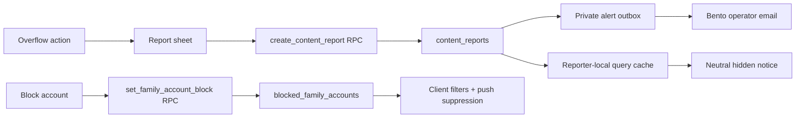

# Feature: Content reporting and family-scoped account blocking

**Status:** `done`
**Last updated:** 2026-07-17
**PRD reference:** [Safety and privacy](../PRD.md)

## Overview

Every active household member can privately report memories, AI memory illustrations, comments, household accounts, family profiles, and generated portrait versions. Reporting and blocking are separate: a report creates an operator-review record and hides only that exact target for the reporter; **Block account** hides that account's authored memories, comments, and activity alerts inside the current family.

The controls live in existing overflow/action sheets so the journal remains visually quiet. There are no persistent flag icons.

## User-facing behavior

- A report reason is required; the optional note is limited to 500 characters.
- AI visuals additionally offer **Misleading AI depiction**.
- A successful report immediately replaces only the reported target with a neutral notice and **Show anyway**. The reveal lasts for the current signed-in session and is tied to that specific report row.
- A memory report hides the whole memory. An illustration report hides only that generated illustration. Regenerating creates a new generation, so a report for generation A does not hide generation B.
- A profile report hides the read-only profile presentation. A portrait report hides only that portrait version; the portrait history remains reachable.
- A comment report hides only its body. Blocking its author also neutralizes the author and suppresses the authored comment.
- **Block account** is explicitly labelled and family-scoped. It does not delete content, remove membership, notify the blocked account, or apply in another family.
- Loading and report/block lookup failures fail closed. Target media keys are not presigned while the safety state is unknown or hidden.
- Editor/tag-picker selection surfaces are intentionally outside reporter-local display filtering: they are authoring controls, not read-only publication surfaces. Read-only timeline, calendar, detail, profile, avatar, comments, and member surfaces are filtered.

## Architecture

The client never inserts a report or block directly. Security-definer RPCs resolve the target's family from the target row, require the caller's exact active family membership, and reject unavailable/stale targets. The reporter state RPC exposes a narrow projection without notes, operator fields, or protected account attribution.

## Data model

| Table / column | Role |
|---|---|
| `content_reports` | Operator-only queue. Stores target identifiers, selected illustration generation, reason, optional note, workflow status, and protected account attribution. It never snapshots journal text, names, URLs, keys, or image bytes. |
| `content_report_email_alerts` | Operator-only durable outbox. It stores only report id, delivery state, attempt token/count, and timestamps; it never stores a report snapshot or message body. |
| `blocked_family_accounts` | Reporter-owned, family-scoped account hides. Membership removal does not erase the block; it can still be removed by block id. |
| `memories.illustration_generation_id` | Immutable logical identity for the exact currently referenced generated illustration. |
| `memories.illustration_generation_attempt_id` | Short-lived ownership token that prevents stale/concurrent generation attempts from publishing or changing newer status. |

`content_reports.target_user_id` is operator-only. It preserves actionable account attribution if the target row is deleted, and becomes null if the auth account is hard-deleted. `target_version_id` is required only for `memory_illustration`.

Direct authenticated access to `content_reports` is revoked. `blocked_family_accounts` permits only blocker-local reads; all writes go through the RPC.

## API & Edge Functions

| Function | Input | Output | Auth |
|---|---|---|---|
| `create_content_report` | target type/id, selected version id, reason, optional note | report UUID | Authenticated active member of target family |
| `get_my_open_content_reports` | family UUID | Narrow active-report rows | Same reporter and active family membership |
| `set_family_account_block` | block + membership id, or unblock + block id | Block row | Authenticated active member of target family |
| `notify-family-activity` | memory UUID | Generic success/debounce result | Memory author and family manager+ |
| `notify-memory-engagement` | event payload | Generic sent/disabled result | Existing engagement authorization |
| `send-content-report-alert` | report UUID only | Generic sent/skip result | `CRON_SECRET`; pg_net trigger only |

The selected illustration generation is sent by the client and checked against the current database generation. A regeneration between selection and submission fails generically; the server never substitutes the newer generation.

Activity pushes exclude recipients who blocked the actor. The caller never receives recipient counts or other block-dependent delivery signals. Engagement notification suppression uses the same generic disabled result as missing tokens/preferences.

## Client integration

| Layer | Files | Responsibility |
|---|---|---|
| Routes | `app/(app)/(tabs)/timeline.tsx`, `calendar.tsx`, `family.tsx`, `app/(app)/memory/[id]/index.tsx`, `family/[id]/index.tsx`, `sharing/members.tsx` | Minimal action entry points and reporter-local filtering |
| Hook | `src/hooks/useContentSafety.ts` | Account/family-scoped queries, row-identity session reveals, mutations |
| Service | `src/services/content-safety.ts` | Narrow RPC/table contracts and safe error mapping |
| Components | `content-action-sheet.tsx`, `report-sheet.tsx`, `content-hidden-notice.tsx` | Shared accessible report UI |
| Existing components | `memory-card.tsx`, `memory-comments-drawer.tsx`, `portrait-timeline.tsx`, `family-member-avatar.tsx` | Exact-target display filtering |

### How to add a report entry point

1. Freeze the complete target snapshot when the action is tapped. For a generated memory illustration this includes `illustration_generation_id`; for a portrait use the concrete portrait-version id.
2. Omit the action when `hasActiveReport(...)` is true. `isTargetReported(...)` is display state and becomes false after **Show anyway**.
3. Submit through `contentSafety.report` and pass the same frozen identifiers.
4. Gate media URL lookup to `null` while safety is loading/error or while the exact target is hidden.
5. Add focused integration and Maestro coverage.

## Extension guide

**Safe to extend**

- Add a new reason after updating the SQL constraint, report sheet, store declarations, operator runbook, and tests.
- Add a new display surface by reusing `useContentSafety` and `ContentHiddenNotice`.

**Do not change without updating this doc**

- Do not expose `note`, `target_user_id`, resolution fields, or other reporters' rows to the app.
- Do not key reveals only by target/user; a newly filed report or new block row must hide again.
- Do not overwrite a stable R2 illustration key. Generate immutable bytes, CAS the DB pointer, then delete the old object best-effort.
- Do not turn a report into family-wide deletion or global account blocking.

## Constraints & gotchas

- Rate limit: 10 reports per reporter per rolling hour, serialized with an advisory transaction lock.
- Only one active non-illustration report per reporter/target and one active report per reporter/illustration generation.
- Regenerated/deleted image bytes are not retained solely for moderation. Reports retain the generation UUID and metadata; an unavailable image is treated as already removed. This limits operator inspection but avoids retaining child imagery unnecessarily.
- A generation-specific R2 key is written first. The checked attempt-token DB swap is authoritative. Failed/superseded swaps delete only the new object and preserve the old pointer/object.
- The R2 path owner segment may be the manager who regenerated the image; target identity comes from the memory row and generation UUID, never from parsing that owner segment.
- Profile `target_user_id` identifies its creator. Portrait attribution prefers the exact version uploader and falls back to the profile creator for migrated versions; it never identifies the depicted child.
- Blocks suppress future activity and engagement alerts; already delivered OS notifications cannot be recalled.

## Operations

Follow [content-reporting-operations.md](../content-reporting-operations.md). Review the private queue at least daily; child-safety threats receive immediate priority. Public copy deliberately promises no fixed resolution SLA.

Every new report also queues a generic Bento transactional alert to
`hello@usemomora.com` (or the safe `CONTENT_REPORT_ALERT_EMAIL` override). It
contains only the report UUID, target type, reason, and timestamp. It is a
best-effort prompt—not a replacement for daily review—and it never contains a
note, names, journal content, account/family/target identifiers, or media. A
five-minute bounded pg_cron redrive handles only definitely rejected sends
(maximum five automatic attempts with increasing delays); ambiguous sends stay
claimed for manual Bento reconciliation to prevent duplicate alerts.

## Testing

| File | Covers |
|---|---|
| `src/services/content-safety.integration.test.ts` | Narrow reporter projection, validated version submission, block RPCs |
| `src/hooks/useContentSafety.integration.test.tsx` | Account isolation, row-identity reveals, generation isolation, optimistic cache |
| `src/components/report-sheet.test.tsx` | Reasons, note limits, keyboard/accessibility behavior |
| `supabase/functions/generate-illustration/index.test.ts` | Immutable publish ordering, failed/superseded cleanup |
| `supabase/functions/notify-family-activity/index.test.ts` | Block suppression without response leakage |
| `supabase/functions/notify-memory-engagement/index.test.ts` | Block suppression with generic disabled response |
| `supabase/functions/send-content-report-alert/index.test.ts` | Cron auth, UUID payload, metadata-only Bento body, outbox claim/dedupe, failure/retry behavior |
| `supabase/tests/content_reporting.sql` | Exact generations, durable attribution/deletion, reporter projection, block lifecycle |
| `supabase/tests/content_reporting_security.sql` | Cross-tenant denial, validation/rate limits, attribution, input-attempt invalidation, cascades |
| `supabase/tests/content_reporting_email_alerts.sql` | Durable trigger outbox, service-only claim, atomic delivery claim, release/retry, completion |
| `.maestro/flows/reporting/report-ai-illustration.yaml` | Ready AI illustration report, local hide, and Show anyway happy path |

Run focused client tests with `npm test -- --runInBand content-safety useContentSafety report-sheet`, database tests with `supabase test db supabase/tests/content_reporting.sql supabase/tests/content_reporting_security.sql supabase/tests/content_reporting_email_alerts.sql`, and Edge tests with `npm run test:edge`. The advisory-lock concurrency cap is code-reviewed; pgTAP does not attempt a truly parallel transaction race.

## Changelog

| Date | Change |
|---|---|
| 2026-07-16 | Initial reporting, family-scoped blocking, exact-generation visual reports, and notification suppression |
| 2026-07-17 | Added durable metadata-only Bento email alerts for the private operator queue. |
