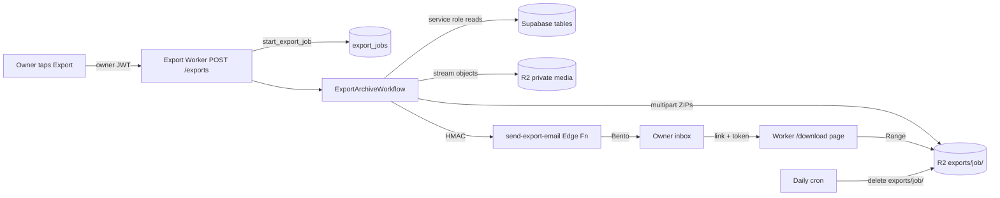

# Feature: Data export

**Status:** `done`
**Last updated:** 2026-09-26
**PRD reference:** [PRD §6.9](../PRD.md#69-paid-access-and-data-export)

## Overview

Owners can export their whole family archive: every memory's words, photos,
videos, voice recordings and illustrations, plus everyone's photos and
portrait history. An archive can be gigabytes, so it is **built in the
background and emailed as a download link** rather than pushed onto the
phone. Export stays available forever, including after a subscription lapses,
so paid access never holds the family archive hostage.

## User-facing behavior

- Settings shows **Export your memories** ("We'll email you a download link")
  to family owners only.
- Tapping it shows "Preparing your archive — we'll email a download link to
  <email> when it's ready". Tapping again while one is building says it's
  already on its way (no second build). More than 3 exports in 24 hours is
  refused with "please try again tomorrow".
- The email ("Your Momora archive is ready") links to a download page listing
  the files and sizes. The link works for **7 days**, then the files are
  deleted; the owner can always export again.
- If the build fails, the owner gets "We couldn't prepare your Momora
  archive" instead, and can retry from Settings.
- Downloads are resumable (Range requests), so a dropped connection doesn't
  restart a multi-gigabyte file.

### What's in the archive

One ZIP for **Family & portraits**, then one per **year** (a year bigger than
~1.8 GB splits into "(part 1 of 2)"…). All of a family's ZIPs share one top
folder, so unzipping them side by side merges into one tree:

```
Momora - Los Yi/
  README.txt                       what's here and how to unzip it
  manifest.json                    everything below as structured data
  Family/Enzo/profile-photo.jpg
  Family/Enzo/portrait.webp
  Family/Enzo/Portraits over time/2025-06-01 photo.jpg, 2025-06-01 portrait.webp
  2026/2026-09-09 - Enzo le puso el parche en el ojo a Mara, con/
    memory.txt                     date, who added it, who's in it, feeling,
                                   the words, voice transcript, links, comments
    photo-1.jpg, video-2.mp4       originals, in their original order
    voice.m4a                      audio memories
    illustration.webp              AI illustration, if any
```

Media are the original uploaded files (no previews, share cards or discarded
portrait attempts). Files get their memory's date as their modified time.
Generated separators are ASCII hyphens: accented characters from memory text
are UTF-8-flagged and extract correctly with macOS Archive Utility, Windows
10+, 7-Zip and libarchive, but ancient unzip tools can mangle them.

## Architecture



1. `POST /exports` authenticates the JWT, checks family ownership and that the
   account has an email, calls `start_export_job` (dedupes an in-flight job,
   rate limits), then starts the Workflow with the job id as instance id.
2. **plan** step reads the owner's families, members, memories, tags, media,
   comments and portrait versions, lays them out (`src/plan.ts` +
   `src/layout.ts`, pure and unit-tested) and saves `plan.json` to R2.
3. **archive i of n** — one step per group. `src/builder.ts` streams each R2
   object through `ZipWriter` into an R2 multipart upload, starting a new part
   archive when the next object would pass 1.8 GiB. An object that vanished
   since planning is listed in `manifest.json` → `missingFiles`, not fatal.
   The Family & portraits group runs last so its README/manifest know every
   other archive and every missing file.
4. **publish** sets the job `ready` with the archive list, a fresh token's
   SHA-256 and `expires_at = now + 7 days`, then asks `send-export-email` to
   email the link.
5. The daily cron deletes `exports/<job>/` for expired and failed jobs.

## Data model

| Table / bucket | Role in this feature |
|----------------|----------------------|
| `export_jobs` | Job lifecycle `queued → building → ready → expired` (or `failed`), `archives`, `total_bytes`, `download_token_hash`, timestamps, `failure_code`, `files_deleted_at` |
| `families`, `family_members`, `memories`, `memory_family_members`, `memory_media`, `memory_comments`, `family_member_portrait_versions`, `user_profiles` | Read (service role) to build the archive |
| R2 `momora-prod` → `exports/<job id>/` | `work/plan.json`, `work/group-<i>.json`, `archives/<group>-<part>.zip` |

`export_jobs` has owner-only select RLS; only the Worker's service role writes
it. `start_export_job` and `expire_export_jobs` are service-role only.

## API & Edge Functions

| Function / endpoint | Input | Output | Auth |
|---------------------|-------|--------|------|
| `POST /exports` (Worker) | — | `202 { jobId, status, alreadyRunning, email }`; `403 not_owner`, `409 email_required`, `429 export_rate_limited` | Owner JWT |
| `GET /download/:jobId?t=` (Worker) | token | HTML download page | Download token |
| `GET/HEAD /download/:jobId/:n?t=` (Worker) | token, optional `Range` | `application/zip`, `200`/`206` | Download token |
| `send-export-email` (Edge Fn) | `{ kind: 'ready', jobId, downloadUrl, expiresAt, archiveCount, totalBytes }` or `{ kind: 'failed', jobId }` | `200`/`202`; `409` if job state disagrees; `502` Bento rejected | HMAC (`EXPORT_EMAIL_BRIDGE_SECRET`) |
| `start_export_job` RPC | owner id, family count, max per day | `(job_id, status, already_running)` | Service role |
| `expire_export_jobs` RPC | optional timestamp | count of stuck builds failed | Service role (billing sweep) |

Contracts are in [TECH_SPEC §4.19](../TECH_SPEC.md#419-owner-data-export).

## Client integration

| Layer | Files | Responsibility |
|-------|-------|----------------|
| Routes | `app/(app)/(tabs)/settings.tsx` | Owner-only row, confirmation alert naming the email |
| Services | `src/services/export.ts` | `requestDataExport()` — JWT `POST /exports`, typed result |
| Worker | `cloudflare/momora-export-worker/src/*` | Request, Workflow, archive building, download page, cleanup |
| Edge Function | `supabase/functions/send-export-email` | Owner email lookup + Bento send |

## Extension guide

**Safe to extend**

- Add data to `memory.txt` (`renderMemoryText`) or `manifest.json`
  (`buildFamilyManifest`, bump `version` for breaking shape changes).
- Add a new kind of file: add a planned `object` entry in `buildExportPlan`,
  pick its path in `layout.ts`, extend `ExportAssetKind`, cover it in
  `test/plan.test.ts`.
- New columns in a select list must exist in production — the Worker test
  fake does not validate columns; run the local end-to-end (below).

**Do not change without updating this doc**

- Owner-only export; token-only downloads (never serve `exports/` from
  `get-media-url`); only the token hash is stored.
- 7-day link lifetime and the cleanup cron (files must be deleted before a
  job is marked expired).
- Group/split rules (per year, 1.8 GiB, 60,000 entries) and stored (not
  deflated) entries — CPU per Workflow step is capped at 5 minutes.
- R2 multipart parts must all be `PART_SIZE` except the last.

## Constraints & gotchas

- Export never checks billing access; a lapsed owner can still export.
- Never log manifest data, object keys, tokens, emails or archive contents.
- Each archive step re-reads `plan.json` from R2 because Workflow step results
  are capped at 1 MiB; keep large state in R2, not step return values.
- A retried `publish` step mints a new token (the earlier email, if any,
  holds a dead link). `send-export-email` answers `202` for an ambiguous Bento
  outcome so that case doesn't double-send.
- The download page and files require no Momora login — anyone with the link
  can download until it expires. The email says so.

## Dependencies

- Depends on: auth, family-sharing, memories, media memories, audio memories,
  likes-and-comments, portrait timeline, Cloudflare R2 + Workflows, Bento.
- Used by: Settings and the subscription/lapsed-owner trust promise.

## Testing

### Unit / integration tests

| File | Covers |
|------|--------|
| `cloudflare/momora-export-worker/test/zip.test.ts` | ZIP structure, CRCs, UTF-8 names, DOS dates |
| `cloudflare/momora-export-worker/test/builder.test.ts` | Splitting, equal multipart parts, missing objects, abort on failure |
| `cloudflare/momora-export-worker/test/layout.test.ts`, `test/plan.test.ts` | Safe names, folder/file naming, memory.txt, year grouping, dedupe |
| `cloudflare/momora-export-worker/test/index.test.ts` | `POST /exports` rules; full Workflow run → download page → Range → expiry → cleanup; failure email |
| `supabase/functions/send-export-email/index.test.ts` | HMAC, job-state check, email content, Bento outcomes |
| `supabase/tests/export_jobs.sql` | `start_export_job` dedupe/rate limit, `expire_export_jobs`, client lockout |
| `src/services/export.test.ts`, `src/screen-tests/settings.*.test.tsx` | Client request + Settings confirmation |

### Local end-to-end (recommended after changing queries)

With local Supabase running: seed an owner, family and memories, put fake
objects in local R2 (`wrangler r2 object put momora-prod/<key> --local
--persist-to <dir>`), run `wrangler dev --local --persist-to <dir>
--test-scheduled` with `--var` overrides pointing `SUPABASE_URL` at local and
`EXPORT_EMAIL_BRIDGE_URL` at a stub, `POST /exports` with the owner's JWT,
then download and `ditto -x -k` the archives. Hit `/__scheduled` to run cleanup.

### Run this feature's tests

```bash
cd cloudflare/momora-export-worker
npm run typecheck && npm test
```

## Changelog

| Date | Change |
|------|--------|
| 2026-08-01 | Owner-scoped manifest + private R2 streaming ZIP export shipped |
| 2026-08-02 | Connected the owner Settings action to the export service |
| 2026-09-26 | Rebuilt as background Workflow + emailed 7-day link; per-year archives with readable folders and memory.txt; fixed nonexistent-column queries that made every export return a ~100-byte error file |
