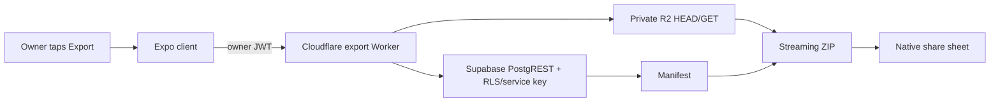

# Feature: Data export

**Status:** `done`
**Last updated:** 2026-08-02
**PRD reference:** [PRD §6.9](../PRD.md#69-paid-access-and-data-export)

## Overview

Owners can download a private ZIP archive containing their Momora profile,
owner-owned families, memories, tags, media metadata, portrait versions and
referenced private R2 assets. Export is deliberately available forever,
including after subscription lapse, so paid access never makes the family
archive hostage.

## User-facing behavior

- Settings exposes **Export your memories** only to a family owner.
- The app creates a short-lived export job, downloads the current archive, and
  opens the native share sheet with `expo-sharing`.
- Export includes structured `manifest.json` plus numbered files under
  `assets/`; the manifest maps every present asset to its family/member/memory
  context and lists missing private objects.
- Export is read-only and does not alter journal rows or subscription state.
- No export is offered when native sharing is unavailable, the user is signed
  out, the worker is unreachable, the job has expired, or the archive exceeds
  the bounded ZIP32 size limit.

## Architecture



The Worker authenticates the Supabase JWT, creates an owner-scoped one-hour
`export_jobs` row through PostgREST, then rebuilds the manifest at download
time. It verifies every referenced R2 object with `HEAD` and streams the ZIP
without creating public URLs or persisting export bytes.

## Data model

| Table / bucket | Role in this feature |
|----------------|----------------------|
| `export_jobs` | Owner-scoped short-lived job and access metadata |
| `families`, `family_members`, `memories` | Structured owner archive data |
| `memory_family_members`, `memory_media` | Tags and ordered media metadata |
| `family_member_portrait_versions` | Immutable portrait timeline metadata |
| Private R2 bucket bound as `MEDIA` | Profile photos, portraits, illustrations and media bytes |

`export_jobs` has RLS for owner reads but the Worker uses its service-role
PostgREST connection for creation and updates. The Worker independently checks
the JWT subject against the job owner and only queries families where
`owner_id` equals that subject. Family members who are not owners cannot
export another household's archive.

## API & Edge Functions

| Function / endpoint | Input | Output | Auth |
|---------------------|-------|--------|------|
| `POST /exports` | Bearer Supabase JWT | `{ jobId, downloadUrl, expiresAt }` | Owner JWT |
| `GET /exports/:jobId` | Bearer Supabase JWT | Streaming `application/zip` | Same owner JWT |
| `expire_export_jobs` | Optional timestamp | Number of expired jobs | Service role/cron |

The export Worker is `cloudflare/momora-export-worker`; it is not a Supabase
Edge Function. Its Supabase URL/service-role key and R2 binding are Worker
configuration/secrets. See [TECH_SPEC §7](../TECH_SPEC.md#7-environment-variables)
for the secret boundary.

## Client integration

| Layer | Files | Responsibility |
|-------|-------|----------------|
| Routes | `app/(app)/(tabs)/settings.tsx` | Owner-only export action and feedback |
| Services | `src/services/export.ts` | JWT request, temporary download, native share |
| Native dependencies | `expo-sharing`, `expo-file-system` | Share sheet and cache download |
| Worker | `cloudflare/momora-export-worker/src/*` | Auth, snapshot, R2 access and ZIP streaming |

### How to invoke from another feature

1. Reuse `createAndShareDataExport()` rather than calling the Worker directly.
2. Keep export controls owner-only in the UI; the Worker remains the final
   authorization boundary.
3. Treat `fileUri` as a temporary cache file and do not upload or log it.

## Extension guide

**Safe to extend**

- Add a manifest field with a versioned schema and a corresponding test.
- Add an asset kind by extending the candidate/manifest types and preserving
  owner-family scoping.
- Add pagination or bounded batching to new PostgREST queries.

**Do not change without updating this doc**

- Owner-only authorization and private R2 access.
- One-hour job expiration and active-job rate limiting.
- Streaming ZIP behavior and the 2 GiB safety cap.
- The manifest's stable format/version and missing-asset reporting.

## Constraints & gotchas

- Export never uses RevenueCat access checks; a lapsed owner must still be
  able to export.
- The Worker uses ID-batched PostgREST filters to avoid URL-size limits and
  caps families/assets/rows to bound memory and runtime.
- R2 objects can disappear between `HEAD` and `GET`; the manifest reports
  missing objects found during the snapshot, while a later disappearance
  aborts that download rather than silently returning a partial archive.
- Export does include sensitive family/child data. Never log manifest data,
  object keys, JWTs, or archive contents.
- The native share sheet is unavailable on some platforms/test environments;
  this is reported as a user-facing error rather than a silent success.

## Dependencies

- Depends on: auth, family-sharing, memories, media memories, Cloudflare R2,
  Supabase PostgREST.
- Used by: settings and the subscription/lapsed-owner trust promise.

## Testing

### Unit tests

| File | Covers |
|------|--------|
| `cloudflare/momora-export-worker/test/zip.test.ts` | Streaming ZIP structure and JSON entry output |
| `cloudflare/momora-export-worker/src/manifest.ts` (covered by Worker test suite) | Snapshot filtering, batching and missing assets |

### Integration tests

| File | Scenarios |
|------|-----------|
| `src/screen-tests/settings.family-section.test.tsx` | Owner-only export action and success/error UI |

### E2E (Maestro)

The release smoke path should export from a seeded owner account and confirm
the native share sheet opens without inspecting archive contents on-device.

### Edge Function tests (Deno)

No Supabase Edge Function owns the export stream. The Worker tests above cover
the equivalent server boundary; migration validation covers `export_jobs` and
`expire_export_jobs`.

### Run this feature's tests

```bash
cd cloudflare/momora-export-worker
npm run typecheck && npm test
```

## Changelog

| Date | Change |
|------|--------|
| 2026-08-01 | Owner-scoped manifest + private R2 streaming ZIP export shipped |
| 2026-08-02 | Connected the owner Settings action to the export service and added success/error integration coverage. |
