# Feature: EAS Update delivery

**Status:** `done`
**Last updated:** 2026-07-20
**PRD reference:** — (release infrastructure; no user-facing product scope change)

## Overview

Momora uses EAS Update to deliver compatible JavaScript, styling, and bundled
asset fixes to installed iOS and Android builds without waiting for another
store review. Native code remains fixed inside each binary. Runtime versions
prevent an update from loading in a build whose native layer may be
incompatible.

## User-facing behavior

- Release builds check their configured update channel on launch.
- A downloaded update is applied on a subsequent restart; the currently
  running session is not interrupted.
- Users do not need to reinstall Momora for a compatible update.
- Native dependency, Expo SDK, permission, entitlement, or config-plugin
  changes still require a new store build.
- Builds created before `expo-updates` was added cannot receive updates.

## Architecture

```mermaid
flowchart LR
  Commit["Tested source commit"] --> Publish["eas update"]
  Publish --> Preview["preview channel"]
  Preview --> PreviewBuild["Internal preview build"]
  PreviewBuild --> Verify["Release-mode verification"]
  Verify --> Promote["Republish tested update"]
  Promote --> Production["production channel"]
  Production --> Installed["Compatible installed builds"]
```



`app.json` identifies the EAS Update project and derives the runtime from the
public app version. `eas.json` binds build profiles to channels. EAS Update
selects an update by platform, runtime version, and channel; a development
client can also open any compatible published update from its Extensions UI.

## Data model

No application database tables or R2 objects are involved. Update manifests,
bundles, assets, branches, and channels are managed by EAS.

| Configuration | Role |
|---|---|
| `app.json:expo.updates.url` | Momora's EAS Update project endpoint |
| `app.json:expo.runtimeVersion` | Uses the `appVersion` policy for native compatibility |
| `eas.json:build.*.channel` | Separates development, preview, and production delivery |
| `package.json:expo-updates` | Native update loader included in new binaries |

## API & publishing commands

There is no Momora Edge Function contract. Publishing is an operator action:

```bash
# Publish for internal verification (SDK 56 requires an EAS environment)
npx eas-cli@latest update \
  --channel preview \
  --environment preview \
  --message "Describe the change"

# After verifying the exact update, promote/republish it to production.
# Use `eas update:republish --help` and select the verified update group.
```

Do not generate a fresh production bundle from a different worktree state
after preview verification. Promotion should preserve the tested commit and
bundle.

## Client integration

| Layer | Files | Responsibility |
|---|---|---|
| Native dependency | `package.json`, `package-lock.json` | Includes the SDK-compatible update loader |
| Expo config | `app.json` | Update URL and runtime-version policy |
| EAS profiles | `eas.json` | Channel selection per build profile |
| Build upload | `.easignore` | Includes required Android Firebase config while excluding secrets |

No app screen, hook, or service is required for the default launch-time update
strategy.

## Extension guide

**Safe to extend**

- Add deployment automation that publishes preview updates from a clean,
  tested commit.
- Add an operator-only update status/debug surface using the `expo-updates`
  API.
- Add gradual production rollouts after the basic preview flow is proven.

**Do not change without updating this doc**

- The `preview` and `production` channel isolation.
- The runtime-version policy.
- The rule that native changes require a new binary and app-version runtime.
- `.easignore` exclusions for secrets, credentials, and generated native
  directories.

**Common release pattern**

1. Test locally through Metro.
2. Publish the clean commit to `preview` with the correct EAS environment.
3. Open it in the development client for a quick bundle check.
4. Verify automatic download/restart behavior in the internal preview build.
5. Promote the exact verified update to `production`.
6. Monitor adoption/errors and republish the previous stable update if needed.

## Constraints & gotchas

- `EXPO_PUBLIC_*` values used by the JavaScript bundle must come from the EAS
  environment selected by `--environment`; build-profile `env` values are not
  implicitly available to `eas update`.
- Never expose OpenAI, R2, Supabase service-role, cron, or other server secrets
  through `EXPO_PUBLIC_*` variables or the update bundle.
- Changing a native package, config plugin, entitlement, permission, Expo SDK,
  or other native runtime input requires a new build. Increment the public app
  version so the `appVersion` runtime policy produces a distinct runtime.
- Development clients normally run Metro code. Loading a published update from
  the Extensions UI is a separate test mode and does not replace release-mode
  verification in the internal preview build.
- Production users only receive updates whose platform, channel, and runtime
  match their installed binary.

## Dependencies

- Depends on: Expo SDK 56, EAS Build, `expo-dev-client`, and `expo-updates`.
- Used by: release operations for every client feature.

## Testing

This capability is configuration and delivery infrastructure; it has no
isolated Jest or Deno business logic. Verification is build- and device-level.

### Static validation

```bash
npx expo install --check
npx expo-doctor
npx expo config --type public
npm run typecheck
npm run lint
npm test -- --runInBand
```

### Delivery smoke test

1. Install the newly generated Android development build and open a published
   preview update from **Extensions → EAS Update**.
2. Install the newly generated Android internal preview build.
3. Publish a visible, non-native test change to `preview`.
4. Cold-launch to download, close, then launch again to apply it.
5. Verify the update in release mode and verify the previous stable update can
   be republished.

## Changelog

| Date | Change |
|---|---|
| 2026-07-20 | Added EAS Update with app-version runtimes and isolated build channels |
