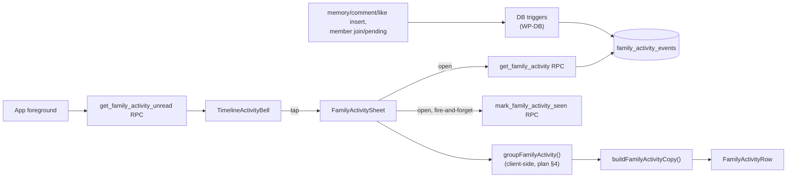

# Feature: Family activity

**Status:** `done`
**Last updated:** 2026-08-21
**PRD reference:** — (post-MVP capability; see [docs/plans/family-activity.md](../plans/family-activity.md) for the decision record and rationale)

## Overview

A bell in the timeline header opens a bottom sheet listing what the rest of
the household has been doing: memories added, comments left, likes given,
new members joining or waiting for approval. It's the persistent, in-app
record of "someone saw it" — unlike the debounced, creator-only push
notifications family sharing already sends, this feed is visible to every
household member, survives being dismissed, and gives owner/managers a
standing nudge when someone is waiting on their approval. An unread dot on
the bell shows there's something new since the viewer last opened it.

## User-facing behavior

- **Bell:** top-right of the timeline header, next to "Your moments." Shown
  for every role, including solo families (whose feed is always empty — see
  below). An 8px accent dot appears when there's unseen activity.
- **Sheet:** tapping the bell opens a ~80%-height bottom sheet titled "Family
  activity," sectioned **Today / Yesterday / This week / Earlier**. Each
  section only renders if it has rows.
- **Row anatomy:** an initial-only avatar for the actor, a sentence with the
  actor's name(s) in bold ("**Ana** added 3 memories," "**Grandma** and
  **Luis** liked a memory"), a muted second line (the comment snippet for a
  comment row, otherwise a short excerpt of the memory), a timestamp, and — for
  memories — up to 3 stacked 44px thumbnails on the right (illustration first,
  falling back to the raw media, falling back to a placeholder box).
- **`member_pending` rows** (someone redeemed an invite and is waiting for a
  decision) carry a small **Review** pill and only ever appear for
  owner/manager viewers — filtered server-side, not client-side.
- **Own actions are excluded.** Everyone sees the same family feed minus
  their own events — you never see "you added a memory." Events from an
  actor the viewer has blocked (`blocked_family_accounts`, family-scoped)
  are excluded too, matching the same push-delivery rule described in
  [content-reporting.md](./content-reporting.md).
- **Grouping** (client-side, over the ≤100 fetched rows, see
  [Grouping](#grouping)): consecutive `memory_added` events by the same actor
  within 30 minutes collapse into one row; `memory_liked` events on the same
  memory within 24 hours collapse into one row with up to 2 names + "and N
  others." Grouping never crosses a day section.
- **Empty state:** "Quiet for now. When someone adds a moment or leaves a
  comment, it'll show up here." plus an "Invite a family member" link — shown
  only when the family has exactly one active member (i.e., only the viewer
  themselves).
- **Tap behavior:** the sheet closes first, then navigates — memory rows to
  memory detail, comment rows to memory detail with `?comments=1`,
  `member_pending` rows to the approvals screen. `member_joined` rows are a
  no-op tap (close only) in this iteration — see
  [Extension guide](#extension-guide).
- **Refresh:** no Realtime. The sheet's body component mounts fresh every
  time it opens and fetches immediately (`staleTime` 0) — there's no
  separate "refetch on open" step to keep in sync, mounting *is* the
  refetch. The unread dot refetches on every app foreground and on the
  timeline's own pull-to-refresh (a cheap boolean RPC, unlike the timeline's
  memory list query which deliberately avoids refetch-on-focus — see
  [Constraints & gotchas](#constraints--gotchas)).
- **Marking seen:** opening the sheet fires `mark_family_activity_seen`
  fire-and-forget and optimistically clears the dot (rolled back on failure).

## Architecture



Reads go entirely through three security-definer RPCs
(`get_family_activity`, `get_family_activity_unread`,
`mark_family_activity_seen`); the client never queries
`family_activity_events` directly, and the table has no client-facing RLS
policies at all — the RPCs are the only door in. Writes happen exclusively
through DB triggers on `memories`, `memory_comments`, `memory_likes`, and
`family_memberships`/`family_invites` — the client never inserts an activity
row. See TECH_SPEC.md for the RPC/trigger contracts (owned by the DB
migration, `supabase/migrations/20260822100000_family_activity.sql`).

## Data model

| Table / column | Role in this feature |
|---|---|
| `family_activity_events` | One row per event (`memory_added`, `memory_commented`, `memory_liked`, `member_joined`, `member_pending`). Ids only (`memory_id`, `comment_id`, `like_user_id`, `invite_id`) — content is joined at read time by the RPC, never duplicated here. No client RLS policies. |
| `family_memberships.activity_seen_at` | Nullable timestamp; null means "never opened the sheet" (everything unread). Set by `mark_family_activity_seen`. |

The DB layer (table, triggers, RPCs, retention/pruning, the `memory_likes`
select-policy flip) is owned by the concurrent DB migration and documented
in TECH_SPEC.md — this doc covers client behavior and integration.

## API & Edge Functions

| Function / endpoint | Input | Output | Auth |
|---|---|---|---|
| `get_family_activity` RPC | `target_family_id` | up to 100 rows, newest first (id, kind, timestamps, actor, memory/comment/invite fields — see TECH_SPEC.md) | JWT; active member of `target_family_id`; excludes the caller's own events; excludes events whose actor the caller has blocked (`blocked_family_accounts`, matching the [content-reporting.md](./content-reporting.md) push-delivery rule); excludes `member_pending` unless caller is owner/manager |
| `get_family_activity_unread` RPC | `target_family_id` | `boolean` | JWT; same membership/role/blocked-actor rules as above |
| `mark_family_activity_seen` RPC | `target_family_id` | `void` | JWT; sets the caller's own membership's `activity_seen_at` |

No Edge Function changes. `notify-family-activity` and
`notify-memory-engagement` are unrelated — they keep debouncing pushes off
`family_activity_log`, a different table from `family_activity_events`. This
feed is the persistent record; push preferences continue to control push
only and never filter what shows up here.

## Client integration

| Layer | Files | Responsibility |
|-------|-------|----------------|
| Service | `src/services/family-activity.ts` | RPC wrappers, row → `FamilyActivityEvent` mapping, the pure `groupFamilyActivity()` grouping/sectioning function |
| Copy | `src/utils/family-activity-copy.ts` | Sentence builder (`buildFamilyActivityCopy`) — bold-name segments + verb + object, never references the memory's creator |
| Hooks | `src/hooks/useFamilyActivity.ts`, `src/hooks/queryKeys.ts` | `useFamilyActivity`, `useFamilyActivityUnread`, `useMarkFamilyActivitySeen` |
| Components | `src/components/timeline-activity-bell.tsx`, `family-activity-sheet.tsx`, `family-activity-row.tsx` | Bell + dot, sheet (loading/error/empty/sectioned list), row rendering |
| Screen | `app/(app)/(tabs)/timeline.tsx` | Bell in the header row, sheet mounted once, routing callbacks |
| Shared util | `src/utils/bottom-sheet-dismiss.ts` | Pull-down-dismiss thresholds + bottom padding, shared with `MemoryCommentsDrawer` (see gotchas) |
| Routes | `src/lib/routes.ts` | `memoryDetailRoute`, `memoryDetailCommentsRoute`, `sharingApprovalsRoute`, `sharingInviteRoute` |

### How to invoke from another feature

1. Read the active family id from `useFamily()`.
2. Render `<TimelineActivityBell unread={...} onPress={...} />` wherever a
   new entry point into the feed is needed, and mount
   `<FamilyActivitySheet visible={...} onClose={...} onOpenMemory={...}
   onOpenComments={...} onOpenApprovals={...} onInvite={...} />` once nearby.
   Don't mount a second independent sheet instance.
3. If you add a new event kind, it needs a DB trigger + RPC column (DB side,
   out of this doc's scope) **and** a case in `buildFamilyActivityCopy()` —
   the `switch` there is exhaustive (`never` guard), so TypeScript will catch
   a missing case.

## Grouping

Implemented in `groupFamilyActivity(events, { now })`
(`src/services/family-activity.ts`), applied to the ≤100 fetched rows in
their already newest-first order:

1. **`memory_added`:** strictly *consecutive* rows (no other event kind or
   actor interleaves) by the same actor within a 30-minute window collapse
   into one group.
2. **`memory_liked`:** rows on the *same memory* within a 24-hour window
   collapse into one group, even if not adjacent (an unrelated event can sit
   between two likes on the same memory and the group still forms) — tracked
   by memory id, not list position.
3. Everything else (`memory_commented`, `member_joined`, `member_pending`) is
   always 1:1.

Grouping runs **per day-section**, never across one: events are bucketed into
Today/Yesterday/This week/Earlier by local calendar day first, and only then
grouped within each bucket. A `memory_liked` streak that would otherwise
qualify (e.g., 20 hours apart) still splits into two rows if the two likes
land on different calendar days. A grouped row's displayed timestamp is
always the **newest** member's timestamp.

## Extension guide

**Safe to extend**

- A dedicated `member_joined` tap target (e.g., open the Family members
  screen for owner/manager viewers) — the event catalogue anticipates this,
  but `FamilyActivitySheet`'s prop list has no `onOpenMembers` callback yet,
  so it's currently a no-op tap. Add the prop, wire it from
  `app/(app)/(tabs)/timeline.tsx` to `sharingMembersRoute`, and handle it in
  `handleRowPress`'s `member_joined` case.
- New presentation around the existing sentence/excerpt/timestamp — e.g., a
  denser row style, without changing the copy builder's segment contract.
- Additional grouping windows for a future event kind, following the same
  "narrow to one day-section, then group" shape as `groupEventsWithinSection`.

**Do not change without updating this doc**

- The own-events-excluded and `member_pending`-role-filtered rules — these
  are enforced in the RPC (DB side), not the client; don't add a client-side
  filter that duplicates or diverges from them.
- The "never references the memory creator" copy rule (plan §3) — like/comment
  rows describe the memory, not who made it. This is a deliberate reversal of
  the earlier "memories aren't attributed on cards" stance for a different
  reason (privacy of the *liker*, not the creator) — don't conflate the two.
- The bounded-feed contract (≤100 rows read, retention pruning to 200/90d on
  the DB side) — this is not paginated and never will be in this design; a
  "load more" would need a new RPC shape, not a client-side tweak.

**Common extension patterns**

- New event kind → DB trigger + RPC column (DB side) + a `FamilyActivityKind`
  variant + a `buildFamilyActivityCopy` case (TypeScript's exhaustiveness
  check will fail the build if you forget the case) + a grouping rule if it
  should ever collapse (default: falls into the 1:1 "everything else"
  branch, which is correct for most new kinds without extra work).

## Constraints & gotchas

- **Never render the actor as the memory's creator.** Like/comment copy
  intentionally never says "your memory" or "Ana's memory" — see the copy
  rule above. The *actor* (who liked/commented/joined), by contrast, does
  fall back to "A former member" when their account was hard-deleted
  (`actor_is_former`); this fallback is specific to the actor, not the
  memory's creator, and is capitalized ("A former member") because it
  always opens the sentence.
- **`FamilyMemberAvatar` is a children-roster component reused here for
  adults.** The actor is a household member (`family_memberships` /
  `user_profiles`), not a child (`family_members`) — `family-activity-row.tsx`
  builds a minimal `SafetyAwareFamilyMemberAvatarMember`-shaped object with
  `avatarImageKey: null` so it always renders an initial, never attempting to
  resolve a portrait. Don't wire a real photo through this path.
  Reusing `FamilyMemberAvatar` here means it now serves two different actor
  types — if it ever needs actor-specific behavior (e.g. a "you" affordance),
  branch inside `family-activity-row.tsx`, not inside the avatar component.
- **`bottom-sheet-dismiss.ts` is intentionally dependency-free.** Its two
  pull-down-dismiss helpers were extracted out of `memory-comments-drawer.tsx`
  (both files re-export the same functions with the same names, so no
  existing caller/test needed to change) specifically so a second in-house
  sheet can reuse the exact same thresholds without pulling in the drawer's
  full hook chain (`use-auth` → `lib/supabase` → the AsyncStorage native
  module, which breaks under Jest for any screen test that doesn't already
  mock that chain). Keep this module free of hooks/supabase imports if you
  add a third sheet.
- **`useFamilyActivityUnread` refetches on every app foreground, and
  `app/(app)/(tabs)/timeline.tsx` also refetches it explicitly on
  pull-to-refresh** — both on purpose. This is the opposite policy from
  `useMemories`' timeline list query (which turns `refetchOnWindowFocus` off
  and has no explicit pull-to-refresh wiring of its own reason to re-fetch
  the *whole* loaded timeline on every foreground) — a boolean RPC is cheap
  enough that the simplicity of "just refetch" outweighs the cost. Don't
  copy this pattern to a heavier query without re-deriving the cost/benefit.
- **`useFamilyActivity`'s data hooks only run while the sheet is open, by
  construction, not by an `enabled` flag.** `FamilyActivitySheet` is a thin
  shell (Modal/gesture/animation only) that stays mounted persistently on
  the timeline; everything RPC-backed (`useFamily`, `useFamilyMemberProfiles`,
  `useFamilyActivity`, `useMarkFamilyActivitySeen`) lives in
  `FamilyActivitySheetBody`, rendered only inside the `Modal`'s children —
  RN's `Modal` renders `null` while `visible` is false, unmounting Body and
  every hook it called. `useFamilyActivity`'s `staleTime: 0` is what makes
  "Body mounts" and "fetch fresh data" the same event on every reopen, not
  just the first one; there's no separate explicit `refetch()` call on open
  to keep in sync with that. Don't move any of Body's hooks back up into the
  shell, and don't reintroduce an `enabled`/`useEffect([visible])` refetch
  dance — both were the original (buggy) shape this replaced.
- **Row taps defer their navigation callback until the sheet has actually
  closed.** `handleRowPress`/`handleInvite` (in `FamilyActivitySheetBody`)
  never call `onOpenMemory`/`onOpenComments`/`onOpenApprovals`/`onInvite`
  directly — they stash the action in a ref (owned by the outer
  `FamilyActivitySheet`, via a `runAfterClose` callback) and call `onClose()`
  immediately; a `useEffect` keyed on the `visible` prop runs (and clears)
  that ref once the parent actually re-renders with `visible={false}`.
  Firing `router.push` synchronously alongside `onClose()` would race the
  Modal's own close re-render, which on Android can strand the destination
  route underneath the still-closing modal window. The ref must live in the
  outer shell, not in Body — Body unmounts as part of the same re-render
  that flips `visible` to false, before its own effects could reliably fire.
- **Grouping recomputes once per sheet open** (`useMemo(() => new Date(), [])`
  in `FamilyActivitySheetBody`) rather than on every render — otherwise
  section boundaries (Today/Yesterday) could shift under the user's thumb if
  the sheet happened to stay open across local midnight. This is a plain
  mount-only memo (empty deps), safe only because Body itself remounts on
  every open (see the hooks-only-run-while-open gotcha above) — it would be
  wrong in a component that stays mounted across opens.
- **Any screen that renders `FamilyActivitySheet`/`FamilyActivityRow` in a
  Jest test must mock `@/lib/supabase`** (or mock the sheet/row entirely) —
  `family-activity-row.tsx` → `FamilyMemberAvatar` → `useMediaUrls` →
  `services/media.ts` reaches the real Supabase client, whose
  `@react-native-async-storage/async-storage` import throws under Jest. See
  how `timeline.integration.test.tsx` and
  `looking-back-timeline.integration.test.tsx` mock
  `@/components/family-activity-sheet` and `@/hooks/useFamilyActivity`
  wholesale, the same way they already mock `MemoryCard` for the identical
  reason.
- **The bounded 100-row read is a hard client assumption.** `groupFamilyActivity`
  trusts the RPC's own ordering/limit; the service re-sorts defensively
  (newest-first by `created_at`, then `id`) but does not re-fetch or paginate.

## Dependencies

- Depends on: [Family sharing](./family-sharing.md) (membership/role model,
  invite lifecycle), [Likes & comments](./likes-and-comments.md) (the
  `memory_liked`/`memory_commented` event sources and the household-visible
  like policy this feature relies on)
- Used by: Timeline (`app/(app)/(tabs)/timeline.tsx`)

## Testing

### Unit tests

| File | Covers |
|------|--------|
| `src/services/family-activity.test.ts` | RPC row → event mapping, actor former-member fallback, `groupFamilyActivity` windows (30min/24h), no cross-day-section grouping, day-section bucketing, `buildFamilyActivityCopy` for every event kind incl. the gallery-import variant and grouped-likes "and N others" |
| `src/components/timeline-activity-bell.test.tsx` | Dot visibility, a11y label (plain vs. "new"), press wiring |

### Integration tests

| File | Scenarios |
|------|-----------|
| `src/hooks/useFamilyActivity.integration.test.tsx` | `enabled` gating (including no-familyId), fetch on the disabled→enabled transition, `useFamilyActivityUnread` fetch, `useMarkFamilyActivitySeen` optimistic clear + rollback |
| `src/components/family-activity-sheet.test.tsx` | Loading skeleton, error + retry, empty state (incl. solo-family invite CTA), Today/Yesterday/This week/Earlier sectioning, Review pill only on `member_pending` rows, deferred-navigation order for every tap target (route callback withheld until the sheet re-renders `visible={false}`), data hooks never called while closed |

### E2E (Maestro)

| Flow | Scenario |
|------|----------|
| `.maestro/flows/engagement/family-activity.yaml` | Single-account approximation only: bell opens the sheet, the empty-state copy renders (the RPC excludes the caller's own events, so a single account can never populate a row, the unread dot, or the Review pill — a true two-account flow is not implemented) |

### Run this feature's tests

```bash
npm test -- --runInBand \
  src/services/family-activity.test.ts \
  src/components/family-activity-sheet.test.tsx \
  src/components/timeline-activity-bell.test.tsx \
  src/hooks/useFamilyActivity.integration.test.tsx
maestro test .maestro/flows/engagement/family-activity.yaml
```

## Changelog

| Date | Change |
|------|--------|
| 2026-08-21 | Initial implementation: bell + unread dot, bottom sheet with sectioned/grouped feed, RPC-backed service and hooks, client-side grouping and copy rules. |
