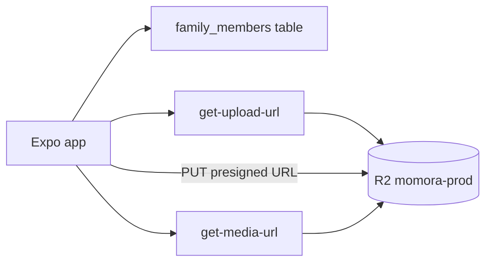

# Family profiles

Create and manage family members with profile photos stored in Cloudflare R2. Onboarding nudges users to add a child first before journaling.

**Status:** `done`
**Last updated:** 2026-07-15
**PRD reference:** [PRD §6.2 Family Profiles](../PRD.md)

## Overview

Family profiles power memory tagging and age-aware AI character portraits. Each member has a name, date of birth, optional gender/notes, and one or more dated source-photo/portrait pairs. The member row stores identity/profile fields; [portrait-timeline.md](./portrait-timeline.md) is canonical for visual history, generation, selection, and storage.

## User-facing behavior

- **Family tab:** list members or empty state — “Add your child first”
- **Member ordering:** everywhere `useFamilyMembers()` renders members (family tab, memory tag chips in new/edit memory), the list is ordered by how often each member is tagged in memories (most-tagged first, ties by `created_at`). `fetchFamilyMembers` embeds a `memory_family_members(count)` aggregate and sorts client-side; memory create/update/delete invalidates the `family-members` query so the order stays fresh.
- **Add member modal:** name, DOB (YYYY-MM-DD), optional gender/notes, required photo from camera or library
- **Edit member:** profile fields remain editable independently. Adding a newer or backdated photo creates a portrait version without replacing history.
- **Keyboard-safe forms:** add/edit forms scroll the focused field above the keyboard. Android waits for the IME resize, then uses React Native's native focused-input scroll calculation so nicknames and notes remain visible even after prior automatic scrolling.
- **Profile photo source chooser:** tapping the photo circle shows **Take photo** and **Choose from library**. iOS uses a native action sheet; Android uses a standard alert chooser.
- **Timeline onboarding:** if no family members, CTA to add one before journaling
- **Portrait history:** the member-detail history icon opens paired photos/illustrations with date, age, status, and management actions.
- **Portrait status:** a new generation can show pending/generating state while the previous ready portrait remains the current avatar. Unique output keys avoid stale cached regeneration results.
- **Full-screen portrait:** tapping a ready illustrated portrait on the family-member detail page opens it in the same warm, dark full-screen viewer used by memory media. The original profile photo is not substituted when an illustrated portrait is unavailable.
- **Timeout recovery:** if the portrait Edge Function returns a gateway timeout after moving the row to `generating`, the client conditionally changes an in-progress status to `failed`. This prevents indefinite polling and exposes the existing retry affordance. A concurrently completed `ready` portrait is never overwritten.

## Architecture



1. Client inserts the `family_members` identity row.
2. Client uploads a normalized source JPEG to an immutable version key.
3. Authorized RPC creates `family_member_portrait_versions` with its date/source.
4. Client invokes portrait generation asynchronously.
5. Display resolves the correct version for today or a memory date and uses `get-media-url` (1h TTL).

## Data model

| Table / storage | Role |
|-----------------|------|
| `family_members` | Person identity/profile fields |
| `family_member_portrait_versions` | Dated source-photo/AI-portrait history and attempt state |
| R2 `momora-prod` | Private immutable version objects under `{userId}/family/{memberId}/portraits/` |

Key object layout (single bucket):

| Key pattern | Purpose |
|-------------|---------|
| `{userId}/family/{memberId}/portraits/{versionId}/photo.jpg` | Normalized source photo |
| `{userId}/family/{memberId}/portraits/{versionId}/portrait/{attemptId}.webp` | Generated portrait attempt/output |

## API & Edge Functions

| Function | Input | Output | Auth |
|----------|-------|--------|------|
| `get-upload-url` | `{ objectKey, contentType, familyId }` | `{ uploadUrl, objectKey, expiresIn }` | JWT + owner/manager of `familyId` |
| `get-media-url` | `{ keys: string[] }` | `{ urls, expiresIn }` | JWT + member of the key's resolved family |
| `generate-portrait-illustration` | `{ portraitVersionId }` | ready version key or generation error | JWT + owner/manager |
| `delete-family-member` | `{ familyMemberId }` | storage-clean member deletion | JWT + owner/manager |

Bucket name comes from Edge Function secret `R2_BUCKET` — not from the client.

## Client integration

`src/components/full-screen-media-viewer.tsx` is shared with memories for ready portrait viewing.

| Layer | Files |
|-------|-------|
| Routes | `app/(app)/(tabs)/family.tsx`, `app/(app)/family/[id]/index.tsx`, `app/(app)/family/[id]/portraits.tsx`, `app/(app)/add-family-member.tsx` |
| Hooks | `src/hooks/useFamilyMembers.ts`, `src/hooks/usePortraitVersions.ts`, `src/hooks/useMediaUrls.ts` |
| Services | `src/services/family-members.ts`, `src/services/portrait-versions.ts`, `src/services/media.ts` |
| Components | `src/components/family-member-card.tsx`, `src/components/family-empty-state.tsx` |
| Utils | `src/utils/family-members.ts`, `src/utils/storage-keys.ts` |

Profile photo picking is centralized in `src/utils/family-profile-photo-picker.ts`.

| Source | Behavior |
|--------|----------|
| Camera | Requests camera permission, launches the front camera, then returns a local image URI |
| Library | Requests media library permission, launches the image picker, then returns a local image URI |
| Android pending result | Add/edit screens call `ImagePicker.getPendingResultAsync()` on mount to recover selections if `MainActivity` was destroyed |

Both sources check the current permission before requesting it, avoid
re-requesting permanently denied access, and wait for the native source
chooser or permission dialog to finish dismissing before launching the next
native screen.

Library picker options request EXIF (never base64) only to read a trustworthy capture date before upload. Camera capture ignores EXIF and uses local today. Image bytes are re-encoded before upload so metadata is not persisted, and picker contents are never logged.

### How to invoke from another feature

1. Use `useFamilyMembers()` for the member list.
2. Tag memories with member ids (unlimited for text-only/media; max 6 for AI illustrations).
3. Resolve private images with `useMediaUrl(key)` or `getMediaUrls([...keys])`.
4. On create, portrait generation runs automatically after version creation. Add/edit visual history through `usePortraitVersions`; do not write legacy photo/portrait columns.

## Extension guide

**Safe to extend**

- Add edit-member modal reusing upload flow
- Call `generate-portrait-illustration` after successful portrait-version creation
- Poll/refetch version rows while generation/deletion claims are active

**Do not change without updating this doc**

- Object key prefix `{userId}/` enforcement in Edge Functions
- Photo required before portrait pipeline runs
- Rollback on failed upload during create

## Constraints & gotchas

- Profile photo required on create (UI + product rule)
- DOB required; drives age display via `formatAgeFromDob`
- Adding camera support requires a rebuilt dev client after `app.json` changes. JS reload alone does not add native `NSCameraUsageDescription` / Android `CAMERA` permission config.
- Camera capture uses the front camera when available; Android camera apps may vary in how strictly they honor the front-camera request.
- iOS crop UI is square when editing. Android honors `aspect: [1, 1]` for the crop ratio, though system camera apps may rotate/crop differently.
- Android picker recovery should be manually checked with Developer options → **Don't keep activities**.
- Upload keys validated server-side — portrait sources are JPEG at the exact caller-owned immutable version key
- Client resizes profile photos to max **2048px** edge and uploads JPEG before presigned PUT
- R2 credentials never in client; only presigned URLs
- Failed upload rolls back the new DB row

## Dependencies

- Depends on: [auth](./auth.md), Supabase schema, R2 bucket + secrets
- Used by: onboarding, memories (tagging), portrait/illustration pipelines (future)

## Testing

### Unit tests

| File | Covers |
|------|--------|
| `src/utils/family-members.test.ts` | Validation, age formatting |
| `src/utils/profile-photo.test.ts` | Profile photo resize before R2 upload |
| `src/utils/family-profile-photo-picker.test.ts` | Camera/library picker permissions, options, content types, pending-result parsing |
| `src/utils/native-permissions.test.ts` | Existing grants, request gating, permanent denial, presentation settling |
| `src/utils/storage-keys.test.ts` | Key builder |
| `src/utils/e2e-fixtures.test.ts` | E2E profile fixture loader |
| `src/services/media.test.ts` | Presigned upload (native FileSystem path) |
| `src/components/cast-card.test.tsx` | Family-member detail portrait tap affordance |
| `src/components/keyboard-aware-form-screen.test.ts` | Native focused-input scrolling after Android keyboard resize |

### Integration tests

| File | Scenarios |
|------|-----------|
| `src/services/family-members.integration.test.ts` | Fetch, create+upload, rollback on failure |
| `src/hooks/useFamilyMembers.integration.test.tsx` | Query load, create/update mutations, portrait timeout recovery |
| `src/components/full-screen-media-viewer.integration.test.tsx` | Direct portrait URI rendering and close affordance |

### E2E (Maestro)

| Flow | Scenario |
|------|----------|
| `.maestro/flows/onboarding/add-family-member.yaml` | Opens add-member screen (smoke) |
| `.maestro/flows/onboarding/add-family-member-with-fixture.yaml` | **CI default** — bundled E2E photo → save → upload |
| `.maestro/flows/onboarding/add-family-member-with-picker.yaml` | Real system photo picker via `addMedia` |
| `.maestro/flows/onboarding/view-family-portrait-full-screen.yaml` | Ready portrait → full-screen viewer → close back to member detail |

Dev builds expose **Use E2E test photo** (`testID: add-family-member-photo-fixture`) on the add-member screen. It is compiled out of production (`__DEV__` only) and loads `assets/e2e/profile-fixture.jpg` to a local file URI for real R2 upload.

The picker E2E flow exercises the library path only. Camera capture is manual QA because it is unreliable in CI.

### Manual QA

| Platform | Take photo (front) | Choose library | Deny camera | Pending recovery |
|----------|--------------------|----------------|-------------|------------------|
| iOS device | Required | Required | Required | N/A |
| Android device | Required | Required | Required | Required with **Don't keep activities** |

### Edge Function tests (Deno)

| File | Covers |
|------|--------|
| `supabase/functions/_shared/storage-keys.test.ts` | Key validation |
| `supabase/functions/get-upload-url/index.test.ts` | Auth, method guards |
| `supabase/functions/get-media-url/index.test.ts` | Auth, validation |

### Run this feature's tests

```bash
npm test -- --testPathPattern=family
npm run test:edge
maestro test -e TEST_EMAIL=... -e TEST_PASSWORD=... .maestro/flows/onboarding/add-family-member-with-fixture.yaml
maestro test -e TEST_EMAIL=... -e TEST_PASSWORD=... .maestro/flows/onboarding/add-family-member-with-picker.yaml
```

## Changelog

| Date | Change |
|------|--------|
| 2026-07-15 | Use native focused-input scrolling after Android keyboard resize |
| 2026-07-15 | Added dated portrait history and age-aware memory portrait selection |
| 2026-07-14 | Keep lower add/edit profile fields visible above the Android keyboard |
| 2026-07-12 | Members ordered by memory tag frequency (family tab + memory tag chips) |
| 2026-07-12 | Ready character portraits open full screen from family-member detail |
| 2026-07-12 | Hardened photo permission and picker presentation lifecycle |
| 2026-07-12 | Recover timed-out portrait generation so manager-initiated replacement photos do not remain stuck in `generating` |
| 2026-05-29 | Added camera capture source for family profile photos with Android pending-result recovery |
| 2026-05-25 | E2E photo upload flows (fixture + system picker) |
| 2026-05-24 | Initial family profiles + R2 upload/read Edge Functions |
