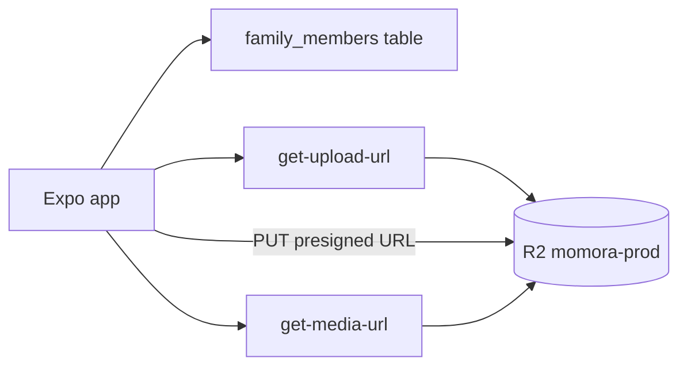

# Family profiles

Create and manage family members with profile photos stored in Cloudflare R2. Onboarding nudges users to add a child first before journaling.

**Status:** `done`
**Last updated:** 2026-05-29
**PRD reference:** [PRD §6.2 Family Profiles](../PRD.md)

## Overview

Family profiles power memory tagging and AI character portraits. Each member has a name, date of birth, optional gender/notes, and a required profile photo uploaded to R2 via presigned URLs. After save, the client invokes `generate-portrait-illustration` and polls `illustrated_profile_status` until `ready` or `failed`.

## User-facing behavior

- **Family tab:** list members or empty state — “Add your child first”
- **Add member modal:** name, DOB (YYYY-MM-DD), optional gender/notes, required photo from camera or library
- **Edit member:** changing the profile photo prompts to regenerate the AI portrait or save without regenerating (keeps the existing character portrait until the user chooses to regenerate)
- **Profile photo source chooser:** tapping the photo circle shows **Take photo** and **Choose from library**. iOS uses a native action sheet; Android uses a standard alert chooser.
- **Timeline onboarding:** if no family members, CTA to add one before journaling
- **Portrait status:** while `pending` or `generating`, the profile photo shows a sparkle loading overlay (same pattern as memory illustrations) with copy such as “Portrait pending” / “Generating portrait…”. When `ready`, the AI character portrait is shown.
- **Portrait cache busting:** R2 portrait keys are stable (`portrait.webp`). Client presigned URLs and `expo-image` cache use `family_members.updated_at` so regenerated portraits appear without restarting the app.

## Architecture



1. Client inserts `family_members` row (without photo key).
2. Client requests presigned PUT from `get-upload-url` for `{userId}/family/{memberId}/photo.webp`.
3. Client uploads photo directly to R2.
4. Client updates `profile_picture_key` on the member row.
5. Display uses `get-media-url` for presigned GET URLs (1h TTL).

## Data model

| Table / storage | Role |
|-----------------|------|
| `family_members` | Profile fields + `profile_picture_key` + portrait status |
| R2 `momora-prod` | Single bucket; keys under `{userId}/family/{memberId}/` |

Key object layout (single bucket):

| Key pattern | Purpose |
|-------------|---------|
| `{userId}/family/{memberId}/photo.webp` | Uploaded profile photo |
| `{userId}/family/{memberId}/portrait.webp` | AI portrait (future) |

## API & Edge Functions

| Function | Input | Output | Auth |
|----------|-------|--------|------|
| `get-upload-url` | `{ objectKey, contentType }` | `{ uploadUrl, objectKey, expiresIn }` | JWT |
| `get-media-url` | `{ keys: string[] }` | `{ urls, expiresIn }` | JWT |

Bucket name comes from Edge Function secret `R2_BUCKET` — not from the client.

## Client integration

| Layer | Files |
|-------|-------|
| Routes | `app/(app)/(tabs)/family.tsx`, `app/(app)/add-family-member.tsx` |
| Hooks | `src/hooks/useFamilyMembers.ts`, `src/hooks/useMediaUrls.ts` |
| Services | `src/services/family-members.ts`, `src/services/media.ts` |
| Components | `src/components/family-member-card.tsx`, `src/components/family-empty-state.tsx` |
| Utils | `src/utils/family-members.ts`, `src/utils/storage-keys.ts` |

Profile photo picking is centralized in `src/utils/family-profile-photo-picker.ts`.

| Source | Behavior |
|--------|----------|
| Camera | Requests camera permission, launches the front camera, then returns a local image URI |
| Library | Requests media library permission, launches the image picker, then returns a local image URI |
| Android pending result | Add/edit screens call `ImagePicker.getPendingResultAsync()` on mount to recover selections if `MainActivity` was destroyed |

Picker options intentionally set `exif: false` and `base64: false`; child profile photos are processed by local URI only and picker asset contents are not logged.

### How to invoke from another feature

1. Use `useFamilyMembers()` for the member list.
2. Tag memories with member ids (max 4) — future memory feature.
3. Resolve private images with `useMediaUrl(key)` or `getMediaUrls([...keys])`.
4. On create, portrait generation runs automatically after photo upload. On edit, pass `regeneratePortrait: true` to `updateMember` only when the user confirms regeneration.

## Extension guide

**Safe to extend**

- Add edit-member modal reusing upload flow
- Call `generate-portrait-illustration` after successful photo save
- Poll/refetch member row while `illustrated_profile_status === 'generating'`

**Do not change without updating this doc**

- Object key prefix `{userId}/` enforcement in Edge Functions
- Photo required before portrait pipeline runs
- Rollback on failed upload during create

## Constraints & gotchas

- Profile photo required on create (UI + product rule)
- DOB required; drives age display via `formatAgeFromDob`
- Adding camera support requires a rebuilt dev client after `app.json` changes. JS reload alone does not add native `NSCameraUsageDescription` / Android `CAMERA` permission config.
- Camera capture uses the front camera when available; Android camera apps may vary in how strictly they honor the front-camera request.
- iOS crop UI is square when editing. Android honors `aspect: [1, 1]` for the crop ratio, though system camera apps may rotate/crop differently.
- Android picker recovery should be manually checked with Developer options → **Don't keep activities**.
- Upload keys validated server-side — only `{userId}/family/{uuid}/photo.webp` for PUT
- Client resizes profile photos to max **2048px** edge and uploads JPEG before presigned PUT
- R2 credentials never in client; only presigned URLs
- Failed upload rolls back the new DB row

## Dependencies

- Depends on: [auth](./auth.md), Supabase schema, R2 bucket + secrets
- Used by: onboarding, memories (tagging), portrait/illustration pipelines (future)

## Testing

### Unit tests

| File | Covers |
|------|--------|
| `src/utils/family-members.test.ts` | Validation, age formatting |
| `src/utils/profile-photo.test.ts` | Profile photo resize before R2 upload |
| `src/utils/family-profile-photo-picker.test.ts` | Camera/library picker permissions, options, content types, pending-result parsing |
| `src/utils/storage-keys.test.ts` | Key builder |
| `src/utils/e2e-fixtures.test.ts` | E2E profile fixture loader |
| `src/services/media.test.ts` | Presigned upload (native FileSystem path) |

### Integration tests

| File | Scenarios |
|------|-----------|
| `src/services/family-members.integration.test.ts` | Fetch, create+upload, rollback on failure |
| `src/hooks/useFamilyMembers.integration.test.tsx` | Query load, create mutation |

### E2E (Maestro)

| Flow | Scenario |
|------|----------|
| `.maestro/flows/onboarding/add-family-member.yaml` | Opens add-member screen (smoke) |
| `.maestro/flows/onboarding/add-family-member-with-fixture.yaml` | **CI default** — bundled E2E photo → save → upload |
| `.maestro/flows/onboarding/add-family-member-with-picker.yaml` | Real system photo picker via `addMedia` |

Dev builds expose **Use E2E test photo** (`testID: add-family-member-photo-fixture`) on the add-member screen. It is compiled out of production (`__DEV__` only) and loads `assets/e2e/profile-fixture.jpg` to a local file URI for real R2 upload.

The picker E2E flow exercises the library path only. Camera capture is manual QA because it is unreliable in CI.

### Manual QA

| Platform | Take photo (front) | Choose library | Deny camera | Pending recovery |
|----------|--------------------|----------------|-------------|------------------|
| iOS device | Required | Required | Required | N/A |
| Android device | Required | Required | Required | Required with **Don't keep activities** |

### Edge Function tests (Deno)

| File | Covers |
|------|--------|
| `supabase/functions/_shared/storage-keys.test.ts` | Key validation |
| `supabase/functions/get-upload-url/index.test.ts` | Auth, method guards |
| `supabase/functions/get-media-url/index.test.ts` | Auth, validation |

### Run this feature's tests

```bash
npm test -- --testPathPattern=family
npm run test:edge
maestro test -e TEST_EMAIL=... -e TEST_PASSWORD=... .maestro/flows/onboarding/add-family-member-with-fixture.yaml
maestro test -e TEST_EMAIL=... -e TEST_PASSWORD=... .maestro/flows/onboarding/add-family-member-with-picker.yaml
```

## Changelog

| Date | Change |
|------|--------|
| 2026-05-29 | Added camera capture source for family profile photos with Android pending-result recovery |
| 2026-05-25 | E2E photo upload flows (fixture + system picker) |
| 2026-05-24 | Initial family profiles + R2 upload/read Edge Functions |
