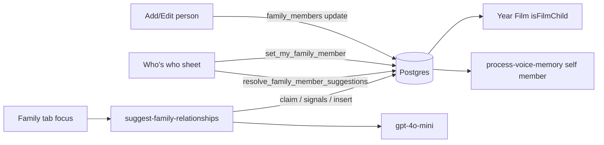

# Feature: Family relationships

**Status:** `in-progress` (built 2026-09-28, pending device QA + prod rollout)
**Last updated:** 2026-09-30
**Plan:** [docs/plans/family-relationships.md](../plans/family-relationships.md) (hardened, owner decisions §7)

## Overview

Every person in a family's list can carry **who they are to the kids** (a
role, plus a family side for grandparents/aunts/uncles/cousins), and every
account can say **"this is me"**. An AI job proposes roles, sides and
nicknames from memory text, ages and co-tagging; a person confirms them in
the "Who's who" sheet. Nothing is ever required, and the AI never writes a
person's details on its own.

Why: the Year Film must pick the family's **own** children (a niece under
13 was being counted as a kid by the old DOB-only rule), and voice memories
need to know who "I/me" is.

## User-facing behavior

- **Family tab** groups people by role (Our kids → Parents → Grandparents →
  Great-grandparents → Aunts & uncles → Cousins → Friends & caregivers →
  Pets → Other → Not sorted yet). Headers show only when there are ≥2
  groups, so an unsorted family looks exactly as before. Cards add the side
  ("Eduardo's side"), or the role in the mixed friends/caregivers group, on
  the age line, and a "You" badge on the account's own person.
- **Who's who card** (top of the Family tab):
  - owners/managers: when there are pending AI suggestions newer than the
    last dismissal -- "We sorted your people";
  - any role: when the account hasn't said which person it is (and hasn't
    said "I'm not in the list") -- "Tell us which one is you".
  - × hides it locally until a newer suggestion arrives (AsyncStorage, per
    family: `src/utils/whos-who-card.ts`).
- **Who's who sheet** (`app/(app)/whos-who.tsx`, modal):
  - "Which one is you?": portrait grid of linkable people (not kids/pets, not
    unsorted under-13s, not content-hidden); people another account claimed
    show as "Taken". "I'm not in the list" is one tap.
  - Owners/managers: one row per person with pending suggestions; every chip
    starts selected, tap to drop it, "Not quite" to pick role/side by hand.
    "Looks right" → hand-picked values are written first (normal member
    update), then one RPC accepts kept chips and dismisses the rest.
- **Add/Edit person**: optional "Who are they to the kids?" chips and, for
  side roles, "Whose side?" chips -- the parents' names + Both when any
  parent is marked, else Mom's / Dad's / Both. Tapping the selected role
  clears it.
- **Member detail**: subtitle "Grandparent · Eduardo's side"; "This is me"
  (unlinked accounts), "This is you" (tap to unlink), and for owners/managers
  "Unlink account" when another account claimed this person. Owners/managers
  also get a **Family sharing** row when the person could still be linked
  (`isInviteTargetEligible`: not a child/pet, not linked to any account, not
  hidden): "Invite {name} to Momora" opens the invite screen with that person
  preselected, or shows the live invite's state ("Invite sent · Expires in
  Nd" → Pending invites, "Waiting for your approval" → Approvals). See
  [family-sharing.md](./family-sharing.md).
- **Manager linking** ([plan](../plans/manager-account-linking.md)): an
  owner/manager can link an already-joined account to a person, change it, or
  unlink it, from the **Family members** screen (row action sheet: "Link to a
  person…", "Change person…", "Unlink person"; the row shows "Manager ·
  Grandma Ana"). It works for any active member, including the owner and
  themselves (identity metadata, not a role change), and sends no
  notification — the linked account just sees "This is you" on that person
  and can undo it. On person detail the **Family sharing** block also gets
  "Already on Momora? Link their account" (`family-member-link-account`) when
  at least one active member has no link, opening an accounts picker. Linking
  an account that already has a link replaces it and clears "not in the
  list"; a person held by a *different* account is never stolen
  (`member_already_linked` → "Unlink them on that person's page first").
  Pending invites stay immutable (L1). Pickers: `LinkPersonSheet`
  (`src/components/link-person-sheet.tsx`, `mode="people" | "accounts"`).
- **Joining**: after approval, both waiting screens
  (`app/(onboarding)/join/waiting.tsx`, `app/(app)/sharing/waiting.tsx`) open
  Who's who in `mode=self` ("Are you in the family?") when the family has
  anyone linkable; "Skip" goes to the timeline. **Invite-time link:** an
  invite made for a family person links the redeemer's account to that person
  when the approver approves (`apply_invite_member_link`, server-side,
  best-effort — never overwrites an existing link or "I'm not in the list",
  skipped if the person was claimed/deleted/no longer linkable; the approver
  is told via `linked === false`). Both waiting screens then skip Who's who
  when the account is already linked (`shouldOfferWhosWhoAfterJoin` in
  `src/services/family-relationships.ts`, which reads the links first and
  falls through to the old behaviour if that read fails).
- **Onboarding** kids are created as "Our child" (`commit_onboarding`). The
  owner gets their own person too (2026-10-02): once they have access, S16
  (`app/(onboarding)/portrait.tsx`) calls `ensureOwnerFamilyPerson`
  (`src/services/family-relationships.ts`), which creates a `parent` person
  named from their account and links it with `set_my_family_member` -- a
  no-op when the account is already linked or chose "not in the list".
  Onboarding copy and the portrait sibling chain count only kids
  (`isOnboardingKid`), so that person never turns "Lila's" into "their" or
  gets queued for a portrait.

## Architecture



The Family tab fires the Edge Function on focus (owner/manager); the server
decides whether to run (`claim_relationship_suggestion_run`), builds the
prompt from `family_relationship_signals`, validates the model's JSON in a
pure module and inserts pending rows. Everything that writes a person's
details is a human action.

## Data model

| Table / column | Role |
|----------------|------|
| `family_members.relationship` | `child · parent · grandparent · great_grandparent · aunt_uncle · cousin · family_friend · caregiver · pet · other`, null = unsorted |
| `family_members.family_side` / `side_member_id` | Exactly one: a parent member ("Eduardo's side") or `maternal · paternal · both`. Only on side roles (trigger clears them otherwise; check enforces) |
| `family_memberships.family_member_id` / `not_in_list` | "This is me" per account; unique per person. Written only by the RPCs/trigger (client column grant stays `update (role)`) |
| `family_member_suggestions` | Pending/accepted/dismissed AI proposals; `based_on` = the field's value when suggested (compare-and-set); unique on `(member, field, lower(value), side)` so dismissed values never return. Select: owner/manager; no client writes |
| `families.relationship_suggested_at` | Suggestion throttle marker |
| `family_members.is_user_profile` | **Deprecated** (only demo seeds set it); voice keeps it as a fallback |

Triggers: `family_members_normalize_relationship` (BEFORE: clears side
fields for non-side roles; a new `side_member_id` must be a `parent`),
`family_members_relationship_changed` (AFTER UPDATE OF relationship: a
person who becomes `child`/`pet` loses any account link; pending
relationship suggestions — and side suggestions when the new role has no
side — are dismissed).

Full DDL: TECH_SPEC §2.1g; migration `20260928120000_family_relationships.sql`.

**Own-child rule** (`isOwnChild`, `supabase/functions/_shared/family-relationships.ts`):
explicit role wins (`child` → yes, any other role → no), unsorted falls
back to DOB < 13. Year Film adds its own ceiling: `isFilmChild` = own child
**and** DOB present **and** still under 13 (owner decision: an explicit
"Our child" never unlocks films for teens).

## API & Edge Functions

| Function / RPC | Input | Output | Auth |
|----------------|-------|--------|------|
| `suggest-family-relationships` | `{ familyId }` | `{ skipped, reason? , suggested? }` | JWT, owner/manager, billing write |
| `set_my_family_member` | family, member \| null, not_in_list | void | any member (not anonymous); not billing-gated |
| `unlink_family_member_account` | family, member | void | owner/manager |
| `link_family_member_account` | family, user, member | void | owner/manager (any active member incl. owner/self); not billing-gated; replaces an existing link, `member_already_linked` if another account holds the person |
| `resolve_family_member_suggestions` | family, accept[], dismiss[] | `{accepted, dismissed}` | owner/manager + billing (definer re-checks what RLS would) |
| `claim_/fail_relationship_suggestion_run`, `family_relationship_signals`, `insert_family_member_suggestions` | family (+ rows) | — | service role only |

Contract: TECH_SPEC §4.26. Throttle: ≤1 run / 24h per family, or /1h after a
new member; skipped (no model call) when everyone is sorted and no memory
arrived since the last run; failures back off ~1h (never restore, so a
persistent failure can't loop). Usage: operation `relationship_chat`
(telemetry only — chat isn't capped; the claim is the bound).

## Client integration

| Layer | Files | Responsibility |
|-------|-------|----------------|
| Routes | `app/(app)/whos-who.tsx`, `app/(app)/(tabs)/family.tsx`, `app/(app)/family/[id]/index.tsx`, `add-family-member.tsx`, `family/[id]/edit.tsx`, both `waiting.tsx` | UI above |
| Hooks | `src/hooks/useFamilyRelationships.ts` | suggestions (filtered to still-current ones), account links, resolve/link/unlink mutations, fire-and-forget suggestion request |
| Services | `src/services/family-relationships.ts`, `src/services/family-members.ts` | RPCs, reads, `familyHasLinkableMember` for the join flow; role/side on create/update |
| Utils | `src/utils/family-relationships.ts`, `src/utils/whos-who-card.ts` | labels, side labels/choices, grouping, linkable rule (mirrors the RPC), card rule |
| Components | `src/components/relationship-picker.tsx`, `src/components/cast-card.tsx` | chips; card subtitle + "You" badge |

### How to invoke from another feature

1. Need "the family's own kids"? Import `isOwnChild` from
   `_shared/family-relationships.ts` (server) — select `relationship` with
   `date_of_birth`. Don't re-derive from DOB.
2. Need the signed-in account's own person? Read
   `family_memberships.family_member_id` for `(family_id, user_id)`; fall
   back to `is_user_profile` only for legacy/demo data.
3. Need a label? `relationshipSubtitle` / `sideLabel` (app) or `sideLabel`
   (server).

## Extension guide

**Adding a role:** the check constraint (migration), both enum mirrors
(`_shared/family-relationships.ts`, `src/utils/family-relationships.ts` —
the jest parity test fails until they match), `RELATIONSHIP_LABELS`, the
grouping in `groupByRelationship`, the suggestion table's value check, and
the prompt's role list in `_shared/family-relationship-suggestions.ts`.

**Do not change without updating this doc:** the own-child rule, the
suggestion validation rules (they guard against prompt injection and
nickname collisions that would mis-tag memories via
`matchMemberIdsMentionedInText`), and the rule that only human actions write
`family_members`.

**Deferred consumers** (not wired yet): memory-book worker `personType`
(`cloudflare/memory-book-worker/src/eligibility.ts`, via
`workflow-memory-book-bridge`), `date-context.ts` memory context, memory-book
eval scripts, and illustration prompts. Memory-book child choice is already
per member (`book.child_id`).

## Constraints & gotchas

- Security-definer RPCs bypass RLS, so each re-checks anonymous, membership/
  role and (for content writes) billing explicitly.
- The AI only proposes a role/side where none is set yet (a confirmed or
  hand-picked value is never second-guessed); nicknames must appear verbatim
  as a whole word in that person's snippets and never match anyone's name or
  nickname.
- A suggestion whose `based_on` no longer matches is hidden in the app and
  dismissed (not applied) on resolve — a manual edit always wins.
- `isFamilyMemberProfileIncomplete` still exempts `is_user_profile` only: a
  linkable person was always added through Add person, which requires DOB +
  photo, so they can't be "incomplete"; no extra exemption was needed.
- PII: the prompt carries first names and ≤40 short snippets (reported
  memories excluded); function logs carry counts/error names only.
- The ai_usage operation constraint change is forward-only.

## Dependencies

Family profiles, family sharing (memberships/roles), usage limits (ledger),
subscriptions (billing write gate), content reporting (snippet exclusion).

## Testing

| Layer | Files |
|-------|-------|
| pgTAP | `supabase/tests/family_relationships.sql` (121 assertions: constraints, triggers, RPC auth incl. anonymous/lapsed/non-member, compare-and-set, dedupe, onboarding kids), `link_family_member_account.sql` (28: manager/owner/self links, replace, no-op, no-steal, validation, auth), `client_table_grants.sql`, `onboarding_anonymous_lockdown.sql` |
| Deno | `_shared/family-relationships.test.ts`, `_shared/family-relationship-suggestions.test.ts`, `suggest-family-relationships/index.test.ts`, `year-film-eligibility.test.ts` (niece, teen), `process-voice-memory/index.test.ts` (self link) |
| Jest | `src/utils/family-relationships.test.ts` (incl. enum parity with Edge + SQL, `isInviteTargetEligible`), `src/screen-tests/family-member.invite-row.test.tsx` (invite row + link-account row), `src/screen-tests/sharing.members.test.tsx` (manager linking), `src/components/link-person-sheet.test.tsx`, `src/components/member-action-sheet.test.tsx`, `src/hooks/useFamilyRelationships.test.tsx`, `src/services/family-relationships.test.ts`, `src/utils/roles.test.ts` (`canLinkMemberAccount`), `src/utils/whos-who-card.test.ts`, `src/screen-tests/whos-who.integration.test.tsx` |
| Maestro | `.maestro/flows/family-relationships/edit-role.yaml`, `whos-who.yaml` (read-only), `manager-link-account.yaml` (read-only, not executed) |

```bash
npx supabase test db supabase/tests/family_relationships.sql
npm run test:edge
npm test -- family-relationships whos-who
maestro test -e TEST_EMAIL=... -e TEST_PASSWORD=... .maestro/flows/family-relationships/
```

## Changelog

| Date | Change |
|------|--------|
| 2026-10-02 | New owners get their own `parent` person linked as "this is me" at the end of onboarding (`ensureOwnerFamilyPerson`); `isOnboardingKid` keeps onboarding's kid logic to the kids. |
| 2026-10-01 | Manager-linked "this is me": owner/manager link / change / unlink an already-joined account's person from the Family members screen, plus "Already on Momora? Link their account" on person detail; `link_family_member_account` RPC, `LinkPersonSheet`, `canLinkMemberAccount`. See [manager-account-linking](../plans/manager-account-linking.md). |
| 2026-09-30 | Invite-for-person: invite-time "this is me" link on approval, waiting screens skip Who's who when already linked, person-detail invite entry point, shared `isInviteTargetEligible` predicate. See [family-sharing.md](./family-sharing.md). |
| 2026-09-28 | Initial build: roles + sides, "this is me", AI suggestions + Who's who, Year Film and voice consumers |
