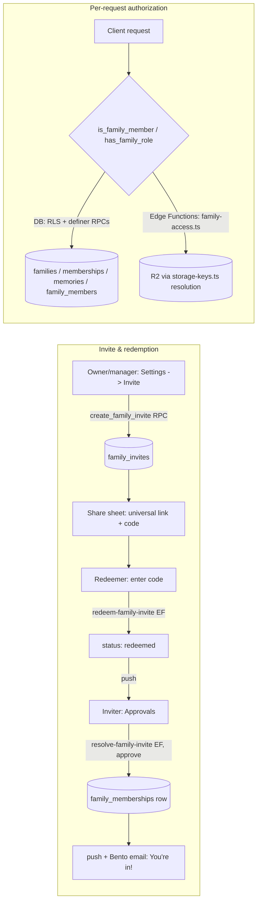
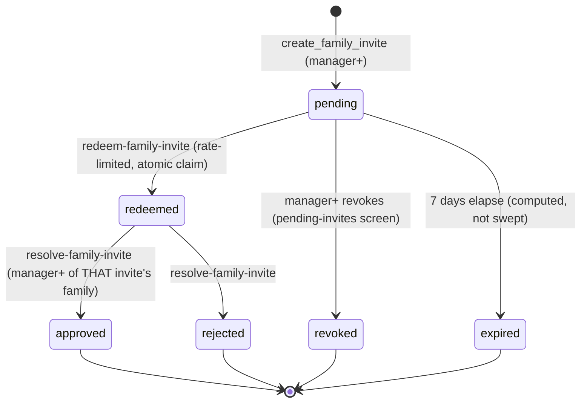

# Feature: Family sharing

**Status:** `done`
**Last updated:** 2026-07-13
**PRD reference:** —  (post-MVP capability; see `docs/plans/family-sharing.md` for the decision record and rationale)

## Overview

Lets a household share one memory journal instead of each parent keeping a
separate account. A **family** (`families` row) owns all memories and
children; users join a family via **membership** (`family_memberships`) with
one of three roles (owner / manager / viewer). Everyone authenticates with
email OTP (passwords are a `__DEV__`-only path for Maestro — see
[auth.md](./auth.md)). New members join through a 3-word invite code that
the inviter shares out-of-band (share sheet or universal link); the redeemer
lands in a pending-approval state until a manager/owner confirms it's really
them.

This is a **breaking, non-backward-compatible cutover** (the app was
pre-production/single-user at the time): every existing user was backfilled
into a solo family they own, and all RLS pivoted from `auth.uid() = user_id`
to family-membership checks. There is no "personal, unshared" mode anymore
— a lone user is simply the sole owner-member of their own family.

## User-facing behavior

- **New signup:** lands in the **no-family** state (`app/(app)/no-family.tsx`)
  — no auto-created family. Two ways out: "Create family journal" (names a
  new family, becomes its owner) or "Have an invite code?" (redeem screen).
- **Invite (owner/manager):** Settings → Invite a family member → pick role
  (Viewer or Manager) → Create invite & share opens the native share sheet
  with a pre-written two-step message containing a universal link and the
  raw code. The code is visible again any time on **Pending invites**.
- **Redeem (any signed-in or new user):** enter the 3-word code (dash- or
  space-separated, case-insensitive) → **waiting screen** ("X will confirm
  it's you shortly"), polling every 5s.
- **Approve (owner/manager):** Settings → Approvals shows every redeemed
  invite awaiting a decision, with the redeemer's **name + email** so the
  approver can verify it's really them → Approve or Reject.
- **Role gating:** viewers cannot create/edit/delete memories or children and
  cannot invite/approve members. They can browse the timeline/calendar/family
  roster and may like or comment on memories. Restricted screens still bounce
  direct navigation, and Settings remains trimmed (no name-edit affordance).
- **Attribution:** memory detail shows "Added by {name}" (falls back to "a
  former member" if the creator's account was hard-deleted). Not shown on
  timeline cards — a plan deviation, see [Outcome](../plans/family-sharing.md#16-outcome).
- **Family section (Settings):** family name (owner/manager can rename), a
  "Family members" row showing the active-member count and pushing to the
  **Family members** screen (`app/(app)/sharing/members.tsx`, owner/manager
  only — see [Member management](#member-management) below for the list
  itself and the promote/demote/remove affordance), "Invite a family member"
  (owner/manager only), "Pending invites" (owner/manager only, and only
  rendered when at least one non-expired pending invite exists), "Approvals"
  (owner/manager only, and only rendered when at least one redeemed invite
  is awaiting a decision — keeps its count badge), "Join a family" (anyone),
  a family switcher when the user has more than one membership, and "Leave
  family" (non-owners only). The conditional rows simply don't render while
  invite data is loading, rather than showing a placeholder.
- **Universal link:** `https://usemomora.com/invite?code=sunny-tiger-lake`
  opens the app, stashes the code, and routes straight to the redeem screen
  (prefilled) or through signup first if signed out.
- **Notifications:** the rest of the family gets a push when someone adds a
  memory (debounced, opt-out in Settings); the inviter gets a push when
  their invite is redeemed; the redeemer gets a push + "You're in!" email
  when approved.
- **Lifecycle:** non-owners can leave any time. A removed/left member with
  zero remaining memberships sees "You no longer have access" on the
  no-family screen. An owner deleting their account soft-deletes every
  family they own immediately (members are notified, content is
  restorable during the 15-day grace period).

## Roles and permission semantics

| Capability | Owner | Manager | Viewer |
|---|---|---|---|
| View timeline / calendar / family roster | ✓ | ✓ | ✓ |
| Like memories / add comments | ✓ | ✓ | ✓ |
| Delete own comment | ✓ | ✓ | ✓ |
| Delete another member's comment | ✓ | ✓ | ✗ |
| Create/edit/delete memories (any creator) | ✓ | ✓ | ✗ |
| Add/edit/delete children (`family_members`) | ✓ | ✓ | ✗ |
| Tag children on memories | ✓ | ✓ | ✗ |
| Rename family / change `illustration_style` | ✓ | ✓ | ✗ |
| Create invites, view pending invites, approve/reject | ✓ | ✓ | ✗ |
| Change another member's role | ✓ (never to/from owner) | ✓ (never to/from owner) | ✗ |
| Remove another (non-owner) member | ✓ | ✓ | ✗ |
| Leave the family | ✗ (no owner transfer in MVP) | ✓ | ✓ |
| Soft-delete / restore the family | ✓ | ✗ | ✗ |
| Delete the family outright (DB `delete`) | ✓ | ✗ | ✗ |

Notes:

- **Exactly one owner per family**, enforced by a partial unique index
  (`one_owner_per_family`) — there is no ownership transfer in MVP; a
  family "dies with its owner" (soft-deletes when the owner's account is
  deleted, hard-deletes when the owner's account is hard-deleted, since
  `families.owner_id` cascades).
- Manager is otherwise a full-power role — the plan deliberately does not
  create a fourth tier between manager and owner.
- Role checks in RLS/RPCs/Edge Functions are always scoped to **one specific
  family id**, never "has this role somewhere" — a manager of Family A has
  zero authority in Family B. See [Constraints & gotchas](#constraints--gotchas)
  for the two places this was a real bug class during implementation
  (`get_invite_redeemer`, `resolve-family-invite`).
- `src/utils/roles.ts` is the single client-side source of truth for role
  gating: `canEditFamilyContent` (owner|manager), `isOwnerRole`,
  `isViewerRole`. Every screen-level gate in the client goes through these
  — do not hand-roll a `role === 'owner' || role === 'manager'` check
  elsewhere.

## Member management

Owner/manager can promote, demote, and remove members directly from the
**Family members** list (`app/(app)/sharing/members.tsx`) — the RLS backing
this (manager+ may `update`/`delete` a non-owner's `family_memberships` row,
never to/from `owner`) predates this UI; this is just the client surface for
it.

The list used to render inline inside Settings' `FamilySection`, but with up
to 50 members per family that grew Settings unboundedly, so it moved to its
own screen. Settings → Family now only has a constant-size **"Family
members"** row (`settings-family-members`) showing the active-member count
and pushing to `sharing/members`; that screen carries the actual list, the
tap-to-manage affordance, and (owner/manager only) an "Invite a family
member" row at the top. `members.tsx` remains a direct read-only route for
every role, but its Settings entry point is hidden from viewers. The
row/block chrome
(`SettingsBlock`/`SettingsRow`) was extracted to
`src/components/settings-row.tsx` so Settings and the members screen share
the exact same look instead of duplicating it.

- **Affordance:** each member row is tappable (chevron) when the signed-in
  user's role passes `canManageMember` (`src/utils/roles.ts`) for that row —
  owner/manager acting on any other **non-owner** member. The owner's own
  row and the signed-in user's own row are always inert (no chevron, no
  `onPress`) — there's no promote-to-owner and no self-service here; leaving
  is the separate "Leave family" flow.
- **Action sheet:** tapping an actionable row opens `MemberActionSheet`
  (`src/components/member-action-sheet.tsx`) — an in-house `Modal` bottom
  sheet (same shape as `FamilyRosterSheet`), not `ActionSheetIOS`/`Alert`,
  chosen so every option carries a stable `testID`
  (`member-action-promote`/`demote`/`remove`/`cancel`) for Maestro. It shows
  the member's name + current role, a persistent explanation ("Managers can
  add memories, edit anything, and invite family. Viewers can browse, like,
  and comment."),
  then "Make manager"/"Make viewer" and "Remove from family".
- **Role change:** confirm-free — one tap applies immediately (the inline
  explanation in the sheet is what makes the tap informed, not a second
  confirm step). Applied optimistically to the `get_family_member_profiles`
  cache via `useMemberManagement` (`src/hooks/useMemberManagement.ts`), then
  reconciled/rolled back against the server response.
- **Removal:** routes to a separate destructive `Alert.alert` confirmation
  ("Remove from family" / "Remove", destructive style) naming the member and
  stating that they lose access immediately but their content stays.
- **Service layer:** `updateMemberRole(familyId, userId, role)` and
  `removeMember(familyId, userId)` (`src/services/family.ts`) run direct
  `.update()`/`.delete()` on `family_memberships` filtered by
  `family_id`+`user_id`, with `.select()` on the result — RLS enforces who
  may act; the `.select()` lets the caller detect a **zero-row** result
  (the row was already changed/removed by someone else since the caller
  last saw it).
- **Zero-row edge case:** `useMemberManagement` throws
  `MemberChangedElsewhereError` when the mutation's `.select()` comes back
  empty; the mutation's `onSettled` always invalidates
  `family-member-profiles`/`family-memberships` regardless of outcome, and
  the UI shows a non-scary "Looks like something changed — the list has
  been refreshed." instead of a generic error.
- **Cache invalidation:** both mutations invalidate
  `familyMemberProfilesQueryKey(familyId)` and `familyMembershipsQueryKey`
  on settle — no full-screen refetch flicker, just the member list updating
  in place.

## Tenancy model

Two tables that sound alike but mean different things — this is the single
biggest source of confusion when extending this feature:

| Table | Meaning | "Household" or "roster of children"? |
|---|---|---|
| `family_members` | A **child/person profile** row (name, DOB, photo, AI portrait) — this table predates family sharing | Roster of **children** |
| `family_memberships` | A **user's membership** in a `families` row, with a role | Roster of **adults/household** |

Client routes follow the same split deliberately: `app/(app)/family/` (the
`family` tab) is the **children** roster (unchanged group from before this
feature). Household/sharing screens live under **`app/(app)/sharing/`** —
new, and never nested under `family/` for exactly this reason. When adding
a new screen or hook here, keep "sharing" as the household term; don't
introduce a second meaning for "family" in code or copy.

**`families`** is the tenant row: `id`, `owner_id`, `name`,
`illustration_style` (moved off `user_profiles` in this migration — one
style per family, not per user), `deleted_at` (soft delete).

**Active family:** `user_profiles.active_family_id` — which family's data
the client currently shows. `FamilyProvider` (`src/hooks/use-family.tsx`)
resolves it: match `active_family_id` against the user's memberships, or
fall back to the first membership (and persist the correction) if it's
stale/missing/removed. A family picker only appears in Settings when a user
has more than one membership — the common case (one family) never sees it
(a "Switch" link next to the family name opens the same picker). Switching
families invalidates every family-scoped React Query cache
(`memoriesQueryKeyBase`, `calendarMemoriesQueryKeyBase`,
`familyMembersQueryKeyBase`, `familyMemberProfilesQueryKeyBase`).

**Reads must filter by `family_id` client-side.** RLS is a security
boundary, not a tenant selector: `is_family_member` matches *every* family
the caller belongs to, so an unfiltered `select` on `memories` or
`family_members` returns rows from all of a multi-family user's families
mixed together. Every read service takes the active `familyId` and applies
`.eq('family_id', familyId)` (`fetchMemoriesPage`, `fetchMemoriesInDateRange`,
`fetchOldestMemoryDate`, `fetchFamilyMembers`); hooks guard on a null
`familyId` before fetching. Any new family-scoped read must do the same.
Relatedly, `is_family_member`'s owner exemption (`deleted_at is null OR
owner_id = auth.uid()`, kept for cancel-account-deletion) means an owner
still sees their own soft-deleted families through RLS — `FamilyProvider`'s
memberships queryFn filters embedded families with `deleted_at` set so a
deleted family drops out of the switcher/Manage list immediately.

**Managing families:** Settings → "Manage families"
(`app/(app)/sharing/manage.tsx`) lists all memberships, creates additional
families (reuses `create_family`; client-side `setActiveFamily` after —
the RPC only sets `active_family_id` when it was null), and lets owners
soft-delete via `delete_family`. Joining a family sets it active: the
server does this in `resolve-family-invite`, and the waiting screen
re-applies it explicitly after refetching memberships (order matters — see
the comment in `app/(app)/sharing/waiting.tsx` about the stale-active-family
correction race).

**Content ownership:** `memories.family_id` and `family_members.family_id`
are the tenancy columns (`not null`, immutable once set — see
[Constraints & gotchas](#constraints--gotchas)). `memories.user_id` /
`family_members.user_id` are **creator attribution only** now — nullable,
`on delete set null`, and also immutable once set (a manager can edit
someone else's memory but can never reassign or erase who created it).

## Architecture



### Invite lifecycle



`expired` is derived from `expires_at < now()` at read/redemption time —
there's no sweep job; an expired-but-still-`pending` row simply fails the
atomic claim in `redeem-family-invite` and reads as "Expired" on the
pending-invites list (`formatInviteExpiry` in `src/utils/invites.ts`).

## Data model

| Table | Role |
|---|---|
| `families` | Tenant row: owner, name, `illustration_style`, soft-delete |
| `family_memberships` | User ↔ family, with `role` (`owner`\|`manager`\|`viewer`); unique per `(family_id, user_id)`; exactly one `owner` row per family |
| `family_invites` | Invite code lifecycle: `pending → redeemed → approved\|rejected`, plus `revoked`/expiry |
| `invite_code_words` | ~1,000-word curated seed list `create_family_invite` samples 3 words from |
| `invite_redemption_attempts` | Rate-limit log (`user_id`, `ip`, `attempted_at`); service-role/definer-only, no client-visible policy |
| `family_activity_log` | New-memory push debounce log (`family_id`, `actor_id`, `kind`, `created_at`); service-role/definer-only |
| `memories.family_id` / `family_members.family_id` | Tenancy column, `not null`, immutable once set |
| `memories.user_id` / `family_members.user_id` | Creator attribution, nullable, `on delete set null`, immutable once set |
| `user_profiles.active_family_id` | Which family the client currently shows |
| `user_profiles.notify_new_memories` | Per-user opt-out for the new-memory push |

`user_profiles.illustration_style` was **dropped** — it now lives on
`families` (one style per family, owner/manager-editable, though there is
still no picker UI — the value stays `'default'`).

### RLS helper functions (all `security definer stable`, `set search_path = public`)

- **`is_family_member(fam uuid) → boolean`** — member of a non-deleted
  family, **or** the family's owner regardless of `deleted_at` (the owner
  exemption — see gotchas below for why this matters).
- **`has_family_role(fam uuid, roles text[]) → boolean`** — same, plus a
  specific role check.

Every RLS policy on shared tables (`families`, `family_memberships`,
`family_invites`, `family_members`, `memories`, `memory_family_members`,
`memory_media`) goes through one of these two — never a direct
`family_memberships` join in the policy body (that would recurse through
the RLS it's supposed to gate; `security definer` sidesteps it).

### Definer RPCs (client-callable via `supabase.rpc(...)`)

| RPC | Callable by | Purpose |
|---|---|---|
| `create_family(name)` | Any authenticated user | New family + caller as owner; sets `active_family_id` if the caller had none; capped at 5 owned families/user |
| `create_family_invite(fam, invite_role)` | Manager+ of `fam` | Generates a unique 3-word code, `invite_role in ('manager','viewer')` |
| `delete_family(fam)` | Owner of `fam` | Soft delete (`deleted_at = now()`) — the single column flip is the whole side-effect surface: RLS helpers stop matching for non-owners and `redeem-family-invite` rejects codes for deleted families, so no invite rows are touched. See `supabase/migrations/20260720110000_delete_family.sql` |
| `get_family_member_profiles(fam)` | Member of `fam` | Names/roles for attribution + Settings member list, covering current members **and** former members who still appear as creators (see gotchas) |
| `get_invite_redeemer(invite_id)` | Manager+ of **that invite's** family (resolved internally, not "manager anywhere") | Redeemer's name + email for the approvals screen |
| `get_my_redeemed_invite_status()` | The redeemer themselves (scoped by `redeemed_by = auth.uid()`) | Waiting-screen poll target |
| `replace_memory_media_assets(target_memory_id, assets)` | Manager+ of the memory's family | Reworked for family tenancy — see gotchas |

## API & Edge Functions

| Function | Input | Output | Auth |
|---|---|---|---|
| `redeem-family-invite` | `{ code: string }` | `{ familyName: string, role: string }` | JWT |
| `resolve-family-invite` | `{ inviteId: string, action: 'approve'\|'reject' }` | `{ success: true, status: 'approved'\|'rejected' }` | JWT, manager+ of the invite's family |
| `notify-family-activity` | `{ memoryId: string }` | `{ sent: boolean, reason?: 'debounced' }` | JWT, caller must be both the memory's creator and manager+ of its family |

See [TECH_SPEC.md §4.10–4.12](../TECH_SPEC.md) for the canonical contracts
(request/response shapes copied verbatim from the code below); this section
documents **behavior and call order**.

### `redeem-family-invite` — call order

1. Normalize the code (`normalizeInviteCode` — lowercase, collapse
   whitespace/dashes; **must stay in sync** between
   `src/utils/invites.ts` and `supabase/functions/redeem-family-invite/index.ts`).
2. **Log the attempt before checking the code** (fail-closed: if the log
   write fails, the request 500s rather than let an untracked guess
   through).
3. Opportunistically prune attempt rows older than 24h.
4. Rate limits: ≤10/hour/user **and** ≤30/hour/IP (IP from the **last** hop
   of `x-forwarded-for` — the one Supabase's proxy appends, not any
   client-suppliable earlier hop).
5. Resolve the invite by code; if the owning family is soft-deleted, treat
   as invalid (prevents stranding a redeemer in a dead family no one can
   approve into).
6. Reject if the caller is already a member of that family.
7. **Atomic claim**: single conditional `UPDATE ... WHERE status='pending'
   AND expires_at > now() RETURNING *`. Zero rows returned covers
   invalid/expired/revoked/already-redeemed/lost-race, all mapped to the
   **same generic error** (`invalid_code`) so the endpoint can't be used as
   an oracle for which codes exist.
8. Best-effort push to the inviter.

### `resolve-family-invite` — call order

1. Look up the invite; resolve the caller's role **in that invite's
   family** (not manager-anywhere).
2. Must be `status='redeemed'`.
3. **Reject:** mark `rejected`, done.
4. **Approve:** insert the membership (idempotent on `23505` — an earlier
   partial failure or a race via another invite is tolerated; the DB's
   50-cap trigger surfaces as `family_full`) → **always** point
   `active_family_id` at this family (redeeming is the strongest signal of
   intent — no "only if null") → mark `approved` → best-effort push +
   Bento "You're in!" email to the redeemer.

### `notify-family-activity` — call order

Fire-and-forget from the client after a successful memory create. Only ever
announces the **caller's own** new memory (asserts `memory.user_id ===
callerId`, even though a manager could otherwise edit anyone's memory).
Debounces on `(family_id, actor_id, kind='new_memory')` within 15 minutes;
logs **before** sending (fail-closed, same convention as
`redeem-family-invite`); pushes to every other member with
`notify_new_memories = true` and a push token.

## Storage authorization model

R2 keys keep the `{creatorUserId}/...` shape from before this feature —
only the **authorization rule** changed, from "prefix = caller" to "caller
has the required role in the family that owns the entity the key belongs
to." See [TECH_SPEC.md §3](../TECH_SPEC.md#object-storage-cloudflare-r2)
for the full table; summary:

- **Uploads** (`get-upload-url`, `upload-media`): key must still be under
  the *caller's own* uid prefix (no memory/member row exists yet at upload
  time), but the request now also carries `familyId`, and the caller must
  be owner/manager of that family. `_shared/family-access.ts#getCallerFamilyRoles`.
- **Reads/deletes** (`get-media-url`, `delete-storage-object`):
  `_shared/storage-keys.ts#parseStorageKey` extracts the entity id from the
  key shape (never from whether a `memory_media` row references it — that's
  spoofable), then `_shared/family-access.ts#resolveStorageKeyFamilyIds`
  looks up that row's `family_id`. Read requires any member; delete
  requires manager+.
- **AI generation** (`generate-illustration`, `generate-portrait-illustration`,
  `analyze-emotion`): authorize on the row's `family_id`, not a
  caller-prefix key check — the DB row is the trust anchor, since a manager
  may be operating on content another member created/uploaded.

## Notifications matrix

| Trigger | Recipient(s) | Channel | Debounce |
|---|---|---|---|
| New memory created | Every other member with `notify_new_memories=true` + push token | Expo push | 15 min per `(family, actor)` — `family_activity_log` |
| Memory liked/commented | Memory creator only, when `notify_engagement=true`; never the actor | Expo push | Like: 24h per `(memory, actor)`; comment: one attempt per comment id |
| Invite redeemed | The inviter (`invited_by`) | Expo push | None (one redemption = one push) |
| Invite approved | The redeemer | Expo push **and** Bento transactional email ("You're in!") | None |
| Owner soft-deletes their account | Every other member of each family they own | Expo push (best-effort, from `delete-user-account`) | None |
| Daily reminder (unrelated to family sharing, `send-daily-reminder`) | The reminder's own user | Expo push | Hourly cron window, once/day |

All pushes are **best-effort** — a push/email failure never fails the
triggering request (the underlying state change is already committed by the
time the notification is attempted). They also reach **one device per
account**: `user_profiles.expo_push_token` is a single column, last
registered device wins (accepted MVP limitation — see
`docs/push-credentials.md` for the multi-device fix sketch if it's ever
needed). Push `data` payload carries a `route`
plus `familyId`/`memoryId` for deep-linking (`_shared/expo-push.ts`); the
client's notification-response listener (`src/hooks/useNotifications.ts`)
switches on `route`:

| `route` | Sent by | Client behavior |
|---|---|---|
| `'timeline'` | `resolve-family-invite` (invite approved), `delete-user-account` (owner deleted) | Opens the family timeline |
| `'approvals'` | `redeem-family-invite` (invite redeemed) | Opens the pending-approvals screen |
| `'new-memory'` | `send-daily-reminder` | Opens the create-memory screen |
| `'memory'` | `notify-family-activity` (new memory), `notify-memory-engagement` (like/comment) | Opens the memory detail screen for `memoryId` |

**Cross-family reconciliation for `'memory'`:** a recipient can belong to
more than one family, and the memory detail screen assumes its data (role
gating for edit/retry, attribution-name lookups) matches the **active**
family, not just "some family the recipient is a member of." `memories`
select RLS (`is_family_member(family_id)`) would happily return a memory
from a non-active family, so the client doesn't rely on that: before
navigating, `routeFromPushData` switches the recipient's active family to
the push's `familyId` (via `useFamily().setActiveFamily`) whenever it
differs from the current active family and the recipient is still a member
of it (checked against `useFamily().memberships` — if they aren't, e.g.
removed after the push was queued, it falls back to the timeline instead of
switching to a family they've lost access to). A failed switch (network
error) still opens the memory detail screen rather than stranding the user
mid-navigation; only the family-switch side effect is best-effort, not the
navigation. `useNotificationResponseRouting` (mounted in `app/(app)/_layout.tsx`)
also drains `Notifications.getLastNotificationResponseAsync()` once auth/family
loading has resolved, so a cold launch from a notification tap (not just a
tap while already running) routes correctly too; a module-level
last-handled-response-identifier guard stops that from double-navigating on
a remount.

## `pendingInviteCode` lifecycle

Stored in AsyncStorage under `momora.pendingInviteCode`
(`src/utils/pending-invite-code.ts`), it's the only state that survives a
universal-link tap across auth screens:

1. **Set:** `app/invite.tsx` on any `?code=` universal-link open, if the
   code has valid 3-word shape.
2. **Read (not cleared):** `verify-otp.tsx` checks it after a successful
   OTP verification and routes to the redeem screen (prefilled) instead of
   the timeline if present. `no-family.tsx` also checks it on mount and
   forwards to the redeem screen — this is the **guard-precedence rule**:
   a stored pending code always wins over `FamilyProvider`'s
   zero-membership → no-family redirect, so the two guards firing in
   either order both land the user on the prefilled redeem screen.
3. **Cleared:** only by `redeem.tsx` after a redemption attempt — and only
   on a **definitive** failure (`invalid_code`, `already_member`; see
   `DEFINITIVE_FAILURE_CODES` in `redeem.tsx`) or a success. Transient
   failures (rate limit, network, 500) keep the code so the user can retry
   without re-tapping the link.

## Universal-link setup

`app.json`: `associatedDomains: ["applinks:usemomora.com"]` (iOS), Android
`intentFilters` for `https://usemomora.com/invite` with `autoVerify`.

**⚠️ New EAS dev/production build required** — associated-domains
entitlements are compiled into the native binary; a JS-only OTA update does
**not** pick this up.

`app/invite.tsx` is the Expo Router file-based handler — it lives outside
`(auth)`/`(app)` so it resolves for signed-in and signed-out users alike.

The **marketing repo** (`momora-marketing`, sibling checkout, static
`dist/` build) hosts the fallback web page and the two well-known files
Apple/Android verify against:

- `/invite` — parses `?code`, shows UA-based store links + the code +
  copy button (plan §11 Phase 7).
- `/.well-known/apple-app-site-association` — `appID: "TEAMID.bundleId"`,
  `paths: ["/invite*"]`.
- `/.well-known/assetlinks.json` — package name + release-keystore
  SHA-256.

Both well-known files need `Content-Type: application/json` even without a
`.json`-looking path (AASA has no extension) — via a Cloudflare Pages
`_headers` file. Apple's CDN caches AASA for up to ~24h; ship it well before
the app-side change ships.

## How future agents extend this

1. **Adding a new role or permission** — start at `src/utils/roles.ts`
   (client gating) and the RLS policies for the affected table(s) in
   `supabase/migrations/20260711120000_family_sharing.sql`; these two must
   stay in sync (client gating is UX-only, RLS is the actual enforcement).
   Check the "extension" bullets below before assuming a table needs a new
   policy — most cross-cutting checks belong in `is_family_member`/
   `has_family_role`, not a hand-rolled join.
2. **Adding a new family-owned table** — give it a `family_id uuid not
   null references families on delete cascade`, RLS via
   `is_family_member`/`has_family_role`, and (if content should be
   creator-attributed) a nullable `user_id … on delete set null` plus the
   `enforce_family_content_immutable_columns` trigger (reuse the function,
   just add a new `before update` trigger). Add it to
   `hard-delete-expired-accounts`' owner-case R2/row cleanup if it can hold
   storage keys.
3. **Adding a new Edge Function that touches family content** — resolve the
   caller's role via `_shared/family-access.ts#getCallerFamilyRole(s)`
   (service-role client), never trust a client-supplied `familyId` without
   checking the caller's role in it. If it touches R2 keys, resolve via
   `_shared/storage-keys.ts#parseStorageKey` + `resolveStorageKeyFamilyIds`
   — never by checking whether some other row happens to reference the key.
4. **Adding a new notification trigger** — follow the fail-closed logging
   convention (log the attempt/debounce row *before* sending), and keep the
   send itself best-effort (`try/catch`, log-only on failure, never throw
   past a state change that's already committed).

Likes/comments are the intentional exception to viewer read-only content:
their RLS permits every active family role to create its own engagement row.
Comment authors can delete their own row, while only an owner/manager of that
specific family can moderate someone else's. Removed members' comments remain
attributed through `get_family_member_profiles`; hard account deletion cascades
their likes/comments. See [likes-and-comments.md](./likes-and-comments.md).

## Extension guide

**Safe to extend**

- New invite roles beyond manager/viewer (update the `family_invites.role`
  and `family_memberships.role` check constraints, `src/utils/roles.ts`,
  and the RLS policies that branch on role).
- New notification triggers (see above).
- A style-picker UI on `families.illustration_style` — the column and
  owner/manager write authorization already exist; only the UI is missing.
- Ownership transfer (deliberately out of MVP scope — plan §15) — would
  need a new RPC plus reworking the `one_owner_per_family` unique index
  transactionally; don't just `UPDATE family_memberships`.

**Do not change without updating this doc**

- The `family_members` (children) vs `family_memberships` (household)
  naming split, and the `app/(app)/family/` vs `app/(app)/sharing/` route
  split that mirrors it.
- The owner exemption in `is_family_member`/`has_family_role`
  (`f.deleted_at is null or f.owner_id = auth.uid()`) — removing it breaks
  `cancel-account-deletion`, which runs on the owner's own JWT.
- `family_id` immutability on `memories`/`family_members` (the
  `enforce_family_content_immutable_columns` trigger) — this is a
  cross-tenant data leak guard, not incidental.
- The atomic-claim pattern in `redeem-family-invite` (conditional `UPDATE
  ... RETURNING`, never check-then-write).

**Common extension patterns**

- Adding a field to `families`/`family_memberships`/`family_invites` →
  migration + `supabase gen types` + update the relevant service in
  `src/services/family.ts` / `src/services/invites.ts` + this doc.
- New role-gated screen → guard on mount with `canEditFamilyContent(role)`
  / `isOwnerRole(role)` and `router.back()` if unauthorized (see
  `app/(app)/sharing/invite.tsx`, `pending-invites.tsx`, `approvals.tsx`
  for the pattern), **and** confirm the underlying RLS/RPC/Edge Function
  enforces the same rule — the client guard is UX, not security.

## Constraints & gotchas

- **Invite codes:** 3 dash-separated lowercase words, single-use, 7-day
  expiry (computed from `expires_at`, no sweep job). Rate-limited 10/hour
  per user and 30/hour per (best-effort) IP.
- **Membership cap:** 50 members per family (`enforce_family_membership_limit`
  trigger, insert-only — naturally covers both `create_family` and invite
  approval since memberships are only ever inserted via those two paths).
- **Owned-families cap:** 5 per user (`create_family` RPC) — prevents an
  unbounded-creation abuse/retry-loop vector; there's no legitimate MVP case
  for a single user owning more.
- **Soft-delete owner exemption:** a soft-deleted family (`deleted_at`
  set) is invisible to everyone via RLS **except its owner** — required so
  `cancel-account-deletion` (runs on the user's own JWT) can clear
  `deleted_at` at all; a uniform fold of `deleted_at is null` into every
  policy would make a soft-deleted family unrestorable.
- **`family_id` immutability:** enforced by a `before update` trigger on
  `memories` and `family_members` (`enforce_family_content_immutable_columns`).
  Without it, a manager of two families could relocate content (and its
  tags/media) across tenants by updating `family_id` directly — RLS
  `with check` alone can't compare old vs. new row values.
- **`user_id` (creator attribution) immutability:** same trigger, opposite
  direction — a manager can never reassign or blank out who created a
  memory/child, except via the FK's own `on delete set null` (hard-deleted
  creator), which the trigger explicitly allows.
- **Cross-tenant tag guard:** tagging a child on a memory
  (`memory_family_members` insert) requires the tagged child's `family_id`
  to equal the memory's `family_id` — without this a manager of two
  families could tag Family B's child onto a Family A memory, and
  `generate-illustration` would pull that child's portrait into the wrong
  family's illustration.
- **"Manager anywhere" bug class:** two RPCs specifically resolve the
  caller's role **within the target invite's family**, not just "is this
  caller a manager somewhere" — `get_invite_redeemer` and
  `resolve-family-invite`. Getting this wrong lets a Family A manager probe
  or resolve Family B's invites.
- **`replace_memory_media_assets` rework:** authorizes on
  `has_family_role(memory.family_id, {owner,manager})` instead of
  `user_id = auth.uid()`, so a manager can replace assets on another
  member's memory. Key validation snapshots the *existing* `memory_media`
  rows **before** the function's own delete-then-reinsert (checking against
  a live re-query mid-transaction would find nothing and collapse back to
  "caller's own prefix only," breaking the manager-edits-another-member
  case). The closing cover-field `UPDATE` also dropped its `user_id =
  current_user_id` predicate for the same reason.
- **`family_activity_log` / `invite_redemption_attempts` growth:** both are
  pruned opportunistically (rows >24h old deleted) inside the Edge
  Functions that write them, not by a separate cron job.
- **Bento env vars:** `BENTO_SITE_UUID`, `BENTO_PUBLISHABLE_KEY`,
  `BENTO_SECRET_KEY`, `BENTO_FROM_EMAIL` (Edge Function secrets).
  `site_uuid` goes in the **query parameter** for the POST batch-email API;
  the body contains the `emails` array and Bento accepts success only when its
  `results` count is `1` (`_shared/bento.ts`). `from` must be a pre-registered/verified
  author on the Bento site (Phase 0 external prerequisite).
- **Supabase dashboard prerequisites** (see also [auth.md](./auth.md)):
  custom SMTP (`yubin.sentbybento.com:587` STARTTLS, username = Bento site
  UUID, password = `publishable:secret`), the Magic Link/OTP email template
  must include **`{{ .Token }}`** (default template only sends a link, not
  a code — `verifyOtp({ type: 'email' })` needs the code), OTP expiry set
  to 10 minutes. None of these are verifiable from this environment — a
  human must confirm them against the live project before OTP delivery can
  be trusted end-to-end.
- **`__DEV__` password path stays** — it's the Maestro E2E mechanism, not
  dead code. Do not remove it; do not add any other client-side way to
  reach `signInWithPassword`.

## Dependencies

- Depends on: [auth](./auth.md) (email OTP is the identity layer this
  feature builds tenancy on top of)
- Depended on by: [Family profiles](./family-profiles.md) (children roster
  is now family-scoped), [Memories & illustrations](./memories.md),
  [Media memories](./media-memories.md), [Voice journaling](./voice-journaling.md),
  [Likes & comments](./likes-and-comments.md)
  (all now family-scoped — see the "Family sharing" note in each doc)

## Testing

### Unit tests

| File | Covers |
|---|---|
| `src/utils/invites.test.ts` | Code normalize/format/shape validation, share-message builder, expiry formatting, waiting-outcome state machine |
| `src/utils/roles.test.ts` | `canEditFamilyContent`/`isOwnerRole`/`isViewerRole` gating helpers, `roleLabel`, `canManageMember` (member-management affordance rules) |
| `src/utils/pending-invite-code.test.ts` | AsyncStorage get/set/clear for the pending invite code |
| `src/services/auth.test.ts` | OTP error mapping (`isUserNotFoundOtpError`), device timezone |
| `src/services/family.test.ts` | `updateMemberRole`/`removeMember` — correct `family_id`+`user_id` scoping, zero-row (already changed elsewhere) vs. error results |
| `src/hooks/useRedeemedInviteStatus.test.ts` | Waiting-screen poll interval / stop-on-terminal logic |
| `src/hooks/useFamilyMemberProfiles.test.ts` | Attribution name resolution incl. former-member fallback |
| `src/components/member-action-sheet.test.tsx` | Promote/demote option swaps by current role, testID wiring for each action |

### Integration tests

| File | Scenarios |
|---|---|
| `src/hooks/use-family.integration.test.tsx` | `FamilyProvider` membership resolution, stale `active_family_id` fallback + correction, `justLostAccess` derivation |
| `src/hooks/use-auth.integration.test.tsx` | OTP request/verify flow, dev password sign-in |
| `src/hooks/useFamilyMembers.integration.test.tsx` | Family-scoped queries |
| `src/hooks/useMemberManagement.test.tsx` | Optimistic role-change/removal apply + rollback on failure, `MemberChangedElsewhereError` on a zero-row result |
| `src/screen-tests/settings.family-section.test.tsx` | Family section rendering by role, owner/manager-only "Family members" row count + navigation, leave/switch family, conditional Pending invites/Approvals rows (non-expired-only, hidden while loading, count badge) |
| `src/screen-tests/calendar.role-gating.test.tsx` | Calendar create-FAB role gate (viewer hidden, manager visible) |
| `src/screen-tests/sharing.members.test.tsx` | Family members screen: invite affordance by role, member-management affordance matrix (owner/manager/viewer × own/owner/other rows), promote/demote/remove wiring, destructive-confirm gating, zero-row refresh copy |
| `src/screen-tests/no-family.test.tsx` | Create-family / redeem entry points, single state-driven post-create navigation, `pendingInviteCode` guard precedence |
| `src/screen-tests/sharing.redeem.test.tsx` | Redeem screen prefill, definitive-vs-transient error handling |

### E2E (Maestro)

| Flow | Scenario |
|---|---|
| `.maestro/flows/auth/login.yaml`, `sign-in.yaml` | OTP dev-path login (reused by every other flow's login step) |
| `.maestro/flows/sharing/01-owner-create-invite.yaml` → `04-second-account-sees-timeline.yaml` | Full two-account invite → redeem → approve loop (run together — see `.maestro/flows/sharing/README.md`). **Not run in this change** — authored against current testIDs only. |
| `.maestro/flows/sharing/viewer-readonly.yaml` | Viewer sees timeline/calendar but no create FAB, and Settings hides daily reminders and the Family members entry. **Not run in this change.** |

### Edge Function tests (Deno)

| File | Covers |
|---|---|
| `supabase/functions/redeem-family-invite/index.test.ts` | Happy path, expired, revoked, reused, rate-limited (user + IP), already-member, family soft-deleted |
| `supabase/functions/resolve-family-invite/index.test.ts` | Approve/reject, non-manager rejection, duplicate-membership idempotency, 50-cap `family_full`, missing redeemer, Bento email success/skip/failure |
| `supabase/functions/notify-family-activity/index.test.ts` | Debounce window, non-creator rejection, viewer/non-manager rejection, recipient filtering on `notify_new_memories` |
| `supabase/functions/notify-memory-engagement/index.test.ts` | Viewer participation, creator-only/no-self delivery, preference filtering, verified engagement ownership, debounce |
| `supabase/functions/get-upload-url/index.test.ts`, `get-media-url/index.test.ts`, `delete-storage-object/index.test.ts` | Family-role-based authorization (member vs. manager+ vs. non-member) |
| `supabase/functions/generate-illustration/index.test.ts`, `generate-portrait-illustration/index.test.ts`, `analyze-emotion/index.test.ts` | Family-scoped authorization, cross-member portrait resolution, viewer-triggered analysis (service-role write) |

### Run this feature's tests

```bash
npm test -- --testPathPattern="invites|roles|pending-invite-code|use-family|no-family|sharing|family|member-action-sheet"
npm run test:edge -- redeem-family-invite resolve-family-invite notify-family-activity
maestro test -e TEST_EMAIL=... -e TEST_PASSWORD=... -e TEST_EMAIL_2=... -e TEST_PASSWORD_2=... \
  .maestro/flows/sharing/01-owner-create-invite.yaml \
  .maestro/flows/sharing/02-second-account-redeem.yaml \
  .maestro/flows/sharing/03-owner-approve.yaml \
  .maestro/flows/sharing/04-second-account-sees-timeline.yaml
maestro test -e TEST_EMAIL_2=... -e TEST_PASSWORD_2=... .maestro/flows/sharing/viewer-readonly.yaml
```

## Changelog

| Date | Change |
|------|--------|
| 2026-07-11 | Family sharing shipped: OTP auth, tenancy schema + RLS rewrite, storage re-authorization, client role gating, invite/redeem/approve flow, notifications. See `docs/plans/family-sharing.md` Outcome section for what deviated from the original plan. |
| 2026-07-12 | Member management UI: owner/manager can promote/demote/remove non-owner members directly from the Settings member list (`MemberActionSheet`, `useMemberManagement`, `updateMemberRole`/`removeMember`) — the underlying RLS already allowed this, only the client surface was missing. See [Member management](#member-management). |
| 2026-07-12 | Family management IA restructure: the member list moved off Settings onto its own **Family members** screen (`app/(app)/sharing/members.tsx`) so Settings stays constant-size for families up to the 50-member cap; Settings now shows a "Family members" row with the active-member count, and "Pending invites"/"Approvals" only render when there's at least one non-expired/redeemed invite to act on. See [Member management](#member-management). |
| 2026-07-12 | Viewer Settings and calendar are further trimmed: viewers cannot see the calendar create FAB, daily journal reminder, or the Settings entry for Family members. They retain read-only timeline/calendar/family-roster access. |
| 2026-07-13 | Likes/comments add a deliberate viewer-write exception: all active roles may engage, authors may delete their own comments, manager+ may moderate, and engagement notifications deep-link to memory detail. |
| 2026-07-20 | Multi-family correctness + management: timeline/calendar/children-roster reads now filter by the active `family_id` client-side (previously RLS-only, which mixed families for multi-family users); joining a family now reliably sets it active (waiting-screen invalidation-order race fixed); new "Manage families" screen (create additional families in-app, owner soft-delete via new `delete_family` RPC); "Switch" link next to the family name; invite share message rewritten to walk fresh installs through signup → "I have an invite code" → code entry, and the no-family screen's invite button promoted to an equal-weight CTA with that exact label. |
