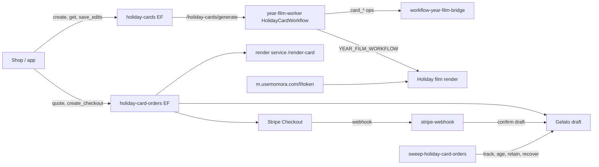

# Feature: Holiday Cards

**Status:** `in-progress` (P1 backend live 2026-10-06; P2 shop editor + app entry built 2026-10-06, not yet deployed)
**Last updated:** 2026-10-06
**Plans:** [holiday-cards.md](../plans/holiday-cards.md) (C0–C5 dogfood, Gelato lessons) ·
[holiday-cards-p1.md](../plans/holiday-cards-p1.md) (P1 backend, hardened) ·
[holiday-cards-p2.md](../plans/holiday-cards-p2.md) (P2 shop + app + handoff, hardened)

## Overview

A printed 5×7 holiday card made from the family's year: a family photo on the
front, an AI-written letter (editable) on the back, and a QR code to a
card-only holiday film on a public link. Printed and shipped by Gelato in
packs of 10 to US/CA addresses, tiered price with shipping included (10 cards
$2.99/card down to 100 at $1.79/card; table under Constraints & gotchas).

## User-facing behavior

- Owners and managers create **one card per family per year** (deleting it
  does not free the year). The greeting (`christmas | holidays | new-year`) is
  chosen at creation and fixed — it is baked into the film's end card.
- Generation takes ~1–2 minutes: front photo candidates, three letters
  (classic, warm — stored as `reflective` —, playful) in the family's caption
  language, and (if the family clears the floors) a holiday film that keeps
  rendering for ~15–20 min after the card is ready.
- Parents edit the letter, signature, layout and front photo (pick any family
  photo since Dec 1). **No letter rewrites, no film refreshes** (owner,
  2026-10-06).
- Ordering: address (US/CA) + packs → quote → Checkout. The print files and a
  Gelato draft are made before payment; after payment the only action is
  confirming that draft. Status emails on confirmation and shipping.
- **Not editable until the film is done** (owner, 2026-10-06): while the film is
  rendering (`readiness = 'film'`) the app tile and the shop show "Preparing
  (~20 min)" and `get` returns no `editorView`; when `holiday_card_readiness` flips
  to `ready` the sweep pushes the creator once ("Your holiday card is ready",
  route `holiday-card`). A film that failed/was skipped/blocked, no film at all,
  or a card older than 75 minutes counts as ready (prints without QR). Cards
  without a film (below the floors) get no push.
- Below the film floors (20 moments / 12 visuals) the card has no QR.
- Families outside US/CA can create a card (`regionWarning`) but can only ship
  to US/CA addresses. Europe is not sold (no EU VAT registration).
- No illustrated front in v1.

## Architecture



1. `create` inserts the card (`create_holiday_card`) and dispatches the
   generation Workflow once.
2. The Workflow claims the card lease (`card_start`), picks front candidates
   (ranged probe + vision judge, chunked to stay under subrequest limits),
   creates and starts the film when eligible (`create_holiday_card_film` —
   atomic, mints the token; `claim_year_film_by_id`; zero rows = the cron got
   it), writes letters from the pool digest (v2 editor + writers, quote check
   for the line of the year), then `card_finish`.
3. `create_checkout` (**pay first**, like the Memory Book) claims the card,
   freezes it (`buildCardSnapshot` + `snapshotHash`, or the first paid order's
   frozen snapshot for a reorder) and opens the Stripe session. No render, no
   Gelato draft, no print files before payment: it answers in seconds.
4. The webhook verifies amount/currency/address/hash and records `paid`; then
   `confirmPaidOrder` (`_shared/holiday-card-fulfillment.ts`, run by the webhook
   via `waitUntil` and by the sweep as fallback) does, each step idempotent and
   resumable from the order row: (a) `/render-card` to
   `print-orders/<orderId>/<hash16>/` (existing intact files for the hash and the
   order's frozen layout are reused), (b) the Gelato **draft**, (c) the held-canary
   check, (d) the PaymentIntent refund check, (e) a CAS re-check, then PATCH the
   draft into an order → `submitted`. The sweep tracks Gelato until `shipped`.
   The shop shows `paid` (no failure) as "Preparing your print files".
5. **Failure policy after payment (same as the book: owner alert, no automatic
   refund, no buyer email).** Transient problems (render 5xx/timeout, files not
   in R2, Gelato 5xx, buyer email/hold list unreadable, our own exceptions) keep
   the order `paid` and are retried by the sweep every tick (alert at 30 min,
   `failed` / `CONFIRM_TIMEOUT` at 6 h, measured from `print_files.pipelineStartedAt`).
   Content problems fail the order at once with one alert: render 422 →
   `RENDER_REFUSED:<code>` (`IMAGE_MISSING` = a photo deleted after payment: refund
   or restore/re-pick by hand), a non-retryable Gelato refusal →
   `GELATO_DRAFT_REJECTED:<code>`, an unusable row → `PRINT_PREPARE_ORDER_INCOMPLETE`.
   A recorded draft Gelato lost is forgotten and rebuilt (never failed).

## Data model

| Table / bucket | Role |
|---|---|
| `holiday_cards` | One per family+year (unique incl. soft-deleted). Status `generating \| ready \| failed`, `last_failure_code`, `greeting`, `film_id`, `share_token`, `front_candidates`, `letters`, `qr_caption`, `signature`, `editor_facts` (hidden from clients), `edits` + `edits_version` (CAS), `generation_attempts`, lease columns (hidden), `ready_notified_at` (push dedupe, hidden). RLS select: owner/manager. No client writes. |
| `holiday_card_orders` | Status `draft → quoted → checkout → paid → submitted → in_production → shipped`, `failed`, `cancelled`. Buyer-only select, column-level grants (no `gelato_cost_cents`/`print_files`); clients may insert a bare draft. |
| `year_films` (kind `family_holiday`, forced) | The card film. Readable by owners/managers through the card; never in Keepsakes/Timeline (the app filters `YEAR_FILM_KINDS`). New terminal status `ended` (card deleted). |
| `film_share_tokens` | The public QR token (`/f/:token` in `workers/memory-viewer`). |
| R2 `print-orders/<orderId>/<hash16>/` | `front.pdf` + `back.pdf`, content-addressed by the snapshot hash (a re-render never overwrites files a draft points at; a new hash gets a new Gelato draft). Deleted 30 days after shipping, at once for never-paid failed/cancelled orders, kept for paid-then-failed orders until refunded or 30 days; also on family hard delete. |

RPCs (service role): `create_holiday_card`, `save_holiday_card_edits`,
`increment_holiday_card_generation_attempt`, `create_holiday_card_film`,
`claim_year_film_by_id`, `end_holiday_card_film`. Rollback script:
`supabase/rollbacks/20261006120000_holiday_cards_down.sql` (by hand only).

## API & Edge Functions

Canonical contracts: TECH_SPEC §4.28–§4.33.

| Function / endpoint | Auth |
|---|---|
| `holiday-cards` (`create`, `get`, `picker_pool`, `save_edits`, `delete`, `disable_link`) | JWT, owner/manager |
| `holiday-card-orders` (`create_draft`, `quote`, `create_checkout`, `cancel_checkout`, `status`) | JWT, owner/manager, buyer-only |
| `stripe-webhook` (routing by `metadata.productType`) | Stripe signature |
| `sweep-holiday-card-orders` | cron secret |
| `workflow-year-film-bridge` `card_*` ops | HMAC + nonce |
| year-film-worker `POST /holiday-cards/generate` | HMAC (`DISPATCH_SIGNING_SECRET`) |
| render service `POST /render-card` | HMAC |

## Client integration

| Layer | Files | Responsibility |
|---|---|---|
| App tile | `src/components/keepsakes/holiday-card-tile.tsx`, `holiday-greeting-sheet.tsx` | Keepsakes entry above the year sections (owners/managers; shown when a card exists or the switch allows): make → greeting sheet → `create` → "being made, we'll notify you" (stays in the app; the ready push opens the shop); generating / ready / failed / ordered states. `readiness` (`generating`|`film`|`ready`|`failed`) is authoritative: the tile shows "Preparing your card…" (~20 min, push when ready) until the film is done (the summary polls every 60 s while `film`). A card ordered last year stays visible as "ordered" through Jan 31. |
| App data | `src/services/holiday-cards.ts`, `src/hooks/useHolidayCard.ts` | `holiday_card_summary` RPC (switch + billing + newest card + `ordered` + language), `createHolidayCard`, `holidayCardWebUrl`. |
| Handoff | `src/services/web-handoff.ts` (`openShopUrl`), `supabase/functions/web-handoff`, `book-renderer/src/web/auth/handoff*` | App opens `shop.usemomora.com/...#h=<code>` (books AND cards); single-use 2-min code; the shop asks "Continue as …?" and verifies in the browser; falls back to the email code. |
| Shop route | `book-renderer/src/web/router.ts` (`/c/:id`), `card/CardRouteLazy.tsx` | Lazy card chunk (own CSS + aliased print fonts — never loaded on book pages). |
| Shop editor | `book-renderer/src/web/card/` (`useHolidayCard`, `CardEditsProvider` + `editQueue`, `pickerProvider`, `CardEditorScreen`, `editorState`) | `get` → `editorView`; CAS save queue above the route (flush before ordering); front picker; QR tri-state; phone reading/editing sheet. |
| Shop checkout | `book-renderer/src/web/card/checkout/` + shared `order/CheckoutShell`, `OrderStatusLayout`, `OrderProgressStepper` | Same flow and look as the Memory Book checkout: quantity → US/CA address → quote + front/back thumbnails → `create_checkout(expectedEditsVersion)` → Stripe → status (same status page + stepper); card orders listed in `/orders`. |

### Operator runbook

- **Canary families** (who sees the app tile):
  `update holiday_card_settings set mode = 'canary', canary_family_ids = array['<family_id>']::uuid[];`
  Launch: `update holiday_card_settings set mode = 'all', closes_on = '2026-12-31';`
- **Ship-by note** shown at checkout (US):
  `update holiday_card_settings set ship_by_note = 'Order by Dec 10 for Christmas delivery in the US.';`
- **Kill switches**: new cards — `mode = 'off'`; ordering —
  `orders_enabled = false` (existing checkouts can still be cancelled).
- **Held canary** — a paid order of a listed family stops before the Gelato
  confirm, **after the print files and the draft exist** (so you can inspect them):
  `update holiday_card_settings set hold_confirm_family_ids = array['<family_id>']::uuid[];`
  Pay through the real flow → alert email "HELD_FOR_CANARY" → inspect
  (order row, Stripe payment, Gelato draft, print files). Then EITHER
  **release to print** (within 7 days — the Gelato draft's file links expire
  after 7 days):
  `update holiday_card_settings set hold_confirm_family_ids = array_remove(hold_confirm_family_ids, '<family_id>');`
  then `update holiday_card_orders set failure_reason = null where id = '<order_id>' and status = 'paid' and failure_reason = 'HELD_FOR_CANARY';`
  (the next sweep, ≤ 10 min, confirms at Gelato; the update restarts the
  6 h confirm clock), OR **abort**: refund the FULL amount in Stripe (before
  any family deletion) → the webhook deletes the draft and cancels.
  **Empty the hold list before launch.**
- **Partial refund hold**: a partially refunded paid order is held
  (`failure_reason = 'PARTIAL_REFUND_BEFORE_CONFIRM'`, alert). To print it anyway:
  `update holiday_card_orders set failure_reason = 'PARTIAL_REFUND_OK' where id = '<order_id>' and status = 'paid';`
  — the next run prints it (the marker is consumed and the acknowledgment kept in
  `print_files.partialRefundAckAt`, so a transient failure does not re-hold it).
  A FULL refund always wins: the order is cancelled and the draft deleted.
- **Failed after payment** (`RENDER_REFUSED:*`, `GELATO_DRAFT_REJECTED:*`):
  the buyer was charged and nothing prints. Refund in Stripe (the webhook
  finishes the cancel) or fix the card and rebuild by hand. Released orders keep
  a `{purgedAt}` marker in `print_files`; the sweep purges
  `print-orders/<orderId>/` once more ≥ 1 h later (`repurgedAt`).
- **Deploy order**: migration → Edge Functions → shop (rebuild `dist-web`
  from the release commit first — `memory-book-web` deploys whatever is in
  `book-renderer/dist-web`) → app OTA (1.4.3 + 1.4.2).

## Extension guide

**Safe to extend**

- Product map (`_shared/holiday-card-products.ts`): add a region (e.g. EU: A5,
  `one_pdf`, EUR — the renderer already supports A5) by adding an entry and
  its countries; the quote/checkout code is region-driven. Europe needs an
  owner decision on EU VAT first.
- Letter prompts: `_shared/holiday-card-letter-v2.ts`; iterate with
  `npm run eval:holiday-card-letters` (same modules as production).
- Front ranking: `_shared/holiday-card-photos.ts` + `eval:holiday-card-front`.

**Do not change without updating this doc**

- The snapshot shape (`_shared/holiday-card-snapshot.ts`) mirrors
  `book-renderer/src/card/types.ts` / `edits.ts`; change both together.
- Webhook routing: a session without `productType` must stay on the book path.
- Nothing renders or is created before payment (`create_checkout` only freezes
  the snapshot and opens Stripe). After payment the ONLY writer of print files
  and the Gelato draft is `confirmPaidOrder`; keep every step idempotent and
  resumable from the row, and keep the order of its steps: files → draft →
  held canary → refund check → pre-PATCH CAS → PATCH. The pipeline reads the
  ORDER's frozen `product_uid` / `file_layout` / `format` / `currency`, never the
  catalogue. Only a non-retryable Gelato API error or a render 422 may fail a
  paid order; any other exception is a retry.
- Ordered cards can't be deleted; their film skips the floors on re-render.

## Constraints & gotchas

- **Tiered price (owner, 2026-10-06; shipping included, tax extra):**

  | packs | cards | per card | total | Save |
  |---|---|---|---|---|
  | 1 | 10 | $2.99 | $29.90 | 0% |
  | 2 | 20 | $2.49 | $49.80 | 17% |
  | 3 | 30 | $2.29 | $68.70 | 23% |
  | 5 | 50 | $1.99 | $99.50 | 33% |
  | 10 | 100 | $1.79 | $179.00 | 40% |

  Server table: `US_CA_TIERS` in `_shared/holiday-card-products.ts`
  (`priceCents`, `savingsPercent`, `PACK_OPTIONS`); the cost guard compares each
  order's cost to its own tier price. The shop mirrors it in ONE module,
  `book-renderer/src/web/card/checkout/cardPricing.ts` (pinned by
  `cardPricing.test.ts`): change both together. The webhook checks
  `amount_subtotal` against the stored `price_cents`; `create_checkout` returns
  `QUOTE_STALE` when the stored price no longer equals `priceCents`, so a tier
  change forces re-quotes.
- **Repo is public:** fixtures use the fictional "Rivera Soto" family.
- **No PII in logs:** ids, statuses and codes only; Gelato errors never carry
  its `message` (it can echo addresses).
- Gelato: curl-like User-Agent (Cloudflare 1010 otherwise); 5R needs separate
  `default` + `back` files; no TrimBox; a quote is deliverable only when a
  shipment method has a real price.
- Letters store tone `reflective` for the warm angle (the renderer's tone set).
- **Only JPEG/PNG/WebP originals can be the front.** Gallery-imported iPhone
  originals are HEIC and their stored previews are ≤ 512 px, so they are
  excluded from the front pool, `picker_pool` and `save_edits`
  (`MEDIA_NOT_PRINTABLE`). Follow-up: a HEIC → JPEG print path.
- With no editor pick, the print uses front candidate #1 only — never a
  different photo than the editor shows.
- Refunds: the confirm reads the PaymentIntent before the Gelato PATCH; a
  refund that beats the paid event is matched through the charge metadata.
- Deploy order: **migration first** — `stripe-webhook` (book refunds too),
  `hard-delete-expired-accounts` and `get-year-film-url` query the new tables.
- `create_checkout`'s claim uses a CAS on `updated_at`; it fails closed.
- `claim_family_deletion_fence` was copied from `20260929120000`; compare with
  production's `pg_get_functiondef` before `db push`.

## Dependencies

- Depends on: Year Films (pipeline, worker, bridge), memory-viewer `/f`,
  book-renderer card print app, render service, Stripe billing, R2.
- Used by: P2 shop + app entry.

## Testing

| Area | Files |
|---|---|
| pgTAP | `supabase/tests/holiday_cards.sql`, `holiday_cards_p2.sql`, `holiday_card_readiness.sql` |
| Shared | `_shared/holiday-card-{products,snapshot,generate}.test.ts`, `_shared/gelato.test.ts`, `_shared/holiday-card-orders-shared.test.ts`, `_shared/year-film-worker-dispatch.test.ts` |
| Edge | `holiday-cards/`, `holiday-card-orders/`, `sweep-holiday-card-orders/`, `stripe-webhook/`, `get-year-film-url/`, `hard-delete-expired-accounts/`, `workflow-year-film-bridge/card-ops.test.ts` |
| Worker | `cloudflare/year-film-worker/test/card-*.test.ts`, `stages.test.ts` |
| Render | `render/memory-book-renderer/test/renderCard*.test.ts`, `book-renderer/scripts/lib/__tests__/cardPdfChecks.test.ts` |

```bash
npm run test:edge
npx supabase test db supabase/tests/holiday_cards.sql
(cd cloudflare/year-film-worker && npx vitest run)
(cd render/memory-book-renderer && npx vitest run)
```

## Changelog

| Date | Change |
|---|---|
| 2026-10-06 | P1 backend: tables/RPCs, generation Workflow, orders (Gelato + Stripe), sweep, `/render-card` |
| 2026-10-06 | US 5R switched to ONE 2-page PDF (`one_pdf`) after Gelato refused separate files |
| 2026-10-06 | Tiered pricing + 10-card option (packs 1/2/3/5/10, $2.99 down to $1.79 per card), "Save X%" in the shop |
| 2026-10-06 | P2: switch + summary, card-level checkout claim + version pin, reorders from the frozen first order, orders kill switch, held canary, shop editor + checkout (book-consistent), `/orders` with cards, app tile, sign-in handoff (books + cards), local sign-out |
