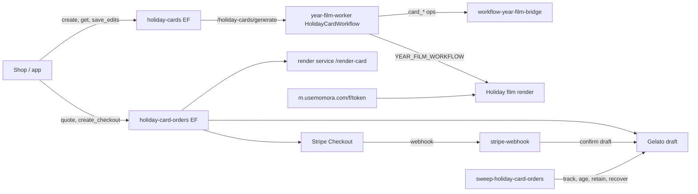

# Feature: Holiday Cards

**Status:** `in-progress` (P1 backend built 2026-10-06; P2 shop/app UI next)
**Last updated:** 2026-10-06
**Plans:** [holiday-cards.md](../plans/holiday-cards.md) (C0–C5 dogfood, Gelato lessons) ·
[holiday-cards-p1.md](../plans/holiday-cards-p1.md) (P1 backend, hardened)

## Overview

A printed 5×7 holiday card made from the family's year: a family photo on the
front, an AI-written letter (editable) on the back, and a QR code to a
card-only holiday film on a public link. Printed and shipped by Gelato in
packs of 10 to US/CA addresses, $2.49/card shipping included.

## User-facing behavior

- Owners and managers create **one card per family per year** (deleting it
  does not free the year). The greeting (`christmas | holidays | new-year`) is
  chosen at creation and fixed — it is baked into the film's end card.
- Generation takes ~1–2 minutes: front photo candidates, three letters
  (classic, warm — stored as `reflective` —, playful) in the family's caption
  language, and (if the family clears the floors) a holiday film that keeps
  rendering for ~15–20 min after the card is ready.
- Parents edit the letter, signature, layout and front photo (pick any family
  photo since Dec 1). **No letter rewrites, no film refreshes** (owner,
  2026-10-06).
- Ordering: address (US/CA) + packs → quote → Checkout. The print files and a
  Gelato draft are made before payment; after payment the only action is
  confirming that draft. Status emails on confirmation and shipping.
- Below the film floors (20 moments / 12 visuals) the card has no QR.
- Families outside US/CA can create a card (`regionWarning`) but can only ship
  to US/CA addresses. Europe is not sold (no EU VAT registration).
- No illustrated front in v1.

## Architecture



1. `create` inserts the card (`create_holiday_card`) and dispatches the
   generation Workflow once.
2. The Workflow claims the card lease (`card_start`), picks front candidates
   (ranged probe + vision judge, chunked to stay under subrequest limits),
   creates and starts the film when eligible (`create_holiday_card_film` —
   atomic, mints the token; `claim_year_film_by_id`; zero rows = the cron got
   it), writes letters from the pool digest (v2 editor + writers, quote check
   for the line of the year), then `card_finish`.
3. `create_checkout` freezes the card (`buildCardSnapshot` + `snapshotHash`),
   renders the print files, creates the Gelato draft and the Stripe session.
4. The webhook verifies amount/currency/address/hash and confirms the draft;
   the sweep tracks Gelato until `shipped`.

## Data model

| Table / bucket | Role |
|---|---|
| `holiday_cards` | One per family+year (unique incl. soft-deleted). Status `generating \| ready \| failed`, `last_failure_code`, `greeting`, `film_id`, `share_token`, `front_candidates`, `letters`, `qr_caption`, `signature`, `editor_facts` (hidden from clients), `edits` + `edits_version` (CAS), `generation_attempts`, lease columns (hidden). RLS select: owner/manager. No client writes. |
| `holiday_card_orders` | Status `draft → quoted → checkout → paid → submitted → in_production → shipped`, `failed`, `cancelled`. Buyer-only select, column-level grants (no `gelato_cost_cents`/`print_files`); clients may insert a bare draft. |
| `year_films` (kind `family_holiday`, forced) | The card film. Readable by owners/managers through the card; never in Keepsakes/Timeline (the app filters `YEAR_FILM_KINDS`). New terminal status `ended` (card deleted). |
| `film_share_tokens` | The public QR token (`/f/:token` in `workers/memory-viewer`). |
| R2 `print-orders/<orderId>/<hash16>/` | `front.pdf` + `back.pdf`, content-addressed by the snapshot hash (a re-render never overwrites files a draft points at; a new hash gets a new Gelato draft). Deleted 30 days after shipping, at once for never-paid failed/cancelled orders, kept for paid-then-failed orders until refunded or 30 days; also on family hard delete. |

RPCs (service role): `create_holiday_card`, `save_holiday_card_edits`,
`increment_holiday_card_generation_attempt`, `create_holiday_card_film`,
`claim_year_film_by_id`, `end_holiday_card_film`. Rollback script:
`supabase/rollbacks/20261006120000_holiday_cards_down.sql` (by hand only).

## API & Edge Functions

Canonical contracts: TECH_SPEC §4.28–§4.33.

| Function / endpoint | Auth |
|---|---|
| `holiday-cards` (`create`, `get`, `picker_pool`, `save_edits`, `delete`, `disable_link`) | JWT, owner/manager |
| `holiday-card-orders` (`create_draft`, `quote`, `create_checkout`, `cancel_checkout`, `status`) | JWT, owner/manager, buyer-only |
| `stripe-webhook` (routing by `metadata.productType`) | Stripe signature |
| `sweep-holiday-card-orders` | cron secret |
| `workflow-year-film-bridge` `card_*` ops | HMAC + nonce |
| year-film-worker `POST /holiday-cards/generate` | HMAC (`DISPATCH_SIGNING_SECRET`) |
| render service `POST /render-card` | HMAC |

## Client integration

None yet — P2 builds the shop editor (`/c/<cardId>`) and the app's Keepsakes
entry against the contracts above.

## Extension guide

**Safe to extend**

- Product map (`_shared/holiday-card-products.ts`): add a region (e.g. EU: A5,
  `one_pdf`, EUR — the renderer already supports A5) by adding an entry and
  its countries; the quote/checkout code is region-driven. Europe needs an
  owner decision on EU VAT first.
- Letter prompts: `_shared/holiday-card-letter-v2.ts`; iterate with
  `npm run eval:holiday-card-letters` (same modules as production).
- Front ranking: `_shared/holiday-card-photos.ts` + `eval:holiday-card-front`.

**Do not change without updating this doc**

- The snapshot shape (`_shared/holiday-card-snapshot.ts`) mirrors
  `book-renderer/src/card/types.ts` / `edits.ts`; change both together.
- Webhook routing: a session without `productType` must stay on the book path.
- After payment nothing may render or create — only the idempotent
  confirm-if-draft PATCH.
- Ordered cards can't be deleted; their film skips the floors on re-render.

## Constraints & gotchas

- **Repo is public:** fixtures use the fictional "Rivera Soto" family.
- **No PII in logs:** ids, statuses and codes only; Gelato errors never carry
  its `message` (it can echo addresses).
- Gelato: curl-like User-Agent (Cloudflare 1010 otherwise); 5R needs separate
  `default` + `back` files; no TrimBox; a quote is deliverable only when a
  shipment method has a real price.
- Letters store tone `reflective` for the warm angle (the renderer's tone set).
- **Only JPEG/PNG/WebP originals can be the front.** Gallery-imported iPhone
  originals are HEIC and their stored previews are ≤ 512 px, so they are
  excluded from the front pool, `picker_pool` and `save_edits`
  (`MEDIA_NOT_PRINTABLE`). Follow-up: a HEIC → JPEG print path.
- With no editor pick, the print uses front candidate #1 only — never a
  different photo than the editor shows.
- Refunds: the confirm reads the PaymentIntent before the Gelato PATCH; a
  refund that beats the paid event is matched through the charge metadata.
- Deploy order: **migration first** — `stripe-webhook` (book refunds too),
  `hard-delete-expired-accounts` and `get-year-film-url` query the new tables.
- `create_checkout`'s claim uses a CAS on `updated_at`; it fails closed.
- `claim_family_deletion_fence` was copied from `20260929120000`; compare with
  production's `pg_get_functiondef` before `db push`.

## Dependencies

- Depends on: Year Films (pipeline, worker, bridge), memory-viewer `/f`,
  book-renderer card print app, render service, Stripe billing, R2.
- Used by: P2 shop + app entry.

## Testing

| Area | Files |
|---|---|
| pgTAP | `supabase/tests/holiday_cards.sql` |
| Shared | `_shared/holiday-card-{products,snapshot,generate}.test.ts`, `_shared/gelato.test.ts`, `_shared/holiday-card-orders-shared.test.ts`, `_shared/year-film-worker-dispatch.test.ts` |
| Edge | `holiday-cards/`, `holiday-card-orders/`, `sweep-holiday-card-orders/`, `stripe-webhook/`, `get-year-film-url/`, `hard-delete-expired-accounts/`, `workflow-year-film-bridge/card-ops.test.ts` |
| Worker | `cloudflare/year-film-worker/test/card-*.test.ts`, `stages.test.ts` |
| Render | `render/memory-book-renderer/test/renderCard*.test.ts`, `book-renderer/scripts/lib/__tests__/cardPdfChecks.test.ts` |

```bash
npm run test:edge
npx supabase test db supabase/tests/holiday_cards.sql
(cd cloudflare/year-film-worker && npx vitest run)
(cd render/memory-book-renderer && npx vitest run)
```

## Changelog

| Date | Change |
|---|---|
| 2026-10-06 | P1 backend: tables/RPCs, generation Workflow, orders (Gelato + Stripe), sweep, `/render-card` |
