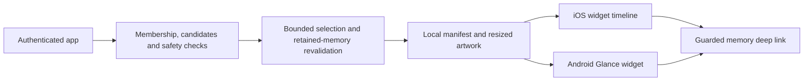

# Feature: Home-screen widget

**Status:** `implemented; release validation pending`
**Last updated:** 2026-09-17
**PRD reference:** Journey C — Revisit

## Overview

A small square iOS widget and compact tall Android widget display one memory
at a time using Looking Back's cover-card design. Android user resizing is
turned off. Widget eligibility includes every saved memory date, including
today, and works with just one eligible photo or illustrated memory. This is separate from Looking Back's
archive packages and never marks a package as viewed.

Implementation is complete. See the [implementation plan](../plans/home-screen-widget.md)
for scope and the [readiness report](../testing/home-screen-widget-readiness.md)
for measured checks and remaining release gates. The backend migration is live; native delivery is in development builds, not a store release.

## User-facing behavior

- Momora automatically prepares the current family's eligible images for this
  device/account/family while the account is signed in. Open Settings for the
  platform instructions, then add the widget through the phone's widget picker.
- The Settings page includes a full-width “Show another memory” action for a
  manual shuffle; no opt-in toggle or completion button is required.
- Android photo/illustration cards crop artwork edge-to-edge inside the rounded
  widget, with no colored inset frame. A 28dp Momora “m.” brand badge sits at the
  top right, inset 10dp. Neither platform shows a date or caption overlay.
- Only photo memories and ready, unreported illustrations are eligible. Text-only,
  audio-only, video-only, pending/failed illustrations, and reported artwork are
  excluded before the database candidate cap and again before client selection.
  Mixed media memories qualify only when they contain a photo.
- iOS explicitly resizes artwork to the widget container before applying cover
  cropping. Portrait/landscape photos retain their aspect ratio; square framing
  still crops their longer dimension.
- Unavailable artwork uses another successfully staged image, or a neutral Momora
  card when none succeeds. It never falls back to journal text. Caption fields
  retained for schema compatibility contain only generic copy in new manifests.
- “Show another memory” randomly selects among eligible candidates not yet shown
  in this app session, excluding the current card when alternatives exist. It
  starts a new cycle only after that pool is exhausted. History tracks displayed
  cards, not future scheduled slots; automatic refreshes preserve the current
  card. With one eligible memory the button keeps it. A process restart resets
  shuffle history. The database still supplies a daily sample of at most 40
  candidates; this is not an exhaustive shuffle of an unlimited archive.
- Tap the card to open its memory through normal account/family access checks.
- Cached cards rotate at 08:00, 13:00, and 18:00 in the validated family
  timezone for at most 168 elapsed hours after online validation. The app may
  publish up to 24 dated timeline entries, while retaining at most seven
  unique memory IDs and seven unique local image files. An older installed
  native binary safely falls back to the original seven-entry daily timeline;
  full daytime coverage requires a new native build. After the lease expires,
  the widget asks the user to open Momora to refresh.
- Logout, opt-out, account/family change, known access loss, and content safety
  changes clear or replace affected cards. Widget work never delays saving.

## Architecture

The app prepares content. Native widgets read local snapshots without needing
Supabase credentials. Signed image URLs are only used to obtain local artwork;
they are not stored as long-lived widget image sources.

## Data model

Existing memories, media assets, family memberships, and personal report/block
state remain authoritative. No widget package table or new R2 bucket is needed.
The local cache is scoped by account, family, and generation, with explicit
validation and expiry timestamps. No journal content belongs in logs or URLs.

## API & Edge Functions

`get_widget_memory_candidates(p_family_id)` returns up to 40 IDs, age bands,
and the family-local clock. `get_widget_family_timezone(p_family_id)` checks
exact-family membership before reading the owner's timezone; user profile RLS
remains own-row-only. The empty-family response is one null-memory sentinel
carrying the clock. No new Edge Function, AI generation, or scheduled server
job is required. See [TECH_SPEC.md](../TECH_SPEC.md) for the SQL contract.

## Client integration

| File | Responsibility |
| --- | --- |
| `src/services/widget-memories.ts` | Bounded candidate and retained-ID reads |
| `src/utils/widget-selection.ts` | Deterministic age-band selection and local-day timeline |
| `src/services/widget-cache.ts` | Scoped staging, resizing, cancellation and serialized publication |
| `src/hooks/useMemoryWidgetSync.ts` | Online validation and app/account lifecycle coordination |
| `src/widgets/types.ts`, `manifest.ts` | Shared snapshot contract and validation |
| `src/widgets/native-adapter.ts` | Optional native bridge, capability negotiation and iOS timeline publication |
| `src/widgets/MomoraMemoryWidget.tsx` | Isolated iOS widget layout |
| `modules/momora-widget/` | Native cache and Android widget |
| `plugins/withMomoraWidget.js` | Android receiver and fixed tall widget configuration |

Do not copy React Native components into the iOS isolated widget runtime.
Its props contain only display text, local image paths, and guarded links;
account credentials and signed media URLs never enter the timeline.

## Extension guide

- Keep the seven-day expiry independent of calendar-day/DST duration.
- Treat `startsAt` as an already resolved UTC instant from the family timezone;
  do not reconstruct 08:00, 13:00, or 18:00 on the device.
- Keep timeline entry capacity separate from retained storage: up to 24 entries
  may reference at most seven unique memory IDs and seven unique image files.
- Read `maxTimelineEntries` from the native capability. Missing or invalid
  capability data means seven entries for compatibility with older binaries;
  the daytime path is selected only when the native binary explicitly supports
  24 entries.
- Revalidate retained IDs even when they are absent from a new candidate sample.
- Scope changes invalidate pending work before it can publish.
- Native schema changes require compatible app/native versions.
- Future sizes or interactive controls require explicit design and release work.

## Constraints & gotchas

Phones control scheduling and may retain rendered snapshots. Offline devices
cannot immediately learn remote deletions or membership revocation; expiration
is not a guaranteed screen-erasure deadline. Never extend a lease after failed
validation. Session-only “Show anyway” does not authorize persistent exposure.

Initial delivery and widget design changes use new store builds. Existing
incoming-share extension storage must stay separate from widget storage.

### Daytime rotation and native compatibility

The app validates the family timezone online, resolves the three daytime
boundaries to UTC instants, and publishes those instants in ascending
`startsAt` order. The immediate snapshot plus future daylight boundaries fit
the 24-entry manifest contract, including DST days where elapsed spacing is not
uniform. iOS receives every manifest entry and a neutral lease-expiry entry.
Android uses one-time WorkManager work for the next actual `startsAt`, then for
`expiresAt`; it does not use a periodic 24-hour or 15-minute approximation.

Native capability negotiation is explicit. The current native module advertises
`maxTimelineEntries: 24`. A pre-daytime binary has no such field and the adapter
reports the safe legacy capacity of seven, so the client keeps its original
seven daily slots. The adapter rejects an oversized publish before calling an
older module. Installing a new native build is required for the full seven-day
daytime schedule.

## Dependencies

- [Looking Back](./looking-back.md): visual language and safe artwork selection.
- [Family sharing](./family-sharing.md): membership and role-scoped access.
- [Content reporting](./content-reporting.md): persistent personal safety state.
- [Subscriptions](./subscriptions.md): existing archive read access.

## Testing

Automated coverage includes:

- `src/utils/widget-selection.test.ts`: age bands, one-memory rotation, calendar/lease behavior.
- `src/services/widget-memories.test.ts` and `.integration.test.ts`: candidate and retained-memory authorization/read contracts.
- `src/services/widget-cache.test.ts` and `widget-image-staging.test.ts`: publication ordering, 24-entry manifests, seven-image storage limits, staging limits and cancellation.
- `src/hooks/useMemoryWidgetSync.integration.test.tsx` and `.lifecycle.integration.test.tsx`: safety, revalidation, account and async lifecycle fences.
- `src/widgets/manifest.test.ts`: 24-entry acceptance, 25-entry rejection, and seven-ID/seven-image limits.
- `src/widgets/native-adapter.adversarial.test.ts`: capability negotiation, old-binary fallback, all-entry iOS timelines, scope-safe clear and timeline failures.
- `src/screen-tests/widget-entry.adversarial.integration.test.tsx`: guarded routing and family switch behavior.
- `src/components/widget-setup-screen.test.tsx` and `app-providers.test.tsx`: settings and app-wide integration.
- `plugins/withMomoraWidget.test.ts`: native generation configuration.
- `modules/momora-widget/android/src/test/java/expo/modules/momorawidget/WidgetManifestParserTest.kt`: native manifest/lease validation.
- `modules/momora-widget/android/src/test/java/expo/modules/momorawidget/WidgetRefreshSchedulerTest.kt`: next 08:00/13:00/18:00 instant, next-day and lease-expiry scheduling metadata.
- `modules/momora-widget/android/src/test/java/expo/modules/momorawidget/WidgetIntentTest.kt`: real Android Intent semantics under Robolectric, including ACTION_VIEW, target IDs, neutral content and distinct pending-intent identity.
- `scripts/test-widget-runtime.cjs`: actual isolated Expo runtime rendering and privacy on expiry.
- `supabase/tests/widget_memory_candidates.sql`: 47 SQL authorization/selection assertions.
- `.maestro/flows/widgets/setup-and-open.yaml`: authenticated automatic-preparation and routing flow, authored but not yet executed.

See the [readiness report](../testing/home-screen-widget-readiness.md) for counts,
build evidence, baseline typecheck failures, and physical-device release gates.

### Android tap and artwork follow-up

Widget taps use an explicit app activity with `ACTION_VIEW`, preserving the
family/memory/media-index URI and warm-start flags. `ACTION_MAIN` is unsuitable:
React Native ignores its URI on both initial and subsequent intents. The route
still performs the membership and memory-access checks. The brand badge reuses
`assets/images/icon-512.png` unchanged as the native drawable. These Android
layout and intent changes require a new native build.
