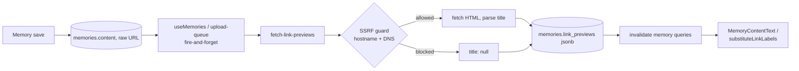

# Feature: Inline links in memory text

**Status:** `done`
**Last updated:** 2026-07-12
**PRD reference:** —

## Overview

When a memory's text contains a pasted URL, rendered (non-editing) views show
it as an on-brand inline link — `(Page Title)`, parentheses included in the
tappable span — instead of the raw URL. Titles are fetched server-side,
asynchronously, after the memory saves; capture-first is preserved (text
saves immediately, title fetching never blocks or fails a save). Until a
title exists, or if the fetch fails, the link falls back to the domain:
`(youtube.com)`.

## User-facing behavior

- Memory detail screen (both the framed/illustrated layout and the editorial
  text-only layout) renders pasted URLs as `(Title)` in `colors.sea`, no
  underline. Tapping opens the URL in the phone's **default browser**
  (`Linking.openURL`) — never an in-app browser.
- **Spoofing mitigation:** the title is third-party-controlled and hides the
  real destination. **Long-press** a link to see the full URL in an alert
  with Open/Cancel actions before deciding to open it.
- Card previews (timeline `memory-card.tsx`, calendar day rows, the family
  member's memory list) substitute `(Title)` / `(domain)` as **plain, quiet
  text** — not tappable there. The whole card is already a `Pressable`, and a
  nested tap target inside truncated `numberOfLines` text would conflict with
  it, so these renders are inert.
- **The editor stays plain text.** `new-memory` and `edit` show and let the
  user edit the raw URL — RN `TextInput` is plain text; rich editing/live
  link chips are out of scope. Pretty links only ever appear in rendered
  (non-editing) views.
- A URL the user already wrapped in parens renders as `((Title))` — known,
  accepted edge case (the user's own parens stay as plain text; the link's
  own parens are added on top). Low-priority nicety, not implemented: skip
  adding parens when the raw text already has them immediately around the URL.

## Architecture



1. User types or pastes a URL into memory text; it saves as plain text in
   `memories.content`, same as always — no special handling at save time
   beyond the existing content validation.
2. `useMemories`' create/update mutations (and the media upload queue for
   captions) fire `fetchLinkPreviews(memoryId)` fire-and-forget when content
   contains a URL (create) or whenever content was part of the edit (update
   — this also covers edits that *remove* the last URL, so stale entries get
   pruned).
3. `fetch-link-previews` extracts the first 5 unique URLs from the DB's own copy of
   `content`, diffs against the stored `link_previews` map, fetches new/
   previously-failed titles in parallel through a two-layer SSRF guard, and
   writes the merged map via the service-role client — guarded against
   clobbering a concurrent content edit.
4. On success, the client invalidates memory queries; the next fetch/render
   picks up the new `link_previews` and substitutes titles in place of raw
   URLs.

## Data model

| Table / field | Role in this feature |
|----------------|----------------------|
| `memories.content` | Untouched — always the raw text the user typed, URLs included. Non-destructive: edit shows exactly what was typed; a failed fetch just degrades to a domain label. |
| `memories.link_previews` | New `jsonb not null default '{}'`. Shape: `{ [url]: { title: string \| null, fetchedAt: string } }`. `title: null` = fetch attempted and failed (client renders the domain). Written only by `fetch-link-previews` via the service-role client. All memory queries already `select('*')`, so this column flows to every screen with zero query changes. |

No RLS changes — the column rides the existing `memories` policies.

## API & Edge Functions

| Function | Input | Output | Auth |
|----------|-------|--------|------|
| `fetch-link-previews` | `{ memoryId }` | `{ linkPreviews: Record<url, { title, fetchedAt }> }` | JWT, any family role |

See [TECH_SPEC.md §4.13](../TECH_SPEC.md#413-fetch-link-previews) for the
full request/response contract, logic steps, and error codes.

### SSRF guard (two layers, applied to the initial URL and every redirect hop)

1. **Hostname rules** (`isFetchableUrl` in `_shared/link-preview.ts`, sync).
   Reject non-http(s) schemes, non-default ports, userinfo (`user:pass@`),
   `localhost`/`*.local`/`*.internal`, and any IP-literal host (v4 or v6,
   including bracketed IPv6 and decimal/octal/hex-encoded IPv4 — the WHATWG
   `URL` parser normalizes those to dotted-quad before the hostname check
   ever sees them, so the check reads `new URL(url).hostname`, never a
   string regex on the raw URL).
2. **DNS resolution** (`resolvesToBlockedAddress`, async). Hostname rules
   alone don't stop an innocuous-looking domain whose A/AAAA record points
   at a private or metadata IP (the classic SSRF bypass). Before every
   fetch, resolve the hostname and reject if any address is loopback,
   private (`10/8`, `172.16/12`, `192.168/16`), link-local/metadata
   (`169.254/16`, including `169.254.169.254`), unspecified, or an
   IPv4-mapped IPv6 form of any of those. **Known limitation:** the window
   between resolve and fetch is a residual TOCTOU/DNS-rebinding gap —
   accepted (single fetch, no attacker-observable timing loop, isolated Edge
   runtime).

Redirects are followed manually (`redirect: 'manual'`, max 3 hops), re-running
**both** layers on every hop's URL — a redirect to a blocked host is never
followed. Per-fetch timeout 5s; only `text/html` responses are read, capped
at 128 KB; a desktop User-Agent is sent (many sites, including YouTube,
serve junk or 403 to unknown agents). Titles prefer `og:title`, fall back to
`<title>`, decode basic HTML entities, strip ASCII control chars **and**
Unicode bidi/format control chars (a hostile title could otherwise visually
reorder the rendered span), collapse whitespace, and cap at 200 chars — no
suffix stripping (a YouTube title keeps "- YouTube" verbatim). Any failure
for one URL never throws or aborts the batch — it just yields `title: null`.

## Client integration

| Layer | Files | Responsibility |
|-------|-------|----------------|
| Routes | `app/(app)/memory/[id]/index.tsx` | Detail screen — both layouts render `content` via `MemoryContentText` |
| Routes | `app/(app)/(tabs)/calendar.tsx`, `app/(app)/family/[id]/index.tsx` | Raw preview rows — wrap `content` in `substituteLinkLabels(...)` (plain text, not tappable) |
| Hooks | `src/hooks/useMemories.ts` | create/update mutation `onSuccess` fires `fetchLinkPreviews` |
| Hooks | `src/hooks/use-pending-memory-uploads.tsx` | `runUpload` fires `fetchLinkPreviews` when a media caption has a URL |
| Services | `src/services/ai.ts` | `fetchLinkPreviews(memoryId)` — thin `invokeEdgeFunction` wrapper |
| Utils | `src/utils/links.ts` | `extractUrls`, `splitContentIntoSegments`, `linkLabel`, `substituteLinkLabels`, `toLinkPreviewMap` — client mirror of the extraction/formatting half of `_shared/link-preview.ts` (no fetching/SSRF logic; that only ever runs server-side) |
| Utils | `src/utils/memories.ts` | `formatMemoryExcerpt(content, maxLength, linkPreviews?)` applies substitution before truncation |
| Components | `src/components/memory-content-text.tsx` | `MemoryContentText` — renders segments, tappable link spans, long-press reveal |
| Components | `src/components/memory-card.tsx` | Both card variants pass `toLinkPreviewMap(memory.link_previews)` into `formatMemoryExcerpt` |

### How to invoke from another feature

1. Read `memory.link_previews` (typed `Json` on `MemoryWithTags`) and narrow
   it with `toLinkPreviewMap` from `src/utils/links.ts` — never trust the
   jsonb shape directly, malformed entries are treated as absent.
2. For a rendered (tappable, non-editing) view, use
   `<MemoryContentText content={...} linkPreviews={...} style={...} />` and
   let it inherit the surrounding text style.
3. For a plain-text preview/excerpt, use `substituteLinkLabels(content,
   linkPreviews)` directly, or pass `linkPreviews` as the third argument to
   `formatMemoryExcerpt`.
4. To trigger a (re-)fetch after a content change outside the existing
   trigger points, call `fetchLinkPreviews(memoryId)` fire-and-forget (never
   await it on a save path) and invalidate memory queries in `.then()`.

## Extension guide

**Safe to extend**

- Adding more metadata to a `link_previews` entry (e.g. `imageUrl` for a
  favicon/embed) — extend the shape in both mirrored `LinkPreviewEntry`
  types (`_shared/link-preview.ts` doesn't define the entry shape itself;
  `fetch-link-previews/index.ts` and `src/utils/links.ts` do) and the
  `isLinkPreviewEntry`/`normalizeLinkPreviews`/`toLinkPreviewMap` narrowing
  functions in both places.
- Additional raw-render call sites that need plain-text link substitution —
  wrap in `substituteLinkLabels`, same as calendar/family list.
- A title-refresh affordance (manual re-fetch) — call the existing
  `fetchLinkPreviews` service function; no new Edge Function needed.

**Do not change without updating this doc**

- The URL regex in `_shared/link-preview.ts` and `src/utils/links.ts` must
  stay byte-for-byte identical (Deno functions can't import from `src/`).
- Never feed a fetched `title` into an OpenAI prompt (untrusted third-party
  content — prompt-injection surface). `stripUrls` already strips the raw
  URLs themselves from every prompt call site; titles must never enter a
  prompt at all, stripped or not.
- The `updated_at` vs `content` write-guard choice in `fetch-link-previews`
  (§4.13) — an `updated_at` guard would silently discard fetched titles on
  almost every new memory, since the AI pipeline bumps `updated_at`
  concurrently and usually lands first.

**Common extension patterns**

- New raw-render site showing memory content as plain preview text → wrap in
  `substituteLinkLabels`.
- New rendered (tappable) view of full memory content → use
  `MemoryContentText`.
- New AI prompt call site that reads `memory.content` → strip URLs with
  `stripUrls` before building the prompt, and add an empty-after-strip guard
  if nothing else in that code path already handles an empty prompt.

## Constraints & gotchas

- Cap **5 unique URLs** per memory — repeated occurrences of those first five
  destinations are all linkified, while later unique URLs stay raw and are
  not fetched.
- Fetch/prune only runs when content changes (or on the first create with a
  URL) — no background retry loop; a `title: null` entry is retried on the
  *next* content edit, not automatically.
- Never log memory content, URLs, or titles anywhere (repo privacy rule) —
  `fetch-link-previews` logs ids and status codes only.
- Editor (`new-memory`/`edit`) never renders pretty links — this is a
  render-time-only feature, storage stays plain text (see the AGENTS.md
  product constraint line amendment).
- `formatMemoryExcerpt`'s third argument is optional and defaults to
  "leave raw URLs alone" — only call sites that pass `linkPreviews`
  (even as `{}`) get substitution; this keeps any future/unrelated caller's
  behavior unchanged unless it opts in.
- `searchMemories` still matches raw URLs in `content` (unchanged, out of
  scope) — search does not search fetched titles.
- Out of scope (see plan §12): rich text editing / live link chips in
  `TextInput`; link cards/embeds/favicons/image previews; stripping tracking
  params from URLs; title-refresh UI.

## Dependencies

- Depends on: [memories.md](./memories.md) (base memory save/detail/card flow)
- Used by: nothing yet — extension point for future embeds/favicons

## Testing

See [TESTING.md](../TESTING.md).

### Unit tests

| File | Covers |
|------|--------|
| `src/utils/links.test.ts` | URL extraction incl. trailing punctuation/ellipsis, multiple URLs, no-URL text; first-five-unique rendering cap with repeat handling; segment splitting incl. the `((Title))` edge case; `linkLabel` preview-vs-domain fallback; `substituteLinkLabels`; `toLinkPreviewMap` malformed-entry handling |
| `src/utils/memories.test.ts` | `formatMemoryExcerpt` substitution + truncation interplay (truncates the substituted string, not the raw URL) |
| `src/components/memory-content-text.test.tsx` | Renders text/link segments with parens and enforces the first-five-unique cap; `Linking.openURL` called with the raw URL on press; non-http(s) URL not opened; long-press reveals the full URL via Alert; `Linking.openURL` rejection shows an alert instead of failing silently |

### Integration tests

| File | Scenarios |
|------|-----------|
| `src/hooks/useMemories.integration.test.tsx` | Create with a URL in content triggers `fetchLinkPreviews` + invalidation; create with no URL does not; update triggers whenever content changed (even removing the last URL); update that doesn't touch content does not trigger; create/update still resolve when the fetch rejects |
| `src/hooks/use-pending-memory-uploads.test.tsx` | Media-memory caption containing a URL triggers `fetchLinkPreviews`; no caption / no-URL caption does not; upload still completes when the fetch rejects |

### E2E (Maestro)

| Flow | Scenario |
|------|----------|
| `.maestro/flows/memories/inline-link.yaml` | Create a text memory containing `https://example.com`, open its detail, assert either the fetched title or the `(example.com)` domain fallback is visible (best-effort — network-dependent, tolerates either outcome) |

### Edge Function tests (Deno)

| File | Covers |
|------|--------|
| `supabase/functions/_shared/link-preview.test.ts` | Extraction parity with the client; SSRF rejections (IP literals incl. bracketed IPv6 and normalized decimal/hex IPv4 forms, `localhost`/`*.local`, DNS resolving to private/metadata ranges via mocked `Deno.resolveDns`, redirect to a blocked host, bad scheme/port/userinfo); title parsing (`og:title` precedence, entity decoding, bidi-char stripping, 200-char cap, suffix preserved verbatim); `stripUrls` |
| `supabase/functions/fetch-link-previews/index.test.ts` | 401 unauthenticated, 405 method; prune-removed-URL + keep-existing-title merge logic (`planLinkPreviewFetch`); `title: null` on fetch failure/rejection; cap at 5 URLs; write skipped when `content` changed mid-flight or the memory disappeared; malformed jsonb entries normalized to absent |
| `supabase/functions/analyze-emotion/index.test.ts` | `analyzeTextIllustrationEmotion` strips URLs from the prompt sent to OpenAI |

### Run this feature's tests

```bash
npm test -- --testPathPattern="links|memory-content-text|useMemories|use-pending-memory-uploads"
maestro test .maestro/flows/memories/inline-link.yaml
deno test supabase/functions/_shared/link-preview.test.ts supabase/functions/fetch-link-previews/
```

## Changelog

| Date | Change |
|------|--------|
| 2026-07-12 | Initial implementation |
