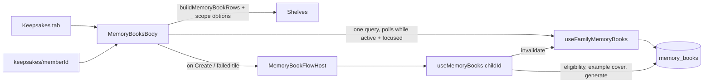

# Feature: Keepsakes

**Status:** `in-progress` (books shipped; films arrive with Year Film P2)
**Last updated:** 2026-09-29
**PRD reference:** [Memory Book plan](../plans/memory-book.md), [Year Film plan](../plans/year-film.md) §8
**Plan:** [timeline-calendar-keepsakes.md](../plans/timeline-calendar-keepsakes.md) Phase C

## Overview

The Keepsakes tab (which replaced the Calendar tab) is the home for everything
Momora *makes* from a family's memories: Memory Books today, and Year Films
(monthly, birthday, year-end) once Year Film P2 ships. Books used to live
one child at a time behind a row on each child's profile. They now live
together, one shelf per child, and the profile keeps a "See {name}'s
keepsakes" link into that child's shelf.

## User-facing behavior

- **Tab** (`app/(app)/(tabs)/keepsakes.tsx`, tab icon: gift / `redeem`):
  - Title "Made from your moments."
  - **One shelf per own child**, plus any member who already has a book
    (never hide an existing book). "Own child" = `isOwnChild`
    (`src/utils/family-relationships.ts`, mirrors the Edge rule): an
    explicit role wins (`child` yes, any other role no), and unsorted
    members fall back to under-13 by birthday. A niece sorted as "Cousin"
    gets no shelf.
  - A shelf shows the child's book-cover tiles (ready / generating /
    failed). A child with no books yet gets a compact "Create {name}'s first
    book" tile.
- **Empty state** (no books anywhere): **one family-level pitch**, not one
  per child.
  - Headline: "Your family's years, printed and bound." The layflat bullets
    are unchanged, and the example cover is a real photo of the first
    child.
  - The CTA "Create a book" opens a **"Whose book?"** picker when there's
    more than one shelf. It goes straight to the create sheet for a
    one-child family.
  - With no child at all, the CTA reads "Go to Family" and shows a hint to
    add the child with their birthday.
- **Tiles:** ready → opens the web book (`shop.usemomora.com/b/<id>`);
  failed → the retry sheet; generating → not tappable (it polls).
- **Viewers:** books stay owner/manager-only (owner decision 2026-09-15). The
  tab shows viewers only "Books and films your family makes will show up
  here." Opening books to viewers is a separate decision (RLS already allows
  select).
- **One child's keepsakes** (`app/(app)/keepsakes/[memberId].tsx`,
  `memoryBooksRoute(memberId)`):
  - Opened from the child profile row "See {name}'s keepsakes" (owner/manager
    only, as before) and from book-ready/failed pushes.
  - The same body filtered to one child, with the personalized pitch ("A year
    of {name}, printed and bound.") when empty.
  - Viewers who reach it see existing books read-only.
  - On a cold-start push with no history, Back goes to Family.

## Architecture

- **One family-wide query.** `useFamilyMemoryBooks` (`fetchMemoryBooksForFamily`,
  key `familyMemoryBooksQueryKey` = `['memory-books', familyId, 'family']`)
  feeds every shelf, so shelf membership and contents can't disagree.
  - Rows per child: `buildMemoryBookRows(buildMemoryBookScopeOptions(dob,
    todayIso), books)`. This is the same pure builder `useMemoryBooks` uses,
    including the `pickRelevantBook` active > ready > failed tie-break.
  - Polls every 4s only while a book is queued/generating **and** the screen
    is focused, because tab screens never unmount.
- **Create/retry is per child and lazy.** `MemoryBookFlowHost` mounts
  `useMemoryBooks` (eligibility counts, suggestions, `generate`) only once a
  flow starts, for that one child.
  - It stays mounted after its sheet closes so an in-flight generate call can
    finish.
  - `useMemoryBooks` invalidates the family key after every write, so the
    shelf updates without waiting for a poll.
- **"Today"** decides the scope options. The tab recomputes it on every focus
  and passes it down. It's part of the eligibility query key
  (`memoryBookEligibilityQueryKey(..., todayIso)`), so a tab left open past
  midnight doesn't reuse stale counts.
- **CTA and toast offsets:** on the tab they clear the floating tab bar
  (`max(28, insets.bottom + 8)` on Android, 28 on iOS, plus the ~50pt bar).
  On the stack route they sit above the bottom inset.

## Data model

No schema change. Reads `memory_books` (all of a family's rows, the same
`MEMORY_BOOK_LIST_COLUMNS`) and `family_members.relationship` /
`date_of_birth` (shelf membership). See
[memory-book-generation.md](./memory-book-generation.md) for the table and
generation pipeline.

## Client integration

| Layer | Files | Responsibility |
|-------|-------|----------------|
| Routes | `app/(app)/(tabs)/keepsakes.tsx`, `app/(app)/keepsakes/[memberId].tsx` | Tab (focus → today + poll gate + `keepsakes_opened`) and the one-child route |
| Components | `src/components/memory-books/memory-books-body.tsx` (`MemoryBooksBody`, `MemoryBookFlowHost`), `child-picker-sheet.tsx`, plus the existing `book-cover-tile`, `create-book-sheet`, `retry-book-sheet`, `book-toast` | Shelves, pitch, CTA, the create/retry flow |
| Hooks | `src/hooks/useMemoryBooks.ts` (`useFamilyMemoryBooks`, `useMemoryBooks`, `buildMemoryBookRows`) | Family query + polling; per-child create/retry |
| Services | `src/services/memory-books.ts` (`fetchMemoryBooksForFamily`) | Family-wide read |
| Utils | `src/utils/family-relationships.ts` (`isOwnChild`) | Shelf membership |
| Analytics | `keepsakes_opened`, `keepsakes_create_book_tapped { children_count }` | [analytics.md](./analytics.md) |

### Extension guide

- **Year Film P2:** add the Films section in `keepsakes.tsx` above
  `MemoryBooksBody` (the slot comment marks it). Show upcoming-film cards
  ("Mara's Year One arrives Nov 11") so the tab is never empty, and show
  films to viewers too. The Year Film plan's "Print this year" opens this
  child's create flow (`memoryBooksRoute(childId)`, or a preset scope
  param).
- **Opening books to viewers:** drop the `variant === 'tab' && !canGenerate`
  early return in `MemoryBooksBody`. RLS already allows select.
- **New shelf rule:** change the `shelfMembers` filter in `MemoryBooksBody`.
  Keep "has a book" in it so an existing book never disappears.

## Testing

- `src/screen-tests/keepsakes.integration.test.tsx`:
  - one-child route: tiles per state, web open, retry, create + toast,
    viewer read-only, personalized pitch, cold-start Back;
  - tab: own-child shelves (a cousin is excluded, a member with a book is
    included), one family pitch + "Whose book?", the picker skipped for one
    child, no child → Family, viewer message.
- `src/hooks/useMemoryBooks.integration.test.tsx` (`useFamilyMemoryBooks`
  grouping, focus-gated polling, family invalidation after generate).
- `src/utils/family-relationships.test.ts` (`isOwnChild`).
- `src/components/floating-tab-bar.test.tsx`.
- Maestro: `keepsakes/open-keepsakes.yaml`, `check-icons.yaml`,
  `sharing/viewer-readonly.yaml`.

## Changelog

| Date | Change |
|------|--------|
| 2026-09-29 | Keepsakes tab replaces Calendar; books move off the child profile (plan Phase C) |
