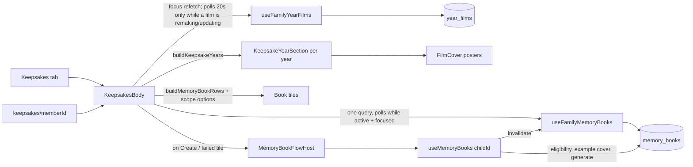

# Feature: Keepsakes

**Status:** `in-progress` (books shipped; films land with Year Film P2)
**Last updated:** 2026-10-02
**PRD reference:** [Memory Book plan](../plans/memory-book.md), [Year Film plan](../plans/year-film.md) §8
**Plan:** [timeline-calendar-keepsakes.md](../plans/timeline-calendar-keepsakes.md) Phase C

## Overview

The Keepsakes tab (which replaced the Calendar tab) is the home for everything
Momora *makes* from a family's memories: Memory Books and Year Films
(monthly, birthday, year-end; see [year-film.md](./year-film.md)). Books used to live
one child at a time behind a row on each child's profile. They now live
together, one shelf per child, and the profile keeps a "See {name}'s
keepsakes" link into that child's shelf.

## User-facing behavior

- **Tab** (`app/(app)/(tabs)/keepsakes.tsx`, tab icon: gift / `redeem`):
  - Title "Made from your moments."
  - **One section per year**, newest first (`buildKeepsakeYears`,
    `keepsakes-year-{year}`; the current year always exists, and a year with
    nothing to draw renders nothing). Films file under the year of their
    `placement_date`; books under the year of `scope_end_date` (an
    "everything" book, which has none, under `created_at`).
    - **Family films** (`keepsakes-family-films-{year}`): the year-end film as
      a large tile (cover about half the width), then the latest **3** monthly
      recaps as small covers. With more than three, "See all {year} recaps"
      (`keepsakes-recaps-{year}`) opens the grid at
      `app/(app)/keepsakes/recaps/[year].tsx` (`keepsakeRecapsRoute(year)`;
      logs `year_film_recaps_opened`).
    - **Upcoming card** (`keepsakes-upcoming-recap`, current year only): a
      dashed "{Month} recap · {Mon 1}" card, e.g. "October recap · Nov 1".
      It shows only when `useYearFilmsEnabled(familyId)` (the server's
      `year_films_enabled`) is true, so it never promises a recap that can't
      come.
    - **One shelf per own child** (`keepsakes-shelf-{year}-{memberId}`, a
      horizontal row): that child's **birthday-film covers first, then that
      year's book tiles** (ready / generating / failed). "Own child" =
      `isOwnChild` (`src/utils/family-relationships.ts`, mirrors the Edge
      rule): an explicit role wins (`child` yes, any other role no), and
      unsorted members fall back to under-13 by birthday. A niece sorted as
      "Cousin" gets no shelf, but anyone with a book or a birthday film keeps
      one (never hide an existing book). A shelf with nothing in it is
      skipped.
    - The current year's shelf carries the compact "Create {name}'s first
      book" tile for a child with no book at all (owners/managers only).
  - Film tiles (`keepsakes-film-{filmId}`) open the player:
    `router.push(yearFilmRoute(id, 'keepsakes'))`. Titles come from
    `filmTitle`; covers are `FilmCover`.
  - **Tile states** (`filmDisplayState`, see [year-film.md](./year-film.md)
    "Remaking"): a film whose edit removed moments is *remaking* -- the same
    tile slot shows a paper placeholder with a soft pulse and "Remaking…"
    (`keepsakes-film-{filmId}-remaking`, not pressable, no poster request);
    a film re-rendering for a music/quote edit is *updating* -- the normal
    playable tile plus an "Updating…" badge (`keepsakes-film-{filmId}-updating`).
    A blocked film whose remake failed is hidden (filtered in the hook). The
    recaps grid and the child page use the same tile, so the states apply there.
- **Empty state** (no books **and** no films anywhere): **one family-level
  pitch**, not one per child, below whatever year sections exist (e.g. the
  upcoming card).
  - **Films first (2026-10-02):** until films are really coming
    (`year_films_enabled`: 10+ moments this month and a kid with a birthday,
    when the current year's section shows the dated upcoming card instead),
    the pitch opens with a FILMS block (`keepsakes-films-intro`): "A little
    film of your month." -- any month with 10+ moments becomes a film on the
    1st, birthdays get their own (plus "once your kids' birthdays are in
    Family" when no own child has one). It explains, never promises. The
    book part follows under a BOOKS eyebrow. The Family-page stack variant
    stays books-only.
  - Headline: "Your family's years, printed and bound." The layflat bullets
    are unchanged, and the example cover is a real photo **or finished
    illustration** of the first child (`fetchExampleCoverAssetKey`), falling
    back to their portrait until one exists. While the cover is the portrait
    fallback, the lookup re-runs on every tab focus, so the first
    illustration replaces it as soon as it lands (2026-10-02; illustrations
    were missing, so a family fresh out of onboarding got a blank cover).
  - The CTA "Create a book" opens a **"Whose book?"** picker when there's
    more than one shelf. It goes straight to the create sheet for a
    one-child family.
  - With no child at all, the CTA reads "Go to Family" and shows a hint to
    add the child with their birthday.
- **Create sheet with nothing makeable yet (2026-10-02):** when no book was
  ever requested and every scope's loaded count is under the ~30-memory
  threshold (`hasNoBookReadyScope`, `create-book-sheet.tsx`), the sheet
  replaces the list of dead-end options with "{name}'s first book needs a
  few more memories", the count against ~30 with a progress bar, a "Look
  through my photos" gallery-import offer (only when gallery import is
  enabled; it closes the sheet and opens `/(app)/gallery-import` with
  `surface: 'keepsakes'`), and a quiet "See all options anyway".
- **Tiles:** ready book → opens the web book (`shop.usemomora.com/b/<id>`);
  failed → the retry sheet; generating → not tappable (it polls).
- **Viewers:** see the **films** (year sections, recaps, birthday films, the
  upcoming card) and **no book UI** -- no book tiles, no first-book tile, no
  Create CTA (books stay owner/manager-only, owner decision 2026-09-15; RLS
  already allows select). `keepsakes-viewer-empty` ("Books and films your
  family makes will show up here.") shows only when there are no films either.
- **One child's keepsakes** (`app/(app)/keepsakes/[memberId].tsx`,
  `memoryBooksRoute(memberId)`):
  - Opened from the child profile row "See {name}'s keepsakes" (owner/manager
    only, as before) and from book-ready/failed pushes.
  - **Birthday films** (all years, newest first, `keepsakes-child-films`)
    sit above the existing books body; viewers see them too.
  - The same books body filtered to one child, with the personalized pitch
    ("A year of {name}, printed and bound.") when there are neither books nor
    films. Films but no book shows the first-book tile instead of the pitch.
  - Viewers who reach it see existing books read-only.
  - On a cold-start push with no history, Back goes to Family.
- **Recaps grid** (`app/(app)/keepsakes/recaps/[year].tsx`): a 3-column grid of
  that year's monthly recaps, newest first. `keepsakes/recaps/[year]` and
  `keepsakes/[memberId]` are sibling routes with no `_layout`; the extra path
  segment keeps them from colliding.

## Architecture

- **One family-wide query.** `useFamilyMemoryBooks` (`fetchMemoryBooksForFamily`,
  key `familyMemoryBooksQueryKey` = `['memory-books', familyId, 'family']`)
  feeds every shelf, so shelf membership and contents can't disagree.
  - Rows per child: `buildMemoryBookRows(buildMemoryBookScopeOptions(dob,
    todayIso), books)`. This is the same pure builder `useMemoryBooks` uses,
    including the `pickRelevantBook` active > ready > failed tie-break.
  - Polls every 4s only while a book is queued/generating **and** the screen
    is focused, because tab screens never unmount.
- **Films** come from `useFamilyYearFilms` (one family query, `placement_date`
  desc, minus `hidden` films). Books poll while a book is generating; films
  normally don't -- they arrive by push, the drawer, or the body's refetch each
  time the tab is focused (tab screens never unmount). The exception: while a
  film is `remaking`/`updating` the hook refetches every 20 s, and only while
  the screen is focused (`KeepsakesBody` passes its `isFocused`; the recaps
  route uses `useIsFocused`). The tab doesn't fetch books for viewers.
- **`KeepsakesBody`** (`memory-books-body.tsx`) owns the one ScrollView, the
  CTA overlay, the toast, the pitch and the create/retry host;
  `KeepsakeYearSection` (`src/components/keepsakes/`) is presentational and
  receives the book tiles and the first-book tile from the body as render
  props, so it never touches the books hooks.
- **Create/retry is per child and lazy.** `MemoryBookFlowHost` mounts
  `useMemoryBooks` (eligibility counts, suggestions, `generate`) only once a
  flow starts, for that one child.
  - It stays mounted after its sheet closes so an in-flight generate call can
    finish.
  - `useMemoryBooks` invalidates the family key after every write, so the
    shelf updates without waiting for a poll.
- **"Today"** decides the scope options. The tab recomputes it on every focus
  and passes it down. It's part of the eligibility query key
  (`memoryBookEligibilityQueryKey(..., todayIso)`), so a tab left open past
  midnight doesn't reuse stale counts.
- **CTA and toast offsets:** on the tab they clear the floating tab bar
  (`max(28, insets.bottom + 8)` on Android, 28 on iOS, plus the ~50pt bar).
  On the stack route they sit above the bottom inset.

## Data model

No schema change. Reads `memory_books` (all of a family's rows, the same
`MEMORY_BOOK_LIST_COLUMNS`), `year_films` (client-granted columns, via
`useFamilyYearFilms`), the `year_films_enabled` RPC and
`family_members.relationship` / `date_of_birth` (shelf membership). See
[memory-book-generation.md](./memory-book-generation.md) for the table and
generation pipeline.

## Client integration

| Layer | Files | Responsibility |
|-------|-------|----------------|
| Routes | `app/(app)/(tabs)/keepsakes.tsx`, `app/(app)/keepsakes/[memberId].tsx`, `app/(app)/keepsakes/recaps/[year].tsx` | Tab (focus → today + poll gate + `keepsakes_opened`), the one-child route, the recaps grid |
| Components | `src/components/memory-books/memory-books-body.tsx` (`KeepsakesBody`, `MemoryBookFlowHost`), `child-picker-sheet.tsx`, plus the existing `book-cover-tile`, `create-book-sheet`, `retry-book-sheet`, `book-toast` | Year sections + shelves, pitch, CTA, the create/retry flow |
| Components (films) | `src/components/keepsakes/` (`keepsake-year-section`, `keepsake-film-tile`, `upcoming-recap-card`), `src/components/year-films/film-cover.tsx` (`FilmCover`, shared with the Timeline card and the drawer) | Year section layout, pressable film tiles, the upcoming card, the 9:16 poster |
| Hooks | `src/hooks/useMemoryBooks.ts` (`useFamilyMemoryBooks`, `useMemoryBooks`, `buildMemoryBookRows`), `src/hooks/useYearFilms.ts` (`useFamilyYearFilms`, `useYearFilmsEnabled`, `useYearFilmPosters`) | Family queries + book polling; per-child create/retry; films, upcoming gate, posters |
| Services | `src/services/memory-books.ts` (`fetchMemoryBooksForFamily`), `src/services/year-films.ts` | Family-wide reads |
| Utils | `src/utils/family-relationships.ts` (`isOwnChild`), `src/utils/year-films.ts` (`buildKeepsakeYears`, `filmTitle`, `filmSubtitle`) | Shelf membership; year grouping and titles |
| Analytics | `keepsakes_opened`, `keepsakes_create_book_tapped { children_count }`, `year_film_recaps_opened { year }` (the player logs `year_film_opened` from the route's `source`) | [analytics.md](./analytics.md) |

### Extension guide

- **A new film kind or surface:** film grouping lives in `buildKeepsakeYears`
  (`src/utils/year-films.ts`); add the kind there, then render it in
  `KeepsakeYearSection`. Reuse `KeepsakeFilmTile` so taps open the player with
  `source=keepsakes`.
- **"Print this year"** (out of scope for P2): open this child's create flow
  (`memoryBooksRoute(childId)`, or a preset scope param).
- **Opening books to viewers:** in `KeepsakesBody`, stop passing `[]` books to
  `buildKeepsakeYears` for non-`canGenerate` roles, drop the
  `variant === 'tab' && !canGenerate` null `familyId` for the books query, and
  gate the create/retry entry points. RLS already allows select.
- **New shelf rule:** change `shelfMembers` in `buildKeepsakeYears` and the
  matching `shelves` filter in `KeepsakesBody`. Keep "has a book" (and "has a
  birthday film") in it so existing items never disappear.

## Testing

- `src/screen-tests/keepsakes.integration.test.tsx` ("today" pinned to
  2026-10-15):
  - one-child route: tiles per state, web open, retry, create + toast,
    viewer read-only, personalized pitch, cold-start Back; birthday films above
    the books (newest first, only that child's, tap opens the player); films
    with no book show the first-book tile; viewers see the films;
  - tab: shelves filed under the year (`keepsakes-shelf-{year}-{memberId}`, a
    cousin is excluded, a member with a book is included), one family pitch +
    "Whose book?" only with no books and no films, the picker skipped for one
    child, no child → Family, book open/retry from a year shelf; films per
    year (birthday, year-end, recaps), latest three recaps + "See all" only
    past three, the upcoming card only when enabled, viewer sees films but no
    book UI, `keepsakes-viewer-empty` only with no films, focus refetch;
  - recaps grid: that year's recaps newest first, `year_film_recaps_opened`,
    empty state + Back.
  `remaking` tile (placeholder, not pressable) and `updating` badge (still
  pressable) in the tab and the recaps grid, focus state passed to the hook.
- `src/components/year-films/film-cover.test.tsx` (poster, placeholder, sizes,
  re-sign on error, no poster request for a blocked film),
  `src/components/year-films/remaking-placeholder.test.tsx`, `src/components/keepsakes/upcoming-recap-card.test.tsx`
  (label incl. December).
- `src/hooks/useMemoryBooks.integration.test.tsx` (`useFamilyMemoryBooks`
  grouping, focus-gated polling, family invalidation after generate).
- `src/utils/family-relationships.test.ts` (`isOwnChild`),
  `src/utils/year-films.test.ts` (`buildKeepsakeYears`, `filmDisplayState`, polling condition).
- `src/components/floating-tab-bar.test.tsx`.
- Maestro: `keepsakes/open-keepsakes.yaml`, `check-icons.yaml`,
  `sharing/viewer-readonly.yaml` (viewers see films or the empty line, never
  the Create CTA or the book pitch).

## Changelog

| Date | Change |
|------|--------|
| 2026-09-29 | Keepsakes tab replaces Calendar; books move off the child profile (plan Phase C) |
| 2026-09-29 | Year Film P2: tab restructured into year sections (Family films, upcoming-recap card, child shelves with birthday films + books), recaps grid route, films on the child page, viewers see films (books still hidden), `MemoryBooksBody` → `KeepsakesBody`, shelf test ids → `keepsakes-shelf-{year}-{memberId}` |
| 2026-10-02 | Example book cover uses illustrations too, with the kid's portrait as a fallback (was blank for a new family). New-family empty state: a films intro that explains what makes a film (until the dated upcoming card takes over), and a "not enough memories yet" create sheet with progress and a gallery-import offer instead of a list of options that can't work |
| 2026-09-30 | Film tiles get *remaking* (placeholder, not pressable) and *updating* (badge) states; the films query polls every 20 s while focused and any film is in progress |
