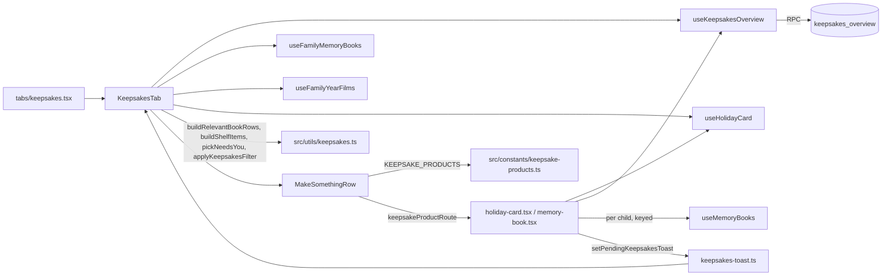

# Feature: Keepsakes

**Status:** `in-progress` (tab redesign + native product pages built 2026-10-08; deploys with the `keepsakes_overview` migration and an OTA)
**Last updated:** 2026-10-08
**PRD reference:** [Memory Book plan](../plans/memory-book.md), [Year Film plan](../plans/year-film.md) §8
**Plans:** [keepsakes-redesign.md](../plans/keepsakes-redesign.md) (the tab, the storefront, the product pages; approved design "Keepsakes Redesign v3") ·
[timeline-calendar-keepsakes.md](../plans/timeline-calendar-keepsakes.md) Phase C (the original tab)

## Overview

The Keepsakes tab is the home for everything Momora *makes* from a family's
memories: Memory Books, holiday cards and Year Films (monthly, birthday,
year-end; see [year-film.md](./year-film.md)). It has three parts, top to
bottom:

1. A slim **"needs you"** line, only when an action is waiting.
2. **"Make something"**: a storefront row of product cards. Each opens its own
   native product page.
3. **"Your keepsakes"**: a library with one shelf per year, its own filter,
   child chips and status badges.

**No price appears anywhere in the app.** Prices live in the shop, so changing
them needs no app update. Product pages carry a "Free to make" block instead
(making is included with Momora Plus; you only pay if you decide to print), and
UI copy avoids the word "generate".

## Roles

| Role | Sees |
|------|------|
| Owner, manager | Everything: the needs-you line, the storefront, books, cards and films, order badges |
| Viewer | **"Family films"** only: the page title changes, there is no storefront, no "Your keepsakes" wording, no needs-you line, no order badges. Next-up recap tiles still show. The filter button sits in the page header (owners and managers get it on the "Your keepsakes" header) |

- **Privacy cue.** When the family has at least one viewer
  (`keepsakes_overview.has_viewers`), "Books and cards are only visible to
  owners and managers." sits under "Your keepsakes" (`keepsakes-privacy`), and
  each product page carries "Viewers in your family won't see this
  {card|book}. Your surprise is safe." Without viewers neither shows.
- A viewer (or a deep link with no access) who reaches a product page is sent
  back: both pages call `leave()` once their first state settles.

## User-facing behavior

### The tab

`app/(app)/(tabs)/keepsakes.tsx` keeps the focus handling (`keepsakes_opened`,
a fresh `todayIso` on every focus) and renders `KeepsakesTab`
(`src/components/keepsakes/keepsakes-tab.tsx`). The page header lives in the
tab component (title "Keepsakes", or "Family films" for viewers;
`keepsakes-header`) so the viewer's header filter button and the owner's
section button drive the same filter state and sheet.

Order: header, needs-you line, storefront (owners/managers), library.

#### Needs-you line (`needs-you-banner.tsx`, `keepsakes-needs-you`)

One slim line, never dismissable; it clears itself once handled. Chosen by
`pickNeedsYou` (`src/utils/keepsakes.ts`), at most one, owners and managers only,
in this priority:

1. The holiday card is **ready** ("Your holiday card is ready to order").
2. The holiday card **failed** ("Your holiday card couldn't be made").
3. The most recently updated **failed book** ("{Name}'s book couldn't be made").

Limits:
- Card banners show only while `holiday_card_summary.enabled` (the season is
  open), so "ready" nags at most until the season closes.
- A failed-book banner shows only while the failure is under 30 days old
  (`FAILED_BOOK_BANNER_DAYS`, by `updated_at`). After that it is just the badge
  on the shelf, so an abandoned book does not nag forever.
- Only each scope's *relevant* book counts (`buildRelevantBookRows` applies
  `pickRelevantBook`): a failed book followed by a ready retry gives no banner.

Tap: card -> `openShopUrl(holidayCardWebUrl(cardId))`; failed book -> the
retry sheet for that child (`MemoryBookFlowHost`).

#### Storefront (`make-something-row.tsx`, `keepsakes-store`)

A horizontal row of neutral product cards from the registry (see "Adding a
product"). Tap -> `router.push(keepsakeProductRoute(product))` and
`keepsakes_product_opened { product }`.
- **Holiday card** (`keepsakes-store-holiday-card`): only in season
  (`holiday_card_summary.enabled`, the server switch) and for owners/managers.
  It leads the row, wider, with the card object (`HolidayCardObject`), the
  subtitle "Your card could look like this, with a letter from your year." and a
  pill with `overview.holiday_ship_by_note` verbatim (hidden when null). The
  object is the family's **real card front** once a card exists this season
  (see "The real card front" below), sized to fit the 178-high tile whether
  the card is landscape or portrait; before that, the generic "could look
  like this" preview on the family's newest picture (`overview.preview_key`),
  with the language's default greeting (`holiday_card_summary.language`:
  "Happy Holidays" / "Felices fiestas") and just the year.
- **Memory Book** (`keepsakes-store-memory-book`): always for owners/managers.
  The `BookCoverTile` uses `overview.book_preview_keys[firstOwnChildId]` (a wash
  when none).
- The storefront waits for `useHolidayCard` to settle so an in-season card does
  not pop in and shift the row.

#### Library (`keepsakes-library.tsx`, `keepsakes-library`)

- **Header row:** eyebrow "YOUR KEEPSAKES" plus the filter button
  (`keepsakes-filter-button`, with an active-count dot). Hidden when the library
  holds nothing but upcoming tiles.
- **Filter** (`keepsakes-filter-sheet.tsx`): Type (All / Films / Books / Holiday
  cards) and Year (viewers: Year only). Child chips (`keepsakes-chip-{memberId|all}`,
  hidden with fewer than 2) sit in the header too. A child chip keeps only that
  child's items (books, birthday films); family-wide items (recaps, year-end
  film, the card, the upcoming recap and the upcoming year-end tile) show only
  under "All"; an upcoming birthday tile belongs to its child. The state resets
  when the family changes, and a selection whose child or year no longer exists
  is dropped. No match -> "Nothing matches this filter" + Reset
  (`keepsakes-filter-empty`).
- **One shelf per year** (`keepsakes-year-{year}`): a horizontal row on a shared
  baseline. The current year (and any year holding an upcoming tile) is always
  open; past years are folded rows "{year} · {N} keepsakes" (viewers: "{N}
  films") that open in place and fold again from the year header
  (`keepsakes-year-toggle-{year}`; logs `keepsakes_year_toggled`). Items:
  film poster (`keepsake-film-tile.tsx`, `variant: 'shelf'`), book hardcover
  (`BookCoverTile`), the real holiday card front with an envelope peeking out
  behind it (`shelf-holiday-card.tsx`; portrait 104 wide, landscape 150 wide, same
  baseline, the caption follows the object's width), and the **upcoming tiles**
  (next-up recap `keepsakes-upcoming-recap`, upcoming birthday
  `keepsakes-upcoming-birthday-{memberId}`, upcoming year-end
  `keepsakes-upcoming-year-{year}`; all built on `upcoming-tile.tsx`). A year with more than 3
  monthly recaps ends its row with an "All {year} recaps" tile
  (`keepsakes-recaps-{year}`, `keepsakeRecapsRoute(year)`).
- **Order within a year:** the upcoming-recap tile, then the upcoming birthday tiles
  (soonest `film_date` first), then the upcoming year-end tile, then the **year-end
  film** (`kind: 'family_year'`, whatever its date says), then everything else newest
  date first (`compareWithinYear` in `src/utils/keepsakes.ts`, used by `buildShelfItems`
  and `groupShelfByYear`).
- **Next-up recap tile:** dashed with a progress bar and "{N} more moments this
  month" (or "{n} more with a picture") before the floors (10 moments, 6
  visuals), solid with "arrives {Mon d}" in Caveat after. The faded picture is the
  newest moment of the month that has one (`recap.picture_key`); a flat tile when
  none. The month and dates come from the owner-local `recap.month_start` /
  `delivers_on`, never the device clock. Known gap: from 00:00 to ~19:00 on the
  1st it restarts for the new month before the last film surfaces.
- **Upcoming birthday and year-end tiles** (`upcoming-film-tile.tsx`, from
  `overview.upcoming_films`, everyone incl. viewers): same look as the recap tile
  (`UpcomingTile`), filed on the shelf of `film_date`'s year (forced open, like the
  recap's), never badged, never counted in a folded year's "{n} keepsakes". Titles:
  birthday "{Name} turns {age_year}" (caption "{Name}'s birthday film"; the
  member's `name` as in `filmTitle`; the tile is skipped when the child is gone),
  year-end "Your {year}" (year of `scope_start`; the caption matches `filmTitle`'s
  `family_year` naming, "Your 2026"). Locked when `moments < min_moments`, or
  `visuals < min_visuals`, or (both numbers present) `quarters < min_quarters`
  (`isUpcomingFilmLocked`): dashed, a bar of `min(1, moments / min_moments)` and
  one hint by priority (`upcomingFilmHint`): "{n} more moments", else "{n} more with
  a picture", else "Needs moments from one more season" / "{k} more seasons".
  Unlocked: solid, "arrives" + the film date in Caveat; caption meta "arrives
  {Mon d} · {n} moments" (locked: "{n} of {min} moments"). A birthday tile carries
  the child's `memberId` (child chip + "Films" filter match it); the year-end tile
  is family-wide. The pure rules live in `src/utils/keepsakes.ts`.
- **Badges** (`keepsake-badge.tsx`): a pill with a dot on the item. Raspberry
  (`needsYou`) = waiting on you; lavender (`progress`) = in progress. Delivered
  items and finished films carry no badge; there is no "New" badge.

| Item | State | Badge |
|------|-------|-------|
| Book | queued / generating | "Being made" (progress) |
| Book | failed | "Couldn't be made" (needs you) |
| Book | ready + order paid / rendering / submitted / in production | "Ordered" (progress) |
| Book | ready + order shipped | "Shipped" (progress; no date: `memory_book_orders` has none) |
| Book | ready + order delivered, or no order | none |
| Card | generating | "Being made" (progress) |
| Card | ready | "Ready to order" (needs you) |
| Card | failed | "Couldn't be made" (needs you) |
| Card | ordered (`summary.ordered`) | "Ordered", or "Shipped · {MMM d}" once the order is `shipped` (progress) |
| Film | any | none (remaking / updating are handled inside `KeepsakeFilmTile`) |

- **States:** a spinner until members, films and (owners) books load; an inline
  `keepsakes-error` + "Try again" if films or books fail; if the overview RPC
  fails the tab degrades silently (no upcoming tiles, no past cards, no order badges, no privacy
  line). A viewer with no films keeps `keepsakes-viewer-empty`; an owner with an
  empty library sees "Films show up here on their own. Your first one is on its
  way." Any populated library, including a viewer with only past-year films,
  renders `keepsakes-library`.
- **Film tile states** (`filmDisplayState`, see [year-film.md](./year-film.md)
  "Remaking"): a film whose edit removed moments is *remaking* (paper
  placeholder, "Remaking…", `keepsakes-film-{id}-remaking`, not pressable); one
  re-rendering for a music/quote edit is *updating* (playable plus an
  "Updating…" badge, `keepsakes-film-{id}-updating`). Film tiles
  (`keepsakes-film-{id}`) open the player with `yearFilmRoute(id, 'keepsakes')`.
- **Cards on the shelf:** two sources.
  - *This season's card* (`holiday_card_summary`, `cardSummary.cardId`): unchanged.
    State from `holidayCardTileState` (on the shelf from creation until Jan 31 once
    ordered), the badges in the table above, the needs-you line, and the real front
    from `card_front`.
  - *Past cards* (`overview.cards`, newest year first, owner/manager; `[]` for
    viewers and for an older server): every OTHER card whose `status` is `ready` goes
    on the shelf of its own `year` (generating / failed past cards are hidden), with
    its own `front` (`CardShelfItem.isPast`, `front`). The badge comes from
    `overview.orders` only: shipped -> "Shipped · {date}", ordered -> "Ordered", else
    none (a past season is no longer orderable, so never "Ready to order"). A tap
    opens `holidayCardWebUrl(cardId)` in the shop. They never feed the needs-you
    line. The current card is never listed twice (de-duplicated by id); with an
    empty `cards` the shelf is today's behavior. A summary card that is no longer
    "current" (last year's unordered card) shows as a past card when it is ready.
    They count in the folded year's "{n} keepsakes" and in the Holiday cards / Year
    filters.

### Product pages

Both are **stack screens** under `app/(app)/keepsakes/` (no tab bar), registered
in `app/(app)/_layout.tsx`, built from the shared pieces in
`src/components/keepsakes/product-page.tsx` (`ProductPageShell`, `ProductStage`,
`ProductHeading`, `EligibilityBox`, `PrivacyNote`, `FactsBox`, `OptionRow`,
`ProductCtaBar`) and `free-to-make.tsx` (`FreeToMake`). Layout: a 40px round white
back button; a stage (surface box, radius 24, ~300 high) holding the product
object; eyebrow, title and body; the "Free to make" block; the product's own
content; privacy note (only with viewers); facts; and a **fixed bottom CTA bar**
(border-top, a 52-high primary button, a 12px sub-line) that adds the live bottom
safe-area inset. There are no text inputs. "Leave" is shared
(`useLeaveKeepsakesPage`): `router.back()`, or `router.replace(keepsakesTabRoute)`
when there is no history (a cold-start deep link); `leaveAfterModalDismiss` waits
~450 ms so a closing `overFullScreen` Modal never gets stuck under a popped screen.

#### Holiday card (`holiday-card.tsx`, `keepsakeProductRoute('holiday-card')`)

- Testids: `keepsakes-product-holiday-card`, `holiday-card-product-cta`,
  `keepsakes-product-back`, `holiday-card-product-stage`.
- Stage: `HolidayCardObject`. With a card this season (`activeCardFront`) it is
  the real front fitted into the stage (landscape up to 280 wide / 260 high with
  the envelope, portrait height-bound); otherwise the generic 154-wide preview on
  `overview.preview_key` ("Happy Holidays" / "Felices fiestas" per the summary
  language, and the year).
- Eyebrow "HOLIDAY CARDS · {year}", title "Your family, on this year's card.", the
  facts "5×7, printed on both sides. Shipped to your door." / the QR fact /
  "One card per family each year. Order more copies anytime.", and the ship-by pill
  (`overview.holiday_ship_by_note`, hidden when null).
- **Eligibility and the QR promise.** Card create has no floor: below the
  holiday film floor the card ships *without* a QR film. So the page compares
  `overview.holiday_pool` with `holiday_min_pool` (20): at or above, "Your {year}
  has {year_moments} moments, plenty for the letter." and "Scan the back to watch
  a short film made for this card."; below, "Your {year} has {N} moments so far."
  and "Add a few more moments and the back links to a short film of your year."
  With no overview: no eligibility line and no QR fact.
- **CTA** follows `holidayCardTileState(summary, todayIso)`, *not* `cardId !== null`
  (the summary returns the newest card of any year):
  - `make` -> "Make our {year} card" -> `HolidayGreetingSheet` -> `create`. A
    `createdRef` is set only when the outcome is a **new** card; closing the sheet
    then leaves the page (after the Modal dismiss). A refused create
    (`subscription_required`, disabled...) keeps the user on the page and the sheet
    shows why. An existing card's Continue opens the shop and stays.
  - `generating | ready | failed | ordered` -> "Open your card" -> `openShopUrl`.
  - **First-load latch:** the page latches the state when it first settles; a
    first-load `null` (out of season, no billing, viewer, deep link) leaves. A state
    that turns `null` *later* (a refused create refetching a summary that hides the
    card) never auto-leaves; the page keeps showing the last real state.

#### Memory Book (`memory-book.tsx`, `keepsakeProductRoute('memory-book', memberId?)`)

- Testids: `keepsakes-product-memory-book`, `memory-book-product-cta`,
  `memory-book-scope-{scopeKey}`, `memory-book-scope-more`,
  `memory-book-child-{memberId}`, `memory-book-eligibility`, `memory-book-thin`,
  `memory-book-import-photos`, `memory-book-dispatch-error`.
- Stage: `BookCoverTile` (width 200) with `overview.book_preview_keys[childId]` (a
  wash when none). Eyebrow "MEMORY BOOK", title "A year of {name}, printed and
  bound."
- **Who it's for:** chips for the family's own children (`isOwnChild`, or anyone
  who already has books, like the shelves); hidden with a single child. `?memberId=`
  preselects. No own children: the hint "Add your child to make a book" and a "Go
  to Family" button (`familyRosterRoute`).
- **Which part of {name}'s story** (the name, never a pronoun): `splitScopeOptions`
  (`src/utils/keepsakes.ts`) gives the two newest *completed* age-years as `visible`
  (ones that already have a book included, labeled "already made" / "being made" /
  "couldn't be made"; Everything fills in with fewer than 2) and the rest as
  `more`, shown under "See {N} more" (`memory-book-scope-more`) in groups Years of
  life / Calendar years / Everything, newest first. The in-progress age-year and
  the current calendar year carry a caution line. Calendar years and in-progress
  periods are never `visible` (claiming one mid-period locks the window, the rule
  behind `pickSuggestedScopes`). Default selection: the first `visible` without a
  book, else Everything if it has none, else the first `visible`.
- **Eligibility:** "{N} moments in this period." for the selected scope. A thin
  period (below `MEMORY_BOOK_THIN_THRESHOLD`, 30) is **warned, not blocked**: "Not
  many moments yet" plus the gallery-import action (when gallery import is enabled;
  same `/(app)/gallery-import` push with `surface: 'keepsakes'` as the stack path).
- Facts: "Layflat, 8.3×8.3 inches. Thick pages that open completely." / "Chosen for
  you. We pick the moments that tell the story."
- **Per-child state.** Everything scope-dependent is in `ChildBookPage`, **keyed by
  child id**, which calls `useMemoryBooks` for that one child. Its `pendingKeys` and
  `dispatchErrors` are keyed by scope keys (`everything:null:null` and the calendar
  years are shared across children), so a shared instance would leak "being made"
  and error state between chips.
- **CTA** (`bookCtaFor`, `src/utils/keepsake-product-pages.ts`):
  - no book -> "Make {name}'s {scope} book" -> `generate(option)`, which returns
    `'started' | 'exists' | 'error'`: `started` -> `setPendingKeepsakesToast("We're
    making your {scope} book…")` and leave; `exists` -> stay (the row refetches and
    shows its real status); `error` -> stay and show the row's `dispatchError`.
  - ready -> "Open {name}'s book" -> `openShopUrl(memoryBookWebUrl(id))`.
  - failed -> "Try again" -> `generate(option)` (a fresh row; the failed one stays as
    history).
  - queued with a `dispatchError`, or queued for more than 10 minutes
    (`STUCK_QUEUE_MS`) -> "Try again" -> `retryDispatch(option, bookId)` (re-dispatch
    the same row; otherwise a failed dispatch is a permanently disabled button).
  - queued/generating, healthy -> disabled "Being made…".
- The toast reaches the tab through `src/lib/keepsakes-toast.ts` (a module store:
  the tab never unmounts, so a route param could re-show it on every focus);
  `KeepsakesTab` consumes it on focus and shows `BookToast`.

#### The real card front (`holiday-card-front.tsx`)

`keepsakes_overview.card_front` (owner/manager, null without a card) describes the
front the family designed in the shop editor: `card_id`, `year`, `image_key`, the
picture's `width`/`height`, `layout` (`bordered` | `full-bleed`), `orientation`,
`focal`, `greeting` + `language`, the edited `greeting_text` / `subline_text`
(`""` = hidden) and `greeting_position`. `parseKeepsakesOverview` parses it into
`KeepsakesCardFront | null` defensively (unknown layout -> bordered, unknown
greeting -> holidays, a size only when both sides are valid, focal clamped).

`HolidayCardFront` is a React Native port of the **print layout** (source of truth:
`book-renderer/src/card/document.ts` `buildFront`, `geometry.ts`, `CardFront.tsx`,
`fromData.ts`, `greetings.ts`). All geometry is pure and unit-tested in
`src/utils/holiday-card-front.ts` (`buildHolidayCardFrontLayout`); the component only
draws it. It renders the 5R **trim** (177.8 x 127 mm, rotated for portrait; the 4 mm
bleed is dropped) at `width` px, so 1 mm = `width / trimW` px:
- **Full-bleed:** the picture covers the trim (focal -> expo-image `contentPosition`
  percentages, the same semantics as the print crop), a top or bottom scrim (42% of
  the PAGE height, gradient `rgba(24,20,40,.36)` -> `.15` at 45% -> 0), the stacked
  greeting (27pt landscape / 24pt portrait, Newsreader italic) and the 7pt small line
  (Plus Jakarta Sans bold, uppercase, 0.32em tracking), 12 mm from the trim, 2 mm
  apart, white / 88% white, aligned by `greeting_position`.
- **Bordered:** paper `#FAF8FC`, a picture box = `fitBoxToImage` (an exact port) in
  the area left by an 8 mm margin and a 21 mm band, square corners, then one centred
  baseline row (greeting 20pt landscape / 21pt portrait, 4 mm gap, small line) whose
  text sits 8.5 mm above the trim bottom, in `accentInk` / `accent`.
- Texts: greeting = `greeting_text` else the language default (`HOLIDAY_CARD_GREETING_TEXT`,
  mirroring `greetings.ts`); small line = `subline_text` else the year, hidden when empty.
- Unknown picture size -> the card's own aspect is assumed. The format is always 5R
  (the overview does not say 5R vs A5; they differ by ~1.4% in aspect).

`HolidayCardObject` wraps the front (or the generic preview) with the tilted kraft
envelope; `holidayCardObjectLayout(w, h)` gives its geometry for any aspect (the
envelope peeks by the card's shorter side) and `holidayCardWidthToFit` sizes a card
into a box. The tab shows the real front only when `card_front.card_id` matches the
summary's card (`cardFrontFor` / `activeCardFront`): the two queries can briefly
disagree after a create, and the wrong picture must not sit under another card's
badge. With no `card_front` (viewer, overview failed, old server) everything falls
back to the generic preview.

To change the print layout: change `book-renderer/src/card/document.ts` first, then
mirror the constants in `src/utils/holiday-card-front.ts` (they carry pointers to the
source lines) and the tests, whose expected numbers come from running `geometry.ts`.

### One child's keepsakes (stack, unchanged)

`app/(app)/keepsakes/[memberId].tsx` (`memoryBooksRoute(memberId)`), opened from
the child profile row "See {name}'s keepsakes" (owners/managers) and from
book-ready/failed pushes. Birthday films (all years, newest first,
`keepsakes-child-films`) sit above that child's books; the same books body filtered
to one child with the personalized pitch ("A year of {name}, printed and bound.")
when there are neither books nor films, the `CreateBookSheet`/`RetryBookSheet`
flow, and viewers see existing books read-only. On a cold-start push with no
history, Back goes to Family. This path still uses `KeepsakesBody`
(`variant="stack"`, `src/components/memory-books/memory-books-body.tsx`), which also
exports `MemoryBookFlowHost` (used by the tab's retry host).

### Recaps grid

`app/(app)/keepsakes/recaps/[year].tsx`: a 3-column grid of that year's monthly
recaps, newest first, reached from the "All {year} recaps" tile
(`year_film_recaps_opened`). The product pages and `[memberId]` are sibling routes
with no `_layout`; `holiday-card` and `memory-book` are static segments, so they
win over the dynamic `[memberId]`.

## Architecture



- **The tab owns the queries**: `useFamily`, `useFamilyMembers`,
  `useFamilyMemoryBooks` (one family-wide books query, polls every 4 s only while a
  book is queued/generating *and* the tab is focused), `useFamilyYearFilms`,
  `useKeepsakesOverview` and a single `useHolidayCard`, plus the filter, the
  open-years set, the retry host and the toast. The product pages call the hooks
  they need themselves; the query cache is shared, so there is no second fetch.
- **Pure helpers** (`src/utils/keepsakes.ts`, no React, "today" passed in):
  `buildRelevantBookRows` (books deduplicated through the per-child row logic first),
  `buildShelfItems`, the badge mapping, `groupShelfByYear`, `yearSummaryLabel`,
  `pickNeedsYou`, `applyKeepsakesFilter`, `splitScopeOptions`, `cardFrontFor`,
  `activeCardFront`.
  `holidayCardTileState` lives in `src/utils/holiday-card-state.ts`.
- **"Today"** decides scope options and what a previous-year card means. The tab
  recomputes it on every focus; a stack page fixes it for the visit.

### The overview RPC (`keepsakes_overview`)

`public.keepsakes_overview(p_family_id) returns jsonb`, stable, security definer
(migration `supabase/migrations/20261009120000_keepsakes_overview.sql`, pgTAP
`supabase/tests/keepsakes_overview_test.sql`, rollback in `supabase/rollbacks/`).
Parsed defensively in `src/services/keepsakes.ts` (`KeepsakesOverview`); the hook
(`useKeepsakesOverview`) uses `staleTime` 30 s, refetches on focus when stale, does
not poll, and yields `overview: null` on an RPC error (the UI degrades, never
crashes). Contract: [TECH_SPEC.md](../TECH_SPEC.md) next to the holiday-card RPC.

| Field | Who | Used for |
|-------|-----|----------|
| `recap` (`month_start`, `delivers_on`, `moments`, `visuals`, `min_*`, `picture_key`) | everyone | the next-up recap tile (null unless the family passes the `year_films_enabled` gates except the >=10 check) |
| `has_viewers` | owner/manager | the privacy cue |
| `year_moments`, `holiday_pool`, `holiday_min_pool` (20) | owner/manager | the card page's eligibility line and QR promise |
| `holiday_ship_by_note` | owner/manager | the ship-by pill (null out of season) |
| `preview_key` | owner/manager | the generic card preview (storefront + card page, before a card exists) |
| `card_front` | owner/manager | the real card front on the shelf, the storefront and the card page (see "The real card front") |
| `book_preview_keys` (`childId -> key`) | owner/manager | the book cover on the storefront and the book page |
| `orders` (status only, never address or price) | owner/manager | order badges; latest paid-or-later row per item, refunds excluded |
| `cards` (`card_id`, `year`, `status`, `ordered`, `front`) | owner/manager (`[]` for viewers) | past-year cards on their shelves (see "Cards on the shelf"); `front` has the `card_front` fields minus `card_id` / `year`, which the parser fills in |
| `upcoming_films` (`kind` birthday / family_year, `member_id`, `age_year`, `film_date`, `scope_*`, `moments`, `visuals`, `min_*`, `quarters`, `min_quarters`, `picture_key`) | everyone | the upcoming birthday and year-end tiles; absent on an older server (parsed as `[]`) |

The pool mirrors the film worker (`year-film-eligibility.ts`,
`year-film-context.ts`): reported / onboarding-pending / blocked-author memories are
out, audio is never a visual, and the preview keys also exclude reported
illustrations and the caller's personal blocks, so a hidden image never resurfaces.
The query is invalidated by `useHolidayCard.create`, `useMemoryBooks`
`generate`/`retryDispatch` and the memory / report / block mutations; push handlers
are not invalidation points (the focus refetch covers them).

## Adding a product

The storefront maps over `KEEPSAKE_PRODUCTS` in `src/constants/keepsake-products.ts`:

```ts
{ id, title, subtitle, cardWidth, isAvailable(ctx), route() }
```

To add one (say, a calendar):
1. Add its id to `KeepsakeProduct` in `src/lib/routes.ts` and make
   `keepsakeProductRoute` build its path (add a test in `routes.test.ts`).
2. Add the page `app/(app)/keepsakes/<id>.tsx` and register it in
   `app/(app)/_layout.tsx`. Build it from `product-page.tsx` +
   `FreeToMake` (extend `FreeToMakeProduct` and its copy) + `PrivacyNote`; give it
   the testIDs `keepsakes-product-<id>` and `<id>-product-cta`. Follow the card page
   for a modal-driven create (leave only when a NEW item exists, via
   `useLeaveKeepsakesPage().leaveAfterModalDismiss`) or the book page for an inline
   create.
3. Add the entry to `KEEPSAKE_PRODUCTS` and its object in `make-something-row.tsx`
   (title, subtitle, width, `isAvailable`). A season-gated product reads its switch
   from the context.
4. If it produces shelf items, extend `ShelfItem` / `buildShelfItems` / the badge
   mapping / the type filter in `src/utils/keepsakes.ts`, and the order status in
   `keepsakes_overview`.
5. Add `keepsakes_product_opened`'s `product` union in `src/services/analytics.ts`
   and a row in [analytics.md](./analytics.md).
6. No prices anywhere in the app.

## Data model

The overview RPC is read-only. Otherwise the tab reads `memory_books`
(`MEMORY_BOOK_LIST_COLUMNS`), `year_films` (client-granted columns, via
`useFamilyYearFilms`), `holiday_card_summary`, and `family_members.relationship` /
`date_of_birth` (shelf membership and chips). See
[memory-book-generation.md](./memory-book-generation.md) and
[holiday-cards.md](./holiday-cards.md) for the tables and pipelines.

## Testing

- `src/screen-tests/keepsakes.integration.test.tsx` (the tab, "today" pinned to
  2026-10-15; the stack route; the recaps grid).
- Product pages: `src/screen-tests/keepsakes-holiday-card-page.integration.test.tsx`
  (CTA per state, eligibility/QR copy, privacy and ship-by gating, out-of-season and
  viewer back-out, no auto-leave after the first settle, new card leaves after the
  Modal dismiss, refused create keeps the page, `createdRef` gate, existing card
  opens the shop) and `keepsakes-memory-book-page.integration.test.tsx` (visible
  periods, "See N more" grouping and order, cautions, already-made labels and
  default, thin warning + import action, every CTA state including the tri-state
  `generate`, double-tap guard, per-child state isolation, no own children, viewer).
- Units: `src/utils/keepsakes.test.ts`, `src/utils/keepsake-product-pages.test.ts`,
  `src/utils/holiday-card-state.test.ts`, `src/lib/routes.test.ts`,
  `src/lib/keepsakes-toast.test.ts`, `src/hooks/useLeaveKeepsakesPage.test.ts`,
  `src/components/keepsakes/holiday-card-object.test.tsx`,
  `holiday-card-front.test.tsx`, `src/utils/holiday-card-front.test.ts` (print
  geometry), plus the tab components'
  own tests and `src/hooks/useKeepsakesOverview.integration.test.tsx`,
  `src/services/keepsakes.test.ts`.
- Maestro: `keepsakes/open-keepsakes.yaml` (header, library, store -> Memory Book
  page), `year-film/open-from-keepsakes.yaml` (unfolds a past year if needed),
  `sharing/viewer-readonly.yaml` (viewers: "Family films", no `keepsakes-store-*`).

## Changelog

| Date | Change |
|------|--------|
| 2026-09-29 | Keepsakes tab replaces Calendar; books move off the child profile (plan Phase C) |
| 2026-09-29 | Year Film P2: year sections, recaps grid, films on the child page, viewers see films |
| 2026-10-02 | Example book cover uses illustrations; new-family films intro; "not enough memories yet" create sheet |
| 2026-10-06 | Holiday card tile + greeting sheet (Holiday Cards P2 Step 6) |
| 2026-10-08 | Tab redesign ([plan](../plans/keepsakes-redesign.md)): needs-you line, "Make something" storefront, "Your keepsakes" library with filter/badges/folded years, next-up recap tile, viewer "Family films" page; native Holiday card and Memory Book product pages (no prices, "Free to make"); `keepsakes_overview` RPC; old tab-only body, `HolidayCardTile`, `UpcomingRecapCard`, `KeepsakeYearSection` and `ChildPickerSheet` removed |
| 2026-10-08 | Real holiday card front on the shelf, the storefront tile and the card page (`card_front`, landscape and portrait, full-bleed and bordered); the generic preview now says the language's default greeting and just the year; the year-end film leads its year; `keepsakes_create_book_tapped` fires from the Memory Book page and the stack screen; dead code removed (`buildKeepsakeYears`, `keepsakesFilterCount`, `holidayCardFamilyLine`, `yearFilmsEnabledQueryKey`) |
| 2026-10-09 | Past-year holiday cards on their own shelves (`overview.cards`; ready only, order badge, no "Ready to order"); upcoming birthday and year-end film tiles (`overview.upcoming_films`) built on a shared `UpcomingTile` with the recap tile |
