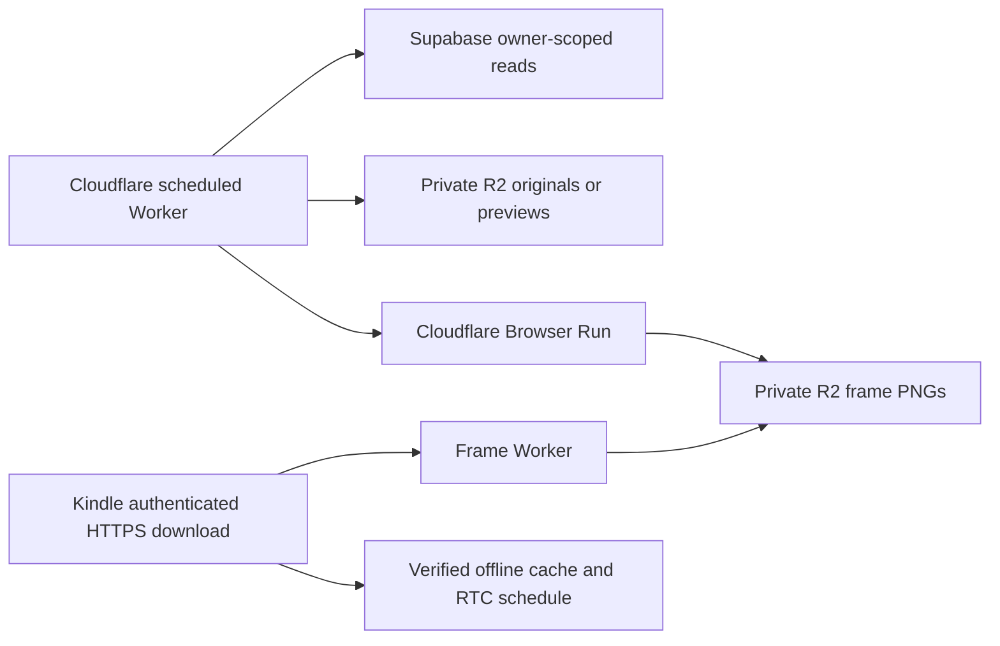

# Personal Kindle frame

**Status:** in-progress — cloud, wireless two-image cycle and daily-mode startup verified; overnight acceptance pending.
**Last updated:** 2026-09-09

## Overview

A personal, cable-free picture frame on an already-jailbroken Kindle Paperwhite 1 (B024, firmware 5.6.1.1). No app UI or new AI image generation. The owner approved cloud hosting and a minimal non-interactive layout after physical tests established that tapping does not wake this device from direct suspend.

## User-facing behavior

- Five image changes at 08:00, 11:00, 14:00, 17:00 and 20:00 Europe/Lisbon. The last image remains overnight.
- Each distinct eligible image has equal probability across the entire journal, including every carousel photo. Selection is without replacement within a daily batch; repeats across days are allowed. No recency bias or photo/illustration quota.
- `text_illustration` with a ready illustration and `media` image assets are eligible. Audio, text-only memories and video assets are excluded. A mixed carousel contributes its images, not its videos.
- Photo: preserve the whole image, grayscale, small bottom-right date chip. Illustration: square art, up to four lines of the existing memory content beneath, left aligned, then the memory date near the bottom. Long captions truncate; no generated summary. No touch button.
- Cloud prepares a batch at 00:15 UTC. Kindle fetches at 03:00 Lisbon time. Downloading does not refresh the overnight screen.
- Failed or incomplete downloads retain the previous batch. Up to eight days of local display times are supplied; if the schedule is exhausted it holds the last image and continues daily download attempts.
- KUAL launches either a two-image wireless test or daily mode. USB connection during sleep ends frame mode; exiting restores Amazon's GUI, which looks like a restart. Normal rotations do not restart the GUI.
- Automatic launch after a full device reboot is **not installed yet**. Until the wireless cycle is accepted, restart daily mode from KUAL after a reboot.

## Architecture

`workers/kindle-frame` is an isolated Worker. It uses a fixed owner and family configured as secrets, checks active user/family and owner membership, and pages the full journal by ID. Service-role access exists only on the server. It never accepts arbitrary owner IDs, source URLs or R2 keys from the device. Nightly generation has an R2 conditional-write lock and publishes the manifest only after all five images have rendered and source authorization has been rechecked.

The renderer gets escaped HTML with image bytes embedded as data URLs and a restrictive CSP; no public media URL is created. Existing photo previews are used when available. Unsupported source encodings or oversized input abort the batch instead of quietly excluding an image from the random population.

## Data model

No DB tables, migrations or mobile generated types change. Reads `user_profiles`, `families`, `family_memberships`, `memories` and `memory_media`.

All generated files live in private `momora-prod` under `{ownerId}/kindle-frame/`, so existing owner-prefix account cleanup encompasses them. Batch paths are `{day}/{generation}/{slot}.png`; `current.json` contains internal source references; `prepare.lock` coordinates builds. Generated batches older than three days are removed. Original objects are never modified.

## API and credentials

| Endpoint | Auth | Result |
|---|---|---|
| `GET /health` | None | Plain `ok`, no account data |
| `POST /prepare` | Separate admin bearer token | Idempotent current-day preparation |
| `GET /manifest` | Frame bearer token | Versioned plain-text batch and UTC display times |
| `GET /image/{generation}/{1..5}` | Frame bearer token | Current prepared PNG only |

HTTPS only. Cloud stores SHA-256 token digests; a 256-bit random frame token lives on the Kindle. The admin token and Supabase service key never go onto the Kindle. Revoke the frame by replacing `FRAME_TOKEN_HASH`. Every media read rechecks active ownership and current source existence. Responses use `private, no-store`. No raw tokens, captions or child information are logged by the Worker; request observability is disabled.

The `FRAME1` header contains server epoch, next sync epoch, generation UUID and a UTC clock string. Five `IMAGE` rows contain slot, SHA-256 and relative authenticated path. `AT` rows contain absolute UTC time and slot; `END` terminates the manifest. The client parses data, never sources/evaluates the manifest as shell code. Schedule conversion handles Lisbon daylight saving time in the cloud.

## Kindle implementation

`kindle/frame.sh` uses FBInk and PW1 `/sys/devices/platform/mxc_rtc.0/wakeup_enable`, preserving the device-specific behavior established in the prototype. Ignore TERM while stopping `lab126_gui`; EXIT cleanup restores the GUI and prior screensaver/Wi-Fi setting. Spurious wakes resume sleeping instead of causing the old sample's early exit.

HTTPS uses the statically linked `xh` binary distributed with `pascalw/kindle-dash` v1.0.0-beta.4 (xh 0.16.1). TLS verification stays enabled. Installation supplies a current clock bootstrap; authenticated manifests subsequently synchronize it. The device needs a previously saved working Wi-Fi network. The script downloads all five files, checks SHA-256, then switches a local pointer atomically. Cached files and credentials are private local artifacts, not committed source.

## Extension guide

- Keep this personal and fixed-owner unless a separately reviewed registration/revocation model is added.
- Do not introduce public R2 access or ship administrative credentials to the device.
- Do not switch to a latest-N query: that would bias selection against old images.
- Do not treat testing one photo as acceptance of a whole wireless/suspend cycle.
- Add a reboot hook only after device acceptance, with an explicit escape route for USB/debugging.
- Offline images cannot be remotely erased while the Kindle is disconnected. Revocation blocks subsequent server reads; physically clear the cache for immediate local removal.

## Testing

- `workers/kindle-frame/test/core.test.ts`: image eligibility, carousel handling, deduplication, equal index selection, scheduling/DST, escaping and layout limits.
- `workers/kindle-frame/test/worker.integration.test.ts`: authorization, revocation, full pagination beyond 500, generic failures, path constraints.
- `workers/kindle-frame/test/kindle_test.py`: mocked download/checksum/USB failures, complete-batch publication, two renders, GUI signal cleanup.
- `npm --prefix workers/kindle-frame test`, `npm --prefix workers/kindle-frame run typecheck`, `python3 workers/kindle-frame/test/kindle_test.py`.
- Live: private owner verified; `/manifest` without credentials and `/prepare` with the frame token rejected. Initial batch prepared and all five PNGs retrieved with matching hashes from the Mac. Physical wireless test passed: all five checksums verified, two images displayed, two 60-second sleeps completed, same boot ID throughout; user confirmed success.
- App-wide verification: Edge suite 1,551 passed, 1 ignored; lint reported no errors. The full Jest run executed 4,904 passing tests but had runner-import failures for separate Worker suites; this Worker now has its own Jest exclusion and its 13 Vitest checks pass. Root typecheck also reports errors in other existing modules; this Worker typechecks independently. No Expo UI, hook or Supabase Edge Function changes are part of this feature.

## Upstream references

[pascalw/kindle-dash](https://github.com/pascalw/kindle-dash) (MIT), [xh](https://github.com/ducaale/xh) (MIT), [Cloudflare Browser Run](https://developers.cloudflare.com/browser-run/quick-actions/screenshot-endpoint/). The frame script is a small PW1-specific implementation using the documented RTC approach, not an unmodified upstream installation.

Daily-mode startup was subsequently confirmed by the owner. A complete overnight download and full-day schedule have not yet been observed.
