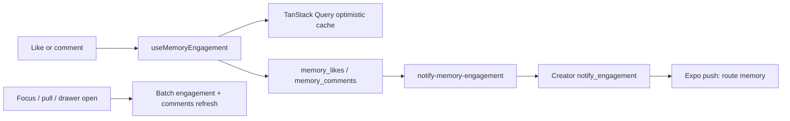

# Feature: Likes & comments

**Status:** `done`
**Last updated:** 2026-07-15
**PRD reference:** §6.8 Likes & Comments

## Overview

Household members can react to a memory without changing the journal entry.
Likes are private-identity reactions with aggregate counts; comments are a
chronological household conversation attributed to account profile names.
Every active role, including viewer, may participate.

## User-facing behavior

- Timeline and memory detail show an outline heart and comment icon below the
  memory content. A selected heart fills pink, pops briefly, and gives light
  haptic feedback.
- Counts are passive and appear only when greater than zero. There is no liker
  list.
- Timeline comment taps navigate to memory detail with `?comments=1`; detail
  comment taps open an 80%-height bottom drawer directly.
- Comments render oldest-to-newest with the household account name, avatar
  initial, and compact timestamp (`now`, minutes, hours, days, then date).
- The fixed plain-text composer stays above the keyboard on iOS and Android.
  The drawer sizes itself against the currently visible viewport, keeps its
  header/dismiss area on-screen, and applies bottom safe-area padding only
  while the keyboard is closed. Empty/error/loading states remain inside it.
- Comments cannot be edited. Long-press allows the author to delete their own;
  owner/manager can moderate any comment in that specific family.
- Like/add/delete mutations are optimistic and roll back on failure. Timeline
  refreshes on focus and pull-to-refresh; comments refetch whenever the drawer
  opens. There is no Supabase Realtime subscription.
- Settings has one **Likes & comments** notification toggle, default on. A
  like/comment notifies only the memory creator, never the actor. The generic
  push omits journal/comment/child content and opens memory detail.

## Architecture



Timeline/detail memory queries batch `get_memory_engagement` in groups of 100,
alongside existing tag/media enrichment. The RPC exposes only counts and the
caller's own like state. Comment rows are loaded only while the drawer is open.
After a successful actor-owned row change, notification delivery is
fire-and-forget and never rolls back engagement.

## Data model

| Table / field | Role in this feature |
|----------------|----------------------|
| `memory_likes` | `(memory_id, user_id)` primary key; one like per account; both FKs cascade on memory/account hard delete |
| `memory_comments` | Immutable plain-text comments with `id`, `memory_id`, `user_id`, `content`, `created_at`; DB enforces trimmed length 1–1000 |
| `user_profiles.notify_engagement` | Global per-account engagement push preference, `not null default true` |
| `family_activity_log` | Service-only notification attempt/debounce rows; kind contains memory or comment identity |

RLS requires active membership in the memory's family. Like rows can be read,
inserted, and deleted only by their author, so liker identities are not exposed.
Comments are readable by the household; insert is self-only; delete is self-only
or owner/manager moderation bound to the memory's family. There is deliberately
no comment update policy.

Removed members lose access but their comments and account-name attribution are
preserved through the extended `get_family_member_profiles` RPC. Hard auth-user
deletion cascades that user's likes/comments. Memory/family deletion cascades all
engagement belonging to it.

## API & Edge Functions

| Function / endpoint | Input | Output | Auth |
|---------------------|-------|--------|------|
| `get_memory_engagement` RPC | `memory_ids uuid[]` | rows of `memory_id`, `like_count`, `comment_count`, `liked_by_me` | JWT; active family member, only authorized memories returned |
| `set_memory_like` RPC | `target_memory_id`, `should_like` | `liked`, `changed`, exact `like_count` | JWT; active family member |
| `memory_comments` PostgREST | select/insert/delete | comment rows | JWT + RLS described above |
| `notify-memory-engagement` | `{ memoryId, kind, engagementId? }` | `{ sent, reason? }` | JWT; active member and verified caller-owned engagement row |

`set_memory_like` is an idempotent set operation. Its `changed` flag prevents a
stale/repeated request from asking for another notification. The Edge Function
re-verifies the stored like/comment, recipient membership, creator preference,
and no-self rule before logging an attempt and sending. Likes debounce for 24
hours per actor/memory so a quick unlike/re-like does not repeat the push;
comment retries dedupe by comment id.

See TECH_SPEC §2 and §4.14 for canonical contracts.

## Client integration

| Layer | Files | Responsibility |
|-------|-------|----------------|
| Routes | `app/(app)/(tabs)/timeline.tsx`, `app/(app)/memory/[id]/index.tsx`, `app/(app)/(tabs)/settings.tsx` | Entry points, focus refresh, drawer deep link, preference UI |
| Hooks | `src/hooks/useMemoryEngagement.ts`, `src/hooks/queryKeys.ts` | Queries, optimistic mutations, cache reconciliation |
| Services | `src/services/engagement.ts`, `src/services/memories.ts`, `src/services/user-profile.ts` | Validation, PostgREST/RPC calls, batched aggregates, preference persistence |
| Components | `src/components/memory-engagement-bar.tsx`, `memory-comments-drawer.tsx`, `memory-card.tsx` | Instagram-style actions, drawer/composer, timeline placement |
| Utils | `src/utils/engagement.ts`, `src/lib/routes.ts` | Timestamp formatting and comment deep-link route |

### How to invoke from another feature

1. Ensure the memory query returns `likeCount`, `commentCount`, and
   `likedByMe` from `get_memory_engagement`.
2. Render `MemoryEngagementBar` with the memory and an `onOpenComments`
   callback. Keep the callback separate from parent-card navigation.
3. Mount `MemoryCommentsDrawer` on memory detail and toggle its `visible`
   prop; do not mount a second independent comment implementation.

## Extension guide

**Safe to extend**

- Additional presentation around existing counts or timestamp formatting.
- A comment character counter that keeps the same 1000-character backend cap.
- Explicit manual refresh controls using the existing query keys.

**Do not change without updating this doc**

- Viewer participation, comment moderation roles, liker-identity privacy, the
  no-self notification rule, or hard-delete/removed-member semantics.
- Notification payload routing or debounce-key format.
- Realtime synchronization: current cache/refetch behavior is intentional.

## Constraints & gotchas

- Never render counts with `{count && ...}`; zero is intentionally hidden via
  `count > 0`.
- Comment text is user content: never include it in push copy, analytics, or
  production logs.
- UI role checks only control affordances; RLS is the authority.
- Keep comment queries keyed by active family and memory to prevent cross-family
  cache leakage.
- Push failures are non-fatal because engagement has already committed.
- Native haptics require a development-client/native rebuild after dependency
  installation; Expo Go is not supported by this SDK setup.
- On Android, keep the sheet percentage-constrained and enable
  `KeyboardAvoidingView`'s `height` behavior only while the keyboard is visible.
  Disabling the behavior on `keyboardDidHide` prevents a stale reduced height
  from leaving the drawer floating above the bottom of the screen. Do not
  reintroduce a fixed pixel height from `useWindowDimensions`; that combination
  causes top overflow and a delayed jump when the keyboard closes.

## Dependencies

- Depends on: [Memories & illustrations](./memories.md), [Family sharing](./family-sharing.md)
- Used by: Timeline, memory detail, Settings notifications

## Testing

### Unit tests

| File | Covers |
|------|--------|
| `src/utils/engagement.test.ts` | Relative/calendar timestamp boundaries |
| `src/components/memory-engagement-bar.test.tsx` | Hidden zero counts, selected state, action wiring |
| `src/components/memory-comments-drawer.test.tsx` | Drawer/composer behavior, keyboard avoidance, posting and moderation affordances |

### Integration tests

| File | Scenarios |
|------|-----------|
| `src/services/engagement.integration.test.ts` | Validation, like RPC mapping, chronological comments, insert/delete/notification calls |
| `src/hooks/useMemoryEngagement.integration.test.tsx` | Optimistic timeline/detail caches, exact reconciliation, rollback, notification trigger |
| `src/services/memories.integration.test.ts` | Aggregate mapping and 100-id batch behavior |
| `src/screen-tests/settings.notifications.test.tsx` | Combined preference rendering, persistence, and permission registration |

### E2E (Maestro)

| Flow | Scenario |
|------|----------|
| `.maestro/flows/engagement/like-and-comment.yaml` | Create a memory, like it from Timeline, open comments via detail, post a comment |

### Edge Function tests (Deno)

| File | Covers |
|------|--------|
| `supabase/functions/notify-memory-engagement/index.test.ts` | Auth, input validation, viewer participation, generic push/deep link, self/preference skips, spoof rejection, debounce |

### Run this feature's tests

```bash
npm test -- --runInBand \
  src/services/engagement.integration.test.ts \
  src/hooks/useMemoryEngagement.integration.test.tsx \
  src/components/memory-engagement-bar.test.tsx \
  src/components/memory-comments-drawer.test.tsx \
  src/utils/engagement.test.ts
npx deno test --allow-env --allow-net --allow-read=supabase/functions \
  supabase/functions/notify-memory-engagement/index.test.ts
maestro test .maestro/flows/engagement/like-and-comment.yaml
```

## Changelog

| Date | Change |
|------|--------|
| 2026-07-15 | Keep the comment composer above the Android keyboard and restore bottom docking after keyboard close |
| 2026-07-14 | Fixed keyboard spacing, visible-viewport overflow, first-comment visibility, and Android drawer reposition flicker |
| 2026-07-13 | Initial likes, comments, moderation, optimistic UI, notification preference/delivery, and tests |
