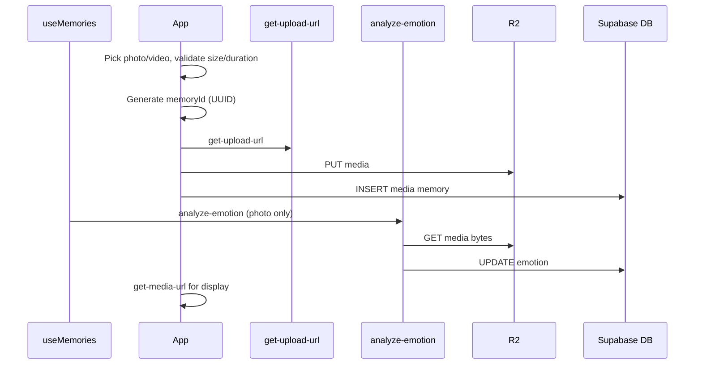

# Feature: Media memories (photo & video attachments)

**Status:** `done`
**Last updated:** 2026-07-12
**PRD reference:** §6.3 Journal Entries (Memories) — `media` type

## Overview

Parents can attach 1-10 user-uploaded photos/videos to a memory instead of — or in addition to — relying on an AI-generated illustration. Mixed photo/video memories are ordered, private, and displayed as carousels in timeline/detail views. The `media` memory type is a first-class citizen: it follows the same R2 presigned-URL pattern as family profile photos and is fully covered by RLS and account deletion.

## User-facing behavior

- In the new-memory form, a media attach icon sits in the toolbar alongside the text field.
- From the iOS or Android gallery, users can select photos/videos, tap Share,
  and choose Momora. Momora opens the new-memory form with those assets already
  attached and ready for captioning, tagging, reordering, or removal.
- Tapping the icon lets users choose from the camera roll (`expo-image-picker`) or take a photo.
  - Accepted: JPEG, HEIC, PNG, WEBP (≤ 20 MB); MP4, MOV video (≤ 60 seconds duration).
  - Up to 10 assets can be attached to a single memory.
  - Exceeding limits shows an inline validation message; upload is blocked.
- Camera/library access checks the existing permission before requesting it,
  waits for permission/source-chooser UI to dismiss before presenting the
  picker, and reports native launch failures inline instead of silently
  leaving the composer stuck. Concurrent picker launches are ignored.
- **Capture-date prefill (new-memory composer only):** picking library photos
  in the create screen requests EXIF from `expo-image-picker` and derives a
  `YYYY-MM-DD` suggestion from the earliest valid capture date across the
  currently attached photos. When a suggestion applies, the date pill shows
  that date with a muted "From photo" hint next to it (and an
  `accessibilityHint` on the date field itself). Manually changing the date
  overrides the suggestion for the rest of that composer session — no later
  add, remove, reorder, or wholesale attachment replacement (including an
  incoming share) can overwrite a user-chosen date. Removing every dated
  photo before any override restores the date the screen started with when it
  mounted (not a freshly recomputed "today"). Reordering alone never changes
  the suggested date. Videos, camera captures, web picks, and incoming shared
  media never carry a capture date, so they never move the date on their own.
  Missing, stripped, or implausible EXIF (wrong types, impossible calendar
  dates, dates more than one day in the future) is always a silent no-op —
  never an error that blocks attaching the photo or saving the memory. The
  edit-memory composer never requests EXIF and never suggests a date.
- Once media is attached, compact ordered tiles appear in the form; the AI illustration toggle is hidden.
- Long-pressing a tile enters reorder mode; users can move or remove tiles before saving.
- Caption text is optional for `media` memories; the save button is enabled as soon as media is attached.
- **Deferred posting (Instagram-style):** tapping Save closes the composer immediately. Compression + upload continue in a background queue; the Timeline and Calendar show a pending card ("Posting memory… — Uploading n of m") above the feed until the memory lands. Failures flip the card to Retry/Discard. The queue is in-memory only — force-quitting mid-upload loses the pending post (persistence is backlog).
- On the Timeline and detail screen, `media` memories render an Instagram-style carousel with subtle dots and a small pagination counter when more than one asset exists.
- Media assets persist their natural display `aspect_ratio` before the memory row appears. Videos derive it from a transformed frame after compression because encoded track dimensions can precede phone rotation metadata; images use their re-encoded output dimensions. Timeline cards therefore start at their final height with no async resize and no fixed-ratio gutters. Multi-asset carousels still clamp the first asset's ratio to `3:4`-`16:9` so every page shares a practical frame.
- Timeline videos show a cached first-frame thumbnail whenever playback is inactive and keep that thumbnail over the player until its first frame renders, avoiding the gray-player flash at the visibility threshold.
- **Photo** memories: after save, async emotion analysis may replace the Photo badge with an emotion chip (same labels as text memories). Failures do not block save.
- **Video** memories: no emotion chip in MVP (Photo/Video badge only).
- On the memory detail screen, photos display full-width via presigned URL; videos play inline via `expo-video`, loop with sound, and hide native controls.
- Tapping any photo or video on the memory detail screen opens it in a warm, dark full-screen viewer. Multi-asset memories open at the tapped carousel position and preserve horizontal swipe paging, the page counter, and dots. Full-screen videos loop with sound and toggle play/pause when tapped; closing returns to the same detail screen.
- Editing a `media` memory allows adding, removing, and reordering assets, but at least one asset must remain.
- Deleting a `media` memory deletes all R2 media objects before or alongside the DB row deletion.

## Architecture



Key points:
- The client generates `memoryId` and a `mediaAssetId` UUID for each new file upfront so R2 object keys are known before DB writes.
- **Video compression:** new video uploads are transcoded on-device to H.264 MP4 capped at 1280px (`src/utils/video-compression.ts`, `react-native-compressor`) during save, so a picked `.mov` is stored as `.mp4`. Compression is best-effort — any failure (and web) falls back to uploading the original file, so both `video/mp4` and `video/quicktime` remain accepted upload types. Requires a dev-client rebuild (native module).
- **Image EXIF/GPS stripping:** every new image upload is re-encoded via `expo-image-manipulator` (`src/utils/strip-image-metadata.ts`) immediately before the PUT, in the same `uploadMemoryMediaAssets` step that runs video compression — so create, edit, and incoming-share attachments are all covered. The re-encode drops all EXIF (GPS, timestamps, device Make/Model/MakerNote) on both platforms. JPEG/PNG/WEBP keep their format at quality 0.92 (a deliberately *higher* quality than the picker's 0.85 export, to avoid visible double-compression loss); HEIC/HEIF re-encodes to JPEG since the manipulator cannot write HEIC, so the uploaded `contentType` and object-key extension always reflect the stripped output. This step is fail-closed (a re-encode failure rejects the upload instead of falling back to the unstripped original) — see Constraints & gotchas. **Videos are not covered**: their container-level metadata is uploaded as-is.
- **Playback:** only the visible video page mounts an `expo-video` player. Each player targets an 8-second forward buffer with a 16 MiB byte cap and enables disk caching (`useCaching: true`), preventing legacy high-bitrate videos and adjacent pages from exhausting Android's Java heap.
- **Stable media layout:** `memory_media.aspect_ratio` is written with the ordered asset metadata. New videos are measured from an `expo-video-thumbnails` frame after compression, so phone rotation is reflected; image ratios come from the EXIF-stripped output dimensions. Existing videos are backfilled once with `supabase/scripts/backfill-media-aspect-ratios.ts` using `ffprobe` rotation metadata. Timeline rows use only the persisted ratio (or a stable 4:3 legacy fallback), while detail may still measure a null legacy row at runtime.
- **Signed URL recovery:** app foregrounding is wired to TanStack Query focus state. Private images use stable object-key/version cache keys and refetch their presigned URL after an image load error, so expired one-hour URLs recover without repeatedly downloading unchanged bytes.
- `memory_media` stores the canonical ordered asset list; `memories.media_key` and `media_content_type` cache the cover asset for compatibility.
- **Photo/mixed** memories: `analyze-emotion` runs asynchronously after save/edit; it uses the first ordered image asset + optional caption. Does **not** run `generate-illustration`.
- **All-video** memories: no `analyze-emotion` call in MVP.
- `illustration_status` remains `'none'` for all `media` memories.
- **Capture-date prefill data flow:** `expo-image-picker` → (`asset.exif`, only when the create screen's `includeCaptureDate` opts in) → `extractCaptureDateIso` derives a `YYYY-MM-DD` scalar per image asset → stored as `MediaAttachment.capturedAtIso` → `useSuggestedMemoryDate` derives the earliest valid one across attached photos via `deriveSuggestedMemoryDate` and applies it to the date pill unless the user has already overridden it. `capturedAtIso` is presentation-only: it is never included in the deferred upload payload (`enqueuePendingMemoryUpload`'s `mediaAssets`), never logged, and the raw EXIF object itself (which can include GPS/device fields) is discarded immediately after extraction — only the derived scalar exists in React state.

## Data model

| Column | Type | Notes |
|--------|------|-------|
| `memories.memory_type` | `text` (`media`) | Identifies this as a media memory |
| `memories.content` | `text` (nullable) | Optional caption |
| `memories.media_key` | `text` | Cover/cache R2 key for position 0 |
| `memories.media_content_type` | `text` | Cover/cache MIME type for position 0 |
| `memory_media.object_key` | `text` | Canonical R2 object key for each ordered media asset |
| `memory_media.content_type` | `text` | MIME type e.g. `image/jpeg`, `video/mp4` |
| `memory_media.aspect_ratio` | `double precision` (nullable) | Natural display width ÷ height; persisted before timeline render; constrained to `0.1`-`10` |
| `memory_media.position` | `integer` | 0-based order, max 9 |
| `memories.illustration_key` | `text` (null) | Always null for `media` type |
| `memories.illustration_status` | `text` (`none`) | Always `none` for `media` type |

**R2 key pattern:** `{userId}/memories/{memoryId}/media/{mediaAssetId}.{ext}`

Legacy single-media objects remain accepted at `{userId}/memories/{memoryId}/media.{ext}`.

The `{ext}` should reflect the actual format: `jpg`, `png`, `heic`, `webp`, `mp4`, `mov`. Using the content type to derive the extension is acceptable.

**RLS:** covered by the family-scoped `memories`/`memory_media` policies (`is_family_member` for select, owner/manager for insert/update/delete) — see [family-sharing.md](./family-sharing.md). No `media`-specific policy needed.

**Account deletion:** `hard-delete-expired-accounts` no longer does a blanket delete of everything under `{userId}/`. For an **owner**, it collects `memory_media.object_key` (plus other family R2 keys) across every creator in each family they own before deleting; for a **non-owner**, it deletes only objects under their own prefix that no surviving row still references (their created media can outlive their account). See [family-sharing.md](./family-sharing.md#constraints--gotchas) and TECH_SPEC §4.9.

## API & Edge Functions

| Function | Role | Auth |
|----------|------|------|
| `get-upload-url` | Presign PUT for memory media asset keys | JWT |
| `upload-media` | Authenticated binary upload proxy for mobile media uploads | JWT |
| `get-media-url` | Presign GET for display (same function as illustrations/portraits) | JWT |
| `delete-storage-object` | Delete user-owned memory media (and rollback on failed create) | JWT |
| `analyze-emotion` | Photo emotion + palette (`gpt-4o-mini` vision); optional caption | JWT |
| `replace_memory_media_assets` RPC | Transactionally replace ordered media assets and cover cache | JWT/RLS |

**`get-upload-url` — allowed pattern for media memories:**

```
objectKey: {uid}/memories/{memoryId}/media/{mediaAssetId}.{ext}
contentType: image/jpeg | image/png | image/heic | image/webp | video/mp4 | video/quicktime
```

The Edge Function rejects unknown content types and object keys that do not match an allowed pattern. See TECH_SPEC §4.0 for the full contract.

Mobile upload flow uses `upload-media` so the device only talks to Supabase; `get-upload-url` remains available for direct presigned uploads. Display still uses `get-media-url`. Photo emotion uses `analyze-emotion` (see TECH_SPEC §4.2).

## Client integration

| Layer | Files | Responsibility |
|-------|-------|----------------|
| Routes | `app/(app)/new-memory.tsx`, `app/(app)/memory/[id].tsx` | Emergent type logic, media picker trigger, caption field, save flow |
| Routes | `app/(app)/new-memory.tsx` | Also wires `useSuggestedMemoryDate`, passes `includeCaptureDate` to `MemoryMediaPicker` (create screen only), and renders the "From photo" hint next to the date pill |
| Hooks | `src/hooks/useMemories.ts` | List/detail queries, edit/delete mutations; polls for emotion chip |
| Hooks | `src/hooks/use-pending-memory-uploads.tsx` | Deferred posting queue (provider in `AppProviders`); runs `postMediaMemory`, kicks emotion analysis + family notify, exposes retry/discard |
| Hooks | `src/hooks/use-suggested-memory-date.ts` | New — single-reducer `{ memoryDate, dateSource }` state machine; derives the earliest EXIF capture date across attached photos, restores the session baseline when none remain, and locks in a user override for the rest of the composer session |
| Services | `src/services/memory-posting.ts` | `postMediaMemory` pipeline: compress (video) → strip EXIF (image) → upload (3-way concurrency, per-asset progress) → insert, rollback on failure; shared `uploadMemoryMediaAssets` also backs the edit flow and incoming-share attachments |
| Utils | `src/utils/strip-image-metadata.ts` | New — `stripImageMetadataForUpload` re-encodes image assets via `expo-image-manipulator` to strip EXIF/GPS before upload; videos pass through; fail-closed on re-encode error |
| Utils | `src/utils/video-aspect-ratio.ts` | Extracts a rotation-corrected local video frame and returns its display aspect ratio before upload |
| Script | `supabase/scripts/backfill-media-aspect-ratios.ts` | Dry-run/apply utility for existing video rows; reads private R2 objects, accounts for rotation with `ffprobe`, and updates only null ratios |
| Services | `src/services/memories.ts` | `createMediaMemory`, `runMediaPhotoEmotionAnalysis` |
| Components | `src/components/pending-memory-uploads-banner.tsx`, `pending-memory-upload-card.tsx` | Pending/failed post cards above the Timeline & Calendar feeds |
| Components | `src/components/memory-card.tsx` | Conditional render: photo thumbnail vs video thumbnail vs illustration |
| Components | `src/components/memory-media-picker.tsx` | New — wraps `expo-image-picker`; validates size/duration; emits `{ uri, contentType, duration? }`; opt-in `includeCaptureDate` prop passes `exif: true` to the library picker and attaches a derived `capturedAtIso` to image results only (never video, never the camera path, never raw EXIF) |
| Utils | `src/utils/media-capture-date.ts` | New — `extractCaptureDateIso` (strict EXIF `DateTimeOriginal`/`DateTimeDigitized`/`DateTime` parsing + Gregorian validation, `today + 1 day` tolerance) and `deriveSuggestedMemoryDate` (earliest valid `capturedAtIso` across attachments) |
| Components | `src/components/memory-media-preview.tsx` | New — inline form preview with remove button |
| Components | `src/components/full-screen-media-viewer.tsx` | Shared full-screen image/video viewer; resolves private R2 keys, pages mixed carousels, and controls active video playback |
| Native entry | `app/+native-intent.ts`, `app.json` | Registers Momora for image/video shares and routes incoming share intents to the composer |
| Root routing | `src/components/incoming-share-router.tsx`, `app/_layout.tsx` | Cold-start fallback: after auth/family routing settles, detects a persisted native payload and opens the composer if the initial deep link was lost |
| Hook | `src/hooks/use-incoming-memory-share.ts` | Resolves native payloads, reads video duration, validates limits, and hands attachments to the composer |

### How to invoke from another feature

To create a `media` memory programmatically:

1. Validate each file (size ≤ 20 MB for images; size ≤ 100 MB and duration ≤ 60 s for videos) before upload.
2. Call `memoriesService.createMediaMemory({ mediaAssets, caption?, taggedMemberIds?, memoryDate? })`.
3. The service handles: generate UUID → upload through `upload-media` → DB insert in order.
4. On success, invalidate the `useMemories` query. For **photos**, the hook also runs `runMediaPhotoEmotionAnalysis` and refetches when complete.
5. Timeline may poll briefly (3 min window) while photo `media` rows have `emotion = null`.

## Extension guide

**Safe to extend**

- Add video thumbnail generation (server-side via an Edge Function or client-side first-frame grab) without touching the upload flow.
- Add an AI illustration option to `media` memories post-MVP — invoke `generate-illustration` after emotion (emotion already runs for photos).
- Add server-side thumbnails for video assets without changing the ordered `memory_media` contract.

**Do not change without updating this doc**

- The R2 key pattern `{userId}/memories/{memoryId}/media/{mediaAssetId}.{ext}` — any change requires updating account deletion, presign validation, and all display paths.
- The `memory_type` check constraint in the DB schema — adding/removing values requires a migration and updates to all conditional branches in the client.
- The `get-upload-url` allowed patterns list — changing validation here affects both family photo and memory media uploads.

**Common extension patterns**

- **New media type (e.g. audio):** Add MIME type to `get-upload-url` allowed set, add handling in `memory-media-viewer`, update `media_content_type` documentation.
- **Media replacement on edit:** Upload new file to same key (R2 PUT overwrites), update `media_content_type` if changed.
- **Video thumbnailing:** Fetch the presigned URL in a Deno Edge Function, extract first frame, store as `{userId}/memories/{memoryId}/thumb.webp`, add `media_thumb_key` column.
- **Capture-date location extension (Phase 2):** Do not extend `MediaAttachment` with the raw EXIF object. If a future phase needs location, extract a minimal typed value at the picker boundary, review Android scoped-media permission behavior (`ACCESS_MEDIA_LOCATION`) and iOS privacy copy, define explicit retention/storage semantics, and update PRD/TECH_SPEC/security docs before implementation.

## Constraints & gotchas

- **Client-side duration validation only** — R2 presigned URLs cannot enforce video duration server-side at upload time. The client must read video metadata (duration) before requesting the presigned URL and block uploads exceeding 60 seconds.
- **`expo-video` is required for playback** — this is a new native dependency that requires a fresh EAS build. `expo-av` must not be used.
- **`expo-image-picker` is already in the dependency list** (PRD §11) — no new native dep for photo selection.
- **1-10 media assets per memory** — `memory_media` is canonical; `memories.media_key` remains a cover/cache field.
- **A new development build is required** after enabling incoming sharing. The
  iOS share extension and Android intent filters are native build artifacts and
  are not added by an over-the-air JavaScript update.
- Incoming shares use Expo's experimental receive-sharing API. On iOS, Expo's
  share extension opens the main Momora target; this should be smoke-tested on
  each supported iOS release before shipping.
- **Cold-start routing has two paths:** `app/+native-intent.ts` handles the
  native `momora://expo-sharing` URL directly. If that initial URL is lost
  while Expo Router boots, `IncomingShareRouter` waits for `/` to settle into
  an authenticated family route, checks the still-persisted payload, and then
  opens the composer. It never clears payloads; only the composer does that.
- **Illustration pipeline** — `generate-illustration` is not used for `media`. Photo emotion uses `analyze-emotion` only; `illustration_status` stays `'none'`.
- **Privacy** — user-uploaded photos (and optional captions) are sent to OpenAI for emotion classification, same trust boundary as portrait generation.
- **Capture-date prefill is create-only and fail-open** — `includeCaptureDate`/EXIF is requested only by `app/(app)/new-memory.tsx`; the edit composer, incoming-share attachments, camera captures, and web picks never carry a capture date, so they never move the date on their own. Missing, stripped, or implausible EXIF (wrong types, impossible calendar dates, dates further than one day in the future) is always a silent no-op — never an error that blocks attaching or saving. Only the derived `YYYY-MM-DD` scalar ever enters React state, an attachment, a log line, or a request/queue payload; the raw EXIF object (which can include GPS/device fields) is discarded immediately after extraction at the picker boundary.
- **`exif: true` has no measurable iCloud-latency cost in this SDK version** — the picker's `quality: 0.85` already forces iOS's slow path (`MediaHandler.swift` only takes the fast path at `quality >= 1`), so the full original asset — including an iCloud download for cloud-only assets — loads on every library pick regardless of the `exif` option. `exif: true` only parses metadata that was already fetched; do not reintroduce a latency rationale for gating it.
- **EXIF shape is a confirmed, version-pinned platform contract, not a guess** — `expo-image-picker@56.0.20`'s `asset.exif` is a flat top-level object on both platforms (iOS merges TIFF fields in; Android emits flat `ExifInterface` tag names). `extractCaptureDateIso` is typed `unknown` and fails closed (returns null) rather than adding speculative nested `{ Exif }`/`{ TIFF }` handling. Re-verify this assumption when upgrading Expo SDK or `expo-image-picker`.
- **Earliest-date rule** — when multiple attached photos have valid capture dates, the suggestion is always the earliest one, not the most-recently-attached one; a reorder that doesn't change which date is earliest is a no-op (no re-render-visible state change).
- **Uploaded image binaries are stripped of EXIF/GPS at upload time, on both platforms** — `uploadMemoryMediaAssets` (`src/services/memory-posting.ts`) re-encodes every image asset via `expo-image-manipulator` (`src/utils/strip-image-metadata.ts`) immediately before the PUT, regardless of whether `includeCaptureDate` is set. This closes the gap where, on Android, `quality: 0.85` previously routed picks through `CompressionImageExporter`, which copied essentially all EXIF tags (GPS refs/timestamps, `DateTime*`, Make/Model, MakerNote) from the source into the uploaded file verbatim; iOS's `quality < 1` slow path happened to already drop metadata via its `UIImage` re-encode. The strip step is **fail-closed**: if the re-encode fails, the upload rejects instead of silently falling back to the unstripped original (a deliberate privacy-control choice — the pending-uploads queue already exposes per-asset failures as a manual Retry/Discard, so this can't strand the queue in an automatic retry loop). **Videos are explicitly out of scope** — container-level metadata (e.g. any embedded location/creation-time atoms in an uploaded MP4/MOV) is not stripped and is uploaded as-is.
- **HEIC emotion** — if Edge cannot decode HEIC for vision, emotion stays unset (`unsupported_image_format`); client-side JPEG conversion is backlog.
- **Edit flow: removing media** — at least one asset must remain. Converting media memories to `text_only` is out of scope.
- **HEIC format** — iOS default photo format. `expo-image` handles display, but if you need to transcode server-side (e.g. for thumbnails), note that Deno has limited HEIC support.

## Family sharing

Uploads carry a `familyId` (owner/manager check in `get-upload-url`/
`upload-media`); reads resolve the owning family from the key itself via
`_shared/storage-keys.ts#parseStorageKey`, not from `memory_media`
references. Viewers can view media but cannot attach/reorder/remove it. See
[family-sharing.md](./family-sharing.md#storage-authorization-model).

## Dependencies

- Depends on: [Memories & illustrations](./memories.md) — extends the `memories` table and `memory_type` concept
- Depends on: [Family profiles](./family-profiles.md) — tagging still uses the same family member picker
- Used by: Timeline, Calendar, Memory detail screen

## Testing

### Unit tests

| File | Covers |
|------|--------|
| `src/utils/media-validation.test.ts` | File size limit, video duration limit, MIME type allow-list |
| `src/utils/native-permissions.test.ts` | Existing-grant checks, one-time request, permanent denial, native presentation settling |
| `src/utils/prepare-shared-media.test.ts` | Incoming payload conversion, unsupported content, duration and 10-item limits |
| `src/services/memories.test.ts` | `createMediaMemory` — success, upload failure, insert failure |
| `src/services/memory-posting.test.ts` | Upload pipeline — UUID-based keys, per-asset progress, rollback on upload/insert failure; EXIF strip wired before the PUT, HEIC→JPEG contentType/extension consistency, videos skip the strip, strip failure fails closed with no partial upload |
| `src/hooks/use-pending-memory-uploads.test.tsx` | Queue lifecycle — posting → removed on success, failed → retry/discard, photo emotion kick, video skip, family notify |
| `src/utils/media-capture-date.test.ts` | `extractCaptureDateIso` key priority/fallback, flat-shape-only parsing, colon-format parsing without `Date()` coercion, NUL/whitespace trimming, Gregorian validation (zero fields, invalid month/day, leap years, year floor), deterministic `today`/`today+1` boundary; `deriveSuggestedMemoryDate` earliest-valid-date selection |
| `src/utils/strip-image-metadata.test.ts` | `stripImageMetadataForUpload` — JPEG/PNG/WEBP keep format, HEIC/HEIF convert to JPEG, videos pass through untouched (no `manipulateAsync` call), re-encode failure rejects (fail-closed) |
| `src/utils/video-aspect-ratio.test.ts` | Rotation-corrected video-frame ratio extraction and graceful thumbnail failure |
| `src/hooks/use-suggested-memory-date.test.tsx` | Session-baseline capture, media/default suggestion application, earliest-across-batches, remove-restores-baseline, reorder-is-a-no-op, manual override survives append/remove/reorder/replace, midnight-crossing baseline stability, render-to-render state consistency |

### Integration tests

| File | Scenarios |
|------|-----------|
| `src/services/memories.integration.test.ts` | `media` memory create (mock R2 upload + mock Supabase insert), edit (replace media), delete (R2 + DB) |
| `src/hooks/useMemories.integration.test.tsx` | Photo create/update triggers emotion analysis; video skips |
| `src/hooks/use-incoming-memory-share.integration.test.tsx` | Native resolved payload → validated composer attachment → intent cleared |
| `src/components/incoming-share-router.integration.test.tsx` | Cold-start persisted payload fallback, root-route race avoidance, viewer role gate, foreground recheck |
| `src/utils/media-emotion-polling.test.ts` | Poll window for photo media without emotion |
| `src/components/full-screen-media-viewer.integration.test.tsx` | Private URL resolution, tapped initial page, full-screen paging, video rendering, close action |
| `src/components/memory-media-carousel.test.tsx` | Active-page-only video mounting, bounded video buffers, stable timeline video layout, inactive/first-frame thumbnail coverage, signed-URL retry |
| `src/hooks/useVideoThumbnail.test.ts` | Rotation-aware thumbnail dimensions and remount-safe video thumbnail caching |
| `src/components/app-providers.test.tsx` | AppState-to-TanStack-Query focus synchronization for foreground refetches |
| `src/components/memory-media-picker.test.tsx` | Native launch failure feedback and concurrent-launch guard; `includeCaptureDate` → `exif` option wiring; image EXIF → `capturedAtIso`-only attachment (no raw EXIF/GPS/device fields); video EXIF ignored; absent/malformed EXIF still emits a valid attachment |
| `src/screen-tests/new-memory.integration.test.tsx` | Full screen wiring (deliberately under `src/`, not `app/` — see file header): EXIF-dated photo updates the date pill and shows the "From photo" hint; manual date override survives further attach/remove; an incoming-share replacement without metadata follows default/override rules; Save passes only the final `memoryDate` to the posting queue with no EXIF/capture metadata in the payload |

### E2E (Maestro)

| Flow | Scenario |
|------|----------|
| `.maestro/flows/memories/create-media-memory.yaml` | Pick photo → save → Timeline → detail → full-screen viewer → close |
| `.maestro/flows/memories/create-video-memory.yaml` | Happy path: pick video → save → open detail → video plays |
| `.maestro/flows/memories/share-gallery-media.android.yaml` | Stop Momora, then Android gallery share sheet → cold-launched composer opens with attachment |
| `.maestro/flows/memories/prefill-date-from-photo.yaml` | Native-picker smoke test: seed gallery with a known-EXIF JPEG fixture → attach → assert date + "From photo" hint (locale-agnostic year substring) → override date → hint clears → save succeeds. Native-only; not deterministic across emulators/OS versions, so `src/screen-tests/new-memory.integration.test.tsx` remains the CI regression — run this flow manually on iOS and Android development builds before release. |

### Edge Function tests (Deno)

| File | Covers |
|------|--------|
| `supabase/functions/get-upload-url/index.test.ts` | Accepts valid memory media path + content type; rejects invalid path pattern; rejects disallowed MIME type |
| `supabase/functions/analyze-emotion/index.test.ts` | Media photo vision path, video rejection, stale-write |
| `supabase/functions/_shared/media-emotion.test.ts` | MIME guards, emotion normalization |

### Run this feature's tests

```bash
npm test -- --testPathPattern=media
maestro test .maestro/flows/memories/create-media-memory.yaml
maestro test .maestro/flows/memories/create-video-memory.yaml
maestro test .maestro/flows/memories/prefill-date-from-photo.yaml
deno test supabase/functions/get-upload-url/
```

## Backlog

### Video emotion (not implemented)

Client extracts **3 keyframes** (start / middle / end of ≤60s clip) via `expo-video-thumbnails` (or equivalent). Single `gpt-4o-mini` multimodal call with all frames + optional caption; same `EMOTION_PALETTES`, stale-write guard, hook trigger. No server-side ffmpeg.

### MVP follow-ups

- `emotion_analysis_status` + retry UI when analysis fails
- Client HEIC → JPEG before upload (fewer `unsupported_image_format` cases)
- Image moderation pre-check for user-uploaded photos
- Per-user Edge rate limits (stronger than 5s per-memory cooldown)

## Changelog

| Date | Change |
|------|--------|
| 2026-07-13 | Persisted natural media aspect ratios (including rotation-corrected post-compression video ratios), added a legacy-video backfill, and made timeline rows consume the stored value immediately; cached first-frame thumbnails prevent gray flashes around playback activation |
| 2026-07-12 | Fixed rotated portrait videos reporting landscape track dimensions and leaving side gutters in timeline/detail cards |
| 2026-07-12 | Uploaded image binaries (create, edit, and incoming-share) are now re-encoded via `expo-image-manipulator` to strip EXIF/GPS/device metadata before upload, on both Android and iOS (`src/utils/strip-image-metadata.ts`, wired into `uploadMemoryMediaAssets` in `src/services/memory-posting.ts`); fail-closed on re-encode failure. Videos remain out of scope. Closes the gap noted in `docs/plans/media-exif-capture-date-prefill.md` |
| 2026-07-12 | New-memory composer only: library photo attachments now pre-fill the memory date from the earliest valid EXIF capture date, shown as an overridable "From photo" suggestion (`src/utils/media-capture-date.ts`, `src/hooks/use-suggested-memory-date.ts`); edit-memory composer unaffected |
| 2026-07-12 | Added full-screen photo/video viewing from memory detail, including mixed-carousel paging from the tapped item |
| 2026-07-12 | Bounded video buffers, removed adjacent player preloading, and added signed-image URL expiry recovery |
| 2026-07-12 | Hardened camera/library permission and native picker presentation lifecycle |
| 2026-07-12 | Detail videos now loop with hidden native controls |
| 2026-07-12 | Single-asset media now uses its exact natural aspect ratio; multi-asset carousels retain the `3:4`-`16:9` clamp |
| 2026-07-12 | Deferred posting: Save closes the composer instantly; a pending-uploads queue (`use-pending-memory-uploads`) posts in the background with progress cards on Timeline/Calendar and Retry/Discard on failure |
| 2026-07-12 | Added iOS/Android gallery share target; incoming photos/videos now open pre-attached in the memory composer |
| 2026-07-13 | Added a root persisted-payload fallback so cold launches still reach the composer when Expo Router misses the initial share URL |
| 2026-05-26 | Photo media: async `analyze-emotion` vision; video emotion backlog |
| 2026-05-25 | Initial planned spec — `media` memory type (photo + video), emergent UX, phased implementation |
