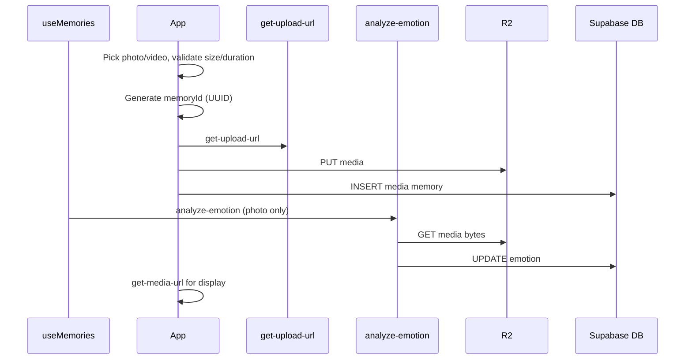

# Feature: Media memories (photo & video attachments)

**Status:** `done`
**Last updated:** 2026-07-12
**PRD reference:** §6.3 Journal Entries (Memories) — `media` type

## Overview

Parents can attach 1-10 user-uploaded photos/videos to a memory instead of — or in addition to — relying on an AI-generated illustration. Mixed photo/video memories are ordered, private, and displayed as carousels in timeline/detail views. The `media` memory type is a first-class citizen: it follows the same R2 presigned-URL pattern as family profile photos and is fully covered by RLS and account deletion.

## User-facing behavior

- In the new-memory form, a media attach icon sits in the toolbar alongside the text field.
- Tapping the icon lets users choose from the camera roll (`expo-image-picker`) or take a photo.
  - Accepted: JPEG, HEIC, PNG, WEBP (≤ 20 MB); MP4, MOV video (≤ 60 seconds duration).
  - Up to 10 assets can be attached to a single memory.
  - Exceeding limits shows an inline validation message; upload is blocked.
- Once media is attached, compact ordered tiles appear in the form; the AI illustration toggle is hidden.
- Long-pressing a tile enters reorder mode; users can move or remove tiles before saving.
- Caption text is optional for `media` memories; the save button is enabled as soon as media is attached.
- On the Timeline and detail screen, `media` memories render an Instagram-style carousel with subtle dots and a small pagination counter when more than one asset exists.
- **Photo** memories: after save, async emotion analysis may replace the Photo badge with an emotion chip (same labels as text memories). Failures do not block save.
- **Video** memories: no emotion chip in MVP (Photo/Video badge only).
- On the memory detail screen, photos display full-width via presigned URL; videos play inline via `expo-video`.
- Editing a `media` memory allows adding, removing, and reordering assets, but at least one asset must remain.
- Deleting a `media` memory deletes all R2 media objects before or alongside the DB row deletion.

## Architecture



Key points:
- The client generates `memoryId` and a `mediaAssetId` UUID for each new file upfront so R2 object keys are known before DB writes.
- **Video compression:** new video uploads are transcoded on-device to H.264 MP4 capped at 1280px (`src/utils/video-compression.ts`, `react-native-compressor`) during save, so a picked `.mov` is stored as `.mp4`. Compression is best-effort — any failure (and web) falls back to uploading the original file, so both `video/mp4` and `video/quicktime` remain accepted upload types. Requires a dev-client rebuild (native module).
- **Playback:** the carousel preloads the (paused) player for pages adjacent to the active one and enables `expo-video` disk caching (`useCaching: true`), so swiping to a video or reopening it doesn't re-stream from R2.
- `memory_media` stores the canonical ordered asset list; `memories.media_key` and `media_content_type` cache the cover asset for compatibility.
- **Photo/mixed** memories: `analyze-emotion` runs asynchronously after save/edit; it uses the first ordered image asset + optional caption. Does **not** run `generate-illustration`.
- **All-video** memories: no `analyze-emotion` call in MVP.
- `illustration_status` remains `'none'` for all `media` memories.

## Data model

| Column | Type | Notes |
|--------|------|-------|
| `memories.memory_type` | `text` (`media`) | Identifies this as a media memory |
| `memories.content` | `text` (nullable) | Optional caption |
| `memories.media_key` | `text` | Cover/cache R2 key for position 0 |
| `memories.media_content_type` | `text` | Cover/cache MIME type for position 0 |
| `memory_media.object_key` | `text` | Canonical R2 object key for each ordered media asset |
| `memory_media.content_type` | `text` | MIME type e.g. `image/jpeg`, `video/mp4` |
| `memory_media.position` | `integer` | 0-based order, max 9 |
| `memories.illustration_key` | `text` (null) | Always null for `media` type |
| `memories.illustration_status` | `text` (`none`) | Always `none` for `media` type |

**R2 key pattern:** `{userId}/memories/{memoryId}/media/{mediaAssetId}.{ext}`

Legacy single-media objects remain accepted at `{userId}/memories/{memoryId}/media.{ext}`.

The `{ext}` should reflect the actual format: `jpg`, `png`, `heic`, `webp`, `mp4`, `mov`. Using the content type to derive the extension is acceptable.

**RLS:** covered by the family-scoped `memories`/`memory_media` policies (`is_family_member` for select, owner/manager for insert/update/delete) — see [family-sharing.md](./family-sharing.md). No `media`-specific policy needed.

**Account deletion:** `hard-delete-expired-accounts` no longer does a blanket delete of everything under `{userId}/`. For an **owner**, it collects `memory_media.object_key` (plus other family R2 keys) across every creator in each family they own before deleting; for a **non-owner**, it deletes only objects under their own prefix that no surviving row still references (their created media can outlive their account). See [family-sharing.md](./family-sharing.md#constraints--gotchas) and TECH_SPEC §4.9.

## API & Edge Functions

| Function | Role | Auth |
|----------|------|------|
| `get-upload-url` | Presign PUT for memory media asset keys | JWT |
| `upload-media` | Authenticated binary upload proxy for mobile media uploads | JWT |
| `get-media-url` | Presign GET for display (same function as illustrations/portraits) | JWT |
| `delete-storage-object` | Delete user-owned memory media (and rollback on failed create) | JWT |
| `analyze-emotion` | Photo emotion + palette (`gpt-4o-mini` vision); optional caption | JWT |
| `replace_memory_media_assets` RPC | Transactionally replace ordered media assets and cover cache | JWT/RLS |

**`get-upload-url` — allowed pattern for media memories:**

```
objectKey: {uid}/memories/{memoryId}/media/{mediaAssetId}.{ext}
contentType: image/jpeg | image/png | image/heic | image/webp | video/mp4 | video/quicktime
```

The Edge Function rejects unknown content types and object keys that do not match an allowed pattern. See TECH_SPEC §4.0 for the full contract.

Mobile upload flow uses `upload-media` so the device only talks to Supabase; `get-upload-url` remains available for direct presigned uploads. Display still uses `get-media-url`. Photo emotion uses `analyze-emotion` (see TECH_SPEC §4.2).

## Client integration

| Layer | Files | Responsibility |
|-------|-------|----------------|
| Routes | `app/(app)/new-memory.tsx`, `app/(app)/memory/[id].tsx` | Emergent type logic, media picker trigger, caption field, save flow |
| Hooks | `src/hooks/useMemories.ts` | Upload + save; triggers `runMediaPhotoEmotionAnalysis` for photos; polls for emotion chip |
| Services | `src/services/memories.ts` | `createMediaMemory`, `runMediaPhotoEmotionAnalysis` |
| Components | `src/components/memory-card.tsx` | Conditional render: photo thumbnail vs video thumbnail vs illustration |
| Components | `src/components/memory-media-picker.tsx` | New — wraps `expo-image-picker`; validates size/duration; emits `{ uri, contentType, duration? }` |
| Components | `src/components/memory-media-preview.tsx` | New — inline form preview with remove button |

### How to invoke from another feature

To create a `media` memory programmatically:

1. Validate each file (size ≤ 20 MB for images; size ≤ 100 MB and duration ≤ 60 s for videos) before upload.
2. Call `memoriesService.createMediaMemory({ mediaAssets, caption?, taggedMemberIds?, memoryDate? })`.
3. The service handles: generate UUID → upload through `upload-media` → DB insert in order.
4. On success, invalidate the `useMemories` query. For **photos**, the hook also runs `runMediaPhotoEmotionAnalysis` and refetches when complete.
5. Timeline may poll briefly (3 min window) while photo `media` rows have `emotion = null`.

## Extension guide

**Safe to extend**

- Add video thumbnail generation (server-side via an Edge Function or client-side first-frame grab) without touching the upload flow.
- Add an AI illustration option to `media` memories post-MVP — invoke `generate-illustration` after emotion (emotion already runs for photos).
- Add server-side thumbnails for video assets without changing the ordered `memory_media` contract.

**Do not change without updating this doc**

- The R2 key pattern `{userId}/memories/{memoryId}/media/{mediaAssetId}.{ext}` — any change requires updating account deletion, presign validation, and all display paths.
- The `memory_type` check constraint in the DB schema — adding/removing values requires a migration and updates to all conditional branches in the client.
- The `get-upload-url` allowed patterns list — changing validation here affects both family photo and memory media uploads.

**Common extension patterns**

- **New media type (e.g. audio):** Add MIME type to `get-upload-url` allowed set, add handling in `memory-media-viewer`, update `media_content_type` documentation.
- **Media replacement on edit:** Upload new file to same key (R2 PUT overwrites), update `media_content_type` if changed.
- **Video thumbnailing:** Fetch the presigned URL in a Deno Edge Function, extract first frame, store as `{userId}/memories/{memoryId}/thumb.webp`, add `media_thumb_key` column.

## Constraints & gotchas

- **Client-side duration validation only** — R2 presigned URLs cannot enforce video duration server-side at upload time. The client must read video metadata (duration) before requesting the presigned URL and block uploads exceeding 60 seconds.
- **`expo-video` is required for playback** — this is a new native dependency that requires a fresh EAS build. `expo-av` must not be used.
- **`expo-image-picker` is already in the dependency list** (PRD §11) — no new native dep for photo selection.
- **1-10 media assets per memory** — `memory_media` is canonical; `memories.media_key` remains a cover/cache field.
- **Illustration pipeline** — `generate-illustration` is not used for `media`. Photo emotion uses `analyze-emotion` only; `illustration_status` stays `'none'`.
- **Privacy** — user-uploaded photos (and optional captions) are sent to OpenAI for emotion classification, same trust boundary as portrait generation.
- **HEIC emotion** — if Edge cannot decode HEIC for vision, emotion stays unset (`unsupported_image_format`); client-side JPEG conversion is backlog.
- **Edit flow: removing media** — at least one asset must remain. Converting media memories to `text_only` is out of scope.
- **HEIC format** — iOS default photo format. `expo-image` handles display, but if you need to transcode server-side (e.g. for thumbnails), note that Deno has limited HEIC support.

## Family sharing

Uploads carry a `familyId` (owner/manager check in `get-upload-url`/
`upload-media`); reads resolve the owning family from the key itself via
`_shared/storage-keys.ts#parseStorageKey`, not from `memory_media`
references. Viewers can view media but cannot attach/reorder/remove it. See
[family-sharing.md](./family-sharing.md#storage-authorization-model).

## Dependencies

- Depends on: [Memories & illustrations](./memories.md) — extends the `memories` table and `memory_type` concept
- Depends on: [Family profiles](./family-profiles.md) — tagging still uses the same family member picker
- Used by: Timeline, Calendar, Memory detail screen

## Testing

### Unit tests

| File | Covers |
|------|--------|
| `src/utils/media-validation.test.ts` | File size limit, video duration limit, MIME type allow-list |
| `src/services/memories.test.ts` | `createMediaMemory` — success, upload failure, insert failure |

### Integration tests

| File | Scenarios |
|------|-----------|
| `src/services/memories.integration.test.ts` | `media` memory create (mock R2 upload + mock Supabase insert), edit (replace media), delete (R2 + DB) |
| `src/hooks/useMemories.integration.test.tsx` | Photo create/update triggers emotion analysis; video skips |
| `src/utils/media-emotion-polling.test.ts` | Poll window for photo media without emotion |

### E2E (Maestro)

| Flow | Scenario |
|------|----------|
| `.maestro/flows/memories/create-media-memory.yaml` | Happy path: pick photo → optional caption → save → verify Timeline card shows thumbnail |
| `.maestro/flows/memories/create-video-memory.yaml` | Happy path: pick video → save → open detail → video plays |

### Edge Function tests (Deno)

| File | Covers |
|------|--------|
| `supabase/functions/get-upload-url/index.test.ts` | Accepts valid memory media path + content type; rejects invalid path pattern; rejects disallowed MIME type |
| `supabase/functions/analyze-emotion/index.test.ts` | Media photo vision path, video rejection, stale-write |
| `supabase/functions/_shared/media-emotion.test.ts` | MIME guards, emotion normalization |

### Run this feature's tests

```bash
npm test -- --testPathPattern=media
maestro test .maestro/flows/memories/create-media-memory.yaml
maestro test .maestro/flows/memories/create-video-memory.yaml
deno test supabase/functions/get-upload-url/
```

## Backlog

### Video emotion (not implemented)

Client extracts **3 keyframes** (start / middle / end of ≤60s clip) via `expo-video-thumbnails` (or equivalent). Single `gpt-4o-mini` multimodal call with all frames + optional caption; same `EMOTION_PALETTES`, stale-write guard, hook trigger. No server-side ffmpeg.

### MVP follow-ups

- `emotion_analysis_status` + retry UI when analysis fails
- Client HEIC → JPEG before upload (fewer `unsupported_image_format` cases)
- Image moderation pre-check for user-uploaded photos
- Per-user Edge rate limits (stronger than 5s per-memory cooldown)

## Changelog

| Date | Change |
|------|--------|
| 2026-05-26 | Photo media: async `analyze-emotion` vision; video emotion backlog |
| 2026-05-25 | Initial planned spec — `media` memory type (photo + video), emergent UX, phased implementation |
