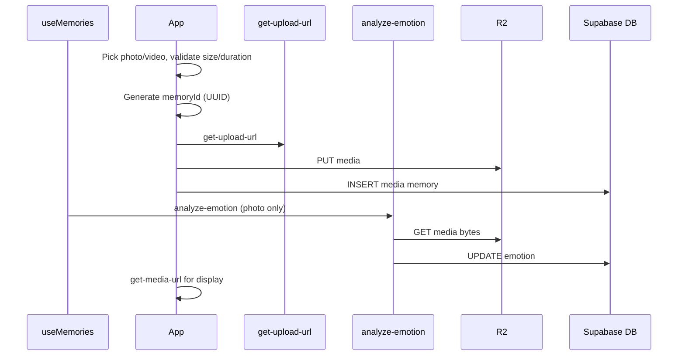

# Feature: Media memories (photo & video attachments)

**Status:** `done`
**Last updated:** 2026-07-16
**PRD reference:** §6.3 Journal Entries (Memories) — `media` type

## Overview

Parents can attach 1-10 user-uploaded photos/videos to a memory instead of — or in addition to — relying on an AI-generated illustration. Mixed photo/video memories are ordered, private, and displayed as carousels in timeline/detail views. The `media` memory type is a first-class citizen: it follows the same R2 presigned-URL pattern as family profile photos and is fully covered by RLS and account deletion.

## User-facing behavior

- In the new-memory form, a media attach icon sits in the toolbar alongside the text field.
- From the iOS or Android gallery, users can select photos/videos, tap Share,
  and choose Momora. Momora opens the new-memory form with those assets already
  attached and ready for captioning, tagging, reordering, or removal.
- Tapping the icon lets users choose from the camera roll (`expo-image-picker`) or take a photo.
  - Accepted: JPEG, HEIC, PNG, WEBP (≤ 20 MB); MP4, MOV video (≤ 3 minutes duration; the original file is sanity-capped at 2 GB before compression, and the compressed/uploaded result must fit 100 MB — see Constraints & gotchas).
  - Up to 10 assets can be attached to a single memory.
  - Exceeding limits shows an inline validation message; upload is blocked.
- Camera/library access checks the existing permission before requesting it,
  waits for permission/source-chooser UI to dismiss before presenting the
  picker, and reports native launch failures inline instead of silently
  leaving the composer stuck. Concurrent picker launches are ignored.
- **Capture-date prefill (new-memory composer only):** picking library photos
  or videos in the create screen derives a `YYYY-MM-DD` suggestion from the
  earliest valid capture date across the currently attached media. Photos
  read EXIF from `expo-image-picker`; videos read their own local file's
  MP4/MOV container metadata (no EXIF, no native module — see below). When a
  suggestion applies, the date pill shows that date with a muted "From
  photo" hint next to it (and an `accessibilityHint` on the date field
  itself) regardless of which media type supplied it. Manually changing the
  date overrides the suggestion for the rest of that composer session — no
  later add, remove, reorder, or wholesale attachment replacement (including
  an incoming share) can overwrite a user-chosen date. Removing every dated
  asset before any override restores the date the screen started with when
  it mounted (not a freshly recomputed "today"). Reordering alone never
  changes the suggested date. Camera captures, web picks, and incoming
  shared media never carry a capture date, so they never move the date on
  their own. Missing, stripped, or implausible metadata (wrong types,
  impossible calendar dates, dates more than one day in the future) is
  always a silent no-op — never an error that blocks attaching the asset or
  saving the memory. The edit-memory composer never requests EXIF, never
  reads video container metadata, and never suggests a date.
  - **Video capture-date parsing:** `src/utils/video-capture-date.ts` walks
    the picked local file's top-level MP4/MOV atom tree using positioned
    `expo-file-system` reads (never loading the whole file — a camera
    recording typically stores the `moov` metadata box *after* the
    multi-hundred-MB `mdat` box, which is skipped by its declared size, not
    read). It prefers Apple's timezone-aware
    `com.apple.quicktime.creationdate` (`moov/meta` or `moov/udta/meta`
    keys+ilst structure) and falls back to `mvhd`'s `creation_time` (seconds
    since 1904-01-01 UTC), converting the UTC instant to the device's
    current local calendar date since that field carries no offset of its
    own — see Constraints & gotchas for the tradeoff and
    [docs/plans/media-exif-capture-date-prefill.md](../plans/media-exif-capture-date-prefill.md)'s
    2026-07-16 addendum for the full design writeup.
- Once media is attached, compact ordered tiles appear in the form; the AI illustration toggle is hidden.
- Long-pressing a tile enters reorder mode; users can move or remove tiles before saving.
- Caption text is optional for `media` memories; the save button is enabled as soon as media is attached.
- Media memories may tag any number of family members; the six-person limit applies only when AI illustration is enabled on a text memory.
- **Deferred posting (Instagram-style):** tapping Save closes the composer immediately. Compression + upload continue in a background queue; the Timeline and Calendar show a pending card ("Posting memory… — Uploading n of m") above the feed until the memory lands. Failures flip the card to Retry/Discard. The queue is in-memory only — force-quitting mid-upload loses the pending post (persistence is backlog).
- On the Timeline and detail screen, `media` memories render an Instagram-style carousel with subtle dots and a small pagination counter when more than one asset exists.
- **List-view bandwidth (previews):** each new image asset (not video) gets a derived JPEG preview capped at 1280px on its longest edge, uploaded alongside the untouched original. Timeline cards, calendar day stamps, and the family member profile's memory thumbnails render the preview when one exists, falling back to the original otherwise (legacy rows from before this shipped, videos, an already-small source, or a failed preview generation/upload). The memory detail carousel and the full-screen viewer always render the original — previews are a list-density optimization, not the source of truth for close-up viewing. Originals are never resized or replaced; this is purely an additive, derived variant. See Data model and Constraints & gotchas below.
- Media assets persist their natural display `aspect_ratio` before the memory row appears. Videos derive it from a transformed frame after compression because encoded track dimensions can precede phone rotation metadata; images use their re-encoded output dimensions. Timeline cards therefore start at their final height with no async resize and no fixed-ratio gutters. Multi-asset carousels preserve the first asset's exact ratio for the shared frame; every later asset uses `contain` inside it.
- Timeline videos autoplay only while their card is visible, show a first-frame thumbnail whenever playback is inactive, and keep that thumbnail over the player until its first frame renders, avoiding a gray-player flash. That thumbnail is the stored upload-time poster (see below) when one exists, else a device-local runtime extraction. Timeline players defer release until the frame after their virtualized row unmounts so Android does not recycle a surface with a released player.
- **Video posters (server-independent, upload-time):** every new video upload also generates and stores a first-frame poster JPEG (`memory_media.preview_object_key`, same field and pattern as photo previews), so the paused/inactive thumbnail on Timeline, Calendar, and the family member profile no longer requires fetching and decoding the actual video on every device. Legacy rows (and any failed upload-time poster) keep working via the pre-existing runtime first-frame extraction (`useVideoThumbnail`) as a fallback — see Architecture and Constraints below.
- **Photo** memories: after save, async emotion analysis may replace the Photo badge with an emotion chip (same labels as text memories). Failures do not block save.
- **Video** memories: no emotion chip in MVP (Photo/Video badge only).
- On the memory detail screen, photos display full-width via presigned URL; videos play inline via `expo-video`, loop with sound, and hide native controls.
- Tapping any photo or video on the memory detail screen opens it in a warm, dark full-screen viewer. Multi-asset memories open at the tapped carousel position and preserve horizontal swipe paging, the page counter, and dots. Full-screen videos loop with sound and toggle play/pause when tapped; closing returns to the same detail screen. Viewer controls stay inside the native safe area, including iOS full-screen modal status bars and sensor housings.
- Editing a `media` memory allows adding, removing, and reordering assets, but at least one asset must remain.
- Deleting a `media` memory deletes all R2 media objects before or alongside the DB row deletion.

## Architecture



Key points:
- The client generates `memoryId` and a `mediaAssetId` UUID for each new file upfront so R2 object keys are known before DB writes.
- **Video compression:** new video uploads are transcoded on-device to H.264 MP4 capped at 1280px (`src/utils/video-compression.ts`, `react-native-compressor`) during save, so a picked `.mov` is stored as `.mp4`. `react-native-compressor`'s `'auto'` mode also hard-caps output bitrate (~1.67 Mbps on both platforms), which is why the resulting file is typically far smaller than the original regardless of source resolution/frame rate. Compression is best-effort — a failure (or web, which skips compression entirely) falls back to uploading the original file **only when the original already fits `MAX_VIDEO_BYTES`** (100 MB); otherwise the asset fails with a clear error instead of silently attempting to upload an oversized original. Both `video/mp4` and `video/quicktime` remain accepted upload types. Requires a dev-client rebuild (native module). See Constraints & gotchas for the full validation/compression/upload limits pipeline.
- **Image EXIF/GPS stripping:** every new image upload is re-encoded via `expo-image-manipulator` (`src/utils/strip-image-metadata.ts`) immediately before the PUT, in the same `uploadMemoryMediaAssets` step that runs video compression — so create, edit, and incoming-share attachments are all covered. The re-encode drops all EXIF (GPS, timestamps, device Make/Model/MakerNote) on both platforms. JPEG/PNG/WEBP keep their format at quality 0.92 (a deliberately *higher* quality than the picker's 0.85 export, to avoid visible double-compression loss); HEIC/HEIF re-encodes to JPEG since the manipulator cannot write HEIC, so the uploaded `contentType` and object-key extension always reflect the stripped output. This step is fail-closed (a re-encode failure rejects the upload instead of falling back to the unstripped original) — see Constraints & gotchas. **Videos are not covered**: their container-level metadata is uploaded as-is.
- **Playback:** only the visible video page mounts an `expo-video` player. Each player targets an 8-second forward buffer with a 16 MiB byte cap and enables disk caching (`useCaching: true`), preventing legacy high-bitrate videos and adjacent pages from exhausting Android's Java heap.
- **Stable media layout:** `memory_media.aspect_ratio` is written with the ordered asset metadata. New videos are measured from an `expo-video-thumbnails` frame after compression, so phone rotation is reflected; image ratios come from the EXIF-stripped output dimensions. Existing images and videos are backfilled once with `supabase/scripts/backfill-media-aspect-ratios.ts` using `ffprobe` dimensions and rotation metadata. Timeline rows use only the persisted first asset ratio (or a stable 4:3 legacy fallback), while detail may still measure a null legacy row at runtime.
- **Signed URL recovery:** app foregrounding is wired to TanStack Query focus state. Private images use stable object-key/version cache keys and refetch their presigned URL after an image load error, so expired one-hour URLs recover without repeatedly downloading unchanged bytes. `useMediaUrls`' `gcTime` (55min) is kept above its `staleTime` (50min) and below the R2 signed-URL's 60min expiry, so a briefly-unmounted card (e.g. scrolled off-screen) doesn't get evicted from cache before its URL would even need refreshing.
- **List-view preview variants (bandwidth):** after EXIF stripping, each new image asset also gets a derived JPEG preview — longest edge capped at 1280px, quality 0.8 — generated via `createImagePreviewForUpload` (`src/utils/create-image-preview.ts`), reusing the width/height `stripImageMetadataForUpload` already computes (no extra dimension-probe call). If the source is already at or under 1280px (no-upscale guard), no preview is generated. The preview uploads to `{uid}/memories/{memoryId}/media/{mediaAssetId}-preview.jpg` — same directory as the original, `-preview` suffix on the asset id (a `previews/` path prefix isn't viable: the asset-id pattern forbids `/`) — and its key is recorded on `memory_media.preview_object_key` via `replace_memory_media_assets`, which applies the identical ownership/pattern check it already applies to `object_key`. Preview generation/upload is **fail-open**: any failure falls back to `preview_object_key = null` and never fails the memory post; the original renders instead. Timeline `MemoryCard` media, calendar `MemoryStamp`, and the family member profile's `MemoryThumb` resolve `preview_object_key ?? object_key` (`src/utils/media-preview.ts`); the memory detail carousel and full-screen viewer always resolve `object_key` directly. Photos with no backfilled preview (rows created before this shipped) fall back permanently to the original; see Backlog.
- **Video posters (upload-time first-frame extraction, same `preview_object_key` column):** in the video branch of `uploadMemoryMediaAssets` (`src/services/memory-posting.ts`), the compressed local file's first frame is extracted once via `getVideoFrame` (`src/utils/video-aspect-ratio.ts`, `expo-video-thumbnails`' `getThumbnailAsync(uri, { time: 0 })`) and reused for **both** the persisted `aspect_ratio` (already shipped) **and** the poster — a video asset only pays for one native frame decode, not two. The frame is then run through `createVideoPosterForUpload` (`src/utils/create-image-preview.ts`): same longest-edge cap (1280px) and JPEG quality (0.8) as the photo preview pipeline, but **never returns null** — unlike a photo, an uploaded video has no acceptable "render the original at full size" fallback for a list thumbnail, so a frame already under the cap still gets re-encoded (no resize action) rather than skipped. The poster uploads to the identical `{mediaAssetId}-preview.jpg` key pattern and `previewObjectKey` field as photo previews (same RPC, same DB column — no schema change was needed since neither was ever gated to a content type). Generation/upload is **fail-open**, exactly like photo previews: any failure leaves `preview_object_key = null` and the memory post still succeeds; consumers fall back to the pre-existing runtime `useVideoThumbnail` extraction (a ranged fetch of the actual video + native decode, once per device, from `src/hooks/useVideoThumbnail.ts`). `src/utils/media-preview.ts#resolveVideoPosterKey` resolves the poster key for MemoryCard (via `MemoryMediaCarousel`), calendar `MemoryStamp`, and family member `MemoryThumb` — the video's own `object_key` always remains the actual playback source; the poster is only ever fetched as an additional, separate URL for the paused/inactive thumbnail. Legacy rows (predating this feature) are covered by `supabase/scripts/backfill-video-posters.ts`, a local Deno script that shells out to `ffmpeg` (mirrors `backfill-media-aspect-ratios.ts`'s `ffprobe` shell-out precedent) to extract, scale, and re-upload posters for existing video rows; see Data model, Client integration, and `docs/plans/preview-backfill.md`.
- `memory_media` stores the canonical ordered asset list; `memories.media_key` and `media_content_type` cache the cover asset for compatibility.
- **Photo/mixed** memories: `analyze-emotion` runs asynchronously after save/edit; it uses the first ordered image asset + optional caption. Does **not** run `generate-illustration`.
- **All-video** memories: no `analyze-emotion` call in MVP.
- `illustration_status` remains `'none'` for all `media` memories.
- **Capture-date prefill data flow:** for photos, `expo-image-picker` → (`asset.exif`, only when the create screen's `includeCaptureDate` opts in) → `extractCaptureDateIso` derives a `YYYY-MM-DD` scalar per image asset. For videos (same `includeCaptureDate` gate), the picked asset's local `uri` → `extractVideoCaptureDateIso` (`src/utils/video-capture-date.ts`) walks the file's MP4/MOV atom tree via positioned `expo-file-system` reads and derives the same `YYYY-MM-DD` shape. Either result is stored as `MediaAttachment.capturedAtIso` → `useSuggestedMemoryDate` derives the earliest valid one across all attached media (photo or video) via `deriveSuggestedMemoryDate`, which is source-agnostic, and applies it to the date pill unless the user has already overridden it. `capturedAtIso` is presentation-only regardless of source: it is never included in the deferred upload payload (`enqueuePendingMemoryUpload`'s `mediaAssets`), never logged, and neither the raw EXIF object (photos) nor any other atom/box content (videos — track metadata, embedded location atoms, device info) is retained past extraction — only the derived scalar exists in React state.

## Data model

| Column | Type | Notes |
|--------|------|-------|
| `memories.memory_type` | `text` (`media`) | Identifies this as a media memory |
| `memories.content` | `text` (nullable) | Optional caption |
| `memories.media_key` | `text` | Cover/cache R2 key for position 0 |
| `memories.media_content_type` | `text` | Cover/cache MIME type for position 0 |
| `memory_media.object_key` | `text` | Canonical R2 object key for each ordered media asset (untouched original — never resized) |
| `memory_media.content_type` | `text` | MIME type e.g. `image/jpeg`, `video/mp4` |
| `memory_media.aspect_ratio` | `double precision` (nullable) | Natural display width ÷ height; persisted before timeline render; constrained to `0.1`-`10` |
| `memory_media.preview_object_key` | `text` (nullable) | Derived JPEG key (longest edge ≤ 1280px). Photos: a downscaled preview, `null` when already at/under the cap (no-upscale guard); videos: a first-frame poster, always generated when a frame could be extracted (no no-upscale skip). `null` for either kind on a legacy row (not yet backfilled) or a failed generation/upload — list surfaces fall back to `object_key` (photos) / runtime extraction (videos) |
| `memory_media.position` | `integer` | 0-based order, max 9 |
| `memories.illustration_key` | `text` (null) | Always null for `media` type |
| `memories.illustration_status` | `text` (`none`) | Always `none` for `media` type |

**R2 key pattern:** `{userId}/memories/{memoryId}/media/{mediaAssetId}.{ext}`

Legacy single-media objects remain accepted at `{userId}/memories/{memoryId}/media.{ext}`.

**Preview key pattern:** `{userId}/memories/{memoryId}/media/{mediaAssetId}-preview.jpg` — same directory as the original, `-preview` suffix on the asset id. Always `.jpg` regardless of the original's format (the preview pipeline always outputs JPEG). Generated for both photos (a downscaled preview) and videos (a first-frame poster) — see Architecture.

The `{ext}` should reflect the actual format: `jpg`, `png`, `heic`, `webp`, `mp4`, `mov`. Using the content type to derive the extension is acceptable.

**RLS:** covered by the family-scoped `memories`/`memory_media` policies (`is_family_member` for select, owner/manager for insert/update/delete) — see [family-sharing.md](./family-sharing.md). No `media`-specific policy needed.

**Account deletion:** `hard-delete-expired-accounts` no longer does a blanket delete of everything under `{userId}/`. For an **owner**, it collects `memory_media.object_key`/`preview_object_key` (plus other family R2 keys) across every creator in each family they own before deleting; for a **non-owner**, it deletes only objects under their own prefix that no surviving row still references (their created media can outlive their account) — `preview_object_key` is checked as its own reference column, not folded into the `object_key` lookup, since a preview key never equals its asset's `object_key`. See [family-sharing.md](./family-sharing.md#constraints--gotchas) and TECH_SPEC §4.9.

## API & Edge Functions

| Function | Role | Auth |
|----------|------|------|
| `get-upload-url` | Presign PUT for memory media asset keys | JWT |
| `upload-media` | Authenticated binary upload proxy for mobile media uploads | JWT |
| `get-media-url` | Presign GET for display (same function as illustrations/portraits) | JWT |
| `delete-storage-object` | Delete user-owned memory media (and rollback on failed create) | JWT |
| `analyze-emotion` | Photo emotion + palette (`gpt-4o-mini` vision); optional caption | JWT |
| `replace_memory_media_assets` RPC | Transactionally replace ordered media assets and cover cache | JWT/RLS |

**`get-upload-url` — allowed pattern for media memories:**

```
objectKey: {uid}/memories/{memoryId}/media/{mediaAssetId}.{ext}
contentType: image/jpeg | image/png | image/heic | image/webp | video/mp4 | video/quicktime
```

The Edge Function rejects unknown content types and object keys that do not match an allowed pattern. The asset-id segment's char class (`[A-Za-z0-9_-]{1,128}`) permits hyphens, so a preview key (`{mediaAssetId}-preview.jpg`) matches this same pattern without any change to the allow-list. See TECH_SPEC §4.0 for the full contract.

`_shared/family-access.ts#resolveReferencedStorageKeys` — used by `get-media-url` and `delete-storage-object` — admits a memory's `memory_media.preview_object_key` alongside `object_key`. Without this, presigning/deleting a preview key would 400 as "invalid object key."

Mobile upload flow uses `upload-media` so the device only talks to Supabase; `get-upload-url` remains available for direct presigned uploads. Display still uses `get-media-url`. Photo emotion uses `analyze-emotion` (see TECH_SPEC §4.2).

## Client integration

| Layer | Files | Responsibility |
|-------|-------|----------------|
| Routes | `app/(app)/new-memory.tsx`, `app/(app)/memory/[id].tsx` | Emergent type logic, media picker trigger, caption field, save flow |
| Routes | `app/(app)/new-memory.tsx` | Also wires `useSuggestedMemoryDate`, passes `includeCaptureDate` to `MemoryMediaPicker` (create screen only), and renders the "From photo" hint next to the date pill |
| Hooks | `src/hooks/useMemories.ts` | List/detail queries, edit/delete mutations; polls for emotion chip |
| Hooks | `src/hooks/use-pending-memory-uploads.tsx` | Deferred posting queue (provider in `AppProviders`); runs `postMediaMemory`, kicks emotion analysis + family notify, exposes retry/discard |
| Hooks | `src/hooks/use-suggested-memory-date.ts` | New — single-reducer `{ memoryDate, dateSource }` state machine; derives the earliest EXIF capture date across attached photos, restores the session baseline when none remain, and locks in a user override for the rest of the composer session |
| Services | `src/services/memory-posting.ts` | `postMediaMemory` pipeline: compress (video) → strip EXIF (image) → upload (3-way concurrency, per-asset progress) → insert, rollback on failure; shared `uploadMemoryMediaAssets` also backs the edit flow and incoming-share attachments. Video branch: one `getVideoFrame` call feeds both the persisted `aspect_ratio` and (via the shared `uploadDerivedPreviewAsset` helper) the upload-time poster |
| Utils | `src/utils/strip-image-metadata.ts` | `stripImageMetadataForUpload` re-encodes image assets via `expo-image-manipulator` to strip EXIF/GPS before upload; videos pass through; fail-closed on re-encode error; also surfaces the re-encoded `width`/`height` so `createImagePreviewForUpload` can reuse them without a second probe call |
| Utils | `src/utils/create-image-preview.ts` | `createImagePreviewForUpload` generates a derived JPEG preview (longest edge ≤ 1280px, quality 0.8) from an already-stripped image; no-upscale guard returns `null` when the source is already small enough. `createVideoPosterForUpload` — same cap/quality, applied to an extracted video frame, but never returns `null` (always produces a poster; see Architecture) |
| Utils | `src/utils/media-preview.ts` | `resolveMediaDisplayKey`/`resolvePreferredCoverKey`: prefer `preview_object_key`, fall back to `object_key` (photos). `resolveVideoPosterKey`: resolves a video asset's stored poster key for the paused/inactive thumbnail only — never a substitute for the video's own `object_key` playback source. Used by `MemoryMediaCarousel` (`preferPreview` prop, set by `MemoryCard`), calendar `MemoryStamp`, and family member `MemoryThumb`. Detail/full-screen surfaces never set `preferPreview` and never fetch a poster |
| Utils | `src/utils/video-aspect-ratio.ts` | `getVideoFrame` extracts a rotation-corrected local video frame (shared by the aspect-ratio computation and the upload-time poster, so a video only pays for one native decode); `getVideoAspectRatio` wraps it for aspect-ratio-only callers |
| Hooks | `src/hooks/useVideoThumbnail.ts` | Runtime first-frame extraction/cache, now the **fallback** consumers use only when a video asset has no stored `preview_object_key` (legacy row, not-yet-backfilled row, or a failed upload-time poster) |
| Script | `supabase/scripts/backfill-media-aspect-ratios.ts` | Dry-run/apply utility for existing image and video rows; reads private R2 objects, accounts for rotation with `ffprobe`, and updates only null ratios |
| Script | `supabase/scripts/backfill-video-posters.ts` | Dry-run/apply utility for existing video rows with `preview_object_key IS NULL`: presigned GET → shells out to `ffmpeg` (frame extract + scale + JPEG encode in one command) → `putObjectBytes` → `IS NULL`-guarded row update. Reuses `deriveMediaPreviewKey` from `backfill-media-previews.ts` (imported, not copied) so derived keys are byte-identical to the client's. `npm run backfill:video-posters` |
| Services | `src/services/memories.ts` | `createMediaMemory`, `runMediaPhotoEmotionAnalysis` |
| Components | `src/components/pending-memory-uploads-banner.tsx`, `pending-memory-upload-card.tsx` | Pending/failed post cards above the Timeline & Calendar feeds |
| Components | `src/components/memory-card.tsx` | Conditional render: photo thumbnail vs video thumbnail vs illustration |
| Components | `src/components/memory-media-picker.tsx` | New — wraps `expo-image-picker`; validates size/duration; emits `{ uri, contentType, duration? }`; opt-in `includeCaptureDate` prop passes `exif: true` to the library picker for photos and, for video results, awaits `extractVideoCaptureDateIso(asset.uri)` — either path attaches a derived `capturedAtIso` scalar only (never the camera path, never raw EXIF or container metadata) |
| Utils | `src/utils/media-capture-date.ts` | New — `extractCaptureDateIso` (strict EXIF `DateTimeOriginal`/`DateTimeDigitized`/`DateTime` parsing + Gregorian validation, `today + 1 day` tolerance) and `deriveSuggestedMemoryDate` (earliest valid `capturedAtIso` across attachments, source-agnostic — also used for video-derived dates) |
| Utils | `src/utils/video-capture-date.ts` | New — `extractVideoCaptureDateIso` walks a local MP4/MOV file's top-level atom tree via positioned `expo-file-system` reads (byte-access layer is a swappable `ByteReader`, so the parser itself — `extractVideoCaptureDateFromReader` — is unit-testable against an in-memory buffer, `createInMemoryByteReader`, with no filesystem dependency); prefers Apple's `com.apple.quicktime.creationdate` (`moov/meta`/`moov/udta/meta` keys+ilst), falls back to `mvhd.creation_time`; same `today + 1 day`/pre-1990/zero-sentinel guards as the photo extractor; bounded atom-scan budget so a truncated/corrupt file fails closed instead of scanning unboundedly |
| Components | `src/components/memory-media-preview.tsx` | New — inline form preview with remove button |
| Components | `src/components/full-screen-media-viewer.tsx` | Shared full-screen image/video viewer; resolves private R2 keys, pages mixed carousels, and controls active video playback |
| Native entry | `app/+native-intent.ts`, `app.json` | Registers Momora for image/video shares and routes incoming share intents to the composer |
| Root routing | `src/components/incoming-share-router.tsx`, `app/_layout.tsx` | Cold-start fallback: after auth/family routing settles, detects a persisted native payload and opens the composer if the initial deep link was lost |
| Hook | `src/hooks/use-incoming-memory-share.ts` | Resolves native payloads, reads video duration, validates limits, and hands attachments to the composer |

### How to invoke from another feature

To create a `media` memory programmatically:

1. Validate each file (size ≤ 20 MB for images; duration ≤ 3 minutes and raw file size ≤ 2 GB for videos — a pick-time sanity cap, not the upload cap, see Constraints & gotchas) before upload.
2. Call `memoriesService.createMediaMemory({ mediaAssets, caption?, taggedMemberIds?, memoryDate? })`.
3. The service handles: generate UUID → upload through `upload-media` → DB insert in order.
4. On success, invalidate the `useMemories` query. For **photos**, the hook also runs `runMediaPhotoEmotionAnalysis` and refetches when complete.
5. Timeline may poll briefly (3 min window) while photo `media` rows have `emotion = null`.

## Extension guide

**Safe to extend**

- Add an AI illustration option to `media` memories post-MVP — invoke `generate-illustration` after emotion (emotion already runs for photos).
- Video thumbnails now ship client-side at upload time (`createVideoPosterForUpload`/`getVideoFrame`, see Architecture) rather than server-side — no Edge Function or new `memory_media` column was needed; it reuses the existing `preview_object_key` field and upload path. A server-side (Edge Function) alternative remains possible later without changing the ordered `memory_media` contract, but is not planned.

**Do not change without updating this doc**

- The R2 key pattern `{userId}/memories/{memoryId}/media/{mediaAssetId}.{ext}` — any change requires updating account deletion, presign validation, and all display paths.
- The preview key pattern `{userId}/memories/{memoryId}/media/{mediaAssetId}-preview.jpg` — any storage-key lookup that touches `memory_media` (edge function `.select(...)` calls, account-deletion collection/orphan checks, client deletion paths) must handle `preview_object_key` alongside `object_key`; grep `from('memory_media')` across `supabase/functions/` and `object_key` across `src/services/memories.ts` before changing either.
- The `memory_type` check constraint in the DB schema — adding/removing values requires a migration and updates to all conditional branches in the client.
- The `get-upload-url` allowed patterns list — changing validation here affects both family photo and memory media uploads.

**Common extension patterns**

- **New media type (e.g. audio):** Add MIME type to `get-upload-url` allowed set, add handling in `memory-media-viewer`, update `media_content_type` documentation.
- **Media replacement on edit:** Upload new file to same key (R2 PUT overwrites), update `media_content_type` if changed.
- **Video thumbnailing:** shipped — see Architecture's "Video posters" bullet. Extending it (e.g. regenerating a poster after a re-encode, or a different extraction time offset) means touching `createVideoPosterForUpload`/`getVideoFrame` (client), `uploadDerivedPreviewAsset`'s video branch in `memory-posting.ts`, and `backfill-video-posters.ts`'s `buildFfmpegPosterArgs` together, or the two will drift.
- **Capture-date location extension (Phase 2):** Do not extend `MediaAttachment` with the raw EXIF object. If a future phase needs location, extract a minimal typed value at the picker boundary, review Android scoped-media permission behavior (`ACCESS_MEDIA_LOCATION`) and iOS privacy copy, define explicit retention/storage semantics, and update PRD/TECH_SPEC/security docs before implementation.

## Constraints & gotchas

- **Client-side duration validation only** — R2 presigned URLs cannot enforce video duration server-side at upload time. The client must read video metadata (duration) before requesting the presigned URL and block uploads exceeding 3 minutes.
- **Video size limits are a three-stage pipeline, not one number** — all three constants are derived together, in one place, with the math spelled out in `src/utils/media-validation.ts`:
  1. **Pick time** (`validateMediaFile`): duration ≤ `MAX_VIDEO_DURATION_MS` (180s / 3 minutes), and raw file size ≤ `MAX_VIDEO_SOURCE_BYTES` (2 GB) — a sanity cap on the *original*, not the upload cap. It exists only to reject implausible sources (e.g. ProRes) before spending time compressing them; a 4K/60 HEVC clip at the duration limit (~1.2 GB) comfortably passes. This replaced an earlier bug where pick-time validation checked the original against the 100 MB *post-compression* cap — a real iPhone 4K/60 clip over ~15s could exceed 100 MB raw while compressing down to ~10 MB, so it was being wrongly blocked before compression ever ran.
  2. **Compression** (`compressVideoForUpload`, `src/utils/video-compression.ts`): `react-native-compressor`'s `'auto'` mode transcodes to H.264 MP4, capping bitrate at ~1.67 Mbps regardless of source resolution/frame rate — a 3-minute clip compresses to roughly 35-40 MB in practice, well under the upload cap. If compression fails or returns nothing, the original is used **only if it's already ≤ `MAX_VIDEO_BYTES`**; otherwise the asset fails with a clear error (`VIDEO_COMPRESSION_TOO_LARGE_ERROR`) rather than attempting to upload a too-large original.
  3. **Upload** (`uploadMemoryMediaAssets`, `src/services/memory-posting.ts`): after `compressVideoForUpload` returns (transcoded or fallback), `assertVideoWithinUploadCap` re-checks the resulting file against `MAX_VIDEO_BYTES` (100 MB) as an authoritative backstop before the PUT — this catches an unusually long/high-motion clip that compresses over the cap despite the bitrate ceiling. A failure here throws before any bytes are sent, is caught by `postMediaMemory`'s rollback (any already-uploaded sibling assets in the same memory are deleted), and propagates to `use-pending-memory-uploads.tsx`, which flips that pending card to `failed` with the error message — the existing per-asset Retry/Discard UI, no new UI needed.

  `MAX_VIDEO_BYTES` (100 MB) is also the server-side authoritative cap — it must match `MAX_UPLOAD_BYTES` in `supabase/functions/upload-media/index.ts` (kept in sync by hand with a cross-reference comment on both sides; Deno edge functions can't import from `src/`).
- **`expo-video` is required for playback** — this is a new native dependency that requires a fresh EAS build. `expo-av` must not be used.
- **`expo-image-picker` is already in the dependency list** (PRD §11) — no new native dep for photo selection.
- **1-10 media assets per memory** — `memory_media` is canonical; `memories.media_key` remains a cover/cache field.
- **A new development build is required** after enabling incoming sharing. The
  iOS share extension and Android intent filters are native build artifacts and
  are not added by an over-the-air JavaScript update.
- Incoming shares use Expo's experimental receive-sharing API. On iOS, Expo's
  share extension opens the main Momora target; this should be smoke-tested on
  each supported iOS release before shipping.
- **Cold-start routing has two paths:** `app/+native-intent.ts` handles the
  native `momora://expo-sharing` URL directly. If that initial URL is lost
  while Expo Router boots, `IncomingShareRouter` waits for `/` to settle into
  an authenticated family route, checks the still-persisted payload, and then
  opens the composer. It never clears payloads; only the composer does that.
- **Illustration pipeline** — `generate-illustration` is not used for `media`. Photo emotion uses `analyze-emotion` only; `illustration_status` stays `'none'`.
- **Privacy** — user-uploaded photos (and optional captions) are sent to OpenAI for emotion classification, same trust boundary as portrait generation.
- **Capture-date prefill is create-only and fail-open, for both photos and videos** — `includeCaptureDate` is requested only by `app/(app)/new-memory.tsx`; the edit composer, incoming-share attachments, camera captures, and web picks never carry a capture date, so they never move the date on their own. Missing, stripped, or implausible metadata (wrong types, impossible calendar dates, dates further than one day in the future) is always a silent no-op — never an error that blocks attaching or saving. Only the derived `YYYY-MM-DD` scalar ever enters React state, an attachment, a log line, or a request/queue payload; the raw EXIF object (photos, which can include GPS/device fields) or any other atom/box content (videos — track metadata, embedded location atoms, device info) is discarded immediately after extraction at the picker boundary.
- **Video capture-date parsing has no new native dependency** — `src/utils/video-capture-date.ts` is pure JS: it reads the picked local file directly via `expo-file-system`'s positioned reads (`{ position, length, encoding: Base64 }`), decoding base64 with a small hand-written decoder rather than assuming a global `atob`/`Buffer` (not reliably present under Hermes outside the web platform branch — see `src/utils/local-files.ts`'s existing web-only `btoa` branch for the same reasoning).
- **`mvhd`'s `creation_time` fallback is a true UTC instant with no offset information, unlike EXIF** — the photo extractor reads a camera-local wall-clock string with no timezone conversion at all (EXIF has no offset tag it uses); the video `mvhd` fallback, when Apple's timezone-aware `creationdate` key is absent, converts its UTC seconds-since-1904 value to the device's *current* local calendar date via `Date`, since the field itself carries no offset. Different mechanism, same tradeoff class: neither can know the camera's timezone at capture time, so both accept a small chance of an off-by-one-day suggestion near a timezone boundary. Apple's `creationdate` key (checked first) does not have this gap when present, since it carries its own explicit UTC offset.
- **`moov` can be the last atom in the file** — camera-recorded MP4/MOV commonly writes `moov` after `mdat` (no "fast start" reflow). The parser walks the top-level atom tree sequentially and skips non-`moov` atoms by their declared size (including 64-bit `largesize` atoms) without reading their payload, so it finds a trailing `moov` cheaply regardless of how large `mdat` is.
- **Bounded scan budget, fails closed** — the atom walk caps the total number of atom-header reads per extraction call, so a truncated, corrupt, or adversarially crafted file (e.g. many fake tiny top-level atoms before `moov`) returns `null` instead of scanning unboundedly. This mirrors the "fail closed on unexpected shape" posture the photo extractor already documents for a runtime EXIF shape drift.
- **`exif: true` has no measurable iCloud-latency cost in this SDK version** — the picker's `quality: 0.85` already forces iOS's slow path (`MediaHandler.swift` only takes the fast path at `quality >= 1`), so the full original asset — including an iCloud download for cloud-only assets — loads on every library pick regardless of the `exif` option. `exif: true` only parses metadata that was already fetched; do not reintroduce a latency rationale for gating it.
- **EXIF shape is a confirmed, version-pinned platform contract, not a guess** — `expo-image-picker@56.0.20`'s `asset.exif` is a flat top-level object on both platforms (iOS merges TIFF fields in; Android emits flat `ExifInterface` tag names). `extractCaptureDateIso` is typed `unknown` and fails closed (returns null) rather than adding speculative nested `{ Exif }`/`{ TIFF }` handling. Re-verify this assumption when upgrading Expo SDK or `expo-image-picker`.
- **Earliest-date rule** — when multiple attached photos have valid capture dates, the suggestion is always the earliest one, not the most-recently-attached one; a reorder that doesn't change which date is earliest is a no-op (no re-render-visible state change).
- **Uploaded image binaries are stripped of EXIF/GPS at upload time, on both platforms** — `uploadMemoryMediaAssets` (`src/services/memory-posting.ts`) re-encodes every image asset via `expo-image-manipulator` (`src/utils/strip-image-metadata.ts`) immediately before the PUT, regardless of whether `includeCaptureDate` is set. This closes the gap where, on Android, `quality: 0.85` previously routed picks through `CompressionImageExporter`, which copied essentially all EXIF tags (GPS refs/timestamps, `DateTime*`, Make/Model, MakerNote) from the source into the uploaded file verbatim; iOS's `quality < 1` slow path happened to already drop metadata via its `UIImage` re-encode. The strip step is **fail-closed**: if the re-encode fails, the upload rejects instead of silently falling back to the unstripped original (a deliberate privacy-control choice — the pending-uploads queue already exposes per-asset failures as a manual Retry/Discard, so this can't strand the queue in an automatic retry loop). **Videos are explicitly out of scope** — container-level metadata (e.g. any embedded location/creation-time atoms in an uploaded MP4/MOV) is not stripped and is uploaded as-is.
- **HEIC emotion** — if Edge cannot decode HEIC for vision, emotion stays unset (`unsupported_image_format`); client-side JPEG conversion is backlog.
- **Edit flow: removing media** — at least one asset must remain. Converting media memories to `text_only` is out of scope.
- **HEIC format** — iOS default photo format. `expo-image` handles display, but if you need to transcode server-side (e.g. for thumbnails), note that Deno has limited HEIC support.
- **Preview generation is fail-open, unlike EXIF stripping** — a failed preview (`manipulateAsync` error or a failed R2 upload) falls back to `preview_object_key = null` and the memory post still succeeds; the original renders. This is a deliberate, narrower contract than the strip step's fail-closed EXIF guarantee: a missing preview is a display fallback (list surfaces already know to fall back to the original), not a privacy or data-loss risk.
- **No dimension re-probe** — `createImagePreviewForUpload` takes `width`/`height` from `stripImageMetadataForUpload`'s own re-encode result rather than calling `manipulateAsync` a second time just to measure. Any future change to the strip step's return shape must keep surfacing `width`/`height`, or the preview pipeline silently stops generating previews (falls through the "unknown dimensions" no-upscale guard).
- **Preview key admission is a separate authorization surface from the upload allow-list** — `get-upload-url`'s pattern already accepts `{mediaAssetId}-preview.jpg` for free (hyphens are allowed in the asset-id segment), but *reading/deleting* a preview requires `_shared/family-access.ts#resolveReferencedStorageKeys` to admit `preview_object_key`, and account deletion (`hard-delete-expired-accounts`) requires both `collectFamilyStorageKeys` and `resolveReferencedKeys` to treat it as its own reference column. Missing any one of these makes the feature dead (`get-media-url` 400s) or leaks/destroys storage (an unreferenced-orphan check that doesn't know about previews will delete a live one).
- **Existing photo rows predating the preview feature are not backfilled by this repo's automation** — `preview_object_key` is `null` for every `memory_media` photo row inserted before that shipped; the fallback-to-original path covers them permanently unless `backfill-media-previews.ts` is run (it was, once, against production — see `docs/plans/preview-backfill.md`). Video rows have their own backfill script, `backfill-video-posters.ts` (see above and that plan doc's "Video-poster extension" section) — it has **not** been run against production as of this writing.
- **Edit flow does not yet thread `previewObjectKey` through the composer UI** — `MemoryMediaMutationAsset.previewObjectKey` exists for forward compatibility, but `app/(app)/memory/[id]/edit.tsx` doesn't populate it for pass-through (unchanged) assets. This is safe today because `replace_memory_media_assets` preserves an existing row's `preview_object_key` when the incoming value is null/omitted and `objectKey` matches an existing row (same precedent as `aspectRatio`) — but a future editor UI that explicitly needs to *clear* a preview would need a different signal than "omitted."
- **Video posters never skip for size, unlike photo previews** — `createVideoPosterForUpload` (client) and `backfill-video-posters.ts` (backfill) always produce a poster when a frame is available, even when that frame is already under the 1280px cap. A photo preview's no-upscale guard exists because the original is an acceptable full-quality fallback for close viewing; a video's original is not a displayable list thumbnail at all, so skipping would just mean permanently paying the `useVideoThumbnail` runtime-extraction cost for every small video, defeating the point of the feature.
- **A video poster and a video's playback source are two different keys, fetched separately** — `preview_object_key` on a video row is a JPEG, never a playable file. Every consumer (`MemoryMediaCarousel`, calendar `MemoryStamp`, family member `MemoryThumb`) must keep resolving the actual video URL from `object_key` for playback, and only use `resolveVideoPosterKey`'s result as an *additional* fetch for the paused/inactive thumbnail. Do not feed a resolved poster key into anything that also needs to play the video.
- **`backfill-video-posters.ts` requires a local `ffmpeg` binary on PATH** (tested against ffmpeg v8; ffprobe's counterpart is already a documented prerequisite for `backfill-media-aspect-ratios.ts`). It shells out rather than using a JS video-decode library because none exists for Deno; the scale filter uses a `min(iw,1280)`/`min(ih,1280)` box (not a fixed `1280:1280` box) specifically because a fixed box with `force_original_aspect_ratio=decrease` still upscales a source smaller than the box — verified empirically while building the script.

## Family sharing

Uploads carry a `familyId` (owner/manager check in `get-upload-url`/
`upload-media`); reads resolve the owning family from the key itself via
`_shared/storage-keys.ts#parseStorageKey`, not from `memory_media`
references. Viewers can view media but cannot attach/reorder/remove it. See
[family-sharing.md](./family-sharing.md#storage-authorization-model).

## Dependencies

- Depends on: [Memories & illustrations](./memories.md) — extends the `memories` table and `memory_type` concept
- Depends on: [Family profiles](./family-profiles.md) — tagging still uses the same family member picker
- Used by: Timeline, Calendar, Memory detail screen

## Testing

### Unit tests

| File | Covers |
|------|--------|
| `src/utils/media-validation.test.ts` | File size limit, video duration limit (3 minutes), video pick-time source-size sanity cap (2 GB, distinct from the 100 MB post-compression cap), MIME type allow-list |
| `src/utils/native-permissions.test.ts` | Existing-grant checks, one-time request, permanent denial, native presentation settling |
| `src/utils/prepare-shared-media.test.ts` | Incoming payload conversion, unsupported content, duration (3 minutes) and 10-item limits; accepts a shared video source file over the old 100 MB pick-time cap, confirming share-sheet intake picks up `media-validation.ts`'s constants automatically |
| `src/services/memories.test.ts` | `createMediaMemory` — success, upload failure, insert failure |
| `src/services/memory-posting.test.ts` | Upload pipeline — UUID-based keys, per-asset progress, rollback on upload/insert failure; EXIF strip wired before the PUT, HEIC→JPEG contentType/extension consistency, videos skip the strip, strip failure fails closed with no partial upload; **Workstream C3/C4** — preview generated/uploaded for a large image (`{mediaAssetId}-preview.jpg`), no-upscale guard skips upload for a small image, preview generation/upload failures fail open (`previewObjectKey: null`, memory post still succeeds), pass-through assets carry an existing `previewObjectKey` through unchanged; **post-compression size cap** — compressed video within `MAX_VIDEO_BYTES` uploads, over-cap or unknown-size compressed output fails the asset without uploading, image assets never trigger the check, and a mid-batch cap failure rolls back an already-uploaded sibling asset the same way an upload failure does; **video poster generation** — a single `getVideoFrame` call feeds both the persisted aspect ratio and the poster upload, a poster is still produced when the frame is already small (no no-upscale skip for video), no poster is attempted when no frame could be extracted, and poster generation/upload failures fail open (`previewObjectKey: null`) |
| `src/utils/video-compression.test.ts` | `compressVideoForUpload` — successful transcode; fallback-to-original only when the original is within `MAX_VIDEO_BYTES` (compression failure or empty result); fails with `VIDEO_COMPRESSION_TOO_LARGE_ERROR` when the original exceeds the cap or its size can't be determined |
| `src/utils/local-files.test.ts` | `getLocalFileSizeBytes` — returns size when present, `null` for a missing file, an info shape with no `size` field, or a thrown error |
| `src/hooks/use-pending-memory-uploads.test.tsx` | Queue lifecycle — posting → removed on success, failed → retry/discard, photo emotion kick, video skip, family notify |
| `src/utils/media-capture-date.test.ts` | `extractCaptureDateIso` key priority/fallback, flat-shape-only parsing, colon-format parsing without `Date()` coercion, NUL/whitespace trimming, Gregorian validation (zero fields, invalid month/day, leap years, year floor), deterministic `today`/`today+1` boundary; `deriveSuggestedMemoryDate` earliest-valid-date selection |
| `src/utils/video-capture-date.test.ts` | `extractVideoCaptureDateFromReader` against synthesized in-memory atom fixtures (`createInMemoryByteReader`): moov-after-mdat layout, mvhd v0 and v1 (32-/64-bit) `creation_time`, Apple `com.apple.quicktime.creationdate` preferred over `mvhd` (`Z` and colon/non-colon offset forms, `moov/meta` and `moov/udta/meta` nesting), fallback to `mvhd` when the Apple key is absent/malformed/implausible, 64-bit `largesize` atoms (on `moov` itself and on a preceding atom), epoch-zero `creation_time` → null, pre-1990 → null, `today`/`today+1`/`today+2` boundary, no-`moov`/no-metadata → null, truncated/garbage/empty file → null, an atom declaring a body larger than the file → null, and a bounded-scan-budget bailout (asserted via a read-call-count spy) against a file with thousands of fake top-level atoms preceding a (never-reached) `moov` |
| `src/utils/strip-image-metadata.test.ts` | `stripImageMetadataForUpload` — JPEG/PNG/WEBP keep format, HEIC/HEIF convert to JPEG, videos pass through untouched (no `manipulateAsync` call), re-encode failure rejects (fail-closed), surfaces width/height for downstream preview reuse |
| `src/utils/video-aspect-ratio.test.ts` | `getVideoFrame` — returns the extracted frame or `null` on failure; `getVideoAspectRatio` — rotation-corrected video-frame ratio extraction and graceful thumbnail failure |
| `src/hooks/use-suggested-memory-date.test.tsx` | Session-baseline capture, media/default suggestion application, earliest-across-batches, remove-restores-baseline, reorder-is-a-no-op, manual override survives append/remove/reorder/replace, midnight-crossing baseline stability, render-to-render state consistency |
| `src/utils/create-image-preview.test.ts` | `createImagePreviewForUpload`: landscape/portrait/square resize-axis selection, no-upscale guard (at-cap and under-cap), unknown-dimensions guard, manipulator failure propagates (caller applies fail-open). `createVideoPosterForUpload` — same resize-axis selection, but always produces a poster (no-null contract) for at-cap/under-cap/unknown-dimensions frames, and propagates a manipulator failure |
| `src/utils/media-preview.test.ts` | `resolveMediaDisplayKey`/`resolvePreferredCoverKey`: preview preferred when present, original fallback (no preview, legacy shape, `preferPreview=false`), legacy `memories.media_key` fallback when no cover asset exists. `resolveVideoPosterKey`: returns `preview_object_key` when present, `null` for a legacy/failed row or an undefined asset |
| `src/hooks/useMediaUrls.test.ts` | `gcTime` (55min) set above `staleTime` (50min) and below the R2 signed-URL 60min expiry (Workstream C7) |

### Integration tests

| File | Scenarios |
|------|-----------|
| `src/services/memories.integration.test.ts` | `media` memory create (mock R2 upload + mock Supabase insert), edit (replace media), delete (R2 + DB); **Workstream C5** — deletion of a memory, a failed create rollback, and a media asset removed on edit all clean up `preview_object_key` alongside `object_key`; `replace_memory_media_assets` RPC payload includes `previewObjectKey` |
| `src/hooks/useMemories.integration.test.tsx` | Photo create/update triggers emotion analysis; video skips |
| `src/hooks/use-incoming-memory-share.integration.test.tsx` | Native resolved payload → validated composer attachment → intent cleared |
| `src/components/incoming-share-router.integration.test.tsx` | Cold-start persisted payload fallback, root-route race avoidance, viewer role gate, foreground recheck |
| `src/utils/media-emotion-polling.test.ts` | Poll window for photo media without emotion |
| `src/components/full-screen-media-viewer.integration.test.tsx` | Private URL resolution, tapped initial page, full-screen paging, video rendering, modal-local safe-area containment, close action |
| `src/components/memory-media-carousel.test.tsx` | Active-page-only video mounting, bounded video buffers, stable timeline video layout, inactive/first-frame thumbnail coverage, deferred native-player release, mute updates without player recreation, signed-URL retry; `preferPreview` (Workstream C6) — requests and renders the preview key when present, falls back to the original when absent or when `preferPreview` is false; stored video posters — requests both the video and poster keys and renders the poster while inactive without a runtime extraction, still runs the runtime extractor when a legacy row needs ratio measurement despite having a poster, falls back to runtime extraction when there's no stored poster |
| `src/components/memory-card.test.tsx` | Tagged-member avatar overflow, `React.memo` render-count probe; media memories pass `preferPreview` to `MemoryMediaCarousel` (Workstream C6) |
| `src/hooks/useVideoThumbnail.test.ts` | Rotation-aware thumbnail dimensions and remount-safe video thumbnail caching |
| `src/components/app-providers.test.tsx` | AppState-to-TanStack-Query focus synchronization for foreground refetches |
| `src/components/memory-media-picker.test.tsx` | Native launch failure feedback and concurrent-launch guard; `includeCaptureDate` → `exif` option wiring; image EXIF → `capturedAtIso`-only attachment (no raw EXIF/GPS/device fields); absent/malformed EXIF still emits a valid attachment; video wiring (mocked `extractVideoCaptureDateIso`) — called with the video asset's `uri` and its resolved date attached when `includeCaptureDate` is true, never called when `includeCaptureDate` is false or for a photo asset, and a `null` resolution (parse failure) yields a valid attachment with no capture date |
| `src/screen-tests/new-memory.integration.test.tsx` | Full screen wiring (deliberately under `src/`, not `app/` — see file header): EXIF-dated photo updates the date pill and shows the "From photo" hint; manual date override survives further attach/remove; an incoming-share replacement without metadata follows default/override rules; Save passes only the final `memoryDate` to the posting queue with no EXIF/capture metadata in the payload |

### E2E (Maestro)

| Flow | Scenario |
|------|----------|
| `.maestro/flows/memories/create-media-memory.yaml` | Pick photo → save → Timeline → detail → full-screen viewer → close |
| `.maestro/flows/memories/create-video-memory.yaml` | Happy path: pick video → save → open detail → video plays |
| `.maestro/flows/memories/share-gallery-media.android.yaml` | Stop Momora, then Android gallery share sheet → cold-launched composer opens with attachment |
| `.maestro/flows/memories/prefill-date-from-photo.yaml` | Native-picker smoke test: seed gallery with a known-EXIF JPEG fixture → attach → assert date + "From photo" hint (locale-agnostic year substring) → override date → hint clears → save succeeds. Native-only; not deterministic across emulators/OS versions, so `src/screen-tests/new-memory.integration.test.tsx` remains the CI regression — run this flow manually on iOS and Android development builds before release. |

### Edge Function tests (Deno)

| File | Covers |
|------|--------|
| `supabase/functions/get-upload-url/index.test.ts` | Accepts valid memory media path + content type; rejects invalid path pattern; rejects disallowed MIME type |
| `supabase/functions/analyze-emotion/index.test.ts` | Media photo vision path, video rejection, stale-write |
| `supabase/functions/_shared/media-emotion.test.ts` | MIME guards, emotion normalization |
| `supabase/functions/_shared/family-access.test.ts` | Workstream C2 — `resolveReferencedStorageKeys` admits a referenced `preview_object_key` alongside `object_key`; does not admit a preview key the row doesn't have |
| `supabase/functions/_shared/storage-keys.test.ts` | Workstream C4 — pins that `isAllowedUploadKey`/`isDeletableUserObjectKey` accept the `{mediaAssetId}-preview.jpg` shape |
| `supabase/functions/hard-delete-expired-accounts/index.test.ts` | Workstream C2 (mandatory) — `collectFamilyStorageKeys` includes `preview_object_key`; `resolveReferencedKeys` does NOT collect a live preview object as an orphan |
| `supabase/scripts/backfill-media-previews.test.ts` | `decidePreviewResize` no-upscale/resize-axis decision; `deriveMediaPreviewKey` key derivation and validation for image extensions |
| `supabase/scripts/backfill-video-posters.test.ts` | `buildFfmpegPosterArgs` — first-frame extraction, `min()`-bounded scale box (never upscales, unlike a fixed NxN box with `force_original_aspect_ratio=decrease`), single-JPEG-to-stdout output shape; `parseContentRangeTotalBytes` — standard/missing/malformed `Content-Range` header parsing; `deriveMediaPreviewKey` (imported, not copied) pinned against `.mp4`/`.mov` originals |

### Run this feature's tests

```bash
npm test -- --testPathPattern=media
maestro test .maestro/flows/memories/create-media-memory.yaml
maestro test .maestro/flows/memories/create-video-memory.yaml
maestro test .maestro/flows/memories/prefill-date-from-photo.yaml
deno test supabase/functions/get-upload-url/
deno test supabase/scripts/backfill-video-posters.test.ts
```

## Backlog

### Video emotion (not implemented)

Client extracts **3 keyframes** (start / middle / end of ≤60s clip) via `expo-video-thumbnails` (or equivalent). Single `gpt-4o-mini` multimodal call with all frames + optional caption; same `EMOTION_PALETTES`, stale-write guard, hook trigger. No server-side ffmpeg.

### MVP follow-ups

- `emotion_analysis_status` + retry UI when analysis fails
- Client HEIC → JPEG before upload (fewer `unsupported_image_format` cases)
- Image moderation pre-check for user-uploaded photos
- Per-user Edge rate limits (stronger than 5s per-memory cooldown)
- ~~Backfill script for `memory_media.preview_object_key` on photo rows created before Workstream C shipped~~ — shipped as `backfill-media-previews.ts` and executed against production 2026-07-15 (see `docs/plans/preview-backfill.md`). The video-poster equivalent, `backfill-video-posters.ts`, exists but has not yet been run against production.

## Changelog

| Date | Change |
|------|--------|
| 2026-07-16 | Extended new-memory composer capture-date prefill to library videos: `src/utils/video-capture-date.ts` (new, pure JS, no native module) walks a picked video's MP4/MOV atom tree via positioned `expo-file-system` reads, preferring Apple's timezone-aware `com.apple.quicktime.creationdate` (`moov/meta`/`moov/udta/meta`) and falling back to `mvhd.creation_time` (UTC, converted to the device's local date). `memory-media-picker.tsx` now awaits it for video results under the same `includeCaptureDate` gate photos already use; `use-suggested-memory-date.ts` needed no changes since it was already source-agnostic. Same create-only, library-picker-only, fail-open scope and privacy posture as the photo path — see the addendum in `docs/plans/media-exif-capture-date-prefill.md`. |
| 2026-07-15 | Added upload-time video posters: the video branch of `uploadMemoryMediaAssets` now generates a first-frame JPEG poster (reusing the same `preview_object_key` field/pipeline as photo previews) via one shared frame grab that also feeds the persisted aspect ratio (`getVideoFrame` in `src/utils/video-aspect-ratio.ts`, `createVideoPosterForUpload` in `src/utils/create-image-preview.ts`). Timeline `MemoryCard`/`MemoryMediaCarousel`, calendar `MemoryStamp`, and family member `MemoryThumb` now prefer the stored poster for the paused/inactive video thumbnail and fall back to the pre-existing runtime `useVideoThumbnail` extraction when it's absent (legacy row, not-yet-backfilled, or a failed poster). Added `supabase/scripts/backfill-video-posters.ts` (`npm run backfill:video-posters`) for legacy video rows — shells out to `ffmpeg` (mirrors `backfill-media-aspect-ratios.ts`'s `ffprobe` precedent), not yet run against production. No schema change was needed: `preview_object_key` and `replace_memory_media_assets` were never gated to a content type. |
| 2026-07-15 | Fixed video upload limits: raised the duration cap to 3 minutes (was 60s) and moved pick-time size validation off the 100 MB post-compression cap onto a 2 GB raw-source sanity cap (`MAX_VIDEO_SOURCE_BYTES`), so a real 4K/60 clip over ~15s no longer gets wrongly blocked before compression runs. Added an authoritative post-compression size check before the PUT (`assertVideoWithinUploadCap`), and fixed the compression-failure fallback to only upload the original when it's already within `MAX_VIDEO_BYTES` — otherwise the asset fails with a clear error surfaced via the existing pending-uploads Retry/Discard UI, instead of silently attempting to upload a multi-hundred-MB original. See Constraints & gotchas for the full three-stage limits pipeline. |
| 2026-07-15 | Added derived, bandwidth-friendly JPEG preview variants for image media assets (`memory_media.preview_object_key`, longest edge ≤ 1280px, fail-open). Timeline `MemoryCard`, calendar `MemoryStamp`, and family member `MemoryThumb` now prefer the preview and fall back to the original; detail/full-screen surfaces are unchanged. `useMediaUrls` gcTime raised to 55min (was the react-query default 5min) so a briefly-unmounted card doesn't get evicted before its signed URL needs refreshing. |
| 2026-07-14 | Made the full-screen viewer establish its own safe-area provider so the iOS close control stays below the status bar and remains tappable. |
| 2026-07-13 | Timeline video players now release one frame after their virtualized row unmounts, preventing Android native-player release races while preserving autoplay. |
| 2026-07-13 | Backfilled legacy image aspect ratios and made multi-asset carousels preserve the first asset's exact ratio while later items fit inside the fixed frame |
| 2026-07-13 | Persisted natural media aspect ratios (including rotation-corrected post-compression video ratios), added a legacy-video backfill, and made timeline rows consume the stored value immediately; cached first-frame thumbnails prevent gray flashes around playback activation |
| 2026-07-12 | Fixed rotated portrait videos reporting landscape track dimensions and leaving side gutters in timeline/detail cards |
| 2026-07-12 | Uploaded image binaries (create, edit, and incoming-share) are now re-encoded via `expo-image-manipulator` to strip EXIF/GPS/device metadata before upload, on both Android and iOS (`src/utils/strip-image-metadata.ts`, wired into `uploadMemoryMediaAssets` in `src/services/memory-posting.ts`); fail-closed on re-encode failure. Videos remain out of scope. Closes the gap noted in `docs/plans/media-exif-capture-date-prefill.md` |
| 2026-07-12 | New-memory composer only: library photo attachments now pre-fill the memory date from the earliest valid EXIF capture date, shown as an overridable "From photo" suggestion (`src/utils/media-capture-date.ts`, `src/hooks/use-suggested-memory-date.ts`); edit-memory composer unaffected |
| 2026-07-12 | Added full-screen photo/video viewing from memory detail, including mixed-carousel paging from the tapped item |
| 2026-07-12 | Bounded video buffers, removed adjacent player preloading, and added signed-image URL expiry recovery |
| 2026-07-12 | Hardened camera/library permission and native picker presentation lifecycle |
| 2026-07-12 | Detail videos now loop with hidden native controls |
| 2026-07-12 | Single-asset media now uses its exact natural aspect ratio; multi-asset carousels retain the `3:4`-`16:9` clamp |
| 2026-07-12 | Deferred posting: Save closes the composer instantly; a pending-uploads queue (`use-pending-memory-uploads`) posts in the background with progress cards on Timeline/Calendar and Retry/Discard on failure |
| 2026-07-12 | Added iOS/Android gallery share target; incoming photos/videos now open pre-attached in the memory composer |
| 2026-07-13 | Added a root persisted-payload fallback so cold launches still reach the composer when Expo Router misses the initial share URL |
| 2026-05-26 | Photo media: async `analyze-emotion` vision; video emotion backlog |
| 2026-05-25 | Initial planned spec — `media` memory type (photo + video), emergent UX, phased implementation |
