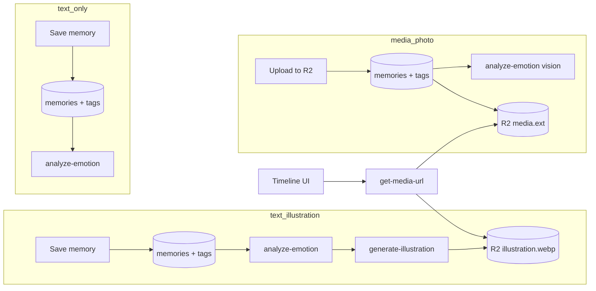

# Feature: Memories & illustrations

**Status:** `done`
**Last updated:** 2026-07-14
**PRD reference:** §6.3 Memories, §6.4 Illustrations

## Overview

Journal entries in three formats: text with AI illustration, plain text only, or user-uploaded photo/video with optional caption. Text saves to Postgres first for all types. Every analyzable memory gets an `analyze-emotion` pass: `text_illustration` and `text_only` use the text classifier, **photo** `media` uses the vision classifier; **video** `media` has no emotion in MVP. For `text_illustration` the emotion result also feeds the `generate-illustration` color palette. The memory type is derived from the creation form.

Emotion analysis runs fire-and-forget with **one background retry** (after the edge-function cooldown). If both attempts fail the emotion is left empty rather than forced to a default, and a session-scoped backfill pass in `useMemories` re-attempts analysis for any analyzable memory still missing an emotion (covers older entries created before this pass existed).

## User-facing behavior

- FAB on Timeline opens **New memory** modal.
- Form always shows: text field, media attach icon (toolbar), date picker, family member tag picker.
- **Auto-tag while typing** (new + edit compose): matching legal names or nicknames in the text (case-insensitive, whole-word boundaries) auto-selects chips up to 4. Manual untag suppresses re-add for that session. Tags are never auto-removed when text changes. Edit screen only auto-tags after the user edits text or uses voice (not on initial load).
- **Emergent type logic:**
  - Attach one or more photos/videos → `media` type; AI toggle is hidden.
  - No media, AI toggle off → `text_only`.
  - No media, AI toggle on (default) → `text_illustration`.
- Timeline cards render differently by type:
  - `text_illustration`: excerpt + emotion chip + illustration thumbnail (with status indicator).
  - `text_only`: excerpt + emotion chip; no image area.
  - `media`: photo/video carousel + optional caption; media with at least one photo may show emotion chip after async analysis.
- Illustrated and media memory details follow the Timeline card order: visual, engagement, story, then tagged members. Text-only details prioritize the story and tagged members before engagement. Every variant ends with date and emotion in a compact footer, with creator attribution on its own lowest-priority line. The detail background carries a soft top-down gradient tinted by the emotion (`getEmotionGradient` in `src/constants/theme.ts`), falling back to a neutral surface→bg fade when no emotion is set.
- Timeline cards and memory detail expose like/comment actions with passive non-zero counts. Timeline comment taps open detail with the comments drawer already visible; see [likes-and-comments.md](./likes-and-comments.md).
- Tapping a ready memory illustration opens the private image in the shared full-screen media viewer; closing returns to the detail card.
- Illustrated memory detail header includes a regenerate control (left of edit) to manually rerun the illustration pipeline; confirms before replacing a ready image. Regeneration calls `generate-illustration` with `forceRegenerate: true` so an already-`ready` memory is not short-circuited.
- Failed illustration shows retry option; no retry concept for media memories.
- Calendar renders virtualized week rows back to the user's oldest memory. It fetches only the visible date window plus a small buffer; tap opens the first memory for that day.
- Search bar on Timeline filters by content/emotion (`ilike`).
- Timeline tag/media enrichment batches memory IDs in groups of 100. This
  keeps PostgREST `.in(...)` request URLs below proxy limits for large family
  histories while preserving the existing virtualized full-history feed.

## Architecture

For `media` type: the client generates a `memoryId` UUID upfront, presigns a PUT via `get-upload-url`, uploads directly to R2, then inserts the `memories` row — same pattern as family profile photo uploads. See TECH_SPEC §5.5.

## Data model

| Table / field | Role |
|---------------|------|
| `memories.memory_type` | `text_illustration` \| `text_only` \| `media` — drives AI pipeline and UI rendering |
| `memories.content` | Required (non-empty) for `text_illustration` and `text_only`; optional caption for `media` |
| `memories.illustration_key` | R2 object key — set only for `text_illustration` |
| `memories.illustration_status` | `none` \| `pending` \| `generating` \| `ready` \| `failed`; `none` for non-illustration types |
| `memories.media_key` | Cover/cache R2 object key for the first media asset |
| `memories.media_content_type` | Cover/cache MIME type for the first media asset |
| `memory_media` | Canonical ordered 1-10 photo/video assets for `media` memories |
| `memory_family_members` | Up to 4 tags per memory (trigger enforced) |

## API & Edge Functions

| Function | When called | Auth |
|----------|-------------|------|
| `get-upload-url` | Before media insert (presign PUT for `{uid}/memories/{memoryId}/media.{ext}`) | JWT |
| `analyze-emotion` | After insert for `text_illustration`, `text_only`, and photo `media`; plus session backfill for analyzable memories missing emotion | JWT |
| `generate-illustration` | After emotion analysis, `text_illustration` only | JWT |
| `get-media-url` | Timeline/detail display for both illustration and media keys | JWT |

See TECH_SPEC §4.0, §4.2–4.3 for contracts.

## Client integration

| Layer | Files |
|-------|-------|
| Routes | `app/(app)/new-memory.tsx`, `app/(app)/memory/[id]/index.tsx`, `app/(app)/memory/[id]/edit.tsx`, `app/(app)/(tabs)/timeline.tsx`, `calendar.tsx` |
| Hooks | `src/hooks/useMemories.ts`, `src/hooks/useCalendarMemories.ts`, `src/hooks/useAutoMemoryTags.ts`, `src/hooks/useVoiceInput.ts` |
| Utils | `src/utils/member-mentions.ts`, `src/utils/auto-memory-tags.ts` |
| Services | `src/services/memories.ts`, `src/services/engagement.ts`, `src/services/ai.ts` |
| Components | `src/components/memory-card.tsx`, `memory-engagement-bar.tsx`, `memory-comments-drawer.tsx`, `memory-tag-picker.tsx`, `memory-fab.tsx`, `search-input.tsx`, `memory-media-picker.tsx` |

### Extension guide

1. Add memory fields → migration + regenerate types + update `createMemory` / UI.
2. New per-character illustration labels (age, visual guidance) → extend `buildMemberIllustrationDescription` in `_shared/illustration-references.ts`. Do not add nicknames back into that description — they're deliberately excluded from the image prompt (nickname leak fix) and handled only via the safety-rewrite nickname mapping in `_shared/prompts.ts`. Scene/safety copy stays in `_shared/prompts.ts`.
3. Always save text/row before invoking AI; never block save on illustration failure.
4. New memory type → add value to `memory_type` check constraint, update `createMemory` service, update timeline card renderer, update `hard-delete-expired-accounts` if it introduces new storage keys.
5. For media type details (upload flow, validation, video playback) see [media-memories.md](./media-memories.md).

## Family sharing

Memories are family-scoped, not user-scoped: `memories.family_id` (not
`user_id`) drives every query, and RLS requires owner/manager to
create/edit/delete (viewers cannot mutate the memory itself, but may like and
comment). `user_id` is now creator
attribution only — shown as "Added by {name}" on the detail screen (not on
timeline cards). See [family-sharing.md](./family-sharing.md) for the full
role/tenancy model and the RLS rewrite.

## Constraints & gotchas

- Max **4 tags** (UI + DB trigger).
- Illustration requires tagged members with **ready** portraits (`NO_PORTRAITS` error otherwise).
- `generate-illustration` passes **all** ready tagged portraits to OpenAI and labels each as `Reference image N: {description}` where description includes name, age, gender, and optional additional guidance. **Nicknames are never included in the image prompt** — a nickname like "cheeky monkey" was previously injected verbatim and could get drawn as a literal monkey. Instead, the safety-rewrite step (`buildSafetySystemPrompt` in `_shared/prompts.ts`) receives a nickname→canonical-name mapping for every family member (not just tagged ones, so mentions of any family member resolve) and is instructed to substitute nicknames with the member's real name in `safeDescription`, plus never treat a nickname as a literal visual element. `buildIllustrationPrompt` also carries a belt-and-suspenders constraint against drawing animals/objects/costumes implied by names or nicknames. The prompt instructs the model to draw **only those tagged humans** (no extra children or adults), while still allowing non-human scene elements (e.g. farm animals) from the memory text.
- The safety rewrite returns `{"safeDescription":"...","expressionStyle":"comedic"|"tender"|"neutral"}` (validated server-side, defaulting to `neutral`). `expressionStyle: "comedic"` only unlocks playful exaggerated expressions (see below) when the memory's `emotion` is also in `COMEDIC_ELIGIBLE_EMOTIONS` (`joy`, `funny`, `mischief`, `pride`).
- `buildIllustrationPrompt` is scene-first, newline-separated sections (Scene → Characters → Emotional tone → Style/palette/date → Constraints) rather than one long paragraph. The Characters section PRESERVEs identity cues from each portrait reference (hairstyle, hair color, skin tone, face shape, approximate age, distinctive features) but ADAPTs pose/clothing/lighting/expression — the portrait's smile is explicitly called out as an identity sample only, not the required expression. The Emotional tone section maps `memory.emotion` to concrete expression guidance via `EMOTION_EXPRESSIONS` in `_shared/prompts.ts` (same keys as `EMOTION_PALETTES`) so illustrations stop defaulting every character to a smile — `worry`/`weary`/`sad` explicitly forbid smiles. When `expressionStyle === 'comedic'` and the emotion is whitelisted, an extra line invites playful exaggerated storybook expressions. `funny` is a first-class emotion (its own palette/expression entries); only the legacy label `joyful` is still mapped by `normalizeEmotion` (to `joy`) before palette/expression lookup; run `npm run eval:illustration -- --list-emotions` to audit labels in the DB.
- **Auto-tag suppression vs illustration:** suppression is compose-session only. If a memory is saved with **zero** tags but the text still mentions names, `generate-illustration` may still infer members from text when no tags exist (existing fallback). Auto-tag reduces zero-tag saves with mentions.
- Reference images are capped to **1024px** max edge server-side before the OpenAI edit call.
- `illustration_status = 'pending'` must only be set for `text_illustration` rows; all other types use `'none'`.
- Poll every 5s while `illustration_status` is `pending`/`generating`.
- Calendar range loading uses `fetchOldestMemoryDate` for scroll extent and `fetchMemoriesInDateRange` for buffered visible rows, so do not reintroduce full-list loading for the calendar.
- Full-history Timeline enrichment must keep batching relation lookups; a
  single `.in(...)` containing hundreds of UUIDs can exceed the Supabase
  request-line limit and return HTTP 400 even though the memory rows are valid.
- `media_key` must be null for non-`media` types; for `media`, it mirrors `memory_media` position 0 for compatibility.
- Voice audio is **not stored** — only transcribed text.
- `content` is nullable in the schema but must be non-empty after trim for `text_illustration` and `text_only` — enforced in client and Edge Function layer.

## Testing

| Layer | File |
|-------|------|
| Unit | `src/utils/memories.test.ts`, `src/utils/calendar.test.ts`, `src/utils/member-mentions.test.ts`, `src/utils/auto-memory-tags.test.ts`, `src/utils/profile-photo.test.ts` |
| Integration | `src/services/memories.integration.test.ts` (including large-timeline relation/engagement batching), `src/services/engagement.integration.test.ts`, `src/hooks/useMemoryEngagement.integration.test.tsx`, `src/hooks/useCalendarMemories.integration.test.tsx`, `src/hooks/useAutoMemoryTags.integration.test.tsx`, `src/screen-tests/edit-memory.integration.test.tsx`, `src/screen-tests/memory-detail.integration.test.tsx` |
| E2E | `.maestro/flows/memories/create-memory.yaml`, `.maestro/flows/memories/auto-tag.yaml`, `.maestro/flows/engagement/like-and-comment.yaml` |
| Deno | `supabase/functions/analyze-emotion/index.test.ts`, `generate-illustration/index.test.ts`, `notify-memory-engagement/index.test.ts`, `_shared/member-mentions.test.ts`, `_shared/illustration-references.test.ts`, `_shared/image-bytes.test.ts` |
