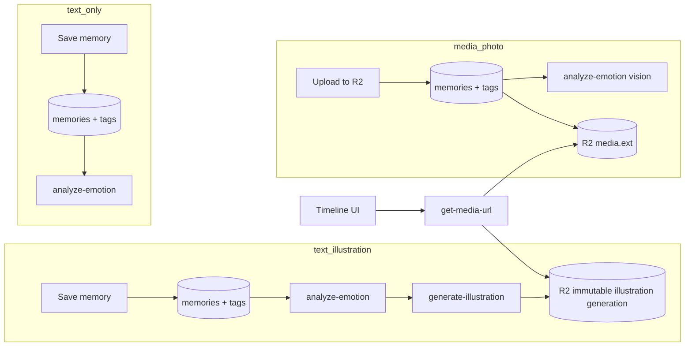

# Feature: Memories & illustrations

**Status:** `done`
**Last updated:** 2026-07-16
**PRD reference:** §6.3 Memories, §6.4 Illustrations

## Overview

Journal entries in three formats: text with AI illustration, plain text only, or user-uploaded photo/video with optional caption. Text saves to Postgres first for all types. Every analyzable memory gets an `analyze-emotion` pass: `text_illustration` and `text_only` use the text classifier, **photo** `media` uses the vision classifier; **video** `media` has no emotion in MVP. For `text_illustration` the emotion result also feeds the `generate-illustration` color palette. The memory type is derived from the creation form.

Emotion analysis runs fire-and-forget with **one background retry** (after the edge-function cooldown). If both attempts fail the emotion is left empty rather than forced to a default, and a session-scoped backfill pass in `useMemories` re-attempts analysis for any analyzable memory still missing an emotion (covers older entries created before this pass existed).

## User-facing behavior

- FAB on Timeline opens **New memory** modal.
- Form always shows: text field, media attach icon (toolbar), date picker, family member tag picker.
- **Rotating prompt placeholder:** the text field's placeholder is picked once per screen-open from a curated ~15-entry list (`src/constants/journaling-prompts.ts`, `pickJournalingPrompt`), rather than always showing the original static "What happened on this day?" (still in the list). Placeholder only -- it is never inserted into the field or submitted with the memory, and stays stable for the life of that mount (picked via a lazy `useState` initializer). Deliberately not personalized with family member names.
- **Draft autosave (new-memory only):** the composer persists content text, tagged member ids, memory date, and the AI-illustration toggle to `AsyncStorage` (`src/utils/new-memory-draft.ts`) so an interrupted entry survives an app restart/crash. Writes are debounced ~500ms after a change; a stored draft restores silently on mount, but only into an otherwise-empty form (content, tags, and attached media all empty) and only once the incoming-share prefill path (`useIncomingMemoryShare`) has settled -- a share or voice prefill always wins over a stale draft. The key is scoped per user + family (`momora.newMemoryDraft.{userId}.{familyId}` via `getNewMemoryDraftStorageKey`), so switching the active family or signing into a different account never surfaces another context's draft. The draft is cleared the instant a memory is considered posted -- for the text path that's after `createMemory` resolves; for the media path it's right after `usePendingMemoryUploads().enqueue(...)` is called (synchronous queue admission), not after the background upload finishes. Cancel intentionally leaves the draft in place -- surviving an interruption is the point; there is no separate "discard draft" affordance. **Media attachments are never persisted** in the draft -- their local picker-cache URIs can go stale/be evicted across app restarts, so a restored draft would point at files that may no longer exist; a user who was interrupted mid-entry has to re-attach photos/videos, but keeps their text, tags, date, and AI toggle. Out of scope: `memory/[id]/edit.tsx` has no draft autosave.
- **Auto-tag while typing** (new + edit compose): matching legal names or nicknames in the text (case-insensitive, whole-word boundaries) auto-selects every matching family member. Manual untag suppresses re-add for that session. Tags are never auto-removed when text changes. Edit screen only auto-tags after the user edits text or uses voice (not on initial load).
- **Tag count vs. illustration count:** text-only and media memories may tag any number of family members. AI illustrations support at most 6 tagged members. In create, auto-tag, and voice flows, crossing 6 turns AI off and disables its switch with the short helper “Up to 6 people per illustration.” Returning to 6 or fewer re-enables the switch but leaves it off until the user turns it on.
- **Editable AI mode:** the edit composer allows switching between `text_illustration` and `text_only`. Switching AI off hides the illustration immediately and saves the row as text-only without clearing `illustration_key`, `illustration_prompt`, or `illustration_status`. Switching it back on reveals a retained illustration without regeneration. If no retained illustration exists, saving with AI on sets the status to `pending` and starts generation. Pending/generating work is never duplicated, and switching it off does not cancel the background job.
- An existing illustrated memory caps manual tag selection at 6 while AI remains on, matching the illustration input limit. Turning AI off removes that cap; AI cannot be turned back on until the tag count returns to 6 or fewer.
- **Emergent type logic:**
  - Attach one or more photos/videos → `media` type; AI toggle is hidden.
  - No media, AI toggle off → `text_only`.
  - No media, AI toggle on (default) → `text_illustration`.
- Timeline cards render differently by type:
  - `text_illustration`: excerpt + emotion chip + illustration thumbnail (with status indicator).
  - `text_only`: excerpt + emotion chip; no image area.
  - `media`: photo/video carousel + optional caption; media with at least one photo may show emotion chip after async analysis.
- Timeline cards show up to six tagged-member avatars. Memories with more than six tags keep the first six visible and append a compact `+N` avatar for the remaining count.
- Tagged-member avatars on timeline cards and memory detail are resolved against `memory_date`, using the same portrait-version rule as illustration generation.
- Illustrated and media memory details follow the Timeline card order: visual, engagement, story, then tagged members. Text-only details prioritize the story and tagged members before engagement. Every variant ends with date and emotion in a compact footer, with creator attribution on its own lowest-priority line. The detail background carries a soft top-down gradient tinted by the emotion (`getEmotionGradient` in `src/constants/theme.ts`), falling back to a neutral surface→bg fade when no emotion is set.
- Timeline cards and memory detail expose like/comment actions with passive non-zero counts. Timeline comment taps open detail with the comments drawer already visible; see [likes-and-comments.md](./likes-and-comments.md).
- Tapping a ready memory illustration opens the private image in the shared full-screen media viewer; closing returns to the detail card.
- Illustrated memory detail header includes a regenerate control (left of edit) to manually rerun the illustration pipeline; confirms before replacing a ready image. Regeneration calls `generate-illustration` with `forceRegenerate: true` so an already-`ready` memory is not short-circuited.
- Failed illustration shows retry option; no retry concept for media memories.
- Calendar renders virtualized week rows back to the user's oldest memory. It fetches only the visible date window plus a small buffer; tap opens the first memory for that day.
- Search bar on Timeline filters by content/emotion. Not reachable from any
  current UI (`timeline.tsx` has no setter for its search query) --
  `useMemoriesSearch` is a separate, ready-to-wire hook (see Pagination
  below). `searchMemories` (`src/services/memories.ts`) runs content matching
  through Postgres full-text search (`.textSearch('content', trimmed, {
  type: 'websearch', config: 'english' })`, using
  `idx_memories_content_search`, a GIN index over
  `to_tsvector('english', content)`) instead of `content.ilike`, which could
  never use that index. A known emotion label (matched against the same
  label set as `src/constants/theme.ts`'s `emotionColors`) runs as a second,
  separate `.eq('emotion', ...)` query and is merged + deduped client-side
  with the content results rather than a single `.or()` filter string --
  emotion is an exact short label, not prose, so the second query is cheap
  and keeps the merge logic verifiable without depending on PostgREST's
  `.or()` + `wfts` filter-string syntax. Results are capped at 100
  (`MEMORIES_SEARCH_LIMIT`); there is no pagination UI for search.
  `fetchMemories()` (the old unpaginated full-library fetch) was deleted in
  the same pass -- its only caller was this function's empty-query fallback,
  and `useMemoriesSearch` never runs for an empty/whitespace query, so
  `searchMemories('')` now short-circuits to an empty result instead.
- Timeline tag/media enrichment batches memory IDs in groups of 100. This
  keeps PostgREST `.in(...)` request URLs below proxy limits for large family
  histories while preserving the existing virtualized full-history feed.
- **Timeline pagination (2026-07-15):** `useMemories` loads the timeline in
  keyset-paginated pages of 40 (`fetchMemoriesPage`, sorted
  `memory_date desc, created_at desc`, covered by
  `idx_memories_family_id_memory_date (family_id, memory_date desc, created_at desc)`)
  instead of the whole family history. `memories` is the flattened,
  id-deduplicated set of pages loaded so far -- not the whole library.
  `useMemberMemories(memberId)` (used by the member-profile screen) is the
  same shape, server-filtered via an inner join on `memory_family_members`
  instead of client-filtering the whole timeline; its query key
  (`[...memoriesQueryKey(familyId), 'member', memberId]`) is deliberately
  nested under the timeline's own key prefix so cache patches (mutations,
  the status poll, search) keep reaching it. `useMemoriesSearch` is a
  separate, non-infinite, non-patched query (`'memories-search'` key) --
  search results never share the InfiniteData cache shape.
  - **Mutation cache model:** create/update/delete/retry/regenerate patch the
    list caches directly with the data they already have (sorted prepend on
    create, in-place patch on update, removal on delete) instead of
    refetching -- `useInfiniteQuery.refetch()` would otherwise sequentially
    re-run every loaded page's enrichment round-trips per mutation.
    `invalidateMemoryQueries` only marks the list stale (`refetchType:
    'none'`) as a reconciliation backstop for the next natural remount.
  - **Freshness guarantees this produces:** illustration/emotion status for
    memories on loaded pages is live via the shared
    `useGenerationStatusPolling` poll (3s while generating, 5s while emotion
    analysis is outstanding, idle otherwise) -- see **Realtime** below for
    how that poll relates to Supabase Realtime. A memory you create or
    delete on your own device appears/disappears immediately (direct cache
    patch); another member's create/delete on their device is now also live
    via realtime (see below). Another member's content edit, retag, or
    engagement change on their device still reconciles on app foreground
    (once the timeline query has gone stale) or pull-to-refresh -- not
    mid-session; realtime only pushes the fields called out below.
  - **Recovery/backfill is now bounded to loaded pages**, not a whole-library
    sweep: a memory stuck `pending`/`generating` deep in history only
    self-heals when its page loads or its detail screen is opened (the
    detail hook's own recovery still covers that memory individually). A
    server-side periodic sweep would be the durable fix for abandoned rows
    nobody ever scrolls back to; out of scope here.
  - **Streak dots** (`timeline.tsx`) compute from loaded memories only. Page 1
    (40 rows) covers the current week in practice, so this is an accepted
    tradeoff, not a bug, if a family posts unusually sparsely.
  - Pull-to-refresh and the app-foreground reconcile both trim the cache to
    page 1 before refetching (never a raw multi-page `refetch()`, never
    `resetQueries`, never react-query's `maxPages` -- see the plan doc for
    why each of those is wrong here) -- deeper pages a user had scrolled to
    are dropped and reload on demand via `fetchNextPage`.
- **Realtime (2026-07-15, Workstream D):** `public.memories` is added to the
  `supabase_realtime` publication
  (`supabase/migrations/20260715150000_memories_realtime_publication.sql`,
  see [TECH_SPEC §2.2a](../TECH_SPEC.md#22a-realtime-publication)).
  `useMemoriesRealtime(familyId)` (`src/hooks/useMemoriesRealtime.ts`) is
  mounted once in `FamilyProvider` (`src/hooks/use-family.tsx`) -- the same
  "mounted once for the whole authenticated session" pattern
  `useNotificationResponseRouting` uses at the `(app)` layout level -- and
  resubscribes its `postgres_changes` channel whenever the active family
  changes.
  - **What's live:** UPDATE events patch `illustration_status`, the
    illustration key column, `emotion`, `updated_at`, `link_previews`, and
    `content` straight into the list/detail caches via `patchMemoryInCaches`
    (the same helper A5/A4b/D2 all share); a transition to `ready` also
    invalidates `['media-urls']` and the calendar query. INSERT events from
    another device prepend the new memory (sorted, same
    `prependMemoryToListCaches` A4b uses) after a ~1.5s delay -- long enough
    for the vast majority of the tag/media inserts that follow the row
    insert (`createMemory`/media RPC write the row THEN its relations) to
    have landed; a `media` memory whose fetch still comes back with zero
    assets gets one retry ~1.5s later, then prepends whatever it got either
    way (fail-open -- a memory missing from the timeline is worse than one
    that briefly renders without all its media). DELETE events remove the
    row via `removeMemoryFromListCaches`. An INSERT/UPDATE already reflected
    in the cache (the creating/editing device's own mutation) is a no-op --
    `prependMemoryToListCaches`/`patchMemoryInCaches` are idempotent by id.
  - **Reconcile on every `SUBSCRIBED` transition, not just the first one:**
    realtime does not replay events missed while disconnected (e.g. iOS
    suspending the socket in the background), so on every `SUBSCRIBED`
    (initial connect AND every rejoin) the hook forces one tick of A5's
    generation-status query via `invalidateQueries(['generation-status',
    familyId])`. Without this, an illustration that finished while
    disconnected would stay `pending` in cache, and A7's recovery effect
    would re-pin it to `pending` in a loop.
  - **Poll suppression is reactive, not a ref:** `useGenerationStatusPolling`
    reads `useIsRealtimeLive(familyId)` from `src/hooks/realtime-status.ts`
    (a tiny `useSyncExternalStore`-backed module store, set by
    `useMemoriesRealtime` on every channel status transition) and its
    `refetchInterval` returns `false` while that family's channel is
    `SUBSCRIBED`. The query itself stays `enabled` even while suppressed --
    disabling it outright would make the `SUBSCRIBED` reconcile's
    `invalidateQueries` a no-op, since invalidation only refetches *active*
    queries. On `CHANNEL_ERROR`/`TIMED_OUT`/`CLOSED` the flag flips back and
    polling resumes on its normal 3s/5s cadence -- a plain ref could not do
    this because react-query only re-evaluates `refetchInterval` on the
    query's own update or an observer re-render, and nothing else would
    trigger a re-render when the flag changed outside of React state.
  - **Still reconciled on foreground/pull-to-refresh, not pushed live:**
    another member's content edit, retag, or engagement change (the
    UPDATE-patched field set above is deliberately narrow -- generation
    status plus `link_previews`/`content` only). A7's loaded-pages-only
    recovery/backfill scope, the member-filtered `useMemberMemories` query,
    and search are unaffected by this workstream.
  - The A5 poll (`useGenerationStatusPolling`) is not replaced -- it is the
    fallback whenever realtime is disconnected, or the publication migration
    hasn't been applied in an environment (see the TECH_SPEC prod
    verification query). Existing illustration screen-tests mock realtime
    out entirely and continue to exercise the poll path.
- **Timeline list rendering (2026-07-15):** `MemoryCard` is wrapped in
  `React.memo`; its `onPress`/`onOpenComments` props take a memory id
  (`(memoryId: string) => void`) rather than a bound closure so
  `timeline.tsx` can pass one stable `useCallback`-wrapped handler for every
  row instead of a fresh closure per card per render -- required for the
  memo comparison to actually bail out. The timeline `FlatList` mirrors
  calendar.tsx's windowing config (`initialNumToRender`/`maxToRenderPerBatch`
  6, `windowSize` 7, `removeClippedSubviews`), adds `onEndReached` wired to
  `fetchNextPage` (`onEndReachedThreshold` 0.5) with a footer spinner while
  `isFetchingNextPage`, and hoists `renderItem`/`keyExtractor` into
  `useCallback` and the header into a `useMemo`'d element (still
  recomputed when `memories` changes, since `StreakDots` needs the current
  page data, but not on unrelated re-renders like the active-video swap). No
  `getItemLayout` -- card heights vary by memory type/content.

## Architecture

For `media` type: the client generates a `memoryId` UUID upfront, presigns a PUT via `get-upload-url`, uploads directly to R2, then inserts the `memories` row — same pattern as family profile photo uploads. See TECH_SPEC §5.5.

## Data model

| Table / field | Role |
|---------------|------|
| `memories.memory_type` | `text_illustration` \| `text_only` \| `media` — drives AI pipeline and UI rendering |
| `memories.content` | Required (non-empty) for `text_illustration` and `text_only`; optional caption for `media` |
| `memories.illustration_key` | R2 object key — set only for `text_illustration` |
| `memories.illustration_status` | `none` \| `pending` \| `generating` \| `ready` \| `failed`; newly created non-illustration rows use `none`, while a text-only row may retain the status of a hidden illustration |
| `memories.media_key` | Cover/cache R2 object key for the first media asset |
| `memories.media_content_type` | Cover/cache MIME type for the first media asset |
| `memory_media` | Canonical ordered 1-10 photo/video assets for `media` memories |
| `memory_family_members` | Unlimited for `text_only`/`media`; max 6 for `text_illustration` (conditional triggers enforced) |
| `family_member_portrait_versions` | Date-aware character references and tagged-member avatars; see [portrait-timeline.md](./portrait-timeline.md) |

## API & Edge Functions

| Function | When called | Auth |
|----------|-------------|------|
| `get-upload-url` | Before media insert (presign PUT for `{uid}/memories/{memoryId}/media.{ext}`) | JWT |
| `analyze-emotion` | After insert for `text_illustration`, `text_only`, and photo `media`; plus session backfill for analyzable memories missing emotion | JWT |
| `generate-illustration` | After emotion analysis, `text_illustration` only | JWT |
| `get-media-url` | Timeline/detail display for both illustration and media keys | JWT |

See TECH_SPEC §4.0, §4.2–4.3 for contracts.

## Client integration

| Layer | Files |
|-------|-------|
| Routes | `app/(app)/new-memory.tsx`, `app/(app)/memory/[id]/index.tsx`, `app/(app)/memory/[id]/edit.tsx`, `app/(app)/(tabs)/timeline.tsx`, `calendar.tsx` |
| Hooks | `src/hooks/useMemories.ts` (`useMemories`, `useMemberMemories`, `useMemoriesSearch`, `useMemory`, `useMemoryMutations`), `src/hooks/memory-cache.ts` (shared list/detail cache patch helpers), `src/hooks/useGenerationStatusPolling.ts` (shared illustration/emotion status poll), `src/hooks/useMemoriesRealtime.ts` (postgres_changes subscription, mounted once in `FamilyProvider`), `src/hooks/realtime-status.ts` (reactive poll-suppression store), `src/hooks/useCalendarMemories.ts`, `src/hooks/useAutoMemoryTags.ts`, `src/hooks/useVoiceInput.ts` |
| Utils | `src/utils/member-mentions.ts`, `src/utils/auto-memory-tags.ts`, `src/utils/new-memory-draft.ts` (draft autosave storage) |
| Constants | `src/constants/journaling-prompts.ts` (rotating placeholder list + `pickJournalingPrompt`) |
| Services | `src/services/memories.ts`, `src/services/engagement.ts`, `src/services/ai.ts` |
| Components | `src/components/memory-card.tsx`, `memory-engagement-bar.tsx`, `memory-comments-drawer.tsx`, `memory-tag-picker.tsx`, `memory-fab.tsx`, `search-input.tsx`, `memory-media-picker.tsx` |

### Extension guide

1. Add memory fields → migration + regenerate types + update `createMemory` / UI.
2. New per-character illustration labels (age, visual guidance) → extend `buildMemberIllustrationDescription` in `_shared/illustration-references.ts`. Portrait selection itself must continue through the canonical memory-date resolver in `_shared/portrait-versions.ts`. Do not add nicknames back into the description — they're deliberately excluded from the image prompt and handled only via the safety-rewrite nickname mapping in `_shared/prompts.ts`.
3. Always save text/row before invoking AI; never block save on illustration failure.
4. New memory type → add value to `memory_type` check constraint, update `createMemory` service, update timeline card renderer, update `hard-delete-expired-accounts` if it introduces new storage keys.
5. For media type details (upload flow, validation, video playback) see [media-memories.md](./media-memories.md).
6. Treat `memory_type` as illustration visibility/eligibility, not proof that no illustration object exists. A `text_only` row may intentionally retain a hidden `illustration_key` so users can restore it later.

## Family sharing

Memories are family-scoped, not user-scoped: `memories.family_id` (not
`user_id`) drives every query, and RLS requires owner/manager to
create/edit/delete (viewers cannot mutate the memory itself, but may like and
comment). `user_id` is now creator
attribution only — shown as "Added by {name}" on the detail screen (not on
timeline cards). See [family-sharing.md](./family-sharing.md) for the full
role/tenancy model and the RLS rewrite.

## Constraints & gotchas

- No global tag maximum. `text_illustration` is capped at **6 tags** by client validation, a conditional junction-table trigger, a memory-type transition trigger, and `generate-illustration`; `text_only` and `media` are unlimited.
- Turning AI off preserves all illustration columns and the R2 object. Timeline/detail rendering must continue to branch on `memory_type`, so retained keys on `text_only` rows remain hidden. Account deletion still collects retained keys normally.
- Illustration requires a usable date-resolved portrait for at least one selected character (`NO_PORTRAITS` otherwise). For each member, selection is latest ready portrait on/before `memory_date`, then earliest ready after it, then an undated migrated legacy portrait. Failed/generating/deleting rows do not displace a usable result.
- `generate-illustration` passes all date-resolved tagged portraits to OpenAI and labels each as `Reference image N: {description}` where description includes name, age at `memory_date`, gender, and optional guidance. **Nicknames are never included in the image prompt** — a nickname like "cheeky monkey" was previously injected verbatim and could get drawn as a literal monkey. Instead, the safety-rewrite step receives a nickname→canonical-name mapping and substitutes real names in `safeDescription`. The prompt draws only tagged humans while allowing non-human scene elements from the memory text.
- The safety rewrite returns `{"safeDescription":"...","expressionStyle":"comedic"|"tender"|"neutral"}` (validated server-side, defaulting to `neutral`). `expressionStyle: "comedic"` only unlocks playful exaggerated expressions (see below) when the memory's `emotion` is also in `COMEDIC_ELIGIBLE_EMOTIONS` (`joy`, `funny`, `mischief`, `pride`).
- `buildIllustrationPrompt` is scene-first, newline-separated sections (Scene → Characters → Emotional tone → Style/palette/date → Constraints) rather than one long paragraph. The Characters section PRESERVEs identity cues from each portrait reference (hairstyle, hair color, skin tone, face shape, approximate age, distinctive features) but ADAPTs pose/clothing/lighting/expression — the portrait's smile is explicitly called out as an identity sample only, not the required expression. The Emotional tone section maps `memory.emotion` to concrete expression guidance via `EMOTION_EXPRESSIONS` in `_shared/prompts.ts` (same keys as `EMOTION_PALETTES`) so illustrations stop defaulting every character to a smile — `worry`/`weary`/`sad` explicitly forbid smiles. When `expressionStyle === 'comedic'` and the emotion is whitelisted, an extra line invites playful exaggerated storybook expressions. `funny` is a first-class emotion (its own palette/expression entries); only the legacy label `joyful` is still mapped by `normalizeEmotion` (to `joy`) before palette/expression lookup; run `npm run eval:illustration -- --list-emotions` to audit labels in the DB.
- **Auto-tag suppression vs illustration:** suppression is compose-session only. If a memory is saved with **zero** tags but the text still mentions names, `generate-illustration` may still infer members from text when no tags exist (existing fallback). That fallback is capped to the first 6 matched family members so it cannot bypass the portrait-input limit. Auto-tag reduces zero-tag saves with mentions.
- Reference images are capped to **1024px** max edge server-side before the OpenAI edit call.
- New illustration work sets `illustration_status = 'pending'` only after the row is switched to `text_illustration`. A `text_only` row may retain a prior `pending`/`generating`/`ready`/`failed` status while its illustration is hidden; do not normalize retained state to `none`.
- Poll every 3s while `illustration_status` is `pending`/`generating`, else every 5s while emotion analysis is still outstanding (`shouldPollForEmotion`), else idle. `useMemories`/`useCalendarMemoriesInRange` share ONE poll (`useGenerationStatusPolling`, keyed `['generation-status', familyId]`) instead of each running their own `refetchInterval` -- do not reintroduce a second interval on a list hook; extend the shared one instead. The memory-detail hook (`useMemory`) keeps its own single-row `refetchInterval` (cheap, self-contained) rather than sharing this poll.
- Calendar range loading uses `fetchOldestMemoryDate` for scroll extent and `fetchMemoriesInDateRange` for buffered visible rows, so do not reintroduce full-list loading for the calendar.
- Full-history Timeline enrichment must keep batching relation lookups; a
  single `.in(...)` containing hundreds of UUIDs can exceed the Supabase
  request-line limit and return HTTP 400 even though the memory rows are valid.
- `media_key` must be null for non-`media` types; for `media`, it mirrors `memory_media` position 0 for compatibility.
- Voice audio is **not stored** — only transcribed text.
- `content` is nullable in the schema but must be non-empty after trim for `text_illustration` and `text_only` — enforced in client and Edge Function layer.

## Testing

| Layer | File |
|-------|------|
| Unit | `src/components/memory-card.test.tsx` (tagged-member overflow + `React.memo` render-count probe), `src/components/memory-tag-picker.test.tsx`, `src/components/family-roster-sheet.test.tsx`, `src/utils/memories.test.ts`, `src/utils/calendar.test.ts`, `src/utils/member-mentions.test.ts`, `src/utils/auto-memory-tags.test.ts`, `src/utils/profile-photo.test.ts`, `src/utils/new-memory-draft.test.ts` (round-trip, per-user+family key scoping, corrupted/invalid-JSON and storage-failure degradation, `isEmptyDraft`), `src/constants/journaling-prompts.test.ts` (list shape/uniqueness, includes the original static prompt, `pickJournalingPrompt` index selection + clamping), `src/hooks/memory-cache.test.ts` (InfiniteData patch/prepend/remove helpers, sorted-insert + drop/append-at-window-edge cases), `src/hooks/realtime-status.test.ts` (reactive suppression store, both directions, familyId mismatch guards) |
| Integration | `src/services/memories.integration.test.ts` (mode switching, retained illustrations, large-timeline relation/engagement batching, `fetchMemoriesPage`/`fetchMemoriesPageForMember` keyset predicates, `fetchMemoryGenerationStatuses`, `searchMemories` FTS call shape + emotion-label merge/dedupe + limit), `src/services/engagement.integration.test.ts`, `src/hooks/useMemories.integration.test.tsx` (infinite-shape loading, `useMemberMemories`, mutation cache patches asserted against a `fetchMemoriesPage` call-count spy so no page-2+ refetch sneaks back in), `src/hooks/useMemoryEngagement.integration.test.tsx` (engagement patch on `InfiniteData`), `src/hooks/useGenerationStatusPolling.test.tsx` (patch-on-change, stops when nothing pending, wake-from-idle on re-render, idles/resumes with realtime live/down), `src/hooks/useMemoriesRealtime.test.tsx` (mocked postgres_changes channel: UPDATE patch + ready-transition invalidation, INSERT delayed-prepend + own-device dedup + media retry-once, DELETE removal, SUBSCRIBED forces a generation-status reconcile, channel/timer cleanup on unmount), `src/hooks/useCalendarMemories.integration.test.tsx`, `src/hooks/use-pending-memory-uploads.test.tsx` (media-queue sorted prepend + `refetchType: 'none'` backstops), `src/hooks/useAutoMemoryTags.integration.test.tsx`, `src/screen-tests/timeline.integration.test.tsx` (no focus refetch, pull-to-refresh wiring, `onEndReached` → `fetchNextPage`, footer spinner while `isFetchingNextPage`), `src/screen-tests/new-memory.integration.test.tsx` (capture-date prefill; a second describe block covers draft autosave/restore/clear-on-post, per-family scoping, prefill-wins-over-draft precedence, media-never-persisted, and the rotating placeholder), `src/screen-tests/edit-memory.integration.test.tsx`, `src/screen-tests/memory-detail.integration.test.tsx`, `src/screen-tests/family-member-portrait-entry.integration.test.tsx` |
| E2E | `.maestro/flows/memories/create-memory.yaml`, `.maestro/flows/memories/auto-tag.yaml`, `.maestro/flows/memories/toggle-ai-on-edit.yaml`, `.maestro/flows/engagement/like-and-comment.yaml` |
| Deno | `supabase/functions/analyze-emotion/index.test.ts`, `generate-illustration/index.test.ts`, `notify-memory-engagement/index.test.ts`, `_shared/member-mentions.test.ts`, `_shared/illustration-references.test.ts`, `_shared/image-bytes.test.ts` |
