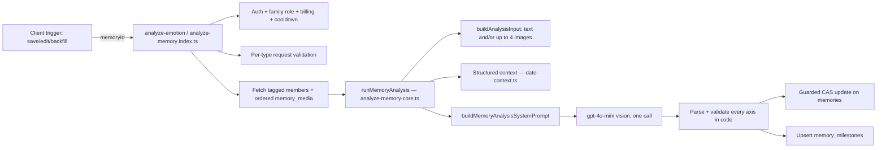

# Feature: Memory analysis (`analyze-memory`)

**Status:** `in-progress` (phase 1 of docs/plans/memory-book.md shipped 2026-08-24: schema, shared constants, Edge Function, docs, tests. Client wiring for video-poster emotion and the archive backfill are phase 2.)
**Last updated:** 2026-08-24
**PRD reference:** New premium product surface (see docs/plans/memory-book.md); this pass also feeds Looking Back and future in-app search independently of the book

## Overview

`analyze-memory` is the single multimodal OpenAI pass that enriches a memory
with everything the Memory Book curation engine (and future search) needs:
**emotion**, **topics**, **labels**, a search-only **description**, and an
explicit-text **milestone claim** — one API call, five axes. It supersedes
the emotion-only `analyze-emotion` pass; the two names now point at the same
handler (`analyze-emotion` kept for old app versions, `analyze-memory` for
future clients — see **API & Edge Functions** below).

This is Stage A of the Memory Book pipeline
(docs/plans/memory-book.md §5); Stage B (curation) and beyond are not built
yet. `analyze-memory`'s value is independent of the book: it powers
Looking Back-style recipes today and semantic search once embeddings ship
(the `description` field exists for that, unused by anything yet).

## User-facing behavior

There is no dedicated user-facing surface for this feature yet. It runs
invisibly after a memory is created/edited, the same way emotion analysis
always has (see [memories.md](./memories.md)'s emotion-pipeline summary).
`topics`/`labels`/`description` are not rendered anywhere client-side today;
`emotion` continues to drive the illustration color palette and the emotion
chip/gradient described in memories.md.

**Milestones are celebration, never developmental tracking.** No "missing
milestone" surface may ever be built against `memory_milestones` — not a
progress tracker, not a "your child hasn't hit X yet" nudge, not a
cross-child comparison. The table only ever represents what a parent's own
words already recorded. This is a hard constraint from
docs/plans/milestone-catalog.md's principle 2 and applies to every future
consumer of this table, not just the current one.

## Architecture



One multimodal OpenAI call per memory; every axis is post-processed in code
afterward, never trusted verbatim from the model. See **Constraints &
gotchas** for what's validated where.

## Data model

| Table / column | Role |
|---|---|
| `memories.topics text[]` | Controlled-vocabulary topic ids, 0-3, GIN-indexed. |
| `memories.topic_details jsonb` | Map of topic id → detail string; only the four detail topics ever populate a key. |
| `memories.labels text[]` | Open-vocabulary search labels, up to 10. |
| `memories.description text` | One neutral sentence, search-only; never rendered. |
| `memories.analysis_version integer` | The `TOPICS_VERSION` this row was analyzed against. |
| `memories.analyzed_at timestamptz` | When the full pass last wrote this row. |
| `memory_milestones` | Candidate/confirmed milestone rows: `family_id`, `memory_id`, `family_member_id` (nullable), `milestone_id`, `detail`, `out_of_band`, `status` (`candidate`/`confirmed`/`dismissed`). Unique on `(memory_id, milestone_id)`. |

Migration: `supabase/migrations/20260824100000_analyze_memory.sql`. Both ride
the **existing** `memories` RLS policies / family tenancy — no policy
changes to `memories` itself. `memory_milestones` RLS: family members can
`select`; **no client insert/update/delete policies** — only the
service-role client (which bypasses RLS) writes rows. This is deliberate:
milestone candidates are server-derived facts, not user-editable data, in
phase 1.

**Controlled vocabularies, as typed constants (single source of truth for production):**

| File | Contents |
|---|---|
| `supabase/functions/_shared/memory-topics.ts` | 61 topics: id, page title, definition, group, `requiresDetail`, `dateGate`. `TOPICS_VERSION` and `NEGATIVE_EXAMPLES` also live here. |
| `supabase/functions/_shared/memory-milestones.ts` | 77 milestones: id, name, category, age band (parsed from a raw band string like `"8–19m"` into inclusive month bounds). |
| `supabase/functions/_shared/date-context.ts` | Julian-day-number date math, the structured context block, deterministic birthday/birth matching, and topic date gating (`gateTopicsByDate`). |

Both vocabulary files are **hand-ported, typed copies** of
`docs/plans/topic-vocabulary.md` and `docs/plans/milestone-catalog.md` — not
markdown parsed at request time (that's what the V1 eval script did; this is
the production counterpart). A **sync test** in each `_shared` module's
`.test.ts` file parses the doc the same way
`supabase/scripts/eval-memory-book-tagging.ts` does and asserts the
constants match the doc exactly (ids + count), so the doc and the constants
cannot silently drift. Note: `docs/plans/milestone-catalog.md`'s own "Notes
for implementation" prose says "78 entries across 7 categories" — that line
is stale; the doc's actual tables (what the sync test parses, and what
`memory-milestones.ts` matches) contain **77 entries across 8 categories**.

## API & Edge Functions

| Function / endpoint | Input | Output | Auth |
|---|---|---|---|
| `analyze-emotion` | `{ memoryId }` | See TECH_SPEC §4.2 — full response is now a strict superset of the pre-2026-08-24 `{emotion, colorPalette, skipped?}` contract | JWT |
| `analyze-memory` | Same as above | Same as above — thin re-export of `analyze-emotion`'s handler (`supabase/functions/analyze-memory/index.ts`), same request/response, for future clients | JWT |

Link to [TECH_SPEC §4.2](../TECH_SPEC.md#42-analyze-emotion--analyze-memory)
for the canonical request/response contract, per-type input table, and
error codes. This doc covers behavior and the extension surface; TECH_SPEC
is the wire contract.

`supabase/functions/_shared/analyze-memory-core.ts` holds the full analysis
logic (input building, image selection/fetch, prompt construction, model
output parsing/validation, milestone resolution, the `runMemoryAnalysis`
orchestrator) shared by both endpoints. `supabase/functions/_shared/
openai.ts`'s `chatJsonWithVisionMulti` is the one multimodal call helper
(up to 4 images at `detail: 'low'`, zero images is a valid text-only call).

## Client integration

None yet in phase 1 — this is server-side enrichment only. Client trigger
sites are the existing emotion-analysis call sites documented in
[memories.md](./memories.md)'s API table; nothing about *when* the function
is called changed in this phase, only what it does once called. Phase 2:
wire the client's `isEmotionAnalyzable`/`shouldPollForEmotion`
(`src/utils/media-emotion-polling.ts`) to also treat a video with a
poster as analyzable, and build the archive backfill script.

## Extension guide

**Safe to extend**

- **Add a topic:** append an entry to `TOPICS` in `memory-topics.ts`
  (id/pageTitle/definition/group/requiresDetail/dateGate), add the matching
  row to `docs/plans/topic-vocabulary.md`'s table (the sync test enforces
  they match), and bump `TOPICS_VERSION`. A version bump doesn't retroactively
  invalidate old rows — it's a marker for future backfill/audit tooling to
  know which rows predate the change.
- **Add a milestone:** append an entry to `RAW_ENTRIES` in
  `memory-milestones.ts` (id/name/category/band string) and the matching row
  to `docs/plans/milestone-catalog.md`. `id` is stable forever — never
  repurpose one; deprecate and add a new id instead.
- **Add a date-gated occasion:** extend `TopicDateGate` in
  `memory-topics.ts` if a new gate *shape* is needed (the existing
  `fixed`/`thanksgiving`/`mothers-fathers-day`/`movable` shapes cover every
  occasion in the current vocabulary); otherwise just set an existing shape
  on the new topic. Movable-holiday date tables run 2022-2027 — extend them
  before that range runs out.
- **Sync tests** live at `supabase/functions/_shared/memory-topics.test.ts`
  and `memory-milestones.test.ts`. Run them (or the whole edge suite) after
  any doc/constant edit — a mismatch fails loudly rather than drifting.

**Do not change without updating this doc (and TECH_SPEC §4.2)**

- The request/response contract on `analyze-emotion` — old app versions
  depend on `{emotion, colorPalette, skipped?}` remaining valid; new fields
  must stay additive.
- The explicit-text-only milestone rule
  (`docs/plans/milestone-catalog.md` principle 1): a milestone claim is
  built from `content`/`audio_transcript` text ONLY. The one sanctioned
  exception is the deterministic birthday match (`computeMilestoneRows` in
  `analyze-memory-core.ts`), which is a database fact (DOB join), not model
  inference — do not add a second such exception without updating this doc
  and the plan.
- **No "missing milestone" surface, ever** (see **User-facing behavior**
  above) — this is a product decision, not an implementation detail, and it
  binds every future consumer of `memory_milestones`.
- The prompt-construction lessons below (`analyze-memory-core.ts`'s
  "Prompt construction" section) — reverting either one has already caused
  a measured coverage collapse once.

**Common extension patterns**

- Adding a memory-analysis field → migration (new `memories` column or
  `memory_milestones` column) + regenerate `src/types/database.ts` + update
  `_shared/analyze-memory-core.ts`'s parsing/prompt + TECH_SPEC §4.2 + this
  doc, all in the same change (repo-wide schema/API rule).
- Changing the milestone catalog or topic vocabulary → update the doc
  **and** the `_shared` constant together; the sync test will catch a
  one-sided edit.

## Constraints & gotchas

- **Three prompt lessons from the V1 eval, all load-bearing in production**
  (`analyze-memory-core.ts`'s "Prompt construction" section header comment
  has the full detail):
  1. The topic vocabulary list must sit **immediately after** the topics
     instruction in the prompt. An earlier draft with the vocabulary at
     prompt end (after the milestone catalog) collapsed coverage from 30%
     to 2% on a live 25-memory sample.
  2. Parsers never silently drop a model output they can't fully make sense
     of — an unresolvable topic item is recorded in `topicsRejected`
     bookkeeping in the eval harness; production code follows the same
     tolerant-parse-then-validate shape (`parseTopics` in
     `analyze-memory-core.ts`).
  3. The topics instruction is example-led: `"topics": ["beach",
     "grandparents"]`, "most family memories match 1-2 topics" — stated as
     a positive expectation, not phrased as permission to abstain.
- **PII rule (hard, repo-wide):** memory content, captions, transcripts, the
  model's `description`, and `labels` must never appear in
  `console.log`/`console.error` — ids and error codes only. Audited across
  every log call in `analyze-memory-core.ts` and the handler.
- **Date gating is applied in code, never trusted from the model**
  (`gateTopicsByDate` in `date-context.ts`). A date-gated topic outside its
  window is silently removed from the persisted `topics` array — there is
  no user-facing "we removed a tag" affordance in phase 1.
- **Milestone age-band check never rejects, only flags.** An explicit claim
  outside a milestone's plausibility band is kept and marked
  `out_of_band: true` (parents backfill old memories; dates can be
  approximate) — do not turn this into a hard rejection.
- **Milestone child resolution is exact-match-or-null.** `family_member_id`
  is set only when exactly one tagged member fits the milestone's age band;
  zero or multiple candidates leave it `null` rather than guessing.
- **Deterministic birthday overrides a claim-based birthday row.** If the
  model's own milestone claim resolves to `catalog_id: "birthday"` AND the
  DOB join also fires, the DOB join's exact age-turned/family_member_id wins
  (see `computeMilestoneRows`) — the model's paraphrase never overrides a
  database fact.
- **Video-with-poster closes the "no emotion for video" gap at the API
  level only in phase 1** — client trigger/polling wiring is phase 2 (see
  **Client integration**).
- **A `media` request with every image candidate unfetchable degrades to
  `skipped: true`, not an error** — a deliberate behavior change from the
  old single-image path, made possible by tolerating per-image failures
  across up to 4 candidates. See TECH_SPEC §4.2's supported-types table.
- **All memory types now share one guarded compare-and-set write** to
  `memories` (previously only the media-photo path had this guard;
  `text_illustration`/`text_only`/`audio` wrote `emotion` unconditionally).
  This closes a latent staleness bug (a concurrent content edit could
  previously get its edit's emotion silently overwritten by a
  since-superseded analysis) rather than introducing a regression.

## Dependencies

- Depends on: [memories.md](./memories.md) (the memory type system and
  existing emotion pipeline this extends), [audio-memories.md](./audio-memories.md)
  (the `audio` type's transcript), the portrait/media pipeline that
  produces `preview_object_key` poster frames for video.
- Used by: [looking-back.md](./looking-back.md) (curation recipes may read
  `emotion`/topics eventually — not yet wired), the not-yet-built Memory
  Book curation stage (docs/plans/memory-book.md §5 Stage B), future
  in-app search (the `description` field's intended consumer).

## Testing

### Edge Function tests (Deno)

| File | Covers |
|---|---|
| `supabase/functions/analyze-emotion/index.test.ts` | Auth rejection, `validateMediaPhotoMemoryRow` (including the video-with-poster acceptance case), `updateMemoryAnalysisIfSnapshotMatches` CAS behavior |
| `supabase/functions/analyze-memory/index.test.ts` | Smoke test pinning the re-export wiring |
| `supabase/functions/_shared/analyze-memory-core.test.ts` | `parseTopics`, `parseMilestoneClaim`, `parseMemoryAnalysisModelOutput`, `buildAnalysisInput` per memory type, `selectImageCandidates`, `buildRelevantMilestoneCatalog`, `computeMilestoneRows` (age-band, deterministic birthday, claim/deterministic merge), `runMemoryAnalysis` orchestration (skip path + a full mocked-OpenAI pass) |
| `supabase/functions/_shared/memory-topics.test.ts` | Sync test against `docs/plans/topic-vocabulary.md`; `DATE_GATED_TOPIC_IDS`/`TOPICS_REQUIRING_DETAIL` correctness |
| `supabase/functions/_shared/memory-milestones.test.ts` | Sync test against `docs/plans/milestone-catalog.md`; `parseAgeBandMonths`; `milestonesInBand` |
| `supabase/functions/_shared/date-context.test.ts` | JDN date math, `computeBirthdayMatch`/birth-vs-birthday split, `nearbyHolidays`, `isDateWithinGate` per gate shape, `gateTopicsByDate`, structured context rendering |
| `supabase/functions/_shared/openai.test.ts` | `chatJsonWithVisionMulti` (up to 4 images at `detail: 'low'`, zero-image text-only call) |

### Run this feature's tests

```bash
deno test --allow-all supabase/functions/_shared/memory-topics.test.ts supabase/functions/_shared/memory-milestones.test.ts supabase/functions/_shared/date-context.test.ts supabase/functions/_shared/analyze-memory-core.test.ts supabase/functions/analyze-emotion/index.test.ts supabase/functions/analyze-memory/index.test.ts
npm run test:edge   # full edge suite, includes the above
```

## Changelog

| Date | Change |
|------|--------|
| 2026-08-24 | Phase 1 ship: migration (`memories` enrichment columns + `memory_milestones`), typed topic/milestone constants with doc sync tests, `analyze-memory-core.ts`, `chatJsonWithVisionMulti`, `analyze-emotion` extended in place, `analyze-memory` alias endpoint added. |
