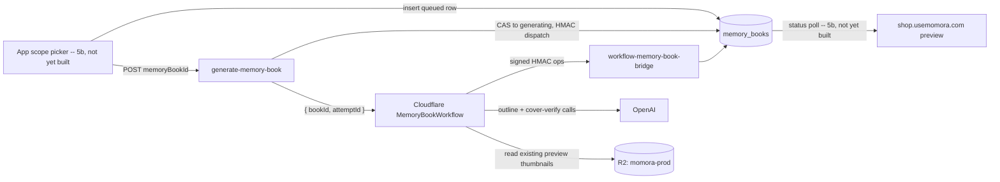

# Feature: Memory Book generation (V5a)

**Status:** `in-progress` — schema + RLS contract (part A/B) and the durable
generation pipeline (part C: dispatcher + Workflow) are shipped. 5b's v1
edit-surface **schema + Edge Function** (`memory_book_edits`,
`memory-book-edits`, [below](#edit-surface-v1)), `applyBookEdits`
(`book-renderer/src/model/edits.ts`), pluggable asset resolution
(`loader.ts`'s `setAssetUrlProvider`), and focal-point template wiring
(plan steps 1-5) are shipped. The web app itself
(`book-renderer/src/web/`, plan step 6), its dedicated PII-safe build
(`vite.web.config.ts` + `scripts/check-web-bundle.mjs`, step 7), and its
hosting Worker (`cloudflare/memory-book-web/`, step 7) are also shipped —
**not yet deployed** (owner-gated DNS/deploy; see that Worker's own
README). Checkout (5c) and the in-app scope picker (5a.5) remain not
started. Check
[plans/memory-book-5b-web-preview.md](../../plans/memory-book-5b-web-preview.md)
and the relevant source directly for anything this summary doesn't cover.
**Last updated:** 2026-09-07
**PRD reference:** none yet (Memory Book is a new premium product, not in the
original PRD) — canonical product doc is
[docs/plans/memory-book.md](../plans/memory-book.md), specifically
§"V5 scope" (5a/5b/5c) and §8 (data-model sketch).

## Overview

A Memory Book is a parent-initiated request to turn a chosen time period of a
family's memories into a premium AI-curated, AI-laid-out hardcover book. V5a
ships in parts: part A/B is the durable **schema and status contract** — the
`memory_books` table, its status machine, and the RLS boundary that lets the
app insert a request while keeping every generation transition service-role
only. Part C (this doc's [API section](#api--edge-functions)) is the durable
**generation pipeline** itself: a Supabase dispatcher, a Cloudflare Workflow
that curates the outline and assembles `book_document`, and a signed bridge
between them — following
[docs/durable-ai-generation-workflows.md](../durable-ai-generation-workflows.md)'s
established pattern. It intentionally does **not** ship the in-app scope
picker UI, the web preview, or checkout — those are 5b (UI)/5c, tracked
separately in the plan.

Generation reuses the pattern documented in
[docs/durable-ai-generation-workflows.md](../durable-ai-generation-workflows.md)
(the memory-illustration and portrait Cloudflare Workflows): Supabase owns
authorization and the status row, a Cloudflare Workflow owns steps/retries,
publication is a database compare-and-set, and the client only ever polls
status — it never writes it.

## User-facing behavior

The in-app scope picker UI is not yet built (5b). This slice has no UI, but
the pipeline it triggers is real and running end to end: given a `queued`
row, `generate-memory-book` dispatches a Cloudflare Workflow that curates and
publishes a complete `book_document`. The eventual flow (per the plan): the
app's in-app scope picker (who/when) creates the `memory_books` row, calls
`generate-memory-book`, and hands the family off to
`shop.usemomora.com/b/<id>` via a one-time signed link; the web app polls
`status` and renders the preview once `ready`.

## Architecture



The scope-picker UI and the web preview are still 5b. Everything else in the
diagram — the dispatcher, the Workflow, the bridge, and their CAS discipline
on `memory_books` — is shipped (part C).

## Data model

| Table | Role |
|---|---|
| `memory_books` | One row per book project: family/child scope, frozen time-period window, GENERATION status machine, page budget, and the final `book_document` JSON once ready. |
| `memory_book_edits` | One row per book: every parent-made v1 edit (text overrides, image replace/reposition) as a single `jsonb` blob. Client SELECT-only; every write goes through `memory-book-edits` (service-role) — see [Edit surface (v1)](#edit-surface-v1). |

Full column list and constraints: [TECH_SPEC §2.1d](../TECH_SPEC.md#21d-memory-book-generation-v5a)
(`memory_books`) and [TECH_SPEC §2.1e](../TECH_SPEC.md#21e-memory-book-v1-edit-surface-v5b)
(`memory_book_edits`).

### Status machine

```
queued → generating → ready
                    ↘ failed
```

| Status | Meaning | Who sets it |
|---|---|---|
| `queued` | App has requested a book; no generation attempt exists yet. | App (insert only — this is the only status a client insert may claim). |
| `generating` | A Workflow instance is running. `workflow_instance_id`, `generation_attempt_id`, `generation_started_at` are set. | `generate-memory-book`'s service-role CAS (`UPDATE ... WHERE id = $1 AND status = $2`, no RPC — see [API & Edge Functions](#api--edge-functions) for why). |
| `ready` | `book_document` is populated; `generation_completed_at` set. | `workflow-memory-book-bridge`'s `publish` operation, via a service-role compare-and-set on `generation_attempt_id` + `status = 'generating'` — mirrors the illustration workflow's "publication is a database compare-and-set" invariant so a stale/superseded attempt can never publish over a newer one. |
| `failed` | `failure_reason` populated. | `workflow-memory-book-bridge`'s `fail` operation, same CAS discipline. |

`generation_started_at` is a **dedicated recovery clock**, not
`created_at`/`updated_at` — an unrelated future write (e.g. a future
book-title edit) must not extend or shorten a generation lease, exactly as
`memories.illustration_generation_started_at` does today. The playbook's
recovery-threshold table does not transfer as-is: this pipeline currently
uses a provisional 8:00 lease + 0:30 recovery grace
(`MEMORY_BOOK_LEASE_MS`/`MEMORY_BOOK_RECOVERY_GRACE_MS` in
`generate-memory-book/index.ts`) — shorter than the illustration pipeline's
5:30 since there is no image generation here, but NOT YET measured against
a real production run (no E2E run has completed in this environment; see
this change's implementation report). Revisit once one has — the playbook
explicitly warns against copying another pipeline's lease "without
measuring that pipeline."

### Scope

The app resolves and **freezes** a concrete `[scope_start_date,
scope_end_date]` window at insert time — `age_year` from the child's
`date_of_birth`, `calendar_year` from Jan 1–Dec 31, `custom_range` from the
picker. `everything` is the one open-ended scope (both dates stay null,
meaning "every printable memory at generation time"). Freezing the window up
front means a later DOB correction or new memories added mid-generation
can't silently change what an in-flight book covers.

### RLS

- `select`: `is_family_member(family_id)` — same shape as every other
  family-scoped table (most recently `media_share_tokens`,
  `20260829120000_media_share_tokens.sql`).
- `insert`: `has_family_role(family_id, ['owner','manager'])` +
  `requested_by = auth.uid()` + a same-family check on `child_id` (the
  "Memory tags: insert" cross-family-tag lesson from
  `family-sharing.md` applied here — without it, a manager of two families
  could point `child_id` at family B's child while `family_id` claims
  family A) + a with-check pinning the row to the exact just-queued shape
  (`status = 'queued'`, every generation-identity column and
  `book_document` null).
- **No update or delete policy exists for `authenticated` at all**, and the
  table grants `authenticated` only `select, insert` (not update/delete).
  This mirrors `memory_illustration_jobs`'s "job is service-only" contract:
  RLS with zero matching policy denies the operation outright for every
  non-bypassing role, and the missing table-level grant blocks it a second,
  independent way even if a future migration accidentally added a
  permissive policy. Every status transition and the `book_document` write
  goes through the service-role dispatcher/bridge (part C) — as plain
  service-role `UPDATE ... WHERE id = $1 AND status = $2`/`... AND
  generation_attempt_id = $2` statements, not a Postgres RPC function (a
  deliberate scope decision for this table specifically — see the [API &
  Edge Functions](#api--edge-functions) section's deviation note; service
  role bypasses RLS entirely regardless).

### Constraints worth knowing when extending this table

- `memory_books_ready_has_document` / `memory_books_failed_has_reason`: a
  terminal row can't be `ready` without a document or `failed` without a
  reason.
- `memory_books_age_year_requires_child`: `scope_kind = 'age_year'` requires
  `child_id`.
- `memory_books_scope_dates_required`: every scope but `everything` requires
  both dates resolved before insert.
- `memory_books_one_active_per_scope` (partial unique index): blocks two
  simultaneously `queued`/`generating` rows for the identical
  `(family_id, child_id, scope_kind, scope_start_date, scope_end_date)` —
  a deliberate V5a addition (not explicit in the plan) to stop an
  accidental double-tap or retry from paying for two outline generations of
  the same period. It does **not** block multiple *completed* books for the
  same or overlapping scope — the plan is explicit that "a family can order
  any number of books over time; scopes may overlap" (§4).
- **Deliberately no constraint ties `status` to the nullability of
  `workflow_instance_id`/`generation_attempt_id`/`generation_started_at`**
  beyond what's listed above. Part C's retry semantics: a retry after
  `failed` (or a stale `generating` reclaim) always mints a FRESH UUID for
  both `workflow_instance_id` and `generation_attempt_id` — it never reuses
  the previous attempt's value (Cloudflare Workflow instance ids are
  effectively one-shot: a terminal instance can't be meaningfully
  restarted under its old id). Only a still-fresh `generating` row's
  redispatch reuses the existing `workflow_instance_id`, and that's a
  true idempotent retry of the SAME in-flight attempt, not a new one.

## API & Edge Functions

Shipped (part C):

| Function | Role |
|---|---|
| `generate-memory-book` | Dispatcher, `verify_jwt = true`. JWT + owner/manager role check, `ready`/fresh-`generating` short-circuits, service-role CAS claim to `generating` with a fresh attempt UUID, HMAC dispatch of `{ bookId, attemptId }` to the Worker's `/dispatch`. |
| `workflow-memory-book-bridge` | Signed HMAC bridge, `verify_jwt = false`, Worker-only. Operations: `load_generation_context`, `ensure_share_tokens`, `publish`, `fail`, `reconcile`. |
| `cloudflare/memory-book-worker` (`MemoryBookWorkflow`) | Own Wrangler deployment (own `wrangler.jsonc`/`package.json`, Node 22), sibling to `memory-illustration-worker`. Curates the outline (ported from `supabase/scripts/eval-memory-book-outline.ts`'s pure functions + the shared `_shared/memory-book-outline.ts` builders/parser), runs the shared cover-verify vision pass against R2 preview thumbnails, assembles `book_document` via `_shared/memory-book-manifest.ts`'s builders, and publishes through the bridge's CAS. |
| `memory-book-edits` | V5b v1 edit surface, `verify_jwt = true`. Ops `save_edit`/`picker_pool` — see [Edit surface (v1)](#edit-surface-v1). |

Full request/response contracts, the Workflow's step sequence, and two
deliberate documented deviations from the illustration/portrait bridge
precedent (no publish/fail RPC, no nonce-replay ledger table — both because
this task's scope excluded schema changes) are in
[TECH_SPEC §4.22](../TECH_SPEC.md#422-memory-book-generation-v5a-part-c).
See [docs/durable-ai-generation-workflows.md](../durable-ai-generation-workflows.md)
for the general pattern this follows.

## Edit surface (v1)

This section covers `plans/memory-book-5b-web-preview.md` steps 1-2: the
`memory_book_edits` schema and the `memory-book-edits` Edge Function that is
its only writer. `applyBookEdits` (the pure pre-fit/post-fit consumer —
step 4), focal-point template wiring (step 5), and the web UI that actually
calls this function (`book-renderer/src/web/`, step 6) are all also shipped
(steps 3-7 landed alongside 1-2 — see this doc's top-of-file Status line) —
check `book-renderer/src/model/edits.ts`, `book-renderer/src/web/`, and the
plan file itself for exactly what each does rather than assuming this
section's own description is exhaustive.

### Trust boundary

A parent's book edits (dedication/closing/section-title/caption text,
photo replace, cover photo, focal point) are the one piece of book content a
client writes AFTER generation. Design Decision 4/5 resolve the obvious risk
(a client claiming a `mediaId` it doesn't own, or dimensions it made up) by
**never letting the client write `memory_book_edits` directly at all**:

- RLS on `memory_book_edits` is `select`-only for `authenticated` — no
  insert/update/delete policy exists, and the table grant doesn't include
  them either (same "job is service-only" shape as `memory_books` itself,
  [TECH_SPEC §2.1e](../TECH_SPEC.md#21e-memory-book-v1-edit-surface-v5b)).
- The `memory-book-edits` Edge Function (service-role) is the **only**
  writer. For an image edit it re-resolves `mediaId` → owning
  `memory_media` row → owning memory's `family_id` **server-side**, and
  measures the ORIGINAL photo's real pixel dimensions itself (see below) —
  never trusting anything the client sends beyond which media it picked.

The payoff: 5c's future service-role print path can read
`memory_book_edits.edits` and trust every key/dimension in it without
re-validating anything, because a client literally cannot have written a
fabricated value into that column.

### Edit shapes and keying

`edits` is a `jsonb` object with three namespaced categories — `text`,
`images`, `focalPoints` — keyed by a **stable, non-positional** target
(never an array index, so an edit can't silently mis-target a slot after a
regeneration):

| Category | Key | Stored record |
|---|---|---|
| `text` | `target` — `dedication` \| `closing` \| `backCover` \| `sectionTitle:<elementId>` \| `eyebrow:<elementId>` \| `caption:<memoryId>` | `{ target, value }` |
| `images` | `<memoryId>:<mediaId-or-assetFileKey>`, or the literal `cover` for the cover photo | `{ slot, mediaId, file, originalFile, aspectRatio, originalWidth?, originalHeight? }` |
| `focalPoints` | `<memoryId>:<mediaFileKey>` (often the same key as an `images` entry — a focal point can be set on a photo whether or not that slot also has a replacement) | `{ slot, x, y }` (0–1) |

**Eligibility (v1):** only photo slots rendered via `PhotoSlotContent`
(PhotoTile pages, FullBleed, PanoramaSpread) and the cover photo are
editable. AI illustrations and illustrated portraits are not — the Edge
Function enforces this server-side too (`content_type` must start
`image/`; a non-photo `mediaId` is rejected with `400 MEDIA_NOT_PHOTO`).

### `save_edit`

`POST memory-book-edits { op: 'save_edit', bookId, edit }`. Auth: caller
must be owner/manager of the book's family, and the book must be `status =
'ready'`. Flow:

1. Validate `edit`'s shape for its `kind` (`text` / `imageReplace` /
   `coverPhoto` / `focalPoint`) — format only; a text target's embedded
   `memoryId`/element id is never checked against the DB (an
   orphaned/wrong-family key is inert — Decision 6's own "orphans cleanly"
   contract — since it can only ever be consumed by the render-time
   consumer's own manifest/outline lookups).
2. For an image edit, resolve `mediaId` → `memory_media` → owning memory's
   `family_id`, reject if it doesn't match the book's family (`404
   MEDIA_NOT_FOUND` — same response whether the id is unknown or belongs to
   another family, so there's no oracle for "does this id exist elsewhere",
   mirroring `get-media-url`'s per-key omission rationale). Resolve `file`
   (`preview_object_key ?? object_key`) and `originalFile` (`object_key`),
   and measure the original's real pixel dimensions (next section).
3. Read-merge-write: load the book's single `memory_book_edits` row (or
   treat a missing one as `{}`), merge the new record into its category/key,
   `upsert` the whole row (`onConflict: 'book_id'`). This is single-row
   **last-write-wins** for v1 — no per-field CAS, no optimistic-concurrency
   check. Stated, not solved; per-field merge is a v2 follow-up (plan Risks).
4. Return `{ success: true, edits }` — the full merged object, so the
   client doesn't need a second round trip to render its own change.

### Original-dimension measurement

Photo full-bleed/panorama trust gates need the ORIGINAL photo's real pixel
dimensions (not the ~1280px preview's), exactly like the generation
Workflow's own manifest-asset measurement
(`cloudflare/memory-book-worker/src/dimensions.ts`). Edge Functions have no
R2 binding, so `memory-book-edits`' `measureOriginalDimensions` gets there a
different way: a short-lived (300s) presigned GET URL
(`_shared/r2.ts#createPresignedGetUrls`) read with an HTTP `Range` header,
instead of the worker's R2-binding ranged `.get()`. The semantics are
otherwise identical: a 256KB first-pass probe, a 4MB fallback only when the
first read came back full-length-but-still-unparseable (meaning the object
is larger and the header just didn't fit — never a re-read of the same
bytes), `npm:image-size` for the actual parse, and **absent, never
fabricated** dimensions on any failure (missing object, network error,
corrupt/unsupported header even after the fallback) — the caller omits the
field rather than guessing.

### `picker_pool`

`POST memory-book-edits { op: 'picker_pool', bookId, cursor?, limit? }`
(limit capped at 50). Returns a keys-only page of the book's in-scope
photos for the image-replace picker sheet — `memoryId`, `mediaId`,
`previewKey`, `date`, `aspectRatio`, `alreadyInBook` — never a URL; the
client presigns whichever thumbnails it actually renders through the
existing `get-media-url` coalescer (same pattern the app's own media
loading already uses). The scope window is resolved exactly like
`workflow-memory-book-bridge`'s `load_generation_context` (frozen dates, or
the family's live min/max `memory_date` for an `everything`-scope book) —
pagination is what keeps an `everything`-scope family's pool bounded per
request, not a soft nicety. Pagination is an **opaque offset cursor**, not a
true `(memory_date, id)` keyset — see
[TECH_SPEC §4.23](../TECH_SPEC.md#423-memory-book-edits-v5b-v1-edit-surface)
for why, and its accepted trade-off.

### How 5c will consume edits

5c's print path is out of scope here, but the contract it will consume is
already fixed by this change: `applyBookEdits` (plan step 4) is specified to
be a **pure, runtime-agnostic** function —
`applyPreFit(outline, manifest, edits)` and `applyPostFit(document, edits)`
— because every piece of I/O (mediaId resolution, dimension measurement) is
already done at `save_edit` time. Per Decision 7: TEXT edits apply
POST-fit (to already-fitted slots/params, so a caption typo fix can never
re-paginate the book) and IMAGE edits apply PRE-fit (manifest/outline
substitution, so a too-small replacement photo's reflow is real and
visible, never silently hidden) — 5c reuses the identical `edits` row and
the identical `applyBookEdits` split the web preview uses, by construction.

## Client integration

The in-app scope picker is not yet built (5b UI). It will: read
`family_members.date_of_birth` to resolve `age_year` windows, compute
`page_budget` from a printable-memory count in the chosen scope, insert the
`memory_books` row, then call `generate-memory-book({ memoryBookId })` and
poll `status`. `shop.usemomora.com` (also 5b — a third Vite entry inside
`book-renderer` itself, `src/web/`, NOT a separate Next.js package; see
`plans/memory-book-5b-web-preview.md` Design Decision 1 and
`docs/plans/memory-book.md` §V5's 5b bullet) polls `status` and renders
`book_document` through the shared `book-renderer` components
(single-renderer rule — plan §3) once `ready`.

### How to invoke from another feature

1. Resolve a concrete scope window (`age_year` needs the child's DOB;
   `calendar_year`/`custom_range` are computed directly; `everything` sends
   both dates null).
2. Insert a `memory_books` row as the requesting user: `family_id`,
   optional `child_id`, `requested_by: auth.uid()`, `scope_kind`,
   `scope_start_date`/`scope_end_date` (per above), `scope_label`,
   `page_budget` (18–122). Leave `status` at its `queued` default and every
   generation-identity/`book_document` field unset — the RLS with-check
   rejects anything else.
3. Call `generate-memory-book({ memoryBookId })` to dispatch generation, then
   poll `status` (once 5b's UI ships, hand off to its own recovery/retry
   entry points — do not write `status` from the client; a retry after
   `failed` is just calling `generate-memory-book` again with the same id).

## Extension guide

**Safe to extend**

- Add columns for 5b needs (e.g. a `language` field, cover selection) via a
  new migration; keep the "app inserts queued, service owns transitions"
  boundary intact.
- ~~Add narrowly-scoped client `update` policies for genuinely
  parent-editable fields~~ **Superseded (2026-09-07):** the shipped v1 edit
  surface does NOT add a client `update` policy anywhere, on this table or
  `memory_book_edits`. Round-3 plan hardening
  (`plans/memory-book-5b-web-preview.md` Design Decision 4) found that even
  a narrowly-scoped column-level policy would let a client claim a
  `mediaId`/dimensions it doesn't own — so every edit write goes through
  the `memory-book-edits` Edge Function (service-role) instead, and
  `memory_book_edits` itself is select-only for `authenticated`, same shape
  as this table. See [Edit surface (v1)](#edit-surface-v1).
- Add a private job table alongside `memory_books` if 5b's retry/replay
  needs turn out to require the same paid-attempt-reservation machinery the
  illustration workflow has (per-attempt counters, upload leases). This
  schema deliberately kept generation identity on the single row for V5a's
  simpler (cheap, no-Puppeteer-preview) scope; don't assume that decision
  survives 5c's print-render worker without re-checking against the
  playbook's invariants.

**Do not change without updating this doc**

- The RLS boundary (no client update/delete) — this is the core safety
  property of the durable-workflow pattern applied here.
- The `memory_books_one_active_per_scope` index's dedup key, if the
  scope-resolution rules change (e.g. if `age_year` boundaries stop being
  frozen at insert time).
- `book_document`'s null-until-ready contract — the single-renderer rule
  (plan §3) depends on this being the one JSON representation for both web
  preview and (eventually) print.

**Common extension patterns**

- If a future change gets to own a schema migration too, close the two
  part-C deviations properly: add `publish_memory_book_workflow`-style
  RPCs (mirroring `20260721120000_memory_illustration_workflow_jobs.sql`'s
  shape) and a `memory_book_workflow_bridge_nonces` replay-ledger table
  (mirroring the illustration bridge's). Neither is a correctness bug today
  (see TECH_SPEC §4.22's deviation notes for why the plain CAS + timestamp
  window are already sound), just a defense-in-depth gap this task's scope
  didn't include.
- A real page-count-aware themed-spread admission pass (matching the eval
  CLI's `admitThemedSpreads` + `book-renderer` `fitBook` oracle, currently
  skipped in the Workflow's `reading-order.ts` port — see that file's
  header comment) is a reasonable follow-up once `book-renderer`'s fitter
  is wired into a render-time consumer of `book_document`.
- Real asset dimensions (`ManifestAsset.width`/`height`/`originalWidth`/
  `originalHeight`) — the Workflow currently never downloads bytes (task
  brief: "no downloads, no resizing"), so these are a nominal
  aspect-ratio-consistent placeholder and an intentionally-absent pair
  respectively (see `cloudflare/memory-book-worker/src/manifest.ts`'s
  header comment). A future change that adds a bounded R2 HEAD/dimension
  probe should update that comment and this bullet together.
- ~~Web preview (5b) → new `shop.usemomora.com` package that reads
  `book_document = { outline, manifest }` and runs `book-renderer`'s
  `fitBook`~~ **Shipped 2026-09-07**: `book-renderer/src/web/` (a third
  Vite entry, `web.html` — NOT a separate Next.js package, see this doc's
  Client integration section and `docs/plans/memory-book.md` §V5's 5b
  bullet), hosted by `cloudflare/memory-book-web/`. Not yet deployed
  (owner-gated).
- Checkout (5c) → a separate `memory_book_orders` table (plan §8) — not
  part of `memory_books`; give it its own feature doc section or file.

## Constraints & gotchas

- **No memory content in logs anywhere in this pipeline** — same PII rule
  as every other AI pipeline in this repo. `book_document` will eventually
  contain memory text/photo references; never log it.
- `page_budget` is a **soft input to curation**, not the final printed page
  count — round-3 owner review made 122 pages a ceiling the content earns
  its way up to, not a target (plan §5 Stage B). The realized page count
  lives in `book_document` once `ready`.
- A book's scope is frozen at request time. If the picker needs to show a
  live "N printable memories in this scope" count before the parent
  confirms, compute it read-only against `memories` — don't infer it from
  `memory_books` after the fact.
- This table has **no** `memory_book_orders`-style purchase/fulfillment
  state. Do not conflate "book is ready to preview" with "book has been
  paid for and printed" — those are 5c concerns on a different table.
- `memory_book_edits` only accepts writes against a `ready` book — there is
  no `book_document`/manifest for `save_edit`'s image-replace path or
  `picker_pool`'s `alreadyInBook` hint to work against otherwise
  (`409 BOOK_NOT_READY`).
- `memory-book-edits`' dimension-measurement probe never fetches more than
  4MB of any original photo, and never logs memory content — only ids,
  keys, and the caller-controlled edit VALUE is deliberately never logged
  either (it's the one field a caller fully controls; treat it like memory
  text for logging purposes even though it isn't stored in `memories`).

## Dependencies

- Depends on: `families`, `family_members`, `is_family_member`/
  `has_family_role` (family-sharing), `memories`/`memory_media`/
  `memory_family_members`/`memory_milestones`/`memory_likes`/
  `memory_comments`/`family_member_portrait_versions` (the curation input,
  read by `workflow-memory-book-bridge`, not referenced by a FK from
  `memory_books` itself), `media_share_tokens` (QR tokens minted for
  video/audio memories in the published document), `_shared/memory-book-
  outline.ts` and `_shared/memory-book-manifest.ts` (shared with
  `supabase/scripts/eval-memory-book-outline.ts`/`eval-memory-book-assets.ts`
  — see TECH_SPEC §4.22 for exactly what's ported vs. shared vs. simplified),
  OpenAI (`gpt-5.6-sol`, outline + cover-verify calls), and the
  `MEMORY_BOOK_PREVIEWS` R2 binding (reads EXISTING
  `memory_media.preview_object_key`/`object_key` objects for cover-verify
  thumbnails — never writes to R2). `memory-book-edits` additionally
  depends on `memory_media` (mediaId resolution) and `_shared/r2.ts`'s
  `createPresignedGetUrls` (dimension-measurement ranged reads) — see [Edit
  surface (v1)](#edit-surface-v1).
- Used by: `applyBookEdits` (plan step 4) is the consumer of
  `memory_book_edits.edits` at both preview render time and 5c print time —
  the edit shapes and the trust boundary above are the contract it's built
  against (check `book-renderer/src/model/edits.ts` for its current state).
  The scope-picker UI, the web preview app itself, and checkout (5b steps
  3-9 / 5c) are the other consumers of a `ready` book tracked by the plan.

## Testing

### Migration verification (schema/RLS, part A/B)

No pgTAP suite yet for this table specifically. It was verified manually
against a local Postgres with the full migration history applied
(`supabase db reset --local`): insert as a family owner succeeds only with
the exact queued shape; a cross-family `child_id` is rejected; an insert
pre-claiming `status = 'ready'` with a `book_document` is rejected; a
client `update` of `status` is rejected at the grant level (`permission
denied for table memory_books`, not just RLS); and a second family cannot
see or insert against the first family's rows.

### `memory_book_edits` migration verification (V5b step 1)

Also verified manually against a local Postgres with the full migration
history applied (`supabase db reset --local`, ports temporarily shifted in
`supabase/config.toml` to avoid a locally-running unrelated project on the
default ports, then reverted — same workaround `memory_books`' own author
used): as the owning family's owner, `select` on the family's own row
returns it; as a second family's owner, the SAME row is invisible (`select`
returns zero rows, not an error — RLS, not a 403); as the owning family's
owner, `update`/`insert`/`delete` are all rejected at the **grant level**
(`permission denied for table memory_book_edits`, not just RLS — confirmed
distinctly for each of the three statements); and `anon` is rejected at the
grant level too. `src/types/database.ts` was regenerated in the same change
(`supabase gen types typescript --local`) and diffs cleanly (only the new
table's types added).

### `memory-book-edits` Edge Function tests (V5b step 2)

- `supabase/functions/memory-book-edits/index.test.ts` — Deno,
  dependency-injected (auth/role/service-client/presign/fetch), 43 tests:
  auth rejection incl. the WP-SEC anonymous-chokepoint wiring check, method/
  body/op/bookId validation, 404/403/409 (unknown book / wrong role /
  not-ready book), every text-target/value validation branch, **cross-family
  mediaId rejection** (the media resolves to a different family than the
  book's — the core trust-boundary test), unknown-mediaId and non-photo
  rejection, the reserved `cover` slot, focal-point range validation,
  successful `imageReplace`/`coverPhoto` saves incl. `file`/`originalFile`/
  `aspectRatio` resolution, **dimension-measurement fallback** (a
  full-length-but-unparseable 256KB probe correctly triggers the 4MB
  fallback read), and **absent-never-fabricated** dimension behavior (a
  missing original or a failed presign still saves the edit, just without
  `originalWidth`/`originalHeight`); `picker_pool` **pagination** (cursor
  round-tripping, the 50-item page cap, `nextCursor` present only on a full
  page, malformed-cursor rejection) and the `alreadyInBook` flag (both via a
  manifest-asset-file match and via an existing saved image edit); plus
  direct unit coverage of the exported helpers (`normalizeEdits`,
  `collectManifestAssetFiles`, `resolveScopeWindow` incl. its
  `everything`-scope live-window resolution, `measureOriginalDimensions`
  against real, hand-built PNG fixture bytes).

### Generation pipeline tests (part C)

- `supabase/functions/generate-memory-book/index.test.ts` — Deno,
  dependency-injected (auth/role/service-client/fetch/clock): auth
  rejection, role rejection, 404, `ready` short-circuit, fresh-`generating`
  idempotent redispatch, stale-`generating` reclaim with a fresh attempt
  id, `queued`/`failed` claim + dispatch, 409-duplicate-instance treated as
  success, dispatch-failure rollback to `failed`, missing Worker config.
- `supabase/functions/workflow-memory-book-bridge/index.test.ts` — Deno,
  HMAC binding/tamper, unsigned/unknown-operation/malformed-id rejection,
  `publish`/`fail` CAS match and no-match, `reconcile`'s four outcomes,
  `ensure_share_tokens` reuse-vs-mint, `load_generation_context`'s
  superseded/404/happy-path (including the `everything`-scope window
  resolution and the `scope_end_date` inclusive→exclusive conversion).
- `cloudflare/memory-book-worker/test/*.test.ts` — Vitest
  (`@cloudflare/vitest-pool-workers`): `crypto`, `eligibility`,
  `candidates`, `backbone`, `reading-order` (unit tests of the ported pure
  functions, mirroring the eval CLI's own thresholds/tie-breaks),
  `manifest` (asset selection, share-token gating, the family-name
  fallback for a childless book), `index` (dispatch HMAC auth, duplicate
  handling, malformed-body rejection), `workflow.integration` (a full
  `MemoryBookWorkflow.run()` against faked bridge/OpenAI/R2 responses,
  reaching `ready` with a `book_document` whose `outline`/`manifest` shape
  is asserted, plus the `NO_ELIGIBLE_MEMORIES`/context-load-failure/
  lost-CAS failure paths).

### Web app + hosting Worker tests (V5b steps 6-7)

- `book-renderer`'s `npx vitest run` (404 tests as of this change — 403
  baseline + 1 new): includes a `Closing` template test asserting
  `params.closingLine` (written by `applyPostFit` since step 4, but
  unread by `Closing.tsx` until this change — the "wave-1 wiring gap"
  fixed alongside steps 6-7) both overrides the furniture memory-count
  line when present and stays byte-identical when absent. Snapshot suite
  unchanged. `src/web/` itself (auth, book list/view, edit panel, the
  media coalescer, the slot-key resolver in `book/slotKeys.ts` — since
  2026-09-09 an EXACT lookup on `editedFromFile` (the slot's pristine
  identity, stamped by `substituteAsset` and threaded through the fitter
  into `PhotoSlotContent`), replacing the original file-matching scan that
  collided when one photo occupied two slots — the owner-hit
  duplicate-replace bug where a replace on a photo's native home silently
  retargeted the slot it had been swapped into; `slotKeys.ts` now HAS
  dedicated unit tests (`book/__tests__/slotKeys.test.ts`) covering both
  the cross-memory and same-memory duplicate scenarios) has otherwise no
  dedicated unit tests yet — it's exercised via
  `tsc --noEmit` (full package, including `src/web/`) and the real
  `npm run build:web` + `check-web-bundle.mjs` run; the live smoke against
  the canary book (step 9) is the functional check for the auth/render/
  edit flows themselves. A follow-up could add component/hook tests for
  `src/web/` the way `templates.test.tsx` covers the renderer.
- `cloudflare/memory-book-web/`'s `npx vitest run` (Node ≥22, plain vitest
  — no Miniflare/`@cloudflare/vitest-pool-workers` needed for a handler
  this small, same posture `workers/memory-viewer` documents): the
  fetch-passthrough case, the SPA-fallback-to-`/web.html` case (both for a
  client-side route and for `/`), that the fallback preserves the
  original request's method/headers, and that a non-404 (e.g. a 500) does
  NOT trigger the fallback.

### Run this feature's tests

```bash
npm run db:reset   # applies migrations (incl. this one) against local Postgres
npm test           # src/types/database.ts is exercised transitively across the suite
npm run test:edge   # generate-memory-book + workflow-memory-book-bridge + memory-book-edits (Deno)
cd cloudflare/memory-book-worker && npm test   # Workflow/dispatch (Vitest, Node 22)

# Web app + hosting Worker (V5b steps 6-7):
cd book-renderer && npx tsc --noEmit && npx vitest run
cd book-renderer && VITE_SUPABASE_URL=... VITE_SUPABASE_ANON_KEY=... npm run build:web   # also runs the PII bundle check
cd cloudflare/memory-book-web && npm test && npm run typecheck && npm run deploy:dry-run
```

## Changelog

| Date | Change |
|------|--------|
| 2026-09-07 | V5b steps 6-8 (+ one wave-1 wiring gap): the web app shipped — `book-renderer/src/web/` (a third Vite entry, `web.html`: email-OTP auth, family book list with status chips + polling + plain coalescer thumbnails, book view running `book_document -> applyPreFit -> fitBook -> applyPostFit -> SpreadPager`, an edit panel for all v1 text targets + image replace via a paginated picker sheet + focal-point reposition via a dedicated crop modal, skipped-orphan surfacing). Dedicated PII-safe build (`vite.web.config.ts`, `publicDir: false`, single `web.html` input, `dist-web/` output) with a real bundle check (`scripts/check-web-bundle.mjs`, wired into `build:web`) verified against an actual build (confirmed it FAILS on an injected `book-data`/`index.html` violation, not just passes on the real one). Hosting: `cloudflare/memory-book-web/`, a static-assets Worker with explicit SPA fallback to `web.html` (deliberately not Cloudflare's `index.html`-only convention), route `shop.usemomora.com` — `wrangler deploy --dry-run` and `wrangler check startup` both verified; not deployed (owner-gated). Wave-1 wiring gap fixed: `Closing.tsx` now reads `params.closingLine` (written by `applyPostFit` since step 4 but previously unread — a saved closing-line edit silently had no effect until this change). `docs/plans/memory-book.md` §V5's 5b bullet updated (Vite-entry decision, not Next.js; localStorage session note) — this doc's own stale "Next.js package" mention corrected too. Steps 3-5 (`applyBookEdits`, pluggable asset resolution, focal-point template wiring) were already shipped as part of wave 1 (commit `3acd5a9`) even though the entry below didn't call them out individually. |
| 2026-09-07 | V5b steps 1-2: v1 edit-surface schema + Edge Function shipped — `memory_book_edits` migration (client select-only; every write service-role, verified via psql) and `memory-book-edits` (`save_edit` + `picker_pool`, server-side `mediaId` resolution and original-photo dimension measurement via presigned-GET + HTTP Range). `applyBookEdits`, focal-point wiring, and the web app itself remain not-yet-built (plan steps 3-9). Corrected this doc's earlier "add narrowly-scoped client update policies" extension-guide bullet, which the round-3-hardened plan superseded with the service-role-only design actually shipped. |
| 2026-09-01 | V5a part C: durable generation pipeline shipped — `generate-memory-book` dispatcher, `workflow-memory-book-bridge`, and `cloudflare/memory-book-worker`'s `MemoryBookWorkflow` (curates the outline from ported eval-CLI logic + shared builders, verifies cover candidates, assembles `book_document`, publishes via CAS). No schema migration in this change (two deviations documented in TECH_SPEC §4.22: plain-CAS instead of a publish/fail RPC, no nonce-replay ledger). Scope-picker UI and web preview remain 5b; checkout remains 5c. |
| 2026-09-01 | V5a part A/B: `memory_books` schema + RLS/status contract shipped. No worker, UI, or checkout yet. |
