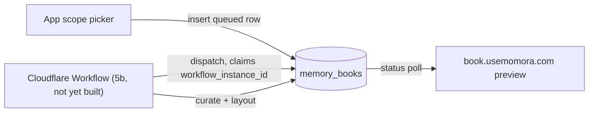

# Feature: Memory Book generation (V5a)

**Status:** `in-progress` — schema + RLS contract shipped (this doc); durable
Cloudflare Workflow, web preview, and checkout are separate, not-yet-built
slices (5b/5c).
**Last updated:** 2026-09-01
**PRD reference:** none yet (Memory Book is a new premium product, not in the
original PRD) — canonical product doc is
[docs/plans/memory-book.md](../plans/memory-book.md), specifically
§"V5 scope" (5a/5b/5c) and §8 (data-model sketch).

## Overview

A Memory Book is a parent-initiated request to turn a chosen time period of a
family's memories into a premium AI-curated, AI-laid-out hardcover book. This
slice (V5a) ships only the durable **schema and status contract**: the
`memory_books` table, its status machine, and the RLS boundary that lets the
app insert a request while keeping every generation transition service-role
only. It intentionally does **not** ship the worker that actually curates and
lays out a book, the web preview, or checkout — those are 5b/5c, tracked
separately in the plan.

Generation reuses the pattern documented in
[docs/durable-ai-generation-workflows.md](../durable-ai-generation-workflows.md)
(the memory-illustration and portrait Cloudflare Workflows): Supabase owns
authorization and the status row, a Cloudflare Workflow owns steps/retries,
publication is a database compare-and-set, and the client only ever polls
status — it never writes it.

## User-facing behavior

Not yet built (5b). This slice has no UI. The eventual flow (per the plan):
the app's in-app scope picker (who/when) creates the `memory_books` row and
hands the family off to `book.usemomora.com/b/<id>` via a one-time signed
link; the web app polls `status` and renders the preview once `ready`.

## Architecture



Only the left-hand edge (`App scope picker → memory_books`) exists today.
The worker, its dispatcher/bridge, and the web preview are 5b.

## Data model

| Table | Role |
|---|---|
| `memory_books` | One row per book project: family/child scope, frozen time-period window, GENERATION status machine, page budget, and the final `book_document` JSON once ready. |

Full column list and constraints: [TECH_SPEC §2.1d](../TECH_SPEC.md#21d-memory-book-generation-v5a).

### Status machine

```
queued → generating → ready
                    ↘ failed
```

| Status | Meaning | Who sets it |
|---|---|---|
| `queued` | App has requested a book; no generation attempt exists yet. | App (insert only — this is the only status a client insert may claim). |
| `generating` | A Workflow instance is running. `workflow_instance_id`, `generation_attempt_id`, `generation_started_at` are set. | Service-role dispatcher (5b). |
| `ready` | `book_document` is populated; `generation_completed_at` set. | Service-role publish RPC (5b), via compare-and-set on `generation_attempt_id` — mirrors the illustration workflow's "publication is a database compare-and-set" invariant so a stale/superseded attempt can never publish over a newer one. |
| `failed` | `failure_reason` populated. | Service-role fail RPC (5b). |

`generation_started_at` is a **dedicated recovery clock**, not
`created_at`/`updated_at` — an unrelated future write (e.g. a book-title
edit in 5b) must not extend or shorten a generation lease, exactly as
`memories.illustration_generation_started_at` does today. The playbook's
recovery-threshold table does not transfer as-is: 5b must measure this
pipeline's own provider/publication budget before picking a lease value
(the playbook explicitly warns against copying the illustration lease
"without measuring that pipeline").

### Scope

The app resolves and **freezes** a concrete `[scope_start_date,
scope_end_date]` window at insert time — `age_year` from the child's
`date_of_birth`, `calendar_year` from Jan 1–Dec 31, `custom_range` from the
picker. `everything` is the one open-ended scope (both dates stay null,
meaning "every printable memory at generation time"). Freezing the window up
front means a later DOB correction or new memories added mid-generation
can't silently change what an in-flight book covers.

### RLS

- `select`: `is_family_member(family_id)` — same shape as every other
  family-scoped table (most recently `media_share_tokens`,
  `20260829120000_media_share_tokens.sql`).
- `insert`: `has_family_role(family_id, ['owner','manager'])` +
  `requested_by = auth.uid()` + a same-family check on `child_id` (the
  "Memory tags: insert" cross-family-tag lesson from
  `family-sharing.md` applied here — without it, a manager of two families
  could point `child_id` at family B's child while `family_id` claims
  family A) + a with-check pinning the row to the exact just-queued shape
  (`status = 'queued'`, every generation-identity column and
  `book_document` null).
- **No update or delete policy exists for `authenticated` at all**, and the
  table grants `authenticated` only `select, insert` (not update/delete).
  This mirrors `memory_illustration_jobs`'s "job is service-only" contract:
  RLS with zero matching policy denies the operation outright for every
  non-bypassing role, and the missing table-level grant blocks it a second,
  independent way even if a future migration accidentally added a
  permissive policy. Every status transition and the `book_document` write
  must go through a service-role RPC that 5b owns.

### Constraints worth knowing when extending this table

- `memory_books_ready_has_document` / `memory_books_failed_has_reason`: a
  terminal row can't be `ready` without a document or `failed` without a
  reason.
- `memory_books_age_year_requires_child`: `scope_kind = 'age_year'` requires
  `child_id`.
- `memory_books_scope_dates_required`: every scope but `everything` requires
  both dates resolved before insert.
- `memory_books_one_active_per_scope` (partial unique index): blocks two
  simultaneously `queued`/`generating` rows for the identical
  `(family_id, child_id, scope_kind, scope_start_date, scope_end_date)` —
  a deliberate V5a addition (not explicit in the plan) to stop an
  accidental double-tap or retry from paying for two outline generations of
  the same period. It does **not** block multiple *completed* books for the
  same or overlapping scope — the plan is explicit that "a family can order
  any number of books over time; scopes may overlap" (§4).
- **Deliberately no constraint ties `status` to the nullability of
  `workflow_instance_id`/`generation_attempt_id`/`generation_started_at`**
  beyond what's listed above. 5b owns retry semantics (e.g. whether a
  retry after `failed` reuses or replaces the last known
  `workflow_instance_id` for idempotent-dispatch detection) and should not
  be constrained by a guess made in this schema-only slice.

## API & Edge Functions

None yet. 5b adds the dispatcher (creates the Workflow, claims
`workflow_instance_id`/`generation_attempt_id`), the Workflow itself, and a
signed bridge + publish/fail RPCs (see
[docs/durable-ai-generation-workflows.md](../durable-ai-generation-workflows.md)
for the reference shape to follow — HMAC bridge, event contains only the row
id, image/content bytes never cross a Workflow step boundary, etc.). Update
this section and TECH_SPEC §4 in the same change that ships them.

## Client integration

Not yet built. 5b adds the in-app scope picker (reads
`family_members.date_of_birth` to resolve `age_year` windows, computes
`page_budget` from a printable-memory count in the chosen scope, inserts the
`memory_books` row) and the `book.usemomora.com` Next.js package that polls
`status` and renders `book_document` through the shared `book-renderer`
components (single-renderer rule — plan §3).

### How to invoke from another feature

1. Resolve a concrete scope window (`age_year` needs the child's DOB;
   `calendar_year`/`custom_range` are computed directly; `everything` sends
   both dates null).
2. Insert a `memory_books` row as the requesting user: `family_id`,
   optional `child_id`, `requested_by: auth.uid()`, `scope_kind`,
   `scope_start_date`/`scope_end_date` (per above), `scope_label`,
   `page_budget` (18–122). Leave `status` at its `queued` default and every
   generation-identity/`book_document` field unset — the RLS with-check
   rejects anything else.
3. Poll `status` (and, once 5b ships, hand off to the worker's own
   recovery/retry entry points — do not write `status` from the client).

## Extension guide

**Safe to extend**

- Add columns for 5b needs (e.g. a `language` field, cover selection) via a
  new migration; keep the "app inserts queued, service owns transitions"
  boundary intact.
- Add narrowly-scoped client `update` policies for genuinely
  parent-editable fields *after* generation (5b's v1 edit surface:
  dedication, closing-page lines, section titles, photo-caption overrides,
  image replace/reposition — plan §"V5 scope" 5b) — scope each policy to
  its specific column set and to `ready` books only; never open a general
  `update` policy on this table.
- Add a private job table alongside `memory_books` if 5b's retry/replay
  needs turn out to require the same paid-attempt-reservation machinery the
  illustration workflow has (per-attempt counters, upload leases). This
  schema deliberately kept generation identity on the single row for V5a's
  simpler (cheap, no-Puppeteer-preview) scope; don't assume that decision
  survives 5c's print-render worker without re-checking against the
  playbook's invariants.

**Do not change without updating this doc**

- The RLS boundary (no client update/delete) — this is the core safety
  property of the durable-workflow pattern applied here.
- The `memory_books_one_active_per_scope` index's dedup key, if the
  scope-resolution rules change (e.g. if `age_year` boundaries stop being
  frozen at insert time).
- `book_document`'s null-until-ready contract — the single-renderer rule
  (plan §3) depends on this being the one JSON representation for both web
  preview and (eventually) print.

**Common extension patterns**

- Worker/dispatcher (5b) → new migration for the publish/fail RPCs +
  bridge nonce table, following
  `20260721120000_memory_illustration_workflow_jobs.sql`'s shape; update
  TECH_SPEC §4 and this doc's API section.
- Web preview (5b) → new `book.usemomora.com` package; update this doc's
  Client integration section.
- Checkout (5c) → a separate `memory_book_orders` table (plan §8) — not
  part of `memory_books`; give it its own feature doc section or file.

## Constraints & gotchas

- **No memory content in logs anywhere in this pipeline** — same PII rule
  as every other AI pipeline in this repo. `book_document` will eventually
  contain memory text/photo references; never log it.
- `page_budget` is a **soft input to curation**, not the final printed page
  count — round-3 owner review made 122 pages a ceiling the content earns
  its way up to, not a target (plan §5 Stage B). The realized page count
  lives in `book_document` once `ready`.
- A book's scope is frozen at request time. If the picker needs to show a
  live "N printable memories in this scope" count before the parent
  confirms, compute it read-only against `memories` — don't infer it from
  `memory_books` after the fact.
- This table has **no** `memory_book_orders`-style purchase/fulfillment
  state. Do not conflate "book is ready to preview" with "book has been
  paid for and printed" — those are 5c concerns on a different table.

## Dependencies

- Depends on: `families`, `family_members`, `is_family_member`/
  `has_family_role` (family-sharing), `memories` (the eventual curation
  input, not referenced by a FK from this table).
- Used by: nothing yet — 5b (worker + web preview) and 5c (checkout +
  fulfillment) are the planned consumers.

## Testing

### Migration verification (this slice)

No pgTAP suite yet for this table specifically (worker/RPCs are 5b's
scope, and pgTAP tests naturally land alongside them — see
`supabase/tests/memory_illustration_workflow.sql` for the shape to follow).
This slice was verified manually against a local Postgres with the full
migration history applied (`supabase db reset --local`): insert as a
family owner succeeds only with the exact queued shape; a cross-family
`child_id` is rejected; an insert pre-claiming `status = 'ready'` with a
`book_document` is rejected; a client `update` of `status` is rejected at
the grant level (`permission denied for table memory_books`, not just
RLS); and a second family cannot see or insert against the first family's
rows.

### Run this feature's tests

```bash
npm run db:reset   # applies this migration against local Postgres
npm test           # src/types/database.ts is exercised transitively across the suite
```

## Changelog

| Date | Change |
|------|--------|
| 2026-09-01 | V5a: `memory_books` schema + RLS/status contract shipped (this doc). No worker, UI, or checkout yet. |
