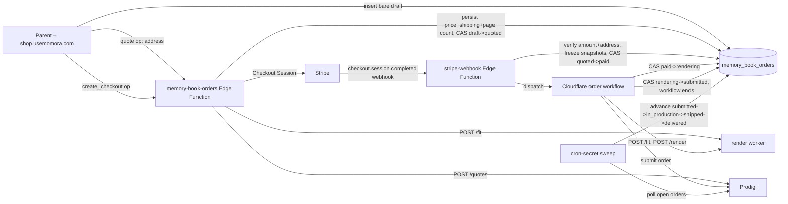

# Feature: Memory Book orders & fulfillment (V5c)

**Status:** `schema-only` — the `memory_book_orders` table and its RLS
contract are shipped (this doc). The `memory-book-orders`/`stripe-webhook`
Edge Functions, the Cloudflare order workflow, the render worker
(`render/memory-book-renderer/`), and the web checkout UI
(`shop.usemomora.com`) are **not built yet** — everything below that
describes "who writes what" is the *contract* those changes must satisfy,
not something you can call today. Check
[plans/memory-book-5c-checkout-fulfillment.md](../../plans/memory-book-5c-checkout-fulfillment.md)
for the full hardened plan (Design Decisions 1-6, steps 1-7) before
implementing any of the wave-2 pieces this doc describes.
**Last updated:** 2026-09-08
**PRD reference:** none yet — canonical product doc is
[docs/plans/memory-book.md](../plans/memory-book.md) §"V5 scope" 5c, plus
this feature's own plan file above (§Design decisions, §8 data-model
sketch).

## Overview

A Memory Book order is a parent's purchase of a `ready` Memory Book
(`memory_books`, see
[memory-book-generation.md](./memory-book-generation.md)) as a printed,
shipped book. Ordering, quoting, paying (Stripe), rendering print-exact
PDFs, and submitting to Prodigi for fulfillment are all separate concerns
from generating and editing the book itself — this doc and the
`memory_book_orders` table are where they live. One row per purchase
**attempt**: a family can order the same book more than once (gifting,
reorders — explicitly out of scope for the UI in this wave, but the
one-row-per-order shape doesn't preclude it), and each attempt gets its own
row, its own frozen snapshot, its own payment.

## User-facing behavior (not yet built)

Per the plan: "Order this book" from the book view (`shop.usemomora.com`)
→ an address form → a quote (our price + real shipping, computed against
Prodigi) → Stripe Checkout → a return URL order-status page that tracks the
order through production and shipping until delivery. No human in the loop
for the happy path (soft-launch exception below); every unhappy path alarms
the owner rather than silently stranding a paid order.

## Architecture (planned — not yet built)



None of `memory-book-orders`, `stripe-webhook`, the order workflow, or the
render worker exist yet. This diagram is the target shape from the plan's
Design Decision 4, recorded here so wave-2 implementers build against the
same picture rather than re-deriving it.

## Data model

| Table | Role |
|---|---|
| `memory_book_orders` | One row per purchase attempt: frozen snapshot of what was paid for, price/shipping quote, Stripe + Prodigi identifiers, the order's state machine, and CAS identity/recovery clocks for the (short-lived) order workflow. |

Full column list and constraints:
[TECH_SPEC §2.1f](../TECH_SPEC.md#21f-memory-book-orders--fulfillment-v5c).

### State machine

```
draft → quoted → paid → rendering → submitted → in_production → shipped → delivered
                                  ↘ failed (from any post-payment step)
        ↘ cancelled (abandoned/expired checkout, pre-payment only)
```

| Status | Meaning | Who sets it | Snapshot required? |
|---|---|---|---|
| `draft` | App has created a bare order shell for a `ready` book. No quote, no payment. | App (insert — the only status a client insert may claim; RLS pins every other field to null, see below). | No |
| `quoted` | `price_cents`, `quoted_page_count`, `shipping_address`, `shipping_method`, `shipping_cost_cents` are all persisted together. | `memory-book-orders`' `quote` op (service-role): calls the render worker's `POST /fit` against the book's CURRENT (not yet frozen) inputs for the page count, then Prodigi's `POST /v4.0/quotes` for shipping, computes our price, and persists the whole bundle in one write. | No |
| `paid` | Stripe payment succeeded. `book_document_snapshot`/`edits_snapshot` are frozen (see [Freeze semantics](#freeze-semantics)); `stripe_payment_intent_id` set. | `stripe-webhook`'s `checkout.session.completed` handler (service-role CAS `quoted → paid`), only after verifying `amount_total` matches the persisted quote and the session's shipping address matches the quoted one (round-3 defense in depth on the money path). | **Yes** |
| `rendering` | The order workflow has been dispatched. `workflow_instance_id`, `workflow_attempt_id`, `workflow_started_at` set. | The webhook's dispatch of the Cloudflare order workflow, via a service-role CAS `paid → rendering` (mirrors `memory_books`' dispatcher CAS — see [memory-book-generation.md](./memory-book-generation.md#status-machine)). | Yes |
| `submitted` | PDFs rendered, verified, and the Prodigi order placed (`prodigi_order_id` set). `workflow_completed_at` set — **this is where the order workflow ends** (Decision 4: short-lived, no multi-day sleeping instances). | The order workflow's final step, service-role CAS `rendering → submitted`, same attempt-id discipline as the generation pipeline's publish. | Yes |
| `in_production` / `shipped` / `delivered` | Prodigi's own fulfillment states, mirrored in ours. `shipped` sends a tracking email. | The post-submission tracking sweep (see [Sweep contract](#sweep-contract)) — never the order workflow, which has already ended by `submitted`. | Yes |
| `failed` | `failure_reason` populated. Reachable from `rendering`/`submitted`/any post-payment step whenever the workflow or the sweep hits an unrecoverable error. | The order workflow (a render/verify/submit failure) or the sweep (a Prodigi-side rejection surfaced via support email, not the API — see the plan's Prodigi-lessons context) — both service-role, both send the owner an alarm email (never strand a paid order). | Yes |
| `cancelled` | Abandoned checkout — the order never reached `paid`. | The `stripe-webhook`'s `checkout.session.expired` handler (a cron-driven sweep ages a `quoted` order whose Checkout Session expired). | No (pre-payment) |

`workflow_started_at`/`workflow_completed_at` are **dedicated recovery
clocks**, not `created_at`/`updated_at` — exactly like
`memory_books.generation_started_at`/`generation_completed_at`: an
unrelated future write must never extend or shorten the workflow's lease.
Recovery/redispatch thresholds for these clocks are a wave-2 (workflow)
decision, not fixed by this schema change.

### Freeze semantics

`book_document_snapshot` and `edits_snapshot` are frozen copies of
`memory_books.book_document` and `memory_book_edits.edits` taken at the
service-role CAS `quoted → paid` — **not** at `draft` or `quoted`. This
means a parent can keep editing their book (via `memory-book-edits`) right
up until they pay; only the state at the moment of payment is what gets
printed. After `paid`, further edits to the live book affect **future**
orders only — the paid order's snapshot never changes again. This is
Decision 6 in the plan, and the reason the table stores its own copies of
both JSON blobs rather than joining through `memory_books`/
`memory_book_edits` at render time: the print pipeline (render worker,
order workflow) must never read the live, possibly-since-edited book.

**Precondition the freeze must enforce (Decision 1, application-level, not
a DB constraint):** the webhook REFUSES to freeze a `book_document_snapshot`
whose manifest is missing the `originalFile` key on any asset — printing at
preview resolution would silently degrade a paid order. `memory_books`
rows generated before that field existed need a narrow, deterministic
backfill (DB lookup of `memory_media.object_key`, no regeneration) before
they can ever be frozen into an order; this schema does not encode that
precondition itself, since it's a property of `book_document`'s *content*,
not something a `jsonb is not null` check can express.

### Refund recording

`refunded_at` is set by `stripe-webhook`'s `charge.refunded` handler — it
exists so a refund issued out-of-band (e.g. manually from the Stripe
dashboard, not through any code path in this repo) still becomes visible
system state instead of leaving the order's `status` looking like nothing
happened. **`refunded_at` is deliberately independent of `status`**: there
is no `refunded` state in the machine above. A refunded order keeps
whatever status it was already in — a refund issued after the book shipped
leaves `status = 'shipped'` (or wherever the sweep has since moved it) with
`refunded_at` now set alongside it. Any UI or alerting that needs to know
"was this refunded" should check `refunded_at is not null`, not `status`.

### Sweep contract

Two sweeps consume this table, both cron-secret Edge Functions following
the existing `x-cron-secret` pattern
(`schedule-daily-reminders`,
[TECH_SPEC §4.7](../TECH_SPEC.md#47-schedule-daily-reminders)) — neither is
built yet, but the contract each must satisfy is fixed by this schema:

1. **Zero-dispatch reconciliation** (round-2 review, mirrors the
   gallery-import mark-before-dispatch pattern): periodically scans for any
   order sitting in `paid` with no live workflow instance past a grace
   window (i.e. `status = 'paid'` and `workflow_started_at` is null, or
   stale) and redispatches idempotently. A charged customer with no running
   workflow must be impossible to miss — this is the reconciliation half of
   the "never strand a paid order" invariant.
2. **Post-submission tracking**: polls Prodigi for every row with
   `status in ('submitted', 'in_production', 'shipped')` (the
   `memory_book_orders_active_status_idx` partial index —
   [TECH_SPEC §2.1f](../TECH_SPEC.md#21f-memory-book-orders--fulfillment-v5c)
   — exists specifically for this scan, plus dispatcher polling of `paid`/
   `rendering`), advances the status as Prodigi's own state changes, sends
   the tracking email on the `shipped` transition, and raises the "not
   `in_production` within N hours" / "stuck > X days" alarms the plan calls
   for. The plan notes Prodigi order webhooks were never investigated as an
   alternative to polling — a wave-2 implementer should check for those
   before building the sweep as pure polling.

Both sweeps write only via service-role, same as every other writer of this
table (see [RLS](#rls) below).

## RLS

**Deliberately NOT family-wide** — the single biggest way this table
differs from every other Memory Book table
(`memory_books`/`memory_book_edits`, both `is_family_member(family_id)`
SELECT). An order row carries the buyer's home address and Stripe payment
identifiers; a family-visible SELECT would let a grandparent viewer (or any
other family member who isn't the buyer) see exactly where the book is
being shipped and its payment identifiers just because they can see the
book itself. This was a round-3 plan-hardening finding, not the original
design.

- **`select`: `requested_by = auth.uid()`** — the buyer only. A
  family-visible *status-only* projection (e.g. "a book was ordered, no
  address/payment fields") is a plausible future addition if the product
  wants other family members to see order progress, but it is not built
  here — don't assume it exists.
- **`insert`**: `has_family_role(family_id, ['owner','manager'])` +
  `requested_by = auth.uid()` + a same-family check that `book_id` actually
  belongs to `family_id` (the recurring cross-family-FK lesson — see
  `memory_books`' own `child_id` check,
  [memory-book-generation.md](./memory-book-generation.md#rls)) + a
  with-check pinning the row to the **exact bare-draft shape**: `status =
  'draft'` and every other column null — both snapshots, price, quote
  (page count + shipping quote), the shipping **address** (yes, even though
  it's user-entered form data, not something the DB computes: it reaches
  the row only through the service-role `quote` op, so there is exactly one
  write path for it, matching every other quote-time field instead of a
  second, client-writable path), Stripe ids, Prodigi id, failure/refund
  bookkeeping, and every CAS/clock field. Mirrors `memory_books`' insert
  with-check line for line (round-2 review: a client must not be able to
  seed a draft with a favorable price that `create_checkout` would then
  trust).
- **No update or delete policy exists for `authenticated` at all**, and the
  table grants `authenticated` only `select, insert` — same "job is
  service-only" contract as `memory_books`/`memory_book_edits`
  ([memory-book-generation.md](./memory-book-generation.md#rls)). Every
  state transition — `quote`, `create_checkout`'s Stripe fields, the
  webhook's freeze + payment fields, the workflow's CAS steps, the sweeps'
  status advances, refund recording — happens only through a service-role
  Edge Function or the order-workflow bridge (all wave-2, not built here).
  `anon` has no grants at all.

## How the 5c workflow/functions will consume this table

This is the write-path contract wave-2 implementers (the Edge Functions,
the order workflow, and the web checkout UI — explicitly **not** built by
this change) must satisfy. Every write below is service-role; nothing here
is reachable from a client `UPDATE` (there isn't one).

1. **`memory-book-orders` Edge Function**, op `quote`: given `bookId` +
   `address`, call the render worker's `POST /fit` for the current page
   count, call Prodigi's `POST /v4.0/quotes` for shipping, compute the
   price, and `UPDATE ... SET status='quoted', price_cents=..., 
   quoted_page_count=..., shipping_address=..., shipping_method=...,
   shipping_cost_cents=... WHERE id = $1 AND status = 'draft'` (a
   compare-and-set on `status`, the same discipline
   `generate-memory-book` uses against `memory_books` — see
   [memory-book-generation.md](./memory-book-generation.md#status-machine)).
2. **`memory-book-orders` Edge Function**, op `create_checkout`: build a
   Stripe Checkout Session using the row's already-persisted price +
   shipping (never re-derive it from client input), with
   `shipping_address_collection` disabled and the quoted address pinned as
   the session's canonical shipping (round-3: otherwise Stripe Tax computes
   VAT against whatever address Checkout's own UI collects, which can
   diverge from the quoted/shipped one). Persists `stripe_session_id`.
3. **`stripe-webhook`** (`verify_jwt = false`, Stripe signature verified,
   event-id idempotent): on `checkout.session.completed`, verify
   `amount_total` against the row's `price_cents` (+ shipping) and the
   session's address against `shipping_address` (defense in depth on the
   money path — round-3), then in one transaction: freeze
   `book_document_snapshot`/`edits_snapshot` (refusing per the
   [Freeze semantics](#freeze-semantics) precondition), set
   `stripe_payment_intent_id`, CAS `quoted → paid`, and dispatch the order
   workflow. On `charge.refunded`, set `refunded_at` (no status change —
   see [Refund recording](#refund-recording)). On
   `checkout.session.expired`, CAS an abandoned `quoted` row to `cancelled`.
4. **Order workflow** (short-lived, ends at `submitted`): CAS `paid →
   rendering` with a fresh `workflow_attempt_id` + `workflow_started_at`,
   recompute page count + spine via the render worker's `/fit` on the
   FROZEN snapshot (alarming if it diverges from `quoted_page_count` —
   round-3: an untrusted client-supplied count was the original risk this
   guards against), render via `/render`, verify the output, presign
   7-day Prodigi-fetch URLs, submit the Prodigi order
   (`prodigi_order_id`), then CAS `rendering → submitted` with
   `workflow_completed_at` set — and stop. Any failure at any step: CAS to
   `failed` with `failure_reason` + an owner alarm email (never a silent
   drop of a paid order).
5. **Post-submission sweep**: see [Sweep contract](#sweep-contract) above.

## Client integration

Not built. The eventual client (`shop.usemomora.com`, a route inside
`book-renderer/src/web/` per the plan's routing correction — see
[memory-book-generation.md](./memory-book-generation.md#client-integration)
for the sibling web-app precedent) will: insert a bare `memory_book_orders`
draft (`book_id`, `family_id`, `requested_by` only — every other field
null per the RLS with-check), call `quote` with the address it collected,
display the returned price/shipping, call `create_checkout`, redirect to
Stripe, and land back on `/order/<id>` to poll `select`-visible status
(RLS already restricts this to the buyer, so no separate authorization
check is needed client-side beyond "am I logged in as the buyer").

## Extension guide

**Safe to extend**

- Add a family-visible status-only view/RPC if the product wants other
  family members to see "a book was ordered" without the address/payment
  fields — do this as a `security definer` function or a narrow view, not
  by loosening the base table's `select` policy (which would put the PII
  fields right back in scope).
- Add columns the wave-2 Edge Functions discover they need (e.g. a
  `tracking_url`/`carrier` pair once the sweep is built) via a new
  migration; keep the "app inserts bare draft, service owns everything
  else" boundary intact.

**Do not change without updating this doc**

- The buyer-scoped (not family-scoped) `select` policy — this is the core
  privacy property this table has that no other Memory Book table does.
- The RLS insert with-check's null-locked field list — if a new
  server-computed column is added, it MUST be added to the with-check's
  null list too, or a client could seed it at draft time.
- `book_document_snapshot`/`edits_snapshot`'s freeze-at-`paid` contract —
  every consumer (render worker, order workflow) depends on these being
  immutable once set.
- `refunded_at`'s independence from `status` — do not repurpose it as a
  status value or assume `status` reflects refund state.

**Common extension patterns**

- Multi-copy orders / gifting / reorders (explicitly out of scope for the
  UI this wave — see the plan's Out of scope section) are NOT precluded by
  this schema's one-row-per-order shape; a future change can just insert
  more rows against the same `book_id`.
- Peecho / RPI-Heirloom editions, or a second print vendor entirely, would
  likely need a `fulfillment_vendor` column and vendor-specific id columns
  alongside (not instead of) `prodigi_order_id` — out of scope here (plan's
  Out of scope section).

## Constraints & gotchas

- **No memory content in logs anywhere in this pipeline** — same rule as
  every other AI/print pipeline in this repo.
  `book_document_snapshot`/`edits_snapshot` contain memory text/photo
  references; never log them.
- `currency` is hard-locked to `'usd'` by a CHECK constraint (owner
  decision 2026-09-08) — a future multi-currency change needs a migration
  that changes the constraint, not just application code that starts
  passing a different value.
- `price_cents`/`quoted_page_count` are required (`memory_book_orders_
  quoted_has_price`) for every status past `draft` — a service-role write
  that tries to CAS a bare draft straight to `quoted`/`paid` without going
  through the `quote` op's persistence will be rejected by this constraint,
  not just by convention.
- `book_document_snapshot`/`edits_snapshot` are required
  (`memory_book_orders_paid_has_snapshot`) for every status from `paid`
  through `failed` — `cancelled` is the one non-`draft` status exempt,
  since it's reachable pre-payment (an abandoned `quoted` order).
- `book_id` is `on delete restrict`, not `cascade` — there is currently no
  book-deletion path in the product at all, but if one is ever added, it
  must handle (or explicitly refuse) books with existing orders rather
  than relying on cascade to make the problem disappear.
- This table has no column for "which render attempt produced these
  specific PDFs" beyond `workflow_attempt_id` — if the render worker's own
  per-attempt R2 prefix (`print-orders/<orderId>/`, per the render worker's
  own design) ever needs to be reconstructed independently of the workflow
  logs, `id` (the order id) is the input, not `workflow_attempt_id`.

## Dependencies

- Depends on: `families`, `family_memberships` (`has_family_role`),
  `memory_books` (`book_id` FK, and the source of `book_document_snapshot`
  before it's frozen), `memory_book_edits` (source of `edits_snapshot`
  before it's frozen) — see
  [memory-book-generation.md](./memory-book-generation.md) for both.
- Used by (all wave-2, not built): `memory-book-orders` Edge Function
  (`quote`/`create_checkout`), `stripe-webhook` Edge Function, the
  Cloudflare order workflow, the render worker
  (`render/memory-book-renderer/`), the post-submission tracking sweep, and
  the web checkout UI (`shop.usemomora.com`).

## Testing

### Migration verification (schema/RLS)

Verified manually against a local Postgres with the full migration history
applied (`supabase db reset --local`, ports temporarily shifted in
`supabase/config.toml` to avoid a locally-running unrelated project on the
default ports, then reverted — same workaround prior Memory Book migrations
used):

- As the buyer (`requested_by`), `select` on their own order returns it.
- As a **different member of the same family** (not the buyer — the exact
  round-3 finding this RLS shape exists to close), the same row is
  invisible: `select` returns zero rows.
- As an owner of a **different family** entirely, also zero rows.
- A bare-draft insert (`book_id`, `family_id`, `requested_by` only, as the
  family's owner) succeeds with `status = 'draft'` and every other column
  null.
- An insert pre-seeding a server-computed field is rejected by RLS (`new
  row violates row-level security policy`) — confirmed distinctly for
  `price_cents` and for `status = 'paid'`.
- An insert whose `book_id` belongs to a different family than the claimed
  `family_id` (the cross-family-FK hazard) is rejected by RLS.
- An insert by a `viewer`-role family member (not owner/manager) is
  rejected by RLS.
- A client `update`/`delete` of an existing row is rejected at the **grant
  level** (`permission denied for table memory_book_orders`, not just
  RLS — confirmed distinctly for each statement), and `anon` `select` is
  rejected at the grant level too.
- Constraint sanity: a service-role `UPDATE` that CASes a row to `paid`
  without first setting both snapshot columns is rejected by
  `memory_book_orders_paid_has_snapshot`; the same CAS with both snapshots
  present succeeds.

`src/types/database.ts` was regenerated in the same change
(`supabase gen types typescript --local`) and hand-merged (only the new
`memory_book_orders` table block added, alphabetically between
`memory_book_edits` and `memory_books`).

### Not yet covered

No Deno/Edge Function tests exist yet (there is no Edge Function to test).
No pgTAP suite for this table (matches the precedent set by
`memory_books`/`memory_book_edits` — both verified manually, not via
pgTAP). A wave-2 change adding the Edge Functions/workflow should add Deno
tests for those, following the pattern documented in
[memory-book-generation.md](./memory-book-generation.md#testing).

### Run this feature's tests

```bash
npm run db:reset   # applies migrations (incl. this one) against local Postgres
npm test           # src/types/database.ts is exercised transitively across the suite
npm run typecheck  # tsc --noEmit
```

## Changelog

| Date | Change |
|------|--------|
| 2026-09-08 | `memory_book_orders` schema + RLS shipped (plan step 4): buyer-scoped SELECT (not family-wide — round-3 finding), draft-only INSERT with every server-computed field null-locked, no client UPDATE/DELETE. `src/types/database.ts` hand-merged, `TECH_SPEC.md` §2.1f added, this feature doc created. Edge Functions, order workflow, render worker, and web checkout UI are separate, not-yet-shipped changes (plan steps 1-3, 5-7). |
