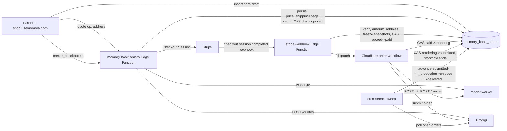

# Feature: Memory Book orders & fulfillment (V5c)

**Status:** `checkout-ui-built`, plus a follow-up order-status UX round
(this change) — the `memory_book_orders` schema/RLS (wave-1), the
`memory-book-orders` / `stripe-webhook` / `workflow-memory-book-order-bridge`
/ `sweep-memory-book-orders` Edge Functions plus the Cloudflare order
workflow (`cloudflare/memory-book-order-worker/`, wave-2, plan step 5), the
`shop.usemomora.com` web checkout UI itself (`book-renderer/src/web/order/`,
wave-3, plan step 6), and now a paid→delivered progress stepper, a "Your
orders" history screen, carrier tracking (schema + sweep extraction + UI),
and an always-visible support exit hatch (this change, see "Implementation
(order-status UX round)" below) are all shipped. 5c itself has since gone
live and run a real order end to end via the canary (see the
`memory-book 5c: ...` commits after wave-3) — this change's own interactive
verification is still the DEV-only fixture-mode walkthrough (no real
Stripe/Prodigi calls), same posture every prior wave in this doc used. The
render worker box in the architecture diagram below is stood up as of the
canary. See "Implementation (wave-2)"/"(wave-3)"/"(order-status UX round)"
below for the op/state contract and UI as actually built, and
[plans/memory-book-5c-checkout-fulfillment.md](../../plans/memory-book-5c-checkout-fulfillment.md)
for the full hardened plan (Design Decisions 1-6, steps 1-7).
**Last updated:** 2026-09-09
**PRD reference:** none yet — canonical product doc is
[docs/plans/memory-book.md](../plans/memory-book.md) §"V5 scope" 5c, plus
this feature's own plan file above (§Design decisions, §8 data-model
sketch).

## Overview

A Memory Book order is a parent's purchase of a `ready` Memory Book
(`memory_books`, see
[memory-book-generation.md](./memory-book-generation.md)) as a printed,
shipped book. Ordering, quoting, paying (Stripe), rendering print-exact
PDFs, and submitting to Prodigi for fulfillment are all separate concerns
from generating and editing the book itself — this doc and the
`memory_book_orders` table are where they live. One row per purchase
**attempt**: a family can order the same book more than once (gifting,
reorders — explicitly out of scope for the UI in this wave, but the
one-row-per-order shape doesn't preclude it), and each attempt gets its own
row, its own frozen snapshot, its own payment.

## User-facing behavior

Per the plan, now built (wave-3): "Order this book" from the book view
(`shop.usemomora.com`, `book-renderer/src/web/book/BookViewScreen.tsx`)
→ an address form (`order/AddressForm.tsx`) → a quote (our price + real
shipping, computed against Prodigi, `order/CheckoutScreen.tsx`) → Stripe
Checkout → a return URL order-status page (`order/OrderStatusScreen.tsx`)
that tracks the order through production and shipping until delivery. No
human in the loop for the happy path (soft-launch exception below); every
unhappy path alarms the owner rather than silently stranding a paid order.
"Built" here means the UI itself, wired against the real
`memory-book-orders` Edge Function contract.

**Order-status UX round (this change), once the order is placed:**

- `OrderStatusScreen` shows a linear **paid → delivered progress stepper**
  (`order/OrderProgressStepper.tsx`) for every non-terminal-in-the-good-way
  status from `paid` through `delivered` — completed steps checked, the
  current step subtly pulsing, task-specified time hints ("about 10
  minutes" while rendering, "4–6 days" while in production), and a carrier
  line ("Shipped via DPD") once tracking exists. `failed`/`cancelled`, and
  any order with `refunded_at` set (regardless of its underlying status),
  render the screen's EXISTING full-width chip + message instead of a
  half-filled bar — see `order/orderProgressSteps.ts#showsProgressStepper`.
- A **"Your orders" history** at `/orders` (`order/OrdersListScreen.tsx` +
  `order/useOrders.ts`) lists every order the signed-in buyer has ever
  placed (RLS-scoped the same way `OrderStatusScreen` already is — see
  [RLS](#rls)), joined against `memory_books` for a book title, newest
  first, tap-through to `/order/<id>`. Reached from a quiet "Your orders"
  link in `BookListScreen`'s header (always visible) and from
  `BookViewScreen` next to "Order this book" (only once
  `order/useHasPastOrders.ts` confirms the buyer has at least one).
- **Carrier tracking**: once the sweep sees `shipped`, it persists
  `tracking_number`/`tracking_url`/`carrier` (new columns, see
  [Data model](#data-model) below) and `OrderStatusScreen` shows a
  prominent "Track your package" button (or a plain tracking number if
  Prodigi supplied no URL).
- An always-visible **exit hatch**: "Questions about your order? Just
  reply to your confirmation email." — small print at the bottom of
  `OrderStatusScreen`, shown regardless of status.

## Architecture



`memory-book-orders`, `stripe-webhook`, `workflow-memory-book-order-bridge`,
`sweep-memory-book-orders`, and the Cloudflare order workflow
(`cloudflare/memory-book-order-worker/`) are now built (this diagram's
shape, as shipped), and `U` above (the web checkout UI) is now built too
(wave-3) — the render worker (`RW` above) is the one box in this diagram
still tracked separately (plan step 3), which is why a REAL order still
cannot complete end to end even though every other box exists.

## Implementation (wave-2, this change)

**Edge Functions** (`supabase/functions/`):

- `memory-book-orders/index.ts` — ops `create_draft` (owner/manager, bare
  draft row for a `ready` book), `quote` (address in; backfills
  `originalFile` onto the book's CURRENT `book_document` if it predates the
  field via `_shared/memory-book-backfill.ts` and persists the patch back to
  `memory_books`; calls the render worker's `POST /fit` via
  `_shared/render-worker-client.ts` — an HMAC client mirroring
  `generate-memory-book/index.ts`'s dispatch signing — for THE page count;
  calls Prodigi's `POST /v4.0/quotes` via `_shared/prodigi.ts` for shipping;
  computes the total from `PRICE_USD_CENTS`; CAS `draft -> quoted`),
  `create_checkout` (Stripe Checkout Session via `_shared/stripe.ts`'s
  plain-`fetch` REST client; `shipping_address_collection` omitted
  entirely — Stripe only collects an address when that param is explicitly
  set, so omission IS "disabled"; the quoted address is pinned via a
  fresh Stripe Customer so `automatic_tax` computes VAT against the real
  destination; does **not** change `status` — see the state-machine note
  below), `status` (buyer-scoped convenience read).
- `stripe-webhook/index.ts` (`verify_jwt = false`; Stripe signature verified
  via `_shared/stripe.ts#verifyStripeSignature`, a WebCrypto
  reimplementation of Stripe's documented HMAC scheme — no `stripe` SDK
  dependency): `checkout.session.completed` verifies `amount_subtotal`
  against the persisted quote and the session's address against the quoted
  one (best-effort line1/postal/country match), re-runs the `originalFile`
  backfill and REFUSES to freeze (CAS `quoted -> failed`,
  `ORIGINAL_FILE_UNRESOLVED`) if anything is still unresolved, otherwise
  freezes both snapshots and CASes `quoted -> paid` then, mark-before-
  dispatch, `paid -> rendering` before calling the Cloudflare Worker's
  signed `/dispatch`; `charge.refunded` sets `refunded_at`;
  `checkout.session.expired` CASes `quoted -> cancelled`. **Event-id
  idempotency is CAS-based, not a ledger table** — see the file's header
  comment for the reasoning (mirrors `workflow-memory-book-bridge`'s own
  documented nonce-ledger deviation).
- `workflow-memory-book-order-bridge/index.ts` (`verify_jwt = false`, HMAC
  bridge for the Cloudflare order workflow, mirroring
  `workflow-memory-book-bridge`): ops `load_order` (gated on
  `status = 'rendering'` AND `workflow_attempt_id` match),
  `verify_and_presign_output` (HEADs the render worker's uploaded PDFs in
  R2 and presigns 7-day GET URLs — this bridge is the only piece of the
  whole pipeline with R2 credentials), `mark_submitted` / `mark_failed`
  (terminal CAS steps), `send_order_email` (paid-confirmation to the buyer,
  owner spot-check alarm with PDF links — kept server-side so Bento
  credentials and the buyer's email never need to reach the Worker).
- `sweep-memory-book-orders/index.ts` (`verify_jwt = false`, cron-secret):
  zero-dispatch reconciliation (`paid` with no fresh `workflow_started_at`,
  or stale `rendering`, redispatched — the stale-`rendering` case reuses
  the EXISTING `workflow_instance_id`, which the Worker's `/dispatch`
  already treats as an idempotent 202 on a duplicate id), post-submission
  Prodigi polling (`submitted -> in_production -> shipped`, tracking email
  on `shipped`), the "not in_production within 4h" / "stuck > 10 days"
  alarms, and a 48h backstop that ages an abandoned `quoted` order to
  `cancelled` (Stripe's own `checkout.session.expired` should handle this
  reactively; this is a safety net for a lost webhook delivery). **Does
  NOT advance to `delivered`** — Prodigi's Orders API reports
  fulfillment/shipment stage, not carrier delivery confirmation, and no
  carrier-tracking integration exists in this repo; a future change would
  need one to close that last transition.
- **Prodigi order webhook/callback check** (explicitly asked for, not to be
  built on spec alone): `docs/plans/prodigi-order-spec.md` — the canonical
  previously-researched reference in this repo — documents Orders/Quotes/
  spine and the dashboard "Order edit window" in detail but contains NO
  mention of a webhook/callback facility anywhere. This sweep is therefore
  pure polling. Re-check Prodigi's live API reference
  (https://www.prodigi.com/print-api/docs/reference/) for a "Webhooks"/
  "Callbacks" section before the real canary (plan step 7) — if one is
  real, demote this sweep to reconciliation-only behind it, per the plan's
  own instruction.

**State machine, exactly where each transition lands** (per the table
below, unchanged from the schema doc — recorded here to answer the task's
"decide and document whether quote/quoted status transition happens at
quote or checkout" note): `quote` sets `status = 'quoted'`.
`create_checkout` does **not** change `status` at all (only persists
`stripe_session_id`) — the row stays `quoted` for the whole lifetime of a
Checkout Session, including an abandoned/retried one, and only
`stripe-webhook`'s `checkout.session.completed` handler CASes
`quoted -> paid`. This was already the schema doc's documented contract;
this change implements it as specified rather than deviating.

**Cloudflare order workflow** (`cloudflare/memory-book-order-worker/`,
mirrors `memory-book-worker`'s dispatcher/bridge/CAS architecture exactly):
`src/index.ts` (HMAC-verified `/dispatch`, idempotent by attempt id),
`src/workflow.ts` (`MemoryBookOrderWorkflow`: load order → re-fit the
FROZEN snapshot, alarming — never failing — on divergence from the quoted
count, then using the FRESH count for spine/print/submission → Prodigi
spine width → render worker `/render` dispatched then polled via
`GET /status/<attemptId>` in short steps with `step.sleep` between polls →
page-count sanity check against the render output → verify+presign via the
bridge → submit to Prodigi → CAS `rendering -> submitted` → paid-
confirmation + owner spot-check emails → done). Any failure at any step:
CAS to `failed` with a closed reason code + a best-effort owner alarm
email. Deliberately holds **no R2 credentials and no Supabase service-role
credentials** (blast-radius control: it DOES hold the Prodigi key, which
can place real orders) — every DB/R2 operation goes through the signed
bridge.

**Secrets** (documented here for the owner; never committed — see
`.dev.vars.example` in each package for the full list of names):

| Secret | Used by |
|---|---|
| `STRIPE_SECRET_KEY` | `memory-book-orders` (Checkout Session creation) |
| `STRIPE_WEBHOOK_SECRET` | `stripe-webhook` (signature verification) |
| `PRICE_USD_CENTS` | `memory-book-orders` (our flat price; owner sets once the physical sample is priced) |
| `MEMORY_BOOK_RENDER_WORKER_URL` / `MEMORY_BOOK_RENDER_WORKER_HMAC_SECRET` | `memory-book-orders` (quote-time `/fit` call) |
| `RENDER_WORKER_URL` / `RENDER_WORKER_HMAC_SECRET` | the Cloudflare order workflow (paid-time `/fit`, `/render`, `/status` — same shared secret VALUE as the pair above, different env var names per runtime) |
| `PRODIGI_API_KEY` | both `memory-book-orders` (quote) and the Cloudflare order workflow (spine + order submission) and `sweep-memory-book-orders` (status polling) |
| `PRODIGI_API_BASE_URL` | defaults to the sandbox (`api.sandbox.prodigi.com`) everywhere — flip to production only at the real canary |
| `CLOUDFLARE_MEMORY_BOOK_ORDER_WORKFLOW_URL` / `CLOUDFLARE_MEMORY_BOOK_ORDER_DISPATCH_SECRET` | `stripe-webhook` and `sweep-memory-book-orders` (dispatch/redispatch) |
| `CLOUDFLARE_MEMORY_BOOK_ORDER_BRIDGE_SECRET` | `workflow-memory-book-order-bridge` (verifies the Worker's signed calls) |
| `MEMORY_BOOK_CHECKOUT_ORIGIN` | `memory-book-orders` (Stripe success/cancel return URLs) |
| `MEMORY_BOOK_ORDER_ALERT_EMAIL` | all three (owner alarm recipient; defaults to `hello@usemomora.com`) |

**Deviations from the plan/schema doc worth flagging:**

- Event-id idempotency for the Stripe webhook is CAS-based, not a
  dedicated ledger table (see above) — a documented, intentional trade,
  not an oversight.
- The sweep does not advance orders to `delivered` (see above).
- Prodigi request field names (`attributes.pageCount` on the quote,
  `printArea: 'cover'` for the wraparound cover asset) are BEST-EFFORT
  inferences from `docs/plans/prodigi-order-spec.md`'s own documented open
  questions, not independently confirmed against a live Prodigi response —
  every call in this change's test suite is mocked; the real-order canary
  (plan step 7) is the actual confirmation point, same as that doc already
  flags for the render pipeline's own SKU/spine values.

## Implementation (wave-3, this change)

The `shop.usemomora.com` web checkout UI (plan step 6), entirely inside
`book-renderer/src/web/`:

- **Router** (`web/router.ts`): adds `/order/<id>` alongside the existing
  `/`/`/b/<id>` routes (the plan's routing correction — the hosting Worker
  already serves deep paths in place; the real gap was this router only
  knowing two screens). `navigate()` now re-derives the route from
  `window.location.pathname` AFTER `pushState` rather than parsing its raw
  `path` argument directly — needed once a path could carry a query string
  (fixture mode's own `?fixture=<slug>`, see below), since the route
  patterns are anchored with `$` and would otherwise fail to match.
- **"Order this book" entry** (`web/book/BookViewScreen.tsx`): a header CTA,
  visible only when `data.canEdit` (owner/manager — mirrors
  `memory-book-orders`' own `create_draft` role check, so a viewer-role
  family member never sees a button that would just 403). Opens
  `CheckoutScreen` as a full-takeover screen (not a route of its own — the
  plan's only new route is `/order/<id>`, Stripe's own return target).
  `?checkout=cancelled` (Stripe's `cancel_url`) shows a one-time dismissible
  "you weren't charged" notice, scrubbed from the URL via `replaceState`.
- **`order/ordersApi.ts`**: thin client for `memory-book-orders`'
  `create_draft`/`quote`/`create_checkout` ops, mirroring
  `edits/editsApi.ts`'s shape exactly (JWT via `supabase.functions.invoke`,
  same `FunctionsHttpError` body-unwrap for real error messages).
- **`order/CheckoutScreen.tsx` + `order/AddressForm.tsx`**: address
  (`SHIPS_TO_COUNTRIES` in `order/shippingCountries.ts` — see that file's
  own header comment: `prodigi-order-spec.md` has NO enumerated shipsTo list
  to hardcode from, so this is a curated, explicitly-flagged-as-unconfirmed
  constants file, not a documented Prodigi fact) → quote (price + shipping +
  "tax calculated at checkout" note, USD) → "Continue to payment", which
  either redirects to Stripe's real `checkoutUrl` or (fixture mode only)
  navigates straight to `/order/<id>` since fixture mode's mocked
  `create_checkout` already jumped the order to `paid`. Every step repeats
  Decision 6's edits-freeze notice. Keyboard-safe per the repo rule:
  `100dvh` wrapper, 16px+ input font (iOS Safari zoom guard), submit button
  in normal document flow (never `position: fixed`).
- **`order/OrderStatusScreen.tsx` + `order/useOrderStatus.ts`**: reads via a
  DIRECT `memory_book_orders` SELECT (RLS already scopes it to the buyer),
  not the Edge Function's `status` op — the op's response omits `book_id`,
  which this screen needs for its "back to your book" link, and the
  function's own header comment already calls that op "a convenience...RLS
  select already covers this." Polls every 5s while the order is
  non-terminal (`order/orderStatusCopy.ts#isTerminalOrderStatus` —
  `delivered`/`failed`/`cancelled` only; `refunded_at` never re-arms polling
  since it's independent of `status`). Per-status copy includes the task's
  exact required `failed` wording and deliberately never invents tracking
  copy for `shipped` — the schema has no tracking column yet (see the sweep
  contract above).
- **Fixture-mode mocks** (`web/dev/fixture.ts`, extended): every order op
  (`fixtureCreateOrderDraft`/`fixtureQuoteOrder`/`fixtureCreateCheckout`)
  plus a "state switcher" (`fixtureSetOrderStatus`,
  `fixtureOrderJumpStates()` — all ten statuses) and a refund toggle
  (`fixtureToggleOrderRefunded`), rendered as a DEV-only control panel on
  `OrderStatusScreen` (visually distinct — dashed border — so it never reads
  as real product UI). Backed by an in-memory store (mirrors the existing
  edits-store pattern; also what makes it unit-testable under vitest's
  `environment: 'node'`, which has no `window`), best-effort mirrored to
  `sessionStorage`. `create_checkout`'s mock has NO `checkoutUrl` (no real
  Stripe session exists) — "pay" jumps straight to a paid order, per the
  task brief exactly. `check-web-bundle.mjs`'s existing fixture-string scan
  covers this extension with no changes needed (same `import.meta.env.DEV`
  gating discipline every call site already follows) — verified: the
  production `build:web` output contains zero occurrences of "fixture".
- **Tests**: `order/__tests__/orderStatusCopy.test.ts` (all ten statuses
  have copy; exact `failed` wording; no `shipped` tracking claim),
  `shippingCountries.test.ts` (shape/uniqueness), `fixtureOrders.test.ts`
  (the full draft→quote→pay→state-switcher→refund lifecycle against the
  in-memory fixture store, under Node).
- **Interactive verification**: `npx vite dev --config vite.web.config.ts
  --port 5199` (or the `book-web` `.claude/launch.json` entry) +
  `http://localhost:5199/web.html?fixture=enzo-year-one` — full mock
  checkout (address → quote → pay), all ten `OrderStatusScreen` states via
  the jump switcher, the refund toggle, the `checkout=cancelled` notice, and
  mobile-viewport (375×812) keyboard-safety (the whole address form +
  submit button fits above the fold with no fixed-position elements to be
  covered by an on-screen keyboard).

**Bug found and fixed during this change, not present before it:**
`useRouter`'s `navigate(path)` originally re-derived the route from its raw
`path` argument. Fixture-mode in-app navigation needs to append
`?fixture=<slug>` to every target path (`App.tsx`'s `navigateInFixture`) so
`getFixtureSlug()` — which every fixture-aware hook/API call re-reads fresh,
not just once at mount — keeps finding it after a client-side route change.
That surfaced the anchored-regex bug: `BOOK_PATH_PATTERN`/
`ORDER_PATH_PATTERN` end in `$`, so a path carrying a trailing `?query`
never matched and every such navigation silently fell back to `{screen:
'list'}`. Fixed by having `navigate()` read `window.location.pathname`
(the browser's own post-`pushState` parse, which is already query-string
-free) instead of the raw argument — see `router.ts`'s own comment.

## Implementation (order-status UX round, this change)

Approved follow-up round on top of the shipped wave-3 checkout UI, adding
four items: a progress stepper, a "Your orders" history screen, carrier
tracking (schema + sweep + UI), and a support exit hatch. All inside
`book-renderer/src/web/order/` (client) and
`supabase/functions/sweep-memory-book-orders/` (backend), plus one new
migration.

- **Migration** `20260909130000_memory_book_order_tracking.sql`: adds
  `tracking_number`/`tracking_url`/`carrier` (all nullable) to
  `memory_book_orders`, and extends (via `alter policy ... with check`,
  not a drop/recreate) the existing bare-draft insert with-check to
  null-lock all three — mirrors every other post-draft field's null-lock.
  Verified against a local reset (`supabase db reset --local`, ports
  temporarily shifted the same way prior Memory Book migrations document,
  then reverted): the migration applies cleanly on top of the full history,
  and a client insert pre-seeding `tracking_number` or `carrier` is
  rejected by RLS (`insufficient_privilege`) while a bare draft still
  succeeds. `src/types/database.ts` regenerated
  (`supabase gen types typescript --local`) and hand-merged (only the three
  new columns added, alphabetically, to `memory_book_orders`' `Row`/
  `Insert`/`Update`).
- **`order/orderProgressSteps.ts`** (new, pure): the six-step
  `paid → rendering → submitted → in_production → shipped → delivered`
  mapping — `showsProgressStepper(status, refundedAt)` decides stepper vs.
  the screen's existing full-width copy (`false` for `draft`/`quoted`/
  `failed`/`cancelled`, and for ANY status once `refunded_at` is set — the
  task's explicit "failed/cancelled/refunded... instead of the stepper"
  grouping), `currentProgressStepIndex`/`progressStepState` compute
  done/current/upcoming per step. Task-exact time hints ("about 10
  minutes" rendering, "4–6 days" in production); `delivered` renders every
  step `done` (nothing pulses once the book has arrived).
- **`order/OrderProgressStepper.tsx` + `.css`** (new): renders the six
  steps — checkmark for done, a subtly pulsing ring for current (CSS
  `@keyframes`, respects `prefers-reduced-motion`), a hollow dot for
  upcoming — with a `carrier` prop that, only while `shipped` is current,
  renders "Shipped via {carrier}" as that step's hint line (never a
  fabricated delivery ETA — Prodigi/carrier don't give us one). Horizontal
  row with connecting lines on desktop/tablet; collapses to a vertical list
  (markers connected top-to-bottom) under 520px so six steps never have to
  squeeze sideways on a phone.
- **`OrderStatusScreen.tsx`** (extended, not replaced): renders
  `OrderProgressStepper` right after the existing chip+message block when
  `showsProgressStepper` is true; renders a "Track your package" button
  when `tracking_url` is set, or a plain (non-clickable) "Tracking number:
  …" line when only `tracking_number` is set; and an always-visible small-
  print line — "Questions about your order? Just reply to your
  confirmation email." — regardless of status (the task's exit-hatch
  item). `useOrderStatus.ts`'s SELECT grew the three tracking columns.
- **`order/OrdersListScreen.tsx` + `.css` + `order/useOrders.ts`** (new):
  `/orders` (new `router.ts` pattern) lists the buyer's own orders —
  RLS-scoped the same way `useOrderStatus.ts` already is, no extra filter
  needed — joined against `memory_books` for a title (falls back to a
  generic "Memory Book" label if that embed comes back null, e.g. the
  buyer has since left the book's family), status chip (reusing
  `orderStatusCopy.ts` + `OrderStatusScreen.css`'s chip classes rather than
  redefining the tone→color mapping), date, total, "Refunded" badge, tap
  → `/order/<id>`. Empty state: "No orders yet — once you order a printed
  Memory Book, it'll show up here so you can track it." Polls every 5s
  (matches every other polling hook in this app) while any listed order is
  non-terminal.
- **`order/useHasPastOrders.ts`** (new): a cheap `limit(1)` existence
  check backing `BookViewScreen`'s "Your orders" link, which only renders
  next to "Order this book" once the buyer actually has a past order (item
  2's second entry point). `BookListScreen`'s header link is unconditional
  (no book-scoped context there to gate on, and the empty-state copy on
  `/orders` itself is honest either way).
- **`supabase/functions/sweep-memory-book-orders/index.ts`**: new exported
  `extractOrderTracking(shipments)` — defensively picks the first shipment
  carrying a `trackingNumber` out of `_shared/prodigi.ts`'s already-parsed
  shipments array; everything stays `null` if none do (never fabricated).
  Called on the `submitted`/`in_production → shipped` transition, persisted
  in the SAME update as the status CAS; also backfills onto an
  already-`shipped` order with `tracking_number is null`, the first later
  sweep pass Prodigi actually supplies one (without re-sending the shipped
  email — that only fires on the transition itself). The shipped email's
  tracking line now names the carrier when present
  ("Track your delivery via DPD: …" / "Tracking number (DPD): …").
- **Fixture-mode extensions** (`web/dev/fixture.ts`): `FixtureOrder` grew
  `trackingNumber`/`trackingUrl`/`carrier`, populated with plausible mock
  values by `fixtureSetOrderStatus` on `shipped`/`delivered` and cleared
  otherwise (interactive-only, `check-web-bundle.mjs`'s fixture-string scan
  still passes — verified, zero occurrences in the production `build:web`
  output). `registerFixtureBookLabel`/`fixtureBookLabel` (called from
  `loadFixtureBook`) give `fixtureListOrders()` a book title to attach to
  each mock order row, mirroring the real `useOrders.ts` join.
  `fixtureHasOrders()` backs `useHasPastOrders.ts`'s fixture branch.
- **Tests**: `order/__tests__/orderProgressSteps.test.ts` (new — step
  mapping, `showsProgressStepper` for every status × refunded combination,
  done/current/upcoming state transitions, the delivered-is-fully-done
  case); `orderStatusCopy.test.ts` (comment updated — tracking now exists
  as a column but is still never baked into this STATIC copy table, only
  into the dynamic stepper/CTA); `fixtureOrders.test.ts` (extended: tracking
  populated/cleared per status; new `fixtureListOrders`/`fixtureHasOrders`
  coverage); `supabase/functions/sweep-memory-book-orders/index.test.ts`
  (extended: five `extractOrderTracking` unit tests covering empty/no-
  number/number-only/full-shape/multiple-shipments shapes, plus sweep-level
  tests for persist-on-shipped, no-tracking-yet, and the shipped-order
  backfill path — all reading the stub DB back after the sweep runs to
  assert exactly what was persisted).
- **Interactive verification**: same dev server/fixture URL as wave-3 —
  full checkout walkthrough, then all ten `OrderStatusScreen` states via
  the jump switcher with the stepper/tracking CTA correct at each one
  (`paid` through `delivered` show the stepper with checkmarks advancing
  and the current step's hint/carrier line; `shipped`/`delivered` show
  "Track your package"; `failed`/`cancelled`/a refunded `shipped` order all
  fall back to the existing full-width copy, confirmed by toggling
  "Mark refunded" on a `shipped` order and watching the stepper disappear),
  the exit-hatch line always present, `/orders` listing every order for the
  fixture session (newest first, correct status chips/totals, tap-through
  to `/order/<id>` working), and 375×812 mobile viewport for both the
  stepper (collapses to a vertical list, everything above the fold) and
  `/orders` (cards stack cleanly).
- **Deviation found, not fixed (flagged as a follow-up task instead):**
  `CheckoutScreen.tsx`'s `create_draft` mount effect is not idempotent
  under React StrictMode's dev-only double-invoke (`main.tsx` wraps the
  app in `<StrictMode>`) — its `cancelled` flag only guards the `setStep`
  call, not the `createOrderDraft(bookId)` call itself, so one real
  "Order this book" click in the interactive fixture walkthrough left a
  stray extra `draft` order in the fixture store, visible for the first
  time now that `/orders` actually lists everything. DEV-only (StrictMode
  double-invoke does not happen in a production build), pre-existing in
  wave-3 code, and outside this round's four items — not fixed here.

## Data model

| Table | Role |
|---|---|
| `memory_book_orders` | One row per purchase attempt: frozen snapshot of what was paid for, price/shipping quote, Stripe + Prodigi identifiers, the order's state machine, and CAS identity/recovery clocks for the (short-lived) order workflow. |

Full column list and constraints:
[TECH_SPEC §2.1f](../TECH_SPEC.md#21f-memory-book-orders--fulfillment-v5c).

### State machine

```
draft → quoted → paid → rendering → submitted → in_production → shipped → delivered
                                  ↘ failed (from any post-payment step)
        ↘ cancelled (abandoned/expired checkout — pre-payment)
                                  ↘ cancelled (order cancelled AT Prodigi, mirrored by the sweep — from submitted/in_production only, never shipped)
```

| Status | Meaning | Who sets it | Snapshot required? |
|---|---|---|---|
| `draft` | App has created a bare order shell for a `ready` book. No quote, no payment. | App (insert — the only status a client insert may claim; RLS pins every other field to null, see below). | No |
| `quoted` | `price_cents`, `quoted_page_count`, `shipping_address`, `shipping_method`, `shipping_cost_cents` are all persisted together. | `memory-book-orders`' `quote` op (service-role): calls the render worker's `POST /fit` against the book's CURRENT (not yet frozen) inputs for the page count, then Prodigi's `POST /v4.0/quotes` for shipping, computes our price, and persists the whole bundle in one write. | No |
| `paid` | Stripe payment succeeded. `book_document_snapshot`/`edits_snapshot` are frozen (see [Freeze semantics](#freeze-semantics)); `stripe_payment_intent_id` set. | `stripe-webhook`'s `checkout.session.completed` handler (service-role CAS `quoted → paid`), only after verifying `amount_total` matches the persisted quote and the session's shipping address matches the quoted one (round-3 defense in depth on the money path). | **Yes** |
| `rendering` | The order workflow has been dispatched. `workflow_instance_id`, `workflow_attempt_id`, `workflow_started_at` set. | The webhook's dispatch of the Cloudflare order workflow, via a service-role CAS `paid → rendering` (mirrors `memory_books`' dispatcher CAS — see [memory-book-generation.md](./memory-book-generation.md#status-machine)). | Yes |
| `submitted` | PDFs rendered, verified, and the Prodigi order placed (`prodigi_order_id` set). `workflow_completed_at` set — **this is where the order workflow ends** (Decision 4: short-lived, no multi-day sleeping instances). | The order workflow's final step, service-role CAS `rendering → submitted`, same attempt-id discipline as the generation pipeline's publish. | Yes |
| `in_production` / `shipped` / `delivered` | Prodigi's own fulfillment states, mirrored in ours. `shipped` sends a tracking email and persists `tracking_number`/`tracking_url`/`carrier` (order-status UX round, item 3 — see [Sweep contract](#sweep-contract)). | The post-submission tracking sweep (see [Sweep contract](#sweep-contract)) — never the order workflow, which has already ended by `submitted`. | Yes |
| `failed` | `failure_reason` populated. Reachable from `rendering`/`submitted`/any post-payment step whenever the workflow or the sweep hits an unrecoverable error. | The order workflow (a render/verify/submit failure) or the sweep (a Prodigi-side rejection surfaced via support email, not the API — see the plan's Prodigi-lessons context) — both service-role, both send the owner an alarm email (never strand a paid order). | Yes |
| `cancelled` | Abandoned checkout (the order never reached `paid`) — OR the Prodigi order itself was cancelled after submission (owner cancels during Prodigi's edit window, or Prodigi rejects/cancels the order), mirrored onto the row by the sweep. | Pre-payment: the `stripe-webhook`'s `checkout.session.expired` handler / the sweep's quoted-order aging. Post-submission: the sweep's auto-cancel (Prodigi `Cancelled` stage → CAS to `cancelled` from `submitted`/`in_production` only — a `shipped` row is never regressed — plus a `CANCELLED_AT_PRODIGI` owner alert, since a paid order that will never ship needs a manual refund decision). | Pre-payment: no. Post-submission: yes (the row already carries one) |

`workflow_started_at`/`workflow_completed_at` are **dedicated recovery
clocks**, not `created_at`/`updated_at` — exactly like
`memory_books.generation_started_at`/`generation_completed_at`: an
unrelated future write must never extend or shorten the workflow's lease.
Recovery/redispatch thresholds for these clocks are a wave-2 (workflow)
decision, not fixed by this schema change.

### Freeze semantics

`book_document_snapshot` and `edits_snapshot` are frozen copies of
`memory_books.book_document` and `memory_book_edits.edits` taken at the
service-role CAS `quoted → paid` — **not** at `draft` or `quoted`. This
means a parent can keep editing their book (via `memory-book-edits`) right
up until they pay; only the state at the moment of payment is what gets
printed. After `paid`, further edits to the live book affect **future**
orders only — the paid order's snapshot never changes again. This is
Decision 6 in the plan, and the reason the table stores its own copies of
both JSON blobs rather than joining through `memory_books`/
`memory_book_edits` at render time: the print pipeline (render worker,
order workflow) must never read the live, possibly-since-edited book.

**Precondition the freeze must enforce (Decision 1, application-level, not
a DB constraint):** the webhook REFUSES to freeze a `book_document_snapshot`
whose manifest is missing the `originalFile` key on any asset — printing at
preview resolution would silently degrade a paid order. `memory_books`
rows generated before that field existed need a narrow, deterministic
backfill (DB lookup of `memory_media.object_key`, no regeneration) before
they can ever be frozen into an order; this schema does not encode that
precondition itself, since it's a property of `book_document`'s *content*,
not something a `jsonb is not null` check can express.

### Refund recording

`refunded_at` is set by `stripe-webhook`'s `charge.refunded` handler — it
exists so a refund issued out-of-band (e.g. manually from the Stripe
dashboard, not through any code path in this repo) still becomes visible
system state instead of leaving the order's `status` looking like nothing
happened. **`refunded_at` is deliberately independent of `status`**: there
is no `refunded` state in the machine above. A refunded order keeps
whatever status it was already in — a refund issued after the book shipped
leaves `status = 'shipped'` (or wherever the sweep has since moved it) with
`refunded_at` now set alongside it. Any UI or alerting that needs to know
"was this refunded" should check `refunded_at is not null`, not `status`.

### Sweep contract

One cron-secret Edge Function, `sweep-memory-book-orders`, consumes this
table (wave-2, built; scheduled every 10 minutes via pg_cron as of
migration `20260909100000_schedule_memory_book_orders_sweep.sql`), plus
`stripe-webhook`'s reactive handlers for the pre-payment side — the
contract each satisfies:

1. **Zero-dispatch reconciliation** (round-2 review, mirrors the
   gallery-import mark-before-dispatch pattern): periodically scans for any
   order sitting in `paid` with no live workflow instance past a grace
   window (i.e. `status = 'paid'` and `workflow_started_at` is null, or
   stale) and redispatches idempotently. A charged customer with no running
   workflow must be impossible to miss — this is the reconciliation half of
   the "never strand a paid order" invariant.
2. **Post-submission tracking**: polls Prodigi for every row with
   `status in ('submitted', 'in_production', 'shipped')` (the
   `memory_book_orders_active_status_idx` partial index —
   [TECH_SPEC §2.1f](../TECH_SPEC.md#21f-memory-book-orders--fulfillment-v5c)
   — exists specifically for this scan, plus dispatcher polling of `paid`/
   `rendering`), advances the status as Prodigi's own state changes, and
   raises the "not `in_production` within N hours" / "stuck > X days"
   alarms the plan calls for. Prodigi order webhooks were checked for
   (task item 4's explicit ask, documented in the sweep's own header
   comment) and found not to exist in `docs/plans/prodigi-order-spec.md`'s
   reference — this sweep is pure polling, as anticipated.
   - **Tracking extraction (order-status UX round, item 3):** on the
     `shipped` transition, `extractOrderTracking()`
     (`supabase/functions/sweep-memory-book-orders/index.ts`) defensively
     pulls the first shipment in Prodigi's `getProdigiOrderStatus()`
     response that actually carries a tracking number and persists
     `tracking_number`/`tracking_url`/`carrier` in the SAME update as the
     status CAS — absent fields stay null, never fabricated (Prodigi can
     report `shipped` before a tracking number exists). If an order is
     ALREADY `shipped` with no tracking persisted yet, the sweep backfills
     it the first later pass Prodigi actually supplies one, without
     re-sending the shipped email (that only fires on the `shipped`
     transition itself). The shipped email includes the tracking link (or
     a bare number) plus the carrier name when present.
   - **Auto-cancel (owner request, 2026-09-09):** a Prodigi `Cancelled`
     stage is checked BEFORE the stage-advance mapping and mirrors onto the
     row as a `cancelled` CAS — from `submitted`/`in_production` only
     (a `shipped` row is never regressed by a stale stage), with a
     `CANCELLED_AT_PRODIGI` owner alert email on the transition: a paid
     order that will never ship needs a manual refund decision. Reported as
     `track.autoCancelled` in the sweep's JSON result.

Both sweeps write only via service-role, same as every other writer of this
table (see [RLS](#rls) below).

## RLS

**Deliberately NOT family-wide** — the single biggest way this table
differs from every other Memory Book table
(`memory_books`/`memory_book_edits`, both `is_family_member(family_id)`
SELECT). An order row carries the buyer's home address and Stripe payment
identifiers; a family-visible SELECT would let a grandparent viewer (or any
other family member who isn't the buyer) see exactly where the book is
being shipped and its payment identifiers just because they can see the
book itself. This was a round-3 plan-hardening finding, not the original
design.

- **`select`: `requested_by = auth.uid()`** — the buyer only. A
  family-visible *status-only* projection (e.g. "a book was ordered, no
  address/payment fields") is a plausible future addition if the product
  wants other family members to see order progress, but it is not built
  here — don't assume it exists.
- **`insert`**: `has_family_role(family_id, ['owner','manager'])` +
  `requested_by = auth.uid()` + a same-family check that `book_id` actually
  belongs to `family_id` (the recurring cross-family-FK lesson — see
  `memory_books`' own `child_id` check,
  [memory-book-generation.md](./memory-book-generation.md#rls)) + a
  with-check pinning the row to the **exact bare-draft shape**: `status =
  'draft'` and every other column null — both snapshots, price, quote
  (page count + shipping quote), the shipping **address** (yes, even though
  it's user-entered form data, not something the DB computes: it reaches
  the row only through the service-role `quote` op, so there is exactly one
  write path for it, matching every other quote-time field instead of a
  second, client-writable path), Stripe ids, Prodigi id, failure/refund
  bookkeeping, **tracking** (`tracking_number`/`tracking_url`/`carrier` —
  added by migration `20260909130000_memory_book_order_tracking.sql`,
  order-status UX round item 3; the with-check was extended, not replaced,
  to null-lock these too), and every CAS/clock field. Mirrors
  `memory_books`' insert with-check line for line (round-2 review: a
  client must not be able to seed a draft with a favorable price that
  `create_checkout` would then trust).
- **No update or delete policy exists for `authenticated` at all**, and the
  table grants `authenticated` only `select, insert` — same "job is
  service-only" contract as `memory_books`/`memory_book_edits`
  ([memory-book-generation.md](./memory-book-generation.md#rls)). Every
  state transition — `quote`, `create_checkout`'s Stripe fields, the
  webhook's freeze + payment fields, the workflow's CAS steps, the sweeps'
  status advances, refund recording — happens only through a service-role
  Edge Function or the order-workflow bridge (all wave-2, not built here).
  `anon` has no grants at all.

## How the 5c workflow/functions will consume this table

This is the write-path contract wave-2 implementers (the Edge Functions,
the order workflow, and the web checkout UI — explicitly **not** built by
this change) must satisfy. Every write below is service-role; nothing here
is reachable from a client `UPDATE` (there isn't one).

1. **`memory-book-orders` Edge Function**, op `quote`: given `bookId` +
   `address`, call the render worker's `POST /fit` for the current page
   count, call Prodigi's `POST /v4.0/quotes` for shipping, compute the
   price, and `UPDATE ... SET status='quoted', price_cents=..., 
   quoted_page_count=..., shipping_address=..., shipping_method=...,
   shipping_cost_cents=... WHERE id = $1 AND status = 'draft'` (a
   compare-and-set on `status`, the same discipline
   `generate-memory-book` uses against `memory_books` — see
   [memory-book-generation.md](./memory-book-generation.md#status-machine)).
2. **`memory-book-orders` Edge Function**, op `create_checkout`: build a
   Stripe Checkout Session using the row's already-persisted price +
   shipping (never re-derive it from client input), with
   `shipping_address_collection` disabled and the quoted address pinned as
   the session's canonical shipping (round-3: otherwise Stripe Tax computes
   VAT against whatever address Checkout's own UI collects, which can
   diverge from the quoted/shipped one). Persists `stripe_session_id`.
3. **`stripe-webhook`** (`verify_jwt = false`, Stripe signature verified,
   event-id idempotent): on `checkout.session.completed`, verify
   `amount_total` against the row's `price_cents` (+ shipping) and the
   session's address against `shipping_address` (defense in depth on the
   money path — round-3), then in one transaction: freeze
   `book_document_snapshot`/`edits_snapshot` (refusing per the
   [Freeze semantics](#freeze-semantics) precondition), set
   `stripe_payment_intent_id`, CAS `quoted → paid`, and dispatch the order
   workflow. On `charge.refunded`, set `refunded_at` (no status change —
   see [Refund recording](#refund-recording)). On
   `checkout.session.expired`, CAS an abandoned `quoted` row to `cancelled`.
4. **Order workflow** (short-lived, ends at `submitted`): CAS `paid →
   rendering` with a fresh `workflow_attempt_id` + `workflow_started_at`,
   recompute page count + spine via the render worker's `/fit` on the
   FROZEN snapshot (alarming if it diverges from `quoted_page_count` —
   round-3: an untrusted client-supplied count was the original risk this
   guards against), render via `/render`, verify the output, presign
   7-day Prodigi-fetch URLs, submit the Prodigi order
   (`prodigi_order_id`), then CAS `rendering → submitted` with
   `workflow_completed_at` set — and stop. Any failure at any step: CAS to
   `failed` with `failure_reason` + an owner alarm email (never a silent
   drop of a paid order).
5. **Post-submission sweep**: see [Sweep contract](#sweep-contract) above.

## Client integration

Built (wave-3) — `shop.usemomora.com`'s `/order/<id>` route inside
`book-renderer/src/web/` per the plan's routing correction (see
[memory-book-generation.md](./memory-book-generation.md#client-integration)
for the sibling web-app precedent). `book-renderer/src/web/order/` does
exactly what this section previously described as planned: `create_draft`
via the Edge Function op (not a direct client insert — see that op's own
header comment for why it exists despite RLS allowing a bare-draft insert
directly), `quote` with the collected address, display of the returned
price/shipping, `create_checkout`, a redirect to Stripe, and `/order/<id>`
polling a DIRECT `memory_book_orders` SELECT (RLS already restricts this to
the buyer, so no separate client-side authorization check is needed beyond
"am I logged in as the buyer") rather than the `status` op — see
"Implementation (wave-3)" above for the full file-by-file breakdown.

**Order-status UX round (this change)** adds a second route,
`/orders` (`order/OrdersListScreen.tsx` + `order/useOrders.ts`) — also a
direct client SELECT, this time joined against `memory_books` for a title
(`select ..., book:memory_books(scope_label, child:family_members(name))`;
RLS on `memory_books` is `is_family_member(family_id)`, so the buyer's own
membership in the book's family already covers the embed, no extra check
needed). `OrderStatusScreen` gained `order/OrderProgressStepper.tsx` (pure
mapping logic in `order/orderProgressSteps.ts`) and a tracking CTA reading
the row's `tracking_number`/`tracking_url`/`carrier`, both driven by the
SAME existing SELECT with three more columns added
(`order/useOrderStatus.ts`). See "Implementation (order-status UX round)"
below for the full file-by-file breakdown.

## Extension guide

**Safe to extend**

- Add a family-visible status-only view/RPC if the product wants other
  family members to see "a book was ordered" without the address/payment
  fields — do this as a `security definer` function or a narrow view, not
  by loosening the base table's `select` policy (which would put the PII
  fields right back in scope).
- Add columns the wave-2 Edge Functions discover they need via a new
  migration; keep the "app inserts bare draft, service owns everything
  else" boundary intact. (Done for tracking — `tracking_number`/
  `tracking_url`/`carrier`, order-status UX round item 3, migration
  `20260909130000_memory_book_order_tracking.sql` — cited here as the
  worked example this bullet originally anticipated.)

**Do not change without updating this doc**

- The buyer-scoped (not family-scoped) `select` policy — this is the core
  privacy property this table has that no other Memory Book table does.
- The RLS insert with-check's null-locked field list — if a new
  server-computed column is added, it MUST be added to the with-check's
  null list too, or a client could seed it at draft time.
- `book_document_snapshot`/`edits_snapshot`'s freeze-at-`paid` contract —
  every consumer (render worker, order workflow) depends on these being
  immutable once set.
- `refunded_at`'s independence from `status` — do not repurpose it as a
  status value or assume `status` reflects refund state.

**Common extension patterns**

- Multi-copy orders / gifting / reorders (explicitly out of scope for the
  UI this wave — see the plan's Out of scope section) are NOT precluded by
  this schema's one-row-per-order shape; a future change can just insert
  more rows against the same `book_id`.
- Peecho / RPI-Heirloom editions, or a second print vendor entirely, would
  likely need a `fulfillment_vendor` column and vendor-specific id columns
  alongside (not instead of) `prodigi_order_id` — out of scope here (plan's
  Out of scope section).

## Constraints & gotchas

- **No memory content in logs anywhere in this pipeline** — same rule as
  every other AI/print pipeline in this repo.
  `book_document_snapshot`/`edits_snapshot` contain memory text/photo
  references; never log them.
- `currency` is hard-locked to `'usd'` by a CHECK constraint (owner
  decision 2026-09-08) — a future multi-currency change needs a migration
  that changes the constraint, not just application code that starts
  passing a different value.
- `price_cents`/`quoted_page_count` are required (`memory_book_orders_
  quoted_has_price`) for every status past `draft` — a service-role write
  that tries to CAS a bare draft straight to `quoted`/`paid` without going
  through the `quote` op's persistence will be rejected by this constraint,
  not just by convention.
- `book_document_snapshot`/`edits_snapshot` are required
  (`memory_book_orders_paid_has_snapshot`) for every status from `paid`
  through `failed` — `cancelled` is the one non-`draft` status exempt,
  since it's reachable pre-payment (an abandoned `quoted` order).
- `book_id` is `on delete restrict`, not `cascade` — there is currently no
  book-deletion path in the product at all, but if one is ever added, it
  must handle (or explicitly refuse) books with existing orders rather
  than relying on cascade to make the problem disappear.
- This table has no column for "which render attempt produced these
  specific PDFs" beyond `workflow_attempt_id` — if the render worker's own
  per-attempt R2 prefix (`print-orders/<orderId>/`, per the render worker's
  own design) ever needs to be reconstructed independently of the workflow
  logs, `id` (the order id) is the input, not `workflow_attempt_id`.

## Dependencies

- Depends on: `families`, `family_memberships` (`has_family_role`),
  `memory_books` (`book_id` FK, and the source of `book_document_snapshot`
  before it's frozen), `memory_book_edits` (source of `edits_snapshot`
  before it's frozen) — see
  [memory-book-generation.md](./memory-book-generation.md) for both.
- Used by (all wave-2, not built): `memory-book-orders` Edge Function
  (`quote`/`create_checkout`), `stripe-webhook` Edge Function, the
  Cloudflare order workflow, the render worker
  (`render/memory-book-renderer/`), the post-submission tracking sweep, and
  the web checkout UI (`shop.usemomora.com`).

## Testing

### Migration verification (schema/RLS)

Verified manually against a local Postgres with the full migration history
applied (`supabase db reset --local`, ports temporarily shifted in
`supabase/config.toml` to avoid a locally-running unrelated project on the
default ports, then reverted — same workaround prior Memory Book migrations
used):

- As the buyer (`requested_by`), `select` on their own order returns it.
- As a **different member of the same family** (not the buyer — the exact
  round-3 finding this RLS shape exists to close), the same row is
  invisible: `select` returns zero rows.
- As an owner of a **different family** entirely, also zero rows.
- A bare-draft insert (`book_id`, `family_id`, `requested_by` only, as the
  family's owner) succeeds with `status = 'draft'` and every other column
  null.
- An insert pre-seeding a server-computed field is rejected by RLS (`new
  row violates row-level security policy`) — confirmed distinctly for
  `price_cents` and for `status = 'paid'`.
- An insert whose `book_id` belongs to a different family than the claimed
  `family_id` (the cross-family-FK hazard) is rejected by RLS.
- An insert by a `viewer`-role family member (not owner/manager) is
  rejected by RLS.
- A client `update`/`delete` of an existing row is rejected at the **grant
  level** (`permission denied for table memory_book_orders`, not just
  RLS — confirmed distinctly for each statement), and `anon` `select` is
  rejected at the grant level too.
- Constraint sanity: a service-role `UPDATE` that CASes a row to `paid`
  without first setting both snapshot columns is rejected by
  `memory_book_orders_paid_has_snapshot`; the same CAS with both snapshots
  present succeeds.

`src/types/database.ts` was regenerated in the same change
(`supabase gen types typescript --local`) and hand-merged (only the new
`memory_book_orders` table block added, alphabetically between
`memory_book_edits` and `memory_books`).

### Not yet covered

No pgTAP suite for this table (matches the precedent set by
`memory_books`/`memory_book_edits` — both verified manually, not via
pgTAP). Deno/Edge Function tests DO now exist (wave-2's
`sweep-memory-book-orders/index.test.ts` and its siblings, extended again
by this round's tracking-extraction tests — see "Order-status UX round"
below) — this note is left here only because it was wrong to delete
outright; the original wave-1 claim ("no Edge Function to test") is simply
no longer true.

### Web checkout UI (wave-3)

`book-renderer`'s own suites (this table has no direct dependency on them,
but they exercise the client code that reads/writes it):

- `npx tsc --noEmit` — clean.
- `npx vitest run` — 494 passed (483 baseline + 11 new: `orderStatusCopy`,
  `shippingCountries`, `fixtureOrders` lifecycle). Template snapshot tests
  (`templates.test.tsx`, 31 tests) byte-identical — this change touches no
  template/rendering code.
- `npm run build:web` (`tsc --noEmit && vite build --config
  vite.web.config.ts && check-web-bundle.mjs`) — green, including the
  existing fixture-string bundle scan against the new order-mock code.
- Interactive: dev server (`npx vite dev --config vite.web.config.ts --port
  5199`) + `?fixture=enzo-year-one` — full mock checkout walkthrough (draft
  → address → quote → pay → paid order), all ten `OrderStatusScreen` states
  via the fixture jump switcher, the refund toggle, the
  `?checkout=cancelled` notice, and mobile-viewport (375×812) keyboard
  safety. Found and fixed a real bug in the process (see "Implementation
  (wave-3)" above: `navigate()`'s anchored-regex/query-string interaction).

Not covered by this change: a real Stripe test-mode payment, a real
render-worker `/fit` call, or anything against a live Supabase project (all
of that is the plan's step-7 canary — since done, per this doc's Status
line, though this specific UX round's own verification stayed fixture-only
same as wave-3).

### Order-status UX round (this change)

- **Migration**: applied cleanly against the full local history
  (`supabase db reset --local`, ports shifted/reverted); RLS null-lock on
  the three new tracking columns verified via `psql` (a client insert
  pre-seeding `tracking_number` or `carrier` rejected with
  `insufficient_privilege`; a bare draft with no tracking columns still
  succeeds). Types regenerated (`supabase gen types typescript --local`)
  and hand-merged.
- **`npm run test:edge`** (repo root, Deno) — 1551 passed (1543 baseline +
  8 new: 5 `extractOrderTracking` unit tests + 3 sweep-level tests for
  persist-on-shipped / no-tracking-yet / already-shipped backfill).
- **`book-renderer`'s own suites**:
  - `npx tsc --noEmit` — clean.
  - `npx vitest run` — 504 passed (494 baseline + 10 new: 8
    `orderProgressSteps` + 2 `fixtureOrders` list/hasOrders). Template
    snapshot tests (`templates.test.tsx`, 31 tests) byte-identical — this
    round touches no template/rendering code.
  - `npm run build:web` — green, including the fixture-string bundle scan
    against the new `fixtureListOrders`/`fixtureHasOrders`/
    `registerFixtureBookLabel` code (zero "fixture" occurrences in the
    production `web.html`/JS output).
- **Interactive**: `npx vite dev --config vite.web.config.ts --port 5199`
  + `?fixture=enzo-year-one` — full checkout walkthrough, all ten
  `OrderStatusScreen` states via the jump switcher with the stepper/
  tracking correct at each (screenshots taken at `paid` through
  `delivered`, `failed`, `cancelled`, `draft`, and a refunded `shipped`
  order — the last one confirming the stepper correctly disappears once
  `refunded_at` is set even though `status` itself is still mid-flight),
  375×812 mobile viewport for the stepper (collapses to a vertical list)
  and `/orders` (cards stack cleanly), and `/orders` itself listing every
  order for the session with correct chips/totals and tap-through.
- **Deviation found, not fixed**: see "Implementation (order-status UX
  round)" above — `CheckoutScreen.tsx`'s `create_draft` effect isn't
  StrictMode-idempotent (DEV-only artifact, pre-existing in wave-3 code,
  flagged as a follow-up rather than fixed in this round).

### Run this feature's tests

```bash
npm run db:reset   # applies migrations (incl. this one) against local Postgres
npm test           # src/types/database.ts is exercised transitively across the suite
npm run typecheck  # tsc --noEmit
npm run test:edge  # Deno — Edge Function suites, incl. the sweep's tracking extraction

# book-renderer's own suites (web checkout UI + order-status UX round):
cd book-renderer
npx tsc --noEmit
npx vitest run
npm run build:web
```

## Changelog

| Date | Change |
|------|--------|
| 2026-09-08 | `memory_book_orders` schema + RLS shipped (plan step 4): buyer-scoped SELECT (not family-wide — round-3 finding), draft-only INSERT with every server-computed field null-locked, no client UPDATE/DELETE. `src/types/database.ts` hand-merged, `TECH_SPEC.md` §2.1f added, this feature doc created. Edge Functions, order workflow, render worker, and web checkout UI are separate, not-yet-shipped changes (plan steps 1-3, 5-7). |
| 2026-09-08 | Orders orchestration shipped (plan step 5): `memory-book-orders`, `stripe-webhook`, `workflow-memory-book-order-bridge`, `sweep-memory-book-orders` Edge Functions + the Cloudflare order workflow (`cloudflare/memory-book-order-worker/`), all against MOCKED Stripe/Prodigi/render-worker calls (no real network, no real money — a later owner-gated canary). `create_checkout` does not itself transition `status`; `quoted -> paid` happens only in `stripe-webhook`. See "Implementation (wave-2)" above for the full op/state contract, secrets list, and documented deviations (CAS-based webhook idempotency, no `delivered` auto-transition, best-effort Prodigi field names). Render worker (step 3) and web checkout UI (step 6) remain separate, tracked elsewhere. |
| 2026-09-08 | Web checkout UI shipped (plan step 6, final wave): "Order this book" entry, address → quote → Stripe-redirect checkout flow, `/order/<id>` route + `OrderStatusScreen` (direct RLS-scoped SELECT, honest per-status copy, polling), and DEV-only fixture-mode mocks for the whole flow (state switcher covering all ten statuses + refund toggle) — all inside `book-renderer/src/web/order/` + small router/App/BookViewScreen changes. See "Implementation (wave-3)" above for the full file-by-file breakdown, the router bug found and fixed along the way, and interactive verification evidence. Render worker (step 3) remains the one box not yet built — a real order still cannot complete end to end. |
| 2026-09-09 | 5c goes live — a real order runs end to end via the canary (see the `memory-book 5c: ...` commits between wave-3 and this row: sweep cron scheduling, a deep-link `/order/<id>` 307 fix in the hosting Worker, and workflow failure reasons surviving Cloudflare's step-retry boundary). |
| 2026-09-09 | Order-status UX round shipped: paid→delivered progress stepper (`order/OrderProgressStepper.tsx` + `order/orderProgressSteps.ts`) with task-exact time hints and a carrier line on `shipped`; a "Your orders" history at `/orders` (`order/OrdersListScreen.tsx` + `order/useOrders.ts`, RLS-scoped like `OrderStatusScreen`, joined against `memory_books` for a title) reached from `BookListScreen`'s header and `BookViewScreen` (via `order/useHasPastOrders.ts`); carrier tracking end to end — migration `20260909130000_memory_book_order_tracking.sql` (`tracking_number`/`tracking_url`/`carrier`, null-locked on client insert like every other post-draft field), `sweep-memory-book-orders`'s new `extractOrderTracking()` (defensive Prodigi shipments parse, persisted on the `shipped` transition and backfilled onto an already-shipped order), a "Track your package" CTA, and a carrier-aware shipped email; and an always-visible support exit hatch. `src/types/database.ts` hand-merged, `TECH_SPEC.md` §2.1f + §4.24 updated, this doc updated (including several stale wave-1 claims fixed in passing — the sweep saying "neither built yet", "no Deno tests exist yet"). Baselines: `npm run test:edge` 1543→1551, `book-renderer`'s `npx vitest run` 494→504 (template snapshots byte-identical). Deviation found but explicitly NOT fixed in this round (flagged as a follow-up task instead): `CheckoutScreen.tsx`'s `create_draft` mount effect isn't idempotent under React StrictMode's dev-only double-invoke, leaving a stray extra draft order per checkout in the interactive fixture walkthrough — DEV-only, pre-existing in wave-3 code. See "Implementation (order-status UX round)" above for the full file-by-file breakdown and interactive verification evidence. |
