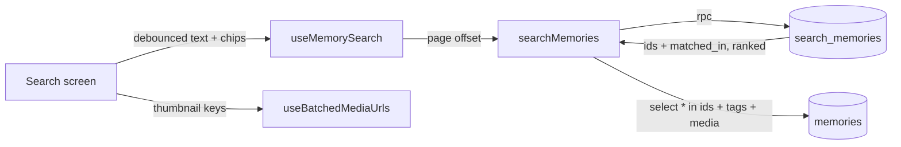

# Feature: Timeline search

**Status:** `done`
**Last updated:** 2026-09-27
**PRD reference:** [PRD §6](../PRD.md) — "Search or filter by date range, family member, or emotion"

## Overview

A search icon in the Timeline header opens a full-screen search over the
active family's memories: free text plus any number of **people** and one
**feeling**, all combined. Results are compact rows, best match first,
loaded a page at a time. Timeline only (not Calendar).

## User-facing behavior

- The field is focused on open. Results update ~250 ms after typing stops.
- Every typed word must match, each as a **prefix** ("cumple" finds
  "cumpleaños"), ignoring case and **accents** ("cafe" finds "café").
  Language-neutral: Spanish, English and mixes work the same.
- Text matches what people wrote, what was said in voice memories (the
  hidden transcript — never displayed), and what the AI saw (photo/memory
  description, labels, topics). Rows matched only through the transcript say
  "Matched what was said"; through the AI details, "Matched what's in the
  picture".
- Person chips (family members, with avatars) are **multi-select**: choosing
  several finds memories where **all** of them are tagged. Feeling chips (the
  emotion palette) are single-select. Tap again to clear. Chips combine with
  text: "Mara" + "bath" → bath memories tagged with Mara. Chips alone list
  everything matching, newest first.
- Chips are **count-aware** (`search_memory_facets`): each shows how many
  memories would match if chosen now; people/feelings with **no memories at
  all are hidden**; chips that would give **zero results under the current
  text + filters are dimmed and not tappable** (kept in place rather than
  hidden so the row doesn't reshuffle while typing). A selected chip always
  stays visible and tappable. Until the first counts arrive, every chip shows.
- Rows: thumbnail (illustration → cover preview/video poster → photo →
  the drawer's quote/sound tile), date · tagged people, and two lines of
  text with the matched word prefixes highlighted (a deep match starts the
  excerpt just before it, with "…"). Tap opens the memory; back returns to
  the search.
- Same visibility rules as the Timeline: memories by accounts you blocked are
  excluded (server-side), reported memories are left out, reported
  illustrations fall back to the quote tile.
- Keyboard: the field is at the top; the results list is the only element
  under the keyboard and keyboard-controller's `KeyboardAvoidingView`
  (`padding`) owns its compensation. The list clears the navigation bar only
  while the keyboard is closed. Dragging the list dismisses the keyboard.

## Architecture

- **Index:** `idx_memories_search_document`, a GIN expression index over
  `memory_search_document(content, audio_transcript, description, labels,
  topics)` — weights A (content), B (transcript), C (AI description + labels
  + topic slugs split into words), built with the `simple` config over
  `search_normalize()` (lower + `unaccent`). An expression index rather than
  a stored column so no tsvector rides along on every `select *`.
- **Query:** `memory_search_query(text)` turns input into `w1:* & w2:*`
  (≤ 8 words, punctuation dropped, so input can never be invalid tsquery).
- **Ranking:** `ts_rank_cd × (1 + 0.5·e^(−age_days/365))` — relevance with a
  gentle recency boost; chip-only searches are newest first.
- **Security:** `search_memories` is `security invoker` (memories RLS
  applies) and also checks `is_family_member`; excludes the caller's blocked
  accounts in that family.

## Data model

No new tables or columns. Migration `20260927100000_memory_search.sql`:
`unaccent` extension, `search_normalize`, `memory_search_document`,
`memory_search_query`, `search_memories`, the expression index; drops the
old per-column English FTS indexes.

## API

| RPC | Input | Output | Auth |
|-----|-------|--------|------|
| `search_memories` | `p_family_id`, `p_query?`, `p_member_ids?` (all must be tagged), `p_emotion?`, `p_limit` (≤ 50, default 30), `p_offset`; `p_member_id?` deprecated (older builds) | `(memory_id, matched_in 'text'\|'voice'\|'details'\|null, score)`, ranked | Authenticated family member |
| `search_memory_facets` | `p_family_id`, `p_query?`, `p_member_ids?`, `p_emotion?` | `(facet 'member'\|'emotion', value, total_count, matching_count)` for members/feelings with ≥1 memory | Authenticated family member |

Contract details in [TECH_SPEC §4.25](../TECH_SPEC.md#425-timeline-search).

## Client integration

| Layer | Files | Responsibility |
|-------|-------|----------------|
| Route | `app/(app)/search.tsx` | Field, chips, results, empty/error states, keyboard |
| Entry | `src/components/timeline-search-button.tsx` | Header icon beside the activity bell |
| Row | `src/components/memory-search-row.tsx` | Compact result row |
| Tile | `src/components/memory-fallback-tile.tsx` (+ `src/utils/memory-fallback.ts`) | Quote/sound stand-in, shared with the activity drawer |
| Hooks | `useMemorySearch`, `useMemorySearchFacets` in `src/hooks/useMemories.ts` | Infinite result pages; chip counts (both under the `memories-search` key) |
| Service | `searchMemories` in `src/services/memories.ts` | RPC + row/tag/media fetch in ranked order |
| Utils | `src/utils/memory-search.ts` | Highlighting, row text, thumbnail choice |

Analytics: `memory_search_opened`, `memory_search_result_opened` (no query
text) — see [analytics.md](./analytics.md).

## Extension guide

**Safe to extend**

- New searchable text on `memories`: add it to `memory_search_document`
  (pick a weight) — the index must be recreated in the same migration, and
  `search_memories` repeats the exact expression so the planner keeps using
  it.
- A date/year filter: add a param to `search_memories` **and**
  `search_memory_facets` (plus a `year` facet) and a chip row.
- Facet semantics: feeling counts ignore the current feeling (single-select
  alternatives); person counts include the other selected people (AND).
  Keep `search_memories` and `search_memory_facets` filters in lockstep.
- Search on another screen: reuse `useMemorySearch` + `MemorySearchRow`.

**Do not change without updating this doc**

- Transcripts stay hidden: only the "Matched what was said" note may reveal
  a transcript match.
- The family filter and blocked-account exclusion live in the RPC, not the
  client.
- One keyboard-compensation owner on the screen (AGENTS.md).

## Constraints & gotchas

- AI description/labels/topics are English, so e.g. "playa" finds a beach
  photo only if someone wrote it; "beach" finds it either way.
- Offset paging (30/page) — fine for family-sized libraries; switch to
  keyset if a family ever has tens of thousands of matches.
- `placeholderData` keeps old results visible while a refined query loads;
  `useMemorySearch` returns no hits when there are no criteria so cleared
  searches don't show stale rows.

## Testing

| File | Covers |
|------|--------|
| `supabase/tests/memory_search.sql` | Family isolation, accents/case, prefixes, AND, voice/details/text `matched_in`, topic slugs, chips alone/combined, ordering, punctuation safety, paging, blocked accounts, non-member rejection |
| `src/services/memories.integration.test.ts` | RPC call shape, ranked order preserved, deleted-row drop, errors |
| `src/hooks/useMemories.integration.test.tsx` | No criteria → no query, paging by offset, cleared criteria clear hits |
| `src/utils/memory-search.test.ts` | Highlighting, excerpting, row text, thumbnail choice |
| `src/screen-tests/memory-search.integration.test.tsx` | Debounce, chips, rows/notes/tiles, reported content, open + analytics, empty/error, paging, keyboard/safe-area contract |
| `.maestro/flows/search/timeline-search.yaml` | Create → partial unaccented search → open → back → no-match → cancel |

## Changelog

| Date | Change |
|------|--------|
| 2026-09-27 | Shipped: search_memories RPC + search screen (replaces the unshipped English-only client search) |
| 2026-09-27 | Multi-select people (AND), count-aware chips via search_memory_facets (hide empty, dim zero-match) |
