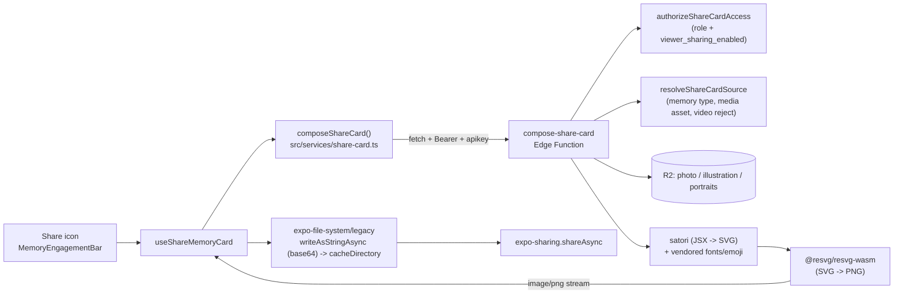

# Feature: Memory sharing

**Status:** `done`
**Last updated:** 2026-08-05
**PRD reference:** [docs/plans/offline-awareness-and-share-cards.md](../plans/offline-awareness-and-share-cards.md) Workstream S

## Overview

Parents can share a single memory outside the app as a simplified, watermarked
PNG "card" — composed server-side and handed to the native share sheet
(Messages, WhatsApp, Photos, AirDrop, whatever the OS offers). Momora never
hosts a public URL for the card: the Edge Function streams the PNG straight
back to the requesting device and keeps no copy. This is the "watermarked
share export" scope PRD §7 previously listed as post-MVP; it has shipped.

Shareable: text-only, illustrated, and photo memories. Videos are **never**
shareable — a mixed photo/video carousel shares whichever page is currently
visible, and the share affordance disables itself while a video page is on
screen.

## User-facing behavior

- A share icon sits in the engagement bar (`src/components/memory-engagement-bar.tsx`)
  next to the comment icon, on the **timeline card** and the **memory detail
  screen** only. The full-screen media viewer never shows it.
- Tapping it shows a brief spinner on the icon itself, then opens the native
  share sheet with a PNG attached. There is no in-app preview step.
- For a `media` memory, sharing always targets the carousel page currently on
  screen — swipe to a different photo, then share, and that photo is what
  goes out. A video page dims (disables) the icon rather than hiding it,
  since another page in the same carousel may still be a shareable photo. A
  video-only memory's icon is simply always dimmed, for the same reason —
  there's no separate "hide for video-only" code path.
- **Viewer permission:** owner/manager can always share. Viewers share by
  default; an owner/manager can turn this off per family from **Settings →
  Family → "Viewers can share memories"**. When off, the icon disappears
  entirely for viewers in that family (see Permission matrix below).
- **Errors** are non-blocking alerts, never a dead-end:
  - Offline (or any network-level failure): "You're offline — connect to the
    internet to share this memory."
  - Family sharing turned off mid-session (403 from the function): "Sharing
    is currently off for this family" — and the icon disappears on the next
    render, because the app also invalidates its cached copy of the
    family-sharing flag (see Constraints — that cache can be stale for up to
    7 days).
  - Composing too often, too fast (429): a friendly rate-limit message.
  - Anything else: a generic "Could not share memory — please try again."
- The exported filename is `momora-<mon>-<d>-<yyyy>.png` (the share target
  decides what to do with it — Files app, chat thread, etc.).

## Architecture



The client never uses `supabase.functions.invoke` for this call — see
Constraints. `useShareMemoryCard` (`src/hooks/useShareMemoryCard.ts`) owns
the whole tap-to-share-sheet flow so it's unit-testable independent of the
icon UI; `src/services/share-card.ts` owns the raw `fetch` + the mandated
single retry on HTTP 546.

## Data model

| Table / field | Role in this feature |
|----------------|----------------------|
| `families.viewer_sharing_enabled` | `boolean not null default true`. Owner/manager-editable (Settings → Family). Enforced server-side in `compose-share-card`, not just hidden client-side — see Permission matrix. |

No new tables. `compose-share-card` writes nothing to R2 or Postgres; it only
reads `memories`, `memory_media`, `family_members`, and `families`.

### Permission matrix

| Role | `viewer_sharing_enabled` | Icon visible? | Server allows compose? |
|------|---------------------------|----------------|--------------------------|
| Owner / manager | any | Yes | Yes |
| Viewer | `true` (default) | Yes | Yes |
| Viewer | `false` | No | No — 403 `sharing_disabled` |
| Non-member | any | n/a (no bar rendered) | No — 404 (same non-leaking pattern as other memory-scoped functions) |

Both halves are required: the client hides the icon so a blocked viewer never
sees a dead affordance, and the function re-checks
`authorizeShareCardAccess` (`supabase/functions/compose-share-card/index.ts`)
independently, because the client's cached copy of the flag can be stale (see
Constraints).

## API & Edge Functions

| Function / endpoint | Input | Output | Auth |
|---------------------|-------|--------|------|
| `compose-share-card` | `{ memoryId: string, mediaAssetId?: string }` | `200 image/png` (`Content-Disposition: attachment; filename="momora-<mon>-<d>-<yyyy>.png"`) | JWT; active member of the memory's family |

Status codes: `400` unsupported memory type / video asset / missing
`mediaAssetId` for a media memory; `403` non-member or viewer-blocked family;
`404` memory or media asset not found; `415` legacy HEIC/HEIF asset (not
rasterizable); `429` rate-limited (10 composes/minute/user, in-isolate); `500`
internal error; platform `546` (`WORKER_RESOURCE_LIMIT`, resource exhaustion
— see Constraints).

See [TECH_SPEC.md §4.20](../TECH_SPEC.md#420-compose-share-card) for the full
contract and [§2.1](../TECH_SPEC.md#21-tables) for the schema entry.

## Client integration

| Layer | Files | Responsibility |
|-------|-------|----------------|
| Hooks | `src/hooks/useShareMemoryCard.ts` | Orchestrates compose → write temp file → `Sharing.shareAsync` → best-effort cleanup; maps errors to the UX above |
| Services | `src/services/share-card.ts` | Raw `fetch` to the function with bearer + apikey headers; owns the single 546 retry |
| Utils | `src/utils/base64.ts`, `src/utils/share-card-filename.ts` | Dependency-free `Uint8Array` → base64 encoder; client temp-filename builder |
| Components | `src/components/memory-engagement-bar.tsx` | Share icon, spinner, visibility/disabled logic |
| Components (lifted state) | `src/components/memory-card.tsx`, `app/(app)/memory/[id]/index.tsx` | Lift the carousel's current page (`onActiveIndexChange`) so the bar knows which `mediaAssetId` to send |
| Components (carousel) | `src/components/memory-media-carousel.tsx` | `onActiveIndexChange` — fires once on mount with the initial page, then on every settled page change (`handleScrollEnd`, unifying `onMomentumScrollEnd`/`onScrollEndDrag`) |
| Hooks (permission) | `src/hooks/use-family.tsx`, `src/services/family.ts` | Exposes `family.viewerSharingEnabled` (from `fetchMyFamilyMemberships`'s `families` join) |
| Settings | `app/(app)/(tabs)/settings.tsx` | "Viewers can share memories" toggle (owner/manager only) |

### How to invoke from another feature

1. Render `MemoryEngagementBar` with `enableShare` (only from a timeline
   card or the memory detail screen — never the full-screen viewer).
2. If the memory can have a carousel (`memory_type === 'media'`), lift
   `onActiveIndexChange` from `MemoryMediaCarousel` into local state, and
   pass the active asset's `id`/video-ness through as `currentMediaAssetId`
   / `isCurrentPageVideo`. Text-only and illustrated memories can omit both
   (they default to `null`/`false`, which is correct — the function doesn't
   need a `mediaAssetId` for those types).
3. Don't call `useShareMemoryCard()` or `composeShareCard()` directly from a
   new surface without also reproducing the visibility matrix above —
   `MemoryEngagementBar` is the one place that logic lives.

## Card layout keep-in-sync contract

The share card is a **simplified** server-side reproduction of the in-app
card (`SpreadCard`/`QuoteCard` in `src/components/memory-card.tsx`), built
with `satori` (JSX → SVG) in
`supabase/functions/compose-share-card/layout.ts`. Both files carry a loud
"KEEP IN SYNC" comment pointing at the other. Deliberate differences (not
drift):

- No like/comment icons, no attribution line.
- No emotion **chip** — the "Momora." wordmark (`src/components/wordmark.tsx`,
  reproduced as Newsreader-medium text + a primary-colored period, not an
  image asset) sits in that slot instead. The quote (text-only) variant's
  accent strip + decorative opening-quotation-mark glyph DO use the memory's
  emotion color (mirroring `QuoteCard`'s accent tint and the memory detail
  screen's `MemoryDetailEditorial` glyph) via `layout.ts`'s
  `SHARE_CARD_EMOTION_COLORS` — a small map KEPT IN SYNC BY HAND with
  `src/constants/theme.ts`'s `emotionColors` (both files carry the
  cross-reference comment). `emotion` is selected for this coloring only and
  is never logged (AGENTS.md logging discipline).
- Full, **untruncated** caption — the in-app card truncates to ~140 chars;
  the share card never does (bounded in practice: `validateMemoryContent`
  caps content at 5000 chars, so worst case is a very tall card — see
  Constraints).
- Tagged-member portrait circles have no name chips (avatars only, capped at
  `MAX_VISIBLE_MEMBERS = 6` with a `+N` overflow badge, mirroring
  `MAX_TIMELINE_MEMBER_AVATARS` in `memory-card.tsx`).

Everything else — colors, radii, spacing, footer layout, avatar-cluster
overlap — is intentionally pixel-matched where satori's CSS subset allows it
(`SHARE_CARD_THEME` in `layout.ts` duplicates `src/constants/theme.ts`'s
`colors`/`radius`/`spacing` by hand; Deno Edge Functions can't import from
`src/`). **If you change the in-app card's visual design, check whether
`layout.ts` needs the same change, and vice versa.**

## Privacy

- **No content in logs.** The raw caption flows through satori, and satori's
  internal layout errors can embed text-node content in `error.message`.
  Every catch block in `compose-share-card/index.ts` that could observe such
  an error logs `memoryId` + a fixed status/code **only** — never
  `error.message` on a layout/render path (DB-layer errors are safe to log
  by message since they never contain memory content). See
  `runShareCardCompose`'s doc comment and `index.test.ts`'s
  no-content-in-logs assertion.
- **Vendored monochrome emoji, not a third-party fetch.** Satori doesn't
  rasterize color emoji from system fonts. The alternative — fetching
  twemoji-style color SVGs per emoji codepoint at compose time — was
  rejected specifically because it would leak caption-derived data (which
  emoji, and by extension something about the memory's content) to a
  third-party CDN's request logs, the *only* place in this pipeline where
  memory-derived content would otherwise leave Supabase/R2/OpenAI. Instead,
  a **monochrome NotoEmoji subset TTF** is vendored
  (`supabase/functions/compose-share-card/assets/font-noto-emoji-subset-b64.ts`)
  and rasterized locally. The accepted tradeoff is monochrome (not color)
  emoji on the card — never a silent "tofu box" (missing-glyph square).
- **Everything else already private-by-default.** No R2 writes, no public
  URLs, no stored copy of the composed PNG anywhere — the function streams
  the response and forgets it. The client's own copy is a temp file in
  `cacheDirectory`, best-effort deleted right after the share sheet resolves
  (OS-managed regardless).

## Extension guide

**Safe to extend**

- Additional card variants for future memory types, following the
  `SpreadCard`/`QuoteCard` split and the keep-in-sync contract above.
- More vendored font weights/scripts, following the existing
  base64-module-per-asset vendoring pattern (see Constraints — this is the
  *only* proven asset-loading channel under `--use-api` deploys).

**Do not change without updating this doc**

- The permission matrix (client visibility **and** server enforcement must
  both change together).
- The `--use-api` asset-vendoring mechanism (base64-encoded `.ts` modules,
  statically imported) — `Deno.readFile`/`readDirSync`/`fetch(import.meta.url)`
  do not work for this function's non-module-graph assets; see S0's spike
  report referenced from `compose-share-card/index.ts`.
- The raw-`fetch` client call — do not switch to
  `supabase.functions.invoke`; its `FunctionsClient` has no binary branch
  for `image/png` and falls back to `response.text()`, corrupting the bytes.
- The single-retry-on-546 behavior in `composeShareCard`
  (`src/services/share-card.ts`) — it's the client half of the S0 spike's
  measured mitigation; removing it (or retrying more than once) either
  reopens the failure rate or turns a rare platform hiccup into hammering.

**What audio sharing would need** (audio memories are specced but unshipped
— see [audio-memories.md](./audio-memories.md)): `compose-share-card`
currently rejects `audio` explicitly with a friendly message
(`isRejectedMemoryType`). A shareable audio "card" would need a genuinely
different design — there's no waveform/audio rendering in satori's SVG
model, and a share **sheet** target can't play back audio at all, so this
would likely need a differently-composed static image (e.g. a waveform
snapshot + the memory's description text) rather than reusing
`SpreadCard`/`QuoteCard`. Treat it as a new card variant, not an extension of
the photo/illustration path.

## Constraints & gotchas

- **Videos are never shareable**, full stop — not "shareable at reduced
  quality," not "shareable as a poster frame." `resolveShareCardSource`
  rejects a video `mediaAssetId` with `400 video_not_supported`, and the
  client disables the icon whenever the current carousel page is a video.
- **`viewer_sharing_enabled` can be stale on the client for up to 7 days.**
  It rides the same `family-memberships` query O4's persisted-cache
  `maxAge` covers. A 403 from the function is authoritative and the hook
  invalidates that query on receipt — but between a manager flipping the
  toggle and the viewer's next share attempt (or app foreground/reconnect,
  which reconciles it sooner), the icon can still show for a viewer whose
  access was just revoked. This is accepted, not a bug: the server is the
  actual authorization boundary.
- **Rate limiting is per-isolate, not global.** `compose-share-card`'s
  10-per-minute-per-user window (`isComposeRateLimited` /
  `SHARE_CARD_RATE_LIMIT_MAX_PER_WINDOW`) is an in-memory `Map`, same
  tradeoff as `analyze-emotion`'s existing cooldown — it bounds one isolate,
  not the fleet. Good enough for "don't hammer the most CPU-expensive
  user-triggered endpoint in the project," not a hard billing limit.
- **546 is a platform status, not one this function returns on purpose.**
  It's Supabase Edge Functions' own `WORKER_RESOURCE_LIMIT` response when a
  compose exceeds the isolate's memory/CPU budget. The S0 spike measured
  this tracks **total rendered pixel count**, not caption length or photo
  bytes: cards whose 1080px-wide layout would exceed ~2.5M total pixels
  render the identical layout at 720px width instead (`shouldUseReducedScale`
  / `SHARE_CARD_REDUCED_SCALE` in `compose-share-card/scale.ts`) — the full
  caption is still never truncated. The client retries exactly once on 546
  (~98%+ effective success per the spike); a second 546 is a genuine infra
  ceiling, not a client bug.
- **Long captions produce tall PNGs.** `validateMemoryContent` caps content
  at 5000 chars, so the worst case is a ~1080×6000px (or 720×4000px reduced)
  card. Most share targets downscale on their end; this is accepted, not a
  bug to chase.
- **Legacy HEIC/legacy rows.** `resvg-wasm` can't decode HEIC/HEIF (not
  supported by the `image` crate it's built on). This can only reach the
  function via a legacy media row's `object_key` fallback when
  `preview_object_key` is absent (the preview variant is always JPEG — see
  `supabase/scripts/backfill-media-previews.ts`); the function rejects it
  with `415 unsupported_image_format` rather than emitting a broken PNG.
- **`memory-engagement-bar.tsx` calls `useFamily()` and
  `useShareMemoryCard()` unconditionally**, even when `enableShare` is
  false — hooks can't be called conditionally on a prop. The share icon
  itself is still gated on `enableShare` in the render output.

## Dependencies

- Depends on: [Memories & illustrations](./memories.md) (memory/illustration
  data this feature reads), [Media memories](./media-memories.md) (preview
  assets, aspect ratio), [Family sharing](./family-sharing.md) (role model),
  [Likes & comments](./likes-and-comments.md) (the engagement bar this
  feature's icon lives in), [Offline awareness](./offline.md) (`useIsOnline`
  messaging pattern the share flow's offline error reuses)
- Used by: nothing yet (leaf feature)

## Testing

### Unit tests

| File | Covers |
|------|--------|
| `src/utils/base64.test.ts` | `bytesToBase64` against RFC 4648 vectors and a byte round-trip |
| `src/utils/share-card-filename.test.ts` | Client temp-filename format, id-fragment stripping/truncation/fallback, unparseable-date fallback |
| `src/services/share-card.test.ts` | Auth requirement, bearer+apikey headers, non-retryable error mapping, **546 retry-once** (success on retry, and no third attempt when 546 repeats), thrown-fetch → `network_error`, non-JSON error body fallback |
| `src/hooks/useShareMemoryCard.test.tsx` | Full tap flow with mocked service/FS/Sharing: temp-file write + share + best-effort cleanup, `isSharing` in-flight state, re-entrancy guard, sharing-unavailable device message, offline message, **403 → message + family-membership invalidation**, 429 friendly message, generic-error fallback, cleanup-on-write-failure |
| `src/components/memory-engagement-bar.test.tsx` | `enableShare` prop gating, the full visibility matrix (viewer×toggle, owner/manager always-on, missing-flag-defaults-true), video-page disabled + spinner-disabled states, tap delegates `(memory, currentMediaAssetId)` to `shareMemoryCard` |
| `src/components/memory-media-carousel.test.tsx` | `onActiveIndexChange` fires once on mount (default and requested initial index) and on `handleScrollEnd` (momentum end / drag-without-momentum), never on per-frame `onScroll` |
| `src/components/memory-card.test.tsx` | Active carousel page threaded into `currentMediaAssetId`/`isCurrentPageVideo`; text-only/illustrated memories pass `enableShare` without a `mediaAssetId` |

### Edge Function tests (Deno)

| File | Covers |
|------|--------|
| `supabase/functions/compose-share-card/index.test.ts` | Authz matrix (owner/manager/viewer×toggle/non-member), video rejection, asset-ownership rejection, rate limiting, no-content-in-logs on a layout failure, filename header |
| `supabase/functions/compose-share-card/layout.test.ts` | SVG-tree snapshot per memory-type variant (quote/spread), date-label formatting |
| `supabase/functions/compose-share-card/scale.test.ts` | Reduced-scale pixel-budget boundary, SVG-height parsing |

### Run this feature's tests

```bash
npm test -- --runInBand \
  src/utils/base64.test.ts \
  src/utils/share-card-filename.test.ts \
  src/services/share-card.test.ts \
  src/hooks/useShareMemoryCard.test.tsx \
  src/components/memory-engagement-bar.test.tsx \
  src/components/memory-media-carousel.test.tsx \
  src/components/memory-card.test.tsx
npx deno test --allow-env --allow-net --allow-read=supabase/functions \
  supabase/functions/compose-share-card/
```

Device smoke (not automated, needs two test accounts — one manager, one
viewer): share each memory type, swipe a mixed carousel and confirm the
shared page follows, confirm a video page dims the icon, flip the family
toggle off/on as manager and confirm the viewer's icon disappears/reappears.

## Changelog

| Date | Change |
|------|--------|
| 2026-08-05 | Initial implementation: viewer-sharing setting, `compose-share-card` Edge Function (satori + resvg-wasm, reduced-scale mitigation), client share flow (icon, carousel current-page lifting, `useShareMemoryCard`) |
