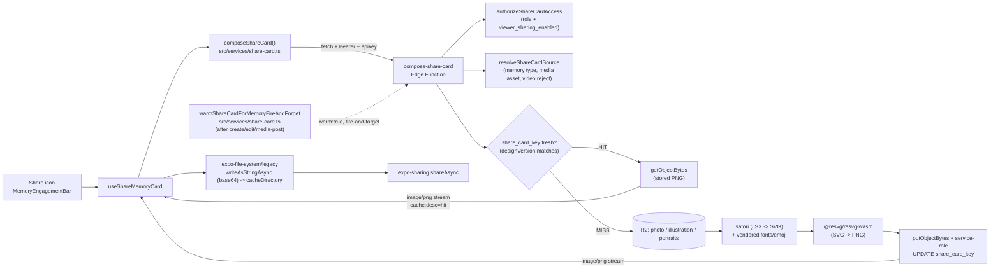

# Feature: Memory sharing

**Status:** `done`
**Last updated:** 2026-08-05
**PRD reference:** [docs/plans/offline-awareness-and-share-cards.md](../plans/offline-awareness-and-share-cards.md) Workstream S; store-through cache in [docs/plans/share-card-store-through.md](../plans/share-card-store-through.md)

## Overview

Parents can share a single memory outside the app as a simplified, watermarked
PNG "card" — composed server-side and handed to the native share sheet
(Messages, WhatsApp, Photos, AirDrop, whatever the OS offers). This is the
"watermarked share export" scope PRD §7 previously listed as post-MVP; it has
shipped.

`compose-share-card` never hosts a **public** URL for the card — every read
still goes through this authenticated function, and only the requesting
device ever sees the bytes. It does, however, keep a **private, server-owned
cache** of the composed PNG in R2 (docs/plans/share-card-store-through.md):
under Supabase Edge Functions' resource policing, a cold compose (satori +
resvg-wasm, real CPU work) plateaued at only ~50-70% success per attempt —
see Constraints for the full diagnosis. Storing the successfully-composed
PNG once and streaming that stored copy on every subsequent share/warm
absorbs that failure rate almost entirely for the common case (share the same
memory more than once, or share shortly after a warm hook already primed the
cache) without changing the client-visible contract at all: the response is
still raw PNG bytes, still through the same function, still gated by the
same permission checks on every call.

Shareable: text-only, illustrated, and photo memories. Videos are **never**
shareable — a mixed photo/video carousel shares whichever page is currently
visible, and the share affordance disables itself while a video page is on
screen.

## User-facing behavior

- A share icon sits in the engagement bar (`src/components/memory-engagement-bar.tsx`)
  next to the comment icon, on the **timeline card** and the **memory detail
  screen** only. The full-screen media viewer never shows it.
- Tapping it shows a brief spinner on the icon itself, then opens the native
  share sheet with a PNG attached. There is no in-app preview step.
- For a `media` memory, sharing always targets the carousel page currently on
  screen — swipe to a different photo, then share, and that photo is what
  goes out. A video page dims (disables) the icon rather than hiding it,
  since another page in the same carousel may still be a shareable photo. A
  video-only memory's icon is simply always dimmed, for the same reason —
  there's no separate "hide for video-only" code path.
- **Viewer permission:** owner/manager can always share. Viewers share by
  default; an owner/manager can turn this off per family from **Settings →
  Family → "Viewers can share memories"**. When off, the icon disappears
  entirely for viewers in that family (see Permission matrix below).
- **Errors** are non-blocking alerts, never a dead-end:
  - Offline (or any network-level failure): "You're offline — connect to the
    internet to share this memory."
  - Family sharing turned off mid-session (403 from the function): "Sharing
    is currently off for this family" — and the icon disappears on the next
    render, because the app also invalidates its cached copy of the
    family-sharing flag (see Constraints — that cache can be stale for up to
    7 days).
  - Composing too often, too fast (429): a friendly rate-limit message.
  - Anything else: a generic "Could not share memory — please try again."
- The exported filename is `momora-<mon>-<d>-<yyyy>.png` (the share target
  decides what to do with it — Files app, chat thread, etc.).

## Architecture



The client never uses `supabase.functions.invoke` for this call — see
Constraints. `useShareMemoryCard` (`src/hooks/useShareMemoryCard.ts`) owns
the whole tap-to-share-sheet flow so it's unit-testable independent of the
icon UI; `src/services/share-card.ts` owns the raw `fetch` + the mandated
single retry on HTTP 546 for the cold (streaming) path, and the fire-and-
forget warm hooks for the store-through cache (see below).

### Store-through cache

`compose-share-card` (`supabase/functions/compose-share-card/index.ts`) now
checks a per-memory (`memories.share_card_key`) or per-asset
(`memory_media.share_card_key`, media memories only — one card per carousel
page, keyed by the `memory_media` row) cache before doing any real work:

1. **Resolve the cache target.** `resolveShareCardCacheTarget` picks the
   `memories` row (text_only/text_illustration) or the specific
   `memory_media` row (`mediaAssetId`, media) whose `share_card_key` applies
   to this request.
2. **Freshness check (`isFreshShareCardKey`).** A stored key is a HIT only
   if it exists **and** its encoded `{designVersion}` (parsed from the key's
   `{designVersion}-{generationId}.png` filename segment,
   `parseShareCardKeyDesignVersion`) equals the function's current
   `DESIGN_VERSION` constant. A key from an older layout version is treated
   exactly like "no key at all" — never served stale.
3. **HIT** → `getObjectBytes` the stored PNG and stream it (cold path) or
   respond 204 immediately (warm path) — no R2 asset fetch (fonts/wasm), no
   satori, no resvg. `Server-Timing: cache;desc=hit, boot;dur=…, db;dur=…,
   get;dur=…, total;dur=…`.
4. **MISS** (no key, stale-version key, or the stored object's own read
   failed — e.g. swept out-of-band) → compose exactly as before, then
   `putObjectBytes` the PNG under a fresh
   `{ownerUserId}/memories/{memoryId}/share-card/{DESIGN_VERSION}-{uuid}.png`
   key (`buildShareCardKey`, `ownerUserId` = the memory's **creator**,
   never the caller — same prefix convention as every other object under
   that memory), update the target row's `share_card_key` via a
   **service-role** client (`storeShareCardAndUpdateCache`), and
   best-effort-delete the previous stored object if the column held a
   different (now-stale) key. Every step here is **non-fatal on failure**
   (logged id-only, never throws) — a caching problem can never turn a
   successful compose into a failed share.

**`DESIGN_VERSION` is the ONLY invalidation mechanism.** There is no
separate "clear the cache" admin action — bump the exported `DESIGN_VERSION`
constant in `compose-share-card/index.ts` on ANY layout change (`layout.ts`,
`render.ts`'s scale/format choices, or the card-shape assembly in
`index.ts` itself), and every existing stored card becomes a miss on its
next request, regenerating lazily under the new version. Content-level
staleness (the memory's caption/date/emotion changed, or a media memory's
assets were replaced) is handled separately by a DB trigger, not
`DESIGN_VERSION` — see the storage/deletion coverage summary below.

**Warm hooks** (docs/plans/share-card-store-through.md, W3): rather than
wait for a user to tap share (paying the cold-path compose cost live, in
front of them), the client proactively asks the function to compose-and-
store — never stream — right after the moments a card is likely to go
stale or not exist yet:

| Call site | File | What it warms |
|-----------|------|----------------|
| Text/illustrated memory create success | `src/hooks/useMemories.ts`, `useMemoryMutations`' `createMutation.onSuccess` (next to `notifyFamilyActivityFireAndForget`) | Per-memory card (`memoryId` only) |
| Media memory post success | `src/hooks/use-pending-memory-uploads.tsx`, the queue's post-create step (next to `notifyFamilyActivityFireAndForget`) | The **cover asset only** (`mediaAssets[0].id`, position 0) — not every carousel page; non-cover pages stay cold-path (rare shares, the 546 retry still exists) |
| Memory edit success | `src/hooks/useMemories.ts`, `useMemoryMutations`' `updateMutation.onSuccess` | Memory-level or cover-asset, branching on the edited memory's `memory_type` — an edit can touch ANY memory type, unlike create |

All three call `warmShareCardForMemoryFireAndForget`
(`src/services/share-card.ts`), which branches on `memory_type` and delegates to
`warmShareCardFireAndForget(memoryId, mediaAssetId?)` — a raw `fetch` POST
with `warm: true`, same headers as the cold path. Like
`notifyFamilyActivityFireAndForget`, it is **never awaited** on the save
path and swallows every eventual failure down to a `console.warn` —
invisible to the user. Internally it is **self-healing**
(docs/plans/share-card-store-through.md's four-part production fix, Part 3):
`performWarmShareCardWithRetries` retries on HTTP 546 up to
`SHARE_CARD_WARM_MAX_ATTEMPTS` (3) total attempts, backing off 4s then 8s
between them, but stops immediately — no further attempts — on a 429 or any
other outcome (a 429 retry would only burn the warm bucket further, missing
session/network/4xx/5xx won't be fixed by retrying either). If every attempt
fails, the cold-path compose (or a later warm/share attempt) is the real
safety net. `compose-share-card` enforces its own **separate, looser rate
bucket** for `warm: true` requests (30/minute/user vs. the cold path's
20/minute/user) so a burst of warms can never eat into a user's real share
budget, or vice versa.

**Storage & deletion coverage.** Both `share_card_key` columns participate
in the same object-lifetime machinery every other memory-scoped R2 key
does — see [docs/plans/share-card-store-through.md](../plans/share-card-store-through.md)'s
W1 checklist for the authoritative list; in summary: the schema migration
+ generated types, a DB trigger that clears `memories.share_card_key` on
content/memory_date/emotion UPDATE (`memory_media.share_card_key` needs no
equivalent trigger — `replace_memory_media_assets` always inserts fresh
rows, which start `null`), `_shared/storage-keys.ts`'s
`buildShareCardKey`/key-pattern (so `parseStorageKey` classifies it),
`_shared/family-access.ts`'s `resolveReferencedStorageKeys` and
`hard-delete-expired-accounts`'s `resolveReferencedKeys`/
`collectFamilyStorageKeys` (both admit both columns, so a live card is
never orphan-swept and an owner-deletion sweep does delete it), and the
client's `deleteMemoryStorageKeys` (`src/services/memories.ts`, both on
memory delete and on media-asset replacement). No client grant exists on
either column — both are written **only** by `compose-share-card`'s
service-role client.

## Data model

| Table / field | Role in this feature |
|----------------|----------------------|
| `families.viewer_sharing_enabled` | `boolean not null default true`. Owner/manager-editable (Settings → Family). Enforced server-side in `compose-share-card`, not just hidden client-side — see Permission matrix. |
| `memories.share_card_key` | `text null`. Store-through cache key for a text_only/text_illustration memory's card (`{ownerUserId}/memories/{memoryId}/share-card/{designVersion}-{generationId}.png`). Written only by `compose-share-card`'s service-role client; cleared by a trigger on content/memory_date/emotion UPDATE. |
| `memory_media.share_card_key` | `text null`. Same shape, per-ASSET — one cached card per carousel page for a `media` memory. Written only by `compose-share-card`'s service-role client; no trigger needed (`replace_memory_media_assets` always inserts fresh rows, which start `null`). |

No new tables. `compose-share-card` reads `memories`, `memory_media`,
`family_members`, and `families`; it now also **writes** the two
`share_card_key` columns and their R2 objects (via a service-role client,
docs/plans/share-card-store-through.md) — narrowly scoped, non-fatal on
failure, and the only exception to this function's original "reads only"
posture. See Architecture's "Store-through cache" section above for the
full read/write flow and TECH_SPEC §2.1/§2.4 for the column/trigger DDL.

### Permission matrix

| Role | `viewer_sharing_enabled` | Icon visible? | Server allows compose? |
|------|---------------------------|----------------|--------------------------|
| Owner / manager | any | Yes | Yes |
| Viewer | `true` (default) | Yes | Yes |
| Viewer | `false` | No | No — 403 `sharing_disabled` |
| Non-member | any | n/a (no bar rendered) | No — 404 (same non-leaking pattern as other memory-scoped functions) |

Both halves are required: the client hides the icon so a blocked viewer never
sees a dead affordance, and the function re-checks
`authorizeShareCardAccess` (`supabase/functions/compose-share-card/index.ts`)
independently, because the client's cached copy of the flag can be stale (see
Constraints).

## API & Edge Functions

| Function / endpoint | Input | Output | Auth |
|---------------------|-------|--------|------|
| `compose-share-card` | `{ memoryId: string, mediaAssetId?: string, warm?: boolean }` | Cold: `200 image/png` (`Content-Disposition: attachment; filename="momora-<mon>-<d>-<yyyy>.png"`, `Server-Timing` cache marker — see below). Warm (`warm: true`): `204` no body. | JWT; active member of the memory's family — identical for warm and cold |

`Server-Timing` carries a `cache;desc=hit` field (cold path only) when the
response was served from the store-through cache — its absence means the
request was a miss and paid the full compose. See TECH_SPEC §4.20 for the
exact field list on each path.

Status codes: `400` unsupported memory type / video asset / missing
`mediaAssetId` for a media memory / non-boolean `warm`; `403` non-member or
viewer-blocked family (same rules on warm and cold); `404` memory or media
asset not found; `415` legacy HEIC/HEIF asset (not rasterizable); `429`
rate-limited — 20 composes/minute/user (cold, in-isolate; bumped from 10 in
the four-part production fix — a production probe found the client burns 2
attempts per cold-path 546 retry, so 10/min could exhaust after a handful of
taps and surface as an indistinguishable-from-broken wall of 429s) OR 30
warms/minute/user (warm, a **separate** in-isolate bucket); `500` internal
error; platform `546` (`WORKER_RESOURCE_LIMIT`, resource exhaustion — see
Constraints; the client retries this once on the cold path only, never on
warm).

See [TECH_SPEC.md §4.20](../TECH_SPEC.md#420-compose-share-card) for the full
contract and [§2.1](../TECH_SPEC.md#21-tables) for the schema entry.

## Client integration

| Layer | Files | Responsibility |
|-------|-------|----------------|
| Hooks | `src/hooks/useShareMemoryCard.ts` | Orchestrates compose → write temp file → `Sharing.shareAsync` → best-effort cleanup; maps errors to the UX above |
| Services | `src/services/share-card.ts` | Raw `fetch` to the function with bearer + apikey headers; owns the single 546 retry (cold, `composeShareCard`) and the fire-and-forget cache warm (`warmShareCardFireAndForget`, `warmShareCardForMemoryFireAndForget`) |
| Utils | `src/utils/base64.ts`, `src/utils/share-card-filename.ts` | Dependency-free `Uint8Array` → base64 encoder; client temp-filename builder |
| Components | `src/components/memory-engagement-bar.tsx` | Share icon, spinner, visibility/disabled logic |
| Components (lifted state) | `src/components/memory-card.tsx`, `app/(app)/memory/[id]/index.tsx` | Lift the carousel's current page (`onActiveIndexChange`) so the bar knows which `mediaAssetId` to send |
| Components (carousel) | `src/components/memory-media-carousel.tsx` | `onActiveIndexChange` — fires once on mount with the initial page, then on every settled page change (`handleScrollEnd`, unifying `onMomentumScrollEnd`/`onScrollEndDrag`) |
| Hooks (permission) | `src/hooks/use-family.tsx`, `src/services/family.ts` | Exposes `family.viewerSharingEnabled` (from `fetchMyFamilyMemberships`'s `families` join) |
| Settings | `app/(app)/(tabs)/settings.tsx` | "Viewers can share memories" toggle (owner/manager only) |
| Warm hooks (call sites) | `src/hooks/useMemories.ts` (`createMutation`/`updateMutation` `onSuccess`), `src/hooks/use-pending-memory-uploads.tsx` (post-create step) | Fire `warmShareCardForMemoryFireAndForget(memory)` after a text/illustrated create, a media post, or any edit — see Architecture's "Store-through cache" section for the full table |

### How to invoke from another feature

1. Render `MemoryEngagementBar` with `enableShare` (only from a timeline
   card or the memory detail screen — never the full-screen viewer).
2. If the memory can have a carousel (`memory_type === 'media'`), lift
   `onActiveIndexChange` from `MemoryMediaCarousel` into local state, and
   pass the active asset's `id`/video-ness through as `currentMediaAssetId`
   / `isCurrentPageVideo`. Text-only and illustrated memories can omit both
   (they default to `null`/`false`, which is correct — the function doesn't
   need a `mediaAssetId` for those types).
3. Don't call `useShareMemoryCard()` or `composeShareCard()` directly from a
   new surface without also reproducing the visibility matrix above —
   `MemoryEngagementBar` is the one place that logic lives.

## Card layout keep-in-sync contract

The share card is a **simplified** server-side reproduction of the in-app
card (`SpreadCard`/`QuoteCard` in `src/components/memory-card.tsx`), built
with `satori` (JSX → SVG) in
`supabase/functions/compose-share-card/layout.ts`. Both files carry a loud
"KEEP IN SYNC" comment pointing at the other. Deliberate differences (not
drift):

- No like/comment icons, no attribution line.
- No emotion **chip** — the "Momora." wordmark (`src/components/wordmark.tsx`,
  reproduced as Newsreader-medium text + a primary-colored period, not an
  image asset) sits in that slot instead. The quote (text-only) variant's
  accent strip + decorative opening-quotation-mark glyph DO use the memory's
  emotion color (mirroring `QuoteCard`'s accent tint and the memory detail
  screen's `MemoryDetailEditorial` glyph) via `layout.ts`'s
  `SHARE_CARD_EMOTION_COLORS` — a small map KEPT IN SYNC BY HAND with
  `src/constants/theme.ts`'s `emotionColors` (both files carry the
  cross-reference comment). `emotion` is selected for this coloring only and
  is never logged (AGENTS.md logging discipline).
- Full, **untruncated** caption — the in-app card truncates to ~140 chars;
  the share card never does (bounded in practice: `validateMemoryContent`
  caps content at 5000 chars, so worst case is a very tall card — see
  Constraints).
- Tagged-member portrait circles have no name chips (avatars only, capped at
  `MAX_VISIBLE_MEMBERS = 6` with a `+N` overflow badge, mirroring
  `MAX_TIMELINE_MEMBER_AVATARS` in `memory-card.tsx`).

Everything else — colors, radii, spacing, footer layout, avatar-cluster
overlap — is intentionally pixel-matched where satori's CSS subset allows it
(`SHARE_CARD_THEME` in `layout.ts` duplicates `src/constants/theme.ts`'s
`colors`/`radius`/`spacing` by hand; Deno Edge Functions can't import from
`src/`). **If you change the in-app card's visual design, check whether
`layout.ts` needs the same change, and vice versa.**

## Privacy

- **No content in logs.** The raw caption flows through satori, and satori's
  internal layout errors can embed text-node content in `error.message`.
  Every catch block in `compose-share-card/index.ts` that could observe such
  an error logs `memoryId` + a fixed status/code **only** — never
  `error.message` on a layout/render path (DB-layer errors are safe to log
  by message since they never contain memory content). See
  `runShareCardCompose`'s doc comment and `index.test.ts`'s
  no-content-in-logs assertion.
- **Self-hosted Twemoji `graphemeImages`, not a third-party fetch —
  replaces the earlier monochrome-font-only story (four-part production
  fix, 2026-08-05).** The vendored monochrome NotoEmoji subset TTF
  (`supabase/functions/compose-share-card/assets/font-noto-emoji-subset-b64.ts`)
  covers ORDINARY glyph shaping (a single emoji codepoint renders as one
  glyph), but satori's text shaper never applies emoji LIGATURE rules —
  regional-indicator PAIRS (flags), ZWJ sequences (families), keycap
  combining marks — so no font, however complete its glyph coverage, could
  ever render those correctly through shaping alone (device report: a
  flag emoji rendered as two literal letters, "E S", not tofu — each
  regional-indicator glyph shaped fine on its own, they just never combine
  into a flag). The fix uses satori's OWN mechanism for this,
  `graphemeImages` (a grapheme-text → image-source map, substituted in
  place of font shaping for that exact grapheme): `compose-share-card/
  emoji.ts` extracts distinct emoji graphemes from a caption
  (`Intl.Segmenter`, grapheme granularity) and maps each to its Twemoji SVG
  filename (a careful, byte-verified port of twemoji-parser's own
  `toCodePoints`/`removeVS16s`, MIT license).
  **Still self-hosted, not fetched from a third party at REQUEST time** —
  the same privacy reasoning as before still applies (a per-caption-emoji
  CDN fetch, keyed by codepoint, would leak which emoji — and by extension
  something about caption content — to that third party's request logs,
  the *only* place in this pipeline where memory-derived content would
  otherwise leave Supabase/R2/OpenAI). The Twemoji SVG set is instead
  uploaded ONCE to this project's own R2 bucket
  (`supabase/scripts/upload-twemoji-assets.ts`, key prefix
  `_assets/twemoji/v1/`) and fetched from there like any other R2-hosted
  asset — in the SAME `getObjectBytesBatch` window as the hero/portrait
  images, cache-miss path only, with a small bounded per-isolate memo
  (`MAX_EMOJI_GRAPHEME_MEMO_ENTRIES`, `compose-share-card/index.ts`) so a
  common emoji isn't re-fetched from R2 on every request in a warm
  isolate. A missing/failed SVG fails OPEN — the caption falls back to the
  font's own (incomplete, ligature-less) rendering for that one grapheme,
  never a broken image, never fails the whole compose. The monochrome
  NotoEmoji font is still vendored/used as the shaping fallback for any
  emoji that ISN'T (or fails to be) covered by a `graphemeImages` entry —
  a codepoint outside both the font subset AND a resolvable Twemoji SVG
  falls back to a tofu box, same as before this fix.
  **BUG FIX (perf-audit pass, this package's implementation report,
  pre-dating the graphemeImages fix above):** the subset's Unicode range
  list omitted U+1F1E6-1F1FF (Regional Indicator Symbols) entirely, so
  flag emoji rendered as two literal tofu boxes — fixed by adding that
  range to the subset build (kept as the shaping-level floor even now that
  `graphemeImages` normally handles flags at a higher priority).
- **Everything else already private-by-default.** No public URL is ever
  minted for a card — every read still goes through the authenticated
  function, which re-checks the same permission matrix on every request,
  including a cache hit. The store-through cache (docs/plans/
  share-card-store-through.md) IS a private, server-owned copy of the
  composed PNG in R2 now — see Architecture and Data model above for what's
  written and by whom (service-role client only, no client grant) — but it
  changes nothing about who can ever read the bytes: the object key lives
  under the memory creator's existing R2 prefix (same authorization
  boundary every other memory object already uses) and is deleted whenever
  the memory/asset itself is (see the storage/deletion coverage summary).
  The client's own copy is a temp file in `cacheDirectory`, best-effort
  deleted right after the share sheet resolves (OS-managed regardless).

## Extension guide

**Safe to extend**

- Additional card variants for future memory types, following the
  `SpreadCard`/`QuoteCard` split and the keep-in-sync contract above.
- More vendored font weights/scripts, following the existing
  base64-module-per-asset vendoring pattern (see Constraints — this is the
  *only* proven asset-loading channel under `--use-api` deploys).

**Do not change without updating this doc**

- The permission matrix (client visibility **and** server enforcement must
  both change together).
- The `--use-api` asset-vendoring mechanism (base64-encoded `.ts` modules,
  statically imported) — `Deno.readFile`/`readDirSync`/`fetch(import.meta.url)`
  do not work for this function's non-module-graph assets; see S0's spike
  report referenced from `compose-share-card/index.ts`.
- The raw-`fetch` client call — do not switch to
  `supabase.functions.invoke`; its `FunctionsClient` has no binary branch
  for `image/png` and falls back to `response.text()`, corrupting the bytes.
- The single-retry-on-546 behavior in `composeShareCard`
  (`src/services/share-card.ts`) — it's the client half of the S0 spike's
  measured mitigation; removing it (or retrying more than once) either
  reopens the failure rate or turns a rare platform hiccup into hammering.
- The `DESIGN_VERSION` bump discipline (`compose-share-card/index.ts`) — it
  is the ONLY thing that invalidates a stored card; forgetting to bump it
  after a layout change silently serves the OLD design from cache
  indefinitely (nothing else ever re-checks staleness).
- The two independent rate-limit buckets (cold `SHARE_CARD_RATE_LIMIT_*` vs.
  warm `SHARE_CARD_WARM_RATE_LIMIT_*`) — do not merge them into one shared
  counter; a warm burst must never be able to exhaust a user's real share
  budget, and vice versa.
- `warmShareCardFireAndForget`'s swallow-everything, never-awaited contract
  (`src/services/share-card.ts`) — mirrors `notifyFamilyActivityFireAndForget`
  on purpose; a warm hook that surfaces failures to the user turns a
  best-effort optimization into user-visible noise for zero benefit (the
  cold path is still the safety net). Its INTERNAL self-healing retry (546
  only, up to `SHARE_CARD_WARM_MAX_ATTEMPTS`, 4s/8s backoff, stops
  immediately on 429/anything else) is fine to tune, but never let it retry
  on 429 — that would burn the warm bucket, not heal anything.
- `emoji.ts`'s `graphemeToTwemojiFilename` (VS16-drop-unless-ZWJ,
  no-zero-padding hex codepoints) — a byte-verified port of
  twemoji-parser's own `toCodePoints`/`removeVS16s`. Do not "simplify" it
  without re-verifying against the real twemoji-parser source; a subtly
  wrong mapping doesn't error, it just silently 404s against R2 (fails
  open to font-shaped rendering) for whichever emoji it got wrong. The R2
  key prefix (`TWEMOJI_ASSET_PREFIX`, `_assets/twemoji/v1/`) must stay in
  sync between `emoji.ts` and `upload-twemoji-assets.ts` — a version bump
  in one without the other silently makes every emoji miss.

**What audio sharing would need** (audio memories are specced but unshipped
— see [audio-memories.md](./audio-memories.md)): `compose-share-card`
currently rejects `audio` explicitly with a friendly message
(`isRejectedMemoryType`). A shareable audio "card" would need a genuinely
different design — there's no waveform/audio rendering in satori's SVG
model, and a share **sheet** target can't play back audio at all, so this
would likely need a differently-composed static image (e.g. a waveform
snapshot + the memory's description text) rather than reusing
`SpreadCard`/`QuoteCard`. Treat it as a new card variant, not an extension of
the photo/illustration path.

## Constraints & gotchas

- **Videos are never shareable**, full stop — not "shareable at reduced
  quality," not "shareable as a poster frame." `resolveShareCardSource`
  rejects a video `mediaAssetId` with `400 video_not_supported`, and the
  client disables the icon whenever the current carousel page is a video.
- **`viewer_sharing_enabled` can be stale on the client for up to 7 days.**
  It rides the same `family-memberships` query O4's persisted-cache
  `maxAge` covers. A 403 from the function is authoritative and the hook
  invalidates that query on receipt — but between a manager flipping the
  toggle and the viewer's next share attempt (or app foreground/reconnect,
  which reconciles it sooner), the icon can still show for a viewer whose
  access was just revoked. This is accepted, not a bug: the server is the
  actual authorization boundary.
- **Rate limiting is per-isolate, not global.** `compose-share-card`'s
  10-per-minute-per-user window (`isComposeRateLimited` /
  `SHARE_CARD_RATE_LIMIT_MAX_PER_WINDOW`) is an in-memory `Map`, same
  tradeoff as `analyze-emotion`'s existing cooldown — it bounds one isolate,
  not the fleet. Good enough for "don't hammer the most CPU-expensive
  user-triggered endpoint in the project," not a hard billing limit.
- **546 is a platform status, not one this function returns on purpose.**
  It's Supabase Edge Functions' own `WORKER_RESOURCE_LIMIT` response when a
  compose exceeds the isolate's memory/CPU budget. The S0 spike measured
  this tracks **total rendered pixel count**, not caption length or photo
  bytes: cards whose 1080px-wide layout would exceed ~2.5M total pixels
  render the identical layout at 720px width instead (`shouldUseReducedScale`
  / `SHARE_CARD_REDUCED_SCALE` in `compose-share-card/scale.ts`) — the full
  caption is still never truncated. The client retries exactly once on 546
  (~98%+ effective success per the spike); a second 546 is a genuine infra
  ceiling, not a client bug.
  **Refined diagnosis (perf-audit pass, this package's implementation
  report):** production 546 rates (~70-80%) turned out to be too high to
  explain by raster pixel count alone — a typical photo-memory card is only
  ~1.2M px (well under the 2.5M budget, `scale: 'full'`) yet still failed
  ~46.7% in a 15-shot baseline against the deployed function, and the S0
  spike itself never observed a warm isolate. The additional, independent
  contributor is **per-request BOOT/module-eval overhead**: every request
  cold-starts and pays to (a) parse several MB of base64 asset text at
  module-graph eval time, (b) compile the resvg wasm module, and (c) have
  satori load/shape against all five (unsubsetted, at the time) font
  buffers. Mitigations landed in this pass: the four Latin text fonts are
  now subsetted to Latin + Latin-Extended + common punctuation (fonttools
  `pyftsubset`, ~54% smaller); `@jsquash/webp`'s module + wasm asset are now
  `import()`-ed lazily, only when the resolved source actually sniffs as
  webp, instead of being paid on every request regardless of source type;
  and the function now emits a `Server-Timing` header + a structured
  per-request log line (`memoryId`, `bootHintMs`, `fetchMs`, `satoriMs`,
  `resvgMs`, `totalMs`, `rss`/`heapUsed`, `scale`, `pngBytes`, `fetchCount`,
  `imageFetchMs` — ids/numbers only, see the logging-discipline note above)
  so future regressions can be attributed to a specific phase instead of
  re-diagnosed from scratch. The reduced-scale pixel-budget mitigation above
  is unchanged and still real — the causes are independent and all matter.
  **Round 2 (the instrumentation paid off):** post-deploy `Server-Timing`
  measurement on the boot-fix build overturned the boot hypothesis itself —
  `boot` measured 2-3ms (a non-issue), while `fetch` measured ~1.1-1.3s of a
  ~2-2.2s total, sitting almost exactly on the resource ceiling. Root cause:
  the hero image's R2 GET and every tagged member's portrait's R2 GET ran
  **sequentially** — portraits were fetched as a group first
  (`resolveMemberPortraits`, parallel with each other but not with the
  hero), THEN the hero image was fetched entirely after that group
  finished. Fixed (`index.ts`'s `handleComposeShareCard`): the hero fetch
  is kicked off immediately (nothing blocks it) and now overlaps with the
  tagged-member DB query; once that query returns, every portrait's R2 GET
  joins the SAME `Promise.all` as the (likely still in-flight) hero fetch,
  via a new `getObjectBytesBatch` (`_shared/r2.ts`) that also collapses N
  separate presign calls (one `S3Client` construction each) into a single
  multi-key `createPresignedGetUrls` call. `authorizeShareCardAccess` and
  `resolveShareCardSource` (two independent DB reads) were also switched
  from sequential `await`s to `Promise.all`. Separately, portraits (stored
  small, ~25KB) were paying `capImageMaxEdge`'s unconditional full-pixel
  decode just to confirm no resize was needed — `capImageMaxEdgeIfNeeded`
  now sniffs dimensions via `npm:image-size` (header-only, no decode) and
  skips straight to pass-through when already under budget.
  **Round 3 (round 2 wasn't enough, and 546s died before our own
  instrumentation could see them):** post-round-2 `Server-Timing` on
  successes showed `fetch` at ~850-1010ms, of which the (now-batched)
  image fetch was only ~250ms — the remaining ~600-750ms was DB/auth round
  trips: `~6` sequential hops survived round 2's fix, because that round
  only parallelized the memory-row lookup's TWO immediate children
  (`authorizeShareCardAccess` vs `resolveShareCardSource`) against each
  other — it didn't reach INSIDE `authorizeShareCardAccess`, whose own
  `getCallerFamilyRoles` issues its `families` and `family_memberships`
  reads sequentially, plus a THIRD query for a viewer's
  `viewer_sharing_enabled`. Separately, some 546s carried NO `Server-Timing`
  header at all — proof they died before `handleComposeShareCard` even ran,
  implicating platform-counted "worker boot" resource use, which this
  function's own `bootHintMs` (captured only after static imports finish)
  structurally cannot see. Fixed: (1) every one of those reads — memory row,
  role, `viewer_sharing_enabled`, the media asset, tagged members + their
  portrait keys — is now ONE PostgREST nested `select` on `memories`
  (`SHARE_CARD_MEMORY_SELECT`, `index.ts`), run with the user-scoped client
  so existing RLS enforces membership implicitly; verified against the real
  schema+RLS before wiring in (single round trip, ~150-200ms, correct
  nested shape) — `authorizeShareCardAccessFromQueryRow` and
  `resolveShareCardSourceFromQueryRow` now just post-process that one
  already-fetched row (sync, no DB call, no `Promise.all` needed anymore).
  Hero + every portrait's R2 fetch also collapsed into a single
  `getObjectBytesBatch` call (previously two: one for the hero, one for
  portraits). (2) `render.ts`'s `getFonts()` (resvg wasm compile + font
  decode) was ALREADY request-scoped, not module-scope, on inspection — the
  "dies before Server-Timing" premise doesn't point at that function
  specifically; what genuinely IS unavoidable module-scope cost is V8
  parsing the ~4.8MB of base64 STRING LITERALS across the still-statically-
  imported font/resvg assets as part of this module's own import graph
  evaluation (round 1 kept these static deliberately — they're needed by
  nearly every compose, unlike webp's conditional lazy-import). `getFonts()`
  now reports its cost as its own `initMs`/`init;dur=` Server-Timing phase
  (previously folded into `satoriMs`), so a first-request cost spike there
  reads as "init," not "satori is slow." Whether the remaining 546s were
  actually explained by module-eval cost is for the orchestrator's
  post-deploy measurement to confirm — see this package's implementation
  report for the exact prediction being tested.
  **Decision (2026-08-05, docs/plans/share-card-store-through.md): absorb
  the remaining failures behind a store-through cache instead of chasing
  round 4+ of boot/module-eval diagnosis.** Every round above reduced the
  546 rate but never eliminated it — resvg's own raster CPU cost (~850ms at
  1080px) is treated as an irreducible floor under Supabase's current edge
  resource policing, verified against a trivial control function on the
  SAME project passing 15/15 under identical load. Rather than keep
  shrinking the odds of any ONE compose failing, a stored card removes the
  compose from the hot path entirely for every request after the first:
  once a memory's card is cached (via a warm hook or a successful cold
  share), every subsequent share/warm is a `getObjectBytes` — near-zero
  CPU, immune to the pixel-count/boot-cost policing described above. The
  **updated failure-rate story**: cold-path (first-ever compose for a
  card) success is still bounded by everything documented above (~50-70%
  per attempt, retried once); warm-path and any repeat share of an
  already-cached card is expected close to 100%, with `total;dur` under
  ~500ms (the cache-hit `Server-Timing` phases above are just `db` + `get`
  — no satori/resvg at all). In practice, warm hooks firing after every
  create/edit/media-post mean most real shares hit a warm cache rather than
  the cold path — see post-deploy measurement notes in
  docs/plans/share-card-store-through.md for the actual observed split.
- **Long captions produce tall PNGs.** `validateMemoryContent` caps content
  at 5000 chars, so the worst case is a ~1080×6000px (or 720×4000px reduced)
  card. Most share targets downscale on their end; this is accepted, not a
  bug to chase.
- **Legacy HEIC/legacy rows.** `resvg-wasm` can't decode HEIC/HEIF (not
  supported by the `image` crate it's built on). This can only reach the
  function via a legacy media row's `object_key` fallback when
  `preview_object_key` is absent (the preview variant is always JPEG — see
  `supabase/scripts/backfill-media-previews.ts`); the function rejects it
  with `415 unsupported_image_format` rather than emitting a broken PNG.
- **`memory-engagement-bar.tsx` calls `useFamily()` and
  `useShareMemoryCard()` unconditionally**, even when `enableShare` is
  false — hooks can't be called conditionally on a prop. The share icon
  itself is still gated on `enableShare` in the render output.

## Dependencies

- Depends on: [Memories & illustrations](./memories.md) (memory/illustration
  data this feature reads), [Media memories](./media-memories.md) (preview
  assets, aspect ratio), [Family sharing](./family-sharing.md) (role model),
  [Likes & comments](./likes-and-comments.md) (the engagement bar this
  feature's icon lives in), [Offline awareness](./offline.md) (`useIsOnline`
  messaging pattern the share flow's offline error reuses)
- Used by: nothing yet (leaf feature)

## Testing

### Unit tests

| File | Covers |
|------|--------|
| `src/utils/base64.test.ts` | `bytesToBase64` against RFC 4648 vectors and a byte round-trip |
| `src/utils/share-card-filename.test.ts` | Client temp-filename format, id-fragment stripping/truncation/fallback, unparseable-date fallback |
| `src/services/share-card.test.ts` | Auth requirement, bearer+apikey headers, non-retryable error mapping (incl. **429 fires exactly one attempt**), **546 retry-once** (success on retry, and no third attempt when 546 repeats), thrown-fetch → `network_error`, non-JSON error body fallback; `warmShareCardFireAndForget` never returns a promise, POSTs `warm:true` (with/without `mediaAssetId`), swallows a non-2xx/thrown-error/no-session outcome to `console.warn`; **self-healing retry:** up to 3 total attempts on repeated 546 with 4s/8s backoff (fake timers), silent give-up (single `console.warn`, no 4th attempt) after 3, immediate stop on 429 (no backoff timer ever scheduled); `warmShareCardForMemoryFireAndForget` resolves memory-level vs. position-0-cover-asset per `memory_type`, skips a media memory with no assets |
| `src/hooks/useShareMemoryCard.test.tsx` | Full tap flow with mocked service/FS/Sharing: temp-file write + share + best-effort cleanup, `isSharing` in-flight state, re-entrancy guard, sharing-unavailable device message, offline message, **403 → message + family-membership invalidation**, 429 friendly message, generic-error fallback, cleanup-on-write-failure |
| `src/components/memory-engagement-bar.test.tsx` | `enableShare` prop gating, the full visibility matrix (viewer×toggle, owner/manager always-on, missing-flag-defaults-true), video-page disabled + spinner-disabled states, tap delegates `(memory, currentMediaAssetId)` to `shareMemoryCard` |
| `src/components/memory-media-carousel.test.tsx` | `onActiveIndexChange` fires once on mount (default and requested initial index) and on `handleScrollEnd` (momentum end / drag-without-momentum), never on per-frame `onScroll` |
| `src/components/memory-card.test.tsx` | Active carousel page threaded into `currentMediaAssetId`/`isCurrentPageVideo`; text-only/illustrated memories pass `enableShare` without a `mediaAssetId` |
| `src/hooks/useMemories.integration.test.tsx` (`warm-share-card fire-and-forget`) | `createMutation`/`updateMutation` `onSuccess` each fire `warmShareCardForMemoryFireAndForget` exactly once with the create/updated memory; the mutation resolves without awaiting a hanging/rejecting warm mock |
| `src/hooks/use-pending-memory-uploads.test.tsx` (`warm-share-card fire-and-forget`) | The queue's post-create step fires `warmShareCardForMemoryFireAndForget` exactly once with the posted media memory (cover-asset resolution happens inside the shared helper); the pending upload still clears without awaiting a hanging/rejecting warm mock |

### Edge Function tests (Deno)

| File | Covers |
|------|--------|
| `supabase/functions/compose-share-card/index.test.ts` | Authz matrix (owner/manager/viewer×toggle/non-member), video rejection, asset-ownership rejection, rate limiting, no-content-in-logs on a layout failure, filename header; **store-through cache (W2):** `DESIGN_VERSION`/key-parsing/freshness, cache-target resolution (memory vs. per-asset), `storeShareCardAndUpdateCache` (put + column update + stale-object delete, non-fatal on each failure), end-to-end cache HIT (streams stored PNG, never loads fonts/wasm or composes), MISS (composes, stores under the creator prefix + `DESIGN_VERSION`), stale-version key treated as MISS + stale object deleted, warm mode on a fresh cache (204, no-op) and on a MISS (204 after compose+store), the warm rate bucket independent of the cold bucket in both directions; **emoji `graphemeImages` (Part 4 of the four-part fix):** a caption emoji's Twemoji key joins the SAME `getObjectBytesBatch` window as hero/portrait images, the resolved map reaches `composeShareCardPng` (dependency-injected assertion), no-emoji captions add no key + pass an empty map, a missing/failed SVG fails open (share still succeeds, grapheme just absent), the per-isolate memo skips a second R2 fetch for an already-seen grapheme, `rememberEmojiGraphemeImage`'s FIFO eviction at `MAX_EMOJI_GRAPHEME_MEMO_ENTRIES` |
| `supabase/functions/compose-share-card/emoji.test.ts` | `graphemeToTwemojiFilename`/`buildTwemojiObjectKey` against the exact twemoji-parser-verified cases (flag pair, VS16-dropped heart, ZWJ family with every codepoint kept, keycap, a ZWJ+VS16 combo that keeps VS16), `isEmojiGrapheme`/`extractDistinctEmojiGraphemes` (mixed caption extraction + dedupe + distinct-flags-stay-distinct, non-emoji text/punctuation excluded), `resolveGraphemeImages` (memo-hit short-circuit, fetch-then-resolve, fail-open on missing/failed/bytes-less entries, one failure never blocks another grapheme's success) |
| `supabase/functions/compose-share-card/layout.test.ts` | SVG-tree snapshot per memory-type variant (quote/spread), date-label formatting, quote-glyph bottom-margin pinned to the exact `+8` logical-unit value (user-feedback follow-up), flag/mixed-emoji captions still produce real glyph path data (pre-`graphemeImages` shaping floor, not a regression guard for the image substitution itself — see render.test.ts for that) |
| `supabase/functions/compose-share-card/render.test.ts` | Real PNG output from injected real font/wasm fixture bytes, resvg-wasm-compile memoization, the reduced-scale mitigation at a real pixel boundary; **`graphemeImages` passthrough:** an override for a caption's emoji measurably changes the rendered PNG bytes (proves the parameter reaches satori on both the full AND reduced-scale pass), an empty map behaves identically to omitting it (no accidental substitution) |
| `supabase/functions/compose-share-card/scale.test.ts` | Reduced-scale pixel-budget boundary, SVG-height parsing |
| `supabase/functions/_shared/storage-keys.test.ts` | `buildShareCardKey` shape, `parseStorageKey` classifies a share-card key (and rejects a wrong path segment / missing name / non-uuid ids) |
| `supabase/functions/_shared/family-access.test.ts` | `resolveReferencedStorageKeys` admits a referenced `memories.share_card_key` and `memory_media.share_card_key` (so `delete-storage-object`/`get-media-url` don't 400 a live card) |
| `supabase/functions/hard-delete-expired-accounts/index.test.ts` | `collectFamilyStorageKeys` includes both `share_card_key` columns on owner-account deletion; `resolveReferencedKeys` does NOT collect a live share-card key as an orphan |
| `supabase/scripts/backfill-share-cards.test.ts` | Pure helpers only: `shapeMemoryTargets`/`shapeMediaAssetTargets` (row → target shaping, dangling-FK-join defensive drop), `describeTarget` (id-only, no content), `decideWarmRetry` (retries ONLY 546 while under the attempt cap, gives up immediately on 429/4xx/5xx/network-error/attempt-cap-reached, respects a custom `maxAttempts`) |

### Run this feature's tests

```bash
npm test -- --runInBand \
  src/utils/base64.test.ts \
  src/utils/share-card-filename.test.ts \
  src/services/share-card.test.ts \
  src/hooks/useShareMemoryCard.test.tsx \
  src/components/memory-engagement-bar.test.tsx \
  src/components/memory-media-carousel.test.tsx \
  src/components/memory-card.test.tsx \
  src/hooks/useMemories.integration.test.tsx \
  src/hooks/use-pending-memory-uploads.test.tsx
npx deno test --allow-env --allow-net --allow-ffi \
  --allow-read=supabase/functions,supabase/scripts,src/utils --node-modules-dir=none \
  supabase/functions/compose-share-card/ \
  supabase/functions/_shared/storage-keys.test.ts \
  supabase/functions/_shared/family-access.test.ts \
  supabase/functions/hard-delete-expired-accounts/ \
  supabase/scripts/backfill-share-cards.test.ts
```

**Backfill script.** `supabase/scripts/backfill-share-cards.ts` pre-warms
every existing share-card-less memory/asset (`share_card_key IS NULL`) by
calling the DEPLOYED `compose-share-card` warm endpoint as each target's
family owner (a minted session, `generateLink`/`verifyOtp` — same pattern as
`seed-demo-account.ts`'s `createUserClient`). Dry-run by default:

```bash
npm run backfill:share-cards            # dry run
npm run backfill:share-cards -- --apply # actually warms
```

Re-runnable (idempotent) — a successful warm sets `share_card_key`, so a
second run only picks up what's still missing. Never prints secrets or
memory content (id/count/status-code logs only).

**Twemoji asset upload.** `supabase/scripts/upload-twemoji-assets.ts`
uploads the full self-hosted Twemoji SVG set (~3,720 files, fetched from
the `@twemoji/svg` npm package at script runtime — never checked into this
repo) to R2 under `_assets/twemoji/v1/`, for `compose-share-card/emoji.ts`'s
`graphemeImages` support. Dry-run by default:

```bash
deno run --allow-all --env-file=supabase/.env.local --env-file=.env.local \
  supabase/scripts/upload-twemoji-assets.ts            # dry run
... upload-twemoji-assets.ts --apply                    # actually uploads
... upload-twemoji-assets.ts --verify                   # post-apply sample check
```

One-time (or deliberate-version-bump) — see the script's own header comment
for the pinned-version rationale and the MIT (package)/CC-BY 4.0 (Twemoji
graphics) licensing note.

Device smoke (not automated, needs two test accounts — one manager, one
viewer): share each memory type, swipe a mixed carousel and confirm the
shared page follows, confirm a video page dims the icon, flip the family
toggle off/on as manager and confirm the viewer's icon disappears/reappears.
**Store-through cache:** share the same memory twice — the second share
should feel near-instant (no visible compose delay); edit the memory
(caption or media), then share again — the new card must reflect the edit,
not a stale cached copy.

## Changelog

| Date | Change |
|------|--------|
| 2026-08-05 | Initial implementation: viewer-sharing setting, `compose-share-card` Edge Function (satori + resvg-wasm, reduced-scale mitigation), client share flow (icon, carousel current-page lifting, `useShareMemoryCard`) |
| 2026-08-05 | Store-through cache (docs/plans/share-card-store-through.md): `memories.share_card_key`/`memory_media.share_card_key` (W1, schema + storage/deletion coverage across `_shared/storage-keys.ts`, `_shared/family-access.ts`, `hard-delete-expired-accounts`, and the client's delete/replace paths), `compose-share-card` cache hit/miss + non-fatal store-through + `warm: true` mode with its own rate bucket (W2), client `warmShareCardFireAndForget`/`warmShareCardForMemoryFireAndForget` fired after memory create/edit/media-post (W3) — absorbs the 546 failure-rate ceiling for any repeat or pre-warmed share |
| 2026-08-05 | Four-part production fix (fresh prod probe: ~45-55% cold compose success per attempt, stochastic, and cold-bucket exhaustion masquerading as "retry never works"): quote-glyph `marginBottom` +2 → +8 logical units (`DESIGN_VERSION` 2 → 3, stored cards regenerate lazily), cold rate bucket `SHARE_CARD_RATE_LIMIT_MAX_PER_WINDOW` 10 → 20/minute/user (warm stays 30), `warmShareCardFireAndForget` made self-healing (retries on 546 up to 3 total attempts with 4s/8s backoff, stops immediately on 429, still silent/never-awaited), `supabase/scripts/backfill-share-cards.ts` added to pre-warm every existing share-card-less memory/asset via the deployed warm endpoint. **Plus (same round, device report — a flag emoji rendered as "E S"):** self-hosted Twemoji `graphemeImages` support (`compose-share-card/emoji.ts` — grapheme extraction + twemoji-parser-verified filename mapping; `supabase/scripts/upload-twemoji-assets.ts` self-hosts the SVG set to R2, replacing the monochrome-font-only story for flags/ZWJ-sequences/keycaps) — folded into the STILL-UNDEPLOYED `DESIGN_VERSION` 3 rather than a separate bump |
