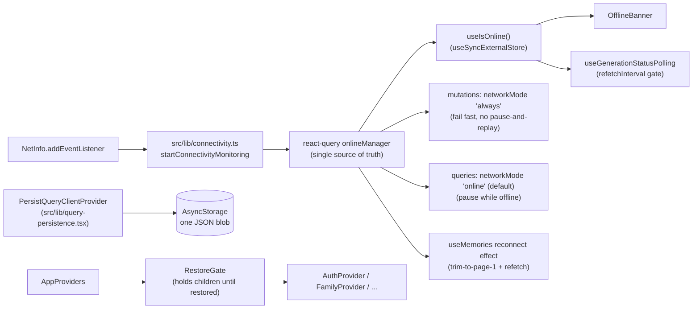

# Feature: Offline awareness

**Status:** `done`
**Last updated:** 2026-08-05
**PRD reference:** [docs/plans/offline-awareness-and-share-cards.md](../plans/offline-awareness-and-share-cards.md) Workstream O

## Overview

Momora is a paid, save-first journal that parents open one-handed on the
subway, at a playground with spotty wifi, or on a plane. Before this
workstream the app had no idea whether the device was online: queries
refetched blindly, mutations hung silently offline (react-query v5's
`networkMode: 'online'` default was inert because nothing set
`onlineManager`), and a cold app launch with no network showed an empty
timeline even though the data had been fetched minutes earlier. This feature
adds a single source of truth for connectivity, a slim "you're offline"
banner, cache persistence across app restarts, and offline-aware mutation
behavior (fail fast with a friendly message instead of hanging).

It does **not** add offline write queuing for text posts (draft autosave
already protects unsaved content) or offline creation of new memories beyond
the existing pending-media-upload queue's own retry semantics.

## User-facing behavior

- **Offline banner** (`src/components/offline-banner.tsx`): a slim overlay
  pinned to the top of the `(app)` Stack. Offline shows "You're offline —
  showing what's saved."; reconnecting shows "Back online" for ~2 seconds,
  then hides. It renders as an absolute overlay (not in normal layout flow)
  specifically so it never double-counts the top safe-area inset that the
  calendar's fixed header and the timeline's header already own — see the
  component's own comment. It does **not** appear over `new-memory` or edit
  modals (`presentation: 'modal'` visually covers a layout-level banner on
  iOS); those screens use inline errors instead (see Mutations below).
- **Cached reads**: the timeline, calendar, family roster, portrait
  versions, and account/family profile all read from a cache persisted to
  `AsyncStorage`, so a cold app launch offline shows the last-known state
  instead of an empty/loading screen. Restored data is stale-but-visible;
  normal reconciliation (foreground, pull-to-refresh, reconnect) refreshes
  it once the app is back online.
- **Reconnect**: the timeline reconciles from page 1 (not a refetch of every
  loaded page — see Constraints) the same way the existing app-foreground
  handler does.
- **Mutations fail fast offline** instead of hanging: `new-memory`'s Save
  shows "You're offline — your draft is safe; try again when you're back";
  every other mutation in the app (likes, comments, profile edits, family
  management, billing, ...) now surfaces a normal network-error message
  immediately rather than silently queuing.
- **Pending media uploads**: a failed upload caused by connectivity auto-
  retries once when the device reconnects. A failure for any other reason
  (content-safety rejection, validation, usage limit) never auto-retries —
  the user's manual Retry/Discard stays the only path for those.
- **Background polling** (illustration/emotion generation status) pauses
  while offline and resumes on reconnect; Supabase Realtime already
  reconnects and reconciles on its own (see Architecture).

## Architecture



`startConnectivityMonitoring()` is called once from `AppProviders` (same
lifecycle slot as the existing `focusManager` wiring) and reflects NetInfo
state into react-query's `onlineManager` singleton for the whole app
session. Everything else — the banner, the reconnect-refetch effects, the
offline-gated poll, and the mutation `networkMode` default — reads from that
one singleton rather than each maintaining its own connectivity state.

Realtime (`useMemoriesRealtime.ts`) needed no new code: supabase-js
reconnects its own socket, and the channel's existing `SUBSCRIBED` handler
already forces one tick of the generation-status poll on **every**
`SUBSCRIBED` transition — initial subscribe and rejoin-after-a-gap alike —
which is the catch-up path for anything missed while disconnected.

## Data model

No new tables or columns. The persisted client-side cache lives entirely in
`AsyncStorage` under one key (`PERSISTED_QUERY_CACHE_KEY` in
`src/lib/query-persistence.tsx`, currently `'momora-query-cache'`) — the
async-storage persister stores the whole dehydrated react-query client as a
single JSON blob, not per-query rows.

| Storage | Role |
|---------|------|
| `AsyncStorage['momora-query-cache']` | One JSON blob: every allow-listed query's dehydrated state, `buster`, and `timestamp`. Purged wholesale on sign-out/family-leave/account-deletion — see Constraints. |

## API & Edge Functions

None. This feature is entirely client-side.

## Client integration

| Layer | Files | Responsibility |
|-------|-------|----------------|
| Connectivity | `src/lib/connectivity.ts` | `startConnectivityMonitoring()` (NetInfo → `onlineManager`), `useIsOnline()` hook |
| Persistence | `src/lib/query-persistence.tsx` | Allow-list (`shouldDehydrateQuery`), InfiniteData-trimming `serialize`, `asyncStoragePersister`, `clearPersistedQueryCache()`, `PersistedQueryProvider` (swaps in `PersistQueryClientProvider` + the restore gate) |
| Mutation default | `src/lib/query-client.ts` | `mutations: { networkMode: 'always' }` |
| Providers | `src/components/app-providers.tsx` | Wires `startConnectivityMonitoring` + `PersistedQueryProvider` |
| Banner | `src/components/offline-banner.tsx`, `app/(app)/_layout.tsx` | Overlay banner, mounted around the whole `(app)` Stack |
| Reconnect refetch | `src/hooks/useMemories.ts` (`useMemories`, `useMemberMemories`) | `refetchOnReconnect: false` + explicit trim-to-page-1 reconnect effect |
| Recovery/backfill gating | `src/hooks/useMemories.ts`, `src/services/memories.ts` (`retryMemoryIllustration`) | `query.isFetchedAfterMount` gate; `dispatched` flag on the retry response |
| Mutation UX | `app/(app)/new-memory.tsx` | Offline-specific inline error on Save |
| Pending uploads | `src/hooks/use-pending-memory-uploads.tsx`, `src/utils/network-errors.ts` | Failure-cause tagging (`isNetworkFailure`), auto-retry-once-on-reconnect |
| Background poll | `src/hooks/useGenerationStatusPolling.ts` | `refetchInterval` offline gate, reactive wake via `useIsOnline()` |
| Purge hooks | `src/hooks/use-auth.tsx` (`signOut` + a session-transition backstop for forced sign-out/eventual account hard-deletion), `src/hooks/use-family.tsx` (`justLostAccess` effect), `app/(app)/(tabs)/settings.tsx` (`handleLeave`) | `clearPersistedQueryCache()` call sites |

### How to invoke from another feature

1. **Read connectivity reactively:** `import { useIsOnline } from '@/lib/connectivity'`. It's a plain hook (`useSyncExternalStore` over `onlineManager`) — safe to call from any component, no provider needed beyond `AppProviders` already having called `startConnectivityMonitoring()` once.
2. **Add a new query that should survive a restart:** add its base key to `PERSISTABLE_QUERY_KEY_BASES` in `src/lib/query-persistence.tsx`. New queries default to **not** persisting — this is an allow-list, not a deny-list (see cacheKey/persistence rationale below).
3. **Add a new mutation:** nothing to do — `networkMode: 'always'` is the `QueryClient` default, so every `useMutation` gets fail-fast-offline behavior automatically.
4. **Add a purge trigger:** call `clearPersistedQueryCache()` (from `@/lib/query-persistence`) at the point access is revoked. It clears both the in-memory `queryClient` and the persisted `AsyncStorage` blob.

## Extension guide

**Safe to extend**

- Add more query key bases to the persistence allow-list as new
  cross-session-useful queries are added.
- Add more `networkMode: 'always'`-aware inline error copy to other
  screens, following `new-memory.tsx`'s pattern (`useIsOnline()` +
  branch in the mutation's catch handler).
- Extend `isNetworkFailure` (`src/utils/network-errors.ts`) with more
  message patterns if a new transport surfaces an unfamiliar error string.

**Do not change without updating this doc**

- The persistence allow-list's default-deny posture — don't flip it to a
  deny-list. A forgotten exclusion (e.g. a future auth/session-shaped query)
  cold-booting from a stale persisted cache is a much worse failure mode
  than an extra network round-trip.
- The `refetchOnReconnect: false` + explicit trim-to-page-1 reconnect effect
  pairing on `useMemories`' infinite query — removing the `false` alone
  reintroduces the whole-loaded-timeline refetch this workstream (and the
  earlier focus-refetch fix it mirrors) removes.
- The `isFetchedAfterMount` gate on the illustration-recovery and
  emotion-backfill effects (both the list hook's and the detail hook's --
  `useMemory`'s own recovery effect gates on `isPlaceholderData ||
  !isFetchedAfterMount`, since data hydrated directly into the detail
  query's cache entry, e.g. by a persisted-cache restore, reads
  `isPlaceholderData: false` immediately even though no network fetch has
  happened yet), and the `dispatched` flag on `retryMemoryIllustration`'s
  return value — removing either reopens the "finished illustration flashes
  back to pending" bug that cache persistence turns from a rare race into a
  routine cold-start event.
- `PERSISTED_QUERY_CACHE_BUSTER` — bump it in the same change as any
  persisted query's cached data SHAPE change (not just new fields; a
  structural change like the InfiniteData migration is the cautionary
  tale). A stale buster means the library silently discards the whole
  persisted cache on restore, which is the safe failure mode — but a
  missed bump on a real shape change would feed old-shaped data into a
  hook that assumes the new one.

## Constraints & gotchas

- **Persist-size discipline (Android hard constraint):** the async-storage
  persister stores the entire dehydrated client under ONE `AsyncStorage`
  key, and Android throws "Row too big to fit into CursorWindow" reading
  rows over ~2MB — writes succeed, restores fail. A deep-scrolled timeline
  would otherwise persist every loaded `InfiniteData` page. The custom
  `serializePersistedClient` trims every memories-list query down to its
  FIRST page before it's ever written — this is functionally free (restored
  data is stale-but-visible either way, and the reconnect/foreground
  trim-refresh reconciles from page 1 regardless of how many pages were
  cached in memory).
- **Restore failure is handled by the library, not custom code:** a
  corrupt or oversized persisted payload makes `persistQueryClientRestore`
  throw; the library's own `persist.ts` already calls `persister.removeClient()`
  before rethrowing, and `PersistQueryClientProvider` catches that rethrow
  internally. Net effect: a bad payload is discarded and the app starts
  clean, never a crash loop. See `query-persistence.test.ts`'s
  `restore-failure` case.
- **Restore gate, not a "verify no flash" afterthought:** `AppProviders`
  holds `AuthProvider`/`FamilyProvider`/... (and therefore every query they
  own) behind `useIsRestoring()` until restore settles. Restore from
  `AsyncStorage` is fast (<100ms typical) — this removes the empty-state
  flash risk by construction instead of hoping nothing races it.
- **Never reintroduce an all-pages refetch.** `refetchOnWindowFocus` and
  `refetchOnReconnect` are both `false` on the infinite memories queries for
  the same reason: react-query v5 refetches EVERY currently loaded page of
  a stale infinite query by default, and the timeline tab never unmounts —
  the trim-to-page-1-then-refetch effects (foreground and reconnect) are
  the only reconciliation path.
- **`retryMemoryIllustration`'s `dispatched` flag is load-bearing.** A
  persisted, hours-old `generating` row can look stale to the CLIENT while
  the server already finished it. The function always re-checks the
  server's current row before dispatching; when it was already settled (or
  a fresh, non-stale `generating` run), it returns
  `{ error: null, dispatched: false }` and callers must NOT optimistically
  patch the cache to `pending` on that response.
- **`isNetworkFailure` is a heuristic, not a discriminated error type.**
  `postMediaMemory`'s error path collapses every failure (validation,
  content-safety rejection, usage-limit, genuine network failure) down to a
  plain `Error` with only a `.message` by the time it reaches the
  pending-uploads queue — there's no structured `code` left to switch on.
  The heuristic pattern-matches network-ish wording and falls back to the
  device's current online state as a corroborating signal.
- **Persisted caches can go stale in a way that matters for authorization**,
  not just freshness: a role change or removal from a family while offline
  can leave stale-but-visible rows the user no longer has access to. This
  is accepted for sign-out and the normal 7-day `maxAge`; the hard cases
  (sign-out, leaving/being removed from a family, account deletion) purge
  the persisted cache explicitly rather than relying on `maxAge` alone.
- **Purge is a full wipe, not per-family.** Persisted query data is scoped
  by `familyId` inside each query key, so in principle only one family's
  slice needs evicting on a leave/removal — but the whole client lives
  under one `AsyncStorage` key (see Persist-size discipline above), so
  there's no cheaper way to evict just one slice. `clearPersistedQueryCache()`
  clears everything, including other families the user still belongs to;
  they refetch normally on next view. Known gap: being removed from ONE of
  several families you belong to (not your only family) is not currently
  detected passively — only an explicit self-leave (`settings.tsx`) or
  dropping to zero memberships (`use-family.tsx`'s `justLostAccess`)
  triggers a purge today.
- **`OfflineBanner` is an overlay, not a layout-flow element**, specifically
  to avoid double-counting the top safe-area inset against the calendar's
  own fixed `SafeAreaView(edges: ['top'])` header and the timeline header's
  `SafeAreaView`. Don't refactor it to push content down without re-checking
  both tabs' top spacing.

### Why `media-urls` is on the persist allow-list

This looks backwards at first: `media-urls` caches short-lived R2 **signed
URLs**, so persisting them across a 7-day `maxAge` sounds like it just
caches expired links. It's intentional and required: `expo-image` only
consults its disk cache when it's given a `source` to look up in the first
place. If `media-urls` were excluded from the persist allow-list, an
offline cold start would leave `useMediaUrl` returning `undefined`, and
every image would render its placeholder — even though the bytes are
already sitting on disk under a stable `cacheKey` (see below). An EXPIRED
persisted URL is harmless either way: with `cacheKey` set, a disk-cache hit
never touches the network at all, and a miss just fails exactly like having
no URL would. Excluding it would silently cancel out the whole point of
pinning `cacheKey` to the object key.

### cacheKey rationale (Workstream O5 — implemented by a different change)

R2 signed URLs rotate hourly; `expo-image` caches by URI by default, so
every re-sign orphans the on-disk cache for bytes that are still perfectly
valid. `src/utils/media-image-source.ts`'s `mediaImageSource(uri, objectKey)`
helper pins `cacheKey` to the stable R2 **object key** instead, so a freshly
re-signed URL for the same underlying object still hits the disk cache. This
is the other half of what makes offline (and cache-hit-rate generally) work:
`media-urls` being persisted (above) gets `useMediaUrl` a URL to hand
`expo-image` at all; `cacheKey` is what makes that URL resolve to bytes
already on disk instead of a network fetch. Either half alone is
insufficient — persisting `media-urls` without `cacheKey` still refetches on
every URL rotation; `cacheKey` without a persisted URL has nothing to key
against on a cold start.

This relies on an invariant documented in
[media-memories.md](./media-memories.md) and enforced by convention, not by
code: illustration regeneration, portrait versions, and media edits all mint
a **fresh** object key per attempt — nothing in this app overwrites an
existing key's bytes in place. If that ever changes, `cacheKey = objectKey`
could pin stale bytes for any client that already cached the old content
under that key. Don't introduce an in-place overwrite without revisiting
this.

## Dependencies

- Depends on: [Memories & illustrations](./memories.md) (the timeline/detail
  queries this workstream persists and reconciles), [Media memories](./media-memories.md)
  (the `cacheKey` invariant above)
- Used by: every screen that reads family-owned data — the persistence and
  reconnect behavior is cross-cutting, not opt-in per screen

## Testing

### Unit tests

| File | Covers |
|------|--------|
| `src/lib/connectivity.test.ts` | NetInfo → `onlineManager` reflection, `isInternetReachable: null` treated as online, `useIsOnline()` reactivity |
| `src/lib/query-client.test.ts` | Pins `mutations.networkMode: 'always'`, leaves queries on the default |
| `src/lib/query-persistence.test.ts` | Allow-list inclusion/exclusion, InfiniteData-trimming serialize, buster invalidation, restore-failure (corrupt/oversized payload → clean start), purge helper |
| `src/components/offline-banner.test.tsx` | Offline/back-online/hidden phases, accessibility announcements, stale-timer cancellation |
| `src/utils/network-errors.test.ts` | `isNetworkFailure` heuristic (message patterns + online-state fallback) |

### Integration tests

| File | Scenarios |
|------|-----------|
| `src/components/app-providers.test.tsx` | Connectivity monitoring start/teardown, restore gate holds children until settled |
| `src/hooks/useMemories.integration.test.tsx` | Reconnect trim-refresh, `isFetchedAfterMount`-gated recovery/backfill on both the list and detail hooks (including data hydrated directly into the detail cache, which `isPlaceholderData` alone does not catch), `dispatched`-gated cache patch (including the "server already resolved it" regression case) |
| `src/services/memories.integration.test.ts` | `retryMemoryIllustration`'s `dispatched` flag across all early-return and dispatch paths |
| `src/hooks/use-auth.integration.test.tsx` | Purge fires on successful sign-out, never on a failed one; the session-transition backstop purges on a forced sign-out that never calls `signOut()`, and stays a no-op for an anonymous-only session |
| `src/hooks/use-family.integration.test.tsx` | Purge backstop on the `justLostAccess` edge; no purge for a brand-new zero-family user |
| `src/screen-tests/settings.family-section.test.tsx` | Purge on explicit `leaveFamily()` before the memberships refetch |
| `src/screen-tests/new-memory.integration.test.tsx` | Offline-specific inline error text (not the raw error) on Save |
| `src/hooks/use-pending-memory-uploads.test.tsx` | Failure-cause tagging, auto-retry-once for network failures, no auto-retry for safety-rejected failures |
| `src/hooks/useGenerationStatusPolling.test.tsx` | Offline gate stops periodic polling; reconnect wakes it |
| `src/hooks/useMemoriesRealtime.test.tsx` | SUBSCRIBED-reconcile fires again on rejoin after an offline gap, not just on initial subscribe |

### Run this feature's tests

```bash
npm test -- --runInBand \
  src/lib/connectivity.test.ts \
  src/lib/query-client.test.ts \
  src/lib/query-persistence.test.ts \
  src/components/offline-banner.test.tsx \
  src/components/app-providers.test.tsx \
  src/utils/network-errors.test.ts \
  src/hooks/useMemories.integration.test.tsx \
  src/services/memories.integration.test.ts \
  src/hooks/use-auth.integration.test.tsx \
  src/hooks/use-family.integration.test.tsx \
  src/screen-tests/settings.family-section.test.tsx \
  src/screen-tests/new-memory.integration.test.tsx \
  src/hooks/use-pending-memory-uploads.test.tsx \
  src/hooks/useGenerationStatusPolling.test.tsx \
  src/hooks/useMemoriesRealtime.test.tsx
```

Device smoke (not automated): airplane-mode pass — banner appears/hides on
both tabs without a layout jump, timeline/calendar show cached content on a
cold offline launch, reconnect reconciles the timeline, a pending media
upload auto-retries once on reconnect, `new-memory` Save shows the offline
copy.

## Changelog

| Date | Change |
|------|--------|
| 2026-08-05 | Initial implementation: connectivity foundation, offline banner, reconnect refetch strategy, cache persistence with restore gate and purge hooks, fail-fast mutations, pending-upload failure tagging + auto-retry, offline-gated background poll |
