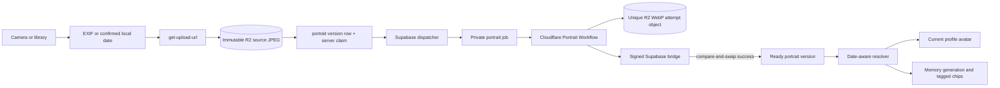

# Portrait timeline

Age-aware profile-photo and character-portrait history for each person in a family.

**Status:** `done`
**Last updated:** 2026-07-22
**PRD reference:** [PRD §6.2 Family Profiles](../PRD.md)

## Overview

A family member can have many immutable source-photo/AI-portrait pairs over time. This preserves how a person looked at different ages and lets memory generation, regeneration, timeline cards, and memory-detail chips use the portrait appropriate to the memory date.

`family_members` remains the person/profile table. `family_member_portrait_versions` is its one-to-many visual history; it does not replace the member row.

## User-facing behavior

- The member detail screen exposes the history through a compact clock/history icon.
- The portrait timeline shows paired source photos and illustrated portraits, newest first, with the photo date and the member's age on that date. It does not add image-type or date-provenance pills to the timeline or date-confirmation UI.
- A **Current** badge marks the portrait selected for today by the canonical resolver.
- Owners and managers can add a camera or library photo, confirm/edit its date, edit an existing date, regenerate a portrait, retry a failed portrait, or delete an eligible version.
- The date confirmation sheet uses its date-and-age card as the date-picker trigger; an edit icon communicates that the card is interactive without repeating the date in a second field.
- Library photos use trustworthy EXIF shutter/digitized dates when present. Otherwise the date starts at the acting user's local today and remains editable. Camera photos use today.
- Portrait dates cannot predate the member's DOB or exceed the acting user's current local date. Multiple photos on the same date are allowed.
- A failed or in-progress generation never displaces an older ready portrait. Regeneration keeps the previous output visible until a new attempt succeeds.
- Portrait generation is durable: the request queues a Cloudflare Workflow while Supabase continues to own authorization, the public status row, and compare-and-set publication. A prior ready portrait stays visible throughout regeneration and after failure.
- Managers recover an unclaimed `pending` version after three minutes and a claimed attempt after five minutes thirty seconds. Recovery only re-invokes the server endpoint; it never writes a portrait status, claim token, or timestamp from the app. The recovery key is `(version id, generation token or immutable pending-row creation time)`, so it fires once per attempt. Viewers only observe and poll; failed versions require a manual retry.
- There is no automatic “better portrait available” prompt and no automatic regeneration of old memories when portrait history changes.
- Viewers can see the timeline but cannot mutate it.

## Architecture / data flow

Create order is upload source → create row through the authorized RPC → invoke generation. If row creation fails, the client requests rollback deletion of the unreferenced source. The Supabase dispatcher freezes the prompt/source/style keys into a private job and sends only its deterministic job ID to Cloudflare. Generated attempts use a unique object key; the DB claim token ensures a stale attempt cannot overwrite a newer result.

## Data model

### `family_member_portrait_versions`

| Column | Purpose |
|--------|---------|
| `id`, `family_id`, `family_member_id` | Stable version identity and family ownership |
| `user_id` | Immutable creator attribution; may become null during account hard-delete |
| `reference_date` | The date represented by the source photo; null only for migrated unknown legacy dates |
| `date_source` | `exif`, `manual`, `default_today`, or `legacy_unknown` |
| `profile_picture_key` | Immutable, metadata-free source JPEG key |
| `illustrated_profile_key` | Last successful generated portrait key |
| `illustrated_profile_status` | `pending`, `generating`, `ready`, or `failed` |
| generation claim fields | Token, start time, and unique output key for compare-and-swap generation |
| deletion claim fields | Token and start time for idempotent storage/row deletion |

RLS permits family members to read rows. Only owner/manager operations exposed through narrowly authorized RPCs and Edge Functions can create, edit dates, generate, or delete.

### `portrait_generation_jobs` and bridge nonces

The private job row holds the Workflow/attempt identity, frozen prompt and references, provider counters/deadline, output and old-key cleanup data, and a sanitized terminal result. It has no client RLS policy and its private prompt/reference fields are scrubbed at terminal state. `portrait_generation_workflow_bridge_nonces` prevents replay of timestamped Worker-to-Supabase bridge messages. The app reads only `family_member_portrait_versions`.

### R2 layout

| Key pattern | Purpose |
|-------------|---------|
| `{uploaderId}/family/{memberId}/portraits/{versionId}/photo.jpg` | Immutable normalized source photo |
| `{uploaderId}/family/{memberId}/portraits/{versionId}/portrait/{attemptId}.webp` | Unique generation attempt/output |

Legacy `{uploaderId}/family/{memberId}/photo.webp` and `portrait.webp` objects remain only during cutover and are never referenced by migrated version rows.

## Portrait selection rule

Given a member, target date, and only usable rows (`ready`, non-null portrait key, not deleting), choose:

1. Latest dated portrait on or before the target date.
2. If none, earliest dated portrait after the target date.
3. If none, the usable undated legacy portrait.
4. Otherwise no portrait.

Same-day ties choose `created_at DESC`, then `id DESC`. The second rule intentionally favors the nearest known age over an undated legacy image when a memory predates all dated portraits.

The same resolver is used for today's family avatar, portrait-timeline **Current** state, memory-generation references, timeline chips, and memory-detail chips. A source photo may be shown as a profile fallback when no ready portrait exists, but it is never passed to memory illustration generation as a character portrait.

## API & Edge Functions

| Function / RPC | Input | Result / responsibility | Auth |
|----------------|-------|-------------------------|------|
| `create_family_member_portrait_version` | version id, member id, date/source, exact source key | Validates family, local date, DOB, and caller-owned key; inserts row | authenticated owner/manager |
| `update_family_member_portrait_version_date` | version id, date | Validates local date/DOB and changes source to `manual` | authenticated owner/manager |
| `generate-portrait-illustration` | `{ portraitVersionId }` | Public request is unchanged. The client accepts either the legacy `{ success: true }` acknowledgment or the queued `{ success: true, queued: true, jobId? }` form. Cloudflare creates a private job and dispatches the durable Workflow. | JWT owner/manager |
| `workflow-portrait-bridge` | HMAC-authenticated job operation | Private job input, provider reservation, publication/reconciliation/failure, and dependent-memory retriggering; no browser route or Supabase service-role key in Cloudflare | Worker HMAC + nonce |
| `delete-portrait-version` | `{ portraitVersionId }` | Claims deletion, removes all version objects, then deletes row | JWT owner/manager |
| `delete-family-member` | `{ familyMemberId }` | Enumerates legacy and version objects before deleting the member | JWT owner/manager |
| `get-upload-url` | version photo key, JPEG, family id | Presigns caller-owned source upload | JWT owner/manager |
| `get-media-url` | version keys | Resolves version/member family before signing | JWT family member |

The generation endpoint intentionally no longer accepts `{ familyMemberId }`. This is a coordinated app/backend cutover, not a writable old-client compatibility window; allowing old clients to overwrite stable legacy objects would violate version immutability.

## Client integration

| Layer | Files |
|-------|-------|
| Route | `app/(app)/family/[id]/portraits.tsx` |
| Hooks | `src/hooks/usePortraitVersions.ts`, `src/hooks/useFamilyMembers.ts`, `src/hooks/useMemories.ts` |
| Services | `src/services/portrait-versions.ts`, `src/services/family-members.ts`, `src/services/memories.ts` |
| Components | `src/components/portrait-timeline.tsx`, `src/components/cast-card.tsx` |
| Utils | `src/utils/portrait-versions.ts`, `src/utils/family-profile-photo-picker.ts`, `src/utils/storage-keys.ts` |

Portrait-version queries are family-batched, then grouped by member. Memory lists batch portrait rows and signed URL requests; do not issue one version or signing request per `(memory, member)` chip.

Versioned source and portrait object keys are also their image-cache identities. Metadata-only updates such as correcting `reference_date` must not invalidate signed media URLs or clear an already displayed image. `expo-image` receives stable object-key cache keys so immutable portraits can be restored from the device cache across app launches; signed URL refreshes retain the previous URL while a replacement is fetched.

## Legacy migration

Run `supabase/scripts/migrate-legacy-portrait-versions.ts` without flags first. The audit reads the actual object bytes despite misleading legacy extensions, trusts only EXIF original/digitized capture dates within DOB/today bounds, and reports uncertain records as `legacy_unknown` for manual review. `--apply` normalizes source photos to metadata-free JPEG, copies legacy portraits to immutable keys, verifies copied objects, then inserts deterministic/idempotent version rows. It does not delete the stable legacy objects.

The migration runner requires `ffmpeg` on `PATH` as a fallback for older WebP/HEIC/AVIF uploads that ImageScript cannot decode directly.

Cutover order is operationally significant:

1. Ship the schema/Edge release, which creates the version table and deliberately rejects legacy portrait writes/deletes.
2. Immediately run and review the migration dry run, then `--apply`; verify every legacy member has a version row and immutable objects.
3. Ship/enable the new client, which reads portrait versions and sends only `{ portraitVersionId }` generation requests.
4. Audit old stable objects separately before any later cleanup. Do not point migrated rows at them or re-enable old-client writes.

The new client may fall back to legacy member columns only during controlled rollout surfaces; production activation should wait for step 2 so every existing member has canonical version history.

## Extension guide

- Follow the [Durable AI generation workflow playbook](../durable-ai-generation-workflows.md) when extending this executor. Do not flatten portrait claims, retained-output rules, deletion races, or dependent-memory retriggers into the memory state machine.
- Reuse `resolvePortraitVersion`; do not implement local “closest portrait” variants.
- Add new visual consumers by loading versions in batches and resolving against that consumer's target date.
- Preserve immutable source keys and unique output-attempt keys.
- Keep generation state server-owned. Client timeouts must only refetch; they must never mark attempts failed directly.
- Keep the client recovery thresholds aligned with the server: unclaimed pending at three minutes; claimed work at five minutes thirty seconds. A stalled UI retry always goes through `generate-portrait-illustration`; it must not mutate claim columns.
- Any new storage reference must be added to both owned-family deletion collection and the surviving-reference set used during non-owner account deletion.
- Date rules belong in the DB/RPC as well as the UI. A client-only DOB or future-date check is insufficient.

## Constraints & gotchas

- Dates are calendar dates, not instants. Server validation uses `user_profiles.timezone` for the acting user's local today.
- `legacy_unknown` is migration-only; new client/RPC writes must always be dated.
- DOB changes are rejected in the DB if they would move DOB after an existing dated portrait.
- Multiple same-day versions are valid and deterministic.
- A member cannot lose their only version or last usable portrait through version deletion. Whole-member deletion uses a dedicated path that performs storage cleanup before the FK cascade.
- Generation and deletion claims are service-role-only DB operations after Edge Function JWT/role authorization.
- The durable Workflow has a five-minute application lease and reserves thirty seconds for publication. The legacy Edge path remains behind `PORTRAIT_GENERATION_BACKEND=legacy` for rollback. Cloudflare receives only a job ID and has no Supabase service-role key.
- Both the frozen source photo and style reference are mandatory; Cloudflare resizes each to 1024px, sends style first and source second, writes WebP, and never falls back to text-only generation. `gpt-image-2` gets one bounded attempt; retryable provider failures may use one reference-aware `gpt-image-1.5` attempt with high input fidelity.
- Unclaimed pending recovery is derived from immutable `created_at`, never `updated_at`, so normal metadata edits cannot indefinitely postpone it. Claimed work uses `generation_started_at`.
- Hard-delete account cleanup must retain version objects referenced by surviving shared families, even when those keys live under the deleted user's prefix.
- Family/member deletion and account-retention sweeps fail closed when storage-reference enumeration fails; database cascades must never proceed from a partial reference set.

## Testing

| Layer | Files |
|-------|-------|
| Unit | `src/utils/portrait-versions.test.ts`, `src/hooks/useMediaUrls.test.ts`, `src/components/portrait-timeline.test.tsx`, `src/components/cast-card.test.tsx` |
| Integration | `src/services/portrait-versions.integration.test.ts`, `src/services/family-members.integration.test.ts`, `src/hooks/usePortraitVersions.integration.test.tsx`, `src/hooks/useFamilyMembers.integration.test.tsx`, `src/hooks/useMemories.integration.test.tsx`, `src/screen-tests/add-family-member-photo-date.integration.test.tsx`, `src/screen-tests/family-member-portrait-entry.integration.test.tsx`, `src/screen-tests/portrait-timeline.integration.test.tsx` |
| E2E | `.maestro/flows/portraits/view-portrait-timeline.yaml` |
| Deno | `supabase/functions/_shared/portrait-versions.test.ts`, `generate-portrait-illustration/index.test.ts`, `workflow-portrait-bridge/index.test.ts`, `generate-illustration/index.test.ts`, `delete-portrait-version/index.test.ts`, `delete-family-member/index.test.ts`, `hard-delete-expired-accounts/index.test.ts`, `_shared/storage-keys.test.ts`, `_shared/family-access.test.ts` |
| Worker | `cloudflare/memory-illustration-worker/test/portrait-*.test.ts` — signed dispatch, reference loading/order, WebP/OpenAI policy, replay/reservation, publication reconciliation, cleanup, and dependent-memory retrigger |
| Database | `supabase/tests/portrait_generation_workflow.sql` — private-job/bridge RLS, one-use reservations, exact upload-token replay/completion, retained-output publication, stale upload/deletion fencing, and family-memory fence behavior; `account_deletion_fences.sql` — exact soft-delete provenance, expiry, and hard-delete serialization |

Additional unit coverage lives in `src/utils/family-profile-photo-picker.test.ts`, `src/utils/storage-keys.test.ts`, `src/utils/e2e-fixtures.test.ts`, and `src/components/family-profile-portrait-photo.test.tsx`.

Stalled-generation regression coverage lives in `src/utils/portrait-versions.test.ts`, `src/hooks/usePortraitVersions.integration.test.tsx`, `src/components/portrait-timeline.test.tsx`, and the Supabase/Worker portrait Workflow tests. It covers the 3:00/5:30 boundaries, manager-only once-per-attempt recovery, viewer/failed behavior, polling, and compatible legacy/queued service responses.

Run focused client tests with `npm test -- --runInBand portrait`, Edge tests with `npm run test:edge`, and the device flow with `maestro test .maestro/flows/portraits/view-portrait-timeline.yaml`.
