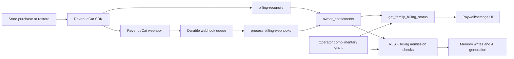

# Feature: Paid subscriptions

**Status:** `implementation complete; store release pending`
**Last updated:** 2026-08-02
**PRD reference:** [PRD §6.9](../PRD.md#69-paid-access-and-data-export)

## Overview

Momora Plus is a store-managed subscription for family owners. RevenueCat
normalizes Apple App Store and Google Play purchases, while Supabase keeps a
small server-side entitlement ledger that gates writes and AI generation. The
owner is the billing principal; invited household members inherit the owner's
family access. Selected owners may also receive an operator-managed,
owner-wide complimentary grant; it is separate from RevenueCat and can be
permanent or expiring. The archive remains readable and exportable after a
lapse.

## User-facing behavior

- New owners save their first capture before account creation and see the
  trust screens and paywall after authentication.
- If an owner has already created the family but has not purchased, then
  leaves and later restarts onboarding, the same first-time trial paywall is
  used. The pending capture stays on the device and is committed after the
  purchase; an owner with prior store history is sent to the no-trial
  resubscribe variant instead.
- The paywall presents annual Momora Plus by default ($99.99/year). It shows
  the seven-day-trial copy only after RevenueCat confirms that the current
  customer is eligible for the annual introductory offer. Monthly purchases,
  and annual purchases whose eligibility is unknown (including Android until
  the store confirms it), show the paid-now copy instead; there is no weekly
  plan.
- Store purchase, restore, and current-price loading are handled by
  RevenueCat. The app does not treat tapping through the paywall as access.
- A successful first purchase starts the pending onboarding illustration in
  the background. An illustration failure never removes the saved memory.
- Owners with an expired subscription can browse and export the archive, but
  new memory writes, likes/comments, media changes, and AI generation are
  gated behind a resubscribe paywall. The resubscribe path does not re-offer a
  trial. Invited viewers also cannot create engagement writes unless the
  family owner has active billing (or an explicitly configured grace window).
- Settings shows the current plan/status, trial end or renewal information,
  a native “Manage subscription” link when the store supplies one, restore,
  and the owner-only archive export action.
- Owners with an active complimentary grant see “Complimentary Momora Plus
  access” in Settings and never see the purchase paywall. The grant applies to
  every family they own.
- Joiners never see the paywall; access is evaluated against the family
  owner's entitlement.
- A paid, trial, grace-period, legacy-grace, or complimentary owner is
  handed through the paywall only after the server confirms write access.
  If the billing lookup fails at the front door, Momora stops on a retry
  screen instead of opening the journal or offering a purchase based on a
  fallback.
- If RevenueCat returns no active offering, the paywall shows a retry state;
  it never renders a made-up annual package that could look purchasable.

## Architecture



RevenueCat is the store-facing source of truth. Webhooks are authenticated
with a dedicated secret, queued before application, and processed by a cron
worker. The mobile app also reconciles the current RevenueCat subscriber
through the server API after purchase/restore and at scheduled refreshes, so a
missed webhook does not strand a legitimate purchaser. Production and sandbox
entitlements are stored separately; sandbox access is disabled by default and
must be explicitly enabled only in a non-production project.

## Data model

| Table / bucket | Role in this feature |
|----------------|----------------------|
| `billing_settings` | Enforcement mode, cutover, sandbox flag, fair-use limits, store grace configuration |
| `billing_products` | Allowlist of the four production product IDs and their period types |
| `owner_entitlements` | Normalized owner/store/environment entitlement ledger |
| `owner_complimentary_access` | Private owner-wide permanent or expiring free-access grants |
| `billing_webhook_events` | Idempotent durable RevenueCat event queue with event timestamps |
| `billing_dead_letters` | Unsupported or malformed events for operator review |
| `billing_trial_reminder_outbox` | Idempotent email/push reminders due 48 hours before trial expiry |
| `onboarding_commits` | Idempotent first-family/first-capture commit record |
| `families.billing_grace_until` | Legacy/new-family grace window used during rollout |
| `memories.onboarding_attributed` | One-time marker consumed by the first paid onboarding illustration admission |
| `memories.onboarding_media_pending`, `onboarding_media_pending_until` | Temporary post-capture media hand-off; cleared when media upload finalizes |

`owner_entitlements` and `owner_complimentary_access` are private to
server/operator processing. Clients can call only
`get_family_billing_status`, which first verifies household membership. RLS
and security-definer billing helpers require the acting user to be an
owner/manager in the exact family and require an allowed production
entitlement, an active complimentary grant, or an explicit grace window.

## Store products

| Store | Product ID | Plan | Price | Trial |
|-------|------------|------|-------|-------|
| App Store | `momora_annual_v1` | annual | $99.99/year | 7 days |
| App Store | `momora_monthly_v1` | monthly | $12.99/month | none |
| Play Store | `momora:annual` | annual/base plan `annual` | target $99.99/year | 7-day offer target; base plan pending |
| Play Store | `momora:monthly` | monthly/base plan `monthly` | target $12.99/month | none; base plan pending |

RevenueCat entitlement: `momora_plus`; offering: `default`; annual package is
`$rc_annual` and monthly package is `$rc_monthly`.

Dashboard status on 2026-08-01: the RevenueCat project, entitlement, offering,
webhook, and SDK keys are configured. The App Store products are still
`Prepare for Submission`, and Google Play's subscription shell exists but its
base plans could not be saved because Play Console returned a generic save
error. Store release remains blocked until those products/base plans are
submitted and active.

## API & Edge Functions

| Function / endpoint | Input | Output | Auth |
|---------------------|-------|--------|------|
| `revenuecat-webhook` | RevenueCat event JSON plus the configured `Authorization` header (or internal `x-revenuecat-webhook-authorization`) | `{ status: queued\|dead_letter }` | Shared webhook secret |
| `billing-reconcile` | No user payload; resolves the authenticated RevenueCat app user | Reconciled production and sandbox snapshots | User JWT + RevenueCat secret |
| `billing-reconcile-owners` | Cron header; sweeps stale active/near-expiry owner ledgers | Bounded reconciliation result | `x-cron-secret` + RevenueCat secret |
| `process-billing-webhooks` | Cron header | Claimed and applied queue count | `x-cron-secret` |
| `send-billing-trial-reminders` | Cron header | Claimed/delivered reminder count | `x-cron-secret` |
| `get_family_billing_status` | `p_family_id` | Computed family billing JSON, including `access_reason: complimentary` for an active grant | Authenticated member RPC |
| `assert_billing_write_access` | Family, actor, operation | `true` or subscription error | Internal/service only |
| `billing_ai_generation_check` | Family, actor, target, intent | Admission/limit result | Internal/service only |

Canonical database and Edge Function contracts live in
[TECH_SPEC §4](../TECH_SPEC.md#4-edge-functions). The normal call order is:
store change → RevenueCat SDK → reconcile request and/or webhook → ledger →
family status/admission check.

## Client integration

| Layer | Files | Responsibility |
|-------|-------|----------------|
| Routes | `app/(onboarding)/paywall.tsx`, `app/(app)/new-memory.tsx`, `app/(app)/(tabs)/settings.tsx` | Purchase/resubscribe gate, write gate, management/restore/export controls |
| Hooks | `src/hooks/use-billing.tsx` | RevenueCat configuration, offerings, family status, mutations and refresh |
| Services | `src/services/billing.ts`, `src/services/onboarding.ts`, `src/services/memories.ts` | Store calls, reconciliation, status cache, atomic onboarding and write/error mapping |
| Constants | `src/constants/billing.ts` | Product allowlist and entitlement identifiers |
| Native | `react-native-purchases`, `@react-native-community/netinfo`, `plugins/withAndroidLaunchMode.js` | Store SDK, offline status cache, Google Play verification-safe activity launch mode |

### How to invoke from another feature

1. Call `useBilling().status` for the current family; do not infer access from
   a RevenueCat customer object in UI code.
2. Gate new owner/manager mutations server-side with the existing RLS or
   `billing_ai_generation_check`; client gates are only UX.
3. Use `useBilling().refresh()` after an external store-management action.
4. Preserve `has_write_access: false` behavior: reads and export stay
   available, while mutation UI routes to the resubscribe paywall.

## Extension guide

**Safe to extend**

- Add a store product only by updating the RevenueCat offering, the
  `billing_products` allowlist, client product constants, and the store
  submission checklist together.
- Add another reminder channel through the outbox claim/ack/release pattern.
- Add analytics containing plan/status identifiers only; never include
  memory text, child names, receipt payloads, or transaction secrets.
- Grant or revoke complimentary access only through the operator process in
  [complimentary-access.md](../complimentary-access.md); do not add fake rows
  to `owner_entitlements`.

**Do not change without updating this doc**

- Owner-scoped entitlement semantics and joiner inheritance.
- Production-vs-sandbox filtering and the default `allow_sandbox_access=false`.
- Restore behavior (verify the current RevenueCat App User ID) and the
  explicit wrong-account error.
- Archive readability/export after lapse and the no-trial-reoffer rule.
- Event idempotency and timestamp ordering in the webhook ledger.

## Constraints & gotchas

- RevenueCat public SDK keys belong in EAS environment variables; RevenueCat
  secret API keys, webhook secrets, Supabase service-role credentials, and
  cron secrets never belong in the mobile bundle.
- The annual product is the default package. Product selection is an exact
  allowlist match by store product ID; package-type fallback is forbidden. A
  missing annual package is a configuration error; a missing monthly package
  is tolerated so a store can finish product propagation.
- After a purchase, the client reconciles the server ledger before treating
  the purchase as confirmed. If the store reports success but the ledger has
  not caught up, the UI reports that confirmation is pending and keeps the
  user on the paywall instead of granting access locally.
- Store change listeners and restore can return cached state. The app verifies
  RevenueCat's current App User ID and reconciles server-side before presenting
  success; it does not reject a legitimate aliased account merely because
  RevenueCat's historical `originalAppUserId` differs.
- Webhook delivery is at-least-once and can be out of order. Event IDs are
  unique and older timestamps cannot overwrite a newer entitlement.
- Offline status may use a 15-minute family-status cache for read-only UX;
  the cache never authorizes a new server write.
- `owner_complimentary_access` is owner-wide. A grant follows an owner to
  every family they own, but does not grant access to a family where they are
  only an invited member. `has_ever_had_access` continues to describe store
  entitlement history; `access_reason` identifies complimentary access.
- The first onboarding illustration is a one-time, server-consumed exemption
  from the owner fair-use pool, but still requires active billing access. It
  cannot be replayed by repeatedly marking a memory as onboarding-attributed.
- Store dashboard setup and Supabase secrets must be verified separately for
  development/sandbox and production. Do not enable sandbox access in the
  production database.

## Dependencies

- Depends on: onboarding, family-sharing, memories, usage-limits, Supabase
  Auth/RLS, RevenueCat, App Store Connect, Google Play Billing.
- Used by: onboarding, new-memory, media memories, likes/comments, settings,
  AI illustration and portrait generation.

## Testing

### Unit tests

| File | Covers |
|------|--------|
| `src/services/onboarding.integration.test.ts` | Idempotent owner commit and onboarding attribution |
| `supabase/functions/_shared/billing.test.ts` | Admission error mapping and retryable usage limits |
| `supabase/functions/billing-reconcile/index.test.ts` | Store/environment/product snapshot normalization |
| `supabase/functions/revenuecat-webhook/index.test.ts` | Webhook normalization, Google base-plan IDs and auth |
| `src/services/billing.test.ts` | Exact product selection, trial eligibility and pending confirmation |
| `src/services/export.test.ts` | Export worker download, native sharing and cache cleanup |

### Integration tests

| File | Scenarios |
|------|-----------|
| `src/screen-tests/onboarding.paywall.integration.test.tsx` | Live package selection, purchase/restore success, wrong-account behavior, and complimentary new-owner/resubscribe bypass |
| `src/hooks/use-billing.integration.test.tsx` | RevenueCat logout/login sequencing, including same-user transitions, and prevention of empty offerings cached before customer configuration |
| `src/hooks/use-onboarding-flow.integration.test.tsx` | Account-bound paywall resume state is retained for the same user and cleared for a different user |
| `src/screen-tests/new-memory.integration.test.tsx` | Lapsed-owner resubscribe routing and capture gating |
| `src/screen-tests/settings.notifications.test.tsx` | Subscription status, management, restore and export controls |
| `src/screen-tests/onboarding.code.integration.test.tsx` | Idempotent membership invalidation and preserving a lapsed-owner capture |

### E2E (Maestro)

The store purchase path must be run with Apple sandbox and Play internal-test
accounts on development clients; no automated flow purchases a real product.

### Edge Function tests (Deno)

| File | Covers |
|------|--------|
| `supabase/functions/_shared/billing.test.ts` | Billing admission and error contracts |
| `supabase/functions/billing-reconcile/index.test.ts` | Production/sandbox reconciliation |
| `supabase/functions/revenuecat-webhook/index.test.ts` | Webhook validation and normalization |
| Existing AI function suites | Subscription and usage-limit admission before provider calls |

### Database tests (pgTAP)

| File | Covers |
|------|--------|
| `supabase/tests/paid_subscriptions.sql` | Onboarding idempotency, billing privilege/column ownership, complimentary grants, one-time attribution, paid engagement, lapse behavior and annual-trial reminder rules |

### Run this feature's tests

```bash
npm test -- --runInBand
npm run test:edge
```

## Changelog

| Date | Change |
|------|--------|
| 2026-08-02 | Closed the remaining paywall race: subscription cards and trial/no-trial copy now wait for a refreshed, owner-matched billing status; RevenueCat identity transitions are serialized and stale modes cannot select a product before verification. |
| 2026-08-02 | Hardened paywall hand-off and front-door routing: serialized same-user RevenueCat transitions, owner-only membership guards, durable media queue markers, account-bound resume state, fail-closed billing lookup UI, and no-offering retry UI |
| 2026-08-02 | Added private owner-wide complimentary access grants, onboarding paywall bypass, Settings status, and operator runbook |
| 2026-08-01 | RevenueCat purchase/restore, server ledger, enforcement, reminders and lapsed-owner flow shipped |
