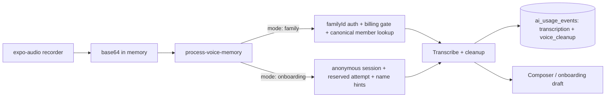

# Feature: Voice journaling (voice input pipeline)

**Status:** `done`
**Last updated:** 2026-08-17
**PRD reference:** §6.5 Voice input

## Scope: this doc vs. audio-memories.md

This doc covers the **voice input pipeline** — recording plus server-side transcription/cleanup — as an *input method* whose output is text and whose audio is **always discarded on the dictation branch**. It has three shipped consumers: the authenticated composer's post-recording fork (dictate-or-keep), the edit screen's dictation-only flow, and the pre-auth onboarding capture screen. [audio-memories.md](./audio-memories.md) (in-progress) is the **memory type** where a recording is instead *kept* as the artifact — it is built directly into this pipeline's flow (the composer's post-recording "Turn into text" / "Keep the sound" fork is `voice-speak-it-modal.tsx`'s `captureMode: 'fork'`) but has its own storage, UI, and lifecycle. The fork UX and the kept-clip contract are documented there; this doc stays the transcription pipeline's contract, including the `description` field the cleanup call now also returns for the fork.

## Overview

Tap-to-record voice (max 2 minutes). Audio is transcribed server-side, cleaned, and name-tagged. On the **dictation** branch (`captureMode: 'dictate'`, the only mode on the edit screen and in onboarding) the transcript becomes editable text and the audio is processed in memory and discarded — never persisted. In the **composer's** first recording (`captureMode: 'fork'`), the user instead chooses after stopping: "Turn into text" is exactly the dictation branch above; "Keep the sound" makes the recording itself the memory artifact — see [audio-memories.md](./audio-memories.md) for that deliberate, scoped exception to no-persistence.

## User-facing behavior

- **Composer (authenticated, first recording):** **New memory** → mic (`voice-speak-it-modal.tsx`, `captureMode: 'fork'`) → stop → two equal-weight choices, **"Turn into text"** (transcript populates content + suggested tags, audio discarded) or **"Keep the sound"** (the memory becomes an `audio` type — see [audio-memories.md](./audio-memories.md)). Recording auto-stops at 2 minutes.
- **Composer (re-record on an already-kept clip):** the toolbar mic re-records with `captureMode: 'keepOnly'` — no fork, the new clip directly replaces the attached one on stop.
- **Edit screen (dictation into an existing memory):** `app/(app)/memory/[id]/edit.tsx` always uses the default `captureMode: 'dictate'` — no fork, ever. An audio memory's clip is immutable post-save, so the edit screen's mic is disabled entirely for `audio` rows rather than offering dictation into one.
- **Onboarding capture (pre-auth, S9):** the guided first-capture screen (`app/(onboarding)/capture.tsx`) records with its own recorder instance and transcribes over an anonymous session before any account or family exists — dictate-only, no fork (the fork cannot exist pre-auth; see Constraints). The transcript feeds the local auto-tag matcher — the server's mention list is deliberately empty in this mode. See [onboarding.md](./onboarding.md).
- The microphone permission prompt is requested only after the voice modal is fully presented. Existing grants skip a redundant request, permanent denial points the user to Settings, and recorder startup failures are shown inline.
- Composer voice requires an active family; the hook errors with "Choose a family before recording a memory." when none is selected (multi-family accounts).

## Architecture

## API: `process-voice-memory` (two-mode contract)

One Edge Function, discriminated by `mode`:

**`mode: 'family'`** (default — the composer path):

| Aspect | Behavior |
|--------|----------|
| Input | `audioBase64`, `familyId` (required for new clients), `familyMembers` (**ignored** — retained for legacy compatibility only; never used for authorization or prompt construction) |
| Legacy resolution | A missing `familyId` is resolved conservatively: `user_profiles.active_family_id`, else the user's *sole* membership; ambiguous → `409 FAMILY_CONTEXT_REQUIRED` |
| Authorization | Server-side family role check (`403 forbidden` if not a member with write rights) + billing write gate (`checkBillingFamilyWrite(..., 'voice_memory')` — see [subscriptions.md](./subscriptions.md)) |
| Prompt members | Looked up canonically server-side (`getCanonicalFamilyMembers`) — clients cannot inject names |
| Output | `{ cleanedText, mentionedMemberIds, description }` — `description` is new (audio-memories fork, [audio-memories.md](./audio-memories.md)): a short third-person caption (≤ 120 chars, server-sanitized), `''` when speech is unusable. Same cleanup call produces both fields — one round trip serves whichever branch of the fork the user picks |
| Ledger | Two `ai_usage_events` rows (`transcription`, `voice_cleanup`) attributed `family` — see [usage-limits.md](./usage-limits.md). `description` generation rides the same `voice_cleanup` write; no separate ledger operation |

**`mode: 'onboarding'`** (pre-auth S9 path):

| Aspect | Behavior |
|--------|----------|
| Input | `audioBase64`, `nameHints` (≤ 6 strings, ≤ 50 chars each — **spelling hints only**, never member IDs). `familyId`/`familyMembers` present → request rejected |
| Session | Requires an *anonymous* Supabase session (`403 ONBOARDING_ANONYMOUS_REQUIRED` for a real account) |
| Abuse bound | Server-side reserved attempt via `reserve_onboarding_voice_attempt` RPC; over limit → `429 ONBOARDING_VOICE_LIMIT_REACHED`. Cleanup expectation recorded via `mark_onboarding_voice_cleanup_expected` |
| Output | `{ cleanedText, mentionedMemberIds: [] }` — always empty; the client's local matcher handles tagging |
| Ledger | Same two operations, attributed `onboarding` (Momora COGS, never a family) — the only operations permitted in that scope |

Common to both: `MAX_AUDIO_SECONDS = 120` enforced server-side; the function itself never persists audio (dictation discards, and a kept clip is uploaded separately via `upload-media` — see [audio-memories.md](./audio-memories.md)); JWT auth. Canonical contract shapes live in TECH_SPEC.

## Client integration

| Layer | Files | Responsibility |
|-------|-------|----------------|
| Hook | `src/hooks/useVoiceInput.ts` | `useVoiceInput(familyMembers, familyId)` — recorder lifecycle, base64 read, family-mode call (`kickTranscription` fires immediately on stop, independent of the fork choice); errors when `familyId` is null; exposes `stoppedClip`/`transcriptionPromise` for the fork's "Keep the sound" path |
| Service | `src/services/ai.ts` | `processVoiceMemory(base64, familyMembers, familyId)` — return type now includes `description`; `processOnboardingVoiceMemory(base64, nameHints)` unchanged |
| UI (composer) | `src/components/voice-speak-it-modal.tsx`, rendered by `app/(app)/new-memory.tsx` (`captureMode: 'fork'` first recording, `'keepOnly'` re-record) and `app/(app)/memory/[id]/edit.tsx` (`captureMode: 'dictate'`, the default) | Record/stop modal, permission flow, transcript handoff, and — only in `'fork'`/`'keepOnly'` modes — the post-recording choice UI and clip hand-off (`onKeepSound`) documented in [audio-memories.md](./audio-memories.md) |
| UI (onboarding) | `app/(onboarding)/capture.tsx` | Own recorder instance (same `expo-audio` presets), onboarding-mode call, mapped error copy for `ONBOARDING_ANONYMOUS_REQUIRED` / `ONBOARDING_VOICE_LIMIT_REACHED` |
| Utils | `src/utils/native-permissions.ts`, `src/utils/local-files.ts` | Permission settling, base64 file read |
| Utils (fork only) | `src/utils/audio-clip-custody.ts` | Clip custody once "Keep the sound" is chosen — out of this doc's scope, see [audio-memories.md](./audio-memories.md) |

## Family sharing

Family-mode requests are authorized and member-resolved **server-side** from `familyId` — the client's `familyMembers` payload is dead weight kept for old installed clients and must never be reintroduced as an input. Memory creation from the resulting text goes through the family-scoped `memories` insert path — see [family-sharing.md](./family-sharing.md).

## Constraints

- **`expo-audio` only** (not `expo-av`); native module requires a dev-client rebuild.
- **No audio persistence on the dictation branch** — processed in memory, discarded after transcription. Never log transcripts or audio (AGENTS.md security rules). The one deliberate, scoped exception is a kept clip in [audio-memories.md](./audio-memories.md) — that path never runs through this pipeline's transcription call at all; the clip is uploaded separately via `upload-media`.
- Microphone permission required; permission UX rules in User-facing behavior above.
- Per-IP/per-device onboarding voice limits beyond the attempt reservation (CAPTCHA/fraud scoring) are explicit WP-SEC backlog — see [usage-limits.md](./usage-limits.md).

## Testing

| Layer | File |
|-------|------|
| Unit | `src/utils/native-permissions.test.ts`, `src/hooks/useVoiceInput.test.ts` |
| Component | `src/components/voice-speak-it-modal.test.tsx` (all three `captureMode`s) |
| Integration | `src/services/ai.integration.test.ts` (family + onboarding call shapes, including `description`), `src/screen-tests/onboarding.capture.integration.test.tsx` |
| Deno | `supabase/functions/process-voice-memory/index.test.ts` (both modes: legacy family resolution, ignored `familyMembers`, billing gate, onboarding session/hints/limit paths); onboarding attempt-reservation concurrency via `ONBOARDING_VOICE_CONCURRENCY_TEST=1 npm run test:edge` |
| E2E | Covered via new-memory flow (text path; voice optional in CI) and onboarding flows |

## Changelog

| Date | Change |
|------|--------|
| 2026-05-25 | Initial dictation pipeline (composer only) |
| 2026-07-27 | AI usage ledger attribution on both OpenAI calls ([usage-limits.md](./usage-limits.md)) |
| 2026-08-early | Two-mode contract: pre-auth `mode: 'onboarding'` (anonymous session, reserved attempts, name hints); family mode gained required `familyId`, server-side canonical member lookup + role check, billing write gate; `familyMembers` request field demoted to ignored legacy compatibility |
| 2026-08-17 | Doc refreshed to match the shipped two-mode contract; scope boundary vs. [audio-memories.md](./audio-memories.md) stated |
| 2026-08-20 | Audio-memories fork shipped: `voice-speak-it-modal.tsx` gained `captureMode` (`'dictate'` \| `'fork'` \| `'keepOnly'`); the composer's first recording is now `'fork'` (dictate-or-keep), its re-record is `'keepOnly'`, and the edit screen stays `'dictate'`-only. Family mode's response gained `description` (rides the existing `voice_cleanup` ledger write). Updated User-facing behavior, the contract table, and Client integration rows accordingly. |
