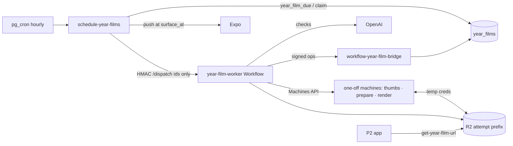

# Feature: Year Film

**Status:** `in-progress` — P1 backend built 2026-09-29 (not deployed); P2 app next
**Last updated:** 2026-09-29
**Plans:** [year-film.md](../plans/year-film.md) (product, dogfood F0–F5) ·
[year-film-p1.md](../plans/year-film-p1.md) (production backend, hardened)

## Overview

Personalized vertical films (1080×1920, ~60s) made from a family's journal:
a **birthday film** per own child (3 days after the birthday, through the
party), a **monthly recap** (the 1st, previous month) and a **year-end family
film** (renders Dec 12, surfaces Dec 15). Never called "Wrapped". Films are
curated by the same pure builders the dogfood stages proved, rendered with
HyperFrames on one-off Fly machines, and stored privately in R2.

## User-facing behavior (P1: backend only)

- Films appear at `surface_at` (birthday +3 days 09:00, the 1st at 19:00,
  Dec 15 09:00 — owner-local); one push, gated on `notify_new_memories`.
- A film never shows content the family removed, edited out of a quote or
  reported: it is blocked immediately and re-made.
- Owners/managers can edit (remove moments, choose the quote among
  candidates, pick the music) — up to 5 edit renders per film and 20 per
  family per day. `hideNames` comes with the P2 edit sheet.
- Rollout: `year_film_settings.mode` `off | canary | all`.

## Architecture

Workflow stages (`cloudflare/year-film-worker/src/workflow.ts`): thumbs
machine (512px claim-check images) → quote pick (sticky) → claim checks →
build + stamp references → prepare machine (stills, ranked cuts, check
frames, WAVs) → voice checks → frame checks → `film.json` → render slot →
render machine → publish CAS. Every verdict is persisted per batch
(`ai_checks`), so retries and re-renders never pay twice.

## Data model

See TECH_SPEC §2.1h. Key rules:
- One row per scheduled film key forever; forced rows are separate.
- `content_epoch` is the invalidation clock; publish requires the epoch the
  attempt curated against and re-verifies every referenced memory, asset,
  member, portrait version, report and quoted text.
- Cycle end: a failed re-render keeps a good (non-blocked) film serving; a
  blocked film that can't be re-made loses its old objects.

## API & Edge Functions

| Function | Auth | Doc |
|---|---|---|
| `schedule-year-films` | `x-cron-secret` | TECH_SPEC §4.27 |
| `workflow-year-film-bridge` | HMAC + nonce | TECH_SPEC §4.28 |
| `get-year-film-url` | JWT | TECH_SPEC §4.29 |
| `save_year_film_edits` (RPC) | JWT, owner/manager | TECH_SPEC §2.1h |

## Code map

| Layer | Files |
|---|---|
| Pure logic (shared by Worker, render job, eval scripts) | `supabase/functions/_shared/year-film-{eligibility,script,quotes,vision,voice,trim,i18n,assets,context,checks,beds}.ts` |
| Worker | `cloudflare/year-film-worker/src/{index,workflow,stages,bridge,fly,r2creds,storage,openai,uuid}.ts` |
| Render job + image | `render/year-film-renderer/{Dockerfile,build.sh,src/job.mjs}`, `film-renderer/assemble.mjs` |
| Database | `supabase/migrations/20260929120000_year_films.sql`, `…120100_schedule_year_films_cron.sql` |
| Operator | `npm run year-film:queue` (`supabase/scripts/queue-year-film.ts`) |
| Dogfood | `npm run eval:year-film-{audit,script,assets}`, `film-renderer/render.mjs` |

## Extension guide

**Safe to extend**
- New scene types: builder (`year-film-script.ts`), `uses()` in
  `year-film-assets.ts`, `scriptReferences()` in `year-film-context.ts` (so
  invalidation covers what it shows), and the assembler module.
- New music bed: `beds.json` + `YEAR_FILM_BEDS` + `public.year_film_bed_ids()`
  (the parity test fails until all three match).

**Do not change without updating this doc**
- Anything that writes `year_films` status outside the RPCs; the epoch/CAS
  rules; the rule that step outputs carry no memory text; the job/status key
  layout shared by `stages.ts` and `job.mjs` (`statusKey`/`jobKey`).

## Constraints & gotchas

- **Fast capture**: no CSS `filter: blur` or `clip-path` in compositions
  (blur is baked by ffmpeg, the wipe is transform-only).
- **Voice level**: the sound scene's voice is measured (`ebur128`) and given
  one linear gain to −14 LUFS, capped at −1.5 dBTP. Never `loudnorm`: the
  image's ffmpeg 5.1 leaves short, quiet speech excerpts untouched (the
  Sep 2026 canary's voice stayed −44 LUFS under the bed). The e2e asserts the
  voice is audible with quiet synthesized speech.
- **Fly**: performance-8x for renders (2x fails with HyperFrames "Missing
  manifest"); machines are one-off (`auto_destroy`), named
  `yf-{attemptId}-{mode}` so a replayed create reuses them.
- **R2 credentials** are minted per machine (object-scoped read,
  attempt-prefix write) when `CF_API_TOKEN`/`R2_PARENT_ACCESS_KEY_ID` are
  set; otherwise the machine uses the Fly app's R2 secrets (accepted
  fallback, like the book renderer).
- **PII**: films and scripts contain family content — service-role columns
  only, owner-prefix keys (account deletion sweeps them), logs are ids and
  codes, never `console.log` memory text.
- **Blocks:** an account blocked by an owner/manager is left out of every
  film of the family (`year_film_parent_blocked_users`, trigger
  `year_films_on_account_blocked`, publish re-check). A viewer's block is
  personal and doesn't change family films (one video for everyone).

## Testing

| Layer | Where |
|---|---|
| pgTAP | `supabase/tests/year_films.sql` (68) + grants/lockdown suites |
| Deno | `_shared/year-film-*.test.ts`, `schedule-year-films`, `workflow-year-film-bridge`, `get-year-film-url`, `delete-family-member` |
| Worker (vitest) | `cloudflare/year-film-worker/test/` |
| Render job | `render/year-film-renderer/test/job.test.mjs`; container run of the sample |
| Export | `cloudflare/momora-export-worker/test/index.test.ts` |

## Changelog

| Date | Change |
|---|---|
| 2026-09-29 | P1 backend: schema + scheduler + bridge + Worker + render job modes + export/deletion wiring |
| 2026-09-29 | Canary: first production film; voice normalization no longer uses `loudnorm` (was silent-ish in the image) |
| 2026-09-29 | Canary: a burst's last frame holds to the scene's whole-beat end (was a plum "dark flash" of up to a beat) |
