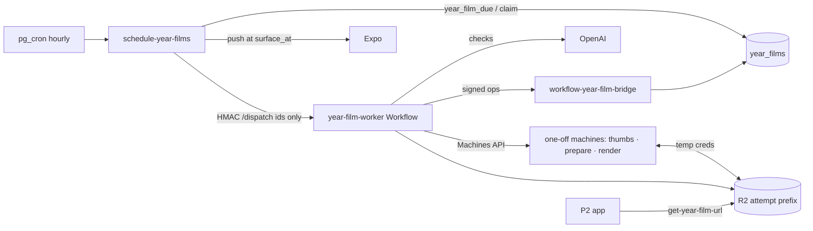

# Feature: Year Film

**Status:** `in-progress` — P1 backend deployed (canary); P2 backend amendments migrated 2026-09-30 (`20260930120000_year_films_p2.sql`); P2 app built (Timeline, player, Keepsakes, drawer, edit sheet); the edit-options migration (`20260930150000_year_film_edit_options.sql`) is local only until the owner deploys
**Last updated:** 2026-09-30
**Plans:** [year-film.md](../plans/year-film.md) (product, dogfood F0–F5) ·
[year-film-p1.md](../plans/year-film-p1.md) (production backend, hardened) ·
[year-film-p2.md](../plans/year-film-p2.md) (app surfaces, date changes, history backfill)

## Overview

Personalized vertical films (1080×1920, ~60s) made from a family's journal:
a **birthday film** per own child (made 2 days after the birthday, covering
through the day after it), a **monthly recap** (the 1st, previous month) and a
**year-end family film** (made Dec 28, surfaces Dec 30). Never called "Wrapped". Films are
curated by the same pure builders the dogfood stages proved, rendered with
HyperFrames on one-off Fly machines, and stored privately in R2.

## User-facing behavior (P1: backend only)

- **Dates (P2, owner-local):** a birthday film is made at 00:30 on
  *birthday + 2* and delivered at 09:00 that day (its scope ends the day after
  the birthday); the monthly recap is made 00:30 on the 1st and delivered 19:00;
  the year-end film is made 00:30 on **Dec 28** (scope Jan 1 – Dec 27) and
  delivered **Dec 30 09:00**. One push at delivery, gated on
  `notify_new_memories`, plus a `film_ready` entry in the notifications drawer
  (written in the same statement — see [family-activity.md](family-activity.md)).
- **Where a film sits (`placement_date`):** birthday → the birthday itself;
  monthly recap → the month's last day; year-end → Dec 31. A stored generated
  column, readable by clients; the app orders/interleaves Timeline cards on it.
- **Operator/canary (`forced`) films are never visible to members** (RLS).
- A film never shows content the family removed, edited out of a quote or
  reported: it is blocked immediately and re-made.
- Owners/managers can edit (remove moments, choose the quote among
  candidates, pick the music) — up to 5 edit renders per film and 20 per
  family per day, from the player's edit sheet (see below). `hideNames` is **not built**:
  the render pipeline has no support for it, so the sheet doesn't offer it.
- Rollout: `year_film_settings.mode` `off | canary | all`.
- **History backfill (silent).** `queue_year_film_backfill` queues every past
  film of an enabled family from the month of its first memory up to
  `least(--through, family-local today)`: own-child birthdays (age 1–12),
  months with ≥ 10 memories, complete years with an own child. Rows are
  ordinary non-forced films with their historic `surface_at` and
  `notified_at = now()`, so **no push and no drawer event**; `on conflict do
  nothing` makes it idempotent; the hourly scheduler renders them 20 at a time
  and thin periods end `skipped` (invisible). It requires the rollout **and**
  billing, ignores `launch_date`, and a dry run (the default) inserts nothing.
  A film due today whose delivery time is later today is also pre-notified
  (arrives silently). `year_films_enabled(family)` tells the app whether the
  next recap will really be attempted (rollout, `launch_date <=` next 1st,
  billing, own child, ≥ 10 memories this month).
  **The backfill is always silent**, including for a film whose historic
  delivery time is still ahead (`notified_at` is set regardless); the launch
  runbook backfills through launch day − 1, so those times are already past.

### Timeline (P2 app)

Every ready film is a **permanent in-feed card** in the Timeline's List view
(no expiry, no temporary top card): a 9:16 cover with a play glyph, the title
("Enzo's Year Four", "September recap", "Your 2026"), a subtitle ("1 minute ·
Oct 2025 – Oct 2026") and a **New** pill until it is watched. Tapping it opens
the player (`yearFilmRoute(id, 'timeline')`).

- **Placement.** `interleaveFilms` (`src/utils/year-films.ts`) puts a film dated
  *d* before the first loaded memory with `memory_date <= d`, so a birthday film
  is the latest item of the birthday, a monthly recap caps its month and the
  year-end film caps its year (above December's recap). A film is shown only
  where the loaded window proves its position: above every loaded memory only
  when there are no newer pages (or, in an anchored month/day jump, when
  `d <= anchorDate`, which is exactly the recap-caps-the-month case); below every
  loaded memory only when there are no older pages. So a paged or anchored
  window never shows a film out of order, and a film above the window appears
  when the newer page lands.
- **Jumps.** A month/day jump aligns the first *row* (film or memory) dated on
  or before the anchor under the control row, so a month's recap card is what
  the reader lands on. The films query is fetched at Timeline mount and an
  anchored list waits for it to settle, so a late film insert cannot be held
  off-screen by `maintainVisibleContentPosition`.
- **Freshness.** The films list is refetched on Timeline focus, on
  pull-to-refresh and on app foreground (60 s stale time).
- **New pill.** `isNewFilm`: not in the caller's `year_film_views` and
  `surface_at` within 14 days (backfilled history is never New); hidden while
  the views query is loading.
- **Calendar view.** A day with a film gets a small dot, and is pressable even
  with no memories (recaps often land on a memory-less month-end); the tap uses
  the normal day path (switch to List anchored at that day).
- **Drawer.** A `film_ready` row opens the player with source `drawer`
  (`FamilyActivitySheet.onOpenFilm`, wired in `timeline.tsx`).
- Code: `app/(app)/(tabs)/timeline.tsx` (rows, alignment), `src/components/year-films/film-card.tsx`,
  `src/components/timeline/calendar-month-grid.tsx`. To extend: film rows are ordinary
  list rows keyed `film:{id}` (never add special rows at index 1 -- Android's
  `maintainVisibleContentPosition` anchors on it).

### Player & share (P2 app)

Route `app/(app)/year-film/[id].tsx` (full-screen, fade), opened with
`yearFilmRoute(id, source)`; `source` (`timeline | keepsakes | push | drawer |
calendar`, default `timeline`) feeds `year_film_opened`.

- **Playback.** `getYearFilmPlayback` (15 min presigned video, poster, scenes).
  The poster (`contain`, dark plum letterbox) shows until the first frame.
  Sound on; on open `pauseAllAudioPlayback()` + `prepareAudioPlaybackMode()`
  (`playsInSilentMode`, recording off) run first, and the mode is left as is
  (every recorder sets its own before recording). Playback also pauses on app
  background and whenever another screen is on top of the player.
- **Shared-object rule.** `useYearFilmPlayer` creates the expo-video player ONCE
  (`createVideoPlayer(null)`), only ever changes source with `replaceAsync`, and
  releases it a frame after unmount. Never `useVideoPlayer` with a changing
  source (commit 25ef6be).
- **Overlay.** Segmented progress from `scenes.json` (equal-width segments, the
  looking-back look; a single segment when the file is missing or malformed),
  tap right = next scene, tap left = previous scene (restarts the current one
  once it has played over 1 s), hold = pause, mute, close. Tapping past the last
  scene completes the film. With a screen reader on, explicit Previous / Pause /
  Next buttons appear and the picture is named after the film.
- **Reduce Motion.** Before playing, a one-line "This film has a lot of motion."
  warning with a Play button (the motion is baked into the video).
- **Errors.** A player error refetches the URLs once (TTL expiry), swaps them in
  with `replaceAsync` and seeks back to the last position; a second failure shows
  "This film couldn't be played." with Try again. A 404/409 shows "This film
  isn't available right now." and refreshes the film lists.
- **Views/analytics.** `year_film_views` insert on first play, `completed_at` at
  the end; `year_film_opened {kind, source}` once, `year_film_completed
  {kind, duration_s}`.
- **Film + family.** The player loads the film row by id (`useYearFilm`, seeded
  from any cached list) and titles it with the members of *its own*
  `family_id`, so a push that opens before the active-family switch still titles
  correctly.
- **Completion overlay.** Replay · Share, plus an extra-actions slot
  (`FilmCompletion.renderExtraActions`) that carries **Edit** for owners and
  managers of the *film's* family (see "Edit sheet").
- **Share.** `useYearFilmShare`: fresh presigned URL → `createDownloadResumable`
  (`expo-file-system/legacy`) into `cache/film-share/{filmId}.mp4` with
  "Preparing video… N%" and Cancel → `Sharing.shareAsync(uri, { mimeType:
  'video/mp4', UTI: 'public.mpeg-4', dialogTitle })` → the file is deleted on
  every exit path (success, cancel, error, unmount). `sweepFilmShareCache()`
  (`src/utils/film-share.ts`, called once from `AppProviders`) clears the folder
  at app start for kills mid-download. Events: `year_film_share_tapped`,
  `year_film_shared` (the sheet returned, not proof of a share), both with
  `source: 'player' | 'completion'`. Share is reachable mid-film from the top
  bar (`year-film-share-top`, "Share film", beside mute/close, only while the
  film is `ready`): it `hold()`s playback, then runs the same flow with the
  download progress + Cancel in `player/film-share-progress.tsx`. The film stays
  paused afterwards; the next tap resumes it without skipping a scene.
- **Push.** `route: 'year-film'` (`filmId`, `familyId`): `useNotifications`
  switches the active family first (Timeline fallback if the recipient left that
  family), refreshes the family's films list and opens the player with source
  `push`; warm and cold start share the path, and on a cold start the player's
  close replaces to the Timeline.
- Code: `app/(app)/year-film/[id].tsx`, `src/hooks/{useYearFilmPlayer,useYearFilmShare,useYearFilm}.ts`,
  `src/components/year-films/player/{film-progress,film-completion,film-share-progress}.tsx`,
  `src/utils/{year-film-scenes,film-share}.ts`. To extend: add controls to the
  route; keep every native-player call in the small adapter functions at the top
  of `useYearFilmPlayer.ts`.

### Edit sheet (P2 app, Step 11)

Owners and managers of the film's family see **Edit** on the completion overlay
(role from `useFamily().memberships` for `film.family_id`, so a push into a
non-active family judges the right role; the RPCs enforce it again). It opens
`FilmEditSheet` (`src/components/year-films/edit/film-edit-sheet.tsx`): a
keyboard-free bottom sheet in the house Modal + pan-to-dismiss pattern (like
`family-activity-sheet.tsx`); the Save footer is outside the scroll area and
above the bottom safe-area inset. The body only mounts while the sheet is open,
and refetches `get_year_film_edit_options` every time.

- **Moments.** A 4-column grid of the moments the film shows (memory
  thumbnails; tap toggles hidden: dimmed + eye-off badge; "N hidden" in the
  header). Memories already removed by an earlier edit are listed too, hidden,
  so they can be restored. Thumbnails: `useYearFilmEditFrames` loads the
  memories with `fetchMemoriesByIds` (40 per call), picks the still with
  `searchResultThumbnail` (illustration unless reported, else the list-sized
  preview/poster) and signs with `useBatchedMediaUrls` — no new signing path;
  reported memories draw nothing (fail closed until reports have loaded).
- **Line of the year** (only when the film has quote candidates, at most 3):
  radio list of the candidates' text + speaker; the chosen quote, else the line
  the film shows, is checked.
- **Music.** The beds made for the film's kind (`bedsForFilmKind` in
  `src/utils/year-film-beds.ts`; a kind with fewer than two — the year-end film
  has one — is offered every bed; the film's current bed is always listed).
  Each row has a play/stop button for a ~5 s preview bundled in the app
  (`assets/audio/film-beds/<id>.m4a`, AAC 64 kbps mono, cut from the bed's
  `drop` time with 0.2 s fades, ~42 KB each), so previews need no network and no
  server change. `useBedPreview` follows the audio conventions: one expo-audio
  player created per mount and re-pointed with `replace()` (never released
  while the rows use it — commit 25ef6be), the `audio-playback-coordinator`
  slot (a preview pauses other audio, other audio and Save pause the preview)
  and the playback audio mode (plays with the iOS silent switch on).
- **Save** is disabled until something changed. It sends `{ removedMemoryIds
  (the full set), quote? , musicBedId? }` (`quote`/`musicBedId` only when
  changed) to `save_year_film_edits`. If any NEW removal is included, an inline
  note reads "Removing moments takes this film down until the new version is
  ready." (the RPC blocks the old video at once). Outcomes: ok → the sheet
  closes, the player shows a "Remaking your film… this takes a few minutes"
  toast and leaves for the previous screen after ~2 s (`router.back()`; the
  film may be blocked); `rate_limited` → "You've remade this film a lot today.
  Try again tomorrow."; `film_not_editable` → "This film can't be edited right
  now." Nothing can dismiss the sheet while a save is in flight. A film that
  isn't editable (`subscription_required`, `not_ready`, `blocked`) shows that
  reason instead of the form.
- **Not built:** `hideNames` (no render support). Removing a moment excludes it
  from the pool at curate; the quote and bed edits are sticky across re-renders.
- **Events:** `year_film_edit_opened {kind}`, `year_film_edit_saved {kind,
  removed_count, quote_changed, music_changed}`.
- **Extend:** a new edit kind = the Worker's `edits` shape
  (`cloudflare/year-film-worker/src/stages.ts`) + the `save_year_film_edits`
  validation + a field in `get_year_film_edit_options` + a section in the
  sheet. A new bed = `beds.json` + `YEAR_FILM_BEDS` (Deno) + the SQL allow-list +
  `src/utils/year-film-beds.ts` + its preview (`ffmpeg -ss <drop> -t 5 -i
  <bed>.mp3 -af afade=t=in:st=0:d=0.2,afade=t=out:st=4.8:d=0.2 -ac 1 -c:a aac
  -b:a 64k assets/audio/film-beds/<id>.m4a`); `year-film-beds.test.ts` fails
  until they match.
- Code: `src/components/year-films/edit/{film-edit-sheet,edit-moments-grid,edit-quote-list,edit-music-list,edit-film-button}.tsx`,
  `src/hooks/{useBedPreview,useYearFilmEditFrames}.ts`,
  `useYearFilmEditOptions` / `useSaveYearFilmEdits` in `src/hooks/useYearFilms.ts`,
  `getYearFilmEditOptions` / `saveYearFilmEdits` in `src/services/year-films.ts`.

## Architecture



Workflow stages (`cloudflare/year-film-worker/src/workflow.ts`): thumbs
machine (512px claim-check images) → quote pick (sticky) → claim checks →
build + stamp references → prepare machine (stills, ranked cuts, check
frames, WAVs) → voice checks → frame checks → `film.json` → render slot →
render machine → publish CAS. Every verdict is persisted per batch
(`ai_checks`), so retries and re-renders never pay twice.

## Data model

See TECH_SPEC §2.1h. Key rules:
- One row per scheduled film key forever; forced rows are separate.
- `content_epoch` is the invalidation clock; publish requires the epoch the
  attempt curated against and re-verifies every referenced memory, asset,
  member, portrait version, report and quoted text.
- Cycle end: a failed re-render keeps a good (non-blocked) film serving; a
  blocked film that can't be re-made loses its old objects.

## API & Edge Functions

| Function | Auth | Doc |
|---|---|---|
| `schedule-year-films` | `x-cron-secret` | TECH_SPEC §4.27 |
| `workflow-year-film-bridge` | HMAC + nonce | TECH_SPEC §4.28 |
| `get-year-film-url` | JWT | TECH_SPEC §4.29 |
| `save_year_film_edits` (RPC) | JWT, owner/manager | TECH_SPEC §2.1h |
| `get_year_film_edit_options` (RPC) | JWT, owner/manager | TECH_SPEC §2.1h |

## Code map

| Layer | Files |
|---|---|
| Pure logic (shared by Worker, render job, eval scripts) | `supabase/functions/_shared/year-film-{eligibility,script,quotes,vision,voice,trim,i18n,assets,context,checks,beds}.ts` |
| Worker | `cloudflare/year-film-worker/src/{index,workflow,stages,bridge,fly,r2creds,storage,openai,uuid}.ts` |
| Render job + image | `render/year-film-renderer/{Dockerfile,build.sh,src/job.mjs}`, `film-renderer/assemble.mjs` |
| Database | `supabase/migrations/20260929120000_year_films.sql`, `…120100_schedule_year_films_cron.sql`, `20260930120000_year_films_p2.sql`, `20260930150000_year_film_edit_options.sql` |
| Operator | `npm run year-film:queue` (`supabase/scripts/queue-year-film.ts`) — list, `--forced`, `--requeue`, `--requeue-all`, `--backfill`, `--delete-forced`, `--delete-backfilled`, `--purge-prefix` |
| Dogfood | `npm run eval:year-film-{audit,script,assets}`, `film-renderer/render.mjs` |

## Operator runbook (backfill)

All commands are a dry run unless `--apply`; output is ids, dates and statuses
only.

```bash
# 1. What would the backfill queue? (table: due_date, kind, member, age, scope start, would_insert)
npm run year-film:queue -- --family <id> --backfill --through 2026-09-29
# 2. Smoke subset first (one film key = <kind>:<scope_start_date>), then check cover + film
npm run year-film:queue -- --family <id> --backfill --through 2026-09-29 --only family_month:2026-09-01 --apply
# 3. The rest (the film already queued is reported as not inserted)
npm run year-film:queue -- --family <id> --backfill --through 2026-09-29 --apply
# Launch day: every enabled family
npm run year-film:queue -- --all-families --backfill --through <launch day - 1> --apply
# Redo a bad backfill
npm run year-film:queue -- --requeue-all --family <id> --apply        # re-render every non-forced film
npm run year-film:queue -- --family <id> --delete-backfilled --apply  # backfill-only rows + their R2 prefixes (see below)
```

`--delete-backfilled` only selects rows that can have come from the backfill:
with `launch_date` unset, every non-forced row of the family; once it is set,
only non-forced rows whose `scope_end_exclusive` (the due date) is before
`launch_date`. The dry run prints how many rows the rule excluded, so real
scheduled films after launch are never touched.

`--delete-forced` / `--delete-backfilled` delete each film's R2 prefix
`{ownerId}/year-films/{filmId}/` first, then the rows, and refuse while a film
of the selection is mid-attempt. `--purge-prefix <filmId>` removes a leftover
prefix that has no row. Preconditions before backfilling for real: the P2
migration, the new Worker (it bundles the `_shared` date constants) and the new
image (settled cover + `poster_thumb.jpg`) are live — backfilled covers are
permanent.

## Extension guide

**Safe to extend**
- New scene types: builder (`year-film-script.ts`), `uses()` in
  `year-film-assets.ts`, `scriptReferences()` in `year-film-context.ts` (so
  invalidation covers what it shows), and the assembler module.
- New music bed: `beds.json` + `YEAR_FILM_BEDS` + `public.year_film_bed_ids()`
  + the app manifest and bundled preview (`src/utils/year-film-beds.ts`,
  `assets/audio/film-beds/`); the parity tests fail until all match.

**Do not change without updating this doc**
- Anything that writes `year_films` status outside the RPCs; the epoch/CAS
  rules; the rule that step outputs carry no memory text; the job/status key
  layout shared by `stages.ts` and `job.mjs` (`statusKey`/`jobKey`).

## Constraints & gotchas

- **Fast capture**: no CSS `filter: blur` or `clip-path` in compositions
  (blur is baked by ffmpeg, the wipe is transform-only).
- **Voice level**: the sound scene's voice is measured (`ebur128`) and given
  one linear gain to −14 LUFS, capped at −1.5 dBTP. Never `loudnorm`: the
  image's ffmpeg 5.1 leaves short, quiet speech excerpts untouched (the
  Sep 2026 canary's voice stayed −44 LUFS under the bed). The e2e asserts the
  voice is audible with quiet synthesized speech.
- **Fly**: performance-8x for renders (2x fails with HyperFrames "Missing
  manifest"); machines are one-off (`auto_destroy`), named
  `yf-{attemptId}-{mode}` so a replayed create reuses them.
- **Fly partial root filesystem** (Sep 2026): machines started at the same
  moment from a fresh image sometimes miss files that are in the image
  (`Cannot find package …/@puppeteer/browsers/lib/main.js`, `Missing browser
  script layout-audit.browser.js`), surfacing as `STEP_CHECK`. Two defenses:
  the image writes `/app/image-manifest.txt` and `job.mjs` verifies it at
  startup (waits up to 60 s, else `status.json` `failed` / `IMAGE_INCOMPLETE`,
  which the Worker maps to the `IMAGE_INCOMPLETE` failure code so the cycle
  ends and retries on a fresh machine), and the Worker sleeps a deterministic
  0-45 s (`step.sleep('<mode>:jitter')`, derived from attempt id + mode) before
  creating each thumbs/prepare/render machine. New root-level paths the job
  needs must be added to the Dockerfile's manifest `find`.
- **R2 credentials** are minted per machine (object-scoped read,
  attempt-prefix write) when `CF_API_TOKEN`/`R2_PARENT_ACCESS_KEY_ID` are
  set; otherwise the machine uses the Fly app's R2 secrets (accepted
  fallback, like the book renderer).
- **PII**: films and scripts contain family content — service-role columns
  only, owner-prefix keys (account deletion sweeps them), logs are ids and
  codes, never `console.log` memory text.
- **Blocks:** an account blocked by an owner/manager is left out of every
  film of the family (`year_film_parent_blocked_users`, trigger
  `year_films_on_account_blocked`, publish re-check). A viewer's block is
  personal and doesn't change family films (one video for everyone).

## Testing

| Layer | Where |
|---|---|
| pgTAP | `supabase/tests/year_films.sql` (156: scheduling/dates, placement, forced RLS, `year_films_enabled`, candidate-row parity sweep, backfill, edit options + edit re-save), `supabase/tests/family_activity.sql` (`film_ready`, v2) + grants/lockdown suites |
| Deno | `_shared/year-film-*.test.ts`, `schedule-year-films`, `workflow-year-film-bridge`, `get-year-film-url`, `delete-family-member` |
| Worker (vitest) | `cloudflare/year-film-worker/test/` |
| Render job | `render/year-film-renderer/test/job.test.mjs`; container run of the sample |
| Export | `cloudflare/momora-export-worker/test/index.test.ts` |
| App player/share | `src/screen-tests/year-film-player.integration.test.tsx` (mocked expo-video), `src/hooks/useYearFilm.integration.test.tsx`, `src/utils/{year-film-scenes,film-share,year-film-beds}.test.ts` (the bed manifest is parity-tested against `beds.json` and the SQL allow-list), `useNotifications.test.ts` (`year-film` push); edit sheet: `src/components/year-films/edit/film-edit-sheet.integration.test.tsx`, `src/hooks/{useBedPreview,useYearFilmEditFrames}.test.ts(x)`, the edit cases in `useYearFilms.integration.test.tsx` and `src/services/year-films.integration.test.ts`; Maestro `.maestro/flows/year-film/open-from-keepsakes.yaml` |

## Changelog

| Date | Change |
|---|---|
| 2026-09-29 | P1 backend: schema + scheduler + bridge + Worker + render job modes + export/deletion wiring |
| 2026-09-29 | Canary: first production film; voice normalization no longer uses `loudnorm` (was silent-ish in the image) |
| 2026-09-29 | Canary: a burst's last frame holds to the scene's whole-beat end (was a plum "dark flash" of up to a beat) |
| 2026-09-30 | P2 backend: birthday due +2, year-end Dec 28/Dec 30, `placement_date`, forced films hidden from members, `film_ready` drawer event + v2 activity RPCs, `year_films_enabled`, silent history backfill (`year_film_candidate_rows`, `queue_year_film_backfill`), operator flags, poster-thumb delete keys |
| 2026-09-30 | P2 app: full-screen player (scene progress, tap/hold, Reduce Motion warning, URL-expiry retry), share via cache download, `year-film` push route |
| 2026-09-30 | P2 app: owner/manager edit sheet from the completion overlay (hide moments, line of the year, music with bundled 5 s previews); `get_year_film_edit_options` RPC; `save_year_film_edits` now accepts earlier removals in the full set; `hideNames` stays unbuilt |
| 2026-09-30 | Render job: image-manifest startup guard (`IMAGE_INCOMPLETE`) + Worker dispatch jitter against Fly partial-rootfs machine starts |
