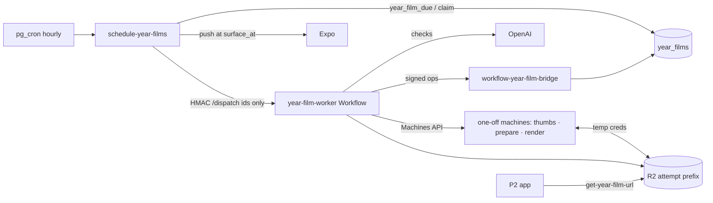

# Feature: Year Film

**Status:** `in-progress` — P1 backend deployed (canary); P2 backend amendments migrated 2026-09-30 (`20260930120000_year_films_p2.sql`); P2 app next
**Last updated:** 2026-09-29
**Plans:** [year-film.md](../plans/year-film.md) (product, dogfood F0–F5) ·
[year-film-p1.md](../plans/year-film-p1.md) (production backend, hardened) ·
[year-film-p2.md](../plans/year-film-p2.md) (app surfaces, date changes, history backfill)

## Overview

Personalized vertical films (1080×1920, ~60s) made from a family's journal:
a **birthday film** per own child (made 2 days after the birthday, covering
through the day after it), a **monthly recap** (the 1st, previous month) and a
**year-end family film** (made Dec 28, surfaces Dec 30). Never called "Wrapped". Films are
curated by the same pure builders the dogfood stages proved, rendered with
HyperFrames on one-off Fly machines, and stored privately in R2.

## User-facing behavior (P1: backend only)

- **Dates (P2, owner-local):** a birthday film is made at 00:30 on
  *birthday + 2* and delivered at 09:00 that day (its scope ends the day after
  the birthday); the monthly recap is made 00:30 on the 1st and delivered 19:00;
  the year-end film is made 00:30 on **Dec 28** (scope Jan 1 – Dec 27) and
  delivered **Dec 30 09:00**. One push at delivery, gated on
  `notify_new_memories`, plus a `film_ready` entry in the notifications drawer
  (written in the same statement — see [family-activity.md](family-activity.md)).
- **Where a film sits (`placement_date`):** birthday → the birthday itself;
  monthly recap → the month's last day; year-end → Dec 31. A stored generated
  column, readable by clients; the app orders/interleaves Timeline cards on it.
- **Operator/canary (`forced`) films are never visible to members** (RLS).
- A film never shows content the family removed, edited out of a quote or
  reported: it is blocked immediately and re-made.
- Owners/managers can edit (remove moments, choose the quote among
  candidates, pick the music) — up to 5 edit renders per film and 20 per
  family per day. `hideNames` comes with the P2 edit sheet.
- Rollout: `year_film_settings.mode` `off | canary | all`.
- **History backfill (silent).** `queue_year_film_backfill` queues every past
  film of an enabled family from the month of its first memory up to
  `least(--through, family-local today)`: own-child birthdays (age 1–12),
  months with ≥ 10 memories, complete years with an own child. Rows are
  ordinary non-forced films with their historic `surface_at` and
  `notified_at = now()`, so **no push and no drawer event**; `on conflict do
  nothing` makes it idempotent; the hourly scheduler renders them 20 at a time
  and thin periods end `skipped` (invisible). It requires the rollout **and**
  billing, ignores `launch_date`, and a dry run (the default) inserts nothing.
  A film due today whose delivery time is later today is also pre-notified
  (arrives silently). `year_films_enabled(family)` tells the app whether the
  next recap will really be attempted (rollout, `launch_date <=` next 1st,
  billing, own child, ≥ 10 memories this month).
  **The backfill is always silent**, including for a film whose historic
  delivery time is still ahead (`notified_at` is set regardless); the launch
  runbook backfills through launch day − 1, so those times are already past.

## Architecture



Workflow stages (`cloudflare/year-film-worker/src/workflow.ts`): thumbs
machine (512px claim-check images) → quote pick (sticky) → claim checks →
build + stamp references → prepare machine (stills, ranked cuts, check
frames, WAVs) → voice checks → frame checks → `film.json` → render slot →
render machine → publish CAS. Every verdict is persisted per batch
(`ai_checks`), so retries and re-renders never pay twice.

## Data model

See TECH_SPEC §2.1h. Key rules:
- One row per scheduled film key forever; forced rows are separate.
- `content_epoch` is the invalidation clock; publish requires the epoch the
  attempt curated against and re-verifies every referenced memory, asset,
  member, portrait version, report and quoted text.
- Cycle end: a failed re-render keeps a good (non-blocked) film serving; a
  blocked film that can't be re-made loses its old objects.

## API & Edge Functions

| Function | Auth | Doc |
|---|---|---|
| `schedule-year-films` | `x-cron-secret` | TECH_SPEC §4.27 |
| `workflow-year-film-bridge` | HMAC + nonce | TECH_SPEC §4.28 |
| `get-year-film-url` | JWT | TECH_SPEC §4.29 |
| `save_year_film_edits` (RPC) | JWT, owner/manager | TECH_SPEC §2.1h |

## Code map

| Layer | Files |
|---|---|
| Pure logic (shared by Worker, render job, eval scripts) | `supabase/functions/_shared/year-film-{eligibility,script,quotes,vision,voice,trim,i18n,assets,context,checks,beds}.ts` |
| Worker | `cloudflare/year-film-worker/src/{index,workflow,stages,bridge,fly,r2creds,storage,openai,uuid}.ts` |
| Render job + image | `render/year-film-renderer/{Dockerfile,build.sh,src/job.mjs}`, `film-renderer/assemble.mjs` |
| Database | `supabase/migrations/20260929120000_year_films.sql`, `…120100_schedule_year_films_cron.sql`, `20260930120000_year_films_p2.sql` |
| Operator | `npm run year-film:queue` (`supabase/scripts/queue-year-film.ts`) — list, `--forced`, `--requeue`, `--requeue-all`, `--backfill`, `--delete-forced`, `--delete-backfilled`, `--purge-prefix` |
| Dogfood | `npm run eval:year-film-{audit,script,assets}`, `film-renderer/render.mjs` |

## Operator runbook (backfill)

All commands are a dry run unless `--apply`; output is ids, dates and statuses
only.

```bash
# 1. What would the backfill queue? (table: due_date, kind, member, age, scope start, would_insert)
npm run year-film:queue -- --family <id> --backfill --through 2026-09-29
# 2. Smoke subset first (one film key = <kind>:<scope_start_date>), then check cover + film
npm run year-film:queue -- --family <id> --backfill --through 2026-09-29 --only family_month:2026-09-01 --apply
# 3. The rest (the film already queued is reported as not inserted)
npm run year-film:queue -- --family <id> --backfill --through 2026-09-29 --apply
# Launch day: every enabled family
npm run year-film:queue -- --all-families --backfill --through <launch day - 1> --apply
# Redo a bad backfill
npm run year-film:queue -- --requeue-all --family <id> --apply        # re-render every non-forced film
npm run year-film:queue -- --family <id> --delete-backfilled --apply  # backfill-only rows + their R2 prefixes (see below)
```

`--delete-backfilled` only selects rows that can have come from the backfill:
with `launch_date` unset, every non-forced row of the family; once it is set,
only non-forced rows whose `scope_end_exclusive` (the due date) is before
`launch_date`. The dry run prints how many rows the rule excluded, so real
scheduled films after launch are never touched.

`--delete-forced` / `--delete-backfilled` delete each film's R2 prefix
`{ownerId}/year-films/{filmId}/` first, then the rows, and refuse while a film
of the selection is mid-attempt. `--purge-prefix <filmId>` removes a leftover
prefix that has no row. Preconditions before backfilling for real: the P2
migration, the new Worker (it bundles the `_shared` date constants) and the new
image (settled cover + `poster_thumb.jpg`) are live — backfilled covers are
permanent.

## Extension guide

**Safe to extend**
- New scene types: builder (`year-film-script.ts`), `uses()` in
  `year-film-assets.ts`, `scriptReferences()` in `year-film-context.ts` (so
  invalidation covers what it shows), and the assembler module.
- New music bed: `beds.json` + `YEAR_FILM_BEDS` + `public.year_film_bed_ids()`
  (the parity test fails until all three match).

**Do not change without updating this doc**
- Anything that writes `year_films` status outside the RPCs; the epoch/CAS
  rules; the rule that step outputs carry no memory text; the job/status key
  layout shared by `stages.ts` and `job.mjs` (`statusKey`/`jobKey`).

## Constraints & gotchas

- **Fast capture**: no CSS `filter: blur` or `clip-path` in compositions
  (blur is baked by ffmpeg, the wipe is transform-only).
- **Voice level**: the sound scene's voice is measured (`ebur128`) and given
  one linear gain to −14 LUFS, capped at −1.5 dBTP. Never `loudnorm`: the
  image's ffmpeg 5.1 leaves short, quiet speech excerpts untouched (the
  Sep 2026 canary's voice stayed −44 LUFS under the bed). The e2e asserts the
  voice is audible with quiet synthesized speech.
- **Fly**: performance-8x for renders (2x fails with HyperFrames "Missing
  manifest"); machines are one-off (`auto_destroy`), named
  `yf-{attemptId}-{mode}` so a replayed create reuses them.
- **R2 credentials** are minted per machine (object-scoped read,
  attempt-prefix write) when `CF_API_TOKEN`/`R2_PARENT_ACCESS_KEY_ID` are
  set; otherwise the machine uses the Fly app's R2 secrets (accepted
  fallback, like the book renderer).
- **PII**: films and scripts contain family content — service-role columns
  only, owner-prefix keys (account deletion sweeps them), logs are ids and
  codes, never `console.log` memory text.
- **Blocks:** an account blocked by an owner/manager is left out of every
  film of the family (`year_film_parent_blocked_users`, trigger
  `year_films_on_account_blocked`, publish re-check). A viewer's block is
  personal and doesn't change family films (one video for everyone).

## Testing

| Layer | Where |
|---|---|
| pgTAP | `supabase/tests/year_films.sql` (128: scheduling/dates, placement, forced RLS, `year_films_enabled`, candidate-row parity sweep, backfill), `supabase/tests/family_activity.sql` (`film_ready`, v2) + grants/lockdown suites |
| Deno | `_shared/year-film-*.test.ts`, `schedule-year-films`, `workflow-year-film-bridge`, `get-year-film-url`, `delete-family-member` |
| Worker (vitest) | `cloudflare/year-film-worker/test/` |
| Render job | `render/year-film-renderer/test/job.test.mjs`; container run of the sample |
| Export | `cloudflare/momora-export-worker/test/index.test.ts` |

## Changelog

| Date | Change |
|---|---|
| 2026-09-29 | P1 backend: schema + scheduler + bridge + Worker + render job modes + export/deletion wiring |
| 2026-09-29 | Canary: first production film; voice normalization no longer uses `loudnorm` (was silent-ish in the image) |
| 2026-09-29 | Canary: a burst's last frame holds to the scene's whole-beat end (was a plum "dark flash" of up to a beat) |
| 2026-09-30 | P2 backend: birthday due +2, year-end Dec 28/Dec 30, `placement_date`, forced films hidden from members, `film_ready` drawer event + v2 activity RPCs, `year_films_enabled`, silent history backfill (`year_film_candidate_rows`, `queue_year_film_backfill`), operator flags, poster-thumb delete keys |
